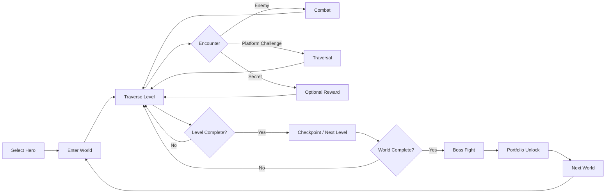
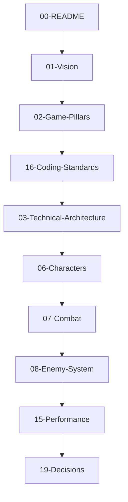
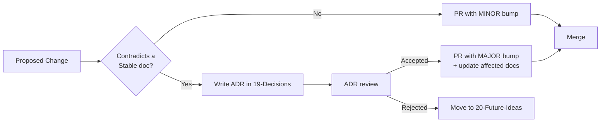
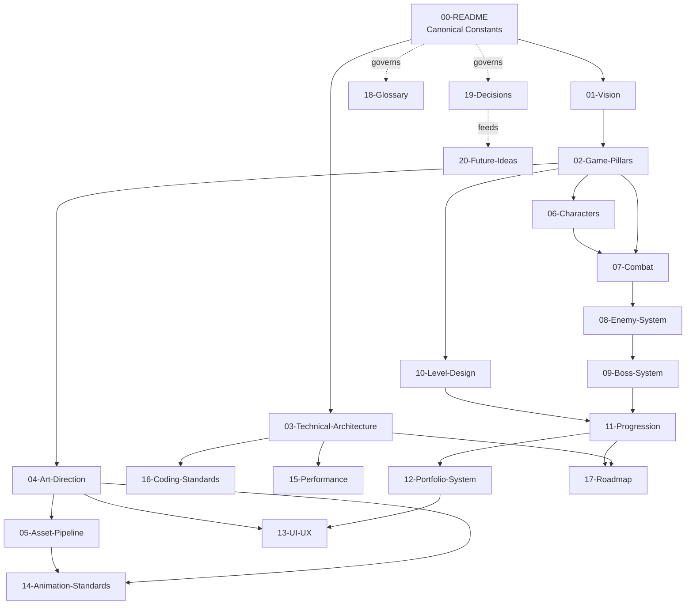

# 00 — README / Documentation Index

**Project:** DevQuest (Working Title)
**Document Owner:** Technical Director
**Status:** Living Document
**Version:** 1.0.0
**Last Updated:** 2026-08-07

---

## 1. Purpose

This document is the entry point to the DevQuest design and technical documentation set. It exists so that any contributor — a gameplay engineer joining in month nine, a pixel artist producing a new enemy pack, a QA contractor writing a test plan — can orient themselves in under fifteen minutes and know exactly which document answers their question.

This is not a summary of the other documents. It is a **map**, a **contract**, and a **set of conventions**. Where this document states a value (resolution, tile size, target frame rate), that value is **canonical** and every other document defers to it. Where another document contradicts this one, this one wins until the contradiction is resolved by an entry in `19-Decisions.md`.

The documentation set as a whole is written to a single standard: **an experienced Phaser 3 developer should be able to implement any described system without asking a clarifying question.** Where a decision has not yet been made, the document says so explicitly and records it as an open question rather than papering over it with vague language.

---

## 2. Goals

| #   | Goal                                                               | Success Signal                                                                     |
| --- | ------------------------------------------------------------------ | ---------------------------------------------------------------------------------- |
| G1  | Provide a single navigable index to all project documentation      | Any contributor finds the right document in under 60 seconds                       |
| G2  | Establish canonical constants used across every document           | No document defines a conflicting value for resolution, tile size, gravity, or FPS |
| G3  | Define documentation conventions (structure, diagrams, versioning) | Every document in `docs/` conforms to the 13-section template                      |
| G4  | Define the onboarding path for new contributors by role            | A new engineer is productive on day one; a new artist on day one                   |
| G5  | Record documentation status and ownership                          | Every document has an owner and a status flag                                      |
| G6  | Define the change-control process for documentation                | Design changes flow through `19-Decisions.md`, not through silent edits            |

---

## 3. Design Principles

### P1 — Documentation is Code

Documentation lives in the repository, is reviewed via pull request, and is versioned alongside the source. A change to combat tuning that is not reflected in `07-Combat.md` is an incomplete change.

### P2 — Single Source of Truth

Every fact lives in exactly one document. Other documents **link** to it, they do not **restate** it. The canonical-constants table in §5 of this document is the root of that tree.

### P3 — Specification Over Description

"The player dashes" is description. "Dash applies a horizontal velocity of 260 px/s for 150 ms, ignores input during the dash, and enters a 500 ms cooldown measured from dash start" is specification. Every document targets the second register.

### P4 — Rationale Is Mandatory

Numbers without rationale rot. Every tuned value carries a one-line justification, and every architectural choice carries a "why not the alternative" note. This is what allows a future contributor to change a value safely.

### P5 — No Placeholders

A section that says "TBD" is acceptable **only** when accompanied by an owner and a target date. A section that says "details to be determined later" with no owner is a defect and should be caught in review.

### P6 — Diagrams for Structure, Prose for Nuance

Mermaid diagrams express state machines, flows, and dependencies. Prose expresses intent, edge cases, and rationale. Neither substitutes for the other.

---

## 4. Overview

### 4.1 What DevQuest Is

DevQuest is a **2D side-scrolling action platformer** built for the browser in Phaser 3 and TypeScript. The player picks one of four heroes and fights through five handcrafted worlds of hand-authored levels, culminating in a boss fight per world.

Each boss defeated unlocks one section of the developer's portfolio: About Me, Projects, Experience, Skills, Contact.

### 4.2 What DevQuest Is Not

- **Not a portfolio website.** The portfolio is a reward layer bolted onto a game that stands alone. If you deleted the portfolio system entirely, DevQuest would still be a complete, satisfying action platformer. That is the design test applied to every portfolio-related feature.
- **Not an RPG.** There are no experience points, no levels, no stat allocation, no dialogue trees, no inventory management screen. Progression is expressed through permanent world unlocks, health containers, and a small equippable charm system — nothing that turns combat into arithmetic.
- **Not procedurally generated.** Every level is authored by hand in Tiled. Procedural generation is explicitly out of scope for the shipping product.
- **Not a metroidvania.** Levels are discrete and linear-with-branches. There is no interconnected world map requiring backtracking through previously visited terrain with new abilities.

### 4.3 The Core Loop



### 4.4 The Reward Loop

Defeating a boss triggers a **Codex Unlock** — a diegetic, in-fiction presentation of a portfolio section, framed as recovering a lost fragment of knowledge. The unlock is celebratory, skippable, and permanently re-readable from the Codex menu.

---

## 5. Canonical Constants

**These values are authoritative.** Every other document, and every constant in code, derives from this table. Code references them from `src/config/GameConstants.ts`, which is generated to match this table exactly.

### 5.1 Display

| Constant       | Value              | Rationale                                                                |
| -------------- | ------------------ | ------------------------------------------------------------------------ |
| `GAME_WIDTH`   | `320`              | Internal render width in pixels                                          |
| `GAME_HEIGHT`  | `180`              | Internal render height. 16:9, integer-scales to 720p (×4) and 1080p (×6) |
| `TILE_SIZE`    | `16`               | Tile edge in pixels. Screen is exactly 20 × 11.25 tiles                  |
| `RENDER_MODE`  | `WebGL`            | Canvas fallback permitted but untuned                                    |
| `SCALE_MODE`   | `Phaser.Scale.FIT` | With `autoRound: true` and integer zoom snapping                         |
| `PIXEL_ART`    | `true`             | Sets `NEAREST` texture filtering globally                                |
| `ROUND_PIXELS` | `true`             | Prevents sub-pixel sprite placement                                      |
| `ANTIALIAS`    | `false`            | Non-negotiable for the art style                                         |
| `TARGET_FPS`   | `60`               | Hard target on a 2019 MacBook Air baseline                               |
| `MAX_DELTA_MS` | `33.34`            | Delta clamp — two frames. Prevents tunnelling after a stall              |

### 5.2 Physics

| Constant            | Value  | Unit  | Rationale                                                   |
| ------------------- | ------ | ----- | ----------------------------------------------------------- |
| `GRAVITY_Y`         | `900`  | px/s² | Tuned so a 240 px/s jump peaks at exactly 32 px (2 tiles)   |
| `MAX_FALL_SPEED`    | `300`  | px/s  | Terminal velocity; keeps falls readable at 320×180          |
| `FALL_GRAVITY_MULT` | `1.35` | ×     | Applied while `vy > 0`. Makes jumps feel snappy, not floaty |
| `APEX_GRAVITY_MULT` | `0.70` | ×     | Applied while `abs(vy) < 40`. Extends apex "hang time"      |
| `APEX_THRESHOLD`    | `40`   | px/s  | Velocity window that counts as apex                         |
| `PHYSICS_FPS`       | `60`   | Hz    | Arcade Physics fixed step                                   |
| `TILE_BIAS`         | `8`    | px    | Arcade tile bias. Prevents corner-catching on 16 px tiles   |

### 5.3 Feel

| Constant            | Value  | Unit | Rationale                                                |
| ------------------- | ------ | ---- | -------------------------------------------------------- |
| `COYOTE_TIME`       | `100`  | ms   | 6 frames. Celeste ships 5; 6 suits our slower base speed |
| `JUMP_BUFFER`       | `120`  | ms   | ~7 frames. Buffers a jump pressed before landing         |
| `VARIABLE_JUMP_CUT` | `0.45` | ×    | `vy *= 0.45` on early jump-button release                |
| `DASH_SPEED`        | `260`  | px/s | Default; per-character overrides in `06-Characters.md`   |
| `DASH_DURATION`     | `150`  | ms   | Travels ~39 px ≈ 2.4 tiles                               |
| `DASH_COOLDOWN`     | `500`  | ms   | Measured from dash **start**, not end                    |
| `PLAYER_IFRAME_MS`  | `800`  | ms   | Post-damage invulnerability                              |
| `IFRAME_FLICKER_MS` | `100`  | ms   | Alpha toggle period during i-frames                      |

### 5.4 Combat Feedback

| Constant          | Value           | Unit    | Rationale                                |
| ----------------- | --------------- | ------- | ---------------------------------------- |
| `HITSTOP_LIGHT`   | `60`            | ms      | Standard hit                             |
| `HITSTOP_HEAVY`   | `110`           | ms      | Charged / heavy attack                   |
| `HITSTOP_KILL`    | `140`           | ms      | Killing blow                             |
| `HITFLASH_MS`     | `80`            | ms      | White `tintFill` duration                |
| `SHAKE_LIGHT`     | `0.004 / 90ms`  | amp/dur | Standard hit                             |
| `SHAKE_HEAVY`     | `0.008 / 150ms` | amp/dur | Boss slam, explosion                     |
| `KNOCKBACK_LIGHT` | `70`            | px/s    | Applied horizontally, decays over 200 ms |
| `KNOCKBACK_HEAVY` | `140`           | px/s    | With a −60 px/s vertical pop             |

### 5.5 Performance Budget

| Budget           | Value      | Enforcement                               |
| ---------------- | ---------- | ----------------------------------------- |
| Frame budget     | `16.67 ms` | Perf HUD warns above 14 ms                |
| Logic update     | `≤ 6 ms`   | Profiled per-system in dev builds         |
| Render           | `≤ 6 ms`   | Draw-call counter in Spector.js           |
| Draw calls       | `≤ 40`     | Atlas discipline; see `15-Performance.md` |
| Texture memory   | `≤ 128 MB` | Enforced by atlas budget in build step    |
| Active entities  | `≤ 40`     | Off-screen culling and pooling            |
| Live particles   | `≤ 200`    | Hard pool cap                             |
| Initial download | `≤ 8 MB`   | Boot + Hub + World 1                      |

### 5.6 Content Scope

| Item                          | Count                       |
| ----------------------------- | --------------------------- |
| Playable characters           | 4                           |
| Worlds                        | 5                           |
| Levels per world              | 4 (3 stages + 1 boss arena) |
| Total levels                  | 20                          |
| Enemy base types              | 7                           |
| Enemy variants (incl. elites) | 21                          |
| Bosses                        | 5                           |
| Portfolio sections            | 5                           |
| Target playtime (first clear) | 3.5 – 4.5 hours             |
| Target playtime (100%)        | 7 – 9 hours                 |

---

## 6. World and Unlock Map

| #   | World              | Tileset                                             | Backdrop           | New Mechanic                                         | Boss             | Portfolio Unlock |
| --- | ------------------ | --------------------------------------------------- | ------------------ | ---------------------------------------------------- | ---------------- | ---------------- |
| 1   | **Verdant Ascent** | Green Zone                                          | Nature             | Moving & one-way platforms, bounce caps              | Skeleton Warlord | **About Me**     |
| 2   | **Autumn Reach**   | Autumn Forest                                       | Fairy Tale         | Wind zones, crumbling branches, updrafts             | Alpha Werewolf   | **Projects**     |
| 3   | **Hollow Barrow**  | Forbidden Graveyard                                 | Fairy Tale (night) | Lantern light radius, fog, soul-braziers             | Oni Lord (Yokai) | **Experience**   |
| 4   | **Crystal Deep**   | Crystal Cave                                        | Custom gradient    | Refracted light beams, low-gravity fields, conveyors | Golem Sovereign  | **Skills**       |
| 5   | **Gorgon's Spire** | Castle _(pack TBD — see `05-Asset-Pipeline.md` §9)_ | Fairy Tale (storm) | Timed gate sequences, turrets, petrify gaze zones    | **Gorgon**       | **Contact**      |

Full level-by-level breakdowns are in `10-Level-Design.md`.

---

## 7. Document Index

Each document follows the 13-section template defined in §9.

| Doc                            | Title                       | Owner          | Status    | Read If You Are…              |
| ------------------------------ | --------------------------- | -------------- | --------- | ----------------------------- |
| `00-README.md`                 | Documentation Index         | Tech Director  | ✅ Stable | Anyone. Start here.           |
| `01-Vision.md`                 | Vision & Product Definition | Game Director  | ✅ Stable | Anyone. Read second.          |
| `02-Game-Pillars.md`           | Game Pillars                | Game Director  | ✅ Stable | Anyone making a design call   |
| `03-Technical-Architecture.md` | Technical Architecture      | Tech Director  | ✅ Stable | Every engineer                |
| `04-Art-Direction.md`          | Art Direction               | Art Director   | ✅ Stable | Artists, VFX, UI              |
| `05-Asset-Pipeline.md`         | Asset Pipeline              | Art Director   | ✅ Stable | Artists, tools engineers      |
| `06-Characters.md`             | Playable Characters         | Lead Designer  | ✅ Stable | Gameplay engineers, animators |
| `07-Combat.md`                 | Combat System               | Lead Designer  | ✅ Stable | Gameplay engineers            |
| `08-Enemy-System.md`           | Enemy Framework             | Lead Designer  | ✅ Stable | Gameplay engineers, AI        |
| `09-Boss-System.md`            | Boss Framework              | Lead Designer  | ✅ Stable | Gameplay engineers            |
| `10-Level-Design.md`           | Level Design                | Level Designer | ✅ Stable | Level designers, tools        |
| `11-Progression.md`            | Progression & Economy       | Lead Designer  | ✅ Stable | Designers, systems engineers  |
| `12-Portfolio-System.md`       | Portfolio / Codex System    | Game Director  | ✅ Stable | UI engineers, content         |
| `13-UI-UX.md`                  | UI & UX                     | UX Designer    | ✅ Stable | UI engineers, designers       |
| `14-Animation-Standards.md`    | Animation Standards         | Art Director   | ✅ Stable | Animators, engineers          |
| `15-Performance.md`            | Performance & Memory        | Tech Director  | ✅ Stable | Every engineer                |
| `16-Coding-Standards.md`       | Coding Standards            | Tech Director  | ✅ Stable | Every engineer                |
| `17-Roadmap.md`                | 12-Month Roadmap            | Producer       | 🔄 Living | Everyone, monthly             |
| `18-Glossary.md`               | Glossary                    | Tech Director  | 🔄 Living | Anyone confused by a term     |
| `19-Decisions.md`              | Decision Log (ADRs)         | Tech Director  | 🔄 Living | Anyone questioning a choice   |
| `20-Future-Ideas.md`           | Future Ideas / Icebox       | Game Director  | 🔄 Living | Anyone with an idea           |

**Status legend:** ✅ Stable (changes require an ADR) · 🔄 Living (append freely) · ⚠️ Draft (do not implement from this yet)

---

## 8. Reading Paths by Role

### 8.1 New Gameplay Engineer



**Day one deliverable:** clone, `npm ci`, `npm run dev`, reach the Hub scene, and read `03` §7 (Scene Lifecycle) end to end.

### 8.2 New Artist

`00-README` → `04-Art-Direction` → `05-Asset-Pipeline` → `14-Animation-Standards` → the specific content doc (`06`, `08`, `09`, or `10`).

**Day one deliverable:** run the atlas build (`npm run assets:build`), confirm the output atlas matches the committed one byte-for-byte, and read the Style Bible checklist in `04` §6.

### 8.3 New Level Designer

`00-README` → `02-Game-Pillars` → `10-Level-Design` → `08-Enemy-System` (§6 Encounter Grammar) → `11-Progression`.

**Day one deliverable:** open `levels/w1/1-1.tmx` in Tiled, load the project's custom-property templates, and produce a 30-second greybox that round-trips through the exporter.

### 8.4 New UI Engineer

`00-README` → `13-UI-UX` → `12-Portfolio-System` → `04-Art-Direction` (§8 UI Style) → `16-Coding-Standards`.

### 8.5 Producer / Stakeholder

`01-Vision` → `17-Roadmap` → `11-Progression` → `12-Portfolio-System`.

---

## 9. Documentation Conventions

### 9.1 Required Section Template

Every document numbered `01`–`20` contains these sections, in this order, using these headings:

```
1. Purpose
2. Goals
3. Design Principles
4. Overview
5. Technical Design
6. Implementation Notes
7. Architecture
8. Examples
9. Data Structures
10. Future Expansion
11. Acceptance Criteria
12. Out of Scope
13. Cross References
```

Documents may insert additional numbered sections between these where the material demands it (for example, `06-Characters.md` has one full section per hero). The thirteen required headings must all be present and must not be renamed.

### 9.2 Writing Rules

- **Second person for instructions**, third person for descriptions of the system.
- **Present tense.** "The dash applies 260 px/s," not "the dash will apply."
- **Units always.** `260 px/s`, `150 ms`, `16 px`. Never a bare number for a physical quantity.
- **Tables over bullet lists** for anything with more than two attributes per item.
- **Code blocks are TypeScript** unless labelled otherwise. They are illustrative unless marked `// NORMATIVE`, in which case the shipping code must match the shape exactly.
- **File references** use repo-relative paths in backticks: `src/systems/CombatSystem.ts`.

### 9.3 Diagram Conventions

All diagrams are Mermaid, rendered inline. No binary image files in `docs/` except reference screenshots in `docs/assets/`.

| Diagram Type      | Mermaid Kind      | Used For                         |
| ----------------- | ----------------- | -------------------------------- |
| System dependency | `flowchart TD`    | Module and system relationships  |
| Entity behaviour  | `stateDiagram-v2` | Any finite state machine         |
| Runtime sequence  | `sequenceDiagram` | Cross-system message flows       |
| Data model        | `classDiagram`    | Interface and type relationships |
| Timeline          | `gantt`           | Roadmap only                     |

**Rule:** every state machine described in prose must also appear as a `stateDiagram-v2`. There are no exceptions to this — state machines are where implementations diverge from specs.

### 9.4 Versioning

Each document header carries `Version: MAJOR.MINOR.PATCH`.

- **PATCH** — typos, clarifications, formatting. No review required.
- **MINOR** — new sections, added detail, new examples. One reviewer.
- **MAJOR** — a change that invalidates existing implementation or contradicts a previous version. **Requires an ADR entry in `19-Decisions.md` and two reviewers.**

### 9.5 Change Control



A tuning change to a value in §5 of this document requires updating: this table, `src/config/GameConstants.ts`, and any document that cites the value. The CI check `docs:constants` diffs the table against the source file and fails the build on mismatch.

---

## 10. Technical Design (of the Documentation Itself)

### 10.1 Repository Layout for Docs

```
devquest/
├── docs/
│   ├── 00-README.md          ← you are here
│   ├── 01-Vision.md
│   ├── …
│   ├── 20-Future-Ideas.md
│   └── assets/               ← reference screenshots, mood boards
│       ├── ref/
│       └── mockups/
├── src/
├── public/
└── tools/
    └── docs/
        ├── check-constants.ts   ← CI: table ↔ code parity
        └── check-template.ts    ← CI: 13-section conformance
```

### 10.2 CI Checks on Documentation

| Check                | Script                          | Failure Condition                             |
| -------------------- | ------------------------------- | --------------------------------------------- |
| Template conformance | `tools/docs/check-template.ts`  | A doc `01`–`20` is missing a required heading |
| Constant parity      | `tools/docs/check-constants.ts` | §5 table diverges from `GameConstants.ts`     |
| Link integrity       | `markdown-link-check`           | A relative link resolves to nothing           |
| Mermaid validity     | `mmdc --validate`               | A diagram fails to parse                      |
| Spelling             | `cspell`                        | Unknown word not in `project-words.txt`       |

These run on every pull request that touches `docs/**` or `src/config/GameConstants.ts`.

### 10.3 Exporting to PDF

For stakeholder distribution:

```bash
npm run docs:pdf
```

Runs Pandoc over `docs/*.md` in numeric order with a custom LaTeX template, resolving Mermaid via `mermaid-filter`, and emits `build/DevQuest-Documentation.pdf` with a table of contents, page numbers, and per-document section breaks.

---

## 11. Implementation Notes

### 11.1 Bootstrapping the Repository

The documentation assumes the following project skeleton exists before any gameplay work begins. This is the **only** place the bootstrap sequence is written down.

```bash
npm create vite@latest devquest -- --template vanilla-ts
cd devquest
npm i phaser@^3.90.0
npm i -D vite-plugin-checker typescript eslint prettier vitest @vitest/coverage-v8
npm i -D free-tex-packer-core sharp     # atlas build
npm i -D @types/node
```

`vite.config.ts` must set `base: './'` so the build is portable to a subdirectory host, and must configure `assetsInclude: ['**/*.tmj']` so Tiled JSON maps are importable.

### 11.2 What Documentation Cannot Do

Documentation cannot capture **feel**. The numbers in §5.3 are a starting point derived from analysis of comparable games; they are expected to change during the Feel Prototype milestone (`17-Roadmap.md` M1). When they change, the table changes with them. Do not treat pre-prototype tuning values as sacred — treat the _process_ of tuning them as sacred.

### 11.3 Handling Contradictions

If you find two documents that disagree:

1. Check `19-Decisions.md` for a relevant ADR — it may already be resolved.
2. If not, the value in `00-README.md` §5 wins for constants; otherwise the document that **owns** the topic wins (see the index in §7).
3. Open an issue tagged `docs:contradiction` regardless. A contradiction that resolved itself in your head will not resolve itself in the next reader's.

---

## 12. Architecture (Documentation Dependency Graph)



**Reading the graph:** an arrow from A to B means "B depends on decisions made in A." Changing a document with many outgoing arrows is expensive. `02-Game-Pillars.md` and `00-README.md` §5 are the two highest-leverage documents in the set — treat edits to them with proportional care.

---

## 13. Examples

### 13.1 A Well-Formed Specification

> **Coyote Time.** After the player leaves a ground surface without jumping, a `COYOTE_TIME` (100 ms) window opens during which a jump input still produces a full ground jump. The window is cancelled immediately by: (a) a successful jump, (b) a dash, (c) re-grounding, or (d) taking damage. The timer is stored as an absolute timestamp (`coyoteExpiresAt: number`), not a countdown, so it is immune to frame-rate variation and does not require per-frame decrement. Rationale: 100 ms is six frames at 60 fps; playtests of comparable games place the perceptual threshold for "that should have counted" between 80 ms and 130 ms, and our slower base run speed places us at the upper half of that band.

Note what this contains: the value, the unit, the exact cancellation conditions, the implementation representation, and the rationale.

### 13.2 A Poorly-Formed Specification

> The player has coyote time so jumps feel forgiving. It should be tuned to feel good.

This is a defect. It states an intent without a value, a unit, an edge case, or a way to verify the implementation is correct.

### 13.3 Citing a Canonical Constant

In prose, cite by name and value together on first use in a document, then by name alone:

> Gravity is `GRAVITY_Y` (900 px/s²) at all times except during the apex window, where `APEX_GRAVITY_MULT` scales it. […] Because `GRAVITY_Y` is shared with enemies, an enemy's arc matches the player's at the same launch velocity.

---

## 14. Data Structures

The only data structure this document owns is the generated constants module, which every other module imports. It is normative.

```ts
// src/config/GameConstants.ts
// NORMATIVE — mirrors docs/00-README.md §5. CI enforces parity.

export const DISPLAY = {
  WIDTH: 320,
  HEIGHT: 180,
  TILE: 16,
  TARGET_FPS: 60,
  MAX_DELTA_MS: 33.34,
} as const;

export const PHYSICS = {
  GRAVITY_Y: 900,
  MAX_FALL_SPEED: 300,
  FALL_GRAVITY_MULT: 1.35,
  APEX_GRAVITY_MULT: 0.7,
  APEX_THRESHOLD: 40,
  TILE_BIAS: 8,
} as const;

export const FEEL = {
  COYOTE_TIME: 100,
  JUMP_BUFFER: 120,
  VARIABLE_JUMP_CUT: 0.45,
  DASH_SPEED: 260,
  DASH_DURATION: 150,
  DASH_COOLDOWN: 500,
  PLAYER_IFRAME_MS: 800,
  IFRAME_FLICKER_MS: 100,
} as const;

export const FEEDBACK = {
  HITSTOP_LIGHT: 60,
  HITSTOP_HEAVY: 110,
  HITSTOP_KILL: 140,
  HITFLASH_MS: 80,
  SHAKE_LIGHT: { amplitude: 0.004, duration: 90 },
  SHAKE_HEAVY: { amplitude: 0.008, duration: 150 },
  KNOCKBACK_LIGHT: 70,
  KNOCKBACK_HEAVY: 140,
  KNOCKBACK_HEAVY_LIFT: -60,
} as const;

export const BUDGET = {
  FRAME_MS: 16.67,
  UPDATE_MS: 6,
  RENDER_MS: 6,
  MAX_DRAW_CALLS: 40,
  MAX_TEXTURE_MB: 128,
  MAX_ACTIVE_ENTITIES: 40,
  MAX_PARTICLES: 200,
} as const;
```

Deep-freezing is unnecessary — `as const` plus `noUncheckedIndexedAccess` in `tsconfig` gives compile-time immutability, and runtime mutation of a module-level const is a code-review failure, not a runtime concern.

---

## 15. Future Expansion

| Item                         | Trigger                       | Notes                                                                                                  |
| ---------------------------- | ----------------------------- | ------------------------------------------------------------------------------------------------------ |
| Localised documentation      | First non-English contributor | Only `01`, `02`, `17` would be translated; technical docs stay English                                 |
| Auto-generated API reference | Codebase exceeds ~150 modules | TypeDoc into `docs/api/`, excluded from the PDF export                                                 |
| Living tuning dashboard      | Feel Prototype complete       | A dev-build overlay that reads and writes §5 constants live, then emits a diff to paste into the table |
| Video reference library      | Vertical Slice complete       | Screen recordings of each boss and each new mechanic, linked from the relevant doc                     |
| Steam-specific supplement    | Steam port greenlit           | New `21-Steam-Port.md`; see `03-Technical-Architecture.md` §14 for current considerations              |

---

## 16. Acceptance Criteria

This document is complete and correct when:

- [ ] Every file listed in §7 exists in `docs/` and conforms to the §9.1 template.
- [ ] `npm run docs:check` passes all five CI checks in §10.2.
- [ ] The §5 constants table matches `src/config/GameConstants.ts` exactly (verified by `check-constants`).
- [ ] A contributor unfamiliar with the project can follow §8 for their role and reach the stated day-one deliverable without asking a question.
- [ ] Every world listed in §6 has a corresponding fully specified section in `10-Level-Design.md`.
- [ ] `npm run docs:pdf` produces a PDF with a complete table of contents and no broken diagrams.
- [ ] No document contains "TBD" without an adjacent owner and target date.

---

## 17. Out of Scope

The following are explicitly **not** covered by this documentation set, and requests to cover them should be redirected:

- **Marketing, store pages, and press materials.** Owned by the Producer outside `docs/`.
- **Legal review of asset licences.** `05-Asset-Pipeline.md` records licence _status_ and the verification procedure; it is not legal advice, and a lawyer signs off before commercial release.
- **The actual portfolio copy** (the text of About Me, Projects, etc.). `12-Portfolio-System.md` defines the _system_ and the _content schema_; the prose lives in `src/data/portfolio/*.json` and is authored by the developer.
- **Audio design.** No audio assets are locked (see the brief). A future `21-Audio.md` will be written when an audio pack is selected; until then, `13-UI-UX.md` and `07-Combat.md` specify only the _hook points_ where audio will attach.
- **Multiplayer of any kind.** See `20-Future-Ideas.md`.
- **Procedural level generation.** Permanently out of scope for the shipping product.
- **Mobile / touch controls.** Desktop browser first; see `20-Future-Ideas.md` for the touch investigation.

---

## 18. Cross References

| Topic                                                | Document                       |
| ---------------------------------------------------- | ------------------------------ |
| Why the game exists, and for whom                    | `01-Vision.md`                 |
| The five pillars and how to apply them to a decision | `02-Game-Pillars.md`           |
| Systems, scenes, and module boundaries               | `03-Technical-Architecture.md` |
| Palette, pixel density, and the Style Bible          | `04-Art-Direction.md`          |
| Asset evaluation, licensing, atlas build             | `05-Asset-Pipeline.md`         |
| Hero stats, abilities, and per-character feel        | `06-Characters.md`             |
| Damage, hitstop, hurtboxes, and combat resolution    | `07-Combat.md`                 |
| Enemy AI framework and the seven base types          | `08-Enemy-System.md`           |
| Boss framework, phases, and the five encounters      | `09-Boss-System.md`            |
| Level structure, Tiled workflow, all 20 levels       | `10-Level-Design.md`           |
| Unlocks, collectibles, charms, save data             | `11-Progression.md`            |
| The Codex and portfolio reward layer                 | `12-Portfolio-System.md`       |
| Menus, HUD, input remapping, accessibility           | `13-UI-UX.md`                  |
| Frame counts, timing, and animation authoring rules  | `14-Animation-Standards.md`    |
| Budgets, pooling, and optimisation strategy          | `15-Performance.md`            |
| TypeScript style, naming, testing, git workflow      | `16-Coding-Standards.md`       |
| The 12-month plan and milestone gates                | `17-Roadmap.md`                |
| Term definitions                                     | `18-Glossary.md`               |
| Why we chose X over Y                                | `19-Decisions.md`              |
| Ideas parked for after ship                          | `20-Future-Ideas.md`           |
