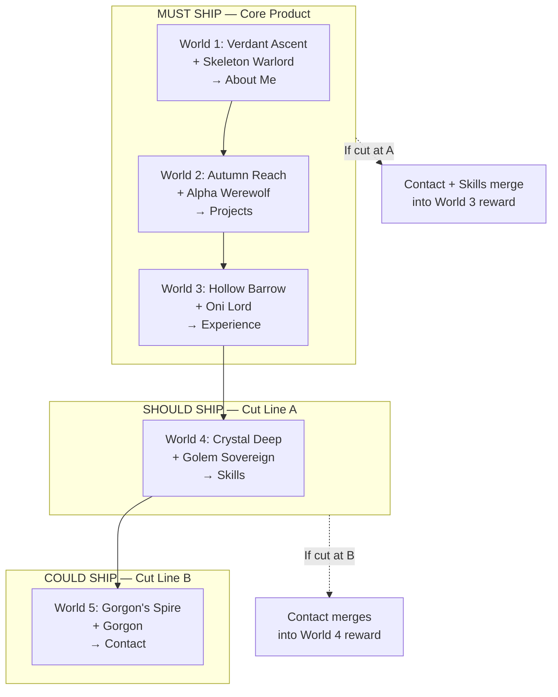
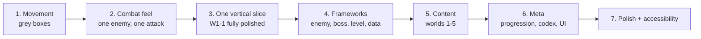
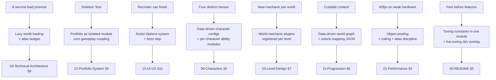

# 01 — Vision & Product Definition

**Project:** DevQuest (Working Title)
**Document Owner:** Game Director
**Status:** ✅ Stable
**Version:** 1.0.0
**Last Updated:** 2026-08-07

---

## 1. Purpose

This document defines **what DevQuest is, who it is for, why it should exist, and what "done" means.** It is the document every other document defers to when a question of intent arises.

Every project of this length — twelve months, largely solo or small-team — dies the same way: not from a hard technical problem, but from scope creep dressed as ambition and from a slow drift away from the original reason the thing was fun. This document is the anchor against that drift. When someone proposes a feature, the question is not "is this cool?" but "does this serve the vision written here?"

If a proposed change requires editing this document, that change is a **strategic pivot** and needs an ADR in `19-Decisions.md`, not a pull request.

---

## 2. Goals

| #   | Goal                                                         | Success Signal                                                               |
| --- | ------------------------------------------------------------ | ---------------------------------------------------------------------------- |
| G1  | State the product definition in one unambiguous paragraph    | Anyone can repeat the elevator pitch after one read                          |
| G2  | Define the target audience and their expectations            | Feature debates resolve by asking "does the audience want this?"             |
| G3  | Establish the competitive frame and what we borrow from whom | Comparisons are specific and mechanical, not vibes-based                     |
| G4  | Define the "portfolio second" constraint operationally       | There exists a concrete test for whether a portfolio feature has overstepped |
| G5  | Define measurable success criteria for launch                | We can say objectively whether the project succeeded                         |
| G6  | Define non-goals with the same precision as goals            | Scope creep is caught at proposal, not at implementation                     |
| G7  | Define the risk register and mitigations                     | Known failure modes have owners and countermeasures                          |

---

## 3. Design Principles

These are the three project-level principles from which the five game pillars (`02-Game-Pillars.md`) derive.

### P1 — Gameplay Before Graphics

A grey box that feels perfect ships. A beautiful scene that feels wrong does not. Every milestone gate in `17-Roadmap.md` is a **feel** gate before it is a **content** gate. The Feel Prototype (M1) ships with untextured rectangles and must be fun before a single tileset is imported.

**Operational consequence:** the movement controller is written, tuned, and locked before the first character sprite is integrated. If tuning and art integration compete for time, tuning wins.

### P2 — Feel Before Features

Given a choice between a third character ability and 40 ms of hitstop tuning across all existing abilities, tune the hitstop. Breadth is cheap to add later; a foundation that feels wrong contaminates everything built on top of it.

**Operational consequence:** the feature backlog is ordered by _depth on existing systems_ before _new systems_, and every milestone reserves 20% of its time for polish on what already exists.

### P3 — Polish Before Content

Five worlds that are excellent beat eight worlds that are adequate. The content plan in `10-Level-Design.md` — 5 worlds, 20 levels — is a **ceiling**, not a floor. If quality is at risk, worlds are cut, not polished less. World 5 is designed to be cuttable without breaking the portfolio unlock chain (see §7.4).

**Operational consequence:** the roadmap contains explicit cut-lines at M4 and M7 where content is reduced rather than schedule extended.

---

## 4. Overview

### 4.1 The One-Paragraph Definition

> **DevQuest is a browser-based 2D side-scrolling action platformer in which you pick one of four heroes — Knight, Samurai, Ninja, or Wizard — and fight through five handcrafted worlds of precision platforming and hit-stop-heavy melee combat. Each world ends with a boss, and each boss defeated unlocks one section of the developer's portfolio inside the game's Codex. The platforming and combat are built to the standard of a commercial indie action platformer; the portfolio is a reward layer that could be removed entirely without diminishing the game.**

### 4.2 The Elevator Pitch (30 seconds)

"It's a Celeste-tight, Dead-Cells-crunchy action platformer that happens to be a developer's résumé. You don't scroll a webpage to see their work — you beat a boss and earn it. Four heroes with genuinely different playstyles, five worlds each introducing a new mechanic, and a combat system where every hit stops the frame and shakes the screen. The portfolio is the trophy shelf, not the game."

### 4.3 The Genre Frame

DevQuest sits at the intersection of three established shapes:

| Reference         | What We Take                                                                                                                                   | What We Explicitly Do Not Take                                                                        |
| ----------------- | ---------------------------------------------------------------------------------------------------------------------------------------------- | ----------------------------------------------------------------------------------------------------- |
| **Celeste**       | Movement fidelity: coyote time, jump buffering, variable jump height, air control, the discipline of tuning one verb until it is perfect       | Assist mode complexity, narrative weight, single-screen room structure, wall-climbing as a core verb  |
| **Dead Cells**    | Hit feel: hitstop, screen shake, damage numbers, enemy stagger, the "crunch" of a connected blow. Weapon-identity-driven playstyle differences | Roguelike structure, permadeath, procedural generation, build randomisation, item economy             |
| **Hollow Knight** | Combat legibility: clear enemy tells, generous but honest hitboxes, boss encounters as authored set-pieces with distinct phases                | Metroidvania interconnection, map exploration, sprawling scope, atmospheric restraint (we are louder) |
| **Mega Man X**    | Level-per-world structure, a new mechanic per world, character-select-driven replay                                                            | Weapon-stealing, boss weakness rock-paper-scissors, 8-boss non-linear select                          |

**Where we differ from all four:** the portfolio unlock layer, and a four-character roster where the character is chosen once per run rather than swapped mid-level.

### 4.4 The Portfolio Constraint

This is the single most important structural rule in the project, and it is the one most likely to be violated under pressure.

> **The Deletion Test.** At any point in development, if you deleted every line of the portfolio system — the Codex scene, the unlock triggers, the JSON content, the menu entry — the remaining game must still be a complete, satisfying, shippable action platformer with a clear win condition.

Concretely, this means:

- Bosses are designed as **boss fights first**. The portfolio unlock is appended to the death sequence; it does not shape the encounter design.
- The Codex is a **menu**, reachable from pause and main menu. It never interrupts gameplay for more than the 4-second unlock flourish (which is skippable).
- No level gates on portfolio content. You never have to read the About Me section to open a door.
- No portfolio content in the HUD.
- The developer's name and identity appear in exactly three places: the title screen byline, the Codex, and the credits.

**Failure mode this guards against:** the project becomes a website with a game attached, which is a worse website and a worse game than either done separately.

---

## 5. Technical Design

### 5.1 Platform Definition

| Attribute              | Decision                                   | Rationale                                                                         |
| ---------------------- | ------------------------------------------ | --------------------------------------------------------------------------------- |
| **Primary platform**   | Desktop web browser                        | Zero-install is the point — a recruiter clicks a link and is playing in 8 seconds |
| **Browsers supported** | Chrome/Edge 120+, Firefox 120+, Safari 17+ | Covers >95% of desktop traffic; all have solid WebGL2 and Gamepad API             |
| **Minimum hardware**   | 2019 MacBook Air (Intel UHD 617), 8 GB RAM | Deliberately low. If it runs at 60 fps here it runs everywhere                    |
| **Input**              | Keyboard (primary), Gamepad (full parity)  | Both are first-class; neither is a port of the other                              |
| **Orientation**        | Landscape only                             | 320×180 is a 16:9 internal buffer                                                 |
| **Network**            | None required after load                   | Fully offline-capable once cached. No backend, no accounts                        |
| **Secondary platform** | Steam (Electron/Tauri wrapper)             | Post-launch. See `03-Technical-Architecture.md` §14                               |

### 5.2 The Load-Time Promise

The single hardest technical constraint imposed by the platform choice:

> **From clicking the link to controlling a character: 8 seconds on a 25 Mbit connection.**

This drives the entire asset strategy (`05-Asset-Pipeline.md`) and the performance budget (`15-Performance.md`). Concretely: an ≤ 8 MB initial payload containing Boot, Preloader, Main Menu, Character Select, Hub, and World 1. Worlds 2–5 stream in the background while the player is in World 1.

This is not a nice-to-have. A recruiter with 90 seconds of patience who spends 25 of them on a loading bar is a lost player.

### 5.3 Session Shape

| Session Type                  | Duration      | Design Requirement                                                                                           |
| ----------------------------- | ------------- | ------------------------------------------------------------------------------------------------------------ |
| **The Recruiter Session**     | 3–8 minutes   | Must reach the first boss and unlock About Me within 12 minutes of play. World 1 is tuned as the shop window |
| **The Casual Session**        | 20–40 minutes | One world per sitting. Checkpoints and world boundaries align to this                                        |
| **The Completionist Session** | 2 hours+      | Secret hunting, charm collection, character re-runs                                                          |

**Consequence:** the save system must checkpoint aggressively and resume instantly. A player who closes the tab mid-level and returns tomorrow resumes at the last checkpoint with zero friction and no "continue?" prompt ambiguity. See `11-Progression.md` §8.

---

## 6. Target Audience

### 6.1 Primary Audience — The Technical Recruiter / Hiring Manager

**Who they are:** Evaluating the developer for a role. Has 90 seconds of curiosity and 15 minutes of interest if the first 90 seconds land. May not be a gamer.

**What they need:**

- To be playing, not reading, within 10 seconds.
- Controls that make sense without a tutorial screen.
- A visible reason to keep going (progress bar, unlock preview).
- A path to the portfolio content that does not require skill they lack.

**Design consequences:**

- World 1-1 teaches movement through level geometry, not text.
- **Assist Options** exist and are surfaced in the pause menu without shame framing: infinite health, damage reduction, slow-motion, skip-boss-after-3-deaths. See `13-UI-UX.md` §11.
- The Codex is reachable from the main menu at any time, showing locked entries as silhouettes — the reward is legible before it is earned.
- A "Skip to Codex" option appears in the pause menu after three deaths on any boss. This is the pressure-release valve that keeps the portfolio constraint honest: the game never traps its most important audience behind a skill wall.

### 6.2 Secondary Audience — The Fellow Developer

**Who they are:** A peer who found the link on social media or a developer forum. Games-literate, code-literate, likely to look at the repository.

**What they need:**

- Mechanical depth that respects them.
- Evidence of engineering quality — clean code, real architecture, no shortcuts.
- Something to talk about: a clever mechanic, a well-tuned boss.

**Design consequences:**

- The repository is public and the code is written to be read (`16-Coding-Standards.md`).
- Character playstyles are genuinely different, not stat re-skins.
- Boss fights reward pattern mastery.
- A developer-facing debug overlay ships in the production build behind a key combo, because that is itself a portfolio artifact.

### 6.3 Tertiary Audience — The Action Platformer Player

**Who they are:** Found the game as a game. Does not care about the portfolio. Plays Celeste, Dead Cells, Katana Zero.

**What they need:**

- Tight controls, no compromises.
- Real challenge available.
- Reasons to replay: four characters, secrets, time trials.

**Design consequences:**

- The Deletion Test (§4.4) exists primarily to serve this audience.
- Difficulty is honest by default; Assist Options are opt-in and never suggested unsolicited except after repeated boss failures.
- Post-launch content targets this group (`20-Future-Ideas.md`).

### 6.4 Anti-Audience

We are explicitly **not** building for:

- **Mobile touch players.** 320×180 precision platforming does not survive a virtual d-pad.
- **Speedrunners as a primary consideration.** We will not break the game to prevent sequence-breaking, and we will add a timer, but routing depth is not a design goal.
- **Players wanting a narrative experience.** There is world-building flavour; there is no story campaign, no dialogue, no cutscene beyond boss intros.
- **Players wanting an RPG.** Reiterated because it is the most common suggestion for "portfolio game" and it is wrong for this project — see §7.2.

---

## 7. Product Definition

### 7.1 Feature Set — Shipping Scope

| Category          | Feature                                                                                                       | Priority                       |
| ----------------- | ------------------------------------------------------------------------------------------------------------- | ------------------------------ |
| **Movement**      | Run, jump (variable height), coyote time, jump buffer, air control, dash, one-way platforms, landing recovery | P0                             |
| **Combat**        | 3-hit ground combo, air attack, hitstop, hitflash, knockback, damage numbers, i-frames, enemy stagger         | P0                             |
| **Characters**    | 4 heroes, each with unique stats, unique special, unique feel                                                 | P0                             |
| **Enemies**       | 7 base types, 3 tiers each (basic / veteran / elite) = 21 configurations                                      | P0                             |
| **Bosses**        | 5 multi-phase encounters with intro, arena, death sequence                                                    | P0                             |
| **Levels**        | 20 handcrafted levels across 5 worlds                                                                         | P0                             |
| **Mechanics**     | 5 world-specific mechanic sets (one per world, never repeated)                                                | P0                             |
| **Progression**   | Health shards, charms (3 slots), coins, world unlocks                                                         | P0                             |
| **Portfolio**     | Codex with 5 sections, unlock ceremony, re-readable                                                           | P0                             |
| **UI**            | Main menu, character select, world select, HUD, pause, settings, victory, game over, Codex                    | P0                             |
| **Save**          | LocalStorage, versioned schema, 3 slots, auto-save at checkpoints                                             | P0                             |
| **Input**         | Keyboard + gamepad, full remapping, hot-swap detection                                                        | P0                             |
| **Accessibility** | Assist options, reduced motion, screen shake toggle, colourblind-safe UI, hold-vs-toggle                      | P0                             |
| **Audio**         | Music, SFX, mixer with per-channel volume                                                                     | P1 — _assets not yet selected_ |
| **Extras**        | Time trial mode, boss rush, gallery                                                                           | P2                             |

### 7.2 Why Not an RPG — The Detailed Answer

This is documented at length because it is the single most frequently proposed pivot for a "portfolio game," and it must be refutable without re-litigating.

**The proposal usually is:** make it an RPG, so that "levelling up" maps to career progression, "skills" map to technical skills, "quests" map to projects.

**Why it is rejected:**

1. **The metaphor is cute for ten seconds and tedious for two hours.** A pun does not sustain a play session. The player who "gets it" at minute one has nothing left at minute thirty.
2. **RPG systems demand content volume we cannot produce.** A satisfying RPG needs dozens of hours of encounters, items, and dialogue. A satisfying action platformer needs four hours of excellent levels. With a twelve-month solo-scale budget, only one of these is achievable at a shippable quality bar.
3. **RPG combat is arithmetic; action combat is skill.** Our pillars (`02-Game-Pillars.md`) are built on _feel_. Turn-based or stat-driven combat has no hitstop, no knockback, no screen shake — it removes the entire second pillar.
4. **It fails the Deletion Test.** An RPG whose stats are career metaphors collapses without the metaphor. An action platformer does not.
5. **It is the expected answer.** Every developer-portfolio-game is an RPG. Building an action platformer is itself a differentiator.

**Recorded as:** `ADR-001` in `19-Decisions.md`.

### 7.3 Why Not a Portfolio Website — The Detailed Answer

**The proposal usually is:** the game is a gimmick; just build a beautiful, fast website.

**Why the game is the right call _for this specific goal_:**

1. A website demonstrates that you can build a website. A 60 fps game engine build with a data-driven enemy framework, object pooling, a state-machine-driven boss system, and a documented architecture demonstrates considerably more.
2. Time-on-page for a portfolio site is measured in seconds. Time-in-game for a competent platformer is measured in tens of minutes.
3. **The hedge:** a plain, fast, accessible HTML résumé is _also_ shipped at the same domain under `/resume`, linked from the title screen and the Codex. The game does not replace the résumé; it is the reason someone reads it. This is non-negotiable and is in scope — see `12-Portfolio-System.md` §12.

**Recorded as:** `ADR-002` in `19-Decisions.md`.

### 7.4 The Cut-Line Structure

Scope must be cuttable under schedule pressure without breaking the product. The content is therefore designed with explicit severance points.



**Cut Line A** (invoked at M7 if World 4 is not playable): Worlds 4 and 5 are dropped. The Oni Lord becomes the final boss and unlocks Experience, Skills, and Contact together. The game is 12 levels, three worlds, three hours. This is still a complete product.

**Cut Line B** (invoked at M9 if World 5 is not playable): World 5 is dropped. Golem Sovereign becomes the final boss and unlocks both Skills and Contact.

**The rule:** portfolio sections are _never_ cut. Only the worlds that gate them are. The unlock mapping is data-driven precisely so a cut is a JSON edit, not a refactor. See `12-Portfolio-System.md` §9.

### 7.5 Definition of Done — The Product

DevQuest is shippable when all of the following are true:

1. A player can start from a cold browser cache, reach the first boss, and unlock About Me in under 12 minutes.
2. All shipped worlds run at a sustained 60 fps on the minimum hardware (§5.1) with no frame drops exceeding 33 ms.
3. All four characters are completable through all shipped worlds.
4. All five portfolio sections are reachable and readable.
5. Save/load survives a browser restart, a version upgrade, and a corrupted-save injection test.
6. Gamepad and keyboard have full feature parity, including all menus and the Codex.
7. Assist Options allow a non-gamer to reach the credits.
8. No P0 or P1 bugs open. See `16-Coding-Standards.md` §12 for severity definitions.
9. Every asset in the build has a verified licence recorded in `05-Asset-Pipeline.md`.
10. The `/resume` static page is live and linked.

---

## 8. Implementation Notes

### 8.1 The Order of Construction

The build order is derived directly from P1–P3 and is not negotiable without an ADR:



**The critical insight:** step 4 (frameworks) comes _after_ step 3 (vertical slice), not before. Building a generic enemy framework before you have shipped one enemy that feels good produces a framework that generalises the wrong things. The vertical slice is what teaches you what the framework needs to abstract.

This is the inverse of the instinct to "build the architecture first," and it is deliberate. See `19-Decisions.md` `ADR-004`.

### 8.2 The Twelve-Month Reality

Assume a solo or two-person team working at a sustainable pace. The scope in §7.1 is achievable **only** because:

- Art is licensed, not produced. CraftPix packs eliminate the single largest cost centre.
- There is no backend, no accounts, no networking.
- There is no procedural generation, no simulation, no physics beyond Arcade AABB.
- The level count (20) is small and the levels are short (2–4 minutes each).
- Audio is deferred and will be licensed, not composed.

If any of these assumptions breaks — particularly "art is licensed" — the scope must be re-cut immediately at the nearest cut line, not absorbed.

### 8.3 What Kills This Project

Recorded plainly, because naming the failure mode is the cheapest mitigation available:

| Failure Mode                                                                | Probability | Impact   | Mitigation                                                                      |
| --------------------------------------------------------------------------- | ----------- | -------- | ------------------------------------------------------------------------------- |
| **Tuning paralysis** — endlessly polishing movement, never shipping content | High        | Fatal    | M1 has a hard end date. Constants lock at M1 exit and change only via ADR       |
| **Framework astronautics** — building abstractions before the concrete case | High        | Severe   | §8.1 build order. No abstraction without two concrete implementations           |
| **Art inconsistency** — mixing packs, breaking pixel density                | Medium      | Severe   | `05-Asset-Pipeline.md` gate; no asset enters without passing the checklist      |
| **Portfolio creep** — the portfolio layer grows until it dominates          | Medium      | Severe   | The Deletion Test, applied at every milestone review                            |
| **Scope absorption** — new features added without cutting others            | High        | Fatal    | `20-Future-Ideas.md` is the only legal destination for a new idea mid-milestone |
| **Content fatigue** — worlds 3–5 become progressively less polished         | Medium      | Moderate | Cut lines. Ship three excellent worlds over five mediocre ones                  |
| **Browser regression** — a Safari or Chrome update breaks WebGL behaviour   | Low         | Moderate | Cross-browser smoke test in CI on every merge                                   |
| **Asset licence problem** — a pack's terms change or were misread           | Low         | Fatal    | Licence text is archived in-repo at integration time, not linked                |

---

## 9. Architecture — Vision → System Mapping

How each vision commitment lands in a concrete system:



The point of this mapping is auditability: every claim in the vision has a system that delivers it and a document that specifies that system. A vision commitment with no arrow is aspiration, not a plan.

---

## 10. Examples

### 10.1 Applying the Vision to a Feature Request

**Request:** "Add a shop where you spend coins on permanent upgrades."

**Evaluation:**

- _Does it serve a pillar?_ Weakly. It does not improve controls, combat feel, visual polish, learnability, or mechanical novelty.
- _Does it pass the RPG test?_ No — permanent stat upgrades are exactly the arithmetic-combat drift rejected in §7.2.
- _Does it cost content?_ Yes: a shop scene, an economy balance pass, upgrade art, and save-schema changes. Roughly one world's worth of time.
- _Verdict:_ **Rejected.** Coins already have a sink (charms, health shards) that requires no new scene. Moved to `20-Future-Ideas.md`.

### 10.2 Applying the Vision to a Different Feature Request

**Request:** "Add a wall-slide so the Ninja can descend shafts slowly."

**Evaluation:**

- _Does it serve a pillar?_ Yes — Pillar 1 (Responsive Controls) and Pillar 5 (character distinctiveness through mechanics).
- _Does it cost content?_ Low. One state in the existing player FSM, one animation from an already-licensed pack, ~40 lines.
- _Does it break the Deletion Test?_ No — unrelated to portfolio.
- _Does it create level-design obligations?_ Yes: shafts must exist for it to matter, and levels must not become Ninja-only.
- _Verdict:_ **Accepted with condition** — wall-slide is available to all four characters at differing slide speeds (Ninja fastest recovery, Knight slowest), so no level is character-gated. Recorded as `ADR-011`.

### 10.3 Applying the Deletion Test in Review

At each milestone review, a literal exercise is run:

```bash
git checkout -b deletion-test
rm -rf src/portfolio src/scenes/CodexScene.ts src/data/portfolio
# stub the unlock hook
npm run build && npm run test:e2e
```

If the game builds, runs, and can be completed, the test passes. If it does not, the coupling that broke it is a bug and is filed as P1. This is run at M3, M6, M9, and M11.

---

## 11. Data Structures

The vision itself is expressed in one machine-readable file, used by the build to gate features and by CI to verify the cut-line structure holds.

```ts
// src/config/ProductDefinition.ts
// NORMATIVE — mirrors docs/01-Vision.md §7

export type CutLine = 'core' | 'a' | 'b';

export interface WorldManifestEntry {
  readonly id: WorldId;
  readonly displayName: string;
  readonly cutLine: CutLine;
  /** Portfolio sections unlocked when this world's boss dies, if this world ships. */
  readonly unlocks: readonly PortfolioSectionId[];
  /**
   * Sections that fall back to this world if all later worlds are cut.
   * Guarantees every section is reachable at every cut line.
   */
  readonly fallbackUnlocks: readonly PortfolioSectionId[];
}

export const WORLD_MANIFEST: readonly WorldManifestEntry[] = [
  {
    id: 'w1',
    displayName: 'Verdant Ascent',
    cutLine: 'core',
    unlocks: ['about'],
    fallbackUnlocks: [],
  },
  {
    id: 'w2',
    displayName: 'Autumn Reach',
    cutLine: 'core',
    unlocks: ['projects'],
    fallbackUnlocks: [],
  },
  {
    id: 'w3',
    displayName: 'Hollow Barrow',
    cutLine: 'core',
    unlocks: ['experience'],
    fallbackUnlocks: ['skills', 'contact'],
  },
  {
    id: 'w4',
    displayName: 'Crystal Deep',
    cutLine: 'a',
    unlocks: ['skills'],
    fallbackUnlocks: ['contact'],
  },
  {
    id: 'w5',
    displayName: "Gorgon's Spire",
    cutLine: 'b',
    unlocks: ['contact'],
    fallbackUnlocks: [],
  },
] as const;

/** Build-time flag. Set by CI from the milestone config, not hand-edited. */
export const SHIPPED_CUT_LINES: readonly CutLine[] = ['core', 'a', 'b'];
```

```ts
// The invariant CI enforces — every section reachable at every cut line.
export function assertAllSectionsReachable(shipped: readonly CutLine[]): void {
  const live = WORLD_MANIFEST.filter(w => shipped.includes(w.cutLine));
  const last = live.at(-1);
  if (!last) throw new Error('No worlds shipped');

  const reachable = new Set(live.flatMap(w => w.unlocks));
  for (const s of last.fallbackUnlocks) reachable.add(s);

  const missing = ALL_PORTFOLIO_SECTIONS.filter(s => !reachable.has(s));
  if (missing.length > 0) {
    throw new Error(`Cut line breaks portfolio reachability: ${missing.join(', ')}`);
  }
}
```

This runs in `tools/ci/check-cutlines.ts` on every build. A cut that orphans a portfolio section fails CI rather than shipping a game where Contact is unreachable.

---

## 12. Future Expansion

Ordered by how well each serves the vision, not by how interesting it is to build.

| Idea                  | Serves Vision?                                                         | When                  |
| --------------------- | ---------------------------------------------------------------------- | --------------------- |
| **Steam release**     | Strongly — validates the "real game" claim                             | Post-launch, 3 months |
| **Time Trial mode**   | Yes — depth for the tertiary audience, near-zero content cost          | Post-launch, 1 month  |
| **Boss Rush**         | Yes — reuses existing content entirely                                 | Post-launch, 2 weeks  |
| **A fifth character** | Moderately — replay value, but a full animation set and ability design | Post-launch, 2 months |
| **World 6**           | Moderately — content, but the unlock chain is already complete         | Post-launch, 3 months |
| **Localisation**      | Weakly for the primary audience, strongly for reach                    | Post-launch, evaluate |
| **Touch / mobile**    | Weakly — precision platforming and touch conflict                      | Investigate only      |
| **Level editor**      | Weakly for players, strongly as a portfolio artifact                   | Evaluate post-launch  |
| **Multiplayer**       | Not at all                                                             | Never                 |

All of these live in `20-Future-Ideas.md` with fuller treatment. Nothing here enters the twelve-month plan.

---

## 13. Acceptance Criteria

This document is doing its job when:

- [ ] Every team member can state the one-paragraph definition (§4.1) from memory.
- [ ] At least one feature request has been rejected by citing this document, and the rejection was uncontested.
- [ ] The Deletion Test (§10.3) has been executed at M3 and passed.
- [ ] `tools/ci/check-cutlines.ts` passes for all three cut-line configurations.
- [ ] The `/resume` static page exists and is linked from the title screen.
- [ ] Every risk in §8.3 has a named owner in the project tracker.
- [ ] The 8-second load promise (§5.2) is measured in CI on a throttled connection and is green.
- [ ] The 12-minute first-unlock target (§7.5.1) has been verified with three naive playtesters.

---

## 14. Out of Scope

Explicitly excluded from the twelve-month product. Proposals for these are closed by reference to this section.

| Excluded                       | Reason                                                                                                                                     |
| ------------------------------ | ------------------------------------------------------------------------------------------------------------------------------------------ |
| **Any backend service**        | No accounts, no leaderboards, no telemetry server. Save is local. Adds infrastructure, privacy obligations, and cost for no vision benefit |
| **Procedural generation**      | Contradicts "handcrafted levels." A generator good enough to match hand-authored quality is a bigger project than the game                 |
| **Narrative campaign**         | No dialogue system, no cutscenes beyond boss intros, no branching. Not what the audience is here for                                       |
| **RPG systems**                | §7.2. No XP, no levels, no stat allocation, no equipment stats, no inventory                                                               |
| **Multiplayer**                | Netcode for a 60 fps action platformer is a year of work on its own                                                                        |
| **Mobile / touch**             | §6.4                                                                                                                                       |
| **Monetisation**               | The game is free. No ads, no IAP, no paid tiers                                                                                            |
| **User-generated content**     | No level editor, no sharing, no moderation burden                                                                                          |
| **Achievements / cloud saves** | Steam-only concern, deferred to the port                                                                                                   |
| **Custom engine**              | Phaser 3 is chosen and locked. See `19-Decisions.md` `ADR-003`                                                                             |
| **3D or 2.5D elements**        | Pure 2D pixel art. No parallax fakery beyond layered scrolling backgrounds                                                                 |
| **Voice acting**               | Cost and scope with no vision benefit                                                                                                      |

---

## 15. Cross References

| Topic                                                   | Document                                                  |
| ------------------------------------------------------- | --------------------------------------------------------- |
| Canonical constants referenced throughout this document | `00-README.md` §5                                         |
| The five pillars derived from §3                        | `02-Game-Pillars.md`                                      |
| How the 8-second load promise is achieved               | `03-Technical-Architecture.md` §9, `15-Performance.md` §7 |
| Steam port considerations                               | `03-Technical-Architecture.md` §14                        |
| Asset licensing gate referenced in §8.3                 | `05-Asset-Pipeline.md` §4                                 |
| The four heroes and their distinctiveness               | `06-Characters.md`                                        |
| The five bosses referenced in §7.4                      | `09-Boss-System.md`                                       |
| World and level structure                               | `10-Level-Design.md`                                      |
| The unlock chain and cut-line data                      | `11-Progression.md` §6, `12-Portfolio-System.md` §9       |
| The Deletion Test's system boundary                     | `12-Portfolio-System.md` §5                               |
| Assist Options for the primary audience                 | `13-UI-UX.md` §11                                         |
| Milestones, cut-line dates, and gates                   | `17-Roadmap.md`                                           |
| ADR-001 through ADR-004 cited here                      | `19-Decisions.md`                                         |
| Everything rejected in §12 and §14                      | `20-Future-Ideas.md`                                      |
