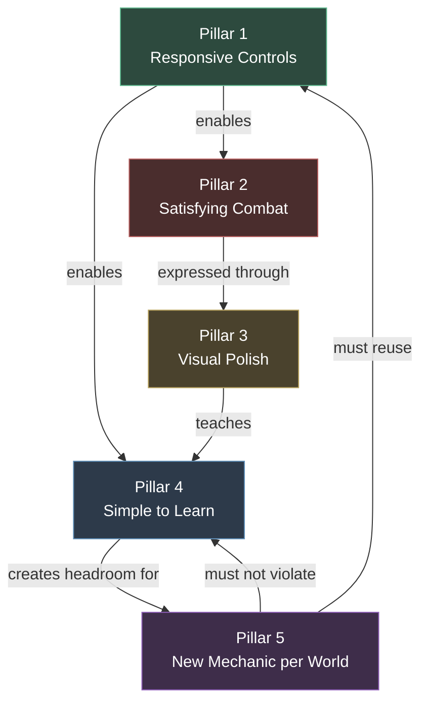
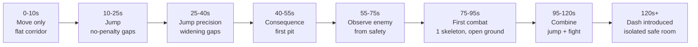
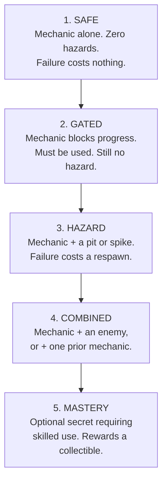
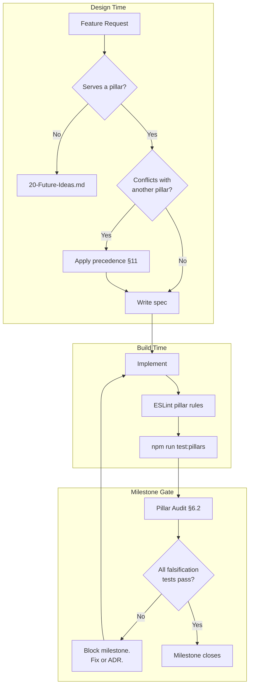

# 02 — Game Pillars

**Project:** DevQuest (Working Title)
**Document Owner:** Game Director
**Status:** ✅ Stable
**Version:** 1.0.0
**Last Updated:** 2026-08-07

---

## 1. Purpose

A pillar is a **decision-making instrument**, not a slogan. Its job is to resolve arguments quickly and consistently, so that a hundred small choices made by different people over twelve months add up to one coherent game instead of a pile of reasonable-in-isolation features.

This document defines DevQuest's five pillars, and — more importantly — makes each one **testable**. A pillar you cannot fail is decoration. Every pillar here comes with:

- A definition
- The specific mechanics that implement it
- Concrete, measured numeric targets
- A **falsification test**: the observable condition under which we would declare the pillar violated
- Worked examples of the pillar being applied to real decisions

When two pillars conflict, §11 defines the precedence order. When a feature serves no pillar, it does not ship.

---

## 2. Goals

| # | Goal | Success Signal |
|---|------|----------------|
| G1 | Define five pillars precisely enough to settle disputes | A design argument is resolved by citation, not by seniority |
| G2 | Give every pillar a numeric, measurable target | Pillar health is reported, not felt |
| G3 | Give every pillar a falsification test | We can objectively say "we are failing Pillar 2" |
| G4 | Define pillar precedence for conflicts | Conflicts do not stall; they resolve deterministically |
| G5 | Provide worked examples for each pillar | New contributors calibrate on real cases, not abstractions |
| G6 | Define the per-milestone pillar audit | Drift is caught within one milestone, not at ship |

---

## 3. Design Principles — How Pillars Are Used

### P1 — A Pillar Is a Filter, Not a Wish
Pillars reject features. If in twelve months no feature has been rejected by citing a pillar, the pillars are decorative and this document has failed.

### P2 — Pillars Are Few
Five is the maximum a team can hold in working memory. A sixth pillar dilutes all five. Proposals for a new pillar must retire an existing one.

### P3 — Pillars Are Measurable
"Feels good" is not a pillar. "Input-to-visible-response latency ≤ 50 ms at p99" is. Every pillar in §5 carries numbers.

### P4 — Pillars Outrank Preference
A pillar beats a team member's taste, including the director's. This is the point of writing them down before the arguments start.

### P5 — Pillars Do Not Outrank Reality
If a pillar proves unachievable on the target hardware, the pillar changes via ADR — it is not quietly ignored. A silently abandoned pillar is worse than no pillar.

---

## 4. Overview

### 4.1 The Five Pillars

| # | Pillar | One-Line Test |
|---|--------|---------------|
| **1** | **Responsive Controls** | Does the character do exactly what the player meant, immediately? |
| **2** | **Satisfying Combat** | Does every connected hit produce a visceral, unmistakable reaction? |
| **3** | **Visual Polish** | Does every player action produce visible feedback? |
| **4** | **Simple to Learn** | Can a non-gamer play competently within 60 seconds, with no text? |
| **5** | **Every World Introduces Something New** | Does World N teach a verb World N−1 did not have? |

### 4.2 Pillar Relationships



**Reading the graph:** Pillar 1 is load-bearing — it is a prerequisite for two others. This is why the roadmap front-loads it into M1 and locks it before anything else is built. Pillar 5 is the most constrained: it must add novelty (its own mandate) without violating Pillar 4 (learnability) and without inventing new movement verbs that would destabilise Pillar 1.

---

## 5. Technical Design — The Pillars in Detail

---

## 5.1 PILLAR 1 — Responsive Controls

> **The character does exactly what the player meant, immediately, every time.**

### 5.1.1 Definition

Responsiveness is not "fast." It is the absence of any perceptible gap between intent and outcome. A control scheme is responsive when the player stops thinking about the controls entirely and thinks only about the level.

Three distinct failures break this, and they are commonly confused:

| Failure | Symptom | Cause |
|---------|---------|-------|
| **Latency** | "It feels laggy" | Input polled late, animation gating movement, or a start-up frame before velocity applies |
| **Ambiguity** | "It didn't register" | Input arrived a few frames outside a window that should have forgiven it |
| **Inertia** | "It feels like ice / like mud" | Acceleration and deceleration curves mismatched to the level design's precision demands |

DevQuest addresses all three explicitly. Latency is addressed by applying velocity on the same frame as the input event and never gating movement behind animation. Ambiguity is addressed by coyote time and jump buffering. Inertia is addressed by asymmetric acceleration/deceleration tuning.

### 5.1.2 Implementing Mechanics

| Mechanic | Value | Why This Value |
|----------|-------|----------------|
| **Coyote Time** | `100 ms` (6 frames) | The perceptual "that should have counted" window sits at 80–130 ms. Our base run speed (90 px/s) is slower than Celeste's, so players arrive at ledges with less momentum and need the upper half of the band |
| **Jump Buffer** | `120 ms` (7 frames) | Slightly longer than coyote time. Pressing early is a more common error than pressing late, because players anticipate landing |
| **Variable Jump Height** | `vy *= 0.45` on release | Gives a 32 px full jump and a ~13 px tap jump. The 2.4× ratio is enough range to be expressive without making the tap jump useless |
| **Ground Acceleration** | `900 px/s²` | Reaches 90 px/s max speed in 100 ms. Fast enough to feel immediate, slow enough that micro-adjustments are possible |
| **Ground Deceleration** | `1200 px/s²` | Deliberately faster than acceleration. Stopping precisely matters more than starting instantly for platforming accuracy |
| **Air Acceleration** | `600 px/s²` | 67% of ground. Air control is real but not free — committing to a jump direction should matter |
| **Air Deceleration** | `400 px/s²` | 33% of ground. Preserves momentum through arcs |
| **Turn-Around Boost** | `1.8×` accel when input opposes velocity | Makes direction reversal snappy without raising top-speed acceleration |
| **Fall Gravity Multiplier** | `1.35×` | Asymmetric gravity. Rising feels floaty and controllable, falling feels decisive |
| **Apex Hang** | `0.70×` gravity while `|vy| < 40 px/s` | Extends the apex by ~50 ms. This is where players make their aim adjustment |
| **Dash** | `260 px/s` for `150 ms` | Covers 39 px (2.4 tiles). Long enough to be a traversal tool, short enough to be a commitment |
| **Landing Recovery** | `0 frames` | **Zero.** No landing lag, ever. Landing lag is the single most common responsiveness killer in platformers |
| **Attack Movement Lock** | Partial, never total | Attacks reduce ground speed to 40% and preserve full air momentum. The player is never frozen |

### 5.1.3 Numeric Targets

| Metric | Target | Measurement Method |
|--------|--------|-------------------|
| Input-to-velocity-change | `≤ 1 frame (16.67 ms)` | Instrumented: timestamp at `keydown` vs. timestamp of the physics step that applied it |
| Input-to-visible-response | `≤ 50 ms` at p99 | High-speed capture (240 fps camera) of physical key press to first changed pixel |
| Dropped inputs | `0` per 10,000 | Automated input-fuzzing harness; any input not producing a state change is logged |
| Frame time variance | `σ ≤ 2 ms` | Perf HUD over a 60-second gameplay capture |
| Jump success rate at ledge edge | `≥ 98%` | Automated test: 1,000 jumps triggered within ±100 ms of leaving a ledge |

### 5.1.4 Falsification Test

**Pillar 1 is violated if any of the following is observed:**

1. A playtester says "it didn't register" more than **once per 10 minutes** of play.
2. Input-to-visible-response exceeds `50 ms` at p99 on the minimum hardware.
3. Any gameplay state exists in which player input is ignored for more than `200 ms` — with exactly two sanctioned exceptions: hitstop (≤ 140 ms) and death (an authored sequence).
4. Any animation gates movement. Animation follows state; state never waits for animation.
5. Landing introduces any recovery frames.

Items 3, 4, and 5 are structural and are enforced in code review, not playtest.

### 5.1.5 The Architectural Rule That Protects Pillar 1

> **Movement is computed from state. Animation is a read-only projection of state.**

Concretely: `PlayerController.update()` computes velocity and transitions the state machine. `PlayerAnimator.update()` then reads the resulting state and picks a clip. The animator has no write access to the body, and no code path allows an animation frame to block a state transition.

This one rule eliminates the majority of responsiveness bugs before they can be written. It is enforced by making `PlayerAnimator` receive a `Readonly<PlayerState>` and by an ESLint rule banning `body` access inside `src/entities/player/animation/`.

---

## 5.2 PILLAR 2 — Satisfying Combat

> **Every connected hit produces a visceral, unmistakable, physical reaction.**

### 5.2.1 Definition

"Satisfying" is not a mystery — it is a stack of specific, individually cheap techniques that fire within 150 ms of contact. Applied together they produce the sensation of *impact*; applied partially they produce a game where hits feel like the enemy's health bar quietly decremented.

Nine techniques fire on every hit. All nine, every time.

### 5.2.2 The Nine-Layer Hit Stack

| # | Layer | Timing | Value |
|---|-------|--------|-------|
| 1 | **Hit Stop** | `t = 0` | Freeze both attacker and victim animation + physics for 60/110/140 ms (light/heavy/kill). The rest of the world continues |
| 2 | **Hit Flash** | `t = 0` | Victim `tintFill(0xffffff)` for 80 ms, then a 40 ms fade back |
| 3 | **Knockback** | `t = 0` | 70 px/s (light) or 140 px/s + −60 px/s lift (heavy), decaying to zero over 200 ms |
| 4 | **Slash VFX** | `t = 0` | An 8-frame slash sprite, oriented and offset to the contact point, not the attacker's origin |
| 5 | **Camera Shake** | `t = 0` | amplitude 0.004 / 90 ms (light), 0.008 / 150 ms (heavy). Trauma-based, so simultaneous hits do not stack into nausea |
| 6 | **Enemy Stagger** | `t = hitstop end` | Victim enters `HURT` state, losing AI control for 180–400 ms depending on poise |
| 7 | **Damage Number** | `t = hitstop end` | Rises 12 px over 500 ms, fades over the last 200 ms. Colour-coded by damage tier |
| 8 | **Impact Particles** | `t = 0` | 4–8 sparks along the contact normal, pooled, 300 ms lifetime |
| 9 | **Death Explosion** | on kill | The CraftPix explosion sprite, plus a 140 ms hit stop, plus heavy shake, plus a 200 ms radial white flash at 20% alpha |

### 5.2.3 Why Hit Stop Is the Load-Bearing Layer

Hit stop is the difference between "the number went down" and "I hit that thing." It works because it violates the player's expectation of continuous motion at exactly the moment of contact, which the brain reads as force.

Three rules make it work rather than feel broken:

1. **Freeze the participants, not the world.** VFX, particles, camera shake, and the parallax background all continue at full speed during hit stop. Freezing everything reads as a stutter or a dropped frame; freezing only the combatants reads as impact.
2. **Never freeze input.** Input is buffered during hit stop and applied on the first frame after. The player never feels they lost control — only that the world resisted.
3. **Scale with weight, not with damage.** A Knight's heavy swing gets 110 ms whether it deals 18 or 40 damage. Tying hit stop to a damage number makes the feel inconsistent across characters.

### 5.2.4 Numeric Targets

| Metric | Target |
|--------|--------|
| Layers firing per connected hit | `9 / 9` — no hit ships with fewer |
| Time from contact to first visible feedback | `≤ 16.67 ms` (same frame) |
| Time from contact to full feedback stack | `≤ 150 ms` |
| Hit stop duration | `60 / 110 / 140 ms` (light / heavy / kill) |
| Enemy stagger duration | `180–400 ms` by poise |
| Player i-frames after taking damage | `800 ms` |
| Camera shake decay | Fully settled within `250 ms` |
| Simultaneous hit stop requests | Longest wins; never additive |

### 5.2.5 Falsification Test

**Pillar 2 is violated if:**

1. Any attack in the game connects without firing all nine layers.
2. A playtester, watching a recording with audio muted, cannot tell whether a hit connected.
3. Hit stop is perceived as a frame drop rather than as impact (tested by asking playtesters to report stutters; hit stop should never be named).
4. Camera shake causes discomfort in any playtest — indicates a trauma-curve or accumulation bug.
5. The player can be hit while in i-frames.
6. Two simultaneous hits produce additive hit stop, causing a freeze longer than 140 ms.

### 5.2.6 The Anti-Pattern Register

| Anti-Pattern | Why It Breaks the Pillar |
|---|---|
| Damage number as the only feedback | Reads as a spreadsheet, not a fight |
| Hit stop applied to the whole scene | Reads as a performance problem |
| Screen shake on every frame of a multi-hit | Nausea; use trauma accumulation with a cap |
| Knockback that de-syncs from the animation | Enemy appears to slide; knockback must start on the same frame as the flash |
| Enemy dies with no explosion | The most important hit in any exchange gets the least feedback |
| Attack animation that outlasts the hitbox by >200 ms | Player feels punished for connecting |

---

## 5.3 PILLAR 3 — Visual Polish

> **Every player action produces visible feedback. Nothing happens silently.**

### 5.3.1 Definition

Visual polish is not "looks nice." It is the guarantee that the game **acknowledges** everything the player does. An unacknowledged action feels like a bug even when the underlying logic is correct.

The rule is absolute: **if the player caused it, the screen shows it.**

### 5.3.2 The Feedback Contract

Every entry in this table is mandatory. A build in which any row is unimplemented does not pass a milestone gate.

| Player Action | Required Feedback | Spec |
|---|---|---|
| **Start running** | Dust puff at feet | 3-frame sprite, spawned once on the `IDLE → RUN` transition |
| **Running (sustained)** | Dust trail | 1 puff every 180 ms while grounded and `|vx| > 40 px/s` |
| **Turn around while running** | Skid dust + 2 px sprite squash | Fires when input direction opposes velocity and `|vx| > 50 px/s` |
| **Jump** | Dust ring at launch + 4 px vertical stretch over 80 ms | Stretch is a scale tween, not an art asset |
| **Fall (sustained)** | 2 px horizontal squash after 300 ms of falling | Communicates commitment to the descent |
| **Land** | Dust burst scaled by impact velocity + squash | Squash depth: 2 px (soft, <150 px/s), 4 px (medium), 6 px (hard, >250 px/s), recovering over 120 ms |
| **Dash** | Ghost trail (3 afterimages at 60 ms spacing, 50%→0% alpha) + a directional speed-line sprite | Afterimages are pooled sprite copies with the current frame |
| **Attack** | Slash VFX + weapon trail + 30 ms of the character leaning into the swing | Slash is a pooled, oriented sprite from the CraftPix slash pack |
| **Hit an enemy** | The full nine-layer stack | See §5.2.2 |
| **Take damage** | Red screen vignette (200 ms), player flash, knockback, i-frame flicker | Vignette is a full-screen quad, alpha 0.25, additive |
| **Collect a coin** | Sparkle burst + coin arcs toward the HUD + counter tick | Arc is a 400 ms quadratic tween in screen space |
| **Collect a heart shard** | Radial flash + HUD heart pulse + 500 ms slow-motion (0.6×) | The only non-boss slow-motion in the game; it marks a rare event |
| **Break a crate / prop** | Debris particles (6 pieces, physics-enabled, 800 ms lifetime) + dust | Debris is pooled and non-colliding with the player |
| **Enemy death** | Explosion sprite + heavy shake + kill hit stop + coin scatter | See §5.2.2 layer 9 |
| **Checkpoint activated** | Lantern-light bloom + 8 rising sparks + HUD toast | Toast is 1.2 s, non-blocking |
| **Enter a new area** | Camera ease over 400 ms + a 200 ms area-name fade-in | Only for named sub-areas |
| **Portfolio unlock** | Full authored 4-second sequence, skippable | See `12-Portfolio-System.md` §7 |

### 5.3.3 The Squash-and-Stretch Budget

Squash and stretch is applied via `scaleX` / `scaleY` tweens on the sprite, never through additional art. Because the game is 320×180, deformations are measured in whole pixels and are small.

| Event | Scale | Duration | Easing |
|---|---|---|---|
| Jump launch | `(0.88, 1.14)` | 80 ms out, 60 ms back | `Quad.easeOut` |
| Fall sustained | `(1.08, 0.94)` | 200 ms in | `Sine.easeInOut` |
| Land soft | `(1.10, 0.90)` | 120 ms | `Back.easeOut` |
| Land hard | `(1.24, 0.78)` | 160 ms | `Back.easeOut` |
| Attack windup | `(0.94, 1.06)` | 60 ms | `Quad.easeOut` |
| Hit taken | `(1.16, 0.86)` | 100 ms | `Elastic.easeOut` |

**Critical constraint:** because `roundPixels: true` and the sprites are ~32 px tall, a scale of 0.88 produces a 4 px change — visible but not cartoonish. Anything beyond ±25% breaks the pixel-art read and is rejected.

### 5.3.4 Numeric Targets

| Metric | Target |
|--------|--------|
| Player actions with no visual feedback | `0` |
| VFX spawn cost | `≤ 0.15 ms` per spawn (pooled; no allocation) |
| Concurrent particles | `≤ 200` hard cap |
| Concurrent VFX sprites | `≤ 32` hard cap |
| Feedback latency | `≤ 1 frame` from the triggering event |
| Draw calls added by VFX | `≤ 4` (all VFX in one atlas) |

### 5.3.5 Falsification Test

**Pillar 3 is violated if:**

1. Any row in the §5.3.2 contract table is unimplemented in a milestone build.
2. A playtester performs an action and asks "did that work?"
3. VFX spawning causes a measurable frame-time spike (>2 ms) — indicates a pooling failure.
4. Any VFX allocates at runtime (verified by a heap-snapshot diff across 60 s of combat showing zero growth in VFX object counts).
5. Screen-space effects (vignette, flash) are not respecting the Reduced Motion accessibility setting.

---

## 5.4 PILLAR 4 — Simple to Learn

> **A non-gamer plays competently within 60 seconds, without reading anything.**

### 5.4.1 Definition

The primary audience (`01-Vision.md` §6.1) may not play games. The control scheme, the level design, and the UI must all assume zero genre literacy — while remaining deep enough that the tertiary audience is not bored.

The classic formulation applies: *low floor, high ceiling, wide walls.* DevQuest is unusual in that its **floor matters more than its ceiling**, because the person we most need to reach the end is the least skilled player we have.

### 5.4.2 The Control Scheme

The entire game is playable with **five inputs**. Everything else is a modifier or a menu.

| Action | Keyboard (default) | Gamepad | Notes |
|--------|-------------------|---------|-------|
| Move | `A` / `D` or `←` / `→` | Left stick / D-pad | Both accepted simultaneously |
| Jump | `Space` or `W` or `↑` | `A` / Cross | Three keyboard bindings by default because players disagree about this |
| Attack | `J` or `Left Mouse` | `X` / Square | |
| Dash | `K` or `Shift` or `Right Mouse` | `B` / Circle or `RT` | |
| Special | `L` or `E` | `Y` / Triangle | Character-unique ability |
| Pause | `Esc` | `Start` | |
| Interact | Same as Jump | Same as Jump | **No separate interact key.** Deliberate |

**Design note on "no interact key":** the most common failure for a non-gamer is not knowing which key opens a door. By binding interaction to jump, the player who mashes the only button they are confident about always succeeds.

### 5.4.3 Teaching Without Text

All teaching happens through **level geometry, enemy placement, and consequence-free repetition.** There are no tutorial popups in the shipping game.

The five teaching techniques, in the order World 1-1 uses them:

| Technique | Where | How |
|---|---|---|
| **Forced use** | 1-1 opening | A 3-tile gap with solid ground either side. You cannot progress without jumping. Falling costs nothing — you land on a soft ledge and walk back |
| **Safe repetition** | 1-1 first 20 s | Three gaps of increasing width, all with zero-penalty failure. By gap three, jump distance is internalised |
| **Consequence introduction** | 1-1 at ~40 s | The first gap with a pit. By now the player has jumped nine times |
| **Demonstration before demand** | 1-1 at ~55 s | A skeleton patrols on a ledge *below* the player's path. It can be watched safely, and optionally attacked, before the first mandatory fight |
| **Isolated introduction** | Every new mechanic, everywhere | A new mechanic appears once, alone, in a safe room before it is ever combined with anything else |



### 5.4.4 The Complexity Budget

To keep the floor low, complexity is **rationed**. The game may introduce at most:

- **One new verb per world** (Pillar 5's mandate is also Pillar 4's constraint).
- **One new enemy archetype per world**, plus at most one variant of an existing one.
- **Zero new buttons after World 1.** All five inputs are taught in World 1. Worlds 2–5 add *contexts*, never *controls*.

That last rule is the strongest protection Pillar 4 has. A player who has learned five buttons in World 1 never has to learn a sixth.

### 5.4.5 Numeric Targets

| Metric | Target | Measurement |
|--------|--------|-------------|
| Time to first successful jump | `≤ 10 s` | Naive playtest, 5 subjects |
| Time to first enemy killed | `≤ 90 s` | Naive playtest |
| Time to complete 1-1 | `≤ 4 min` for a non-gamer | Naive playtest |
| Tutorial text shown | `0 words` | Static check of level data |
| Distinct inputs required | `5` | Static check of the input map |
| New inputs after World 1 | `0` | Static check |
| Naive-player completion rate for World 1 | `≥ 90%` with Assist off | Playtest |
| Naive-player completion rate for the game | `100%` with Assist on | Playtest |

### 5.4.6 Falsification Test

**Pillar 4 is violated if:**

1. A naive playtester fails to jump within 30 seconds.
2. Any tutorial text is required to explain a core verb.
3. A sixth mandatory input is introduced.
4. A new mechanic first appears in a hazardous context rather than a safe one.
5. World 1 completion rate for naive testers falls below 90%.
6. Any player cannot reach the credits with Assist Options fully enabled.

---

## 5.5 PILLAR 5 — Every World Introduces Something New

> **World N teaches a verb, hazard, or interaction that World N−1 did not have. Nothing repeats.**

### 5.5.1 Definition

The failure mode this pillar prevents is *content padding*: World 3 is World 1 with a different tileset and enemies that have more HP. This is the most common way a platformer becomes boring in its second half, and it is entirely avoidable at the design stage.

Each world owns a **mechanic set** — one primary mechanic and two supporting ones — that appears in that world and, at most, as a callback in the final world.

### 5.5.2 The Mechanic Ladder

| World | Primary Mechanic | Supporting Mechanics | The New Player Question It Poses |
|---|---|---|---|
| **1 — Verdant Ascent** | **Moving platforms** | One-way platforms, bounce caps | *"Where will the platform be when I land?"* — timing |
| **2 — Autumn Reach** | **Wind zones** (directional constant force) | Crumbling branches (0.4 s before collapse), updrafts | *"How do I plan a jump when the air pushes me?"* — trajectory compensation |
| **3 — Hollow Barrow** | **Light and darkness** (lantern radius, enemies hidden in fog) | Soul-braziers (relight to reveal), fog banks that mute enemy tells | *"How do I fight what I cannot see?"* — information management |
| **4 — Crystal Deep** | **Refracted light beams** (rotate crystals to route a beam and open gates) | Low-gravity fields (0.45× gravity), conveyor belts | *"How do I solve the room, not just cross it?"* — spatial reasoning |
| **5 — Gorgon's Spire** | **Timed gate sequences** (multi-stage rooms on a shared clock) | Wall turrets, petrify gaze cones | *"Can I execute everything I've learned under time pressure?"* — synthesis |

### 5.5.3 The Synthesis Rule

Worlds 1–4 each introduce in isolation. **World 5 is allowed — and required — to combine.** Gorgon's Spire re-uses moving platforms, wind, darkness, and beams, but always in combination with its own timed-gate mechanic, and never as the sole challenge of a room.

This makes World 5 feel like a graduation rather than a greatest-hits reel.

### 5.5.4 Mechanic Introduction Protocol

Every new mechanic follows the same five-beat introduction. This is a hard requirement checked at level review.



Beats 1–4 are mandatory and appear in the world's first level. Beat 5 is mandatory but may appear anywhere in the world.

**Example — World 2, Wind Zones:**

| Beat | Room | Content |
|---|---|---|
| 1. Safe | 2-1, room 2 | A wide flat platform inside a rightward wind zone. The player is pushed; there is nothing to fall off |
| 2. Gated | 2-1, room 3 | A gap too wide to jump *against* the wind, trivial *with* it. Teaches the wind is a resource |
| 3. Hazard | 2-1, room 5 | The same gap, now over a pit, with the wind alternating every 2 s |
| 4. Combined | 2-1, room 7 | Wind gap plus a skeleton archer on the far ledge |
| 5. Mastery | 2-2, optional | A heart shard on a high ledge reachable only by riding an updraft into a leftward wind at the apex |

### 5.5.5 Numeric Targets

| Metric | Target |
|--------|--------|
| New primary mechanics | `1 per world`, exactly |
| Supporting mechanics per world | `2`, exactly |
| Mechanic reuse across worlds | `0`, except in World 5 |
| Worlds implementing all 5 introduction beats | `5 / 5` |
| New buttons introduced after World 1 | `0` |
| New enemy archetypes per world | `1` primary + `≤1` variant |

### 5.5.6 Falsification Test

**Pillar 5 is violated if:**

1. Any world ships without a primary mechanic that no earlier world had.
2. A mechanic from World N appears as the sole challenge of a room in World N+1 or later (World 5 excepted, and only in combination).
3. Any world skips a beat in the five-beat introduction protocol.
4. A playtester describes World N as "the same as World N−1 but harder."
5. A new mechanic requires a new input.

---

## 6. Implementation Notes

### 6.1 Where Each Pillar Lives in Code

| Pillar | Primary Modules | Guarded By |
|---|---|---|
| 1 — Responsive Controls | `src/entities/player/PlayerController.ts`, `src/systems/InputSystem.ts`, `src/config/GameConstants.ts` | ESLint rule banning body writes in the animator; input-latency test in CI |
| 2 — Satisfying Combat | `src/systems/CombatSystem.ts`, `src/systems/HitStopSystem.ts`, `src/systems/CameraShakeSystem.ts` | `HitResolution` type requires all nine layers to be non-optional |
| 3 — Visual Polish | `src/systems/VfxSystem.ts`, `src/systems/ParticleSystem.ts`, `src/core/ObjectPool.ts` | Heap-growth test; the feedback contract is a test fixture |
| 4 — Simple to Learn | `src/config/InputMap.ts`, level data in `levels/w1/*.tmj` | Static check: input map length; static check: zero tutorial text objects |
| 5 — New Mechanic per World | `src/systems/mechanics/*`, `src/data/worlds/*.json` | Static check: each world's `mechanicIds` disjoint from all prior worlds |

### 6.2 The Pillar Audit

At the end of every milestone, a **Pillar Audit** is run and its results recorded in the milestone review. It is a fixed, one-hour procedure:

1. Run every falsification test in §5. Record pass/fail per pillar.
2. Run the automated numeric-target suite (`npm run test:pillars`).
3. Conduct one naive playtest (a person who has not seen the build) and record the Pillar 4 timings.
4. Record any feature that shipped in the milestone which serves no pillar. This list should be empty; if it is not, each entry needs a justification or a removal ticket.
5. Record any feature that was rejected by pillar citation. This list should be non-empty (see P1, §3).

The audit output goes into `17-Roadmap.md` as part of the milestone gate. **A milestone does not close with a failing pillar.**

### 6.3 Automating What Can Be Automated

Roughly 60% of the numeric targets are machine-checkable and run in CI:

```ts
// tools/ci/check-pillars.ts  (illustrative shape)

const checks: PillarCheck[] = [
  // Pillar 1
  { pillar: 1, name: 'input latency ≤ 1 frame', run: () => measureInputLatency() <= 16.67 },
  { pillar: 1, name: 'no landing recovery',      run: () => FEEL.LANDING_RECOVERY_MS === 0 },

  // Pillar 2
  { pillar: 2, name: 'all hits fire 9 layers',   run: () => auditHitResolutions().every(h => h.layers === 9) },
  { pillar: 2, name: 'hitstop never additive',   run: () => hitStopSystemIsMaxNotSum() },

  // Pillar 3
  { pillar: 3, name: 'feedback contract complete', run: () => FEEDBACK_CONTRACT.every(isImplemented) },
  { pillar: 3, name: 'vfx allocate zero at runtime', run: () => heapDeltaAfterCombat() === 0 },

  // Pillar 4
  { pillar: 4, name: 'exactly 5 inputs',         run: () => countRequiredInputs() === 5 },
  { pillar: 4, name: 'zero tutorial text',       run: () => countTutorialTextObjects() === 0 },

  // Pillar 5
  { pillar: 5, name: 'mechanic sets disjoint',   run: () => worldMechanicsAreDisjoint({ exceptWorld: 'w5' }) },
  { pillar: 5, name: 'five-beat protocol',       run: () => everyWorldHasAllFiveBeats() },
];
```

The remaining 40% — the ones requiring a human — are the playtest items, and they are the reason the audit is a scheduled hour rather than a CI job.

---

## 7. Architecture — Pillar Enforcement Points



---

## 8. Examples — Pillars Applied to Real Decisions

### 8.1 "Add a parry with a 6-frame window"

| Pillar | Assessment |
|---|---|
| 1 — Responsive | ⚠️ A 6-frame (100 ms) window is tight. Requires perfect input latency, which we have, but it is unforgiving |
| 2 — Combat | ✅ Strongly served. A successful parry is the highest-feedback moment available |
| 3 — Polish | ✅ Serves it — a parry flash is exceptional feedback |
| 4 — Learnable | ❌ **Violated.** A 6-frame window is not learnable by a non-gamer, and making it mandatory would gate the primary audience out |
| 5 — Novelty | ➖ Neutral |

**Verdict: Accepted with modification.** Parry ships as the **Knight's** special ability only (so it is opt-in at character select, never mandatory), with a 12-frame (200 ms) window, and Assist Options extend it to 20 frames. Recorded as `ADR-012`.

**Note what happened:** the pillar conflict did not kill the feature; it reshaped it into a form that serves Pillar 2 without breaking Pillar 4.

### 8.2 "Enemies should drop random loot with stat modifiers"

| Pillar | Assessment |
|---|---|
| 1 — Responsive | ➖ Neutral |
| 2 — Combat | ❌ Damages it. Variable damage numbers make hit feel inconsistent across a session |
| 3 — Polish | ➖ Neutral |
| 4 — Learnable | ❌ **Violated.** Introduces an inventory concept, a comparison UI, and stat literacy |
| 5 — Novelty | ➖ Neutral |

**Verdict: Rejected.** Also fails the RPG test in `01-Vision.md` §7.2. Moved to `20-Future-Ideas.md`.

### 8.3 "Make World 3 dark so you can only see near the player"

| Pillar | Assessment |
|---|---|
| 1 — Responsive | ➖ Neutral, provided the light radius does not obscure the player's own landing zone |
| 2 — Combat | ⚠️ Risk — enemy tells must remain readable. Mitigated by giving all enemies a self-illuminated tell frame |
| 3 — Polish | ✅ Strongly served. Lighting is high-value visual polish |
| 4 — Learnable | ⚠️ Risk — mitigated by the five-beat protocol and by never placing a pit outside the light radius |
| 5 — Novelty | ✅ **Strongly served.** This is exactly the mandate |

**Verdict: Accepted with two hard constraints** — (a) no instant-death hazard may exist outside the lantern radius, and (b) every enemy's attack windup frame is self-illuminated regardless of ambient light. Recorded as `ADR-018`.

### 8.4 "Cut hit stop, it feels like lag on slower machines"

| Pillar | Assessment |
|---|---|
| 2 — Combat | ❌ **Catastrophic.** Hit stop is the load-bearing layer of the entire pillar |

**Verdict: Rejected as stated; root cause investigated instead.** If hit stop reads as lag, the cause is one of: (a) freezing the whole scene rather than the combatants, (b) freezing input, or (c) an actual frame-rate problem being blamed on hit stop. All three are bugs with fixes. The pillar is not negotiable; the implementation is. Recorded as `ADR-014`.

**This example is the template for handling any "cut a pillar mechanic" request:** the pillar stays, the implementation gets fixed.

---

## 9. Data Structures

```ts
// src/config/Pillars.ts
// NORMATIVE — mirrors docs/02-Game-Pillars.md

export type PillarId = 1 | 2 | 3 | 4 | 5;

export interface NumericTarget {
  readonly name: string;
  readonly target: string;          // human-readable, e.g. '≤ 50 ms'
  readonly automated: boolean;      // can CI check it?
  readonly checkId?: string;        // key into the CI check registry
}

export interface FalsificationTest {
  readonly id: string;              // 'P1-F3'
  readonly condition: string;       // the observable violation
  readonly detectedBy: 'ci' | 'playtest' | 'code-review';
}

export interface Pillar {
  readonly id: PillarId;
  readonly name: string;
  readonly statement: string;
  readonly mechanics: readonly string[];
  readonly targets: readonly NumericTarget[];
  readonly falsification: readonly FalsificationTest[];
  /** Modules whose correctness this pillar depends on. */
  readonly ownedModules: readonly string[];
}

export const PILLARS: Readonly<Record<PillarId, Pillar>> = {
  1: {
    id: 1,
    name: 'Responsive Controls',
    statement: 'The character does exactly what the player meant, immediately, every time.',
    mechanics: [
      'coyote-time', 'jump-buffer', 'variable-jump', 'air-control',
      'asymmetric-gravity', 'apex-hang', 'dash', 'zero-landing-recovery',
    ],
    targets: [
      { name: 'input-to-velocity',  target: '≤ 1 frame',  automated: true,  checkId: 'p1.latency' },
      { name: 'input-to-visible',   target: '≤ 50 ms p99', automated: false },
      { name: 'dropped-inputs',     target: '0 / 10000',  automated: true,  checkId: 'p1.fuzz' },
      { name: 'ledge-jump-success', target: '≥ 98%',      automated: true,  checkId: 'p1.coyote' },
    ],
    falsification: [
      { id: 'P1-F1', condition: '"Did not register" reported > 1× per 10 min', detectedBy: 'playtest' },
      { id: 'P1-F2', condition: 'p99 input-to-visible latency > 50 ms',        detectedBy: 'playtest' },
      { id: 'P1-F3', condition: 'Input ignored > 200 ms outside hitstop/death', detectedBy: 'ci' },
      { id: 'P1-F4', condition: 'Animation gates a state transition',           detectedBy: 'code-review' },
      { id: 'P1-F5', condition: 'Landing introduces recovery frames',           detectedBy: 'ci' },
    ],
    ownedModules: [
      'src/entities/player/PlayerController.ts',
      'src/systems/InputSystem.ts',
      'src/config/GameConstants.ts',
    ],
  },
  // 2..5 follow the identical shape — omitted here for length,
  // fully populated in the source file.
} as const;
```

```ts
// The audit result, recorded per milestone and committed to docs/audits/.
export interface PillarAuditResult {
  readonly milestone: string;             // 'M4'
  readonly date: string;                  // ISO 8601
  readonly perPillar: Readonly<Record<PillarId, {
    readonly passed: boolean;
    readonly failedTests: readonly string[];   // falsification test ids
    readonly failedTargets: readonly string[];
  }>>;
  /** Should always be empty. Non-empty entries require justification or removal. */
  readonly featuresServingNoPillar: readonly string[];
  /** Should always be non-empty. An empty list means the pillars are decorative. */
  readonly featuresRejectedByPillar: readonly string[];
  readonly naivePlaytest: {
    readonly timeToFirstJumpMs: number;
    readonly timeToFirstKillMs: number;
    readonly completedWorld1: boolean;
  };
}
```

---

## 10. Future Expansion

| Item | Trigger | Notes |
|------|---------|-------|
| **Pillar 6: Replayability** | Only if a fifth character or Time Trial mode enters scope | Would need to retire or merge an existing pillar per P2 |
| **Automated feel regression** | After M2 | Record a canonical input sequence; assert the resulting position/velocity trace stays within tolerance across commits. Catches accidental tuning changes |
| **Telemetry-backed Pillar 4** | Never for the web build (no backend) | If a Steam build ships, opt-in local telemetry could measure real time-to-first-jump across many players |
| **Per-pillar dashboards** | After M6 | A dev-build overlay showing live pillar-metric health during play |
| **Pillar-tagged issue tracker** | M1 | Every issue carries a pillar label; burn-down per pillar reveals which is under-invested |

---

## 11. Pillar Precedence (Conflict Resolution)

When two pillars conflict and no modification satisfies both, resolve in this fixed order. **Higher wins.**

```
1. Responsive Controls      (highest — everything is built on it)
2. Simple to Learn          (protects the primary audience)
3. Satisfying Combat
4. Visual Polish
5. New Mechanic per World   (lowest — content novelty yields to feel and access)
```

**Rationale for this ordering:**

- **1 over everything:** a game that does not respond correctly is not a game. Every other pillar is expressed through the controls.
- **2 over 3 and 4:** the primary audience (`01-Vision.md` §6.1) must be able to finish. A combat mechanic that is more satisfying but locks out a non-gamer is a net loss for this specific product. Note this ordering would be different for a game aimed at the tertiary audience.
- **3 over 4:** feel over looks. Pillar 3 exists largely in service of Pillar 2 anyway.
- **5 lowest:** it is better to reuse a mechanic than to break responsiveness, learnability, or feel in pursuit of novelty. A world that reuses a mechanic well is a Pillar 5 violation to be filed and addressed; a world with a novel mechanic that feels bad is a broken game.

**Precedence is a tiebreaker of last resort.** In §8.1, precedence was not invoked — the feature was reshaped to satisfy both. Reshaping is always preferred to overriding.

---

## 12. Acceptance Criteria

- [ ] All five pillars have complete numeric-target tables with measurement methods.
- [ ] All five pillars have falsification tests with an assigned detection method.
- [ ] `npm run test:pillars` runs and reports per-pillar pass/fail.
- [ ] The §5.3.2 feedback contract exists as an executable test fixture, not just a table.
- [ ] A Pillar Audit has been run at every closed milestone and archived in `docs/audits/`.
- [ ] The `featuresRejectedByPillar` list is non-empty at every audit.
- [ ] The `featuresServingNoPillar` list is empty at every audit.
- [ ] Precedence (§11) has been cited at least once, and the resolution recorded as an ADR.
- [ ] Every module in each pillar's `ownedModules` list exists and has a maintainer.

---

## 13. Out of Scope

| Excluded | Reason |
|---|---|
| **A sixth pillar** | P2. Five is the working-memory limit. A sixth requires retiring one via ADR |
| **Pillars for non-gameplay concerns** | Code quality, documentation quality, and process live in `16-Coding-Standards.md`. Pillars are about the player experience only |
| **Audio pillars** | Audio assets are not selected. When they are, audio feedback becomes part of Pillars 2 and 3 rather than a new pillar |
| **Narrative pillars** | There is no narrative. See `01-Vision.md` §14 |
| **Difficulty as a pillar** | Difficulty is a *tuning dimension* governed by Pillar 4 and Assist Options, not an independent goal |
| **Art-quality pillars** | Owned by `04-Art-Direction.md`. Pillar 3 is about *feedback*, not *fidelity* — a grey box with perfect dust puffs passes Pillar 3 |

---

## 14. Cross References

| Topic | Document |
|-------|----------|
| Canonical values for every constant cited here | `00-README.md` §5 |
| The project principles these pillars derive from | `01-Vision.md` §3 |
| Target audiences that determine the precedence order | `01-Vision.md` §6 |
| Where pillar-owned modules live in the codebase | `03-Technical-Architecture.md` §6 |
| Squash-and-stretch and VFX art constraints | `04-Art-Direction.md` §7, `14-Animation-Standards.md` §8 |
| Per-character expression of Pillar 1 | `06-Characters.md` §5 |
| Full specification of the nine-layer hit stack | `07-Combat.md` §6 |
| Enemy tells and readability (Pillar 2 + 4) | `08-Enemy-System.md` §7 |
| Boss phase design and Pillar 5 synthesis | `09-Boss-System.md` §6 |
| The five-beat introduction protocol in level data | `10-Level-Design.md` §6 |
| World mechanic sets | `10-Level-Design.md` §7 |
| Assist Options that protect Pillar 4 | `13-UI-UX.md` §11 |
| Performance budget that protects Pillars 1 and 3 | `15-Performance.md` §4 |
| ESLint rules enforcing pillar invariants | `16-Coding-Standards.md` §7 |
| Milestone gates that run the Pillar Audit | `17-Roadmap.md` §6 |
| ADR-012, ADR-014, ADR-018 cited in §8 | `19-Decisions.md` |
| Features rejected by pillar citation | `20-Future-Ideas.md` |
