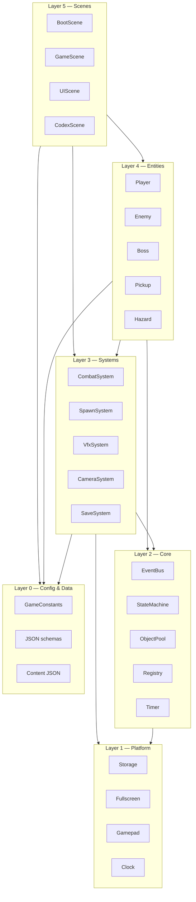
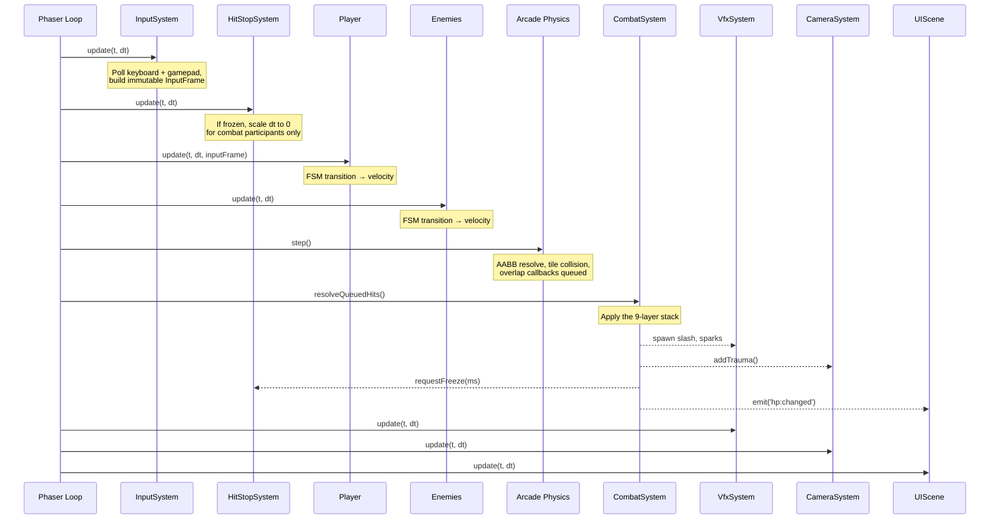
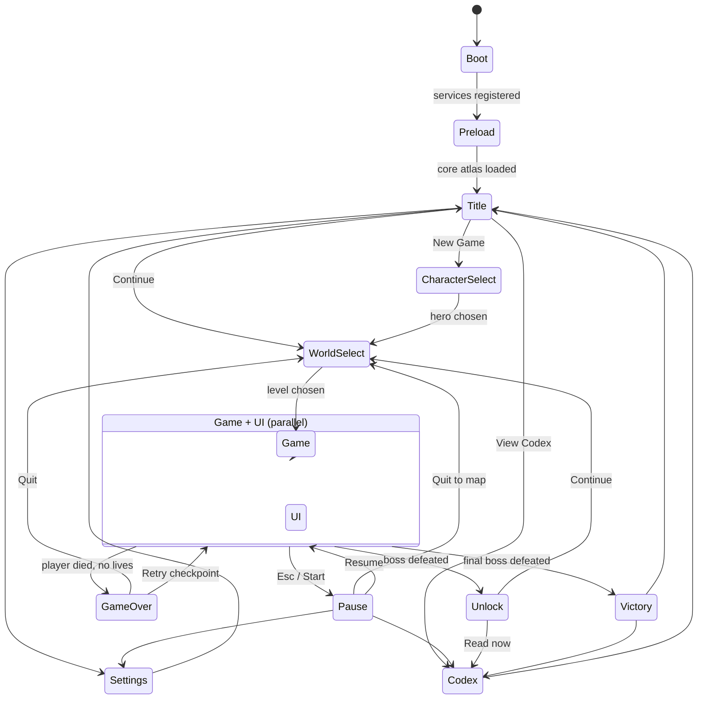
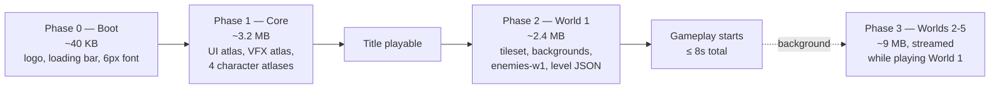
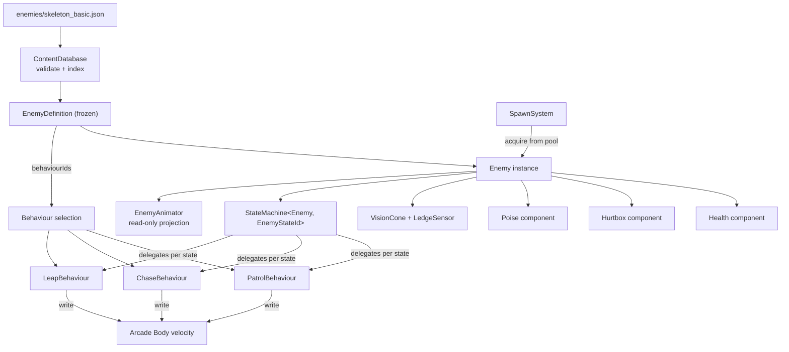
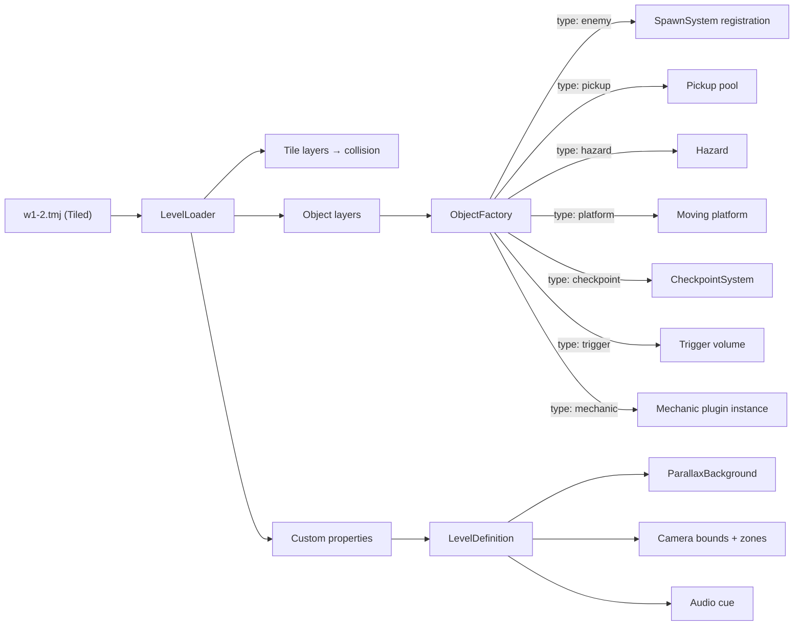
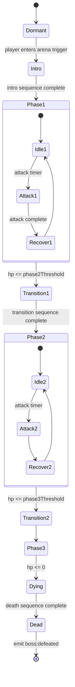

# 03 — Technical Architecture

**Project:** DevQuest (Working Title)
**Document Owner:** Technical Director
**Status:** ✅ Stable
**Version:** 1.0.0
**Last Updated:** 2026-08-07

---

## 1. Purpose

This document defines the **technical skeleton** of DevQuest: the module boundaries, the folder layout, the scene graph, the system registry, the data-flow rules, and the non-negotiable architectural invariants that keep a twelve-month project from collapsing into mud.

It is written for an engineer who knows Phaser 3 and TypeScript but knows nothing about this project. After reading it, that engineer should be able to place any new file correctly, know which systems they may talk to, and know which patterns will be rejected in review.

The architecture has one overriding objective: **the concrete cases are easy and the abstractions are earned.** DevQuest is not large enough to justify a full ECS, a dependency-injection container, or a plugin marketplace. It _is_ large enough that ad-hoc coupling between twenty systems will make the last three months miserable. This document draws the line between those two failure modes.

---

## 2. Goals

| #   | Goal                                                                   | Success Signal                                            |
| --- | ---------------------------------------------------------------------- | --------------------------------------------------------- |
| G1  | Define module boundaries with explicit allowed-dependency rules        | An import violation fails the lint step, not code review  |
| G2  | Define the scene graph and lifecycle precisely                         | A new scene can be added without touching existing scenes |
| G3  | Define the system registry and update order                            | Update order is data, not implicit in call-site ordering  |
| G4  | Make all content data-driven (enemies, bosses, levels, UI, characters) | Adding an enemy is a JSON file plus zero TypeScript files |
| G5  | Define state machines as a reusable, testable primitive                | Every FSM in the game shares one implementation           |
| G6  | Define the object-pooling strategy                                     | Zero runtime allocation during steady-state gameplay      |
| G7  | Deliver the 8-second load promise                                      | Measured in CI on a throttled connection                  |
| G8  | Keep the codebase portable to Electron/Tauri for Steam                 | No browser-only assumption outside a thin platform layer  |
| G9  | Make every system unit-testable without a running Phaser game          | ≥70% coverage on `src/core` and `src/systems`             |

---

## 3. Design Principles

### P1 — Data Over Code

Content is data. Behaviour is code. A new enemy, boss phase, level, or UI screen is authored as JSON validated against a schema, not as a subclass. The moment a designer needs an engineer to add a skeleton variant, the architecture has failed.

**Concrete test:** adding a new enemy variant requires editing exactly one JSON file and zero `.ts` files.

### P2 — Composition Over Inheritance

Deep class hierarchies are banned. `Enemy extends Character extends Entity extends Sprite` is exactly the structure that becomes unmaintainable at month eight. Entities are thin sprites that own **behaviour components**. An enemy is a bag of components configured by data.

**Concrete test:** no class in `src/entities` has more than one level of project-authored inheritance above `Phaser.GameObjects.Sprite`.

### P3 — Explicit Over Implicit

Update order is a declared array, not the order someone happened to call things. Dependencies are constructor parameters, not global reaches. Events carry typed payloads, not `any`.

### P4 — Earn Your Abstractions

The rule is **two concrete implementations before one abstraction.** Do not write `IEnemyBehaviour` before you have shipped two enemies. Do not write a plugin system before you have two plugins. This is `01-Vision.md` §8.1's build order expressed as an architectural rule.

### P5 — Pool Everything That Repeats

Every object created more than once per second at runtime comes from a pool. No exceptions. Garbage collection pauses are the single largest source of frame spikes in a browser game.

### P6 — The Platform Layer Is Thin

`localStorage`, `navigator`, `window`, `document`, and `fetch` are accessed **only** through `src/platform/`. Everything above that layer is environment-agnostic, which is what makes the Steam port a two-week job instead of a two-month one.

### P7 — Systems Do Not Know About Scenes

A system receives what it needs through its constructor and communicates outward through the event bus. A system that reaches into `this.scene.children` to find something is a bug.

---

## 4. Overview

### 4.1 Technology Stack

| Layer            | Choice                        | Version   | Rationale                                                                                                       |
| ---------------- | ----------------------------- | --------- | --------------------------------------------------------------------------------------------------------------- |
| **Engine**       | Phaser                        | `^3.90.0` | Mature, WebGL-first, excellent Arcade Physics, tilemap support, huge community. See `19-Decisions.md` `ADR-003` |
| **Language**     | TypeScript                    | `^5.6`    | `strict` + `noUncheckedIndexedAccess` + `exactOptionalPropertyTypes`                                            |
| **Bundler**      | Vite                          | `^6`      | Fast HMR, native ESM, trivial code-splitting                                                                    |
| **Physics**      | Arcade Physics                | bundled   | AABB only. Matter.js rejected — see `ADR-005`                                                                   |
| **Tests**        | Vitest                        | `^2`      | Vite-native, fast, no separate config                                                                           |
| **E2E**          | Playwright                    | `^1.49`   | Cross-browser smoke tests, deterministic input injection                                                        |
| **Level Editor** | Tiled                         | `1.11+`   | Exports `.tmj` (JSON), custom properties, object layers                                                         |
| **Atlas Packer** | `free-tex-packer-core`        | `^0.3`    | Scriptable, deterministic output, MaxRects                                                                      |
| **Lint**         | ESLint + `@typescript-eslint` | `^9`      | Flat config, custom project rules                                                                               |
| **Format**       | Prettier                      | `^3`      | No debates                                                                                                      |
| **CI**           | GitHub Actions                | —         | See §13                                                                                                         |

**Explicitly not used:** React, any UI framework, Redux/Zustand, an ECS library, a DI container, Lodash, Moment. Each of these was considered and rejected; see `19-Decisions.md`.

### 4.2 The Layer Model



**The dependency rule:** a layer may import from any layer **below** it. It may never import from a layer above it, and never from a sibling in the same layer except where explicitly whitelisted (see §6.3). This is enforced by `eslint-plugin-boundaries`, configured in §6.4.

### 4.3 What Runs Every Frame



**Why this order matters:** input must be sampled before any consumer reads it; hit stop must be applied before entities integrate velocity; physics must run after all velocity writes; combat resolution must run after physics so overlaps are accurate; presentation systems (VFX, camera, UI) run last so they observe the settled state of the frame.

This order is declared as data in `SystemRegistry` (§8.3) rather than being implicit in the order of `update()` calls in a scene.

---

## 5. Technical Design

### 5.1 Folder Structure

This is the complete, normative layout. Every file in the project has exactly one correct home.

```
devquest/
├── public/
│   ├── index.html
│   └── assets/
│       ├── atlas/                    # generated — gitignored
│       │   ├── core.png / core.json          (UI, VFX, particles — always loaded)
│       │   ├── chars.png / chars.json        (4 heroes — always loaded)
│       │   ├── enemies-w1.png / .json        (per-world enemy atlases)
│       │   ├── enemies-w2.png / .json
│       │   └── …
│       ├── tilesets/
│       │   ├── green-zone.png
│       │   ├── autumn-forest.png
│       │   ├── crystal-cave.png
│       │   ├── graveyard.png
│       │   └── castle.png
│       ├── backgrounds/
│       │   ├── nature/               # layer-0.png … layer-4.png per set
│       │   └── fairy-tale/
│       ├── levels/                   # Tiled .tmj exports
│       │   ├── w1/1-1.tmj … 1-4.tmj
│       │   └── …
│       ├── data/                     # runtime content JSON
│       │   ├── characters/
│       │   ├── enemies/
│       │   ├── bosses/
│       │   ├── worlds/
│       │   ├── charms/
│       │   ├── portfolio/
│       │   └── ui/
│       └── fonts/
│           └── devquest-6px.png / .xml       (bitmap font)
│
├── src/
│   ├── main.ts                       # entry: builds Phaser.Game, nothing else
│   │
│   ├── config/                       # LAYER 0
│   │   ├── GameConstants.ts          # NORMATIVE, mirrors 00-README §5
│   │   ├── PhaserConfig.ts
│   │   ├── InputMap.ts
│   │   ├── Pillars.ts
│   │   ├── ProductDefinition.ts
│   │   └── AssetManifest.ts          # which atlas loads in which phase
│   │
│   ├── platform/                     # LAYER 1 — the ONLY place browser APIs appear
│   │   ├── index.ts                  # exports the Platform facade
│   │   ├── Storage.ts                # localStorage wrapper + quota handling
│   │   ├── Fullscreen.ts
│   │   ├── GamepadAdapter.ts
│   │   ├── Clock.ts                  # performance.now() wrapper (mockable)
│   │   ├── Env.ts                    # isDev, isSteam, userAgent facts
│   │   └── steam/                    # empty until the port; same interfaces
│   │
│   ├── core/                         # LAYER 2 — zero Phaser dependency where possible
│   │   ├── EventBus.ts
│   │   ├── GameEvents.ts             # the typed event map
│   │   ├── StateMachine.ts
│   │   ├── ObjectPool.ts
│   │   ├── Registry.ts               # service locator (typed, explicit)
│   │   ├── SystemRegistry.ts         # ordered system list + lifecycle
│   │   ├── Timer.ts                  # timestamp-based windows (coyote, buffer)
│   │   ├── Result.ts                 # Result<T,E> for fallible operations
│   │   ├── Rng.ts                    # seeded PRNG (mulberry32)
│   │   ├── SchemaValidator.ts
│   │   └── Assert.ts                 # dev-only invariant checks, stripped in prod
│   │
│   ├── systems/                      # LAYER 3
│   │   ├── InputSystem.ts
│   │   ├── HitStopSystem.ts
│   │   ├── CombatSystem.ts
│   │   ├── DamageNumberSystem.ts
│   │   ├── VfxSystem.ts
│   │   ├── ParticleSystem.ts
│   │   ├── CameraSystem.ts
│   │   ├── SpawnSystem.ts
│   │   ├── CullingSystem.ts
│   │   ├── CheckpointSystem.ts
│   │   ├── SaveSystem.ts
│   │   ├── AudioSystem.ts            # stub until audio assets exist
│   │   ├── ProgressionSystem.ts
│   │   ├── PortfolioSystem.ts
│   │   ├── AssistSystem.ts
│   │   ├── DebugSystem.ts            # dev + hidden prod overlay
│   │   └── mechanics/                # world-specific mechanic plugins
│   │       ├── MechanicPlugin.ts     # the interface
│   │       ├── MovingPlatformMechanic.ts
│   │       ├── WindZoneMechanic.ts
│   │       ├── LanternMechanic.ts
│   │       ├── LightBeamMechanic.ts
│   │       └── TimedGateMechanic.ts
│   │
│   ├── entities/                     # LAYER 4
│   │   ├── Entity.ts                 # the single base class (thin)
│   │   ├── player/
│   │   │   ├── Player.ts
│   │   │   ├── PlayerController.ts   # movement math — Pillar 1 lives here
│   │   │   ├── PlayerStates.ts       # FSM state definitions
│   │   │   ├── PlayerAnimator.ts     # read-only projection of state
│   │   │   └── abilities/
│   │   │       ├── Ability.ts        # interface
│   │   │       ├── KnightGuard.ts
│   │   │       ├── SamuraiIai.ts
│   │   │       ├── NinjaShadow.ts
│   │   │       └── WizardNova.ts
│   │   ├── enemy/
│   │   │   ├── Enemy.ts              # ONE class; all enemies are this
│   │   │   ├── EnemyStates.ts
│   │   │   ├── EnemyAnimator.ts
│   │   │   └── behaviours/           # composable, data-selected
│   │   │       ├── Behaviour.ts
│   │   │       ├── PatrolBehaviour.ts
│   │   │       ├── ChaseBehaviour.ts
│   │   │       ├── LeapBehaviour.ts
│   │   │       ├── TeleportBehaviour.ts
│   │   │       ├── RangedBehaviour.ts
│   │   │       └── SummonBehaviour.ts
│   │   ├── boss/
│   │   │   ├── Boss.ts               # ONE class; all bosses are this
│   │   │   ├── BossPhaseMachine.ts
│   │   │   └── attacks/              # data-selected attack modules
│   │   ├── Projectile.ts
│   │   ├── Pickup.ts
│   │   ├── Hazard.ts
│   │   └── Platform.ts
│   │
│   ├── components/                   # LAYER 4 — reusable entity parts
│   │   ├── Health.ts
│   │   ├── Hurtbox.ts
│   │   ├── Hitbox.ts
│   │   ├── Knockback.ts
│   │   ├── Poise.ts
│   │   ├── Facing.ts
│   │   ├── GroundSensor.ts
│   │   ├── LedgeSensor.ts
│   │   └── VisionCone.ts
│   │
│   ├── scenes/                       # LAYER 5
│   │   ├── BootScene.ts
│   │   ├── PreloadScene.ts
│   │   ├── TitleScene.ts
│   │   ├── CharacterSelectScene.ts
│   │   ├── WorldSelectScene.ts
│   │   ├── GameScene.ts              # the only gameplay scene
│   │   ├── UIScene.ts                # HUD, always parallel to GameScene
│   │   ├── PauseScene.ts
│   │   ├── SettingsScene.ts
│   │   ├── CodexScene.ts
│   │   ├── UnlockScene.ts            # the 4s portfolio ceremony
│   │   ├── GameOverScene.ts
│   │   ├── VictoryScene.ts
│   │   └── TransitionScene.ts        # owns all scene-to-scene wipes
│   │
│   ├── ui/                           # LAYER 5 — declarative widgets
│   │   ├── UiBuilder.ts              # builds widgets from JSON
│   │   ├── widgets/
│   │   │   ├── Button.ts
│   │   │   ├── Slider.ts
│   │   │   ├── Toggle.ts
│   │   │   ├── Panel.ts
│   │   │   ├── HealthBar.ts
│   │   │   ├── Toast.ts
│   │   │   └── FocusRing.ts
│   │   ├── FocusManager.ts           # gamepad/keyboard nav — see 13-UI-UX §6
│   │   └── theme/
│   │       └── UiTheme.ts
│   │
│   ├── level/                        # LAYER 4/5 boundary
│   │   ├── LevelLoader.ts            # .tmj → runtime level
│   │   ├── LevelDefinition.ts
│   │   ├── TileCollision.ts
│   │   ├── ParallaxBackground.ts
│   │   └── ObjectFactory.ts          # Tiled object → entity
│   │
│   ├── data/                         # LAYER 0 — typed loaders + schemas
│   │   ├── schemas/                  # JSON Schema (draft 2020-12)
│   │   ├── ContentDatabase.ts        # loads + validates + indexes all JSON
│   │   └── types/                    # generated from schemas
│   │
│   ├── types/
│   │   ├── ids.ts                    # branded id types
│   │   └── global.d.ts
│   │
│   └── util/
│       ├── math.ts
│       ├── array.ts
│       └── debug.ts
│
├── tools/
│   ├── atlas/build-atlas.ts
│   ├── docs/check-constants.ts
│   ├── docs/check-template.ts
│   ├── ci/check-pillars.ts
│   ├── ci/check-cutlines.ts
│   └── ci/check-boundaries.ts
│
├── e2e/                              # Playwright smoke (production preview)
│
├── docs/                             # this documentation set
├── eslint.config.js
├── vite.config.ts
├── tsconfig.json                     # include: src, tools, e2e, test, vite/vitest/playwright configs
├── vitest.config.ts
├── playwright.config.ts
└── package.json
```

Unit tests are colocated next to sources (`*.test.ts` under `src/`).

### 5.2 Why One `Enemy` Class and One `Boss` Class

This is the most important structural decision in the codebase and the one most likely to be argued with.

**The rejected approach:**

```ts
class Skeleton extends Enemy {
  /* … */
}
class Werewolf extends Enemy {
  /* … */
}
class Yokai extends Enemy {
  /* … */
}
// … 7 classes, 21 subclasses for variants
```

**The chosen approach:**

```ts
class Enemy extends Entity {
  // configured entirely from an EnemyDefinition loaded from JSON
}
const skeleton = new Enemy(scene, x, y, db.enemy('skeleton_basic'));
const eliteWerewolf = new Enemy(scene, x, y, db.enemy('werewolf_elite'));
```

**Rationale:**

1. **Variants are free.** A veteran skeleton is a JSON file, not a class. 21 configurations cost 21 small JSON files and zero code.
2. **Behaviour is composed, not inherited.** `werewolf_basic` lists `["patrol", "chase", "leap"]`; `yokai_basic` lists `["patrol", "teleport", "ranged"]`. Behaviours are small, independently testable modules.
3. **Designers can add enemies.** Requirement G4. A new enemy is a content task, not an engineering task.
4. **No diamond problems.** When the elite werewolf needs the yokai's teleport, inheritance forces a refactor. Composition needs one array entry.
5. **Testability.** `PatrolBehaviour` can be unit tested against a fake body with no Phaser scene.

**Where this could go wrong, and the mitigation:** a truly unique enemy might need behaviour no combination expresses. The escape hatch is a **new behaviour module** (`src/entities/enemy/behaviours/`), not a new enemy class. Adding a behaviour is a small, contained engineering task; adding a class hierarchy is not. If a behaviour is used by exactly one enemy, that is acceptable — it is still composable and testable.

The same reasoning applies to bosses, with the addition of the phase machine (§10.4).

### 5.3 The State Machine Primitive

Every FSM in the game — player, enemy, boss phase, UI focus — uses one implementation. This is worth the small generality cost because state machines are where implementations silently diverge from specifications.

```ts
// src/core/StateMachine.ts
// NORMATIVE

export interface StateContext {
  readonly time: number; // ms since scene start
  readonly delta: number; // ms, already hitstop-scaled
}

export interface State<TOwner, TStateId extends string> {
  readonly id: TStateId;
  /** Called once on entry. `from` is undefined for the initial state. */
  enter?(owner: TOwner, ctx: StateContext, from?: TStateId): void;
  /** Called once on exit. */
  exit?(owner: TOwner, ctx: StateContext, to: TStateId): void;
  /** Called every frame while active. Return a state id to transition. */
  update(owner: TOwner, ctx: StateContext): TStateId | undefined;
  /**
   * States this state may transition to.
   * Any other transition throws in dev and is logged+ignored in prod.
   */
  readonly allowed: readonly TStateId[];
  /** If true, transitions INTO this state may interrupt any state. */
  readonly interrupt?: boolean;
}

export class StateMachine<TOwner, TStateId extends string> {
  private current: State<TOwner, TStateId>;
  private timeInState = 0;
  private readonly states: ReadonlyMap<TStateId, State<TOwner, TStateId>>;
  private readonly history: TStateId[] = []; // dev-only ring buffer, size 32

  constructor(
    private readonly owner: TOwner,
    states: readonly State<TOwner, TStateId>[],
    initial: TStateId,
  ) {
    /* … */
  }

  update(ctx: StateContext): void {
    this.timeInState += ctx.delta;
    const next = this.current.update(this.owner, ctx);
    if (next !== undefined && next !== this.current.id) this.transition(next, ctx);
  }

  /** Force a transition from outside (damage, death, cutscene). */
  force(to: TStateId, ctx: StateContext): void {
    /* bypasses `allowed` */
  }

  get id(): TStateId {
    return this.current.id;
  }
  get elapsed(): number {
    return this.timeInState;
  }
}
```

**Design notes:**

- `allowed` makes illegal transitions a **dev-time crash** rather than a subtle bug. This has caught more bugs in comparable projects than any other single measure.
- `force()` exists because damage and death must interrupt anything. It is the only sanctioned bypass and its use sites are grep-able.
- `timeInState` is maintained by the machine, so no state needs its own timer for "how long have I been here."
- `delta` arrives **already hitstop-scaled**, so hit stop is free for every FSM without any state knowing hit stop exists.
- The `history` ring buffer is invaluable when debugging "how did it get into that state" and costs nothing in production (stripped by the dev-only flag).

### 5.4 The Event Bus

```ts
// src/core/GameEvents.ts
// NORMATIVE — the complete typed event map.

export interface GameEventMap {
  // Combat
  'combat:hit': {
    attacker: EntityId;
    victim: EntityId;
    damage: number;
    kind: HitKind;
    point: Vec2;
  };
  'combat:kill': { victim: EntityId; killer: EntityId; enemyId: EnemyDefId };
  'combat:playerDamaged': { amount: number; source: EntityId; remainingHp: number };
  'combat:playerDied': { atCheckpoint: CheckpointId | null };

  // Player
  'player:jumped': { fromCoyote: boolean };
  'player:landed': { impactSpeed: number };
  'player:dashed': { direction: -1 | 1 };
  'player:abilityUsed': { abilityId: AbilityId };

  // Progression
  'progress:coinCollected': { amount: number; total: number };
  'progress:shardCollected': { total: number; grantedContainer: boolean };
  'progress:charmEquipped': { charmId: CharmId; slot: 0 | 1 | 2 };
  'progress:checkpointSet': { checkpointId: CheckpointId };
  'progress:levelCompleted': { levelId: LevelId; timeMs: number; deaths: number };
  'progress:worldCompleted': { worldId: WorldId };

  // Boss
  'boss:introStarted': { bossId: BossDefId };
  'boss:phaseChanged': { bossId: BossDefId; from: number; to: number };
  'boss:defeated': { bossId: BossDefId; timeMs: number };

  // Portfolio
  'portfolio:unlocked': { sectionId: PortfolioSectionId };
  'portfolio:opened': { sectionId: PortfolioSectionId };

  // System
  'system:pauseRequested': Record<string, never>;
  'system:resumed': Record<string, never>;
  'system:sceneChange': { from: SceneKey; to: SceneKey };
  'system:settingChanged': { key: SettingKey; value: unknown };
}

export type GameEventName = keyof GameEventMap;
```

```ts
// src/core/EventBus.ts — a typed wrapper over Phaser.Events.EventEmitter
export class EventBus {
  private readonly emitter = new Phaser.Events.EventEmitter();

  on<K extends GameEventName>(k: K, fn: (p: GameEventMap[K]) => void, ctx?: object): this;
  once<K extends GameEventName>(k: K, fn: (p: GameEventMap[K]) => void, ctx?: object): this;
  off<K extends GameEventName>(k: K, fn?: (p: GameEventMap[K]) => void, ctx?: object): this;
  emit<K extends GameEventName>(k: K, payload: GameEventMap[K]): boolean;

  /** Removes every listener owned by ctx. Called in every scene's shutdown(). */
  offAllFor(ctx: object): void;
}
```

**Rules for the event bus:**

1. **Events are notifications, not commands.** `'combat:hit'` announces a fact. It does not instruct anyone to do anything. A system named in an event payload is a smell.
2. **Never use events for per-frame data.** Events fire on discrete occurrences. Position, velocity, and health are read directly, not broadcast.
3. **Every `on()` has a matching `off()`.** Scene `shutdown()` calls `bus.offAllFor(this)`. Leaked listeners across scene restarts are the number-one source of "it worked the first time" bugs in Phaser projects.
4. **Payloads are plain data.** No entity references except as `EntityId` (a branded number). Holding a reference to a destroyed sprite in a listener is a memory leak.
5. **One global bus.** Not per-scene. Registered in `Registry` at boot, survives scene changes. This is what lets `UIScene` observe `GameScene` without either knowing the other exists.

### 5.5 The Registry (Service Locator)

A full DI container is over-engineering at this size. A typed service locator with explicit registration gives 90% of the benefit for 5% of the machinery.

```ts
// src/core/Registry.ts
// NORMATIVE

export interface Services {
  bus: EventBus;
  content: ContentDatabase;
  save: SaveSystem;
  settings: SettingsStore;
  progression: ProgressionSystem;
  portfolio: PortfolioSystem;
  assist: AssistSystem;
  audio: AudioSystem;
  platform: Platform;
  rng: Rng;
}

class RegistryImpl {
  private readonly services = new Map<keyof Services, unknown>();

  register<K extends keyof Services>(key: K, value: Services[K]): void {
    if (this.services.has(key)) throw new Error(`Service already registered: ${key}`);
    this.services.set(key, value);
  }

  get<K extends keyof Services>(key: K): Services[K] {
    const s = this.services.get(key);
    if (s === undefined) throw new Error(`Service not registered: ${key}`);
    return s as Services[K];
  }
}

export const Registry = new RegistryImpl();
```

**Rules:**

- **Only long-lived, single-instance services go in the registry.** Entities, scenes, and per-level systems do not.
- **Registration happens exactly once, in `BootScene`.** Double registration throws.
- **Systems prefer constructor injection.** The registry is for the cases where threading a parameter through five layers is worse than a lookup — primarily scenes reaching for `bus` and `content`.
- **No `Registry.get()` inside a hot loop.** Cache the reference in the constructor.

---

## 6. Module Boundaries

### 6.1 The Dependency Matrix

Rows may import columns marked ✅.

| From ↓ / To →  | config | platform | core | systems       | components | entities      | level | ui  | scenes       |
| -------------- | ------ | -------- | ---- | ------------- | ---------- | ------------- | ----- | --- | ------------ |
| **config**     | ✅     | ❌       | ❌   | ❌            | ❌         | ❌            | ❌    | ❌  | ❌           |
| **platform**   | ✅     | ✅       | ❌   | ❌            | ❌         | ❌            | ❌    | ❌  | ❌           |
| **core**       | ✅     | ✅       | ✅   | ❌            | ❌         | ❌            | ❌    | ❌  | ❌           |
| **systems**    | ✅     | ✅       | ✅   | ⚠️            | ✅         | ⚠️ types only | ❌    | ❌  | ❌           |
| **components** | ✅     | ❌       | ✅   | ❌            | ✅         | ❌            | ❌    | ❌  | ❌           |
| **entities**   | ✅     | ❌       | ✅   | ⚠️ types only | ✅         | ✅            | ❌    | ❌  | ❌           |
| **level**      | ✅     | ❌       | ✅   | ✅            | ✅         | ✅            | ✅    | ❌  | ❌           |
| **ui**         | ✅     | ✅       | ✅   | ✅            | ❌         | ❌            | ❌    | ✅  | ❌           |
| **scenes**     | ✅     | ✅       | ✅   | ✅            | ✅         | ✅            | ✅    | ✅  | ⚠️ keys only |

**Legend:** ✅ allowed · ❌ forbidden · ⚠️ conditionally allowed, see §6.3

### 6.2 Why `entities` Cannot Import `systems`

If `Enemy` imports `CombatSystem` directly, then:

- `Enemy` cannot be unit tested without instantiating combat.
- Changing combat's constructor breaks every entity.
- Two-way coupling forms the instant `CombatSystem` needs to know about enemies.

Instead: entities expose **components** (`Hurtbox`, `Health`, `Poise`) that systems read and write. `CombatSystem` iterates hurtboxes; it never calls a method on `Enemy`. Entities emit events; they never call a system.

**Type-only imports are permitted** (`import type { HitKind } from '../systems/CombatSystem'`) because they vanish at compile time and create no runtime coupling. The lint rule allows `import type` and forbids value imports across this boundary.

### 6.3 Conditional Allowances

| Case                   | Rule                                                                                                                                                                           |
| ---------------------- | ------------------------------------------------------------------------------------------------------------------------------------------------------------------------------ |
| `systems` → `systems`  | Allowed only in the direction declared by `SYSTEM_ORDER` (§8.3). A later system may import an earlier one's _type_; runtime interaction goes through the bus. Cycles fail lint |
| `systems` → `entities` | Type-only. A system may reference `Player` as a type but must receive the instance, never construct or import it as a value                                                    |
| `entities` → `systems` | Type-only, for shared enums and payload types                                                                                                                                  |
| `scenes` → `scenes`    | Scene **keys** only (`SceneKeys.GAME`), never the class. Scene transitions go through `this.scene.start(key)`                                                                  |

### 6.4 Enforcement

```js
// eslint.config.js (excerpt)
import boundaries from 'eslint-plugin-boundaries';

export default [
  {
    plugins: { boundaries },
    settings: {
      'boundaries/elements': [
        { type: 'config', pattern: 'src/config/*' },
        { type: 'platform', pattern: 'src/platform/*' },
        { type: 'core', pattern: 'src/core/*' },
        { type: 'systems', pattern: 'src/systems/**/*' },
        { type: 'components', pattern: 'src/components/*' },
        { type: 'entities', pattern: 'src/entities/**/*' },
        { type: 'level', pattern: 'src/level/*' },
        { type: 'ui', pattern: 'src/ui/**/*' },
        { type: 'scenes', pattern: 'src/scenes/*' },
      ],
    },
    rules: {
      'boundaries/element-types': [
        'error',
        {
          default: 'disallow',
          rules: [
            { from: 'core', allow: ['config', 'platform', 'core'] },
            { from: 'systems', allow: ['config', 'platform', 'core', 'components'] },
            { from: 'components', allow: ['config', 'core', 'components'] },
            { from: 'entities', allow: ['config', 'core', 'components', 'entities'] },
            { from: 'level', allow: ['config', 'core', 'components', 'entities', 'systems'] },
            { from: 'ui', allow: ['config', 'platform', 'core', 'systems', 'ui'] },
            { from: 'scenes', allow: ['*'] },
          ],
        },
      ],
      // The Pillar 1 guard: the animator may not touch physics.
      'no-restricted-imports': [
        'error',
        {
          patterns: [
            {
              group: ['**/entities/player/PlayerAnimator*'],
              importNames: ['*'],
              message:
                'PlayerAnimator is a read-only projection; do not import it into controllers.',
            },
          ],
        },
      ],
    },
  },
];
```

Additionally, `tools/ci/check-boundaries.ts` runs `madge --circular src/` and fails on any dependency cycle.

---

## 7. Scene Management

### 7.1 The Scene Graph



### 7.2 Scene Responsibilities

| Scene                  | Persistent?           | Owns                                                                 | Never Does                                       |
| ---------------------- | --------------------- | -------------------------------------------------------------------- | ------------------------------------------------ |
| `BootScene`            | No, runs once         | Registry setup, settings load, save load, minimal loading-bar assets | Load gameplay assets                             |
| `PreloadScene`         | No                    | Core + character atlases, bitmap font, UI atlas, progress bar        | Load per-world assets                            |
| `TitleScene`           | No                    | Title art, menu, version string                                      | Own game state                                   |
| `CharacterSelectScene` | No                    | Hero preview animations, stat display                                | Persist the choice (that is `ProgressionSystem`) |
| `WorldSelectScene`     | No                    | World map, lock state, level completion markers                      | Load level data                                  |
| `GameScene`            | No, one per level     | Level, entities, gameplay systems, camera                            | Draw HUD, handle menus                           |
| `UIScene`              | Parallel to Game      | HUD, damage numbers, toasts                                          | Touch entities or physics                        |
| `PauseScene`           | Overlay               | Pause menu, Assist toggles                                           | Modify gameplay state directly                   |
| `SettingsScene`        | Overlay or standalone | Settings widgets                                                     | Persist (that is `SettingsStore`)                |
| `CodexScene`           | Standalone            | Portfolio reading UI                                                 | Know anything about gameplay                     |
| `UnlockScene`          | Overlay               | The 4 s ceremony                                                     | Block for more than 4 s                          |
| `TransitionScene`      | Overlay               | All wipes/fades between scenes                                       | Contain logic                                    |

### 7.3 GameScene + UIScene Parallelism

`UIScene` runs **in parallel** with `GameScene`, launched via `this.scene.launch()`, not `start()`. Rationale:

- The HUD must not be destroyed and rebuilt on every checkpoint restart.
- The HUD renders at a different camera scroll (it is screen-space, the game is world-space).
- Pausing `GameScene` must not pause the HUD's own tweens (e.g., a toast finishing its fade).

They communicate **exclusively through the event bus**. `UIScene` never holds a reference to `Player`.

```ts
// GameScene.create()
this.scene.launch(SceneKeys.UI, { characterId: this.characterId });
this.scene.bringToTop(SceneKeys.UI);

// UIScene.create()
const bus = Registry.get('bus');
bus.on('combat:playerDamaged', p => this.healthBar.setValue(p.remainingHp), this);
bus.on('progress:coinCollected', p => this.coinCounter.tick(p.total), this);
// … and in shutdown():
bus.offAllFor(this);
```

### 7.4 The Scene Lifecycle Contract

Every scene implements the same five hooks with the same responsibilities. Deviating from this is a review failure.

```ts
export class ExampleScene extends Phaser.Scene {
  // 1. init — receive data, set fields. NO object creation.
  init(data: ExampleSceneData): void {
    this.levelId = data.levelId;
  }

  // 2. preload — only assets not already loaded. Usually empty.
  preload(): void {}

  // 3. create — build everything. Register listeners. Start systems.
  create(): void {
    this.systems = new SystemRegistry(this, SYSTEM_ORDER_GAMEPLAY);
    this.systems.init();
    Registry.get('bus').on('system:pauseRequested', this.onPause, this);
  }

  // 4. update — delegate to the system registry. NO game logic here.
  update(time: number, delta: number): void {
    this.systems.update(time, Math.min(delta, DISPLAY.MAX_DELTA_MS));
  }

  // 5. shutdown — MANDATORY cleanup. Wired in create().
  shutdown(): void {
    Registry.get('bus').offAllFor(this);
    this.systems.destroy();
    this.tweens.killAll();
    this.time.removeAllEvents();
  }
}
```

**The `shutdown` hook is not optional and is not automatic.** Phaser calls `shutdown` on scene stop, but only if you wire it:

```ts
// In create(), always:
this.events.once(Phaser.Scenes.Events.SHUTDOWN, this.shutdown, this);
```

A missing `shutdown` produces bugs that appear only on the second visit to a scene, which is the worst class of bug to find late. `tools/ci/check-scenes.ts` statically verifies every scene class wires and implements `shutdown`.

### 7.5 Scene Transitions

All transitions go through `TransitionScene` so wipes are consistent and no scene owns transition art.

```ts
// src/scenes/TransitionScene.ts (usage)
Transition.to(this, SceneKeys.GAME, { levelId: 'w1-2' }, { kind: 'irisWipe', durationMs: 400 });
```

| Transition  | Duration | Used For                                  |
| ----------- | -------- | ----------------------------------------- |
| `fade`      | 250 ms   | Menu ↔ menu                               |
| `irisWipe`  | 400 ms   | Entering a level                          |
| `slideLeft` | 300 ms   | World select navigation                   |
| `flashCut`  | 120 ms   | Checkpoint respawn (fast, keeps momentum) |
| `bossIris`  | 900 ms   | Entering a boss arena                     |

Checkpoint respawn uses the fastest transition deliberately: death should be cheap. A slow respawn compounds frustration and violates the spirit of Pillar 4.

---

## 8. System Framework

### 8.1 The System Interface

```ts
// src/core/SystemRegistry.ts
// NORMATIVE

export interface System {
  readonly id: SystemId;
  /** Called once when the owning scene creates the registry. */
  init?(scene: Phaser.Scene): void;
  /** Called every frame in SYSTEM_ORDER. `delta` is raw ms, clamped. */
  update?(time: number, delta: number): void;
  /** Called after physics has stepped. For anything reading settled positions. */
  postPhysics?(time: number, delta: number): void;
  /** Called on scene shutdown. Must release all references. */
  destroy?(): void;
  /** If false, update/postPhysics are skipped. Used by pause and hitstop. */
  enabled: boolean;
  /** If true, keeps running while the game is paused (UI, audio). */
  readonly runsWhilePaused?: boolean;
}
```

### 8.2 The Registry

```ts
export class SystemRegistry {
  private readonly systems: System[] = [];
  private readonly byId = new Map<SystemId, System>();

  constructor(
    private readonly scene: Phaser.Scene,
    order: readonly SystemId[],
  ) {
    for (const id of order) {
      const sys = SystemFactory.create(id, scene);
      this.systems.push(sys);
      this.byId.set(id, sys);
    }
  }

  init(): void {
    for (const s of this.systems) s.init?.(this.scene);
  }

  update(time: number, delta: number): void {
    const paused = this.scene.scene.isPaused();
    for (const s of this.systems) {
      if (!s.enabled) continue;
      if (paused && !s.runsWhilePaused) continue;
      s.update?.(time, delta);
    }
  }

  postPhysics(time: number, delta: number): void {
    /* same guard, postPhysics */
  }

  destroy(): void {
    for (let i = this.systems.length - 1; i >= 0; i--) this.systems[i]!.destroy?.();
    this.systems.length = 0;
    this.byId.clear();
  }

  get<T extends System>(id: SystemId): T {
    /* … */
  }
}
```

**Note the reverse-order destroy.** Systems are torn down in the opposite order they were created, so a system that depends on an earlier one is destroyed while its dependency is still valid.

### 8.3 The Declared Update Order

```ts
// src/config/SystemOrder.ts
// NORMATIVE — this array IS the update order. Do not reorder casually.

export const SYSTEM_ORDER_GAMEPLAY: readonly SystemId[] = [
  // --- Input & time ---
  'input', // sample devices, build the immutable InputFrame
  'assist', // apply assist modifiers to the frame and to damage scaling
  'hitstop', // decide whether combatants are frozen this frame

  // --- Simulation (velocity writers) ---
  'spawn', // activate pooled entities entering the camera margin
  'mechanics', // world mechanics: wind force, conveyors, moving platforms
  'ai', // enemy + boss FSM update → velocity
  // Player updates inside GameScene between 'ai' and physics (see note)

  // --- Physics runs here (Phaser-driven) ---

  // --- Resolution (post-physics readers) ---
  'combat', // resolve queued overlaps, apply the 9-layer stack
  'knockback', // integrate decaying knockback impulses
  'checkpoint', // detect checkpoint volumes
  'culling', // deactivate entities beyond the camera margin

  // --- Presentation ---
  'vfx',
  'particles',
  'damageNumbers',
  'camera', // trauma decay, follow, deadzone, clamping
  'audio',
  'debug', // dev overlay, always last so it sees final state
];

export const SYSTEM_ORDER_UI: readonly SystemId[] = ['focus', 'toast', 'hud'];
```

**On the player's position in the order:** the player is an entity, not a system, and is updated by `GameScene` directly between `ai` and the physics step. This is a deliberate exception — the player is singular, is the most performance- and correctness-sensitive object in the game, and benefits from an explicit, greppable call site rather than being hidden inside a generic system loop.

### 8.4 Hit Stop Without Every System Knowing About Hit Stop

`HitStopSystem` maintains a set of frozen entity ids and a global freeze end timestamp.

```ts
export class HitStopSystem implements System {
  private freezeUntil = 0;
  private readonly frozen = new Set<EntityId>();

  request(durationMs: number, participants: readonly EntityId[]): void {
    // Longest wins — never additive. Pillar 2 falsification test #6.
    const end = this.clock.now() + durationMs;
    if (end > this.freezeUntil) this.freezeUntil = end;
    for (const id of participants) this.frozen.add(id);
  }

  /** Entities call this to scale their own delta. */
  scaledDelta(id: EntityId, delta: number): number {
    return this.frozen.has(id) && this.clock.now() < this.freezeUntil ? 0 : delta;
  }

  update(): void {
    if (this.clock.now() >= this.freezeUntil && this.frozen.size > 0) this.frozen.clear();
  }
}
```

Entities receive `delta` already scaled by `Entity.update()`:

```ts
// src/entities/Entity.ts
update(time: number, rawDelta: number): void {
  const delta = this.hitStop.scaledDelta(this.id, rawDelta);
  if (delta === 0) { this.body.setVelocity(0, 0); return; }   // frozen: hold position
  this.fsm.update({ time, delta });
}
```

VFX, particles, and camera never consult `HitStopSystem`, so they keep running — which is exactly the "freeze the participants, not the world" rule from `02-Game-Pillars.md` §5.2.3.

---

## 9. Asset Loading Strategy

### 9.1 The Load Phases

The 8-second promise (`01-Vision.md` §5.2) is met by loading in four phases, only the first two of which block play.



| Phase             | Payload                                                            | Blocking?       | Budget                             |
| ----------------- | ------------------------------------------------------------------ | --------------- | ---------------------------------- |
| 0 — Boot          | Logo, loading bar, bitmap font                                     | Yes             | 40 KB                              |
| 1 — Core          | `core.png`, `chars.png`, UI JSON, settings                         | Yes             | 3.2 MB                             |
| 2 — First World   | `green-zone.png`, nature backgrounds, `enemies-w1.png`, `w1/*.tmj` | Yes             | 2.4 MB                             |
| 3 — Rest          | All other worlds                                                   | No — background | 9 MB                               |
| **Total to play** |                                                                    |                 | **≤ 5.6 MB** ✅ under the 8 MB cap |

### 9.2 Background Streaming

```ts
// src/systems/AssetStreamSystem.ts (conceptual)
export class AssetStreamSystem {
  /** Called once gameplay has started and the first frame has rendered. */
  beginBackgroundLoad(currentWorld: WorldId): void {
    const queue = WORLD_ORDER.filter(w => w !== currentWorld).flatMap(w => ASSET_MANIFEST.world(w));

    // Load one bundle at a time so the network never competes with gameplay.
    this.loadSequentially(queue, {
      onBundleDone: w => Registry.get('bus').emit('assets:worldReady', { worldId: w }),
    });
  }
}
```

**The rule:** a world's assets must be resident before its entry transition completes. If the player reaches World 2 before streaming finishes (possible on a very slow connection with a very fast player), `WorldSelectScene` shows a brief, honest "Preparing world…" state rather than stuttering into a half-loaded level.

### 9.3 Atlas Organisation

| Atlas                       | Contents                                                                                       | Size           | Loaded      |
| --------------------------- | ---------------------------------------------------------------------------------------------- | -------------- | ----------- |
| `core`                      | UI widgets, icons, VFX (slash, explosion, dust, sparkle), particles, damage-number font glyphs | 1024×1024      | Phase 1     |
| `chars`                     | All 4 heroes, all animations                                                                   | 2048×2048      | Phase 1     |
| `enemies-w1` … `enemies-w5` | Per-world enemy + boss frames                                                                  | 1024×1024 each | Phase 2 / 3 |
| Tilesets                    | Loaded as plain images, not atlased (Phaser tilemaps need contiguous tile images)              | 512×512 each   | Per world   |
| Backgrounds                 | Loaded as plain images, one per parallax layer                                                 | varies         | Per world   |

**Why characters get their own 2048 atlas:** all four heroes are always loaded (character select previews, and the player may restart with a different hero without a reload). Splitting them per-character would add three texture binds during character select for no memory benefit.

**Why enemies are split per world:** worlds 2–5 enemy atlases are ~1 MB each and are not needed for the first ten minutes of play. This is where most of the 8-second budget is bought.

Full atlas build procedure is in `05-Asset-Pipeline.md` §7.

---

## 10. Architecture — Core Frameworks

### 10.1 Object Pooling

```ts
// src/core/ObjectPool.ts
// NORMATIVE

export interface Poolable {
  /** Reset to a clean state and prepare for reuse. */
  reset(): void;
  /** Called when returned to the pool. Hide, disable body, stop tweens. */
  onDespawn(): void;
  active: boolean;
}

export class ObjectPool<T extends Poolable> {
  private readonly free: T[] = [];
  private readonly live = new Set<T>();

  constructor(
    private readonly factory: () => T,
    private readonly initialSize: number,
    private readonly maxSize: number,
  ) {
    for (let i = 0; i < initialSize; i++) this.free.push(this.make());
  }

  acquire(): T | undefined {
    let obj = this.free.pop();
    if (obj === undefined) {
      if (this.live.size >= this.maxSize) {
        // Hard cap reached. Recycle the OLDEST live object rather than allocating.
        // Better a missing particle than a GC pause. See 15-Performance §6.
        obj = this.recycleOldest();
        if (obj === undefined) return undefined;
      } else {
        obj = this.make();
      }
    }
    obj.reset();
    obj.active = true;
    this.live.add(obj);
    return obj;
  }

  release(obj: T): void {
    if (!this.live.delete(obj)) return; // double-release is a no-op, not a crash
    obj.onDespawn();
    obj.active = false;
    this.free.push(obj);
  }

  releaseAll(): void {
    for (const o of [...this.live]) this.release(o);
  }

  get stats(): { free: number; live: number; peak: number } {
    /* … */
  }
}
```

**Pool sizes (initial / max):**

| Pool               | Initial | Max | Rationale                                    |
| ------------------ | ------- | --- | -------------------------------------------- |
| Particles          | 200     | 200 | Hard cap from `00-README.md` §5.5            |
| VFX sprites        | 24      | 32  | Slashes, explosions, dust                    |
| Damage numbers     | 12      | 20  | Rarely more than 6 on screen                 |
| Projectiles        | 16      | 32  | Wizard bolts, witch orbs, turret shots       |
| Enemies (per type) | 6       | 12  | Per active enemy definition in the level     |
| Pickups            | 24      | 48  | Coin scatter on enemy death                  |
| Afterimages        | 9       | 12  | 3 per dash × 4 possible simultaneous dashers |

**Peak tracking is mandatory.** In dev builds, the debug overlay reports each pool's peak usage. A pool that hits its cap during normal play is either undersized or leaking; both are bugs.

### 10.2 The Enemy Framework



Full specification in `08-Enemy-System.md`. The architectural commitments are:

1. **One `Enemy` class.** Configuration comes from `EnemyDefinition`.
2. **Behaviours are stateless where possible**, storing per-instance data on the enemy's `behaviourState` record rather than on the behaviour object, so a single behaviour instance can serve all enemies of that type.
3. **The FSM owns transitions; behaviours own the velocity math.** A behaviour never transitions the FSM directly; it returns an intent that the state interprets.
4. **Every enemy is pooled**, keyed by definition id.

### 10.3 The Level Framework



**The key rule:** `LevelLoader` produces data; `ObjectFactory` produces entities. Neither knows about specific enemy types, hazard types, or mechanics — they dispatch on a string `type` property through a registry. Adding a new object type is a registry entry, not a change to the loader.

Full specification in `10-Level-Design.md`.

### 10.4 The Boss Framework



A boss is `Boss` (one class) + `BossPhaseMachine` (a nested FSM: phases outer, attacks inner) + a `BossDefinition` JSON. Attacks are modules selected by id, exactly like enemy behaviours. Full specification in `09-Boss-System.md`.

### 10.5 The Save System

```ts
// src/systems/SaveSystem.ts

export const SAVE_SCHEMA_VERSION = 3;

export interface SaveData {
  readonly version: number;
  readonly slotId: 0 | 1 | 2;
  readonly createdAt: string; // ISO 8601
  readonly updatedAt: string;
  readonly checksum: string; // FNV-1a over the canonical JSON of everything below

  readonly character: CharacterId;
  readonly progress: {
    readonly currentLevel: LevelId;
    readonly lastCheckpoint: CheckpointId | null;
    readonly completedLevels: readonly LevelId[];
    readonly defeatedBosses: readonly BossDefId[];
    readonly unlockedWorlds: readonly WorldId[];
  };
  readonly portfolio: { readonly unlockedSections: readonly PortfolioSectionId[] };
  readonly collection: {
    readonly coins: number;
    readonly heartShards: number;
    readonly healthContainers: number;
    readonly ownedCharms: readonly CharmId[];
    readonly equippedCharms: readonly (CharmId | null)[]; // length 3
    readonly foundSecrets: readonly SecretId[];
  };
  readonly stats: {
    readonly totalPlayTimeMs: number;
    readonly deaths: number;
    readonly enemiesKilled: number;
    readonly bestLevelTimesMs: Readonly<Record<LevelId, number>>;
  };
  readonly assist: AssistSettings;
}
```

**Migration:**

```ts
type Migration = (old: Record<string, unknown>) => Record<string, unknown>;

const MIGRATIONS: Readonly<Record<number, Migration>> = {
  1: d => ({ ...d, version: 2, collection: { ...(d.collection as object), foundSecrets: [] } }),
  2: d => ({ ...d, version: 3, assist: DEFAULT_ASSIST }),
};

export function migrate(raw: Record<string, unknown>): Result<SaveData, SaveError> {
  let data = raw;
  let v = typeof data.version === 'number' ? data.version : 0;
  while (v < SAVE_SCHEMA_VERSION) {
    const step = MIGRATIONS[v];
    if (!step) return Err({ kind: 'unmigratable', fromVersion: v });
    data = step(data);
    v = data.version as number;
  }
  return validateSave(data);
}
```

**Rules:**

1. **Never break a save.** Every schema change ships with a migration. `tests/unit/save-migrations.test.ts` holds a fixture of every historical version and asserts each migrates cleanly to current.
2. **Checksum, don't encrypt.** The checksum catches corruption. It does not prevent cheating, and we do not try to — there is nothing to cheat for in a single-player game with no leaderboard, and anti-tamper measures only ever inconvenience legitimate players.
3. **Autosave points:** checkpoint activation, level completion, boss defeat, portfolio unlock, settings change, and on `visibilitychange` → hidden. Never mid-combat (a write stall during a fight is a frame spike).
4. **Corruption handling:** a failed checksum or failed validation does not delete the save. It is renamed to `devquest.save.N.corrupt` and the player is shown a recovery dialog offering the previous autosave.
5. **Quota handling:** `localStorage` can throw `QuotaExceededError`. `platform/Storage.ts` catches it, drops the oldest `stats.bestLevelTimesMs` entries, and retries once before surfacing an error.

---

## 11. Implementation Notes

### 11.1 Phaser Configuration

```ts
// src/config/PhaserConfig.ts
// NORMATIVE

import { DISPLAY, PHYSICS } from './GameConstants';

export const PHASER_CONFIG: Phaser.Types.Core.GameConfig = {
  type: Phaser.WEBGL, // not AUTO — we want to know if WebGL is unavailable
  width: DISPLAY.WIDTH,
  height: DISPLAY.HEIGHT,
  parent: 'game-root',
  backgroundColor: '#0d0b14',

  pixelArt: true, // sets NEAREST filtering on every texture
  antialias: false,
  roundPixels: true,
  powerPreference: 'high-performance',

  scale: {
    mode: Phaser.Scale.FIT,
    autoCenter: Phaser.Scale.CENTER_BOTH,
    autoRound: true,
    // Integer-only zoom. Non-integer scaling destroys pixel art.
    zoom: Phaser.Scale.MAX_ZOOM,
  },

  render: {
    pixelArt: true,
    antialias: false,
    roundPixels: true,
    powerPreference: 'high-performance',
    // Batch size tuned in 15-Performance §5.
    batchSize: 4096,
    maxTextures: -1, // let Phaser query the GPU limit
  },

  physics: {
    default: 'arcade',
    arcade: {
      gravity: { x: 0, y: PHYSICS.GRAVITY_Y },
      tileBias: PHYSICS.TILE_BIAS,
      fps: 60,
      fixedStep: true, // decouple physics from render rate
      debug: import.meta.env.DEV,
      debugShowVelocity: false,
    },
  },

  fps: {
    target: DISPLAY.TARGET_FPS,
    forceSetTimeOut: false,
    smoothStep: true,
  },

  input: {
    gamepad: true,
    keyboard: true,
    mouse: { preventDefaultWheel: false },
  },

  disableContextMenu: true,
  banner: false,
  scene: [], // scenes added programmatically in main.ts
};
```

**Three settings that matter more than they look:**

- **`fixedStep: true`** — physics runs at a fixed 60 Hz regardless of render rate. On a 144 Hz monitor without this, the player would move 2.4× faster. This is the single most common Phaser platformer bug.
- **`tileBias: 8`** — with 16 px tiles and speeds up to 300 px/s, the default bias of 16 causes visible snapping; a bias of 8 (half a tile) prevents corner-catching without over-correcting.
- **`type: Phaser.WEBGL`** not `AUTO` — if WebGL is unavailable we want an explicit failure we can show a message for, not a silent fall back to Canvas at 20 fps.

### 11.2 TypeScript Configuration

```jsonc
// tsconfig.json
{
  "compilerOptions": {
    "target": "ES2022",
    "module": "ESNext",
    "moduleResolution": "bundler",
    "lib": ["ES2022", "DOM", "DOM.Iterable"],

    "strict": true,
    "noUncheckedIndexedAccess": true, // arr[i] is T | undefined. Catches real bugs.
    "exactOptionalPropertyTypes": true,
    "noImplicitOverride": true,
    "noFallthroughCasesInSwitch": true,
    "noPropertyAccessFromIndexSignature": true,
    "useUnknownInCatchVariables": true,

    "isolatedModules": true,
    "verbatimModuleSyntax": true, // makes `import type` explicit and enforceable
    "skipLibCheck": true,
    "resolveJsonModule": true,

    "baseUrl": "./src",
    "paths": {
      "@core/*": ["core/*"],
      "@systems/*": ["systems/*"],
      "@entities/*": ["entities/*"],
      "@components/*": ["components/*"],
      "@scenes/*": ["scenes/*"],
      "@config/*": ["config/*"],
      "@ui/*": ["ui/*"],
      "@level/*": ["level/*"],
      "@data/*": ["data/*"],
      "@platform/*": ["platform/*"],
    },
  },
  // e2e/ must be included so Playwright specs pick up ES2022 + DOM libs
  // (otherwise the editor falls back to ES5 and async/await errors on Promise).
  // test/ holds Vitest shims (e.g. Phaser stub for Node).
  "include": [
    "src",
    "tools",
    "e2e",
    "test",
    "vitest.config.ts",
    "vite.config.ts",
    "playwright.config.ts",
  ],
}
```

`noUncheckedIndexedAccess` is the highest-value flag here and the most annoying. It is kept because array-index bugs in a pooling system are exactly the class of bug it catches, and they are otherwise extremely hard to find.

### 11.3 Branded Identifier Types

```ts
// src/types/ids.ts
declare const brand: unique symbol;
type Brand<T, B extends string> = T & { readonly [brand]: B };

export type EntityId = Brand<number, 'EntityId'>;
export type EnemyDefId = Brand<string, 'EnemyDefId'>;
export type BossDefId = Brand<string, 'BossDefId'>;
export type CharacterId = Brand<string, 'CharacterId'>;
export type LevelId = Brand<string, 'LevelId'>;
export type WorldId = Brand<string, 'WorldId'>;
export type CharmId = Brand<string, 'CharmId'>;
export type CheckpointId = Brand<string, 'CheckpointId'>;
export type SecretId = Brand<string, 'SecretId'>;
export type AbilityId = Brand<string, 'AbilityId'>;
export type PortfolioSectionId = 'about' | 'projects' | 'experience' | 'skills' | 'contact';
```

Branding prevents the single most common bug in a data-driven codebase: passing a `LevelId` where an `EnemyDefId` is expected. Both are strings; the compiler cannot help without brands. Construction goes through validated factory functions in `ContentDatabase`, so an id only exists if the content it names exists.

### 11.4 The Dev/Prod Split

```ts
// src/core/Assert.ts
export function assert(condition: unknown, message: string): asserts condition {
  if (import.meta.env.DEV && !condition) {
    // eslint-disable-next-line no-debugger
    debugger;
    throw new Error(`Assertion failed: ${message}`);
  }
}
```

Vite's `import.meta.env.DEV` is statically replaced at build time, so the entire assertion body is dead-code-eliminated in production. This makes assertions free, which means they can be used liberally — in the state machine's `allowed` check, in pool double-release detection, in content validation.

The debug overlay (`DebugSystem`) is the one exception to dev-only stripping: it ships in production behind `Ctrl+Shift+D`, because it is itself a portfolio artifact (`01-Vision.md` §6.2).

---

## 12. Examples

### 12.1 Adding a New Enemy — Zero TypeScript

`public/assets/data/enemies/skeleton_archer.json`:

```json
{
  "$schema": "../../../schemas/enemy.schema.json",
  "id": "skeleton_archer",
  "displayName": "Skeleton Archer",
  "tier": "veteran",
  "atlas": "enemies-w1",
  "animPrefix": "skeleton_archer",
  "stats": {
    "maxHp": 24,
    "contactDamage": 6,
    "moveSpeed": 28,
    "chaseSpeed": 28,
    "poise": 12,
    "knockbackResist": 0.1,
    "scoreValue": 15
  },
  "body": { "width": 10, "height": 26, "offsetX": 11, "offsetY": 6, "gravityScale": 1 },
  "senses": {
    "sightRange": 140,
    "sightAngleDeg": 100,
    "hearRange": 60,
    "loseSightMs": 3000,
    "ledgeCheck": true
  },
  "behaviours": ["patrol", "ranged"],
  "behaviourConfig": {
    "patrol": { "waypointMode": "ledgeToLedge", "pauseAtEndMs": 800 },
    "ranged": {
      "projectileId": "bone_arrow",
      "preferredRange": [80, 140],
      "windupMs": 500,
      "recoverMs": 400,
      "cooldownMs": 1800,
      "retreatIfCloserThan": 56
    }
  },
  "drops": [
    { "kind": "coin", "min": 2, "max": 5, "chance": 1.0 },
    { "kind": "heartShard", "min": 1, "max": 1, "chance": 0.02 }
  ],
  "animations": {
    "idle": { "frames": [0, 3], "frameRate": 6, "repeat": -1 },
    "run": { "frames": [4, 11], "frameRate": 10, "repeat": -1 },
    "windup": { "frames": [12, 16], "frameRate": 10, "repeat": 0 },
    "shoot": { "frames": [17, 19], "frameRate": 14, "repeat": 0 },
    "hurt": { "frames": [20, 22], "frameRate": 14, "repeat": 0 },
    "death": { "frames": [23, 30], "frameRate": 12, "repeat": 0 }
  }
}
```

Then in Tiled, place an object with `type: "enemy"` and `defId: "skeleton_archer"`. That is the entire task. `ContentDatabase` validates the file against the schema at boot and fails loudly with a JSON-pointer path if anything is wrong.

### 12.2 Adding a New World Mechanic — One Module

```ts
// src/systems/mechanics/WindZoneMechanic.ts

export class WindZoneMechanic implements MechanicPlugin {
  readonly id = 'windZone' as const;
  private zones: WindZone[] = [];

  /** Called by LevelLoader for each Tiled object with type "mechanic", subtype "windZone". */
  createFromObject(obj: TiledObject): void {
    this.zones.push({
      rect: new Phaser.Geom.Rectangle(obj.x, obj.y, obj.width, obj.height),
      force: numberProp(obj, 'force', 140), // px/s²
      direction: numberProp(obj, 'direction', 1) as -1 | 1,
      oscillateMs: numberProp(obj, 'oscillateMs', 0), // 0 = constant
      affectsEnemies: boolProp(obj, 'affectsEnemies', false),
    });
  }

  update(_time: number, delta: number, ctx: MechanicContext): void {
    const dt = delta / 1000;
    for (const z of this.zones) {
      const dir = z.oscillateMs > 0 ? this.oscillated(z, ctx.time) : z.direction;
      for (const body of ctx.bodiesIn(z.rect, z.affectsEnemies)) {
        body.velocity.x += z.force * dir * dt;
      }
    }
  }

  destroy(): void {
    this.zones.length = 0;
  }
}

// Registered once:
MechanicRegistry.register('windZone', () => new WindZoneMechanic());
```

No changes to `LevelLoader`, `GameScene`, `Player`, or any system. This is what P1 (Data Over Code) buys.

### 12.3 A Complete Frame — Player Attacks a Skeleton

```
t=0.000  InputSystem: attack pressed → InputFrame { attack: true }
t=0.001  Player FSM: RUN → ATTACK_1 (allowed: yes)
         PlayerController: vx *= 0.4 (attack move penalty, not a freeze)
t=0.002  PlayerAnimator: reads state ATTACK_1 → plays 'knight_attack1'
         Hitbox: scheduled active at frame 3 (100 ms), duration 66 ms

t=0.100  Hitbox activates. Arcade overlap registered with skeleton hurtbox.
t=0.100  CombatSystem.resolveQueuedHits():
           ├─ damage = 18 × assistScale(1.0) = 18
           ├─ skeleton.health.apply(-18) → 12 remaining, not fatal
           ├─ HitStopSystem.request(60ms, [playerId, skeletonId])   ← layer 1
           ├─ skeleton.sprite.setTintFill(0xffffff), 80 ms          ← layer 2
           ├─ skeleton.knockback.apply(70 px/s, dir=+1, 200 ms)     ← layer 3
           ├─ VfxSystem.spawn('slash_01', contactPoint, angle)      ← layer 4
           ├─ CameraSystem.addTrauma(0.004, 90 ms)                  ← layer 5
           ├─ skeleton.fsm.force('HURT')                            ← layer 6
           ├─ DamageNumberSystem.spawn(18, contactPoint, 'normal')  ← layer 7
           └─ ParticleSystem.burst('spark', contactPoint, 6)        ← layer 8
         bus.emit('combat:hit', { … })

t=0.100–0.160  Player and skeleton frozen (delta scaled to 0).
               VFX, particles, camera shake, parallax all continue.
               Input is buffered, not dropped.

t=0.160  Freeze ends. Buffered input applied on this frame.
         Skeleton HURT state runs for 220 ms (poise 20 → 220 ms stagger).
t=0.166  Hitbox deactivates. Player FSM: ATTACK_1 → ATTACK_2 window opens (240 ms).
t=0.380  Skeleton HURT → CHASE (re-acquires the player).
```

---

## 13. Testing, Git, and CI

### 13.1 Testing Strategy

| Layer           | Tool                     | Coverage Target           | What It Tests                                                                           |
| --------------- | ------------------------ | ------------------------- | --------------------------------------------------------------------------------------- |
| **Unit**        | Vitest                   | 70% of `core` + `systems` | Pure logic: state machines, pools, math, migrations, schema validation, damage formulas |
| **Integration** | Vitest + headless Phaser | Key flows                 | Level loading, entity spawning, combat resolution, save round-trip                      |
| **E2E**         | Playwright               | Smoke paths               | Boot → title → character select → 1-1 → first kill → checkpoint → quit → resume         |
| **Pillar**      | Custom (`test:pillars`)  | All automatable targets   | `02-Game-Pillars.md` §6.3                                                               |
| **Visual**      | Playwright screenshots   | Per-scene                 | Pixel-diff against golden images; catches accidental scaling/filter regressions         |
| **Performance** | Playwright + CDP traces  | Per-world                 | Frame time p99, draw calls, heap growth                                                 |

**What is deliberately not unit tested:** Phaser rendering, Arcade Physics internals, and anything requiring a real GPU. These are covered by E2E and visual tests instead. Writing unit tests for framework code is a common way to feel productive while testing nothing.

**The most valuable tests in the suite**, in order:

1. Save migration fixtures — a broken migration destroys player data.
2. `StateMachine` `allowed`-transition enforcement — catches the widest class of gameplay bugs.
3. Schema validation of all content JSON — catches designer typos at boot, not at spawn.
4. The Pillar 1 coyote/buffer harness — protects the load-bearing pillar.

### 13.2 Git Workflow

```
main            ← always deployable, protected, tagged per milestone
  └── develop   ← integration branch
        ├── feat/ninja-double-jump
        ├── fix/coyote-cancels-on-dash
        ├── content/w2-level-3
        ├── art/autumn-tileset-integration
        └── docs/update-combat-spec
```

**Branch naming:** `feat/`, `fix/`, `content/`, `art/`, `perf/`, `docs/`, `chore/`.

**Commit format** (Conventional Commits, enforced by `commitlint`):

```
feat(player): add wall-slide with per-character slide speed

Ninja slides at 40 px/s, Knight at 90 px/s. Available to all four
characters so no level becomes character-gated (see ADR-011).

Refs: #142
```

**Pull request requirements:**

- All CI checks green.
- One approval (two for anything touching `core/` or `GameConstants.ts`).
- If a doc-owned value changed, the doc is updated in the same PR.
- Screenshots or a short capture for anything visual.

**Tagging:** `v0.M.x` per milestone (`v0.1.0` at M1 exit). `v1.0.0` at launch.

### 13.3 CI Pipeline

```mermaid
flowchart LR
    PR[Pull Request] --> L[lint + format]
    L --> T[typecheck]
    T --> B[boundaries + cycles]
    B --> U[unit tests]
    U --> S[schema validation]
    S --> P[pillar checks]
    P --> BLD[build]
    BLD --> SZ[bundle size gate]
    SZ --> E2E[Playwright: Chrome/FF/Safari]
    E2E --> VIS[visual diff]
    VIS --> PERF[perf trace on 1-1]
    PERF --> OK[✅ mergeable]
```



| Gate         | Fails If                                                                  |
| ------------ | ------------------------------------------------------------------------- |
| `lint`       | Any ESLint error, including boundary violations                           |
| `typecheck`  | Any TS error under strict config                                          |
| `boundaries` | Any import-layer violation or dependency cycle (`madge --circular`)       |
| `unit`       | Any failing test, or coverage below 70% on `core`/`systems`               |
| `schema`     | Any content JSON fails its schema                                         |
| `pillars`    | Any automated pillar target regresses                                     |
| `size`       | Phase 0+1+2 payload exceeds 8 MB, or the JS bundle exceeds 1.2 MB gzipped |
| `e2e`        | The smoke path fails in any of the three browsers                         |
| `visual`     | Any scene screenshot differs by more than 0.1% of pixels                  |
| `perf`       | p99 frame time on 1-1 exceeds 16.67 ms, or heap grows over a 60 s capture |

**Deployment:** merging to `main` triggers a static build deployed to the hosting target. The `/resume` static page is built and deployed in the same step. There is no server, so deployment is a file upload — this is a deliberate architectural benefit of having no backend.

---

## 14. Steam Migration Considerations

The Steam port is out of scope for the twelve months, but the architecture is built so that it is a two-week task rather than a rewrite. This section records what must remain true for that to hold.

### 14.1 The Wrapper Decision

| Option       | Bundle Size | Verdict                                                    |
| ------------ | ----------- | ---------------------------------------------------------- |
| **Electron** | ~120 MB     | Rejected — bundle size is embarrassing for a 15 MB game    |
| **Tauri v2** | ~8 MB       | **Preferred.** Uses the OS webview, Rust host, tiny binary |
| **NW.js**    | ~100 MB     | Rejected, same reason as Electron                          |

**Risk with Tauri:** it uses the system webview, so behaviour varies by OS (WebKitGTK on Linux, WebView2 on Windows, WKWebView on macOS). This must be smoke-tested per platform. Mitigation: the game already targets three browser engines in CI, so engine variance is already a tested dimension.

### 14.2 What Must Stay True

| Requirement                                  | Why                                                  | Enforced By                                                                                                 |
| -------------------------------------------- | ---------------------------------------------------- | ----------------------------------------------------------------------------------------------------------- |
| No browser API outside `src/platform/`       | Steam build swaps the platform layer wholesale       | ESLint `no-restricted-globals` on `window`, `document`, `localStorage`, `navigator` outside `src/platform/` |
| Save data is JSON, not `localStorage`-shaped | Steam build writes to the filesystem and Steam Cloud | `Storage` interface has `get`/`set`/`remove` only; no storage-event assumptions                             |
| No hardcoded URLs                            | Steam build has no origin                            | All asset paths relative; `base: './'` in Vite                                                              |
| Resolution independence                      | Steam users have 4K and ultrawide displays           | Already handled by `Phaser.Scale.FIT` + integer zoom                                                        |
| Input abstraction                            | Steam Input remaps controllers                       | `InputSystem` consumes an abstract `InputFrame`; the device layer is swappable                              |
| No `alert`/`confirm`/`prompt`                | Native dialogs look wrong in a game                  | ESLint ban                                                                                                  |

### 14.3 What the Steam Build Adds

| Feature                           | Effort | Notes                                                                                           |
| --------------------------------- | ------ | ----------------------------------------------------------------------------------------------- |
| Steamworks init + shutdown        | 1 day  | `steamworks.js` via a Tauri command                                                             |
| Achievements                      | 3 days | Map existing `progress:*` events to achievement calls. The event bus makes this purely additive |
| Steam Cloud saves                 | 2 days | Swap `Storage` implementation; the save schema needs no change                                  |
| Rich Presence                     | 1 day  | Driven by `system:sceneChange`                                                                  |
| Steam Input                       | 2 days | Replaces `GamepadAdapter`                                                                       |
| Native fullscreen / display modes | 2 days | Replaces `Fullscreen`                                                                           |
| Build + upload pipeline           | 3 days | `steamcmd` in CI                                                                                |
| Per-platform QA                   | 5 days | The real cost                                                                                   |

**Total estimate: ~4 weeks**, of which nearly half is QA. The engineering is small precisely because of P6 (thin platform layer). Every hour spent keeping `window` out of `src/systems/` during the twelve months buys a day here.

### 14.4 What Would Break the Port

Recorded as a warning list:

- Any direct `localStorage` call in a system or scene.
- Assuming a URL origin exists (e.g., for asset paths or a share feature).
- Using the Fullscreen API directly rather than through `platform/Fullscreen.ts`.
- Relying on browser-specific gamepad index behaviour.
- Any `fetch()` to a remote host — the Steam build should be fully offline.

`tools/ci/check-portability.ts` greps for these patterns and fails the build. It costs nothing to run and prevents the slow accumulation of port-blocking debt.

---

## 15. Data Structures

Consolidated from the sections above; these are the types every engineer will touch.

```ts
// The input frame — immutable, rebuilt each frame, consumed by everything.
export interface InputFrame {
  readonly moveX: -1 | 0 | 1;
  readonly jumpPressed: boolean; // edge
  readonly jumpHeld: boolean; // level
  readonly attackPressed: boolean;
  readonly dashPressed: boolean;
  readonly specialPressed: boolean;
  readonly pausePressed: boolean;
  /** Timestamp of the most recent jump press, for buffering. */
  readonly jumpPressedAt: number;
  readonly device: 'keyboard' | 'gamepad';
}

// What a hit produces. Every field is required — Pillar 2 §5.2.2.
export interface HitResolution {
  readonly attacker: EntityId;
  readonly victim: EntityId;
  readonly damage: number;
  readonly kind: HitKind; // 'light' | 'heavy' | 'ranged' | 'contact'
  readonly point: Readonly<Vec2>;
  readonly hitStopMs: number;
  readonly knockback: Readonly<{ speed: number; dirX: -1 | 1; liftY: number; decayMs: number }>;
  readonly flashMs: number;
  readonly shake: Readonly<{ amplitude: number; durationMs: number }>;
  readonly staggerMs: number;
  readonly vfxId: VfxId;
  readonly particleId: ParticleId;
  readonly particleCount: number;
  readonly fatal: boolean;
}

// A world mechanic plugin.
export interface MechanicPlugin {
  readonly id: MechanicId;
  createFromObject(obj: TiledObject, scene: Phaser.Scene): void;
  update?(time: number, delta: number, ctx: MechanicContext): void;
  postPhysics?(time: number, delta: number, ctx: MechanicContext): void;
  destroy(): void;
}

export interface MechanicContext {
  readonly time: number;
  readonly player: Player;
  bodiesIn(
    rect: Phaser.Geom.Rectangle,
    includeEnemies: boolean,
  ): Iterable<Phaser.Physics.Arcade.Body>;
  readonly bus: EventBus;
}

// The content database — one instance, built at boot, frozen thereafter.
export interface ContentDatabase {
  character(id: CharacterId): CharacterDefinition;
  enemy(id: EnemyDefId): EnemyDefinition;
  boss(id: BossDefId): BossDefinition;
  world(id: WorldId): WorldDefinition;
  level(id: LevelId): LevelDefinition;
  charm(id: CharmId): CharmDefinition;
  portfolio(id: PortfolioSectionId): PortfolioSection;
  /** Throws with a JSON-pointer path if any content fails its schema. */
  validateAll(): Result<void, readonly ValidationError[]>;
}
```

---

## 16. Future Expansion

| Item                         | Trigger                           | Architectural Impact                                                                                                                                                                                                                            |
| ---------------------------- | --------------------------------- | ----------------------------------------------------------------------------------------------------------------------------------------------------------------------------------------------------------------------------------------------- |
| **Fifth character**          | Post-launch                       | Zero. One JSON + one ability module + one atlas page                                                                                                                                                                                            |
| **New world**                | Post-launch                       | Zero code. One mechanic plugin if the mechanic is new                                                                                                                                                                                           |
| **Time Trial mode**          | Post-launch                       | New scene + a `TimerSystem`. Level data unchanged                                                                                                                                                                                               |
| **Boss Rush**                | Post-launch                       | New scene + a level-sequence definition. Zero framework change                                                                                                                                                                                  |
| **Level editor**             | Post-launch                       | Large. Would need a serialiser back to `.tmj` and an in-game edit mode                                                                                                                                                                          |
| **Replay / ghost recording** | Post-launch                       | Feasible because input is an immutable frame and physics is fixed-step. Record `InputFrame[]`, replay deterministically. **Requires** replacing `Math.random` with the seeded `Rng` everywhere — already done, precisely to keep this door open |
| **Steam port**               | Post-launch                       | §14                                                                                                                                                                                                                                             |
| **Mod support**              | Unlikely                          | Content is already JSON; would need a loader for external files and a sandbox story                                                                                                                                                             |
| **Migration to an ECS**      | Only if entity count exceeds ~500 | Not anticipated. The 40-entity budget makes an ECS pure overhead                                                                                                                                                                                |

**Note on determinism:** the decision to route all randomness through a seeded `Rng` (`src/core/Rng.ts`) rather than `Math.random` costs nothing today and is what makes replays, ghost races, and deterministic bug reproduction possible later. `tools/ci/check-portability.ts` also fails the build on any `Math.random()` outside `Rng.ts`.

---

## 17. Acceptance Criteria

- [ ] The folder structure in §5.1 exists and every source file is in its correct layer.
- [ ] `npm run lint` enforces the §6.1 dependency matrix; a deliberate violation fails CI.
- [ ] `madge --circular src/` reports zero cycles.
- [ ] Every scene implements and wires `shutdown()`; verified by `check-scenes.ts`.
- [ ] `SYSTEM_ORDER_GAMEPLAY` is the only place update order is defined.
- [ ] Adding an enemy variant requires zero `.ts` changes (demonstrated by a PR that adds one).
- [ ] `ContentDatabase.validateAll()` runs at boot and fails loudly with JSON-pointer paths.
- [ ] Zero heap growth over a 60-second combat capture (pooling verified).
- [ ] Phase 0+1+2 payload measured under 8 MB in CI.
- [ ] Time-to-interactive measured under 8 s on a throttled (25 Mbit, 40 ms RTT) connection.
- [ ] Save migrations exist for every historical schema version with passing fixtures.
- [ ] No browser global appears outside `src/platform/`; verified by `check-portability.ts`.
- [ ] No `Math.random()` outside `src/core/Rng.ts`.
- [ ] Unit coverage ≥ 70% on `src/core` and `src/systems`.
- [ ] The E2E smoke path passes on Chrome, Firefox, and Safari.

---

## 18. Out of Scope

| Excluded                                        | Reason                                                                                                                                |
| ----------------------------------------------- | ------------------------------------------------------------------------------------------------------------------------------------- |
| **A full ECS**                                  | 40 active entities does not justify the indirection. Composition via components gives the flexibility without the archetype machinery |
| **A DI container**                              | The typed `Registry` plus constructor injection covers every real case. A container adds a lifecycle model nobody needs               |
| **A UI framework (React/Vue)**                  | Two renderers fighting over one canvas. All UI is Phaser GameObjects built by `UiBuilder` from JSON                                   |
| **A state-management library**                  | Game state lives in systems; UI state is local. Redux would add ceremony with no benefit                                              |
| **Matter.js physics**                           | Arcade AABB is sufficient and 5–10× faster. Rotation and soft bodies are not needed. See `ADR-005`                                    |
| **Server-side anything**                        | No backend. See `01-Vision.md` §14                                                                                                    |
| **Hot-reloading of content JSON in production** | Dev-only convenience via Vite HMR; production loads once at boot                                                                      |
| **Multi-threading / Web Workers**               | Nothing in the frame budget justifies the serialisation cost at this scale                                                            |
| **WASM modules**                                | No hot path is CPU-bound enough to warrant it                                                                                         |
| **A custom renderer**                           | Phaser's batched WebGL renderer meets the 40-draw-call budget comfortably                                                             |
| **Runtime asset decompression**                 | Atlases ship as PNG. The browser decodes them; we do not                                                                              |

---

## 19. Cross References

| Topic                                                                 | Document                       |
| --------------------------------------------------------------------- | ------------------------------ |
| Canonical constants mirrored in `GameConstants.ts`                    | `00-README.md` §5              |
| The 8-second load promise this architecture serves                    | `01-Vision.md` §5.2            |
| The build order that defers frameworks until after the vertical slice | `01-Vision.md` §8.1            |
| Pillar invariants enforced by lint rules                              | `02-Game-Pillars.md` §6.1      |
| Atlas budgets and the packer configuration                            | `05-Asset-Pipeline.md` §7      |
| `CharacterDefinition` schema and ability modules                      | `06-Characters.md` §9          |
| `HitResolution` and the nine-layer stack                              | `07-Combat.md` §6              |
| `EnemyDefinition` schema and behaviour modules                        | `08-Enemy-System.md` §9        |
| `BossDefinition` schema and the phase machine                         | `09-Boss-System.md` §9         |
| Tiled conventions, custom properties, `ObjectFactory` dispatch        | `10-Level-Design.md` §8        |
| `SaveData` consumers and progression rules                            | `11-Progression.md` §8         |
| `PortfolioSystem` isolation and the Deletion Test boundary            | `12-Portfolio-System.md` §5    |
| `UiBuilder`, `FocusManager`, and widget schemas                       | `13-UI-UX.md` §7               |
| Animation naming that `EnemyAnimator` depends on                      | `14-Animation-Standards.md` §5 |
| Pooling sizes, culling margins, and the perf budget                   | `15-Performance.md` §5         |
| Naming, formatting, and review standards                              | `16-Coding-Standards.md`       |
| When each framework is built                                          | `17-Roadmap.md` §5             |
| ADR-003 (Phaser), ADR-005 (Arcade over Matter)                        | `19-Decisions.md`              |
