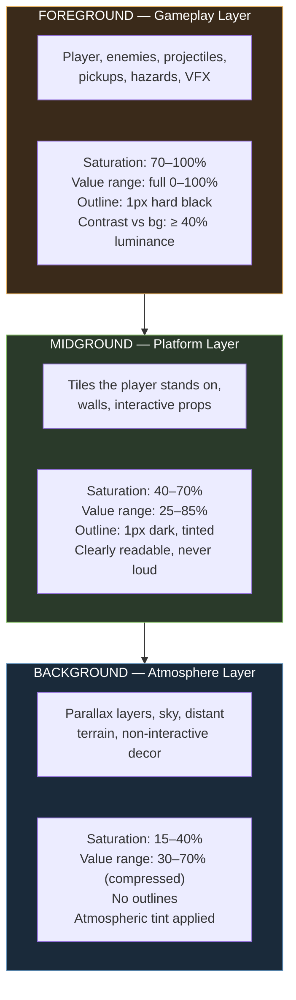
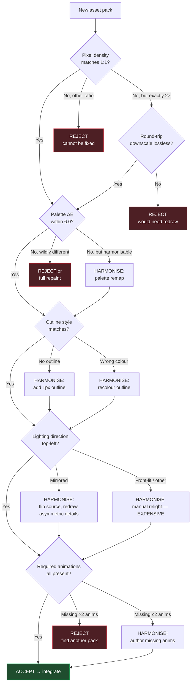
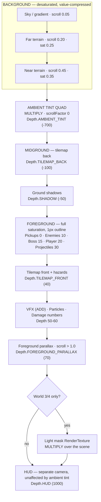

# 04 — Art Direction

**Project:** DevQuest (Working Title)
**Document Owner:** Art Director
**Status:** ✅ Stable
**Version:** 1.0.0
**Last Updated:** 2026-08-07

---

## 1. Purpose

This document defines the **visual identity** of DevQuest and the rules that keep it coherent across five worlds, four heroes, seven enemy families, five bosses, and a full UI suite — assembled largely from licensed asset packs authored by different artists.

That last clause is the hard problem. Buying good pixel art is easy. Making thirty separate packs look like they came from one studio is not. Most asset-flip games fail visually not because any individual sprite is bad, but because the pixel densities disagree, the palettes clash, the outline conventions differ, and the lighting comes from four directions at once.

This document exists to prevent that. It defines the **Style Bible**: the measurable, checkable properties every asset must have before it enters the build. An asset that fails the Style Bible is rejected regardless of how good it looks in isolation.

---

## 2. Goals

| #   | Goal                                                  | Success Signal                                                          |
| --- | ----------------------------------------------------- | ----------------------------------------------------------------------- |
| G1  | Define one cohesive visual identity                   | A stranger cannot tell which assets came from which pack                |
| G2  | Define measurable style rules, not taste statements   | "Pixel density is 1:1 at 320×180" not "keep it consistent"              |
| G3  | Define the master palette and per-world sub-palettes  | Every asset in the build resolves to the master palette                 |
| G4  | Define readability rules that protect gameplay        | The player can always distinguish player, enemy, hazard, and background |
| G5  | Define the harmonisation process for off-style assets | An off-style pack has a documented path to conformance or rejection     |
| G6  | Define VFX, lighting, and UI style                    | Effects and UI read as part of the same world                           |
| G7  | Give reviewers an objective checklist                 | Art review is a checklist pass, not an opinion                          |

---

## 3. Design Principles

### P1 — One Pixel Is One Pixel

The internal resolution is 320×180. A pixel in a character sprite, a tile, a UI element, and a VFX frame must all occupy exactly the same screen area. **Mixed pixel density is the single most damaging visual error available to this project**, and it is the most common failure in asset-assembled games.

### P2 — Gameplay Legibility Outranks Beauty

If a beautiful background makes the player hard to see, the background loses. Every visual decision is subordinate to the question "can the player instantly parse what is happening?"

### P3 — Value Before Hue

Readability comes from **luminance contrast**, not colour contrast. A scene must be readable in greyscale. This also makes it readable to colourblind players for free, which is why the accessibility work in `13-UI-UX.md` is mostly already done by following this principle.

### P4 — The Palette Is Closed

Every asset resolves to the master palette (§6). No asset introduces a new hue. Harmonisation happens at import, not at runtime.

### P5 — Consistency Beats Quality

A slightly weaker sprite that matches the style is better than an excellent sprite that does not. Cohesion is the thing players perceive; individual sprite quality is not.

### P6 — Never Scale Pixel Art Non-Integrally

No asset is ever scaled by a non-integer factor, at import or at runtime. A 1.5× scale destroys the pixel grid permanently. If an asset is the wrong size, it is redrawn or rejected — never resampled.

---

## 4. Overview

### 4.1 The Style Statement

> **DevQuest looks like a late-era 16-bit action platformer built with modern lighting sensibilities.** Chunky, readable 32-pixel-tall characters with hard black outlines against soft, atmospheric, low-contrast backgrounds. High-saturation gameplay elements against desaturated environments. Warm, physical light sources — lanterns, crystals, fire — casting coloured glows into cool ambient shadow. Every hit throws sparks; every landing throws dust.

### 4.2 The Three Visual Layers

The entire art direction rests on separating the frame into three bands of visual intensity. This is what makes a busy pixel scene readable.



**The rule that makes this work:** background value range is _compressed_. Backgrounds never use pure black or pure white. This reserves the extremes of the value scale exclusively for gameplay elements, which is why the player always pops.

### 4.3 Reference Frame

DevQuest's visual target sits between:

| Reference         | What We Take                                                                      |
| ----------------- | --------------------------------------------------------------------------------- |
| **Dead Cells**    | Foreground/background separation, glow on gameplay elements, atmospheric depth    |
| **Blasphemous**   | Rich, painterly backgrounds behind hard-edged sprites; environmental storytelling |
| **Owlboy**        | Colour harmony discipline, warm/cool ambient split                                |
| **Hollow Knight** | Silhouette clarity, restraint in background detail near the action                |
| **Celeste**       | UI legibility at small sizes, colour used functionally                            |

**What we do not take:** Dead Cells' 3D-rendered-to-2D pipeline (we are hand-pixel throughout), Blasphemous' extreme detail density (unreadable at 320×180), Celeste's minimalist environment art (we want richer worlds).

---

## 5. Technical Design — The Style Bible

Every asset must satisfy every rule in this section. These are the checkable properties referenced by the review gate in `05-Asset-Pipeline.md` §4.

### 5.1 Pixel Density

| Rule                   | Specification                                                                                                                    |
| ---------------------- | -------------------------------------------------------------------------------------------------------------------------------- |
| **Base density**       | 1 art pixel = 1 screen pixel at the 320×180 internal buffer                                                                      |
| **Tile grid**          | 16 × 16 px, no exceptions                                                                                                        |
| **Character height**   | 28–34 px for the player and humanoid enemies (see §5.2)                                                                          |
| **Scaling at import**  | Integer only (`1×`, `2×`, `0.5×` where the source is exactly double)                                                             |
| **Scaling at runtime** | Only for squash-and-stretch (±25% max) and afterimages. Never for size correction                                                |
| **Rotation**           | Forbidden on any sprite with visible pixel structure. Permitted only on radially symmetric VFX (sparks, glows, circular slashes) |

**The 0.5× exception explained:** several CraftPix packs ship at 2× the density we need (e.g., 64 px tall characters intended for a 640×360 buffer). Downscaling by exactly 0.5 with nearest-neighbour is _sometimes_ acceptable — but only if the source was drawn on a 2× grid (every logical pixel is a clean 2×2 block). If it was drawn freehand at 64 px, halving it produces mush. **The test:** downscale, upscale back to original, and diff. If the round-trip is lossless, the source was on a 2× grid and the downscale is safe. If not, the asset must be redrawn. This test is automated in `tools/atlas/check-density.ts`.

### 5.2 Character Scale Chart

All measurements are the visible sprite bounding box, excluding transparent padding.

| Entity                  | Height (px) | Width (px) | Tiles Tall | Notes                                       |
| ----------------------- | ----------- | ---------- | ---------- | ------------------------------------------- |
| Player — Knight         | 32          | 22         | 2.0        | Broadest silhouette; armour bulk            |
| Player — Samurai        | 32          | 18         | 2.0        | Reference proportions                       |
| Player — Ninja          | 30          | 16         | 1.9        | Slightly shorter, leanest                   |
| Player — Wizard         | 32          | 20         | 2.0        | Robe widens the base                        |
| Skeleton                | 30          | 16         | 1.9        | Reads as slightly smaller than the player   |
| Skeleton Archer         | 30          | 18         | 1.9        |                                             |
| Werewolf                | 34          | 30         | 2.1        | Hunched, wide — reads as fast and dangerous |
| Yokai                   | 32          | 22         | 2.0        | Floating; feet 2 px above ground line       |
| Orc                     | 38          | 28         | 2.4        | Visibly larger than the player              |
| Golem                   | 48          | 40         | 3.0        | Heavy; occupies real space                  |
| Witch                   | 32          | 24         | 2.0        | Hat adds 6 px above the head                |
| Gorgon (boss)           | 64          | 56         | 4.0        | Snake body extends the footprint            |
| Skeleton Warlord (boss) | 52          | 36         | 3.3        |                                             |
| Alpha Werewolf (boss)   | 56          | 52         | 3.5        |                                             |
| Oni Lord (boss)         | 58          | 42         | 3.6        |                                             |
| Golem Sovereign (boss)  | 80          | 68         | 5.0        | Largest entity in the game                  |

**Why the player is 32 px:** at 320×180, a 32 px character is 17.8% of the screen height. This is the sweet spot — large enough for readable animation detail, small enough that the camera can show meaningful level context (11.25 tiles of vertical space, of which the player occupies 2).

**The size hierarchy is a gameplay communication tool.** An enemy taller than the player is telling the player it hits harder. This is enforced: no enemy may be larger than the player unless its damage or HP exceeds the player's baseline.

### 5.3 Outlines

| Element               | Outline                                            | Colour                                            |
| --------------------- | -------------------------------------------------- | ------------------------------------------------- |
| Player                | 1 px, fully enclosed                               | `#0d0b14` (near-black, the darkest palette value) |
| Enemies               | 1 px, fully enclosed                               | `#0d0b14`                                         |
| Bosses                | 1 px, fully enclosed                               | `#0d0b14`                                         |
| Projectiles / pickups | 1 px, fully enclosed                               | `#0d0b14`                                         |
| Midground tiles       | 1 px on silhouette edges only, not internal detail | World-tinted dark (see §6.3)                      |
| Background layers     | **No outline**                                     | —                                                 |
| VFX                   | No outline; VFX are light, not objects             | —                                                 |
| UI panels             | 1 px                                               | `#0d0b14`                                         |
| UI text               | 1 px drop shadow, no outline                       | Shadow `#0d0b14` at 60%                           |

**Selective outlining on tiles** is what keeps the midground from competing with the foreground. A fully outlined tileset makes every brick shout as loudly as the player.

**Anti-aliasing is banned.** No soft edges anywhere. Any pack shipping AA'd sprites must be cleaned (§8.2) or rejected.

### 5.4 Lighting Convention

| Rule                        | Specification                                                                                                 |
| --------------------------- | ------------------------------------------------------------------------------------------------------------- |
| **Key light direction**     | Top-left, at approximately 45°                                                                                |
| **Consequence**             | Highlights on the upper-left of forms; shadows on the lower-right                                             |
| **Ambient fill**            | Cool (`#3a4a6b` family), applied to shadow sides                                                              |
| **Rim light**               | Warm, on the lower-right of foreground characters only, 1 px, 30% opacity. Separates them from the background |
| **Emissive sources**        | Lanterns, crystals, fire, magic. These override the key light locally and cast a coloured glow                |
| **Shadow under characters** | Mandatory. A 2 px tall, 60%-opacity ellipse, width = 70% of sprite width, colour `#0d0b14` at 45% alpha       |

**The character shadow is not decorative.** In a game with precision platforming, the ground shadow is the single most valuable readability affordance available — it tells the player exactly where they will land. It scales with height above ground (smaller and fainter when higher), and is drawn on the layer directly beneath the character.

```
shadowScale  = clamp(1 - heightAboveGround / 64, 0.35, 1.0)
shadowAlpha  = 0.45 * shadowScale
```

### 5.5 Silhouette Test

Every character sprite must pass the silhouette test before integration:

1. Fill the sprite entirely with `#000000`.
2. Place it at 1× on a `#ffffff` background.
3. **Can you identify the character?** If not, the silhouette is not distinct enough.
4. Place all four heroes' silhouettes side by side. **Are all four distinguishable?** If not, the roster lacks visual distinctiveness.

The four heroes are silhouette-differentiated by:

| Hero    | Silhouette Signature                                      |
| ------- | --------------------------------------------------------- |
| Knight  | Widest; shield profile on the off-hand side; helmet plume |
| Samurai | Topknot; long sheathed blade angled behind                |
| Ninja   | Narrowest; trailing scarf; hunched forward stance         |
| Wizard  | Pointed hat; wide robe base; staff vertical               |

The same test applies to enemies within a world. Two enemies that appear in the same level must have distinguishable silhouettes.

### 5.6 Animation Frame Style

Detailed frame counts and timing are in `14-Animation-Standards.md`. The **stylistic** rules are:

| Rule                | Specification                                                                                                                           |
| ------------------- | --------------------------------------------------------------------------------------------------------------------------------------- |
| Sub-pixel motion    | Forbidden. All movement in animation is whole-pixel                                                                                     |
| Frame interpolation | None. Pixel art is stepped, never tweened                                                                                               |
| Smear frames        | Permitted and encouraged on fast attacks (1 frame max)                                                                                  |
| Anticipation        | Mandatory on every attack — minimum 2 frames of windup                                                                                  |
| Follow-through      | Mandatory on every attack — minimum 2 frames of recovery                                                                                |
| Held poses          | Permitted for readability. A 3-frame hold on an attack's active frame is better than a smooth 8-frame swing that the player cannot read |
| Idle breathing      | 4–6 frames, 2 px vertical travel max                                                                                                    |
| Colour cycling      | Permitted on emissive elements (crystal glow, fire), 3–4 frames                                                                         |

---

## 6. The Master Palette

### 6.1 Structure

The palette is a **48-colour master** organised into functional ramps. Every asset in the game resolves to these colours. Per-world sub-palettes are subsets, not extensions.

The palette is stored as `art/palettes/devquest-master.gpl` (GIMP format, readable by Aseprite, Photoshop, and the atlas tooling) and as `art/palettes/devquest-master.png` (a 48×1 indexed strip used by the automated conformance checker).

### 6.2 The Ramps

**Neutral ramp (8) — outlines, UI, shadow, structure**

| #   | Hex       | Use                                      |
| --- | --------- | ---------------------------------------- |
| N0  | `#0d0b14` | Outline black, deepest shadow, UI border |
| N1  | `#1c1a2a` | Deep shadow, UI panel fill               |
| N2  | `#2e2b40` | Shadow, background darkest               |
| N3  | `#474459` | Mid-dark neutral                         |
| N4  | `#6b6878` | Mid neutral                              |
| N5  | `#9a97a6` | Light neutral, UI inactive text          |
| N6  | `#c8c6d0` | Highlight neutral, UI active text        |
| N7  | `#f2f0f5` | Pure highlight, hit flash                |

**Warm ramp (8) — skin, wood, fire, gold, the Autumn world**

| #   | Hex       | Use                          |
| --- | --------- | ---------------------------- |
| W0  | `#2b1410` | Darkest warm                 |
| W1  | `#4d2418` | Deep wood, dried blood       |
| W2  | `#7a3b1f` | Wood, leather                |
| W3  | `#a85a2c` | Bright wood, autumn leaf     |
| W4  | `#d4813f` | Skin shadow, orange leaf     |
| W5  | `#e8a75f` | Skin mid, gold, lantern glow |
| W6  | `#f4cd8e` | Skin highlight, bright gold  |
| W7  | `#fdeec4` | Fire core, brightest warm    |

**Cool ramp (8) — metal, stone, sky, the Cave and Graveyard worlds**

| #   | Hex       | Use                          |
| --- | --------- | ---------------------------- |
| C0  | `#0f1a2b` | Darkest cool, night sky      |
| C1  | `#1d2f4a` | Deep water, deep shadow      |
| C2  | `#2f4a6b` | Ambient shadow fill          |
| C3  | `#456b94` | Stone shadow, distant hills  |
| C4  | `#5f8fb9` | Stone mid, sky               |
| C5  | `#8bb4d4` | Stone highlight, bright sky  |
| C6  | `#b8d6e8` | Ice, crystal highlight       |
| C7  | `#e4f2fa` | Brightest cool, crystal core |

**Green ramp (6) — foliage, the Verdant world, poison**

| #   | Hex       | Use                          |
| --- | --------- | ---------------------------- |
| G0  | `#14240f` | Darkest foliage              |
| G1  | `#254019` | Deep grass                   |
| G2  | `#3d6626` | Grass shadow                 |
| G3  | `#5f9438` | Grass mid                    |
| G4  | `#8ac04f` | Grass highlight, leaf        |
| G5  | `#c2e876` | Brightest green, poison glow |

**Magenta / purple ramp (6) — magic, the Graveyard, Gorgon, portfolio accent**

| #   | Hex       | Use                   |
| --- | --------- | --------------------- |
| M0  | `#1e0f2b` | Darkest purple        |
| M1  | `#3a1d4d` | Deep magic shadow     |
| M2  | `#5f2e78` | Magic mid-dark        |
| M3  | `#8f47a8` | Magic mid             |
| M4  | `#bd6fd1` | Magic highlight       |
| M5  | `#e8b0f2` | Magic glow, brightest |

**Signal ramp (6) — gameplay-critical, reserved**

These six colours are **reserved for gameplay communication only.** No environment or background asset may use them. This guarantees that when the player sees signal red, it always means damage.

| #   | Hex       | Meaning                | Reserved For                                                 |
| --- | --------- | ---------------------- | ------------------------------------------------------------ |
| S0  | `#c42b3a` | **Damage / hostile**   | Enemy attack telegraphs, player damage vignette, health loss |
| S1  | `#f04a4a` | **Damage bright**      | Damage numbers, critical hits                                |
| S2  | `#2fbf6b` | **Heal / safe**        | Health pickups, checkpoint active, safe zones                |
| S3  | `#ffd23f` | **Collectible**        | Coins, sparkles, treasure                                    |
| S4  | `#3fc4ff` | **Interactive**        | Usable objects, doors, switches, dash-refresh                |
| S5  | `#ff8fd4` | **Portfolio / unlock** | Codex UI, unlock ceremony, portfolio markers                 |

**Total: 8 + 8 + 8 + 6 + 6 + 6 = 42 colours**, plus 6 held in reserve for per-world emissive accents = **48**.

### 6.3 Per-World Sub-Palettes and Ambient Tint

Each world uses a subset of the master palette, plus a global **ambient tint** applied to background layers only (via a tinted quad, not by re-authoring art).

| World                  | Dominant Ramps            | Ambient Tint              | Tint Alpha | Emissive Accent                |
| ---------------------- | ------------------------- | ------------------------- | ---------- | ------------------------------ |
| **1 — Verdant Ascent** | Green, Warm               | `#8bb4d4` (cool daylight) | 0.10       | `#ffd23f` (sun shafts)         |
| **2 — Autumn Reach**   | Warm, Green (desaturated) | `#d4813f` (golden hour)   | 0.18       | `#e8a75f` (low sun)            |
| **3 — Hollow Barrow**  | Cool, Magenta             | `#1d2f4a` (night)         | 0.35       | `#5f9438` (soul-green lantern) |
| **4 — Crystal Deep**   | Cool, Magenta             | `#0f1a2b` (subterranean)  | 0.40       | `#3fc4ff` (crystal light)      |
| **5 — Gorgon's Spire** | Neutral, Magenta          | `#3a1d4d` (storm)         | 0.28       | `#c42b3a` (torch fire)         |

**Implementation:** the ambient tint is a full-screen `MULTIPLY`-blended quad rendered above the background layers and **below** the midground. It never touches foreground gameplay elements. This is what allows one background pack to serve two worlds at different times of day, and it is the cheapest atmosphere tool available.

```ts
// src/level/ParallaxBackground.ts
this.ambientQuad = scene.add
  .rectangle(0, 0, DISPLAY.WIDTH, DISPLAY.HEIGHT, world.ambientTint, world.ambientAlpha)
  .setOrigin(0)
  .setScrollFactor(0)
  .setBlendMode(Phaser.BlendModes.MULTIPLY)
  .setDepth(Depth.AMBIENT_TINT); // between BACKGROUND and MIDGROUND
```

### 6.4 Palette Conformance

Every asset entering the build is checked against the master palette:

```
tools/atlas/check-palette.ts
  → for each PNG, extract unique non-transparent colours
  → for each colour, find nearest master-palette entry (CIEDE2000 in Lab space)
  → if ΔE > 6.0 for any colour → FAIL, report the offending hex and pixel count
  → if 2.0 < ΔE ≤ 6.0 → WARN, auto-remappable
  → if ΔE ≤ 2.0 → PASS, snap to the palette entry
```

**ΔE 6.0 as the threshold:** below this, the difference is imperceptible at 320×180 on a typical display, and auto-snapping is safe. Above it, the asset genuinely introduces a new colour and needs a human decision — either harmonise it (§8) or add the colour to the master palette via ADR (which has happened zero times and should stay that way).

---

## 7. VFX Style

### 7.1 The VFX Philosophy

**VFX are light, not objects.** They have no outlines, use additive blending, are brightest at their core, and fade to transparent rather than to a dark edge. This is what separates a satisfying impact spark from a sticker slapped on the screen.

### 7.2 The VFX Catalogue

| Effect                | Frames | Size (px)   | Blend    | Palette                    | Lifetime          |
| --------------------- | ------ | ----------- | -------- | -------------------------- | ----------------- |
| **Slash — light**     | 5      | 32×32       | `ADD`    | N7 → N6 → transparent      | 83 ms             |
| **Slash — heavy**     | 7      | 48×48       | `ADD`    | N7 → W6 → transparent      | 116 ms            |
| **Slash — magic**     | 6      | 40×40       | `ADD`    | M5 → M4 → transparent      | 100 ms            |
| **Impact spark**      | 4      | 8×8         | `ADD`    | N7 → S3                    | 300 ms (particle) |
| **Explosion — small** | 8      | 32×32       | `ADD`    | W7 → W5 → W3 → transparent | 133 ms            |
| **Explosion — large** | 12     | 64×64       | `ADD`    | W7 → W5 → W2 → transparent | 200 ms            |
| **Dust — run**        | 3      | 16×12       | `NORMAL` | N5 at 50% alpha            | 200 ms            |
| **Dust — land**       | 5      | 32×16       | `NORMAL` | N5 at 60% alpha            | 280 ms            |
| **Dust — jump**       | 4      | 24×12       | `NORMAL` | N5 at 55% alpha            | 220 ms            |
| **Dash afterimage**   | —      | sprite copy | `ADD`    | tinted C5, 50%→0%          | 180 ms            |
| **Dash streak**       | 4      | 48×16       | `ADD`    | C6 → transparent           | 133 ms            |
| **Coin sparkle**      | 5      | 12×12       | `ADD`    | S3 → N7                    | 250 ms            |
| **Heal burst**        | 8      | 32×32       | `ADD`    | S2 → N7 → transparent      | 400 ms            |
| **Unlock burst**      | 16     | 96×96       | `ADD`    | S5 → M5 → N7               | 600 ms            |
| **Damage vignette**   | —      | fullscreen  | `ADD`    | S0 at 25%                  | 200 ms            |
| **Petrify wave** (W5) | 10     | 64×64       | `NORMAL` | N4 → N6                    | 500 ms            |

### 7.3 VFX Rules

| Rule                              | Rationale                                                                                                                                     |
| --------------------------------- | --------------------------------------------------------------------------------------------------------------------------------------------- |
| VFX never obscure the player      | Slash effects are offset toward the target, not centred on the attacker                                                                       |
| VFX never last longer than 600 ms | Beyond this they become clutter rather than feedback                                                                                          |
| Maximum 32 concurrent VFX sprites | Budget from `00-README.md` §5.5                                                                                                               |
| All VFX live in the `core` atlas  | Keeps them to a single texture bind                                                                                                           |
| VFX are pooled, always            | Pillar 3 falsification test #4                                                                                                                |
| VFX respect Reduced Motion        | Screen-space effects (vignette, flash, shake) are disabled; world-space effects (slash, dust) are kept — they are information, not decoration |

### 7.4 Colour-Coding Damage Numbers

Damage numbers use the signal ramp exclusively, and their meaning is fixed:

| Damage Source             | Colour         | Size                        |
| ------------------------- | -------------- | --------------------------- |
| Player normal hit         | `#f2f0f5` (N7) | 6 px font                   |
| Player critical / charged | `#ffd23f` (S3) | 8 px font                   |
| Player magic              | `#bd6fd1` (M4) | 6 px font                   |
| Damage to player          | `#f04a4a` (S1) | 8 px font                   |
| Healing                   | `#2fbf6b` (S2) | 6 px font                   |
| Blocked / zero damage     | `#9a97a6` (N5) | 6 px font, shown as "BLOCK" |

---

## 8. Harmonising Licensed Assets

This is the operational heart of the document. The locked asset manifest (`05-Asset-Pipeline.md` §3) draws from ~15 CraftPix packs authored by different artists. They will not match out of the box.

### 8.1 The Harmonisation Decision Tree



### 8.2 The Harmonisation Operations

| Operation                           | Tool                                                                                       | Cost                      | Notes                                                           |
| ----------------------------------- | ------------------------------------------------------------------------------------------ | ------------------------- | --------------------------------------------------------------- |
| **Palette remap**                   | `tools/atlas/remap-palette.ts` (nearest-Lab)                                               | Automatic                 | The most common fix. Run on every pack at import                |
| **Outline addition**                | Aseprite `Outline` (1 px, `#0d0b14`, all sides)                                            | Minutes                   | Scripted for a whole folder                                     |
| **Outline recolour**                | Aseprite `Replace Color`                                                                   | Minutes                   | Scripted                                                        |
| **AA removal**                      | `tools/atlas/deaa.ts` — snaps near-edge pixels to nearest solid neighbour or transparent   | Automatic + manual review | Always needs a human pass; automated de-AA can eat thin details |
| **2× downscale**                    | `sharp` with `kernel: 'nearest'`, after the round-trip test                                | Automatic                 | See §5.1                                                        |
| **Relighting**                      | Manual, in Aseprite                                                                        | Hours per character       | Expensive. Prefer rejecting the pack                            |
| **Missing animation authoring**     | Manual                                                                                     | 2–6 hours per animation   | Budget for this; several packs lack `hurt`                      |
| **Desaturation for background use** | `tools/atlas/desaturate.ts` — pulls saturation to the §4.2 band and compresses value range | Automatic                 | Applied to all background layers                                |

### 8.3 Known Harmonisation Work per Locked Pack

Recorded here so the work is scheduled rather than discovered.

| Pack                        | Expected Work                                                                     | Estimated Effort |
| --------------------------- | --------------------------------------------------------------------------------- | ---------------- |
| Knight (free)               | Palette remap; verify `hurt` exists                                               | 2 h              |
| Samurai (free)              | Palette remap; outline check                                                      | 2 h              |
| Ninja (free)                | Palette remap; likely needs `hurt` authored                                       | 6 h              |
| Wizard (free)               | Palette remap; robe silhouette may need widening for distinctiveness              | 4 h              |
| Skeleton (free)             | Palette remap                                                                     | 1 h              |
| Werewolf (free)             | Palette remap; scale check (may be 2×)                                            | 3 h              |
| Yokai (free)                | Palette remap; add float offset to idle                                           | 3 h              |
| Gorgon (free)               | Palette remap; boss-scale verification; likely needs a phase-2 recolour variant   | 8 h              |
| Orc (paid)                  | Palette remap                                                                     | 2 h              |
| Golem (paid)                | Palette remap; scale verification at 48 px                                        | 3 h              |
| Witch (paid)                | Palette remap                                                                     | 2 h              |
| Autumn Forest tileset       | Palette remap; selective-outline pass on silhouette edges                         | 6 h              |
| Crystal Cave tileset        | Palette remap; emissive crystal frames may need authoring                         | 8 h              |
| Forbidden Graveyard tileset | Palette remap; selective-outline pass                                             | 6 h              |
| Green Zone tileset          | Palette remap; selective-outline pass                                             | 6 h              |
| Fairy Tale backgrounds      | Desaturate + value-compress to the background band                                | 4 h              |
| Nature backgrounds          | Desaturate + value-compress; layer separation check                               | 4 h              |
| Explosion pack              | Palette remap; convert to additive-friendly (remove dark edges)                   | 3 h              |
| Slash effects               | Palette remap; **de-cartoon** — the source is a cartoon style and needs restraint | 6 h              |

**Total estimated harmonisation effort: ~79 hours (≈ 2 weeks).** This is scheduled explicitly in `17-Roadmap.md` M3 and is the single most commonly underestimated cost in an asset-assembled project.

### 8.4 The Slash Pack Warning

The locked "Free Slash Sprite Cartoon Effects" pack is, by its own name, **cartoon** styled — thick, smooth, anime-style arcs. Used raw, it will be the most visually discordant element in the game.

**Required treatment:**

1. Reduce to 5–7 frames (source has more; we need fewer for a 60 fps read).
2. Remap to the neutral ramp only — no coloured slashes except the magic variant.
3. Hard-quantise: no gradients, maximum 3 values per frame.
4. Thin the arcs by 1–2 px so they read as a blade path rather than a painted swoosh.
5. Convert to `ADD` blend, which requires removing all dark pixels (dark + additive = invisible, which is correct, but leftover mid-darks look muddy).

If after this treatment the pack still reads as foreign, **author custom slashes instead**. A 5-frame slash arc is roughly 2 hours of work and is the highest-visibility VFX in the game.

---

## 9. UI Style

Full UI specification is in `13-UI-UX.md`. This section defines only the **visual** rules.

### 9.1 UI Visual Language

> **Modern pixel UI:** clean geometry, generous negative space, one accent colour per context, and no faux-3D bevelling. The UI looks like it was designed in 2026 and rendered in 1994.

| Element                | Specification                                                                        |
| ---------------------- | ------------------------------------------------------------------------------------ |
| **Panel fill**         | `#1c1a2a` (N1) at 92% alpha                                                          |
| **Panel border**       | 1 px `#0d0b14` (N0) outer, 1 px `#474459` (N3) inner                                 |
| **Panel corners**      | Square. No rounding — rounded corners at 320×180 cost 4 px per corner for no benefit |
| **Divider**            | 1 px `#2e2b40` (N2)                                                                  |
| **Text — primary**     | `#f2f0f5` (N7) with a 1 px `#0d0b14` drop shadow at 60%                              |
| **Text — secondary**   | `#9a97a6` (N5), no shadow                                                            |
| **Text — disabled**    | `#474459` (N3)                                                                       |
| **Focus ring**         | 1 px `#ffd23f` (S3), animated 2-frame dash offset                                    |
| **Selected item fill** | `#2e2b40` (N2)                                                                       |
| **Accent — menu**      | `#3fc4ff` (S4)                                                                       |
| **Accent — Codex**     | `#ff8fd4` (S5)                                                                       |
| **Accent — danger**    | `#c42b3a` (S0)                                                                       |

### 9.2 Typography

| Font            | Size                            | Use                                    |
| --------------- | ------------------------------- | -------------------------------------- |
| `devquest-6px`  | 6 px cap height, variable width | Body text, menu items, Codex prose     |
| `devquest-8px`  | 8 px cap height, variable width | Headings, damage numbers, HUD counters |
| `devquest-12px` | 12 px cap height, fixed width   | Titles, boss names, world names        |

All three are bitmap fonts (Phaser `BitmapText`), authored once and packed into the `core` atlas. **No system fonts, no web fonts, no `Phaser.GameObjects.Text`** — TTF rendering at 320×180 produces anti-aliased, non-grid-aligned glyphs that instantly break the style. This rule is enforced by an ESLint ban on `this.add.text`.

**Line height:** cap height + 4 px. **Letter spacing:** 1 px. **Word spacing:** 3 px.

**Recommended pack for the font:** CraftPix does not ship a bitmap font that fits. The font is **custom-authored** — this is one of the few sanctioned custom assets, because a font is the one element that must match the game exactly and no licensed pack will. Budget: 12 hours for three weights of a 96-glyph Latin set.

### 9.3 HUD Layout

```
┌──────────────────────────────────────────────────────────┐  y=0
│ ♥♥♥♥♡  [====----]                          ⬤ 142   ◈ 3/4 │  HUD band, 20px
├──────────────────────────────────────────────────────────┤  y=20
│                                                          │
│                                                          │
│                     GAMEPLAY                             │
│                     (320 × 148)                          │
│                                                          │
│                                                          │
├──────────────────────────────────────────────────────────┤  y=168
│  [J] Attack   [K] Dash   [L] Special        (fades 8s)   │  hint band, 12px
└──────────────────────────────────────────────────────────┘  y=180
```

| Zone               | Height | Contents                                                              |
| ------------------ | ------ | --------------------------------------------------------------------- |
| HUD band (top)     | 20 px  | Health hearts, ability cooldown bar, coin counter, shard counter      |
| Gameplay           | 148 px | The camera viewport                                                   |
| Hint band (bottom) | 12 px  | Control hints, fades out after 8 s of play, returns on a new mechanic |

**The HUD does not overlay gameplay.** At 320×180 there is not enough room for a translucent overlaid HUD to be both readable and non-intrusive. Reserving 32 px of vertical space costs camera view but buys permanent legibility. The camera's effective viewport is therefore 320×148, and all level design is authored against that number.

---

## 10. Implementation Notes

### 10.1 Depth Layering

Every renderable object has an explicit depth. Implicit depth (creation order) is banned — it produces bugs that appear only when spawn order changes.

```ts
// src/config/Depth.ts
// NORMATIVE

export const Depth = {
  BACKGROUND_FAR: -1000,
  BACKGROUND_MID: -900,
  BACKGROUND_NEAR: -800,
  AMBIENT_TINT: -700, // the MULTIPLY quad from §6.3

  TILEMAP_BACK: -100, // decorative tiles behind entities
  SHADOW: -50, // character ground shadows

  PICKUP: 0,
  ENEMY: 10,
  BOSS: 15,
  PLAYER: 20, // player renders above enemies — always readable
  PROJECTILE: 30,

  TILEMAP_FRONT: 40, // foreground tiles occluding entities
  HAZARD: 45,

  VFX_WORLD: 50, // slashes, dust, explosions
  PARTICLE: 55,
  DAMAGE_NUMBER: 60,

  FOREGROUND_PARALLAX: 70, // atmospheric foreground (fog, leaves)

  SCREEN_FLASH: 900,
  HUD: 1000,
  TOAST: 1050,
  MENU: 1100,
  MODAL: 1200,
  TRANSITION: 1300,
  DEBUG: 9999,
} as const;
```

**The player is at depth 20, above all enemies at 10.** This is a deliberate readability choice: in a crowded fight the player must never be hidden behind an enemy sprite. It occasionally looks slightly wrong (the player overlapping a much larger Golem) and that trade is accepted.

### 10.2 Camera and Pixel-Perfect Rendering

```ts
// GameScene.create()
this.cameras.main.setRoundPixels(true);
this.cameras.main.setBounds(0, 0, level.widthPx, level.heightPx);
this.cameras.main.setViewport(0, 20, 320, 148); // reserve the HUD band
this.cameras.main.startFollow(this.player, true, 0.12, 0.12);
this.cameras.main.setDeadzone(48, 32);
this.cameras.main.setFollowOffset(0, -12); // bias view upward — we jump more than we fall
```

**Three pixel-perfection hazards and their fixes:**

1. **Camera scroll fractional values** → `setRoundPixels(true)` on the camera, plus `roundPixels: true` globally. Without both, sprites shimmer during camera movement.
2. **Parallax layers at fractional scroll factors** → scroll factors must produce whole-pixel offsets. Use `Math.floor(cameraScrollX * factor)` when positioning manually rather than relying on `setScrollFactor` for anything other than 0 or 1.
3. **Tweened positions** → any position tween must have `Math.round` applied in `onUpdate`, or use integer-stepped tweens.

### 10.3 The Ambient Tint and the HUD

The ambient tint quad is scroll-factor 0 and sits at depth `-700`, so it covers the full gameplay viewport but not the HUD (which is drawn by `UIScene` in a separate camera at depth 1000). This is why the HUD stays at full brightness in dark World 3 and World 4 — a deliberate legibility exception.

### 10.4 Tools

| Tool                       | Use                         | Notes                                                                           |
| -------------------------- | --------------------------- | ------------------------------------------------------------------------------- |
| **Aseprite**               | Primary pixel editor        | Palette file loaded by default; scripts in `art/scripts/`                       |
| **Tiled 1.11+**            | Level and tileset authoring | Tileset must be imported at 16 px with 0 margin, 0 spacing                      |
| **`free-tex-packer-core`** | Atlas generation            | Deterministic; see `05-Asset-Pipeline.md` §7                                    |
| **`sharp`**                | Programmatic image ops      | Always `kernel: 'nearest'`                                                      |
| **Lospec Palette List**    | Palette reference           | The master palette is custom, but Lospec is the reference for ramp construction |

**Aseprite scripts to author** (in `art/scripts/`):

| Script                     | Purpose                                                |
| -------------------------- | ------------------------------------------------------ |
| `apply-master-palette.lua` | Remaps the active sprite to the master palette         |
| `add-outline.lua`          | Adds a 1 px `#0d0b14` outline to all cels              |
| `export-anim-strip.lua`    | Exports a horizontal strip + a JSON frame-tag manifest |
| `check-density.lua`        | Reports whether the sprite is on a 2× grid             |

---

## 11. Examples

### 11.1 A World 1 Frame, Layer by Layer

```
Depth -1000  Sky gradient           C5 → C4, no detail, scroll 0.05
Depth  -900  Distant hills          C3, desaturated to 25%, scroll 0.20
Depth  -800  Near treeline          G2/G1, desaturated to 35%, scroll 0.45
Depth  -700  Ambient tint           #8bb4d4 @ 10% MULTIPLY, scroll 0
Depth  -100  Decorative back tiles  Green Zone set, G1/G2/W2, full sat
Depth   -50  Player shadow          #0d0b14 @ 45%, 2px ellipse
Depth     0  Coins                  S3 with a 1px N7 highlight
Depth    10  Skeleton               N5/N6 bone, W2 rags, 1px N0 outline
Depth    20  Knight                 C4/C5 armour, W3 leather, 1px N0 outline
Depth    40  Foreground grass tiles G3/G4, occludes the player's feet
Depth    50  Run dust               N5 @ 50%
Depth    70  Foreground leaves      G2 @ 40%, scroll 1.4
Depth  1000  HUD                    N1 panel, N7 text, S0 hearts
```

**What makes this read:** the Knight is the only object in the frame using C5 at full saturation with a hard black outline. Everything behind him is either desaturated, tinted, or both. He cannot be missed.

### 11.2 Rejecting an Asset — A Worked Case

**Candidate:** a free "Fire Elemental" enemy pack found while browsing.

| Check  | Result                                                             |
| ------ | ------------------------------------------------------------------ |
| Source | Not CraftPix → **immediate fail** per the art direction constraint |

Even if it had passed, the process continues for the record:

| Check         | Result                                                                  |
| ------------- | ----------------------------------------------------------------------- |
| Pixel density | 48 px tall, non-2× ratio to our 32 px → cannot integer-scale → **fail** |
| Palette       | 89 unique colours, 31 with ΔE > 6.0 → heavy remap needed                |
| Outline       | None → harmonisable                                                     |
| Lighting      | Front-lit, no directional key → **expensive relight**                   |
| Animations    | Has idle, walk, attack, death. Missing `hurt` → harmonisable            |

**Verdict: Rejected on source and density.** The correct action is to find a CraftPix fire-elemental equivalent, or reskin an existing licensed enemy (a Witch recolour with fire VFX is a 3-hour job and is guaranteed to be style-consistent).

**The lesson recorded:** the density check is the cheapest one and eliminates most candidates. Run it first.

### 11.3 The Greyscale Test in Practice

Take any gameplay screenshot, desaturate it completely, and check:

| Question                                           | Required Answer |
| -------------------------------------------------- | --------------- |
| Can you find the player in under 0.5 s?            | Yes             |
| Can you distinguish enemies from background props? | Yes             |
| Can you identify which platforms are solid?        | Yes             |
| Can you see the hazard?                            | Yes             |
| Can you read the HUD?                              | Yes             |

If any answer is no, the scene relies on hue for information, which fails P3 and fails colourblind players. The fix is always a **value** adjustment, never a hue adjustment.

This test is automated in CI: `tools/ci/check-contrast.ts` takes the visual-regression screenshots, converts to luminance, and asserts the player sprite's mean luminance differs from the surrounding 64×64 region by at least 40%.

---

## 12. Data Structures

```ts
// src/config/Palette.ts
// NORMATIVE — generated from art/palettes/devquest-master.gpl

export const Palette = {
  // Neutral
  N0: 0x0d0b14,
  N1: 0x1c1a2a,
  N2: 0x2e2b40,
  N3: 0x474459,
  N4: 0x6b6878,
  N5: 0x9a97a6,
  N6: 0xc8c6d0,
  N7: 0xf2f0f5,
  // Warm
  W0: 0x2b1410,
  W1: 0x4d2418,
  W2: 0x7a3b1f,
  W3: 0xa85a2c,
  W4: 0xd4813f,
  W5: 0xe8a75f,
  W6: 0xf4cd8e,
  W7: 0xfdeec4,
  // Cool
  C0: 0x0f1a2b,
  C1: 0x1d2f4a,
  C2: 0x2f4a6b,
  C3: 0x456b94,
  C4: 0x5f8fb9,
  C5: 0x8bb4d4,
  C6: 0xb8d6e8,
  C7: 0xe4f2fa,
  // Green
  G0: 0x14240f,
  G1: 0x254019,
  G2: 0x3d6626,
  G3: 0x5f9438,
  G4: 0x8ac04f,
  G5: 0xc2e876,
  // Magenta
  M0: 0x1e0f2b,
  M1: 0x3a1d4d,
  M2: 0x5f2e78,
  M3: 0x8f47a8,
  M4: 0xbd6fd1,
  M5: 0xe8b0f2,
  // Signal — RESERVED for gameplay communication
  S0: 0xc42b3a,
  S1: 0xf04a4a,
  S2: 0x2fbf6b,
  S3: 0xffd23f,
  S4: 0x3fc4ff,
  S5: 0xff8fd4,
} as const;

export type PaletteKey = keyof typeof Palette;

/** Colours no environment or background asset may use. */
export const RESERVED_SIGNAL: readonly PaletteKey[] = ['S0', 'S1', 'S2', 'S3', 'S4', 'S5'];
```

```ts
// src/data/schemas/world-visuals.schema.ts (shape)
export interface WorldVisuals {
  readonly worldId: WorldId;
  readonly tilesetKey: string;
  readonly backgroundLayers: readonly {
    readonly textureKey: string;
    readonly scrollFactor: number; // 0.05 – 0.60
    readonly depth: number; // from Depth.BACKGROUND_*
    readonly saturationScale: number; // 0.15 – 0.40, applied at import
    readonly yOffset: number;
  }[];
  readonly ambient: {
    readonly tint: number; // hex, must be a Palette value
    readonly alpha: number; // 0.00 – 0.50
  };
  readonly emissiveAccent: number; // hex, must be a Palette value
  readonly allowedRamps: readonly ('N' | 'W' | 'C' | 'G' | 'M')[];
  readonly foregroundParallax?: {
    readonly textureKey: string;
    readonly scrollFactor: number; // > 1.0
    readonly alpha: number;
  };
}
```

```ts
// tools/atlas/palette-check result type
export interface PaletteReport {
  readonly file: string;
  readonly uniqueColours: number;
  readonly conformant: number; // ΔE ≤ 2.0
  readonly snappable: number; // 2.0 < ΔE ≤ 6.0
  readonly violations: readonly {
    readonly hex: string;
    readonly pixelCount: number;
    readonly nearestPaletteKey: PaletteKey;
    readonly deltaE: number;
  }[];
  readonly usesReservedSignal: readonly PaletteKey[]; // must be empty for env assets
  readonly verdict: 'pass' | 'auto-snap' | 'fail';
}
```

---

## 13. Future Expansion

| Item                             | Trigger                                                     | Notes                                                                                                                             |
| -------------------------------- | ----------------------------------------------------------- | --------------------------------------------------------------------------------------------------------------------------------- |
| **Dynamic 2D lighting**          | If World 3/4 lantern mechanics need more than a radial mask | A light-map render pass. ~2 weeks. Would significantly raise the visual ceiling but risks the perf budget on the minimum hardware |
| **Palette-swap character skins** | Post-launch cosmetics                                       | Nearly free — swap the indexed palette per hero. The closed-palette discipline makes this trivial                                 |
| **Weather systems**              | Post-launch                                                 | Rain, snow, falling leaves as foreground parallax particles. ~1 week per weather type                                             |
| **Destructible tile visuals**    | If a world mechanic needs it                                | Requires per-tile damage states in the tileset                                                                                    |
| **A sixth world palette**        | New world content                                           | Add a sub-palette, not new master colours                                                                                         |
| **Higher internal resolution**   | Never for this project                                      | Would invalidate every asset. Recorded as permanently rejected                                                                    |
| **Normal-mapped sprites**        | Never                                                       | Phaser supports it; the style does not want it                                                                                    |

---

## 14. Acceptance Criteria

- [ ] `art/palettes/devquest-master.gpl` exists with exactly 48 colours matching §6.2.
- [ ] `src/config/Palette.ts` is generated from the `.gpl` and CI verifies parity.
- [ ] Every PNG in `public/assets/` passes `tools/atlas/check-palette.ts` with verdict `pass` or `auto-snap`.
- [ ] No environment or background asset uses a reserved signal colour (`check-palette` reports this).
- [ ] Every character sprite in the build is within the §5.2 scale chart, verified by `check-density.ts`.
- [ ] The four heroes pass the silhouette test (§5.5) — documented with a side-by-side image in `docs/assets/ref/`.
- [ ] Every character has a ground shadow scaled by height.
- [ ] `Depth.ts` is the only source of depth values; no literal `setDepth(n)` outside it (ESLint rule).
- [ ] `this.add.text` appears nowhere in `src/` (ESLint rule); all text is `BitmapText`.
- [ ] All three bitmap font weights exist and are packed into the `core` atlas.
- [ ] The greyscale contrast check passes for every visual-regression screenshot.
- [ ] Every locked pack in §8.3 has its harmonisation work completed and signed off.
- [ ] The slash pack has been de-cartooned per §8.4, or replaced with custom slashes.
- [ ] The ambient tint quad renders below midground and does not affect the HUD.

---

## 15. Architecture — Render Composition

How the art direction is assembled at runtime. Each band is a distinct
composition stage; the depth constants in §10.1 are what keep them separated.



**Three composition rules this diagram encodes:**

1. **The ambient tint sits between background and midground.** Backgrounds are
   tinted; gameplay elements never are. This is what preserves foreground pop
   in a 0.40-ambient cave.
2. **The light mask applies above all world content and below the HUD.** The
   HUD stays at full brightness in dark worlds — a deliberate legibility
   exception (§10.3).
3. **VFX render above the front tilemap.** A slash that lands behind a
   foreground grass tile reads as a miss, so effects always win.

**Batching consequence:** the bands are ordered so that same-texture objects
are contiguous. Enemies (10), boss (15), and player (20) share at most two
atlases and therefore batch into one or two draw calls despite the depth
spread. See `15-Performance.md` §5.1.

---

## 16. Out of Scope

| Excluded                                | Reason                                                                                                                                                                        |
| --------------------------------------- | ----------------------------------------------------------------------------------------------------------------------------------------------------------------------------- |
| **Non-CraftPix gameplay assets**        | Hard project constraint. Kenney, OpenGameArt, itch.io, and AI-generated gameplay assets are all excluded                                                                      |
| **Vector or HD art**                    | Contradicts the entire art direction                                                                                                                                          |
| **AI-generated gameplay assets**        | Explicitly excluded by the project brief. AI tools may be used for _reference and mood boards only_, never for shipped assets, and mood boards are not committed to `public/` |
| **3D or pre-rendered art**              | Pure hand-pixel                                                                                                                                                               |
| **Multiple art styles per world**       | The whole point of this document                                                                                                                                              |
| **Runtime palette shaders**             | Considered and rejected — the closed-palette-at-import approach achieves the same result with zero GPU cost                                                                   |
| **Dynamic shadows**                     | Static ground ellipse only                                                                                                                                                    |
| **Sprite rotation**                     | Banned except on radially symmetric VFX (§5.1)                                                                                                                                |
| **Non-integer scaling anywhere**        | P6                                                                                                                                                                            |
| **System or web fonts**                 | §9.2                                                                                                                                                                          |
| **Character portraits / illustrations** | No dialogue system, so no portraits needed. Codex uses icons, not portraits                                                                                                   |

---

## 17. Cross References

| Topic                                                   | Document                                                       |
| ------------------------------------------------------- | -------------------------------------------------------------- |
| Internal resolution, tile size, and scaling constants   | `00-README.md` §5.1                                            |
| Why visual polish is a pillar and what it must deliver  | `02-Game-Pillars.md` §5.3                                      |
| Squash-and-stretch budget (art constraint)              | `02-Game-Pillars.md` §5.3.3                                    |
| Depth constants and camera setup in code                | `03-Technical-Architecture.md` §11.1                           |
| Atlas organisation and texture budgets                  | `03-Technical-Architecture.md` §9.3, `05-Asset-Pipeline.md` §7 |
| The locked asset manifest and licence status            | `05-Asset-Pipeline.md` §3                                      |
| The asset evaluation gate that applies this Style Bible | `05-Asset-Pipeline.md` §4                                      |
| Recommended packs for missing categories                | `05-Asset-Pipeline.md` §9                                      |
| Per-hero silhouette requirements                        | `06-Characters.md` §6                                          |
| VFX triggered by combat                                 | `07-Combat.md` §6                                              |
| Enemy readability and telegraph colours                 | `08-Enemy-System.md` §7                                        |
| Boss visual staging and arena art                       | `09-Boss-System.md` §7                                         |
| Per-world tilesets and background assignments           | `10-Level-Design.md` §7                                        |
| Codex visual treatment and the S5 accent                | `12-Portfolio-System.md` §8                                    |
| Full UI specification                                   | `13-UI-UX.md`                                                  |
| Frame counts, timing, and animation naming              | `14-Animation-Standards.md`                                    |
| Texture memory and draw-call budgets                    | `15-Performance.md` §5                                         |
| ESLint rules banning `add.text` and literal depths      | `16-Coding-Standards.md` §7                                    |
| Harmonisation work scheduled in M3                      | `17-Roadmap.md` §5                                             |
