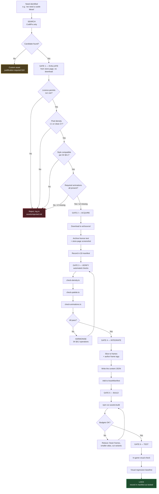
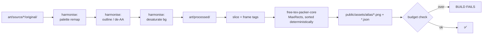
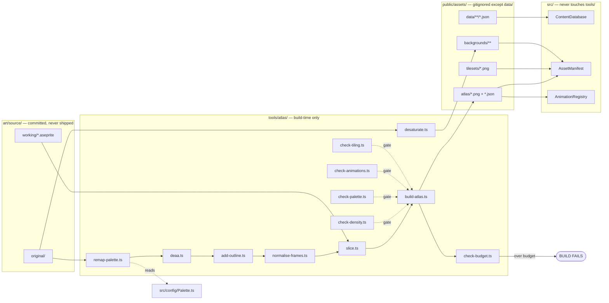

# 05 — Asset Pipeline

**Project:** DevQuest (Working Title)
**Document Owner:** Art Director
**Status:** ✅ Stable
**Version:** 1.0.0
**Last Updated:** 2026-08-07

---

## 1. Purpose

This document defines how an asset travels from "someone found a pack" to "it is in the shipping build," and the gates it must pass at each step.

The pipeline exists to prevent three specific failures:

1. **Style drift** — assets accumulating that individually look fine and collectively look like a bundle sale. Prevented by the evaluation gate (§4) applying the Style Bible from `04-Art-Direction.md`.
2. **Licence exposure** — shipping an asset whose terms do not permit the use. Prevented by mandatory licence archival at integration (§5), not licence *linking*.
3. **Build bloat** — an unmanaged `assets/` folder that quietly grows past the 8 MB load budget. Prevented by the atlas build enforcing budgets at CI (§7).

The pipeline is deliberately strict at the front (evaluation) and automated at the back (build). Rejecting an asset costs ten minutes; removing an integrated asset in month nine costs a week.

---

## 2. Goals

| # | Goal | Success Signal |
|---|------|----------------|
| G1 | Define a mandatory, ordered evaluation gate | No asset enters `public/assets/` without a completed checklist |
| G2 | Record every locked asset with its source and licence | An auditor can trace every pixel in the build to a licence |
| G3 | Archive licence text in-repo, never link to it | A licence page changing does not create uncertainty |
| G4 | Automate the atlas build deterministically | Two developers building the same sources get byte-identical atlases |
| G5 | Enforce size and texture budgets in CI | The 8 MB load budget cannot be silently exceeded |
| G6 | Identify missing asset categories and recommend CraftPix packs | No category is discovered missing during implementation |
| G7 | Define when a custom asset is permitted | Custom work is a last resort with a documented justification |

---

## 3. Design Principles

### P1 — Verify Before Download
Evaluation happens against the pack's preview images and stated licence **before** anything is downloaded. Most rejections (wrong density, wrong animation set, wrong licence) are visible from the store page.

### P2 — Archive, Don't Link
A licence URL is not evidence. The licence *text as it existed on the download date* is committed to `licenses/` alongside a screenshot of the store page. Terms change; commits do not.

### P3 — Harmonise at Import, Not at Runtime
Palette remapping, outline addition, de-AA, and desaturation all happen once, in the build step. The runtime loads finished assets. No shader-based colour correction, no runtime tinting for style purposes (runtime tint is reserved for hit flash and ambient tint).

### P4 — The Source Is Not the Build
`art/source/` holds original downloads and Aseprite working files, and is **not** shipped. `public/assets/` holds processed output and **is** shipped. The transformation between them is scripted and reproducible from scratch.

### P5 — Deterministic Builds
Given the same sources, the atlas build produces identical output. This makes atlas changes reviewable in git and makes the visual-regression tests meaningful.

### P6 — Budget Is a Gate, Not a Guideline
The atlas build fails if a budget is exceeded. It does not warn. A warning that ships is a budget that does not exist.

---

## 4. Overview — The Pipeline



---

## 5. Technical Design — The Six Gates

### 5.1 Gate 1 — Evaluate (no download)

Completed from the store page. Recorded in `assets/evaluations/<pack-slug>.md`.

| # | Check | Pass Condition | Where to Look |
|---|---|---|---|
| 1 | **Source** | Must be `craftpix.net` | URL |
| 2 | **Licence class** | Free (CraftPix Freebies) or Paid (CraftPix Commercial) | Store page licence section |
| 3 | **Licence permits our use** | Commercial use, web distribution, modification, no attribution-in-game requirement that we cannot meet | Licence text |
| 4 | **Redistribution stance** | Must permit inclusion in a compiled/bundled game. Must **not** require source assets to remain unmodified | Licence text |
| 5 | **Pixel density** | Character height 28–34 px, or exactly 2× that (56–68 px) | Preview images, stated dimensions |
| 6 | **Tile size** | 16×16 or exactly 32×32 | Stated dimensions |
| 7 | **Outline convention** | 1 px dark outline present, or absent and addable | Preview zoom |
| 8 | **Lighting direction** | Top-left key, or neutral/flat (relightable). Front-lit or bottom-lit → reject | Preview |
| 9 | **Anti-aliasing** | None, or minimal and removable | Preview zoom |
| 10 | **Colour count** | ≤ 64 unique colours per sprite sheet | Preview (estimate); confirmed at Gate 3 |
| 11 | **Required animations** | See §5.1.1 per asset class | Store page animation list |
| 12 | **Frame format** | Individual PNGs or a uniform-grid sheet. Non-uniform sheets → extra work, flag it | Store page |
| 13 | **File format** | PNG with alpha. No JPG, no indexed-without-alpha | Store page |

**Any single failure on checks 1–4 is an immediate, non-negotiable rejection.** Checks 5–13 may be harmonisable; consult `04-Art-Direction.md` §8.1.

#### 5.1.1 Required Animation Sets by Asset Class

| Class | Mandatory | Strongly Preferred | Optional |
|---|---|---|---|
| **Player character** | idle, run, jump, fall, attack (×2 minimum for a combo), hurt, death | attack3, dash, special, land, wall-slide | crouch, climb |
| **Melee enemy** | idle, walk, attack, hurt, death | run, alert/notice | taunt, block |
| **Ranged enemy** | idle, walk, attack (windup+release readable), hurt, death | retreat, alert | reload |
| **Special enemy** (teleport/summon) | idle, walk, attack, hurt, death, **special** | vanish, appear | — |
| **Boss** | idle, walk, attack ×3, hurt, death | phase-transition, roar/intro, special ×2 | — |
| **Tileset** | ground, platform, wall, slope (or explicit no-slope), decorative props | animated tiles (water, torch), one-way platform variant | destructible states |
| **Background** | ≥ 3 separable parallax layers | 5 layers, seamless horizontal tiling | day/night variants |
| **VFX** | the effect itself, ≥ 4 frames | multiple sizes | — |

**Note the `hurt` animation.** It is mandatory for every character and is the animation most frequently missing from free packs. Without it, Pillar 2's hit-flash layer has nothing to play and hits read as ignored. If a pack lacks `hurt`, the harmonisation cost is 4–6 hours of custom authoring — budget it explicitly or reject.

### 5.2 Gate 2 — Acquire and Archive

```
art/source/<pack-slug>/
  ├── original/              # untouched download, never edited
  ├── working/               # .aseprite files
  └── README.md              # what this is, where it came from, what was changed

licenses/<pack-slug>/
  ├── LICENSE.txt            # the licence text, copy-pasted on the download date
  ├── store-page.png         # full-page screenshot including licence section
  ├── download-record.json   # url, date, version, sha256 of the archive
  └── notes.md               # any clarification sought or received
```

`download-record.json`:

```json
{
  "packSlug": "free-knight-character-sprites-pixel-art",
  "displayName": "Free Knight Character Sprites Pixel Art",
  "sourceUrl": "https://craftpix.net/freebies/free-knight-character-sprites-pixel-art/",
  "vendor": "CraftPix",
  "licenceClass": "craftpix-freebies",
  "downloadedAt": "2026-08-07",
  "archiveSha256": "…",
  "verifiedBy": "art-director",
  "commercialUse": true,
  "modificationAllowed": true,
  "redistributionAsPartOfGame": true,
  "attributionRequired": false,
  "notes": "CraftPix Freebies licence: usable in commercial projects; resale of the assets themselves is prohibited (we do not resell)."
}
```

**Why the sha256:** if a pack is re-downloaded later and differs, we know the vendor changed it, and we know our archived licence may no longer describe what we hold.

**Licence review responsibility:** the Art Director completes this record. `01-Vision.md` §17 states plainly that this is not legal advice; a lawyer reviews the complete manifest before any commercial release. For a free, non-commercial portfolio release, the archived records are the standard of care.

### 5.3 Gate 3 — Automated Verification

```bash
npm run assets:verify -- --pack <pack-slug>
```

| Script | Checks | Failure Output |
|---|---|---|
| `check-density.ts` | Sprite dimensions against the §5.2 scale chart in `04`; 2×-grid round-trip test | `knight_run_03.png: 47px tall, expected 28–34 or 56–68` |
| `check-palette.ts` | Every unique colour's ΔE to the master palette; reserved-signal usage | `tile_grass_04.png: #7f9c3a ΔE=8.2 (nearest G3 #5f9438), 1,204 px` |
| `check-animations.ts` | Presence of every mandatory animation for the declared class | `ninja: missing required animation 'hurt'` |
| `check-aa.ts` | Detects anti-aliased edges (pixels with alpha strictly between 0 and 255 adjacent to a solid edge) | `wizard_idle_02.png: 340 partial-alpha edge pixels` |
| `check-uniformity.ts` | All frames in an animation share the same canvas size and pivot | `orc_attack: frame 5 is 40×38, others are 40×40` |

All five run on every pack and again in CI over the whole `public/assets/` tree.

### 5.4 Gate 4 — Integrate

**Slicing and frame tagging.** Every animation gets a frame tag whose name follows the convention in `14-Animation-Standards.md` §5:

```
<entityKey>_<animName>
e.g. knight_idle, knight_run, skeleton_archer_windup, gorgon_p2_attack1
```

The Aseprite export script writes both a horizontal strip PNG and a JSON manifest:

```json
{
  "entityKey": "skeleton_archer",
  "frameSize": { "w": 32, "h": 32 },
  "pivot": { "x": 16, "y": 30 },
  "tags": [
    { "name": "idle",   "from": 0,  "to": 3  },
    { "name": "run",    "from": 4,  "to": 11 },
    { "name": "windup", "from": 12, "to": 16 },
    { "name": "shoot",  "from": 17, "to": 19 },
    { "name": "hurt",   "from": 20, "to": 22 },
    { "name": "death",  "from": 23, "to": 30 }
  ]
}
```

**Pivot convention:** `(width/2, height − 2)`. The pivot sits 2 px above the sprite's bottom edge, at the visual "feet" line, so that a sprite whose art includes a shadow or a slight overhang still aligns to the tile grid. This is uniform across every entity in the game and is what makes swapping a sprite for a differently-sized one safe.

**Content JSON.** The asset is described in `public/assets/data/` per `03-Technical-Architecture.md` §12.1.

**Manifest registration.** `src/config/AssetManifest.ts` declares which load phase the asset belongs to:

```ts
export const ASSET_MANIFEST = {
  phase1_core: ['core', 'chars', 'font-6', 'font-8', 'font-12'],
  phase2_world: (w: WorldId) => [`enemies-${w}`, `tiles-${w}`, `bg-${w}`],
  phase3_stream: ['enemies-w2', 'enemies-w3', 'enemies-w4', 'enemies-w5', /* … */],
} as const;
```

### 5.5 Gate 5 — Build

See §7 for the full atlas build. The gate is: **the build must succeed within budget.**

### 5.6 Gate 6 — Test and Lock

| Step | Action |
|---|---|
| 1 | Load the asset in-game at 1× and at 6× (1080p) and visually inspect for shimmer, misalignment, and pivot drift |
| 2 | Verify the greyscale contrast test (`04-Art-Direction.md` §11.3) passes with this asset in frame |
| 3 | Capture a visual-regression baseline screenshot |
| 4 | Play 60 seconds with the asset active; confirm no frame-time regression |
| 5 | Mark the pack `locked` in the §6 manifest |

**"Locked" means:** the pack is not replaced, re-downloaded, or re-harmonised without an ADR. This prevents the slow churn where someone finds a slightly nicer skeleton in month seven and silently swaps it, invalidating every visual baseline.

---

## 6. Locked Asset Manifest

**Status legend:** 🔒 Locked · ✅ Verified, integration pending · 🔍 Evaluation pending · ⚠️ Needs a decision

### 6.1 Player Characters

| Asset | Source | Licence | Status | Harmonisation |
|---|---|---|---|---|
| **Knight** | [craftpix.net/freebies/free-knight-character-sprites-pixel-art](https://craftpix.net/freebies/free-knight-character-sprites-pixel-art/) | CraftPix Freebies | 🔒 Gate1 ✅ | `hurt` listed. Density ⚠️ (store ~86 px) — measure at Gate 2. Palette remap — 2 h. Eval: `assets/evaluations/free-knight-character-sprites-pixel-art.md` |
| **Samurai** | [craftpix.net/freebies/free-samurai-pixel-art-sprite-sheets](https://craftpix.net/freebies/free-samurai-pixel-art-sprite-sheets/) | CraftPix Freebies | 🔒 Gate1 ✅ | `hurt` listed. Outline + density at Gate 2. Palette remap — 2 h. Eval: `assets/evaluations/free-samurai-pixel-art-sprite-sheets.md` |
| **Ninja** | [craftpix.net/freebies/free-ninja-sprite-sheets-pixel-art](https://craftpix.net/freebies/free-ninja-sprite-sheets-pixel-art/) | CraftPix Freebies | 🔒 Gate1 ✅ | Store lists `hurt` (2026-08-07) — do not budget authoring until Gate 2 proves missing. Palette remap — 2 h. Eval: `assets/evaluations/free-ninja-sprite-sheets-pixel-art.md` |
| **Wizard** | [craftpix.net/freebies/free-wizard-sprite-sheets-pixel-art](https://craftpix.net/freebies/free-wizard-sprite-sheets-pixel-art/) | CraftPix Freebies | 🔒 Gate1 ✅ | `hurt` listed. Widen robe silhouette — 4 h. Eval: `assets/evaluations/free-wizard-sprite-sheets-pixel-art.md` |

### 6.2 Enemies

| Asset | Source | Licence | Status | Harmonisation |
|---|---|---|---|---|
| **Skeleton** | [craftpix.net/freebies/free-skeleton-pixel-art-sprite-sheets](https://craftpix.net/freebies/free-skeleton-pixel-art-sprite-sheets/) | CraftPix Freebies | 🔒 | Palette remap — 1 h |
| **Werewolf** | [craftpix.net/freebies/free-werewolf-sprite-sheets-pixel-art](https://craftpix.net/freebies/free-werewolf-sprite-sheets-pixel-art/) | CraftPix Freebies | 🔒 | Palette remap; scale check — 3 h |
| **Yokai** | [craftpix.net/freebies/free-yokai-pixel-art-character-sprites](https://craftpix.net/freebies/free-yokai-pixel-art-character-sprites/) | CraftPix Freebies | 🔒 | Palette remap; idle float offset — 3 h |
| **Gorgon** | [craftpix.net/freebies/free-gorgon-pixel-art-character-sprite-sheets](https://craftpix.net/freebies/free-gorgon-pixel-art-character-sprite-sheets/) | CraftPix Freebies | 🔒 | Palette remap; boss scale; phase-2 recolour — 8 h |
| **Orc** | [craftpix.net/product/orc-character-sprite-sheets-pixel-art](https://craftpix.net/product/orc-character-sprite-sheets-pixel-art/) | CraftPix Commercial (paid) | 🔒 | Palette remap — 2 h |
| **Golem** | [craftpix.net/product/golem-character-sprite-sheets-pixel-art](https://craftpix.net/product/golem-character-sprite-sheets-pixel-art/) | CraftPix Commercial (paid) | 🔒 | Palette remap; 48 px scale check — 3 h |
| **Witch** | [craftpix.net/product/witch-pixel-character-sprite-sheets-pack](https://craftpix.net/product/witch-pixel-character-sprite-sheets-pack/) | CraftPix Commercial (paid) | 🔒 | Palette remap — 2 h |

### 6.3 Backgrounds

| Asset | Source | Licence | Status | Harmonisation |
|---|---|---|---|---|
| **Fairy Tale Backgrounds** | [craftpix.net/freebies/free-fairy-tale-game-backgrounds](https://craftpix.net/freebies/free-fairy-tale-game-backgrounds/) | CraftPix Freebies | 🔒 | Desaturate + value-compress — 4 h |
| **Nature Backgrounds** | [craftpix.net/freebies/free-nature-backgrounds-pixel-art](https://craftpix.net/freebies/free-nature-backgrounds-pixel-art/) | CraftPix Freebies | 🔒 | Desaturate + value-compress; layer separation — 4 h |

### 6.4 Environment Tilesets

| Asset | Source | Licence | Status | Harmonisation |
|---|---|---|---|---|
| **Green Zone** | CraftPix tilesets category | Per pack | 🔒 | Palette remap; selective outline — 6 h |
| **Autumn Forest** | CraftPix tilesets category | Per pack | 🔒 | Palette remap; selective outline — 6 h |
| **Crystal Cave** | CraftPix tilesets category | Per pack | 🔒 | Palette remap; author emissive crystal frames — 8 h |
| **Forbidden Graveyard** | CraftPix tilesets category | Per pack | 🔒 | Palette remap; selective outline — 6 h |
| **Castle** | ⚠️ **Not yet selected** — see §9.1 | — | 🔍 | Estimated 8 h once chosen |

Tileset category: [craftpix.net/categorys/pixel-art-tilesets](https://craftpix.net/categorys/pixel-art-tilesets/)

### 6.5 Visual Effects

| Asset | Source | Licence | Status | Harmonisation |
|---|---|---|---|---|
| **Animated Explosions** | [craftpix.net/freebies/free-animated-explosion-sprite-pack](https://craftpix.net/freebies/free-animated-explosion-sprite-pack/) | CraftPix Freebies | 🔒 | Palette remap; additive conversion — 3 h |
| **Slash Effects** | [craftpix.net/freebies/free-slash-sprite-cartoon-effects](https://craftpix.net/freebies/free-slash-sprite-cartoon-effects/) | CraftPix Freebies | 🔒 ⚠️ | **De-cartoon required** — 6 h. See `04` §8.4. May be replaced with custom |

### 6.6 Audio

**Status: none selected.** No audio assets are locked. See §9.5 for recommendations and `13-UI-UX.md` §13 for the hook points that will consume them.

### 6.7 Manifest Totals

| Category | Packs Locked | Packs Pending | Harmonisation Hours |
|---|---|---|---|
| Player characters | 4 | 0 | 14 |
| Enemies | 7 | 0 | 22 |
| Backgrounds | 2 | 0 | 8 |
| Tilesets | 4 | 1 | 26 (+8 pending) |
| VFX | 2 | 0 | 9 |
| **Missing categories (§9)** | 0 | 6 | ~40 (estimated) |
| **Total** | **19** | **7** | **~79 locked + ~48 pending** |

---

## 7. The Atlas Build

### 7.1 Pipeline



### 7.2 Packer Configuration

```ts
// tools/atlas/build-atlas.ts (normative options)

const PACKER_OPTIONS = {
  textureName: atlasName,
  width: 2048,
  height: 2048,
  fixedSize: false,
  powerOfTwo: true,          // GPU-friendly, avoids driver-side padding
  padding: 2,                // 2px prevents bleeding at any integer zoom
  extrude: 1,                // 1px edge extrude — belt and braces against bleed
  allowRotation: false,      // rotation breaks pixel-art frame handling
  allowTrim: true,
  trimMode: 'trim',          // keep source size in the JSON for pivot maths
  detectIdentical: true,     // dedupes identical frames — big win on held poses
  packer: 'MaxRectsPacker',
  packerMethod: 'Smart',
  exporter: 'Phaser3',
  removeFileExtension: true,
  prependFolderName: true,
  scale: 1,
  filter: 'none',
} as const;
```

**Why `padding: 2` and `extrude: 1` together:** at 6× zoom on a 1080p display, a 1 px gap is 6 screen pixels. Bilinear sampling is off (`pixelArt: true`), but WebGL texture-coordinate rounding can still sample a neighbouring texel at certain scroll offsets. Two pixels of padding plus one pixel of edge extrusion eliminates the class entirely. The cost is roughly 4% atlas area.

**Why `allowRotation: false`:** Phaser handles rotated atlas frames correctly, but frame-tag pivots and flipping logic become error-prone. The packing efficiency gain (~5%) is not worth the debugging.

**Why `detectIdentical: true`:** animations with held poses (see `04-Art-Direction.md` §5.6) repeat frames. Deduplication typically saves 8–12% on character atlases.

**Determinism:** `free-tex-packer-core`'s MaxRects is deterministic given a stable input order. The build sorts input files by path with a fixed collation (`Intl.Collator('en', { numeric: true })`) before packing, so the output is byte-identical across machines. CI verifies this by rebuilding and diffing against the committed atlas hash.

### 7.3 Atlas Layout and Budgets

| Atlas | Max Dimensions | Max File Size | Load Phase | Contents |
|---|---|---|---|---|
| `core` | 1024×1024 | 400 KB | 1 | UI widgets, icons, all VFX, particles, 3 bitmap fonts |
| `chars` | 2048×2048 | 1.6 MB | 1 | 4 heroes, all animations |
| `enemies-w1` | 1024×1024 | 380 KB | 2 | Skeleton, Skeleton Archer, Skeleton Warlord |
| `enemies-w2` | 1024×1024 | 420 KB | 3 | Werewolf, Werewolf Scout, Alpha Werewolf |
| `enemies-w3` | 1024×1024 | 460 KB | 3 | Yokai, Witch, Oni Lord |
| `enemies-w4` | 1024×1024 | 520 KB | 3 | Orc, Golem, Golem Sovereign |
| `enemies-w5` | 1024×1024 | 480 KB | 3 | Gorgon, elite variants |
| **Total atlas** | | **~4.3 MB** | | |

**Non-atlased assets** (Phaser tilemaps require contiguous tileset images, and background layers are large and rarely reused):

| Asset | Max Size | Phase |
|---|---|---|
| Tileset ×5 | 180 KB each | 2 / 3 |
| Background layers | 1.2 MB per world set | 2 / 3 |
| Level `.tmj` ×20 | 25 KB each | 2 / 3 |
| Content JSON | 120 KB total | 1 |

### 7.4 Load Budget Verification

```
Phase 0 (boot)      : 40 KB    ─┐
Phase 1 (core)      : 2.1 MB    ├── blocking: 5.4 MB  ✅ under 8 MB
Phase 2 (world 1)   : 3.3 MB   ─┘
Phase 3 (streamed)  : 9.8 MB   (background, non-blocking)
─────────────────────────────
Total build         : 15.2 MB
```

```ts
// tools/atlas/check-budget.ts
const BUDGETS = {
  blockingBytes: 8 * 1024 * 1024,
  totalBytes: 20 * 1024 * 1024,
  jsGzipBytes: 1.2 * 1024 * 1024,
  perAtlas: { core: 400_000, chars: 1_600_000, /* … */ },
  maxTextureMemoryBytes: 128 * 1024 * 1024,   // 00-README §5.5
} as const;
```

**Texture memory** is computed as `width × height × 4` bytes per atlas (uncompressed in GPU memory, regardless of PNG size). All atlases resident simultaneously:

```
core        1024×1024×4 =   4 MB
chars       2048×2048×4 =  16 MB
enemies ×5  1024×1024×4 =  20 MB
tilesets ×5  512×512×4  =   5 MB
backgrounds (varies)     ≈  40 MB
─────────────────────────────────
                        ≈  85 MB  ✅ under 128 MB
```

**Mitigation if this is exceeded:** unload non-current-world enemy atlases and background sets on world transition. `AssetStreamSystem` supports this but does not do it by default, because a re-load on backtracking is worse than the memory cost at 85 MB. If a new world pushes past 110 MB, enable per-world eviction.

### 7.5 Build Commands

```bash
npm run assets:harmonise     # source → processed (palette, outline, de-AA, desaturate)
npm run assets:slice         # processed → frames + tag manifests
npm run assets:pack          # frames → atlases
npm run assets:verify        # all Gate 3 checks over the whole tree
npm run assets:budget        # budget gate
npm run assets:build         # all of the above, in order
npm run assets:clean         # wipe processed/ and public/assets/atlas/
```

`public/assets/atlas/` is **gitignored**. Atlases are build artifacts. What is committed is `art/source/` (the originals and working files) and the harmonisation scripts. This keeps the repository reviewable — a palette change shows as a script diff, not a 1.6 MB binary diff.

**Exception:** a `atlas-hashes.json` file *is* committed, containing the sha256 of each expected atlas. CI rebuilds and compares, which is how determinism is enforced.

---

## 8. Implementation Notes

### 8.1 Harmonisation Script Reference

```ts
// tools/atlas/remap-palette.ts — the most-used script

import sharp from 'sharp';
import { Palette } from '../../src/config/Palette';
import { rgbToLab, deltaE2000 } from './colour';

const PALETTE_LAB = Object.entries(Palette).map(([key, hex]) => ({
  key, hex, lab: rgbToLab(hexToRgb(hex)),
}));

export async function remapPalette(
  input: string,
  output: string,
  opts: { maxDeltaE: number; failOnViolation: boolean },
): Promise<PaletteReport> {
  const { data, info } = await sharp(input)
    .ensureAlpha()
    .raw()
    .toBuffer({ resolveWithObject: true });

  const violations = new Map<string, number>();

  for (let i = 0; i < data.length; i += 4) {
    if (data[i + 3] === 0) continue;                    // skip fully transparent
    const lab = rgbToLab([data[i]!, data[i + 1]!, data[i + 2]!]);

    let best = PALETTE_LAB[0]!;
    let bestD = Infinity;
    for (const p of PALETTE_LAB) {
      const d = deltaE2000(lab, p.lab);
      if (d < bestD) { bestD = d; best = p; }
    }

    if (bestD > opts.maxDeltaE) {
      const hex = rgbToHex([data[i]!, data[i + 1]!, data[i + 2]!]);
      violations.set(hex, (violations.get(hex) ?? 0) + 1);
      if (opts.failOnViolation) continue;               // leave it; report it
    }

    const [r, g, b] = hexToRgb(best.hex);
    data[i] = r; data[i + 1] = g; data[i + 2] = b;
  }

  await sharp(data, { raw: info }).png({ compressionLevel: 9, palette: true }).toFile(output);
  return buildReport(input, violations);
}
```

**Note `palette: true` on the PNG output.** Indexed PNGs with a ≤ 48-colour palette are dramatically smaller than truecolour — typically 60–70% reduction on pixel art. This is the single largest file-size win in the pipeline and costs nothing.

### 8.2 The De-AA Script and Its Limits

```ts
// tools/atlas/deaa.ts
// Snaps partial-alpha pixels to either fully opaque (using the nearest
// solid neighbour's colour) or fully transparent.
//
// LIMIT: this destroys intentional soft edges. It must NOT be run on
// VFX (which are legitimately soft) or on background layers (where
// gradients are the point). The build applies it only to sprites
// declared class 'character' or 'tileset'.

const ALPHA_CUTOFF = 128;   // ≥ this becomes opaque, below becomes transparent
```

Every de-AA run produces a before/after contact sheet in `build/deaa-review/` that a human must inspect. Automated de-AA reliably eats 1 px details like sword tips and antenna. This is a "trust but verify" step, not a fire-and-forget one.

### 8.3 Handling Non-Uniform Sprite Sheets

Several CraftPix packs ship each animation as individual PNGs with differing canvas sizes (tight-cropped per frame). This breaks the uniform-frame assumption.

**The fix** (`tools/atlas/normalise-frames.ts`):

1. Find the maximum bounding box across all frames of the entity.
2. Round up to the next even number in both dimensions.
3. Re-canvas every frame to that size, aligning by the **pivot** (bottom-centre), not by the canvas centre.
4. Emit the pivot in the frame manifest.

Aligning by bottom-centre rather than canvas-centre is essential: a character whose attack frame is taller (raised sword) must keep its feet on the same line, or the sprite bobs during the animation.

### 8.4 Tileset-Specific Requirements

Tilesets have constraints that sprite sheets do not:

| Requirement | Reason |
|---|---|
| **0 margin, 0 spacing** in the source image | Tiled and Phaser both handle margin/spacing, but mismatched settings between them is a common, confusing bug. Zero on both sides removes the class |
| **Tile IDs must be stable** | Changing a tileset's layout invalidates every `.tmj` that uses it. Once a tileset is locked, tiles may be *added* at the end but never reordered or removed |
| **No extrusion in the tileset image** | Phaser tilemaps handle tile bleeding via `tileBias` and the renderer's `roundPixels`; extruded tilesets require an offset configuration that is easy to get wrong. Instead, avoid bleeding by keeping tilemap layers at integer scroll positions |
| **A dedicated collision tileset property** | Each tile carries a `collides: boolean` and `slope: 'none'\|'left'\|'right'` custom property, set in Tiled and read by `TileCollision.ts` |
| **Animated tiles declared in Tiled** | Torches, water, and crystals use Tiled's tile-animation feature; `LevelLoader` reads them automatically |

### 8.5 The Background Layer Split

Background packs ship as either flat images or pre-separated layers. Both need work.

**If flat:** the image must be manually separated into 3–5 parallax layers in Aseprite. This is 3–4 hours per background set and is the reason background harmonisation is budgeted at 4 h each.

**If pre-separated:** verify each layer tiles seamlessly horizontally. Many packs ship layers sized to a specific screen width that do not loop. The fix is either to find a seam-free crop or to author a mirrored tile. Non-tiling backgrounds cause a visible jump when the camera scrolls past the layer width.

```ts
// tools/atlas/check-tiling.ts
// Compares the leftmost column of pixels to the rightmost.
// If they differ by more than a small threshold, the layer does not tile.
export function checkHorizontalTiling(img: RawImage): { tiles: boolean; maxDelta: number };
```

---

## 9. Missing Asset Categories and Recommendations

Per the project constraint: **recommend additional CraftPix packs before inventing custom assets.** These categories have no locked asset and must be resolved before the milestone that needs them.

All recommendations below are **candidates requiring Gate 1 evaluation**. Exact pack selection, current availability, and licence terms must be verified on `craftpix.net` at evaluation time — this document records the *need* and the *search strategy*, not a confirmed purchase list.

### 9.1 Castle Tileset — World 5 (⚠️ Blocking M8)

| Requirement | Specification |
|---|---|
| Tile size | 16×16 |
| Needed tiles | Stone floor, wall, pillar, staircase, one-way platform, spike trap, portcullis, torch (animated), banner, rubble, breakable block |
| Palette fit | Neutral + Magenta ramps (`04` §6.3) |
| Mood | Storm-lit fortress interior and battlements |

**Search strategy:** [craftpix.net/categorys/pixel-art-tilesets](https://craftpix.net/categorys/pixel-art-tilesets/) filtered for castle / dungeon / fortress themes. CraftPix maintains multiple castle and dungeon tileset products in both free and paid tiers.

**Fallback if no suitable pack exists:** the Forbidden Graveyard tileset already contains stone architecture. A recolour to the Neutral+Magenta sub-palette plus ~15 custom tiles (portcullis, banner, spike trap) would produce a serviceable castle set for roughly 16 hours. This is the recommended fallback and is cheaper than most alternatives.

### 9.2 GUI / UI Elements (⚠️ Blocking M6)

| Requirement | Specification |
|---|---|
| Needed | Panel frames (9-slice), buttons (3 states), sliders, checkboxes, scrollbars, tooltips, dialogue frames, tabs |
| Style | Must match `04-Art-Direction.md` §9.1 — square corners, 1 px borders, no faux-3D bevel |
| Size | Panels authored as 9-slice with ≥ 3 px corners |

**Search strategy:** CraftPix maintains a GUI category with both free and paid fantasy/RPG GUI packs. Search `craftpix.net` for "GUI" and "UI" within the pixel-art category.

**Assessment:** most licensed GUI packs are heavily ornamented fantasy frames (scrollwork, gold filigree) which **conflict with our stated modern-pixel UI direction**. This is the category most likely to require custom work.

**Recommendation:** evaluate CraftPix GUI packs, but plan for custom. A complete UI kit at our style — square panels, 1 px borders, three button states, sliders, focus rings — is approximately **20 hours** of authoring and is fully within the "no suitable CraftPix asset exists" exemption in §10. The UI is also the element most visible to the primary audience, which justifies the investment.

### 9.3 Icons (⚠️ Blocking M6)

| Requirement | Specification |
|---|---|
| Needed | 16×16 icons: coin, heart, heart shard, charm slots (×8 charm icons), lock, checkmark, arrow, gamepad/keyboard glyphs, the 5 portfolio-section icons |
| Count | ~28 icons |
| Style | 1 px outline, 2–4 colours each, readable at 1× |

**Search strategy:** CraftPix has icon packs (fantasy icons, RPG item icons, skill icons) in both tiers.

**Assessment:** licensed icon packs are typically 32×32 or larger and heavily detailed. At 16×16 with a 48-colour palette, most will not downscale cleanly.

**Recommendation:** evaluate CraftPix icon packs for the generic items (coin, heart, lock, arrow). Author custom for the portfolio-section icons — these are project-specific by definition and no pack will contain "Experience" or "Skills" iconography that matches. Estimated: 6 hours licensed-adaptation + 8 hours custom = **14 hours**.

### 9.4 Collectibles and Props (Needed M5)

| Requirement | Specification |
|---|---|
| Needed | Coin (8-frame spin), heart shard, charm pickup, chest (closed/opening/open), breakable crate, barrel, checkpoint lantern (idle/active), door, key, sign |
| Style | Foreground layer — full saturation, 1 px outline |

**Search strategy:** CraftPix carries item, treasure, and prop packs, and several platformer tilesets bundle props (crates, barrels, chests) with the tiles.

**Recommendation:** check the four locked tilesets first — Green Zone, Autumn Forest, Crystal Cave, and Forbidden Graveyard platformer tilesets typically ship with props included. This may resolve the category at zero additional cost. Only the coin spin, heart shard, and checkpoint lantern are likely to need dedicated assets. Estimated: **10 hours** if props come from the tilesets, 20 hours otherwise.

### 9.5 Boss Health Bar and HUD Frames (Needed M7)

| Requirement | Specification |
|---|---|
| Needed | Boss health bar frame (200×12), segmented fill, phase-divider marks, boss name plate |
| Style | Matches the GUI kit |

**Recommendation:** this is a small, highly specific asset that will be authored as part of the UI kit (§9.2). Estimated **3 hours**, folded into the UI kit budget.

### 9.6 Audio (Needed M9)

**Status: entirely unresolved.** No audio assets are locked, and the project brief explicitly excludes audio from the current manifest.

| Category | Needed | Approximate Count |
|---|---|---|
| SFX — player | Jump, land, dash, 3 attack swings, hurt, death, footsteps | ~12 |
| SFX — combat | Hit-flesh, hit-armour, hit-bone, block, crit, explosion | ~8 |
| SFX — enemies | Per-family alert, attack, hurt, death | ~28 |
| SFX — UI | Move, confirm, back, error, unlock | ~6 |
| SFX — world | Coin, shard, checkpoint, door, crumble, wind, crystal hum | ~12 |
| Music | Title, hub, 5 world themes, 5 boss themes, victory, codex | ~14 tracks |

**Recommendation:** CraftPix's catalogue is predominantly visual. Audio will need a different vendor, and that decision needs an ADR because it is the first exception to the CraftPix-only rule.

**The rule that keeps this clean:** the CraftPix-only constraint in the project brief is about *visual* cohesion. Audio has no visual cohesion problem. Sourcing audio elsewhere (a licensed SFX library plus licensed chiptune/orchestral tracks) does not violate the art direction. This should be recorded explicitly as `ADR-020` so nobody later reads "CraftPix only" and blocks audio procurement.

**Interim:** `AudioSystem` ships as a fully implemented stub with all hook points wired and a `NullAudioBackend`. Adding real audio then requires zero gameplay code changes — only asset registration. See `13-UI-UX.md` §13.

### 9.7 Summary of Missing-Category Work

| Category | Blocking | Licensed Effort | Custom Effort | Total |
|---|---|---|---|---|
| Castle tileset | M8 | 8 h (if found) | 16 h (fallback) | 8–16 h |
| GUI kit | M6 | 6 h (unlikely to fit) | 20 h | ~20 h |
| Icons | M6 | 6 h | 8 h | 14 h |
| Collectibles / props | M5 | 4 h | 6 h | 10 h |
| Boss health bar | M7 | — | 3 h | 3 h |
| Audio | M9 | External vendor | — | TBD (`ADR-020`) |
| **Total (excl. audio)** | | | | **~55–63 h** |

Combined with the 79 hours of harmonisation on locked packs, total art integration effort is **approximately 140 hours (3.5 weeks)**. This is scheduled across M3, M5, M6, M7, and M8 in `17-Roadmap.md`.

---

## 10. When Custom Assets Are Permitted

Custom authoring is a **last resort** and requires a recorded justification. The permitted cases:

| Case | Justification | Examples |
|---|---|---|
| **No CraftPix pack exists for the category** | Documented search of the relevant category with the packs evaluated and rejected | Bitmap fonts, portfolio-section icons |
| **Project-specific content** | The asset encodes something unique to this project | Codex section icons, the DevQuest logo |
| **All candidates fail Gate 1 on unharmonisable grounds** | Evaluation records for ≥ 3 candidates | Possibly the GUI kit |
| **Filling a gap in an otherwise-locked pack** | The pack passed Gate 1 with ≤ 2 missing animations | A `hurt` animation for the Ninja |
| **A style-bridging variant** | An existing licensed asset recoloured/modified to serve a second role | Graveyard tiles recoloured as castle |

**Every custom asset requires:**
1. An entry in `assets/custom-justifications.md` naming the search performed and the packs rejected.
2. Authoring in the master palette, at the correct density, following every Style Bible rule.
3. Passing the same Gate 3 automated checks as licensed assets.
4. Committing the `.aseprite` source to `art/source/custom/`.

**Explicitly forbidden regardless of justification:** AI-generated gameplay assets, assets from non-CraftPix vendors (audio excepted per §9.6), vector assets, and HD/non-pixel assets.

---

## 11. Examples

### 11.1 A Complete Evaluation Record

`assets/evaluations/craftpix-castle-tileset-candidate-a.md`:

```markdown
# Evaluation — [Candidate Castle Tileset A]

- **Evaluated:** 2026-09-14
- **Evaluator:** Art Director
- **Source:** craftpix.net (pixel-art-tilesets category)
- **Need:** World 5 — Gorgon's Spire (§9.1)

## Gate 1 Results

| # | Check | Result | Notes |
|---|-------|--------|-------|
| 1 | Source is CraftPix | ✅ | |
| 2 | Licence class | ✅ | CraftPix Commercial |
| 3 | Permits our use | ✅ | Commercial, web, modification allowed |
| 4 | Redistribution in a game | ✅ | Permitted; resale of raw assets prohibited (N/A) |
| 5 | Pixel density | ✅ | 16×16 native |
| 6 | Tile size | ✅ | 16×16 |
| 7 | Outline convention | ⚠️ | Fully outlined incl. internal detail → needs selective-outline pass (4 h) |
| 8 | Lighting direction | ✅ | Top-left key |
| 9 | Anti-aliasing | ✅ | None |
| 10 | Colour count | ⚠️ | 71 unique → remap required, expect ~8 violations |
| 11 | Required tiles | ⚠️ | Missing portcullis and spike trap → 4 h custom |
| 12 | Frame format | ✅ | Uniform grid, 0 margin, 0 spacing |
| 13 | File format | ✅ | PNG + alpha |

## Verdict

**ACCEPT with harmonisation.** Estimated 12 h total (4 h selective outline,
4 h palette remap + review, 4 h missing tiles).

Cheaper than the graveyard-recolour fallback (16 h) and gives a
purpose-built castle silhouette. Proceed to Gate 2.
```

### 11.2 A Rejection Record

`assets/rejected.md` (append-only log):

```markdown
## 2026-09-14 — [Candidate Castle Tileset B]

**Rejected at Gate 1, check 5 (pixel density).**

Tiles are 32×32 with hand-drawn detail at that resolution — not a 2× grid.
Round-trip downscale test failed (`check-density.ts`: 34% pixel divergence).
Would require a full redraw, which is more expensive than the graveyard-
recolour fallback.

**Cost of this evaluation:** 15 minutes. No download performed.
```

The rejection log matters as much as the manifest. It prevents the same pack being re-evaluated in month ten by someone who does not remember it was already considered.

### 11.3 Adding a New Enemy Variant End to End

**Goal:** add a "Skeleton Brute" — an elite skeleton, larger, slower, more HP.

| Step | Action | Cost |
|---|---|---|
| 1 | Check whether a new asset is needed | **No.** The locked Skeleton pack is reused |
| 2 | Author a recolour + 4 px scale-up in Aseprite | 2 h |
| 3 | Verify against Gate 3 (`assets:verify`) | 5 min |
| 4 | Confirm silhouette distinctness from base Skeleton (`04` §5.5) | 10 min — add a shoulder pauldron for separation |
| 5 | Add frames to `enemies-w1` atlas | Automatic |
| 6 | Write `enemies/skeleton_brute.json` | 20 min |
| 7 | Place in Tiled | 2 min |
| 8 | Playtest and tune | 30 min |
| **Total** | | **~3 h, zero TypeScript** |

This is the pipeline working as designed: the expensive gates were paid once for the Skeleton pack, and every variant derived from it is cheap.

---

## 12. Data Structures

```ts
// tools/atlas/types.ts

export type AssetClass = 'character' | 'enemy' | 'boss' | 'tileset' | 'background' | 'vfx' | 'ui' | 'icon' | 'prop';
export type PackStatus = 'evaluating' | 'verified' | 'harmonising' | 'integrated' | 'locked' | 'rejected';

export interface AssetPack {
  readonly slug: string;
  readonly displayName: string;
  readonly vendor: 'CraftPix' | 'custom';
  readonly sourceUrl: string | null;          // null for custom
  readonly assetClass: AssetClass;
  readonly licence: {
    readonly class: string;                    // 'craftpix-freebies' | 'craftpix-commercial' | 'project-owned'
    readonly archivedAt: string;               // path under licenses/
    readonly commercialUse: boolean;
    readonly modificationAllowed: boolean;
    readonly attributionRequired: boolean;
    readonly verifiedOn: string;               // ISO date
    readonly verifiedBy: string;
  };
  readonly status: PackStatus;
  readonly harmonisation: {
    readonly operations: readonly HarmonisationOp[];
    readonly estimatedHours: number;
    readonly actualHours: number | null;
    readonly completedOn: string | null;
  };
  readonly entities: readonly string[];        // entityKeys this pack provides
  readonly atlases: readonly string[];         // which atlases it feeds
  readonly lockedOn: string | null;
  readonly adrIfChanged: string | null;        // ADR required to replace a locked pack
}

export type HarmonisationOp =
  | { kind: 'paletteRemap'; maxDeltaE: number }
  | { kind: 'addOutline'; colour: string; thickness: 1 }
  | { kind: 'recolourOutline'; from: string; to: string }
  | { kind: 'deAA'; alphaCutoff: number }
  | { kind: 'downscale'; factor: 0.5 }
  | { kind: 'desaturate'; targetSaturation: number; valueRange: readonly [number, number] }
  | { kind: 'normaliseFrames'; pivot: 'bottomCentre' }
  | { kind: 'authorAnimation'; animName: string; frameCount: number }
  | { kind: 'selectiveOutline'; silhouetteOnly: true }
  | { kind: 'additiveConvert'; removeDarkBelow: number };
```

```ts
// The manifest, machine-readable, the single source of truth for §6.
// assets/manifest.json validated against assets/manifest.schema.json
export interface AssetManifestFile {
  readonly version: 1;
  readonly updatedAt: string;
  readonly packs: readonly AssetPack[];
  readonly missingCategories: readonly {
    readonly category: string;
    readonly blockingMilestone: string;
    readonly searchStrategy: string;
    readonly estimatedHours: readonly [number, number];   // [min, max]
    readonly fallbackPlan: string;
  }[];
}
```

```ts
// The frame manifest emitted by the slicer, consumed by the animation system.
export interface FrameManifest {
  readonly entityKey: string;
  readonly assetClass: AssetClass;
  readonly frameSize: { readonly w: number; readonly h: number };
  readonly pivot: { readonly x: number; readonly y: number };
  readonly sourcePack: string;
  readonly tags: readonly {
    readonly name: string;
    readonly from: number;
    readonly to: number;
    readonly direction: 'forward' | 'reverse' | 'pingpong';
  }[];
}
```

---

## 13. Future Expansion

| Item | Trigger | Notes |
|---|---|---|
| **Texture compression (Basis/KTX2)** | If texture memory exceeds 110 MB | Cuts GPU memory ~4×. Adds a transcode step and a decode cost at load. Not needed at 85 MB |
| **Per-world atlas eviction** | Same trigger | `AssetStreamSystem` already supports it; just not enabled |
| **Sprite-sheet hot reload** | Developer convenience | Vite HMR on `public/assets/atlas/` — ~4 hours, meaningful quality-of-life during animation tuning |
| **Automated silhouette diffing** | If enemy roster grows past ~15 | Compare new sprite silhouettes against all existing; flag near-duplicates |
| **A palette-swap variant generator** | Post-launch cosmetics | Given a base sprite and a palette mapping, emit a variant. Trivial given the closed palette |
| **Audio pipeline** | When audio is procured (§9.6) | Will need its own gates: format (ogg+m4a dual), loudness normalisation (−16 LUFS), loop-point verification, and a size budget |
| **CDN / range-request streaming** | If the total build exceeds 30 MB | Not anticipated |

---

## 14. Acceptance Criteria

- [ ] `assets/manifest.json` exists, validates against its schema, and matches §6.
- [ ] Every pack in the manifest has an archived licence in `licenses/<slug>/` with `LICENSE.txt`, a store-page screenshot, and `download-record.json`.
- [ ] `npm run assets:verify` passes on every asset in `public/assets/`.
- [ ] `npm run assets:budget` passes; blocking payload measured under 8 MB.
- [ ] Atlas builds are byte-deterministic; CI rebuild matches `atlas-hashes.json`.
- [ ] `public/assets/atlas/` is gitignored; `art/source/` is committed.
- [ ] Every entity has a frame manifest with a bottom-centre pivot.
- [ ] Every tileset has stable tile IDs recorded, and a note that IDs may only be appended.
- [ ] All five missing categories in §9 are either resolved or have a scheduled milestone and a fallback plan.
- [ ] `assets/rejected.md` has at least one entry (proving the gate is being used).
- [ ] `assets/custom-justifications.md` exists and every custom asset appears in it.
- [ ] `ADR-020` (audio vendor exception) is written before audio procurement begins.
- [ ] No asset in the build originates from a non-CraftPix visual vendor.
- [ ] Total texture memory measured under 128 MB with all atlases resident.

---

## 15. Architecture — Pipeline Module Map

The pipeline is a set of small, single-purpose scripts composed by npm
scripts. Nothing in `src/` imports anything from `tools/`; the two are
connected only by the files in `public/assets/`.



**Three architectural properties:**

| Property | Why It Matters |
|---|---|
| **`tools/` is one-directional** | It reads `src/config/Palette.ts` for the master palette and writes to `public/`. Nothing in `src/` imports from `tools/`, so the shipped bundle contains no build tooling |
| **Gates run before packing, budget runs after** | A malformed asset fails before it can be baked into an atlas; a valid-but-oversized set fails after, when the true size is known |
| **`data/` is committed, `atlas/` is not** | Content JSON is reviewable in diffs. Atlases are build artifacts, verified by hash (§7.5) |

**Adding a harmonisation step** means adding one script to `tools/atlas/` and
one stage to the `assets:harmonise` npm script. No other file changes.

---

## 16. Out of Scope

| Excluded | Reason |
|---|---|
| **Non-CraftPix visual assets** | Hard project constraint. Audio is the sole documented exception (§9.6, `ADR-020`) |
| **AI-generated gameplay assets** | Explicitly excluded. AI is permitted for mood boards and reference only, never committed to `public/` |
| **Runtime asset generation** | All assets are authored ahead of time |
| **Asset streaming per-level** | Per-*world* streaming only. Per-level would add complexity for a few hundred KB |
| **Texture compression** | Not needed at current memory usage. See §13 |
| **A custom atlas packer** | `free-tex-packer-core` is deterministic and sufficient |
| **Committing built atlases** | They are build artifacts. Only hashes are committed |
| **Vendor asset updates** | Locked packs are frozen at their downloaded version. A vendor update requires an ADR |
| **Legal sign-off** | This document records the verification *procedure* and the *evidence*. Legal review of the completed manifest is a separate, external step before any commercial release |

---

## 17. Cross References

| Topic | Document |
|-------|----------|
| Load budget and texture memory constants | `00-README.md` §5.5 |
| The 8-second load promise this pipeline serves | `01-Vision.md` §5.2 |
| Asset-inconsistency risk this pipeline mitigates | `01-Vision.md` §8.3 |
| The Style Bible these gates enforce | `04-Art-Direction.md` §5 |
| The master palette and conformance thresholds | `04-Art-Direction.md` §6 |
| The harmonisation decision tree and operations | `04-Art-Direction.md` §8 |
| Per-pack harmonisation estimates | `04-Art-Direction.md` §8.3 |
| The slash-pack de-cartooning warning | `04-Art-Direction.md` §8.4 |
| UI visual rules the GUI kit must satisfy | `04-Art-Direction.md` §9 |
| Atlas organisation and load phases | `03-Technical-Architecture.md` §9 |
| Frame tag naming and animation manifests | `14-Animation-Standards.md` §5 |
| Which packs supply which enemies | `08-Enemy-System.md` §5 |
| Which packs supply which bosses | `09-Boss-System.md` §5 |
| Tileset requirements per world | `10-Level-Design.md` §7 |
| Audio hook points awaiting assets | `13-UI-UX.md` §13 |
| Texture memory budget and eviction strategy | `15-Performance.md` §7 |
| When harmonisation work is scheduled | `17-Roadmap.md` §5 |
| ADR-020 (audio vendor exception) | `19-Decisions.md` |
