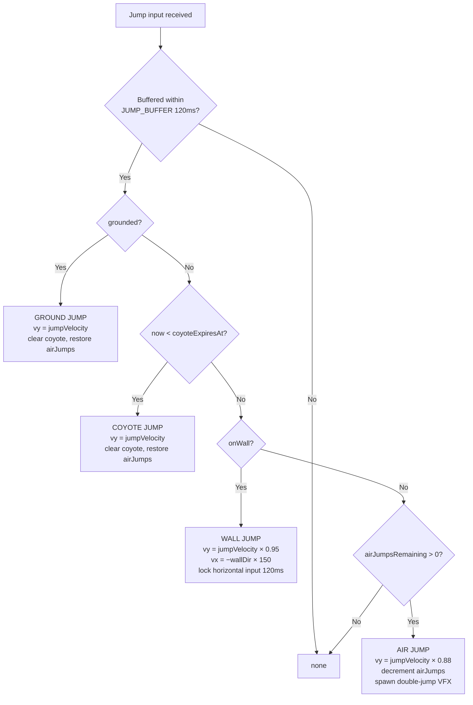
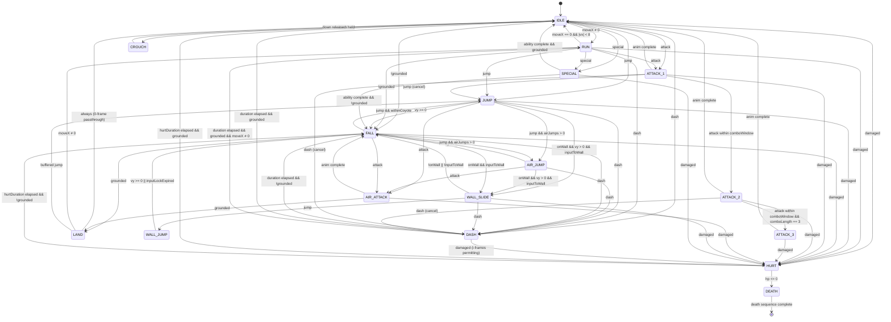
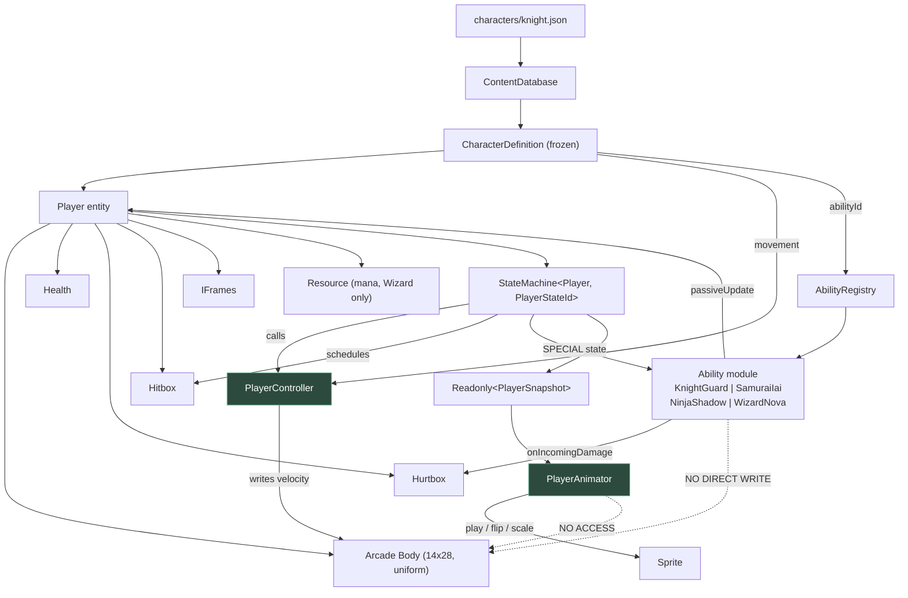

# 06 — Playable Characters

**Project:** DevQuest (Working Title)
**Document Owner:** Lead Designer
**Status:** ✅ Stable
**Version:** 1.0.0
**Last Updated:** 2026-08-07

---

## 1. Purpose

This document specifies the four playable heroes — Knight, Samurai, Ninja, and Wizard — completely enough to implement each without a design conversation. It covers the shared movement controller they all use, the exact numeric deltas that differentiate them, their unique abilities, their state machines, their animation requirements, and the data schema that drives all of it.

The central design problem is stated plainly: **four characters must feel genuinely different while sharing one movement controller and one set of levels.** Solve it wrong in either direction and you get four palette swaps, or you get four characters where three of them cannot complete the game.

The solution is a **shared core with parameterised deltas plus one unique verb each.** Every hero uses the same jump physics, the same coyote time, the same input handling. What differs is a small set of tuned numbers and exactly one ability that changes how you approach a room.

---

## 2. Goals

| # | Goal | Success Signal |
|---|------|----------------|
| G1 | Specify one movement controller that serves all four heroes | `PlayerController.ts` has zero `if (characterId === …)` branches |
| G2 | Make each hero mechanically distinct, not statistically distinct | A playtester can identify the hero from a 5-second gameplay clip with the sprite hidden |
| G3 | Ensure every hero can complete every level | No level is gated on a hero-specific ability |
| G4 | Define exact numeric values for every parameter | An implementer never guesses a number |
| G5 | Define the player state machine completely | Every state, every transition, every guard |
| G6 | Make characters fully data-driven | Adding a fifth hero is one JSON + one ability module |
| G7 | Define the animation requirements per hero | The animator knows exactly what to deliver |

---

## 3. Design Principles

### P1 — One Controller, Four Configurations
There is exactly one `PlayerController`. Character differences are values in a `CharacterDefinition`, not code branches. This guarantees that a Pillar 1 fix (`02-Game-Pillars.md` §5.1) applies to all four heroes simultaneously and cannot regress on three of them.

### P2 — Distinctiveness Comes From Verbs, Not Numbers
Making the Ninja 20% faster does not make it feel like a different character; it makes it feel like the Samurai with a tuning error. Giving the Ninja a double jump changes how you read a room. **Each hero gets one unique verb.** The stat deltas exist to reinforce that verb, not to create the distinctiveness.

### P3 — No Hero Is Gated Out
Every level is completable by every hero. This is checked automatically (§12.3). A secret that requires the Ninja's double jump is acceptable only if an alternative route exists for the other three. This principle is what allows character select to be a genuine expression of preference rather than a difficulty setting in disguise.

### P4 — Low Floor Per Hero
The Knight is the beginner hero and is explicitly tuned to be forgiving. But no hero is *punishing* — the Wizard has low HP, not a mandatory execution requirement. Pillar 4 applies to all four.

### P5 — Asymmetry Is Balanced by Role, Not by Power
The heroes are not balanced to equal DPS. They are balanced so that each is the best answer to *some* situation and the worst answer to *another*. The Knight trivialises attrition fights and struggles with precision platforming. The Ninja is the reverse.

---

## 4. Overview

### 4.1 The Roster at a Glance

| Hero | Role | Unique Verb | HP | Speed | Damage | Difficulty |
|---|---|---|---|---|---|---|
| **Knight** | Tank / attrition | **Guard** — directional block with a parry window | 140 | 78 px/s | 18 | ★☆☆ |
| **Samurai** | Balanced / aggressive | **Iai Slash** — chargeable dash-cut through enemies | 100 | 90 px/s | 22 | ★★☆ |
| **Ninja** | Mobility / evasion | **Shadow Step** — double jump + i-frame dash | 70 | 108 px/s | 14 | ★★★ |
| **Wizard** | Ranged / control | **Arcane Nova** — AOE burst + ranged basic attack | 65 | 82 px/s | 12 ranged / 28 nova | ★★☆ |

### 4.2 The Distinctiveness Test

Hide the sprite. Show five seconds of gameplay. Can you name the hero?

| Hero | Tell |
|---|---|
| Knight | Stands still and absorbs a hit rather than dodging it. Deliberate, planted movement |
| Samurai | Closes distance in a straight line through the enemy. Aggressive forward pressure |
| Ninja | Never touches the ground twice in the same place. Vertical, erratic, always moving |
| Wizard | Backs away while attacking. Maintains distance. Occupies the far side of the arena |

If a playtester cannot do this, P2 has failed and the abilities need more differentiation.

### 4.3 The Shared Core

Every hero shares these, unchanged:

| Property | Value | Notes |
|---|---|---|
| Gravity | `900 px/s²` | `GRAVITY_Y` |
| Fall gravity multiplier | `1.35×` | |
| Apex gravity multiplier | `0.70×` below 40 px/s | |
| Max fall speed | `300 px/s` | |
| Coyote time | `100 ms` | |
| Jump buffer | `120 ms` | |
| Variable jump cut | `0.45×` | |
| Landing recovery | `0 frames` | Non-negotiable, Pillar 1 |
| I-frames after damage | `800 ms` | |
| I-frame flicker period | `100 ms` | |
| Turn-around accel boost | `1.8×` | |
| Wall slide speed | Varies (§5.6) | The one shared verb with per-hero tuning |
| Attack move penalty (ground) | `0.40×` speed | Never a full stop |
| Attack move penalty (air) | `1.00×` | Air momentum fully preserved |

---

## 5. Technical Design — The Shared Movement Controller

### 5.1 The Controller Contract

```ts
// src/entities/player/PlayerController.ts
// NORMATIVE — no character-specific branching permitted in this file.

export class PlayerController {
  constructor(
    private readonly body: Phaser.Physics.Arcade.Body,
    private readonly def: CharacterMovement,   // from CharacterDefinition
    private readonly clock: Clock,
  ) {}

  /** Called every frame from Player.update(), after the FSM has set intent. */
  applyHorizontal(input: InputFrame, state: PlayerStateId, grounded: boolean): void {
    const wants = input.moveX;
    const v = this.body.velocity.x;
    const maxSpeed = this.def.runSpeed * this.speedScaleFor(state);

    if (wants === 0) {
      const decel = grounded ? this.def.groundDecel : this.def.airDecel;
      this.body.velocity.x = approach(v, 0, decel * this.dt);
      return;
    }

    const opposing = Math.sign(v) !== 0 && Math.sign(v) !== wants;
    const baseAccel = grounded ? this.def.groundAccel : this.def.airAccel;
    const accel = opposing ? baseAccel * TURN_BOOST : baseAccel;

    this.body.velocity.x = approach(v, wants * maxSpeed, accel * this.dt);
  }

  applyGravity(input: InputFrame): void {
    let g = PHYSICS.GRAVITY_Y;
    const vy = this.body.velocity.y;

    if (vy > 0) g *= PHYSICS.FALL_GRAVITY_MULT;
    else if (Math.abs(vy) < PHYSICS.APEX_THRESHOLD) g *= PHYSICS.APEX_GRAVITY_MULT;

    this.body.velocity.y = Math.min(vy + g * this.dt, PHYSICS.MAX_FALL_SPEED);
  }

  tryJump(input: InputFrame, ctx: JumpContext): JumpResult { /* §5.3 */ }
  tryDash(input: InputFrame): DashResult { /* §5.5 */ }
}
```

**The rule expressed in code:** `this.def` is a `CharacterMovement` struct. There is no `characterId` field on the controller. If an implementer needs to check which character they are, the design is wrong and the difference belongs in the ability module instead.

### 5.2 Per-Character Movement Values

All values are complete and normative. Bold entries differ from the Samurai baseline.

| Parameter | Unit | Knight | **Samurai** | Ninja | Wizard |
|---|---|---|---|---|---|
| `runSpeed` | px/s | **78** | 90 | **108** | **82** |
| `groundAccel` | px/s² | **700** | 900 | **1150** | **820** |
| `groundDecel` | px/s² | **900** | 1200 | **1400** | **1100** |
| `airAccel` | px/s² | **420** | 600 | **780** | **560** |
| `airDecel` | px/s² | **280** | 400 | **520** | **380** |
| `jumpVelocity` | px/s | **−230** | −240 | **−225** | **−232** |
| `jumpHeight` (derived) | px | **29.4** | 32.0 | **28.1** | **29.9** |
| `airJumps` | count | 0 | 0 | **1** | 0 |
| `dashSpeed` | px/s | **210** | 260 | **310** | **240** |
| `dashDuration` | ms | **140** | 150 | **170** | **150** |
| `dashDistance` (derived) | px | **29.4** | 39.0 | **52.7** | **36.0** |
| `dashCooldown` | ms | **700** | 500 | **380** | **600** |
| `dashIFrames` | bool | false | false | **true** | false |
| `wallSlideSpeed` | px/s | **90** | 70 | **45** | **80** |
| `maxHp` | hp | **140** | 100 | **70** | **65** |
| `attackDamage` | hp | **18** | 22 | **14** | **12** |
| `attackRange` | px | **26** | 30 | **22** | **ranged** |
| `comboLength` | hits | **2** | 3 | **3** | **2** |
| `knockbackTaken` | × | **0.6** | 1.0 | **1.25** | **1.3** |
| `poise` (stagger resist) | pts | **40** | 20 | **8** | **6** |

**Derived-value formulas** (for verification, not for implementation — the values above are authoritative):

```
jumpHeight  = jumpVelocity² / (2 × GRAVITY_Y)
dashDistance = dashSpeed × (dashDuration / 1000)
```

**Why the Ninja jumps *lower* than everyone:** the Ninja has a double jump. Giving it the highest single jump as well would make every vertical challenge trivial for one hero and tightly tuned for the others, which breaks P3. The Ninja's total vertical reach is 28.1 + 24.0 (the weaker second jump) = 52.1 px, versus the Knight's 29.4 px — a substantial advantage that is paid for with the lowest first jump and the lowest HP.

**Why the Knight's dash is the shortest and slowest:** the Knight's mobility disadvantage is the price of 140 HP and 0.6× knockback. A Knight that could also reposition freely would have no weakness.

### 5.3 Jump Resolution

```ts
interface JumpContext {
  readonly grounded: boolean;
  readonly coyoteExpiresAt: number;   // absolute timestamp
  readonly airJumpsRemaining: number;
  readonly onWall: boolean;
  readonly now: number;
}

type JumpResult =
  | { kind: 'ground' }
  | { kind: 'coyote' }
  | { kind: 'air'; remaining: number }
  | { kind: 'wall'; pushX: number }
  | { kind: 'none' };
```

Resolution order — **first match wins**:



**Critical details:**

- **Coyote is stored as an absolute expiry timestamp**, not a countdown. This is immune to frame-rate variation and needs no per-frame decrement.
- **Coyote is cleared by:** a successful jump of any kind, a dash, re-grounding, and taking damage. It is *not* cleared by attacking.
- **The air jump zeroes negative vertical velocity first.** `vy = min(vy, 0)` before applying the jump, so a double jump while falling fast still produces the full arc. Without this, a late double jump feels weak and inconsistent — one of the most common double-jump implementation bugs.
- **The wall jump locks horizontal input for 120 ms** so the player actually leaves the wall. Without the lock, holding toward the wall re-attaches immediately and the jump appears not to work.
- **Buffered jumps are consumed, not re-evaluated.** Once a buffered jump resolves, the buffer clears, even if the resolution was `none`.

### 5.4 Variable Jump Height

```ts
// Called every frame while airborne and rising.
if (!input.jumpHeld && this.body.velocity.y < 0 && !this.jumpCutApplied) {
  this.body.velocity.y *= FEEL.VARIABLE_JUMP_CUT;   // 0.45
  this.jumpCutApplied = true;
}
```

`jumpCutApplied` resets on every new jump. Without the flag, releasing and re-pressing the jump button mid-rise would cut velocity twice, producing an inconsistent minimum jump.

**Resulting jump heights (Samurai):**

| Input | Height |
|---|---|
| Full hold | 32.0 px (2.0 tiles) |
| Release at 50 ms | ~13.5 px (0.84 tiles) |
| Instant tap (release next frame) | ~6.5 px (0.4 tiles) |

The 4.9× range between tap and hold is what makes vertical navigation expressive. Level design uses the 1-tile, 2-tile, and 3-tile (jump + dash) gap widths as its vocabulary — see `10-Level-Design.md` §5.

### 5.5 Dash

```ts
type DashResult = { kind: 'started'; dirX: -1 | 1 } | { kind: 'onCooldown'; remainingMs: number } | { kind: 'blocked' };
```

| Property | Behaviour |
|---|---|
| **Direction** | Current input direction; facing direction if no input. Horizontal only — no up/down dash |
| **Velocity** | `vx = dirX × dashSpeed`, `vy = 0` for the entire duration |
| **Gravity** | Suspended during the dash |
| **Input** | Horizontal input ignored during the dash. Jump input is *buffered* and fires on dash end |
| **Cooldown** | Measured from dash **start**. Refreshes on landing (grounded contact) for all heroes |
| **Air dash** | One per airborne period for all heroes; refreshed on landing |
| **I-frames** | Ninja only, for the full dash duration plus 80 ms of grace |
| **Cancellation** | Cancelled by taking damage. **Not** cancellable by the player |
| **VFX** | 3 afterimages at 60 ms spacing + a directional streak sprite |
| **Through enemies** | The dash does **not** pass through enemies for Knight, Samurai, or Wizard. The Ninja's i-frames mean it effectively does |

**The cooldown-from-start decision:** measuring cooldown from dash start rather than end means the effective cooldown is `dashCooldown − dashDuration`. For the Ninja that is 380 − 170 = 210 ms of downtime, which reads as "always available." This is deliberate and is the Ninja's defining feel.

### 5.6 Wall Slide and Wall Jump

Available to **all four heroes** (per `ADR-011`, so no level becomes character-gated), with per-hero slide speed.

| Condition to enter `WALL_SLIDE` | |
|---|---|
| Airborne | Yes |
| Body touching a wall on the left or right | Yes |
| Falling (`vy > 0`) | Yes |
| Input pressed **toward** the wall | Yes |
| Not dashing | Yes |

| Hero | Slide speed | Feel |
|---|---|---|
| Ninja | 45 px/s | Slowest — near-hovering, enables long shaft descents |
| Samurai | 70 px/s | Baseline |
| Wizard | 80 px/s | |
| Knight | 90 px/s | Heaviest — a brief catch, not a hover |

Wall jump is identical for all heroes: `vy = jumpVelocity × 0.95`, `vx = −wallDir × 150 px/s`, with a 120 ms horizontal input lock. Wall jumping **restores the air jump** for the Ninja and refreshes the dash for everyone.

**Wall slide does not exist in World 1.** It is introduced as the mastery beat of World 2 (`10-Level-Design.md` §7.2) so that World 1 keeps to five inputs and zero advanced verbs.

---

## 6. The Player State Machine

### 6.1 The Complete State Diagram



### 6.2 State Reference

| State | Duration | Input Accepted | Gravity | Notes |
|---|---|---|---|---|
| `IDLE` | — | All | Yes | |
| `RUN` | — | All | Yes | |
| `JUMP` | Until `vy ≥ 0` | All | Yes | Variable-height cut applies here |
| `AIR_JUMP` | Until `vy ≥ 0` | All | Yes | Ninja only |
| `FALL` | Until grounded | All | Yes | |
| `LAND` | **0 ms** | All | Yes | A pass-through state that exists only to fire the landing VFX and squash tween. **Never blocks** |
| `WALL_SLIDE` | While conditions hold | All | Overridden — `vy` clamped to `wallSlideSpeed` | |
| `WALL_JUMP` | 120 ms input lock | Jump/attack/dash only | Yes | |
| `ATTACK_1/2/3` | Per animation | Dash and jump cancel; move at 0.4× | Yes | |
| `AIR_ATTACK` | Per animation | Full air control retained | Yes | |
| `DASH` | `dashDuration` | Jump buffered only | **No** | |
| `SPECIAL` | Per ability | Per ability | Per ability | |
| `CROUCH` | While held | Move blocked | Yes | Reduces hurtbox height by 40%. Purely defensive; no crawl |
| `HURT` | 300 ms | **None** | Yes | Knockback applied. I-frames run 800 ms, outlasting the state |
| `DEATH` | ~1200 ms | None | Yes | Authored sequence |

**On `LAND` being a 0 ms state:** it exists so the FSM has a hook for landing feedback without introducing recovery frames. It enters and exits in the same frame. `02-Game-Pillars.md` §5.1.4 falsification test #5 verifies that `LAND` never has a duration.

**On `CROUCH`:** it is a defensive tool for ducking projectiles, and it exists mainly because the Wizard needs a way to avoid the Skeleton Archer's arrows without spending a dash. There is no crawl — crouching locks horizontal movement. This keeps it a deliberate choice rather than a movement mode.

### 6.3 Interrupt Priority

When multiple transitions are valid in one frame, this order resolves it:

```
1. DEATH        (hp <= 0)
2. HURT         (damaged, not in i-frames)
3. SPECIAL      (ability input, if available)
4. DASH         (dash input, if off cooldown)
5. JUMP family  (jump input, if any jump resolves)
6. ATTACK       (attack input)
7. Movement states (RUN / IDLE / FALL / WALL_SLIDE)
```

**Dash outranks jump** deliberately: a player who presses both wants the dash, because dash is the scarcer resource. **Special outranks dash** because specials have longer cooldowns still.

---

## 7. Hero Specifications

---

## 7.1 KNIGHT — The Wall

> *"You will not get past me."*

### 7.1.1 Identity

The beginner hero and the attrition specialist. The Knight does not avoid damage; it decides that damage is acceptable. Where other heroes reposition, the Knight plants its feet.

**Recommended for:** first-time players, the primary audience, boss fights with heavy telegraphed attacks.
**Struggles with:** precision platforming, ranged enemies, the wind zones of World 2.

### 7.1.2 Stats

| Stat | Value | vs. Baseline |
|---|---|---|
| Max HP | 140 | +40% |
| Run speed | 78 px/s | −13% |
| Jump height | 29.4 px | −8% |
| Dash distance | 29.4 px | −25% |
| Attack damage | 18 | −18% |
| Combo length | 2 | −1 |
| Knockback taken | 0.6× | −40% |
| Poise | 40 | +100% |

### 7.1.3 Combo — Two-Hit Cleave

| Hit | Windup | Active | Recovery | Damage | Range | Hitstop | Knockback |
|---|---|---|---|---|---|---|---|
| 1 — Horizontal cleave | 100 ms | 83 ms | 133 ms | 18 | 26 px | 60 ms (light) | 70 px/s |
| 2 — Overhead slam | 150 ms | 100 ms | 200 ms | 26 | 30 px, +8 px vertical | 110 ms (heavy) | 140 px/s, −60 lift |

**Combo window:** 260 ms from the end of hit 1's active frames.
**Total combo damage:** 44 over 766 ms = 57 DPS if fully landed.

The overhead slam is the Knight's payoff — it is the highest single-hit damage available to any hero and has a vertical component that hits airborne enemies. It is also slow enough that whiffing it is punishing.

### 7.1.4 Unique Verb — Guard

**Input:** hold Special (`L` / `Y`)

| Property | Value |
|---|---|
| Activation | Instant. No windup |
| Movement while guarding | 25 px/s (a slow shuffle, direction-locked to facing) |
| Damage reduction | 75% from the facing direction, 0% from behind |
| Knockback reduction | 90% from the facing direction |
| Stamina | None. Guard can be held indefinitely |
| Guard-break | Taking 3 blocked hits within 2 s forces a 500 ms `GUARD_BREAK` stagger |
| **Parry window** | First **200 ms** (12 frames) of guard activation |
| Parry effect | Zero damage, attacker staggered 800 ms, 140 ms hitstop, guaranteed critical on the next Knight attack (2× damage) |
| Parry with Assist | Extended to **333 ms** (20 frames) when the Assist "Extended Windows" option is on |
| Cooldown | None |
| Cancellable into | Attack (immediately), dash (immediately), jump (immediately) |

**Design notes:**

The parry window is the Knight's skill ceiling. A beginner holds guard and survives; an expert taps guard at the right moment and turns every enemy attack into a free critical. This is the "low floor, high ceiling" requirement from Pillar 4 expressed in a single ability.

`02-Game-Pillars.md` §8.1 records why the window is 200 ms rather than the 100 ms originally proposed, and why the ability is Knight-exclusive rather than universal: a mandatory parry would gate out the primary audience.

**Guard does not work against:** contact damage from the Golem's charge, the Gorgon's petrify gaze, environmental hazards (spikes, pits), and any attack tagged `unblockable` in the enemy definition. Unblockable attacks are visually distinguished by a red flash on the windup frame (`04-Art-Direction.md` §6.2, colour S0).

### 7.1.5 Animation Requirements

| Animation | Frames | Rate | Notes |
|---|---|---|---|
| `idle` | 6 | 8 fps | 2 px breathing, shield visible |
| `run` | 8 | 12 fps | Heavy, planted footfalls |
| `jump` | 3 | 12 fps | Hold on frame 3 |
| `fall` | 2 | 8 fps | Loop |
| `land` | 3 | 20 fps | |
| `attack1` | 6 | 14 fps | Windup 2, active 2, recovery 2 |
| `attack2` | 9 | 12 fps | Windup 3, active 2, recovery 4 |
| `air_attack` | 5 | 14 fps | Downward-angled cleave |
| `guard_start` | 2 | 24 fps | Fast — must reach guard pose within the parry window |
| `guard_hold` | 4 | 6 fps | Subtle loop |
| `guard_parry` | 4 | 20 fps | Distinct flash + shield ring VFX |
| `guard_break` | 5 | 12 fps | |
| `dash` | 4 | 24 fps | |
| `wall_slide` | 3 | 8 fps | |
| `hurt` | 3 | 14 fps | |
| `death` | 10 | 10 fps | |
| **Total** | **77 frames** | | |

---

## 7.2 SAMURAI — The Baseline

> *"One cut. That is all it takes."*

### 7.2.1 Identity

The reference character. Every value in §5.2 is expressed relative to the Samurai. Balanced speed, the highest sustained melee damage, a three-hit combo, and an ability that rewards aggression.

**Recommended for:** players who want a straightforward action-platformer experience, and anyone learning the combat system properly.
**Struggles with:** ranged pressure, crowds, and the low-visibility rooms of World 3.

### 7.2.2 Stats

| Stat | Value | vs. Baseline |
|---|---|---|
| Max HP | 100 | — |
| Run speed | 90 px/s | — |
| Jump height | 32.0 px | — |
| Dash distance | 39.0 px | — |
| Attack damage | 22 | — |
| Combo length | 3 | — |
| Knockback taken | 1.0× | — |
| Poise | 20 | — |

### 7.2.3 Combo — Three-Hit Blade Chain

| Hit | Windup | Active | Recovery | Damage | Range | Hitstop | Knockback |
|---|---|---|---|---|---|---|---|
| 1 — Rising slash | 66 ms | 66 ms | 100 ms | 22 | 30 px | 60 ms | 70 px/s |
| 2 — Reverse slash | 66 ms | 66 ms | 100 ms | 22 | 30 px | 60 ms | 70 px/s |
| 3 — Spinning finisher | 116 ms | 100 ms | 200 ms | 34 | 34 px, 180° arc | 110 ms | 140 px/s, −60 lift |

**Combo window:** 300 ms.
**Total combo damage:** 78 over 880 ms = 89 DPS if fully landed — the highest sustained melee damage in the game.

The third hit's 180° arc hits enemies on **both** sides, making the full combo the correct answer when surrounded. This is the Samurai's crowd answer, and it costs the full 880 ms commitment to access.

### 7.2.4 Unique Verb — Iai Slash

**Input:** tap Special for the quick version, hold to charge

| Property | Quick (tap) | Charged (hold ≥ 600 ms) |
|---|---|---|
| Charge time | 0 ms | 600 ms |
| Travel distance | 48 px | 88 px |
| Travel speed | 480 px/s | 620 px/s |
| Damage | 30 | 55 |
| Hits | All enemies in the path | All enemies in the path |
| Hitstop | 110 ms | 140 ms |
| I-frames | None | **Full duration + 100 ms** |
| Cooldown | 1400 ms | 1400 ms (from release) |
| Direction | Facing / input direction | Facing / input direction |
| Passes through enemies | **Yes** | **Yes** |
| On kill | Cooldown reduced by 400 ms | Cooldown reduced by 700 ms |

**Behaviour:** the Samurai sheathes, then flashes forward in a straight horizontal line, damaging everything in the path and ending on the far side. During the slash, gravity is suspended and the Samurai is not solid to enemies.

**Design notes:**

The kill-refund mechanic is what makes the Iai feel powerful without being spammable. Against a single enemy it is a 1.4-second-cooldown reposition-and-damage tool. Against a line of three skeletons it chains — kill all three and the cooldown drops to zero, enabling an immediate second Iai. This creates a distinct high-skill expression: reading enemy formations to set up chains.

The charged version's i-frames make it the Samurai's answer to boss attacks: charge during the telegraph, release through the attack.

**The charge is interruptible.** Taking damage during charge cancels it and refunds the cooldown. Releasing before 600 ms produces the quick version. There is no wasted input.

### 7.2.5 Animation Requirements

| Animation | Frames | Rate | Notes |
|---|---|---|---|
| `idle` | 6 | 8 fps | |
| `run` | 8 | 14 fps | |
| `jump` | 3 | 12 fps | |
| `fall` | 2 | 8 fps | |
| `land` | 3 | 20 fps | |
| `attack1` | 4 | 18 fps | Fast |
| `attack2` | 4 | 18 fps | Mirror of attack1 |
| `attack3` | 8 | 14 fps | 180° spin |
| `air_attack` | 5 | 16 fps | |
| `iai_charge` | 4 | 8 fps | Loop; blade glows brighter over the charge |
| `iai_slash` | 5 | 30 fps | Smear frame on frame 3 |
| `iai_sheathe` | 3 | 16 fps | Recovery |
| `dash` | 4 | 24 fps | |
| `wall_slide` | 3 | 8 fps | |
| `hurt` | 3 | 14 fps | |
| `death` | 10 | 10 fps | |
| **Total** | **75 frames** | | |

---

## 7.3 NINJA — The Ghost

> *"You cannot hit what is not there."*

### 7.3.1 Identity

The mobility hero and the hardest to play. 70 HP means two mistakes in a row is death. In exchange, the Ninja moves through levels in ways no other hero can and has the only i-frame dash in the roster.

**Recommended for:** experienced players, speedrunners, second playthroughs.
**Struggles with:** attrition, tanky enemies, any situation requiring you to hold ground.

### 7.3.2 Stats

| Stat | Value | vs. Baseline |
|---|---|---|
| Max HP | 70 | −30% |
| Run speed | 108 px/s | +20% |
| Jump height | 28.1 px (+24.0 air jump = 52.1 total) | −12% single, +63% total |
| Dash distance | 52.7 px | +35% |
| Dash cooldown | 380 ms | −24% |
| Attack damage | 14 | −36% |
| Combo length | 3 | — |
| Knockback taken | 1.25× | +25% |
| Poise | 8 | −60% |

### 7.3.3 Combo — Three-Hit Flurry

| Hit | Windup | Active | Recovery | Damage | Range | Hitstop | Knockback |
|---|---|---|---|---|---|---|---|
| 1 — Left slash | 50 ms | 50 ms | 66 ms | 14 | 22 px | 60 ms | 50 px/s |
| 2 — Right slash | 50 ms | 50 ms | 66 ms | 14 | 22 px | 60 ms | 50 px/s |
| 3 — Rising kick | 66 ms | 66 ms | 133 ms | 20 | 24 px, +12 px vertical | 110 ms | 90 px/s, −90 lift |

**Combo window:** 220 ms (tightest in the game).
**Total combo damage:** 48 over 547 ms = 88 DPS — nearly matching the Samurai, but requiring 40% more inputs in 38% less time.

The rising kick launches enemies upward, which combos into an air attack. Ninja is the only hero with a meaningful juggle: kick → air attack → land → repeat. This is unspoken depth for players who find it.

### 7.3.4 Unique Verb — Shadow Step

The Ninja's ability is split across two always-on passives plus an active.

**Passive 1 — Double Jump**

| Property | Value |
|---|---|
| Air jumps | 1 |
| Air jump velocity | `jumpVelocity × 0.88` = −198 px/s (24.0 px) |
| `vy` zeroing | Yes — `vy = min(vy, 0)` before applying |
| Restored by | Landing, wall jump, Shadow Step |
| VFX | A ring of 6 shadow petals at the jump point |

**Passive 2 — I-Frame Dash**

| Property | Value |
|---|---|
| I-frames | Full 170 ms dash + 80 ms grace = 250 ms |
| Effect | Passes harmlessly through enemies and most projectiles |
| Does not avoid | Environmental instant-death (pits), the Gorgon's petrify field |

**Active — Shadow Step (Special)**

| Property | Value |
|---|---|
| Input | Tap Special |
| Effect | Teleport 64 px in the input/facing direction, leaving a decoy shadow |
| Travel | Instant — no travel time, no interpolation |
| Blocked by | Solid tiles. Teleports to the nearest valid position short of the wall |
| Decoy | A stationary shadow clone persists 1200 ms. Enemies within 96 px retarget to it |
| Decoy on hit | Explodes for 18 damage in a 32 px radius, then vanishes |
| Restores | Air jump and dash cooldown |
| I-frames | 200 ms |
| Cooldown | 3000 ms |

**Design notes:**

Shadow Step is the strongest repositioning tool in the game and has the longest cooldown to match. The decoy is what elevates it from "a longer dash" to a tactical ability: stepping *away* from a group leaves them attacking empty air for 1.2 seconds, which is enough time to reposition and start a combo from behind.

The air-jump and dash refresh on Shadow Step creates the Ninja's signature traversal: jump → air jump → dash → Shadow Step → air jump → dash. That chain covers 52.1 + 52.7 + 64 + 24 + 52.7 = **245 px of horizontal reach without touching ground**. Level design in Worlds 3–5 includes optional routes that only this chain can reach, always with an alternative route for the other heroes (P3).

### 7.3.5 Animation Requirements

| Animation | Frames | Rate | Notes |
|---|---|---|---|
| `idle` | 6 | 10 fps | Scarf drifts |
| `run` | 8 | 16 fps | Fastest run cycle |
| `jump` | 3 | 14 fps | |
| `air_jump` | 5 | 20 fps | Distinct flip |
| `fall` | 2 | 10 fps | |
| `land` | 3 | 22 fps | |
| `attack1` | 3 | 22 fps | Very fast |
| `attack2` | 3 | 22 fps | |
| `attack3` | 6 | 18 fps | Rising kick |
| `air_attack` | 4 | 20 fps | Downward stab |
| `shadow_step_out` | 3 | 30 fps | Dissolve |
| `shadow_step_in` | 3 | 30 fps | Reform |
| `dash` | 4 | 28 fps | |
| `wall_slide` | 3 | 8 fps | |
| `hurt` | 3 | 16 fps | ⚠️ Likely needs custom authoring — see `05-Asset-Pipeline.md` §6.1 |
| `death` | 10 | 10 fps | |
| **Total** | **69 frames** | | |

---

## 7.4 WIZARD — The Controller

> *"Distance is a weapon."*

### 7.4.1 Identity

The only ranged hero. The Wizard's basic attack is a projectile, which fundamentally changes how every encounter reads. Lowest HP in the game, and the only hero with a resource to manage.

**Recommended for:** players who prefer positioning over reflexes, and anyone struggling with a specific melee-heavy boss.
**Struggles with:** anything that closes distance, tight corridors, the Werewolf.

### 7.4.2 Stats

| Stat | Value | vs. Baseline |
|---|---|---|
| Max HP | 65 | −35% |
| Run speed | 82 px/s | −9% |
| Jump height | 29.9 px | −7% |
| Dash distance | 36.0 px | −8% |
| Attack damage | 12 (ranged) | −45% |
| Combo length | 2 | −1 |
| Knockback taken | 1.3× | +30% |
| Poise | 6 | −70% |
| **Mana** | 100, regenerates 18/s | Unique resource |

### 7.4.3 Combo — Arcane Bolt

| Hit | Windup | Active | Recovery | Damage | Range | Mana | Notes |
|---|---|---|---|---|---|---|---|
| 1 — Bolt | 100 ms | instant | 116 ms | 12 | 180 px travel | 0 | Projectile, 280 px/s, pierces 0 |
| 2 — Twin bolt | 116 ms | instant | 166 ms | 12 ×2 | 180 px | 0 | Two bolts, 8 px vertical spread |

**Combo window:** 350 ms.
**Effective DPS at range:** 36 damage per 498 ms = 72 DPS, but only if both bolts of hit 2 connect — which requires the target to be large or close.

**Melee panic attack:** if an enemy is within 20 px when attack is pressed, the Wizard performs a **staff jab** instead: 100 ms windup, 16 damage, 24 px range, 70 px/s knockback. This is automatic and requires no separate input. It exists so the Wizard is not helpless when cornered, and it is deliberately weak — the answer to being cornered is to not be cornered.

### 7.4.4 Unique Verb — Arcane Nova

**Input:** tap Special (Nova) · hold Special (Barrier)

**Nova (tap)**

| Property | Value |
|---|---|
| Mana cost | 40 |
| Windup | 250 ms (visible charge, cancellable by damage) |
| Radius | 56 px |
| Damage | 28 to every enemy in radius |
| Falloff | None — full damage across the radius |
| Knockback | 160 px/s radially outward, −40 lift |
| Hitstop | 140 ms |
| Cooldown | 900 ms |
| I-frames | 200 ms from release |
| VFX | The `unlock_burst`-family expanding ring, M-ramp palette |

**Barrier (hold, ≥ 400 ms)**

| Property | Value |
|---|---|
| Mana cost | 25 to cast, then 12/s to sustain |
| Effect | Absorbs up to 40 damage; blocks all projectiles entirely |
| Duration | Until mana depletes, damage cap is reached, or released |
| Movement | 50 px/s while active |
| On break | 400 ms `HURT`-equivalent stagger, no damage taken |
| Cooldown | 1200 ms after break or release |

### 7.4.5 The Mana System

| Property | Value |
|---|---|
| Maximum | 100 |
| Regeneration | 18/s, always, including in combat and mid-air |
| Regen delay after spending | 500 ms |
| On hit taken | Lose 10 mana |
| On enemy killed | Gain 15 mana |
| Displayed as | A bar beneath the health hearts in the HUD |

**Why mana rather than a cooldown:** the Wizard's identity is *resource management under pressure*. A cooldown makes the ability rhythmic and predictable; a pool makes it a decision. With 100 mana the Wizard can fire two Novas back to back and then be defenceless for 4.4 seconds, or hold one in reserve. That decision is the Wizard's gameplay.

**The 15-mana kill refund** means a Nova that kills two enemies (40 spent, 30 returned) is nearly free, rewarding good positioning — the same design shape as the Samurai's Iai refund, applied to a different resource.

### 7.4.6 Animation Requirements

| Animation | Frames | Rate | Notes |
|---|---|---|---|
| `idle` | 6 | 8 fps | Robe sway, staff crystal pulses |
| `run` | 8 | 12 fps | |
| `jump` | 3 | 12 fps | |
| `fall` | 2 | 8 fps | |
| `land` | 3 | 20 fps | |
| `cast1` | 5 | 16 fps | Bolt |
| `cast2` | 6 | 14 fps | Twin bolt |
| `staff_jab` | 4 | 18 fps | Melee panic attack |
| `air_cast` | 4 | 16 fps | |
| `nova_charge` | 4 | 12 fps | 250 ms — must read clearly |
| `nova_release` | 5 | 20 fps | |
| `barrier_start` | 3 | 20 fps | |
| `barrier_hold` | 4 | 8 fps | Loop |
| `barrier_break` | 4 | 16 fps | |
| `dash` | 4 | 22 fps | Blink-style, robe trails |
| `wall_slide` | 3 | 8 fps | |
| `hurt` | 3 | 14 fps | |
| `death` | 10 | 10 fps | |
| **Total** | **81 frames** | | |

---

## 8. Balance Analysis

### 8.1 Time-to-Kill Comparison

Against a standard Skeleton (30 HP, 0 armour), assuming perfect execution:

| Hero | Method | Time | Notes |
|---|---|---|---|
| Knight | Cleave + Slam (44 dmg) | 766 ms | Overkill; cleave ×2 = 36, needs a third input |
| Samurai | Hits 1+2 (44 dmg) | 464 ms | **Fastest** |
| Ninja | Hits 1+2+3 (48 dmg) | 547 ms | |
| Wizard | Bolt ×3 (36 dmg) | 747 ms + travel | Slowest, but from 180 px away |

Against an Orc (90 HP, poise 60):

| Hero | Time | Notes |
|---|---|---|
| Knight | ~2.1 s | Guard makes the Orc's attacks free |
| Samurai | ~1.4 s | **Fastest**, but must survive two attack cycles |
| Ninja | ~1.9 s | Never takes a hit if played well |
| Wizard | ~2.5 s | Never in danger if spacing is maintained |

**The intended reading:** the Samurai is fastest, the Knight is safest, the Ninja is fastest *for an expert*, and the Wizard is safest *for a cautious player*. Nobody is strictly better.

### 8.2 Survivability Under Pressure

Effective HP against a 10-damage hit, factoring mitigation:

| Hero | Raw HP | Hits to Die | With Ability Used Optimally |
|---|---|---|---|
| Knight | 140 | 14 | ~56 (guard at 75% reduction) |
| Samurai | 100 | 10 | ~13 (charged Iai i-frames) |
| Ninja | 70 | 7 | Effectively unlimited with perfect dash timing |
| Wizard | 65 | 7 | ~11 (barrier absorbs 40) |

The Ninja's "effectively unlimited" is the point: it has the lowest raw survivability and the highest skill-expressed survivability. This is the widest floor-to-ceiling gap in the roster and is why it is rated ★★★.

### 8.3 The No-Gating Verification

`tools/ci/check-hero-parity.ts` runs at CI and verifies P3:

```ts
// For every level, for every required (non-optional) path segment,
// verify that the gap/height is traversable by the WEAKEST hero for that axis.

const WORST_CASE = {
  horizontalReach: 78 * 0.53 + 29.4,   // Knight run-jump + dash ≈ 70.7 px
  verticalReach:   29.4,                // Knight jump height
  verticalWithWall: 29.4 * 2 - 6,       // Knight wall-jump chain ≈ 52.8 px
} as const;

// Every gap on a required path must be ≤ WORST_CASE.horizontalReach - 4px safety margin.
// Every ledge on a required path must be ≤ WORST_CASE.verticalReach - 2px margin.
```

Optional paths may exceed these; they are tagged `optional: true` in the Tiled object and are excluded from the check. Every optional path that exceeds Knight reach must have an alternative route tagged `altFor: "<secretId>"`, and the checker verifies that alternative exists.

---

## 9. Data Structures

```ts
// src/data/schemas/character.schema.ts
// NORMATIVE

export interface CharacterMovement {
  readonly runSpeed: number;
  readonly groundAccel: number;
  readonly groundDecel: number;
  readonly airAccel: number;
  readonly airDecel: number;
  readonly jumpVelocity: number;        // negative
  readonly airJumps: number;
  readonly airJumpScale: number;        // multiplier on jumpVelocity, e.g. 0.88
  readonly dashSpeed: number;
  readonly dashDurationMs: number;
  readonly dashCooldownMs: number;
  readonly dashIFrames: boolean;
  readonly dashIFrameGraceMs: number;
  readonly wallSlideSpeed: number;
}

export interface AttackStep {
  readonly index: 1 | 2 | 3;
  readonly windupMs: number;
  readonly activeMs: number;
  readonly recoveryMs: number;
  readonly damage: number;
  readonly rangeX: number;
  readonly rangeY: number;
  readonly offsetX: number;             // hitbox offset from the pivot
  readonly offsetY: number;
  readonly hitKind: HitKind;            // drives hitstop/shake tier
  readonly knockback: number;
  readonly knockbackLift: number;
  readonly arcDegrees: number;          // 0 = forward only, 180 = both sides
  readonly comboWindowMs: number;
  readonly animKey: string;
  readonly vfxId: VfxId;
}

export interface CharacterCombat {
  readonly baseDamage: number;
  readonly comboLength: 2 | 3;
  readonly combo: readonly AttackStep[];
  readonly airAttack: AttackStep;
  readonly meleePanic?: AttackStep;     // Wizard only
  readonly rangedAttack?: {
    readonly projectileId: ProjectileId;
    readonly speed: number;
    readonly maxDistance: number;
    readonly pierce: number;
  };
}

export interface CharacterDefensive {
  readonly maxHp: number;
  readonly knockbackTaken: number;
  readonly poise: number;
  readonly iFrameMs: number;
  readonly hurtDurationMs: number;
}

export interface CharacterResource {
  readonly kind: 'none' | 'mana';
  readonly max: number;
  readonly regenPerSecond: number;
  readonly regenDelayMs: number;
  readonly onHitTakenDelta: number;
  readonly onKillDelta: number;
}

export interface CharacterDefinition {
  readonly id: CharacterId;
  readonly displayName: string;
  readonly tagline: string;
  readonly difficulty: 1 | 2 | 3;
  readonly atlas: 'chars';
  readonly animPrefix: string;          // 'knight', 'samurai', …
  readonly body: {
    readonly width: number; readonly height: number;
    readonly offsetX: number; readonly offsetY: number;
    readonly crouchHeightScale: number; // 0.6
  };
  readonly movement: CharacterMovement;
  readonly combat: CharacterCombat;
  readonly defensive: CharacterDefensive;
  readonly resource: CharacterResource;
  readonly abilityId: AbilityId;        // selects the module in entities/player/abilities/
  readonly abilityConfig: Record<string, unknown>;   // validated by the ability's own schema
  readonly animations: Readonly<Record<string, AnimSpec>>;
  readonly selectScreen: {
    readonly portraitFrame: string;
    readonly statBars: Readonly<Record<'hp' | 'speed' | 'power' | 'range', 1 | 2 | 3 | 4 | 5>>;
    readonly description: string;
  };
}
```

### 9.1 The Ability Interface

```ts
// src/entities/player/abilities/Ability.ts
// NORMATIVE — the ONLY place per-character behaviour lives.

export interface AbilityContext {
  readonly player: Player;
  readonly input: InputFrame;
  readonly time: number;
  readonly delta: number;
  readonly bus: EventBus;
  readonly combat: CombatSystem;
  readonly vfx: VfxSystem;
}

export interface Ability {
  readonly id: AbilityId;

  /** Called once when the player entity is constructed. */
  init(ctx: AbilityContext, config: Record<string, unknown>): void;

  /** Can the ability start this frame? Checked before the FSM enters SPECIAL. */
  canActivate(ctx: AbilityContext): boolean;

  /** Called when the FSM enters SPECIAL. Return the state to hold. */
  onActivate(ctx: AbilityContext): 'hold' | 'complete';

  /** Called every frame while the FSM is in SPECIAL. */
  update(ctx: AbilityContext): 'hold' | 'complete';

  /** Called when SPECIAL exits, whether completed or interrupted. */
  onDeactivate(ctx: AbilityContext, reason: 'complete' | 'damaged' | 'cancelled'): void;

  /**
   * Passive per-frame hook, called EVERY frame regardless of state.
   * Ninja's double-jump availability and Wizard's mana regen live here.
   */
  passiveUpdate?(ctx: AbilityContext): void;

  /** Optional damage interception. Return the modified damage. Knight's Guard uses this. */
  onIncomingDamage?(ctx: AbilityContext, damage: number, source: EntityId, fromBehind: boolean): number;

  /** For the HUD: 0..1 readiness. */
  readiness(ctx: AbilityContext): number;
}
```

**Four implementations:** `KnightGuard`, `SamuraiIai`, `NinjaShadow`, `WizardNova`. Each is under 200 lines. Adding a fifth hero means adding a fifth file here and one JSON — no changes to `Player`, `PlayerController`, or the FSM.

### 9.2 Example — Complete Knight JSON

```json
{
  "$schema": "../../../schemas/character.schema.json",
  "id": "knight",
  "displayName": "Knight",
  "tagline": "You will not get past me.",
  "difficulty": 1,
  "atlas": "chars",
  "animPrefix": "knight",
  "body": { "width": 14, "height": 28, "offsetX": 4, "offsetY": 4, "crouchHeightScale": 0.6 },
  "movement": {
    "runSpeed": 78, "groundAccel": 700, "groundDecel": 900,
    "airAccel": 420, "airDecel": 280,
    "jumpVelocity": -230, "airJumps": 0, "airJumpScale": 0.88,
    "dashSpeed": 210, "dashDurationMs": 140, "dashCooldownMs": 700,
    "dashIFrames": false, "dashIFrameGraceMs": 0,
    "wallSlideSpeed": 90
  },
  "combat": {
    "baseDamage": 18,
    "comboLength": 2,
    "combo": [
      { "index": 1, "windupMs": 100, "activeMs": 83, "recoveryMs": 133,
        "damage": 18, "rangeX": 26, "rangeY": 20, "offsetX": 16, "offsetY": 0,
        "hitKind": "light", "knockback": 70, "knockbackLift": 0, "arcDegrees": 0,
        "comboWindowMs": 260, "animKey": "attack1", "vfxId": "slash_light" },
      { "index": 2, "windupMs": 150, "activeMs": 100, "recoveryMs": 200,
        "damage": 26, "rangeX": 30, "rangeY": 28, "offsetX": 16, "offsetY": -4,
        "hitKind": "heavy", "knockback": 140, "knockbackLift": -60, "arcDegrees": 0,
        "comboWindowMs": 0, "animKey": "attack2", "vfxId": "slash_heavy" }
    ],
    "airAttack": {
      "index": 1, "windupMs": 83, "activeMs": 83, "recoveryMs": 100,
      "damage": 20, "rangeX": 28, "rangeY": 24, "offsetX": 14, "offsetY": 6,
      "hitKind": "light", "knockback": 90, "knockbackLift": 0, "arcDegrees": 0,
      "comboWindowMs": 0, "animKey": "air_attack", "vfxId": "slash_light"
    }
  },
  "defensive": { "maxHp": 140, "knockbackTaken": 0.6, "poise": 40, "iFrameMs": 800, "hurtDurationMs": 300 },
  "resource": { "kind": "none", "max": 0, "regenPerSecond": 0, "regenDelayMs": 0, "onHitTakenDelta": 0, "onKillDelta": 0 },
  "abilityId": "knight_guard",
  "abilityConfig": {
    "damageReduction": 0.75,
    "knockbackReduction": 0.90,
    "moveSpeedWhileGuarding": 25,
    "parryWindowMs": 200,
    "parryWindowAssistMs": 333,
    "parryStaggerMs": 800,
    "parryHitstopMs": 140,
    "parryGrantsCritical": true,
    "guardBreakHits": 3,
    "guardBreakWindowMs": 2000,
    "guardBreakStunMs": 500
  },
  "animations": {
    "idle":        { "frames": [0, 5],   "frameRate": 8,  "repeat": -1 },
    "run":         { "frames": [6, 13],  "frameRate": 12, "repeat": -1 },
    "jump":        { "frames": [14, 16], "frameRate": 12, "repeat": 0 },
    "fall":        { "frames": [17, 18], "frameRate": 8,  "repeat": -1 },
    "land":        { "frames": [19, 21], "frameRate": 20, "repeat": 0 },
    "attack1":     { "frames": [22, 27], "frameRate": 14, "repeat": 0 },
    "attack2":     { "frames": [28, 36], "frameRate": 12, "repeat": 0 },
    "air_attack":  { "frames": [37, 41], "frameRate": 14, "repeat": 0 },
    "guard_start": { "frames": [42, 43], "frameRate": 24, "repeat": 0 },
    "guard_hold":  { "frames": [44, 47], "frameRate": 6,  "repeat": -1 },
    "guard_parry": { "frames": [48, 51], "frameRate": 20, "repeat": 0 },
    "guard_break": { "frames": [52, 56], "frameRate": 12, "repeat": 0 },
    "dash":        { "frames": [57, 60], "frameRate": 24, "repeat": 0 },
    "wall_slide":  { "frames": [61, 63], "frameRate": 8,  "repeat": -1 },
    "hurt":        { "frames": [64, 66], "frameRate": 14, "repeat": 0 },
    "death":       { "frames": [67, 76], "frameRate": 10, "repeat": 0 }
  },
  "selectScreen": {
    "portraitFrame": "portrait_knight",
    "statBars": { "hp": 5, "speed": 2, "power": 3, "range": 2 },
    "description": "High health and a directional guard. Forgiving to learn, with a parry that rewards mastery. Recommended for your first run."
  }
}
```

---

## 10. Implementation Notes

### 10.1 The Animator Is Read-Only

```ts
// src/entities/player/PlayerAnimator.ts
// This class receives Readonly<PlayerSnapshot> and has NO access to the body.
// Enforced by the lint rule in 03-Technical-Architecture §6.4.

export class PlayerAnimator {
  update(snap: Readonly<PlayerSnapshot>): void {
    const key = this.keyFor(snap);
    if (key !== this.currentKey) {
      this.sprite.play(`${snap.animPrefix}_${key}`, true);
      this.currentKey = key;
    }
    this.sprite.setFlipX(snap.facing === -1);
    this.applySquashStretch(snap);
    this.applyIFrameFlicker(snap);
  }

  private keyFor(snap: Readonly<PlayerSnapshot>): string {
    switch (snap.state) {
      case 'IDLE':       return 'idle';
      case 'RUN':        return 'run';
      case 'JUMP':       return 'jump';
      case 'AIR_JUMP':   return 'air_jump';
      case 'FALL':       return 'fall';
      case 'LAND':       return 'land';
      case 'WALL_SLIDE': return 'wall_slide';
      case 'ATTACK_1':   return snap.def.combat.combo[0]!.animKey;
      case 'ATTACK_2':   return snap.def.combat.combo[1]!.animKey;
      case 'ATTACK_3':   return snap.def.combat.combo[2]?.animKey ?? 'attack2';
      case 'AIR_ATTACK': return 'air_attack';
      case 'DASH':       return 'dash';
      case 'SPECIAL':    return snap.abilityAnimKey;   // the ability names its own clip
      case 'HURT':       return 'hurt';
      case 'DEATH':      return 'death';
      case 'CROUCH':     return 'crouch';
      default:           return 'idle';
    }
  }
}
```

**This is the Pillar 1 architectural guarantee.** The animator cannot delay a state transition because it has no mechanism to do so.

### 10.2 Hitbox Scheduling

Attack hitboxes are **time-scheduled, not frame-tag-driven.** The animation is a projection; the hitbox timing comes from `AttackStep`.

```ts
// In the ATTACK_N state's enter():
this.hitboxTimer = {
  activateAt: ctx.time + step.windupMs,
  deactivateAt: ctx.time + step.windupMs + step.activeMs,
  step,
};
```

**Why not use animation frames:** if the animation is retimed for visual reasons, the hitbox timing must not change. Decoupling them means an artist can add a frame without silently altering combat balance. It also means the hitbox is correct even if the animation fails to load.

The animation frame rate is *tuned to match* the hitbox timing, not the other way around. `14-Animation-Standards.md` §7 specifies this alignment procedure.

### 10.3 Character Switching

The character is chosen at `CharacterSelectScene` and is fixed for the run. Switching requires returning to world select. This is deliberate:

- Mid-level switching would require all four atlases resident (they already are) *and* would break every encounter's difficulty tuning.
- It would also undermine P2 — if you can swap freely, no hero's weakness ever matters.

**The save stores the character**, so continuing a run resumes with the same hero. Starting a new run from world select prompts for a hero and preserves all progression (unlocks, charms, shards) — those are account-level, not run-level. See `11-Progression.md` §6.

### 10.4 Common Implementation Pitfalls

| Pitfall | Symptom | Fix |
|---|---|---|
| Coyote timer as a countdown | Inconsistent at variable frame rates | Use an absolute expiry timestamp |
| Not zeroing `vy` before an air jump | Double jump feels weak when falling fast | `vy = min(vy, 0)` first |
| Applying the jump cut more than once | Inconsistent minimum jump height | Guard with `jumpCutApplied` |
| Not locking input after a wall jump | Wall jump appears not to work | 120 ms horizontal lock |
| Hitbox tied to animation frames | Retiming art changes balance | Time-schedule from `AttackStep` |
| Dash cooldown from dash *end* | Dash feels sluggish | Measure from start |
| Attack fully stopping movement | Violates Pillar 1 | 0.4× ground penalty, 1.0× air |
| `LAND` with a duration | Violates Pillar 1 falsification #5 | 0 ms pass-through |
| Reading `characterId` in the controller | Violates P1 | Move the difference into `CharacterDefinition` or the ability |

---

## 11. Examples

### 11.1 Frame-by-Frame — Ninja Traversal Chain

Crossing a 240 px gap that no other hero can clear:

```
t=0      Ground, running right at 108 px/s
t=0      JUMP        → vy=-225, RUN→JUMP.        Covered: 0 px
t=0.230  Apex        → vy≈0, apex gravity engaged
t=0.250  AIR JUMP    → vy=min(vy,0)=0, then -198. FALL→AIR_JUMP.  Covered: 27 px
t=0.400  DASH        → vx=310, vy=0, gravity off, 170 ms
t=0.570  Dash ends   → AIR_JUMP→FALL.             Covered: 80 px
t=0.600  SHADOW STEP → teleport +64 px instantly
                       restores air jump AND dash cooldown.
                       Covered: 147 px
t=0.620  AIR JUMP    → vy=-198 (restored).        Covered: 149 px
t=0.780  DASH        → vx=310 (cooldown was refreshed), 170 ms
t=0.950  Dash ends                                Covered: 202 px
t=1.180  Land on the far ledge                    Covered: 227 px + momentum
```

The Knight's maximum for the same gap: run-jump (41 px) + dash (29 px) = **70 px**. The gap is Ninja-only and is therefore tagged `optional: true` in Tiled, with an alternative lower route for the other three heroes.

### 11.2 Frame-by-Frame — Knight Parry

Against a Skeleton's overhead swing (600 ms windup, 30 damage):

```
t=0.000  Skeleton enters WINDUP. Sword raises. Telegraph flash (S0) on frame 2.
t=0.400  Player presses and holds Guard.
         Knight enters SPECIAL, guard_start plays (2 frames @ 24fps = 83ms).
         PARRY WINDOW OPEN: t=0.400 → t=0.600.
t=0.600  Skeleton's hitbox activates. Overlap with the Knight.
         KnightGuard.onIncomingDamage(30, skeletonId, fromBehind=false):
           ├─ elapsed since activation = 200 ms
           ├─ 200 <= parryWindowMs (200) → PARRY
           ├─ return 0 damage
           ├─ skeleton.fsm.force('STUN'), 800 ms
           ├─ HitStopSystem.request(140 ms, [knight, skeleton])
           ├─ VfxSystem.spawn('parry_ring', shieldPoint)
           ├─ CameraSystem.addTrauma(0.008, 150 ms)
           └─ knight.nextAttackCritical = true
t=0.740  Hitstop ends. Skeleton stunned until t=1.400.
t=0.750  Player releases Guard, presses Attack.
         ATTACK_1 with critical: 18 × 2 = 36 damage. Skeleton (30 HP) dies.
```

**Total elapsed from parry to kill: 350 ms.** Compare to the non-parry path: block for 7.5 damage, then two attacks over 766 ms. The parry is worth roughly a 2× damage-and-time swing, which is the correct reward for a 200 ms window.

### 11.3 Adding a Fifth Hero

**Hypothetical: a Monk with a chargeable counter-stance.**

| Step | Work |
|---|---|
| 1 | Evaluate and acquire a CraftPix monk pack (Gates 1–6, `05-Asset-Pipeline.md`) |
| 2 | Write `public/assets/data/characters/monk.json` |
| 3 | Write `src/entities/player/abilities/MonkStance.ts` implementing `Ability` |
| 4 | Register: `AbilityRegistry.register('monk_stance', () => new MonkStance())` |
| 5 | Add `'monk'` to the character-select roster JSON |
| 6 | Run `check-hero-parity.ts` to confirm no level is now unbeatable |

**Files changed: 2 new, 2 one-line edits.** No changes to `Player`, `PlayerController`, `PlayerStates`, `PlayerAnimator`, or any scene. This is G6 satisfied.

---

## 12. Acceptance Criteria

- [ ] `PlayerController.ts` contains zero references to `characterId` or any character-specific branch.
- [ ] All four `CharacterDefinition` JSONs exist and validate against the schema.
- [ ] All four `Ability` implementations exist and are registered.
- [ ] Every value in the §5.2 table matches its JSON exactly (verified by `check-character-values.ts`).
- [ ] The player FSM implements every state and transition in §6.1, with `allowed` arrays matching.
- [ ] `LAND` has a duration of exactly 0 ms.
- [ ] Coyote time is stored as an absolute timestamp, not a countdown.
- [ ] The air jump zeroes negative `vy` before applying.
- [ ] Attack hitboxes are time-scheduled from `AttackStep`, not driven by animation frames.
- [ ] `check-hero-parity.ts` passes for all 20 levels with all four heroes.
- [ ] The distinctiveness test (§4.2) passes with three naive playtesters.
- [ ] Every animation listed in §7.x.5 exists in the `chars` atlas with the correct frame count.
- [ ] Each hero's total animation frame count is within 10% of the stated figure (atlas budget, `05-Asset-Pipeline.md` §7.3).
- [ ] Character select displays accurate stat bars derived from the JSON, not hardcoded.
- [ ] The Wizard's mana bar appears in the HUD only when the Wizard is selected.
- [ ] Time-to-kill measurements match §8.1 within 10%.

---

## 13. Future Expansion

| Item | Trigger | Effort |
|---|---|---|
| **Fifth hero** | Post-launch | ~2 months incl. art. Framework cost: zero (§11.3) |
| **Alternate abilities per hero** | Post-launch | Each is a new `Ability` module + a select-screen toggle. ~1 week each |
| **Charm-modified abilities** | If charm design wants it | `Ability.init` already receives config; a charm could override it. See `11-Progression.md` §7 |
| **Character-specific levels** | Rejected | Violates P3. Recorded in `20-Future-Ideas.md` as declined |
| **Mid-level character switching** | Rejected | §10.3 |
| **Palette-swap skins** | Post-launch cosmetics | Nearly free given the closed palette (`04-Art-Direction.md` §13) |
| **Per-hero voice barks** | If audio is procured | 6–8 clips per hero |
| **Ability upgrade tree** | Rejected | RPG drift. See `01-Vision.md` §7.2 |

---

## 14. Architecture — Player Composition

One `Player` entity, one controller, one FSM, one animator, and a swappable
ability module. The diagram shows what owns what and, critically, which
arrows do not exist.



**The two dotted lines are the architecture.**

| Forbidden Edge | Why | Enforcement |
|---|---|---|
| `PlayerAnimator` → `Body` | Animation must never gate or alter movement. This is the Pillar 1 guarantee | ESLint rule on `src/entities/**/*Animator.ts` (`16-Coding-Standards.md` §7) |
| `Ability` → `Body` directly | Abilities express intent through the FSM and the controller, so ability effects respect hit stop, i-frames, and state guards uniformly | Review |

**Where per-character difference lives:** exactly two places — the values in
`CharacterDefinition.movement` and the one `Ability` module. `PlayerController`,
`PlayerStates`, and `PlayerAnimator` are identical for all four heroes and
contain zero `characterId` branches (§5.1).

---

## 15. Out of Scope

| Excluded | Reason |
|---|---|
| **Character levelling / XP** | RPG drift. `01-Vision.md` §7.2 |
| **Stat allocation** | Same |
| **Equipment or weapon swapping** | Same. The charm system (`11-Progression.md`) is the only modifier layer |
| **Mid-level character switching** | §10.3 |
| **Character-gated levels** | P3 |
| **A fifth+ hero in the 12-month scope** | Four is the shipping roster |
| **Directional dash (up/down/diagonal)** | Horizontal only. 8-way dash would trivialise the level vocabulary and require re-tuning every gap |
| **Crawling** | Crouch is stationary by design (§6.2) |
| **Air dash chaining** | One air dash per airborne period, refreshed only by landing, wall jump, or Shadow Step |
| **Character-specific bosses** | Every boss is fightable by every hero |

---

## 16. Cross References

| Topic | Document |
|-------|----------|
| Gravity, coyote, buffer, dash constants | `00-README.md` §5.2–5.3 |
| Why Pillar 1 dictates zero landing recovery | `02-Game-Pillars.md` §5.1 |
| Why the parry is Knight-only at 200 ms | `02-Game-Pillars.md` §8.1, `19-Decisions.md` ADR-012 |
| Wall slide available to all heroes | `19-Decisions.md` ADR-011 |
| `PlayerController` / `PlayerAnimator` separation rule | `03-Technical-Architecture.md` §6.4 |
| The `Ability` interface's place in the module graph | `03-Technical-Architecture.md` §5.1 |
| Character silhouette differentiation requirements | `04-Art-Direction.md` §5.5 |
| Character scale chart (32 px heights) | `04-Art-Direction.md` §5.2 |
| Which CraftPix pack supplies each hero | `05-Asset-Pipeline.md` §6.1 |
| Ninja `hurt` animation gap | `05-Asset-Pipeline.md` §6.1 |
| Damage resolution, hitstop, and the nine-layer stack | `07-Combat.md` §6 |
| Poise values and how they map to enemy stagger | `07-Combat.md` §8 |
| Enemy poise and knockback resistance | `08-Enemy-System.md` §6 |
| Boss unblockable-attack tagging | `09-Boss-System.md` §6 |
| Gap and ledge vocabulary derived from jump heights | `10-Level-Design.md` §5 |
| Progression that persists across character choice | `11-Progression.md` §6 |
| Character select screen layout | `13-UI-UX.md` §8 |
| Frame timing and hitbox/animation alignment | `14-Animation-Standards.md` §7 |
| Assist Options affecting the parry window | `13-UI-UX.md` §11 |
