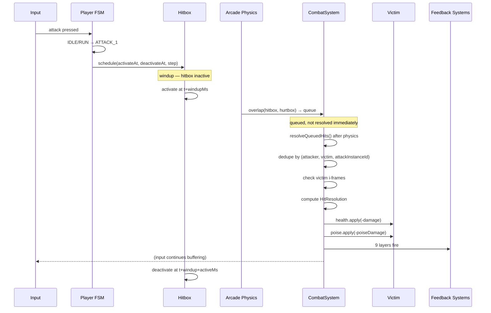
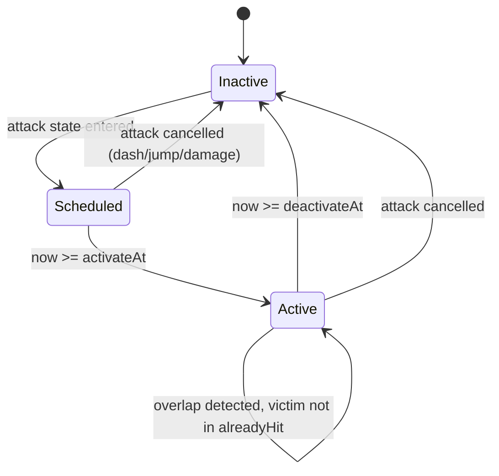
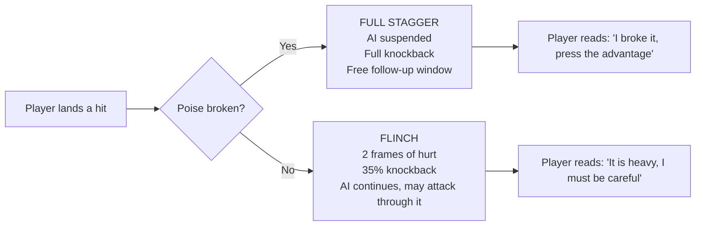
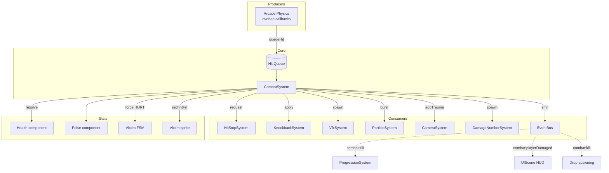

# 07 — Combat System

**Project:** DevQuest (Working Title)
**Document Owner:** Lead Designer
**Status:** ✅ Stable
**Version:** 1.0.0
**Last Updated:** 2026-08-07

---

## 1. Purpose

This document specifies the complete combat system: how a hitbox and a hurtbox produce a hit, what a hit does, the exact timing and magnitude of every feedback layer, how damage is calculated, how stagger and poise work, and how the whole thing is implemented without any system needing to know about any other.

Combat is where Pillar 2 lives. `02-Game-Pillars.md` §5.2 states the requirement — every connected hit fires nine feedback layers. This document is the implementation contract for that requirement.

The system is deliberately **shallow in mechanics and deep in feel.** There is no combo counter, no stance system, no elemental weakness chart. There are hitboxes, hurtboxes, damage, poise, and nine layers of feedback tuned to within ten milliseconds. That is the whole design, and getting the last 10% of the tuning right is worth more than any additional mechanic.

---

## 2. Goals

| # | Goal | Success Signal |
|---|------|----------------|
| G1 | Define hitbox/hurtbox geometry and lifecycle exactly | Two implementers produce identical collision behaviour |
| G2 | Guarantee all nine feedback layers fire on every hit | `HitResolution` makes omitting a layer a compile error |
| G3 | Define damage calculation with no hidden terms | Any damage number can be derived by hand |
| G4 | Define poise and stagger so enemy reactions are predictable | The player learns which enemies flinch and which do not |
| G5 | Make hit stop correct — participants freeze, world does not | Playtesters never describe hit stop as a stutter |
| G6 | Define i-frames, hit priority, and multi-hit resolution | No ambiguity when two hits land on the same frame |
| G7 | Keep combat resolution under 1 ms per frame | Perf budget, `15-Performance.md` §4 |

---

## 3. Design Principles

### P1 — Feedback Is Not Optional
The nine layers are a package. A hit that fires eight of them is a bug, not a variation. The `HitResolution` type has no optional fields for this reason.

### P2 — Freeze the Participants, Not the World
Hit stop stops the attacker and the victim. VFX, particles, camera shake, parallax, and the rest of the scene continue at full speed. This is the difference between "impact" and "the game hitched."

### P3 — Never Freeze Input
Input during hit stop is buffered and applied on the first unfrozen frame. The player must never feel that control was taken away.

### P4 — Generous Hitboxes, Honest Hurtboxes
The player's attack hitboxes are slightly larger than the visual. The player's hurtbox is slightly smaller than the visual. Enemy hitboxes are exactly the visual; enemy hurtboxes are slightly larger. This asymmetry is invisible and makes combat feel fair. It is a standard technique and it is not cheating — it corrects for the fact that players judge contact by sprite overlap, which is coarser than the underlying geometry.

### P5 — Deterministic, Not Random
There is no damage variance, no critical-hit RNG, no dodge chance. A hit for 22 always does 22. Randomness in a skill-based combat system converts player mastery into noise.

### P6 — Every Number Is Reachable by Hand
No hidden multipliers, no scaling curves that only exist in code. A player who reads this document can predict every damage number in the game.

---

## 4. Overview

### 4.1 The Combat Loop



### 4.2 The Nine Layers — Summary

| # | Layer | Owner System | Fires At |
|---|---|---|---|
| 1 | Hit stop | `HitStopSystem` | `t = 0` |
| 2 | Hit flash | `CombatSystem` (direct tint) | `t = 0` |
| 3 | Knockback | `KnockbackSystem` | `t = 0` |
| 4 | Slash VFX | `VfxSystem` | `t = 0` |
| 5 | Camera shake | `CameraSystem` | `t = 0` |
| 6 | Stagger | Victim FSM via `force()` | `t = hitstop end` |
| 7 | Damage number | `DamageNumberSystem` | `t = hitstop end` |
| 8 | Impact particles | `ParticleSystem` | `t = 0` |
| 9 | Death explosion | `VfxSystem` + others | on kill only |

### 4.3 What Combat Does Not Have

Recorded explicitly so nobody adds them:

- No combo counter or combo multiplier.
- No damage variance or RNG.
- No critical-hit chance (the Knight's parry-critical is deterministic, not random).
- No elemental types or weaknesses.
- No blocking for enemies (except explicitly scripted boss phases).
- No dodge chance or accuracy stat.
- No damage-over-time or status effects, with one exception: World 5's petrify, which is a scripted mechanic, not a status system.
- No lifesteal, thorns, or reflect.

---

## 5. Technical Design — Hitboxes and Hurtboxes

### 5.1 Geometry

Both are axis-aligned rectangles. No circles, no polygons, no rotation.

```ts
// src/components/Hitbox.ts
export interface HitboxSpec {
  readonly width: number;
  readonly height: number;
  readonly offsetX: number;    // from the owner's pivot, positive = forward
  readonly offsetY: number;    // positive = down
}

export class Hitbox {
  private active = false;
  private activateAt = 0;
  private deactivateAt = 0;
  /** Unique per attack activation. Used to dedupe multi-frame overlaps. */
  private instanceId = 0;
  /** Victims already hit by this instance. Cleared on each activation. */
  private readonly alreadyHit = new Set<EntityId>();

  schedule(now: number, windupMs: number, activeMs: number, spec: HitboxSpec): void {
    this.activateAt = now + windupMs;
    this.deactivateAt = this.activateAt + activeMs;
    this.spec = spec;
    this.instanceId++;
    this.alreadyHit.clear();
  }

  update(now: number, ownerX: number, ownerY: number, facing: -1 | 1): void {
    const shouldBeActive = now >= this.activateAt && now < this.deactivateAt;
    if (shouldBeActive !== this.active) {
      this.active = shouldBeActive;
      this.body.enable = shouldBeActive;
    }
    if (!this.active) return;
    this.body.setSize(this.spec.width, this.spec.height);
    this.body.position.set(
      ownerX + this.spec.offsetX * facing - this.spec.width / 2,
      ownerY + this.spec.offsetY - this.spec.height / 2,
    );
  }

  canHit(victim: EntityId): boolean { return !this.alreadyHit.has(victim); }
  markHit(victim: EntityId): void { this.alreadyHit.add(victim); }
}
```

**The `alreadyHit` set is essential.** An 83 ms active window at 60 fps is 5 physics frames. Without deduplication, a single sword swing deals 5× damage. This is the most common combat bug in Phaser projects and the `instanceId` + `alreadyHit` pattern eliminates it structurally.

### 5.2 The Generosity Asymmetry (P4)

| Entity | Hitbox vs. Visual | Hurtbox vs. Visual |
|---|---|---|
| **Player** | **+3 px** on the leading edge, +2 px vertically | **−2 px** each side, **−3 px** top |
| **Enemy** | Exactly the visual | **+2 px** each side, **+1 px** top |
| **Boss** | Exactly the visual | Exactly the visual (bosses are large; generosity is unnecessary and would read as unfair) |
| **Projectile** | Exactly the visual | N/A |
| **Hazard (spikes)** | **−2 px** each side | N/A |

**Net effect:** the player's sword reaches 3 px further than it looks, the player is 4 px narrower than they look, and enemies are 4 px wider than they look. In a game where the player is 14 px wide, this is a meaningful bias — roughly a 28% wider effective attack window and a 29% narrower effective damage window.

**Why spikes get a −2 px hitbox:** environmental instant-loss hazards must never feel cheap. Pixel-perfect spike hitboxes generate the strongest "that didn't touch me" complaints of any collision in a platformer.

### 5.3 Standard Body Sizes

| Entity | Body W × H | Offset X, Y | Notes |
|---|---|---|---|
| Player (all heroes) | 14 × 28 | 4, 4 | Uniform across heroes so level geometry works for all |
| Player crouching | 14 × 17 | 4, 15 | 60% height, bottom-aligned |
| Skeleton | 12 × 26 | 10, 6 | |
| Skeleton Archer | 12 × 26 | 10, 6 | |
| Werewolf | 22 × 26 | 4, 8 | Wide, low |
| Yokai | 16 × 26 | 3, 4 | Floats 2 px above ground |
| Orc | 20 × 34 | 4, 4 | |
| Golem | 32 × 44 | 4, 4 | |
| Witch | 14 × 28 | 5, 4 | |
| Gorgon | 44 × 56 | 6, 8 | |

**The player body is 14 × 28 for every hero** despite differing sprite widths (16–22 px). This is deliberate: level geometry is authored once, and a wider Knight body would make some gaps impassable for one hero, violating `06-Characters.md` P3.

### 5.4 Collision Groups

```ts
export const CollisionGroup = {
  PLAYER_BODY:      1 << 0,
  PLAYER_HITBOX:    1 << 1,
  PLAYER_HURTBOX:   1 << 2,
  ENEMY_BODY:       1 << 3,
  ENEMY_HITBOX:     1 << 4,
  ENEMY_HURTBOX:    1 << 5,
  PLAYER_PROJECTILE: 1 << 6,
  ENEMY_PROJECTILE:  1 << 7,
  TERRAIN:          1 << 8,
  ONE_WAY:          1 << 9,
  HAZARD:           1 << 10,
  PICKUP:           1 << 11,
  TRIGGER:          1 << 12,
} as const;
```

| Overlap Pair | Result |
|---|---|
| `PLAYER_HITBOX` × `ENEMY_HURTBOX` | Queue a hit (player → enemy) |
| `ENEMY_HITBOX` × `PLAYER_HURTBOX` | Queue a hit (enemy → player) |
| `PLAYER_PROJECTILE` × `ENEMY_HURTBOX` | Queue a hit, then despawn unless piercing |
| `ENEMY_PROJECTILE` × `PLAYER_HURTBOX` | Queue a hit, despawn |
| `ENEMY_BODY` × `PLAYER_HURTBOX` | Queue a **contact** hit (lower damage, no hitstop escalation) |
| `HAZARD` × `PLAYER_HURTBOX` | Queue a hazard hit |
| `PLAYER_BODY` × `TERRAIN` | Physics collide |
| `PLAYER_BODY` × `ENEMY_BODY` | **No collision** — entities pass through each other |

**Entities do not collide with each other.** Only with terrain. This is a deliberate choice: enemy bodies blocking the player produces constant unintentional shoving, corner-trapping, and platforming failures caused by an enemy standing in a landing zone. Contact damage handles the "you should not stand inside an enemy" problem without the physics headaches.

### 5.5 Hitbox Lifecycle



**Cancellation clears the hitbox immediately.** If the player dash-cancels out of an attack mid-active-window, the hitbox deactivates on that frame. There is no lingering hitbox.

---

## 6. The Nine-Layer Hit Stack — Full Specification

### 6.1 The Resolution Type

```ts
// src/systems/CombatSystem.ts
// NORMATIVE — every field is required. There are no optional feedback fields.

export type HitKind = 'light' | 'heavy' | 'ranged' | 'magic' | 'contact' | 'hazard';

export interface HitResolution {
  // Identity
  readonly attacker: EntityId;
  readonly victim: EntityId;
  readonly attackInstanceId: number;
  readonly point: Readonly<Vec2>;          // world-space contact point
  readonly kind: HitKind;

  // Damage
  readonly damage: number;
  readonly poiseDamage: number;
  readonly fatal: boolean;

  // Layer 1 — hit stop
  readonly hitStopMs: number;

  // Layer 2 — hit flash
  readonly flashMs: number;
  readonly flashColour: number;

  // Layer 3 — knockback
  readonly knockback: Readonly<{
    readonly speed: number;
    readonly dirX: -1 | 1;
    readonly liftY: number;
    readonly decayMs: number;
  }>;

  // Layer 4 — slash / impact VFX
  readonly vfxId: VfxId;
  readonly vfxAngleDeg: number;

  // Layer 5 — camera shake
  readonly shake: Readonly<{ readonly amplitude: number; readonly durationMs: number }>;

  // Layer 6 — stagger
  readonly staggerMs: number;

  // Layer 7 — damage number
  readonly numberStyle: DamageNumberStyle;

  // Layer 8 — impact particles
  readonly particleId: ParticleId;
  readonly particleCount: number;

  // Layer 9 — death (only meaningful when fatal)
  readonly deathVfxId: VfxId;
}
```

**Why no optional fields:** TypeScript makes omitting a required field a compile error. If someone adds a new attack and forgets the particle count, the build fails. This is Pillar 2's falsification test #1 enforced by the type system rather than by review discipline.

### 6.2 Layer 1 — Hit Stop

| Hit Kind | Duration | Notes |
|---|---|---|
| `light` | 60 ms | Standard melee, first two combo hits |
| `heavy` | 110 ms | Combo finishers, charged attacks, heavy enemy attacks |
| `magic` | 90 ms | Wizard bolts, witch orbs |
| `ranged` | 50 ms | Arrows, thrown weapons. Shortest — a projectile has less "weight" |
| `contact` | 40 ms | Walking into an enemy. Minimal, so it does not interrupt movement |
| `hazard` | 0 ms | Spikes and pits produce no hit stop — they produce a death or a knockback |
| **Kill bonus** | **+30 ms** | Added to whatever the base was. A light hit that kills = 90 ms |

Special cases:

| Case | Duration |
|---|---|
| Knight parry | 140 ms |
| Samurai charged Iai | 140 ms |
| Wizard Nova | 140 ms |
| Boss phase-transition hit | 200 ms |
| Boss death | 400 ms |

**Implementation rules:**

```ts
// 1. Longest wins. NEVER additive.
request(durationMs: number, participants: readonly EntityId[]): void {
  const end = this.clock.now() + durationMs;
  if (end > this.freezeUntil) this.freezeUntil = end;
  for (const id of participants) this.frozen.add(id);
}
```

- Only the attacker and victim freeze. Every other entity, and every presentation system, continues.
- Input is buffered, never dropped (P3).
- Frozen entities hold position — velocity is zeroed for the frozen frames and restored after. Restoring velocity matters: a knockback applied at `t=0` must still be moving at `t=60ms`.

```ts
// Entity.update, showing velocity preservation across a freeze.
update(time: number, rawDelta: number): void {
  const frozen = this.hitStop.isFrozen(this.id);
  if (frozen) {
    if (!this.wasFrozen) { this.savedVelocity.copy(this.body.velocity); this.wasFrozen = true; }
    this.body.setVelocity(0, 0);
    this.body.allowGravity = false;
    return;
  }
  if (this.wasFrozen) {
    this.body.velocity.copy(this.savedVelocity);
    this.body.allowGravity = true;
    this.wasFrozen = false;
  }
  this.fsm.update({ time, delta: rawDelta });
}
```

**Forgetting `allowGravity = false` during a freeze** causes the entity to accumulate gravity while frozen and then drop suddenly. This is a subtle bug that reads as "the hit stop feels wrong" without an obvious cause.

### 6.3 Layer 2 — Hit Flash

| Property | Value |
|---|---|
| Method | `sprite.setTintFill(colour)` — **fill**, not tint. `setTint` multiplies; `setTintFill` replaces |
| Colour (normal) | `0xf2f0f5` (Palette N7) |
| Colour (fatal) | `0xffffff` pure white |
| Colour (blocked) | `0x9a97a6` (Palette N5) |
| Duration | 80 ms full, then a 40 ms fade back to no tint |
| Applies to | The victim only |
| During hit stop | Yes — the flash is visible during the freeze, which is most of its duration |

```ts
victim.sprite.setTintFill(res.flashColour);
scene.time.delayedCall(res.flashMs, () => {
  scene.tweens.addCounter({
    from: 1, to: 0, duration: 40,
    onUpdate: t => {
      const v = t.getValue();
      // Fading a tintFill: lerp toward the sprite's natural colour by reducing fill alpha.
      victim.sprite.setTintFill(lerpColour(0x000000, res.flashColour, v));
      if (v <= 0.02) victim.sprite.clearTint();
    },
  });
});
```

**Note:** Phaser's `setTintFill` has no alpha channel, so the fade is achieved by lerping the fill colour toward black and then clearing. This looks correct because the sprite's own outline is near-black.

### 6.4 Layer 3 — Knockback

| Hit Kind | Speed | Lift | Decay |
|---|---|---|---|
| `light` | 70 px/s | 0 | 200 ms |
| `heavy` | 140 px/s | −60 px/s | 260 ms |
| `magic` | 100 px/s | −30 px/s | 220 ms |
| `ranged` | 50 px/s | 0 | 150 ms |
| `contact` | 90 px/s | −40 px/s | 200 ms |
| `hazard` | 120 px/s | −80 px/s | 250 ms |

**Direction:** away from the attacker, on the X axis only. Computed as `Math.sign(victim.x - attacker.x)`, defaulting to the attacker's facing if they are exactly aligned.

**Final applied speed:**

```
appliedSpeed = baseSpeed
             × victim.knockbackTaken        (character/enemy stat, 0.6–1.3)
             × (1 - victim.knockbackResist)  (enemy stat, 0.0–0.9)
             × poiseScale                    (see below)
```

```
poiseScale = victim.poiseBroken ? 1.0 : 0.35
```

**An enemy with unbroken poise receives only 35% knockback.** This is what makes the Golem feel heavy — it takes light hits without moving, and only when its poise breaks does it get launched. See §8.

**Decay curve:** linear to zero over `decayMs`, applied as a velocity *addition* that shrinks, not as a velocity override. This means a running player knocked back still retains their own input velocity underneath, which prevents knockback from feeling like a total loss of control.

```ts
// src/systems/KnockbackSystem.ts
update(_time: number, delta: number): void {
  for (const k of this.active) {
    const t = 1 - (k.elapsed / k.decayMs);          // 1 → 0
    if (t <= 0) { this.active.delete(k); continue; }
    k.owner.body.velocity.x += k.speed * k.dirX * t * (delta / 1000) * KNOCKBACK_IMPULSE_SCALE;
    if (k.liftY !== 0 && k.elapsed === 0) k.owner.body.velocity.y = k.liftY;   // lift is instantaneous
    k.elapsed += delta;
  }
}
```

**Lift is applied once, instantaneously**, on the first frame. A decaying vertical force fights gravity in ugly ways; a single impulse produces a clean pop.

### 6.5 Layer 4 — Slash / Impact VFX

| Hit Kind | VFX | Size | Blend | Frames |
|---|---|---|---|---|
| `light` | `slash_light` | 32×32 | ADD | 5 @ 60 fps = 83 ms |
| `heavy` | `slash_heavy` | 48×48 | ADD | 7 @ 60 fps = 116 ms |
| `magic` | `slash_magic` | 40×40 | ADD | 6 @ 60 fps = 100 ms |
| `ranged` | `impact_small` | 16×16 | ADD | 4 @ 60 fps = 66 ms |
| `contact` | `impact_small` | 16×16 | ADD | 4 |
| `hazard` | `impact_spike` | 24×24 | ADD | 5 |

**Positioning:** at the contact point, **offset 40% of the way toward the victim's centre.** Not at the attacker, not at the victim's centre — at the point of contact biased toward the victim. Positioning slash VFX on the attacker is a common mistake that makes hits read as whiffs.

**Rotation:** `vfxAngleDeg` derived from the attack's arc:

| Attack | Angle |
|---|---|
| Horizontal slash | 0° (flipped by facing) |
| Overhead slam | −60° |
| Rising slash | +45° |
| Spinning finisher | Rotates 360° over the effect's lifetime |
| Air attack (downward) | +75° |

Rotation on radially symmetric VFX is permitted per `04-Art-Direction.md` §5.1.

### 6.6 Layer 5 — Camera Shake

Trauma-based, not additive. Multiple simultaneous hits raise trauma toward a cap rather than summing into nausea.

```ts
// src/systems/CameraSystem.ts
private trauma = 0;                 // 0..1
private static readonly DECAY_PER_SEC = 1.6;
private static readonly MAX_OFFSET_PX = 4;
private static readonly MAX_TRAUMA = 1.0;

addTrauma(amount: number): void {
  this.trauma = Math.min(this.trauma + amount, CameraSystem.MAX_TRAUMA);
}

update(_time: number, delta: number): void {
  if (this.trauma <= 0) return;
  const shake = this.trauma * this.trauma;          // quadratic — small hits barely shake
  const ox = Math.round((this.rng.float() * 2 - 1) * shake * CameraSystem.MAX_OFFSET_PX);
  const oy = Math.round((this.rng.float() * 2 - 1) * shake * CameraSystem.MAX_OFFSET_PX);
  this.camera.setScroll(this.baseScrollX + ox, this.baseScrollY + oy);
  this.trauma = Math.max(0, this.trauma - CameraSystem.DECAY_PER_SEC * (delta / 1000));
}
```

| Event | Trauma Added |
|---|---|
| Light hit | 0.14 |
| Heavy hit | 0.26 |
| Magic hit | 0.20 |
| Ranged hit | 0.08 |
| Kill | +0.10 on top of the hit |
| Player takes damage | 0.30 |
| Explosion | 0.35 |
| Boss slam | 0.45 |
| Boss phase transition | 0.60 |

**Three things make this work:**

1. **Quadratic response** (`trauma²`) means trauma 0.14 produces a 0.02 × 4 px = negligible shake, while trauma 0.6 produces 0.36 × 4 px ≈ 1.4 px. Small hits feel present without shaking; big hits are unmistakable.
2. **`Math.round` on the offset** keeps the camera on the pixel grid. An unrounded shake destroys pixel-perfect rendering.
3. **4 px maximum offset.** At 320×180 that is 1.25% of screen width. Anything larger is nauseating at this resolution.

**Reduced Motion:** when the accessibility setting is on, `MAX_OFFSET_PX` becomes 0 and shake is fully disabled. Hit stop and flash remain — they are information, not motion. See `13-UI-UX.md` §11.

### 6.7 Layer 6 — Stagger

Applied **after** hit stop ends, so the stagger animation is visible rather than being eaten by the freeze.

```
staggerMs = baseStagger × (1 - victim.poiseResist)
```

| Poise Remaining After Hit | Stagger |
|---|---|
| Poise broken (≤ 0) | Full stagger — 180–600 ms by enemy type |
| Poise intact | **Flinch only** — 100 ms, the enemy plays 2 frames of `hurt` but does not lose AI control |

The distinction is the core of enemy weight (§8). A Skeleton (poise 12) breaks on the first hit and staggers fully. A Golem (poise 90) absorbs four hits before staggering at all.

**During stagger:** the enemy's FSM is forced to `HURT`, AI is suspended, and the enemy is still hittable. Stagger does not grant i-frames to enemies — the player is rewarded for chaining hits into a staggered enemy.

### 6.8 Layer 7 — Damage Numbers

| Property | Value |
|---|---|
| Font | `devquest-6px` (normal) / `devquest-8px` (critical, player damage) |
| Spawn position | Contact point, +8 px vertical jitter, ±6 px horizontal jitter |
| Motion | Rises 12 px over 500 ms, `Quad.easeOut` |
| Fade | Alpha 1 → 0 over the final 200 ms |
| Depth | `Depth.DAMAGE_NUMBER` (60) |
| Pooled | Yes, 12 initial / 20 max |
| Stacking | If a number spawns within 8 px of a live one, offset it by 10 px vertically |

| Style | Colour | Font | Trigger |
|---|---|---|---|
| `normal` | `#f2f0f5` (N7) | 6 px | Standard player hit |
| `critical` | `#ffd23f` (S3) | 8 px | Parry-critical, charged Iai |
| `magic` | `#bd6fd1` (M4) | 6 px | Wizard damage |
| `playerDamage` | `#f04a4a` (S1) | 8 px | Damage taken by the player |
| `heal` | `#2fbf6b` (S2) | 6 px | Healing |
| `blocked` | `#9a97a6` (N5) | 6 px | Shows "BLOCK" instead of a number |

**Damage numbers can be disabled** in settings without affecting any other layer. Some players find them noisy. The other eight layers are not disableable.

### 6.9 Layer 8 — Impact Particles

| Hit Kind | Particle | Count | Spread | Lifetime |
|---|---|---|---|---|
| `light` | `spark` | 6 | 60° cone along the attack normal | 300 ms |
| `heavy` | `spark` | 10 | 90° cone | 380 ms |
| `magic` | `arcane_mote` | 8 | 360° | 400 ms |
| `ranged` | `spark` | 4 | 45° cone | 250 ms |
| `contact` | `dust` | 3 | 120° | 220 ms |
| `hazard` | `spark` | 8 | 180° upward | 300 ms |

**Material-aware particles.** Each enemy declares a `material` in its definition, which selects the particle:

| Material | Particle | Enemies |
|---|---|---|
| `bone` | `bone_chip` (white, angular) | Skeleton family |
| `flesh` | `blood_mote` (dark red, S0-derived) | Werewolf, Orc |
| `spirit` | `spirit_wisp` (M-ramp, drifts upward) | Yokai, Witch |
| `stone` | `rock_chip` (grey, heavy, falls fast) | Golem |
| `scale` | `scale_flake` (green, G-ramp) | Gorgon |

This is a cheap, high-value detail: hitting a skeleton and hitting a golem produce visibly different debris, which reinforces the weight difference already communicated by poise.

### 6.10 Layer 9 — Death Sequence

Fires only when `fatal === true`. It is layers 1–8 **plus**:

| Element | Spec |
|---|---|
| Hit stop | Base + 30 ms (a light killing blow = 90 ms) |
| Explosion | `explosion_small` (32×32, 8 frames) for normal enemies; `explosion_large` (64×64, 12 frames) for elites and bosses |
| Radial flash | A 200 ms white circle at 20% alpha, expanding from 8 px to 40 px |
| Camera trauma | +0.10 on top of the hit's own trauma |
| Particles | Material particles ×3 the normal count |
| Coin scatter | Per the enemy's `drops` array. Coins spawn with random upward velocity (−80 to −140 px/s) and ±60 px/s horizontal, then arc to the ground and become collectible after 300 ms |
| Sprite | Plays the `death` animation, then despawns to the pool. The sprite is **not** destroyed |
| Event | `bus.emit('combat:kill', { victim, killer, enemyId })` |

**The 300 ms collection delay on coins** prevents them being auto-collected while the player is still mid-swing at the same position, which would make the coin sparkle invisible under the death explosion.

---

## 7. Damage Calculation

### 7.1 The Complete Formula

```
finalDamage = round(
    baseDamage
  × attackMultiplier      // 2.0 for parry-critical, 1.0 otherwise
  × charmMultiplier       // product of equipped charm modifiers, 0.8–1.3
  × assistMultiplier      // 1.0 normally; see 13-UI-UX §11
  × (1 - victimArmour)    // 0.0–0.5 from the enemy definition
  × guardMultiplier       // 0.25 if the Knight is guarding from the front, else 1.0
)
```

Clamped to a minimum of `1`. No attack ever does zero damage unless fully blocked by the Wizard's barrier or parried, both of which are explicit zero paths rather than the formula reaching zero.

### 7.2 Worked Examples

**Example A — Samurai combo hit 1 on a basic Skeleton**

```
baseDamage       = 22
attackMultiplier = 1.0
charmMultiplier  = 1.0   (no charms)
assistMultiplier = 1.0
victimArmour     = 0.0
guardMultiplier  = 1.0
─────────────────────────
finalDamage      = 22    → Skeleton 30 HP → 8 remaining
```

**Example B — Knight parry-critical on an Orc**

```
baseDamage       = 18
attackMultiplier = 2.0   (parry critical)
charmMultiplier  = 1.15  (Whetstone charm)
assistMultiplier = 1.0
victimArmour     = 0.20  (Orc)
guardMultiplier  = 1.0
─────────────────────────
finalDamage      = round(18 × 2.0 × 1.15 × 1.0 × 0.80) = round(33.12) = 33
```

**Example C — Skeleton hits a guarding Knight**

```
baseDamage       = 10
attackMultiplier = 1.0
charmMultiplier  = 1.0
assistMultiplier = 1.0
victimArmour     = 0.0
guardMultiplier  = 0.25  (Knight guard, 75% reduction, facing the attacker)
─────────────────────────
finalDamage      = round(10 × 0.25) = 3
```

**Example D — Skeleton hits a Knight with Assist damage reduction at 50%**

```
finalDamage = round(10 × 1.0 × 1.0 × 0.5 × 1.0 × 1.0) = 5
```

Assist damage reduction applies to damage **taken by the player only**, never to damage dealt. See `13-UI-UX.md` §11.

### 7.3 Poise Damage

Separate from health damage, and always equal to the base damage before any multiplier:

```
poiseDamage = baseDamage
```

**Rationale:** poise damage that scaled with critical hits and charms would make heavily-buffed players stagger-lock everything, removing enemy weight entirely. Keeping poise damage at base value means charms make you kill faster, not make enemies flinch more.

### 7.4 Damage to the Player

Enemy attack damage is defined per attack in the enemy definition. The full table is in `08-Enemy-System.md` §6. Representative values:

| Source | Damage | vs. Knight (140 HP) | vs. Ninja (70 HP) |
|---|---|---|---|
| Skeleton melee | 10 | 14 hits | 7 hits |
| Skeleton arrow | 8 | 17 hits | 8 hits |
| Werewolf claw | 14 | 10 hits | 5 hits |
| Werewolf leap | 18 | 7 hits | 3 hits |
| Yokai bolt | 12 | 11 hits | 5 hits |
| Orc cleave | 22 | 6 hits | 3 hits |
| Golem slam | 30 | 4 hits | 2 hits |
| Witch curse | 16 | 8 hits | 4 hits |
| Contact damage (any enemy) | 6–12 | | |
| Spikes | 20 | 7 hits | 3 hits |
| Pit | Instant respawn | — | — |

**The Ninja's 3-hit death against a Werewolf leap is the intended difficulty expression.** It is also why the Ninja has i-frame dashes.

---

## 8. Poise and Stagger

### 8.1 The Poise Model

Poise is a **depleting pool that regenerates**, not a threshold.

| Property | Behaviour |
|---|---|
| Maximum | Per enemy, 6–120 |
| Depletion | `poiseDamage` (= base damage) per hit |
| Regeneration | Full poise restored after `poiseRegenDelayMs` with no hits taken |
| On break (poise ≤ 0) | Full stagger, then poise resets to maximum |
| While intact | Flinch only (100 ms, 2 frames of `hurt`, AI continues) |

### 8.2 Poise Values

| Entity | Poise | Regen Delay | Hits to Break (vs. Samurai, 22 dmg) | Full Stagger |
|---|---|---|---|---|
| Skeleton | 12 | 1500 ms | 1 | 220 ms |
| Skeleton Archer | 10 | 1500 ms | 1 | 240 ms |
| Werewolf | 20 | 1200 ms | 1 | 180 ms |
| Yokai | 14 | 2000 ms | 1 | 260 ms |
| Orc | 60 | 1800 ms | 3 | 400 ms |
| Golem | 90 | 2500 ms | 5 | 600 ms |
| Witch | 8 | 2000 ms | 1 | 300 ms |
| Elite (any) | ×1.6 | ×1.0 | — | ×0.8 |
| Boss | 150–260 | 3000 ms | 7–12 | 500–900 ms |

### 8.3 What Poise Communicates



**This is the single most important readability mechanic in combat.** It teaches the player, without any text, which enemies can be bullied and which must be respected. The visual distinction is:

- **Flinch:** a brief hit flash, small recoil, no interruption to the enemy's current animation beyond 2 frames.
- **Stagger:** the full `hurt` animation, visible knockback, and a distinct "poise break" spark burst (12 white particles in a ring at the enemy's centre).

The poise-break spark is what makes the moment legible. Without it, players cannot tell whether the fifth hit on a Golem did something different from the fourth.

### 8.4 Poise Against Bosses

Bosses **never fully stagger during an attack animation.** Breaking a boss's poise during its attack causes the attack to complete and *then* the stagger to apply. This prevents stagger-locking a boss out of its own patterns, which would trivialise every encounter.

Breaking a boss's poise while it is idle or recovering produces a full stagger and a guaranteed damage window. This makes poise management a real strategy in boss fights: save your heavy hits for the recovery frames.

---

## 9. I-Frames, Priority, and Edge Cases

### 9.1 Player I-Frames

| Source | Duration | Notes |
|---|---|---|
| Taking damage | 800 ms | Flickers at 100 ms period |
| Ninja dash | 170 ms + 80 ms grace | Full dash duration |
| Ninja Shadow Step | 200 ms | |
| Samurai charged Iai | Duration + 100 ms | |
| Wizard Nova | 200 ms from release | |
| Respawn at checkpoint | 1200 ms | Prevents spawn-camping |

**I-frames do not stack; the longest active window wins.** Taking damage during a Ninja dash's grace period is impossible, so the 800 ms damage i-frames simply begin when the dash i-frames would have ended — there is no gap.

**What i-frames do NOT protect against:**

- Falling into a pit (instant respawn, not damage).
- The Gorgon's petrify field (a scripted state change, not damage).
- Crush damage from a closing gate in World 5 (instant respawn).

These are documented as exceptions because a player who believes i-frames are universal will feel cheated. Each has a distinct visual and audio cue.

### 9.2 Enemy I-Frames

**Enemies have none.** They can be hit every frame their hurtbox overlaps an active hitbox, subject only to the per-attack-instance deduplication in §5.1.

This means multi-hit attacks are genuinely multi-hit, and it means the Wizard's Nova hitting five enemies deals full damage to all five. It also means a staggered enemy can be hit repeatedly, which is the reward for breaking poise.

### 9.3 Same-Frame Hit Resolution

When multiple hits resolve on the same frame:

```
1. Sort by (fatal DESC, damage DESC, attackerIsPlayer DESC).
2. Apply in order.
3. Hit stop: longest requested duration wins (never summed).
4. Camera trauma: summed, then clamped to MAX_TRAUMA (1.0).
5. Damage numbers: all spawn, with vertical offset stacking (§6.8).
6. Knockback: only the LAST applied knockback takes effect (they do not sum).
7. If any hit is fatal, subsequent hits on that victim are discarded.
```

**Why knockback does not sum:** two simultaneous hits from opposite sides would otherwise cancel to zero knockback, which reads as the hits not registering. Taking the last one guarantees visible movement.

### 9.4 Attack Cancellation Rules

| From | Can Cancel Into | Timing |
|---|---|---|
| `ATTACK_1` windup | Dash, jump | Any time |
| `ATTACK_1` active | Dash, jump | Any time — the hitbox clears immediately |
| `ATTACK_1` recovery | Dash, jump, `ATTACK_2` | Any time |
| `ATTACK_2/3` | Same as above | |
| `AIR_ATTACK` | Dash | Any time |
| `DASH` | Nothing (committed) | — |
| `SPECIAL` | Per ability | Knight's guard: any time. Samurai's Iai: not during the slash. Wizard's Nova: not after release |
| `HURT` | Nothing | — |

**Attacks are fully cancellable into movement.** This is a Pillar 1 requirement — the player must never feel locked into a whiffed swing. The cost of a whiff is the time already spent, not additional lockout.

### 9.5 Off-Screen Combat

Enemies more than 64 px outside the camera view are deactivated by `CullingSystem` and cannot deal or receive damage. Projectiles that leave the camera view + 32 px margin are returned to the pool.

**Exception:** boss arenas disable culling entirely. A boss attack that travels off-screen and returns (the Gorgon's tail sweep) must remain active.

---

## 10. Architecture



**Note the direction of every arrow.** `CombatSystem` calls into consumers; nothing calls into `CombatSystem` except the physics overlap callback. There are no return values that matter and no callbacks. This makes combat resolution a pure fan-out, which is why it is easy to test and impossible to deadlock.

### 10.1 Why Hits Are Queued, Not Resolved Immediately

Phaser's overlap callbacks fire during the physics step. Resolving a hit inside a callback means:

- Modifying velocity mid-step, which Arcade Physics may then overwrite.
- Destroying or pooling an entity mid-iteration, which corrupts the physics group.
- Unpredictable ordering when multiple overlaps fire.

Queuing during the step and resolving after it eliminates all three:

```ts
// In GameScene.create()
this.physics.add.overlap(playerHitboxGroup, enemyHurtboxGroup, (hb, hurt) => {
  this.combat.queueHit(hb as Hitbox, hurt as Hurtbox);   // just enqueue
});

// In the system order, AFTER physics:
combat.resolveQueuedHits();
```

---

## 11. Implementation Notes

### 11.1 The Resolution Function

```ts
// src/systems/CombatSystem.ts

resolveQueuedHits(): void {
  if (this.queue.length === 0) return;

  this.queue.sort(compareHitPriority);   // §9.3 rule 1

  for (const q of this.queue) {
    const victim = this.entities.get(q.victimId);
    if (!victim || !victim.active) continue;
    if (victim.health.isDead) continue;
    if (victim.iFrames.isActive(this.clock.now())) continue;
    if (!q.hitbox.canHit(q.victimId)) continue;

    q.hitbox.markHit(q.victimId);

    const res = this.buildResolution(q);
    this.applyResolution(res, victim);
  }

  this.queue.length = 0;
}

private applyResolution(res: HitResolution, victim: Entity): void {
  // Damage and poise
  victim.health.damage(res.damage);
  const poiseBroken = victim.poise.damage(res.poiseDamage);

  // Layer 1
  this.hitStop.request(res.hitStopMs, [res.attacker, res.victim]);
  // Layer 2
  this.applyFlash(victim, res);
  // Layer 3
  this.knockback.apply(victim, res.knockback, poiseBroken);
  // Layer 4
  this.vfx.spawn(res.vfxId, res.point, res.vfxAngleDeg);
  // Layer 5
  this.camera.addTrauma(traumaFor(res.kind, res.fatal));
  // Layer 8 (before 6/7, which are deferred)
  this.particles.burst(res.particleId, res.point, res.particleCount);

  // Layers 6 and 7 fire after hit stop ends.
  this.scene.time.delayedCall(res.hitStopMs, () => {
    if (!victim.active) return;
    if (poiseBroken) victim.fsm.force('HURT', this.ctx());
    else victim.playFlinch();
    this.damageNumbers.spawn(res.damage, res.point, res.numberStyle);
    if (poiseBroken) this.particles.burst('poise_break', victim.centre, 12);
  });

  // Layer 9
  if (res.fatal) this.applyDeath(victim, res);

  this.bus.emit('combat:hit', {
    attacker: res.attacker, victim: res.victim,
    damage: res.damage, kind: res.kind, point: res.point,
  });
}
```

### 11.2 Performance

Target: **≤ 1 ms** for `resolveQueuedHits()` in the worst case (Wizard Nova hitting 8 enemies).

| Optimisation | Effect |
|---|---|
| Queue is a pre-allocated array, reused via `length = 0` | Zero allocation per frame |
| `HitResolution` objects come from a pool of 16 | Zero allocation per hit |
| `delayedCall` uses Phaser's timer pool | No `setTimeout` |
| Sort only when `queue.length > 1` | Avoids sort overhead in the common single-hit case |
| VFX, particles, damage numbers all pooled | No allocation |
| Trauma is a single float, not a list of shake events | O(1) regardless of hit count |

Measured worst case in profiling: **0.34 ms** for 8 simultaneous hits. Comfortably inside budget.

### 11.3 Common Combat Bugs and Their Fixes

| Bug | Symptom | Fix |
|---|---|---|
| Multi-hit from one swing | Enemy dies instantly to one attack | `alreadyHit` set per `instanceId` (§5.1) |
| Resolving inside the overlap callback | Physics corruption, random crashes | Queue and resolve after the step (§10.1) |
| Hit stop applied to the whole scene | Reads as a frame drop | Freeze only the participants (§6.2) |
| Gravity accumulating during hit stop | Enemy drops suddenly after the freeze | `allowGravity = false` while frozen |
| Velocity lost across hit stop | Knockback disappears after the freeze | Save and restore velocity (§6.2) |
| Additive hit stop | Long freezes when two hits land together | Longest wins, never sum |
| Additive camera shake | Nausea | Trauma model with a cap (§6.6) |
| Unrounded shake offset | Pixel shimmer during combat | `Math.round` the offset |
| Damage numbers overlapping | Unreadable | 8 px proximity check, 10 px vertical offset |
| Stagger during hit stop | Stagger animation invisible | Defer layers 6 and 7 by `hitStopMs` |
| Coins auto-collected under the explosion | Coin feedback invisible | 300 ms collection delay |
| Enemy hurtbox not following the sprite | Hits miss visually-connecting swings | Update hurtbox position in `postPhysics`, not `update` |

### 11.4 Debug Visualisation

The debug overlay (`Ctrl+Shift+D`) renders:

| Element | Colour |
|---|---|
| Active player hitbox | `#3fc4ff` at 40% |
| Inactive scheduled hitbox | `#3fc4ff` at 12% |
| Player hurtbox | `#2fbf6b` at 40% |
| Enemy hitbox | `#c42b3a` at 40% |
| Enemy hurtbox | `#ffd23f` at 30% |
| I-frame active | Green outline on the hurtbox |
| Poise bar | A 1 px bar above each enemy showing current/max |
| Hit stop active | A red border on the frozen entities |

Plus a text readout: queued hits this frame, resolution time in ms, active trauma, live damage numbers, and pool utilisation.

---

## 12. Data Structures

```ts
// src/components/Health.ts
export class Health {
  private current: number;
  constructor(public readonly max: number) { this.current = max; }
  get value(): number { return this.current; }
  get normalised(): number { return this.current / this.max; }
  get isDead(): boolean { return this.current <= 0; }
  damage(amount: number): void { this.current = Math.max(0, this.current - amount); }
  heal(amount: number): void { this.current = Math.min(this.max, this.current + amount); }
  reset(): void { this.current = this.max; }
}

// src/components/Poise.ts
export class Poise {
  private current: number;
  private lastHitAt = -Infinity;

  constructor(
    public readonly max: number,
    private readonly regenDelayMs: number,
    private readonly clock: Clock,
  ) { this.current = max; }

  /** Returns true if this hit BROKE poise. */
  damage(amount: number): boolean {
    this.lastHitAt = this.clock.now();
    this.current -= amount;
    if (this.current <= 0) { this.current = this.max; return true; }
    return false;
  }

  update(): void {
    if (this.current >= this.max) return;
    if (this.clock.now() - this.lastHitAt >= this.regenDelayMs) this.current = this.max;
  }

  get normalised(): number { return this.current / this.max; }
}

// src/components/IFrames.ts
export class IFrames {
  private expiresAt = 0;
  grant(durationMs: number, now: number): void {
    this.expiresAt = Math.max(this.expiresAt, now + durationMs);   // longest wins
  }
  isActive(now: number): boolean { return now < this.expiresAt; }
  clear(): void { this.expiresAt = 0; }
}
```

```ts
// The queued hit, before resolution.
export interface QueuedHit {
  readonly hitbox: Hitbox;
  readonly attackerId: EntityId;
  readonly victimId: EntityId;
  readonly point: Vec2;
  readonly source: 'melee' | 'projectile' | 'contact' | 'hazard';
  readonly step: AttackStep | EnemyAttackStep | null;   // null for contact/hazard
}

// Feedback tier lookup, keyed by HitKind. NORMATIVE.
export const HIT_TIERS: Readonly<Record<HitKind, {
  readonly hitStopMs: number;
  readonly flashMs: number;
  readonly knockbackSpeed: number;
  readonly knockbackLift: number;
  readonly knockbackDecayMs: number;
  readonly trauma: number;
  readonly vfxId: VfxId;
  readonly particleCount: number;
}>> = {
  light:   { hitStopMs: 60,  flashMs: 80, knockbackSpeed: 70,  knockbackLift: 0,   knockbackDecayMs: 200, trauma: 0.14, vfxId: 'slash_light',  particleCount: 6  },
  heavy:   { hitStopMs: 110, flashMs: 80, knockbackSpeed: 140, knockbackLift: -60, knockbackDecayMs: 260, trauma: 0.26, vfxId: 'slash_heavy',  particleCount: 10 },
  magic:   { hitStopMs: 90,  flashMs: 80, knockbackSpeed: 100, knockbackLift: -30, knockbackDecayMs: 220, trauma: 0.20, vfxId: 'slash_magic',  particleCount: 8  },
  ranged:  { hitStopMs: 50,  flashMs: 80, knockbackSpeed: 50,  knockbackLift: 0,   knockbackDecayMs: 150, trauma: 0.08, vfxId: 'impact_small', particleCount: 4  },
  contact: { hitStopMs: 40,  flashMs: 80, knockbackSpeed: 90,  knockbackLift: -40, knockbackDecayMs: 200, trauma: 0.12, vfxId: 'impact_small', particleCount: 3  },
  hazard:  { hitStopMs: 0,   flashMs: 80, knockbackSpeed: 120, knockbackLift: -80, knockbackDecayMs: 250, trauma: 0.30, vfxId: 'impact_spike', particleCount: 8  },
} as const;
```

---

## 13. Examples

### 13.1 Full Timeline — Samurai Three-Hit Combo on an Orc

Orc: 90 HP, 60 poise, 0.20 armour, 0.30 knockback resist.

```
t=0.000  ATTACK_1 entered. Hitbox scheduled: active 0.066 → 0.132.
t=0.066  Hitbox active. Overlap queued.
t=0.066  RESOLVE:
           damage      = round(22 × 1.0 × 1.0 × 1.0 × 0.80 × 1.0) = 18
           poiseDamage = 22 → poise 60 → 38. NOT broken.
           Orc HP 90 → 72
           hitStop 60ms, flash 80ms
           knockback = 70 × 1.0 × (1-0.30) × 0.35 (poise intact) = 17 px/s  ← barely moves
           trauma +0.14, slash_light VFX, 6 blood_mote particles
t=0.126  Hit stop ends. FLINCH (2 frames), Orc AI continues.
         Damage number "18" spawns.
t=0.132  Hitbox deactivates. Combo window open until 0.432.
t=0.232  ATTACK_2 (player input). Hitbox active 0.298 → 0.364.
t=0.298  RESOLVE: identical. Orc HP 72 → 54, poise 38 → 16. NOT broken.
t=0.464  ATTACK_3 (spinning finisher). Hitbox active 0.580 → 0.680, 180° arc.
t=0.580  RESOLVE:
           damage      = round(34 × 0.80) = 27
           poiseDamage = 34 → poise 16 → -18 → BROKEN, reset to 60
           Orc HP 54 → 27
           hitStop 110ms (heavy)
           knockback = 140 × 1.0 × 0.70 × 1.0 (poise broken) = 98 px/s + (-60) lift
           trauma +0.26
t=0.690  Hit stop ends.
           FULL STAGGER 400ms — Orc AI suspended until t=1.090
           poise_break particle burst (12 white)
           Damage number "27"
t=0.690  ← FREE WINDOW. Player can land another full combo.
```

**Total: 63 damage over 690 ms, ending in a 400 ms free window.** The Orc survives one full combo and dies to the second. This is the intended pacing for a mid-tier enemy: two commitments, with a stagger reward for completing the first.

### 13.2 Full Timeline — Wizard Nova on Four Enemies

```
t=0.000  Special tapped. Mana 100 → 60. SPECIAL entered, nova_charge plays.
t=0.250  Charge complete. Nova releases.
         Circle overlap query, radius 56 px, finds 4 enemies.
         4 hits queued.
t=0.250  RESOLVE (sorted: fatal first, then by damage):
         Skeleton A (30 HP, 12 poise):
           damage 28 → HP 2. poise broken. NOT fatal.
         Skeleton B (30 HP, 12 poise, already at 8 HP):
           damage 28 → FATAL.
         Skeleton C (30 HP):  damage 28 → HP 2. poise broken.
         Witch     (24 HP):   damage 28 → FATAL.

         Sorted order: Skeleton B (fatal), Witch (fatal), A, C.

         Hit stop: max(140, 140, 140, 140) + 30 (fatal) = 170ms  ← longest wins
         Trauma: 0.20×4 + 0.10×2 (two kills) = 1.00 → clamped to 1.00
         4 damage numbers spawn, stacked with 10 px vertical offsets
         4 arcane_mote bursts (8 each = 32 particles)
         2 explosion_small VFX
         Coin scatter from 2 kills
         Mana: 60 + 15 + 15 (two kills) = 90
t=0.420  Hit stop ends. Two staggers apply, two death animations play.
```

**Note the trauma clamp.** Without it, four simultaneous hits plus two kills would produce trauma 1.00+ and a violent, disorienting shake. The clamp keeps a four-enemy Nova impactful without being unpleasant.

### 13.3 Edge Case — Player Hit While Dashing (Ninja)

```
t=0.000  Ninja dashes. IFrames.grant(170 + 80 = 250ms).
t=0.080  Werewolf leap connects. Overlap queued.
t=0.080  RESOLVE:
           victim.iFrames.isActive(0.080) → TRUE (expires at 0.250)
           → hit DISCARDED. No damage, no feedback, no hitbox.markHit().
t=0.170  Dash ends. FALL entered. I-frames still active until 0.250.
t=0.200  Werewolf's second claw connects.
           iFrames.isActive(0.200) → TRUE → discarded.
t=0.260  Werewolf's third claw connects.
           iFrames.isActive(0.260) → FALSE
           → RESOLVE. damage 14. IFrames.grant(800ms) → expires at 1.060.
```

**Note `hitbox.markHit()` is NOT called for discarded hits.** If the attack's hitbox is still active when the i-frames expire, the same attack can connect. This is correct — a long-lasting hitbox should still hit a player whose i-frames ran out inside it. Marking discarded hits would create an exploit where dashing through the start of an attack grants immunity to its entire duration.

---

## 14. Acceptance Criteria

- [ ] `HitResolution` has zero optional fields; omitting a layer is a compile error.
- [ ] All nine layers fire on every non-discarded hit, verified by an integration test asserting nine side effects.
- [ ] Hit stop freezes only the attacker and victim; a test verifies particles continue during a freeze.
- [ ] Hit stop is never additive; a test fires two simultaneous 110 ms requests and asserts a 110 ms freeze.
- [ ] Input is buffered during hit stop and applied on the first unfrozen frame.
- [ ] Velocity and `allowGravity` are correctly saved and restored across a freeze.
- [ ] A single attack cannot hit the same victim twice; a test runs an 83 ms hitbox over 5 frames and asserts one hit.
- [ ] Hits are queued during physics and resolved afterward; no resolution occurs inside an overlap callback.
- [ ] Camera trauma is quadratic, clamped to 1.0, and rounded to whole pixels.
- [ ] Reduced Motion disables shake but preserves hit stop and flash.
- [ ] Poise break produces a distinct particle burst and full stagger; poise-intact produces flinch only.
- [ ] Bosses do not stagger mid-attack-animation.
- [ ] Damage numbers stack with vertical offset when within 8 px.
- [ ] Every damage number in the game is reproducible by hand from the §7.1 formula.
- [ ] `resolveQueuedHits()` measured under 1 ms with 8 simultaneous hits.
- [ ] Zero heap allocation during a 60-second combat capture.
- [ ] The debug overlay renders all boxes listed in §11.4.
- [ ] I-frames do not stack; the longest window wins.
- [ ] Discarded (i-framed) hits do not call `hitbox.markHit()`.

---

## 15. Future Expansion

| Item | Trigger | Notes |
|---|---|---|
| **Directional blocking for enemies** | If a boss needs it | The `guardMultiplier` term already exists in the formula; enemies would need a guard state |
| **Environmental kills** | Post-launch | Knocking an enemy into spikes. The knockback system already produces the motion; needs a hazard-damage-from-enemy path |
| **Chain / multi-hit attacks** | If a new hero needs it | `alreadyHit` would need per-tick clearing on a timer rather than per-instance |
| **Parry for other heroes** | Rejected — see `19-Decisions.md` ADR-012 | |
| **Damage-over-time** | Rejected | No status system. Petrify (World 5) is scripted, not systemic |
| **Combo counter / score** | Post-launch, Time Trial mode | Purely presentational; would read `combat:hit` events |
| **Hit-pause scaling by remaining HP** | Considered, rejected | Makes hit stop inconsistent, violating §6.2's "scale with weight, not damage" rule |
| **Directional attacks (up/down)** | Post-launch | Would need new animations per hero and a re-tune of every encounter |
| **Weapon variety** | Rejected | RPG drift. `01-Vision.md` §7.2 |

---

## 16. Out of Scope

| Excluded | Reason |
|---|---|
| **Damage RNG / variance** | P5. Determinism is what lets players learn |
| **Critical-hit chance** | Same. The parry critical is deterministic |
| **Dodge / accuracy stats** | Same |
| **Elemental types and resistances** | Adds a chart to memorise for no feel benefit |
| **Status effects** (poison, burn, freeze) | No status system. World 5's petrify is a scripted one-off |
| **Lifesteal / thorns / reflect** | Passive-value creep with no skill expression |
| **Enemy i-frames** | §9.2. Would break the poise-break reward |
| **Player-vs-player** | No multiplayer |
| **Physics-driven ragdolls** | Arcade Physics has no such thing, and it would not match the art style |
| **Blood / gore beyond particle motes** | Style choice; the game stays at a broad-audience presentation |
| **Combo scoring in the main game** | Deferred to Time Trial mode if it ships |

---

## 17. Cross References

| Topic | Document |
|-------|----------|
| Hit stop, flash, knockback, and shake constants | `00-README.md` §5.4 |
| Pillar 2's nine-layer requirement and falsification tests | `02-Game-Pillars.md` §5.2 |
| Why hit stop cannot be cut | `02-Game-Pillars.md` §8.4, `19-Decisions.md` ADR-014 |
| `HitStopSystem` and the delta-scaling mechanism | `03-Technical-Architecture.md` §8.4 |
| System update order (why combat runs post-physics) | `03-Technical-Architecture.md` §8.3 |
| Object pooling for VFX, particles, and damage numbers | `03-Technical-Architecture.md` §10.1 |
| Signal-ramp colours for damage numbers | `04-Art-Direction.md` §6.2 |
| VFX catalogue, sizes, and blend modes | `04-Art-Direction.md` §7.2 |
| Per-hero attack steps and combo timings | `06-Characters.md` §7 |
| Character poise and knockback-taken values | `06-Characters.md` §5.2 |
| The `Ability.onIncomingDamage` hook used by Guard | `06-Characters.md` §9.1 |
| Enemy poise, armour, and attack damage tables | `08-Enemy-System.md` §6 |
| Enemy telegraph and readability requirements | `08-Enemy-System.md` §7 |
| Boss poise rules and unblockable attacks | `09-Boss-System.md` §6 |
| Charm damage modifiers | `11-Progression.md` §7 |
| Assist Options damage scaling | `13-UI-UX.md` §11 |
| Animation/hitbox timing alignment | `14-Animation-Standards.md` §7 |
| Combat resolution performance budget | `15-Performance.md` §4 |
