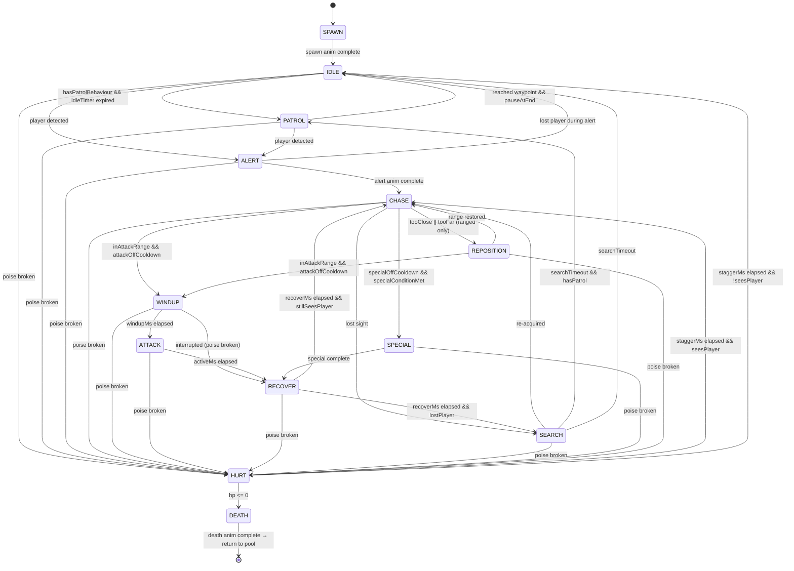
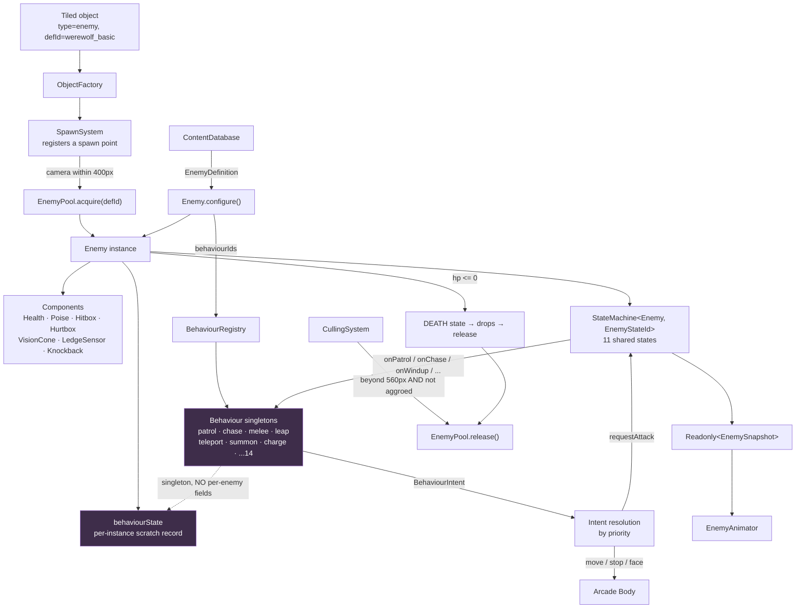

# 08 — Enemy System

**Project:** DevQuest (Working Title)
**Document Owner:** Lead Designer
**Status:** ✅ Stable
**Version:** 1.0.0
**Last Updated:** 2026-08-07

---

## 1. Purpose

This document specifies the enemy framework: the single `Enemy` class, the composable behaviour modules that drive it, the shared AI state machine, the sensing model, and the complete specification of all seven enemy families across their three tiers.

The framework's central commitment, from `03-Technical-Architecture.md` §5.2, is stated here as a requirement: **adding an enemy is a JSON file and zero TypeScript files.** Everything in this document is designed to make that true, and the acceptance criteria in §14 verify it.

The second commitment is readability. An enemy the player cannot read is an enemy the player cannot fight fairly. Every enemy in this document has an explicit telegraph specification — how long the windup is, what changes visually, and what the player is supposed to do about it.

---

## 2. Goals

| # | Goal | Success Signal |
|---|------|----------------|
| G1 | One `Enemy` class serving all 21 configurations | Zero enemy subclasses in `src/entities` |
| G2 | Behaviours composable and independently testable | Each behaviour has unit tests with no Phaser scene |
| G3 | Every enemy readable — clear tells, honest hitboxes | A playtester can name the incoming attack before it lands |
| G4 | Each enemy has a distinct combat role | No two enemies solve the same design problem |
| G5 | Three tiers per family without new code | Tiers are JSON multipliers plus optional extra behaviours |
| G6 | AI is cheap — 40 active enemies inside budget | AI update measured under 1.5 ms |
| G7 | Encounter grammar for level designers | Designers compose fights from documented building blocks |

---

## 3. Design Principles

### P1 — One Class, Many Configurations
There is exactly one `Enemy` class. Differences come from `EnemyDefinition`. If a behaviour cannot be expressed through configuration, the answer is a **new behaviour module**, never a subclass.

### P2 — Every Enemy Answers a Design Question
An enemy exists to pose a specific problem. The Skeleton asks "can you time a swing?" The Skeleton Archer asks "will you close distance or find cover?" An enemy that duplicates another's question is cut.

### P3 — Telegraph Everything
Every attack has a windup of at least 250 ms with a distinct visual change. The player must always be able to see an attack coming. Attacks without tells are not difficulty; they are noise.

### P4 — Enemies Are Not Fair, Encounters Are
An individual enemy may be strong. The *encounter* — the enemy plus its placement plus the terrain — is what gets balanced. A Golem in an open room and a Golem in a corridor are different fights, and the level designer owns that difference.

### P5 — Predictable Beats Random
Enemy AI is deterministic given the same inputs. Attack selection uses weighted choice from the seeded `Rng`, but cooldowns, ranges, and reactions are fixed. A player must be able to learn an enemy.

### P6 — Enemies Do Not Cheat
No enemy has more sensing range than the level shows, no enemy tracks the player through walls, and no enemy has invisible i-frames or hidden damage reduction. Everything is in the JSON and everything is in this document.

---

## 4. Overview

### 4.1 The Roster

| Family | World | Role | Design Question | Base HP | Threat |
|---|---|---|---|---|---|
| **Skeleton** | 1 | Baseline melee | "Can you time a swing?" | 30 | ★☆☆☆☆ |
| **Werewolf** | 2 | Fast aggressor | "Can you react under pressure?" | 45 | ★★★☆☆ |
| **Yokai** | 3 | Teleporting harasser | "Can you fight what won't hold still?" | 38 | ★★★☆☆ |
| **Witch** | 3 | Zone controller | "Can you reach the back line?" | 24 | ★★☆☆☆ |
| **Orc** | 4 | Armoured bruiser | "Can you break through?" | 90 | ★★★★☆ |
| **Golem** | 4 | Immovable wall | "Can you find the opening?" | 140 | ★★★★☆ |
| **Gorgon** | 5 | Elite / boss basis | "Can you use everything you've learned?" | 110 (elite) | ★★★★★ |

### 4.2 The Tier System

Every family has three tiers. Tiers are pure configuration — no new code, no new art beyond a recolour and one accessory.

| Tier | HP | Damage | Speed | Poise | Extra Behaviour | Visual Marker |
|---|---|---|---|---|---|---|
| **Basic** | ×1.0 | ×1.0 | ×1.0 | ×1.0 | — | Base palette |
| **Veteran** | ×1.5 | ×1.2 | ×1.1 | ×1.3 | One additional behaviour | Darker palette + one accessory |
| **Elite** | ×2.4 | ×1.5 | ×1.2 | ×1.6 | Two additional behaviours + a unique attack | Emissive rim light (world accent colour) |

**The elite rim light is the key readability marker.** A 1 px emissive outline in the world's accent colour instantly communicates "this one is different" without requiring the player to read a health bar. It is applied as a shader-free effect: a duplicated sprite one pixel larger, tinted to the accent colour, at depth `ENEMY - 1`.

**21 configurations** = 7 families × 3 tiers. All are JSON.

### 4.3 What Every Enemy Has

| Component | Purpose |
|---|---|
| `Health` | HP pool |
| `Poise` | Stagger resistance (see `07-Combat.md` §8) |
| `Hurtbox` | Where it can be hit (+2 px generosity, §5.2 of `07`) |
| `Hitbox` | Where it hits (exactly the visual) |
| `Facing` | −1 / +1, drives sprite flip and attack direction |
| `GroundSensor` | Is it standing on something |
| `LedgeSensor` | Is there floor ahead (prevents walking off cliffs) |
| `VisionCone` | Can it see the player |
| `Knockback` | Receives impulses from combat |
| `StateMachine` | The shared 11-state AI FSM |
| `EnemyAnimator` | Read-only projection of state |
| Behaviours | 1–5 composable modules from the registry |

---

## 5. Technical Design — The Framework

### 5.1 The Shared AI State Machine

Every enemy uses this identical FSM. Behaviours plug into states; they do not replace them.



### 5.2 State Reference

| State | Behaviour Hook | Duration | Notes |
|---|---|---|---|
| `SPAWN` | — | Spawn anim | Not hittable during spawn |
| `IDLE` | `onIdle` | `idleDurationMs` | Standing still, sensing |
| `PATROL` | `onPatrol` | Until waypoint | Moves at `moveSpeed` |
| `ALERT` | `onAlert` | `alertDurationMs` (300–600) | **Mandatory.** The "!" moment. Enemy stops, plays a notice animation, then commits |
| `CHASE` | `onChase` | Until in range or lost | Moves at `chaseSpeed` |
| `REPOSITION` | `onReposition` | Until range is right | Ranged enemies only |
| `WINDUP` | `onWindup` | `windupMs` (250+) | **The telegraph.** Enemy is stationary or committed |
| `ATTACK` | `onAttack` | `activeMs` | Hitbox live |
| `RECOVER` | `onRecover` | `recoverMs` | **The punish window.** Enemy is vulnerable and cannot act |
| `SPECIAL` | `onSpecial` | Per behaviour | Teleport, summon, leap |
| `SEARCH` | `onSearch` | `searchTimeoutMs` | Moves toward the last known position |
| `HURT` | — | `staggerMs` | AI suspended |
| `DEATH` | — | Death anim | Drops spawn, then pool return |

**The `ALERT` state is mandatory and is a Pillar 4 requirement.** Without it, enemies snap from idle to charging with no warning, which reads as unfair. The 300–600 ms alert gives the player time to notice, orient, and decide. It also gives the enemy a distinct animation that signals "I have seen you," which is information the player needs.

**The `RECOVER` state is the game's fairness contract.** Every enemy attack is followed by a window where the enemy cannot act. This is where the player deals damage. An enemy with a short recover is dangerous; an enemy with no recover would be unfair.

### 5.3 The Behaviour Interface

```ts
// src/entities/enemy/behaviours/Behaviour.ts
// NORMATIVE

export interface BehaviourContext {
  readonly enemy: Enemy;
  readonly player: Player;
  readonly time: number;
  readonly delta: number;         // already hitstop-scaled
  readonly bus: EventBus;
  readonly rng: Rng;
  /** Per-instance scratch state. Behaviours are shared; state is not. */
  readonly state: Record<string, unknown>;
  readonly config: Readonly<Record<string, unknown>>;
}

/** What a behaviour asks the FSM to do. The FSM decides whether to honour it. */
export type BehaviourIntent =
  | { kind: 'none' }
  | { kind: 'move'; vx: number }
  | { kind: 'stop' }
  | { kind: 'requestAttack'; attackId: string }
  | { kind: 'requestSpecial'; specialId: string }
  | { kind: 'requestState'; state: EnemyStateId }
  | { kind: 'face'; dir: -1 | 1 };

export interface Behaviour {
  readonly id: BehaviourId;

  /** Called once when an enemy using this behaviour spawns. Initialise `ctx.state`. */
  init?(ctx: BehaviourContext): void;

  /** Which FSM states this behaviour participates in. */
  readonly states: readonly EnemyStateId[];

  onIdle?(ctx: BehaviourContext): BehaviourIntent;
  onPatrol?(ctx: BehaviourContext): BehaviourIntent;
  onAlert?(ctx: BehaviourContext): BehaviourIntent;
  onChase?(ctx: BehaviourContext): BehaviourIntent;
  onReposition?(ctx: BehaviourContext): BehaviourIntent;
  onWindup?(ctx: BehaviourContext): BehaviourIntent;
  onAttack?(ctx: BehaviourContext): BehaviourIntent;
  onRecover?(ctx: BehaviourContext): BehaviourIntent;
  onSpecial?(ctx: BehaviourContext): BehaviourIntent;
  onSearch?(ctx: BehaviourContext): BehaviourIntent;

  /** Called every frame regardless of state. Cooldown tracking lives here. */
  passive?(ctx: BehaviourContext): void;

  /** Called when the enemy despawns. Clean up spawned objects (summons, projectiles). */
  cleanup?(ctx: BehaviourContext): void;
}
```

**Behaviours are singletons.** One `PatrolBehaviour` instance serves every patrolling enemy in the level. Per-enemy state lives in `ctx.state`, a plain record owned by the enemy. This means zero allocation per enemy per behaviour and makes behaviours trivially testable.

**Intent resolution:** when multiple behaviours return intents in the same frame, the FSM resolves by priority:

```
1. requestState   (highest — a behaviour forcing a transition)
2. requestSpecial
3. requestAttack
4. stop
5. move           (if multiple, the last one wins)
6. face
7. none
```

### 5.4 The Behaviour Registry

| Behaviour | Purpose | Used By | Config Keys |
|---|---|---|---|
| `patrol` | Walk between points or ledge to ledge | All ground enemies | `waypointMode`, `pauseAtEndMs`, `turnAtLedge` |
| `chase` | Move toward the player horizontally | All melee | `stopDistance`, `giveUpDistance`, `jumpGaps` |
| `melee` | Standard windup-attack-recover | Skeleton, Orc, Werewolf | `attacks[]`, `range`, `cooldownMs` |
| `ranged` | Fire projectiles, maintain distance | Archer, Witch, Yokai | `projectileId`, `preferredRange`, `retreatIfCloserThan` |
| `leap` | Committed arc jump toward the player | Werewolf, Gorgon | `leapSpeed`, `leapArc`, `minRange`, `maxRange` |
| `teleport` | Vanish and reappear near the player | Yokai | `teleportRange`, `preferBehind`, `cooldownMs` |
| `summon` | Spawn additional enemies | Witch, Skeleton Warlord | `summonDefId`, `maxAlive`, `count`, `cooldownMs` |
| `charge` | Straight-line unstoppable rush | Orc, Golem | `chargeSpeed`, `windupMs`, `stopOnWall`, `wallStunMs` |
| `groundSlam` | AOE shockwave attack | Golem | `radius`, `shockwaveSpeed`, `damage` |
| `shield` | Directional damage reduction | Orc (veteran+) | `reduction`, `arcDegrees`, `breakAfterHits` |
| `enrage` | Behaviour change below an HP threshold | All elites | `hpThreshold`, `speedMult`, `damageMult`, `cooldownMult` |
| `flee` | Retreat when the player is close | Witch | `fleeDistance`, `fleeSpeed` |
| `hover` | Float, ignore gravity, bob | Yokai | `hoverHeight`, `bobAmplitude`, `bobPeriodMs` |
| `petrify` | Gaze cone that slows the player | Gorgon | `coneAngle`, `coneRange`, `slowFactor`, `chargeMs` |

**14 behaviours produce 21 enemy configurations.** Adding an eighth family would likely need zero new behaviours.

### 5.5 Sensing

```ts
// src/components/VisionCone.ts
export interface SenseConfig {
  readonly sightRange: number;         // px
  readonly sightAngleDeg: number;      // total cone, centred on facing
  readonly hearRange: number;          // omnidirectional, ignores facing and walls
  readonly loseSightMs: number;        // grace before losing the player
  readonly requiresLineOfSight: boolean;
}

export class VisionCone {
  canSee(self: Vec2, facing: -1 | 1, target: Vec2, tilemap: TileCollision): boolean {
    const dx = target.x - self.x;
    const dy = target.y - self.y;
    const dist = Math.hypot(dx, dy);

    if (dist > this.cfg.sightRange) return false;

    // Hearing bypasses the cone but not the range.
    if (dist <= this.cfg.hearRange) return true;

    // Cone check — is the target within sightAngleDeg of facing?
    const angleToTarget = Math.atan2(dy, dx * facing);
    if (Math.abs(angleToTarget) > (this.cfg.sightAngleDeg * Math.PI / 180) / 2) return false;

    // Line of sight — no solid tiles between.
    if (this.cfg.requiresLineOfSight && tilemap.raycastBlocked(self, target)) return false;

    return true;
  }
}
```

**Sensing rules that keep P6 honest:**

- **Line of sight is mandatory for all ranged enemies.** An archer that shoots through a wall is a bug.
- **Hearing is omnidirectional but short** (typically 48–60 px) and *does* pass through walls. This models "it heard you land" and prevents cheesing enemies by standing behind a thin wall.
- **`loseSightMs`** (2000–3500 ms) is a grace period, not an instant drop. Breaking line of sight for 200 ms does not make the enemy forget you.
- **Enemies never track the player through walls beyond hearing range.** No exceptions.

**Cost:** the raycast is the only expensive part. It is done at most once per enemy per 100 ms (not per frame) via a staggered update — see §12.2.

### 5.6 Ledge and Wall Sensing

```ts
// src/components/LedgeSensor.ts
// Two probes: one ahead at foot level (wall), one ahead and below (ledge).

export interface SensorResult {
  readonly wallAhead: boolean;
  readonly ledgeAhead: boolean;      // no floor at (x + facing*probeX, y + probeY)
  readonly gapWidth: number;          // px of empty floor ahead, capped at 64
}
```

| Config | Effect |
|---|---|
| `turnAtLedge: true` | Enemy reverses at a ledge. Default for patrols |
| `jumpGaps: true` | Enemy jumps gaps up to `maxJumpGap` px. Werewolf, Orc |
| `ignoreLedges: true` | Enemy walks off. Only for flying/hovering enemies, and for the Golem's charge |

**Gap width matters** because it lets a chasing enemy decide between jumping (gap ≤ `maxJumpGap`) and stopping at the edge. An enemy that stops at the edge of a gap and paces is a far better encounter element than one that walks into a pit.

---

## 6. The Enemy Roster — Full Specifications

---

## 6.1 SKELETON — The Baseline

**World:** 1 · **Asset:** CraftPix Skeleton pack · **Material:** `bone`

**Design question:** *Can you time a swing?*

The tutorial enemy and the reference against which every other enemy is measured. Slow, telegraphed, low HP, low damage. A player who cannot beat a Skeleton cannot play the game, so the Skeleton is tuned to be beatable by someone who has never played a platformer.

### 6.1.1 Stats

| Tier | HP | Contact Dmg | Attack Dmg | Move | Chase | Poise | Armour | Coins |
|---|---|---|---|---|---|---|---|---|
| Basic | 30 | 6 | 10 | 34 | 52 | 12 | 0.00 | 2–5 |
| Veteran | 45 | 7 | 12 | 37 | 57 | 16 | 0.05 | 4–8 |
| Elite | 72 | 9 | 15 | 41 | 62 | 19 | 0.10 | 8–14 |

### 6.1.2 Behaviours

| Tier | Behaviours |
|---|---|
| Basic | `patrol`, `chase`, `melee` |
| Veteran | `patrol`, `chase`, `melee`, `shield` |
| Elite | `patrol`, `chase`, `melee`, `shield`, `enrage` |

### 6.1.3 Attacks

| Attack | Windup | Active | Recover | Damage | Range | Telegraph |
|---|---|---|---|---|---|---|
| **Overhead swing** | 600 ms | 133 ms | 500 ms | 10 | 26 px | Sword raises fully above the head. Frame 2 flashes S0 red |
| **Elite: Bone throw** | 450 ms | — | 400 ms | 8 | 140 px | Winds arm back; a rib is visible in hand |

**The 600 ms windup is deliberately the longest in the game.** This is the enemy that teaches "wait for the tell, then dodge, then punish." Every subsequent enemy shortens this window.

**Recover 500 ms** is enough for a full Samurai combo (880 ms is too long; hits 1 and 2 fit). The player learns that a dodged Skeleton swing is worth 44 damage.

### 6.1.4 Sensing

`sightRange: 96` · `sightAngleDeg: 120` · `hearRange: 48` · `loseSightMs: 2500` · `requiresLineOfSight: true`

### 6.1.5 Variants

| Variant | Changes | Purpose |
|---|---|---|
| **Skeleton Archer** | `ranged` instead of `melee`; sight 140 px; retreats below 56 px | Introduces the "close the gap or take cover" problem in 1-2 |
| **Skeleton Brute** (elite reskin) | 1.3× scale, poise 30, no `shield`, +6 damage | A mini-wall in 1-3; the first enemy that does not stagger on one hit |

---

## 6.2 WEREWOLF — The Pressure

**World:** 2 · **Asset:** CraftPix Werewolf pack · **Material:** `flesh`

**Design question:** *Can you react under pressure?*

The Skeleton's opposite. Fast, aggressive, short windups, and a committed leap that covers ground. The Werewolf punishes standing still and rewards movement — which is exactly the lesson World 2's wind mechanics are also teaching.

### 6.2.1 Stats

| Tier | HP | Contact | Attack | Move | Chase | Poise | Armour | Coins |
|---|---|---|---|---|---|---|---|---|
| Basic | 45 | 8 | 14 | 58 | 96 | 20 | 0.00 | 4–8 |
| Veteran | 68 | 10 | 17 | 64 | 106 | 26 | 0.05 | 7–13 |
| Elite | 108 | 12 | 21 | 70 | 115 | 32 | 0.10 | 14–22 |

**96 px/s chase speed** is faster than the Knight's run (78) and slower than the Ninja's (108). This is the single most important number in the Werewolf's design: the Knight cannot outrun it and must fight; the Ninja can kite it. This is P4 — the enemy is the same, the encounter differs by hero.

### 6.2.2 Behaviours

| Tier | Behaviours |
|---|---|
| Basic | `patrol`, `chase`, `melee`, `leap` |
| Veteran | `patrol`, `chase`, `melee`, `leap`, `enrage` |
| Elite | `patrol`, `chase`, `melee`, `leap`, `enrage`, `charge` |

### 6.2.3 Attacks

| Attack | Windup | Active | Recover | Damage | Range | Telegraph |
|---|---|---|---|---|---|---|
| **Claw swipe** | 300 ms | 100 ms | 280 ms | 14 | 24 px | Crouches, claws raise. Body compresses visibly |
| **Leap** | 400 ms | 500 ms (travel) | 600 ms | 18 | Contact | **Full-body crouch + a dust ring at the feet.** The longest recover in the roster |
| **Elite: Rush** | 500 ms | 900 ms | 700 ms | 20 | Contact | Digs in with both feet, dust cloud, S0 flash |

**The leap's 600 ms recover is the fairness contract.** The leap is the Werewolf's threatening move — it crosses 120 px, cannot be blocked mid-air, and hits for 18. In exchange, missing it leaves the Werewolf helpless for 600 ms, which is a full Samurai combo (78 damage — more than one and a half times the Werewolf's HP).

The intended play pattern is therefore: **bait the leap, dodge, punish.** The Werewolf teaches this in 2-1 with a single specimen in an open room.

### 6.2.4 The Leap Behaviour

```ts
// Leap trajectory is computed, not authored, so it always lands on the player's
// position at windup end — never on their current position.
const targetX = player.x;                       // frozen at windup end
const dx = targetX - enemy.x;
const t = cfg.leapTravelMs / 1000;
enemy.body.velocity.x = dx / t;
enemy.body.velocity.y = -(cfg.leapArc);         // fixed arc height
// Gravity handles the rest. Landing produces a dust burst + 0.20 camera trauma.
```

**Freezing the target at windup end** is what makes the leap dodgeable. If it homed continuously, it would be unavoidable, which violates P3.

### 6.2.5 Sensing

`sightRange: 140` · `sightAngleDeg: 150` · `hearRange: 80` · `loseSightMs: 3500` · `requiresLineOfSight: true`

Longest hearing range in the roster. Werewolves notice you.

---

## 6.3 YOKAI — The Harasser

**World:** 3 · **Asset:** CraftPix Yokai pack · **Material:** `spirit`

**Design question:** *Can you fight what will not hold still?*

A hovering, teleporting ranged enemy that repositions constantly. It does not hit hard; it makes the player unable to settle. In World 3's low-visibility rooms, a Yokai that teleports behind you is genuinely alarming.

### 6.3.1 Stats

| Tier | HP | Contact | Attack | Move | Chase | Poise | Armour | Coins |
|---|---|---|---|---|---|---|---|---|
| Basic | 38 | 7 | 12 | 42 | 66 | 14 | 0.00 | 5–10 |
| Veteran | 57 | 8 | 14 | 46 | 73 | 18 | 0.05 | 9–16 |
| Elite | 91 | 10 | 18 | 50 | 79 | 22 | 0.15 | 18–28 |

### 6.3.2 Behaviours

| Tier | Behaviours |
|---|---|
| Basic | `hover`, `chase`, `ranged`, `teleport` |
| Veteran | `hover`, `chase`, `ranged`, `teleport`, `enrage` |
| Elite | `hover`, `chase`, `ranged`, `teleport`, `enrage`, `summon` |

### 6.3.3 Attacks

| Attack | Windup | Active | Recover | Damage | Range | Telegraph |
|---|---|---|---|---|---|---|
| **Spirit bolt** | 350 ms | — | 400 ms | 12 | 160 px | Mask glows M5 bright; a wisp gathers at the hand |
| **Teleport strike** | 250 ms (post-arrival) | 100 ms | 500 ms | 14 | 28 px | Reappearance produces an M-ramp burst 250 ms before the strike |

### 6.3.4 The Teleport Behaviour

| Property | Value |
|---|---|
| Cooldown | 4000 ms (basic) / 3000 ms (veteran) / 2200 ms (elite) |
| Trigger | Player within 48 px, **or** the Yokai has taken 2 hits since the last teleport |
| Destination | A valid position 60–100 px from the player, preferring **behind** (opposite the player's facing) at 70% weight |
| Validation | Must be on solid ground within 48 px below, must have line of sight to the player, must not be inside a tile |
| Fallback | If no valid destination exists after 8 samples, the teleport is cancelled and the cooldown is halved |
| Vanish | 200 ms — sprite dissolves, M-ramp particles rise |
| Invulnerable | Yes, during the 200 ms vanish and the 100 ms arrival |
| Arrival | 250 ms telegraph before any attack |

**The "taken 2 hits" trigger is what makes the Yokai frustrating in the right way.** You cannot simply corner it and combo. It escapes, and you must re-engage. The 2-hit threshold means a Samurai's first two combo hits land, the third whiffs. This is deliberate: it teaches the player to use hit 3's 180° arc *after* the teleport, anticipating where it will appear.

### 6.3.5 Sensing

`sightRange: 180` · `sightAngleDeg: 360` (it has no back) · `hearRange: 60` · `loseSightMs: 3000` · `requiresLineOfSight: true`

**360° vision is the only exception to the cone model** and is justified in-fiction (a floating spirit with a mask that faces all ways) and in-design (a teleporting enemy that could be flanked would never teleport).

---

## 6.4 WITCH — The Controller

**World:** 3 · **Asset:** CraftPix Witch pack · **Material:** `spirit`

**Design question:** *Can you reach the back line?*

Low HP, low mobility, high threat if ignored. The Witch summons and curses from the back of an encounter. She is the enemy that makes the player prioritise targets.

### 6.4.1 Stats

| Tier | HP | Contact | Attack | Move | Chase | Poise | Armour | Coins |
|---|---|---|---|---|---|---|---|---|
| Basic | 24 | 5 | 16 | 30 | 44 | 8 | 0.00 | 6–12 |
| Veteran | 36 | 6 | 19 | 33 | 48 | 10 | 0.00 | 11–19 |
| Elite | 58 | 7 | 24 | 36 | 53 | 13 | 0.05 | 22–34 |

**Lowest poise in the game (8).** One hit from any hero staggers her. This is the reward for reaching her.

### 6.4.2 Behaviours

| Tier | Behaviours |
|---|---|
| Basic | `patrol`, `ranged`, `flee`, `summon` |
| Veteran | `patrol`, `ranged`, `flee`, `summon`, `enrage` |
| Elite | `patrol`, `ranged`, `flee`, `summon`, `enrage`, `teleport` |

### 6.4.3 Attacks

| Attack | Windup | Active | Recover | Damage | Range | Telegraph |
|---|---|---|---|---|---|---|
| **Curse bolt** | 500 ms | — | 500 ms | 16 | 200 px | Staff raises, M4 orb grows over the full windup |
| **Hex circle** | 800 ms | 1500 ms | 700 ms | 8/s | 40 px radius, placed at the player's position | A magenta ring is drawn on the ground during windup — **the player can simply walk out** |
| **Summon** | 900 ms | — | 800 ms | — | — | Staff slams, ground cracks with M-ramp light at the spawn points |

### 6.4.4 The Summon Behaviour

| Property | Value |
|---|---|
| Summons | `skeleton_basic` (World 3 uses graveyard skeletons) |
| Count | 2 (basic) / 2 (veteran) / 3 (elite) |
| Max alive from this witch | 4 |
| Cooldown | 9000 ms |
| Spawn positions | 32–64 px either side of the Witch, on valid ground |
| On witch death | **All her summons die immediately** with the standard death sequence |

**Killing the Witch clears her summons.** This is the mechanical statement of "prioritise the back line" and it is the entire reason the Witch exists. Without it, killing her would be pointless once she had summoned.

### 6.4.5 Sensing

`sightRange: 220` (longest) · `sightAngleDeg: 100` · `hearRange: 40` · `loseSightMs: 4000` · `requiresLineOfSight: true`

---

## 6.5 ORC — The Bruiser

**World:** 4 · **Asset:** CraftPix Orc pack (paid) · **Material:** `flesh`

**Design question:** *Can you break through?*

90 HP, 60 poise, 20% armour, and a shield. The Orc does not die to a single combo and does not stagger on a single hit. It is the first enemy that requires the player to commit to a sustained exchange.

### 6.5.1 Stats

| Tier | HP | Contact | Attack | Move | Chase | Poise | Armour | Coins |
|---|---|---|---|---|---|---|---|---|
| Basic | 90 | 10 | 22 | 40 | 62 | 60 | 0.20 | 10–18 |
| Veteran | 135 | 12 | 26 | 44 | 68 | 78 | 0.25 | 18–30 |
| Elite | 216 | 15 | 33 | 48 | 74 | 96 | 0.30 | 36–56 |

### 6.5.2 Behaviours

| Tier | Behaviours |
|---|---|
| Basic | `patrol`, `chase`, `melee`, `shield` |
| Veteran | `patrol`, `chase`, `melee`, `shield`, `charge` |
| Elite | `patrol`, `chase`, `melee`, `shield`, `charge`, `enrage` |

### 6.5.3 Attacks

| Attack | Windup | Active | Recover | Damage | Range | Telegraph |
|---|---|---|---|---|---|---|
| **Cleave** | 500 ms | 150 ms | 550 ms | 22 | 34 px | Axe swings back past the shoulder |
| **Shield bash** | 350 ms | 100 ms | 400 ms | 14 | 22 px | Shield pulls in; **unblockable** by Knight guard, marked with an S0 flash |
| **Overhead** | 700 ms | 200 ms | 800 ms | 34 | 30 px, +10 vertical | Axe raises overhead. **Unblockable.** Two-frame S0 flash |
| **Veteran: Charge** | 600 ms | up to 1200 ms | 900 ms (1400 ms if it hits a wall) | 28 | Contact | Lowers shield, scrapes foot. Dust plume |

### 6.5.4 The Shield Behaviour

| Property | Value |
|---|---|
| Reduction | 60% damage from the front 120° arc |
| Poise while shielded | ×1.5 (effectively 90) |
| Break condition | 4 blocked hits within 3000 ms, **or** any single hit ≥ 30 damage |
| On break | 900 ms `HURT` stagger, shield lowered for 5000 ms, no reduction during that time |
| Visual | Shield sprite raised; blocked hits produce a `blocked` damage number and grey sparks |

**The shield is the Orc's puzzle.** A player who mashes light attacks makes almost no progress (60% reduction plus 20% armour = 32% of damage getting through). A player who lands the Knight's overhead slam (26 base, but with a charm or a parry-critical crosses 30) breaks it in one hit. A Samurai's spinning finisher (34) breaks it instantly.

This teaches heavy-attack usage without a tutorial, which is Pillar 4's teaching-through-geometry principle applied to combat.

### 6.5.5 The Charge Behaviour

| Property | Value |
|---|---|
| Speed | 180 px/s |
| Duration | Until it hits a wall, a ledge, or travels 240 px |
| Steering | None. Straight line, direction locked at windup end |
| On wall hit | **1400 ms stun.** The longest punish window in the game |
| Player collision | 28 damage, 200 px/s knockback, the charge continues |
| Interruptible | No. Poise damage accumulates but stagger is deferred until the charge ends |

**Baiting a charge into a wall is the intended Orc-veteran counterplay.** 1400 ms is enough for a full Samurai combo plus two more hits. Level design in World 4 places Orcs in rooms with walls at charge distance, precisely so this is discoverable.

### 6.5.6 Sensing

`sightRange: 120` · `sightAngleDeg: 110` · `hearRange: 64` · `loseSightMs: 3000` · `requiresLineOfSight: true`

---

## 6.6 GOLEM — The Wall

**World:** 4 · **Asset:** CraftPix Golem pack (paid) · **Material:** `stone`

**Design question:** *Can you find the opening?*

140 HP, 90 poise, immune to knockback, and slow. The Golem cannot be staggered by normal attacks and cannot be outfought by pressure. It must be *outmanoeuvred*. It is the roster's statement that not every problem is solved by attacking harder.

### 6.6.1 Stats

| Tier | HP | Contact | Attack | Move | Chase | Poise | Armour | Coins |
|---|---|---|---|---|---|---|---|---|
| Basic | 140 | 14 | 30 | 26 | 38 | 90 | 0.30 | 16–26 |
| Veteran | 210 | 17 | 36 | 29 | 42 | 117 | 0.35 | 28–44 |
| Elite | 336 | 21 | 45 | 31 | 46 | 144 | 0.40 | 56–86 |

**Knockback resistance: 0.90.** The Golem barely moves when hit, even on a poise break.

### 6.6.2 Behaviours

| Tier | Behaviours |
|---|---|
| Basic | `patrol`, `chase`, `melee`, `groundSlam` |
| Veteran | `patrol`, `chase`, `melee`, `groundSlam`, `charge` |
| Elite | `patrol`, `chase`, `melee`, `groundSlam`, `charge`, `enrage` |

### 6.6.3 Attacks

| Attack | Windup | Active | Recover | Damage | Range | Telegraph |
|---|---|---|---|---|---|---|
| **Fist smash** | 800 ms | 200 ms | 900 ms | 30 | 38 px | Arm raises slowly; the fist glows with the world's emissive accent |
| **Ground slam** | 1000 ms | 300 ms | 1100 ms | 30 direct / 18 shockwave | 48 px direct + a shockwave travelling 160 px each way at 220 px/s | **Both arms raise; the ground cracks with light 400 ms before impact** |
| **Veteran: Boulder throw** | 900 ms | — | 800 ms | 26 | 200 px arc | Rips a chunk from the floor — a visible tile is removed |

### 6.6.4 The Ground Slam

The Golem's signature and the reason it works as a platforming enemy rather than just a damage sponge.

| Property | Value |
|---|---|
| Direct radius | 48 px, 30 damage |
| Shockwave | Two waves travelling left and right along the ground at 220 px/s, up to 160 px |
| Shockwave damage | 18 |
| Shockwave height | 12 px — **jumpable** |
| Shockwave stops at | Walls, ledges (it does not travel over gaps) |
| Camera trauma | 0.45 |

**The shockwave is jumpable and that is the entire point.** The Golem forces the player to be airborne at a specific moment, which combines the platforming and combat skill sets. In World 4's low-gravity rooms, this becomes genuinely interesting — the player must time a slow-falling jump against an approaching shockwave.

### 6.6.5 The Golem's Opening

The Golem's 900–1100 ms recover windows are the longest in the roster. The intended pattern is:

```
1. Bait an attack (approach, then retreat)
2. Dodge (or jump the shockwave)
3. Land 3–5 hits during the recover window
4. Retreat before the next attack
5. Repeat ×5–7
```

A Samurai combo (880 ms) fits inside a 900 ms fist-smash recover exactly. This is not a coincidence — the recover was tuned to that number.

### 6.6.6 Sensing

`sightRange: 100` (short — it is not perceptive) · `sightAngleDeg: 90` · `hearRange: 96` (long — it feels footsteps) · `loseSightMs: 2000` · `requiresLineOfSight: true`

---

## 6.7 GORGON — The Elite

**World:** 5 · **Asset:** CraftPix Gorgon pack · **Material:** `scale`

**Design question:** *Can you use everything you have learned?*

The Gorgon appears as an elite enemy in World 5 and as the final boss (`09-Boss-System.md` §7.5). The elite version specified here is a compressed version of the boss: fewer phases, less HP, the same vocabulary.

### 6.7.1 Stats (Elite Enemy Version)

| Tier | HP | Contact | Attack | Move | Chase | Poise | Armour | Coins |
|---|---|---|---|---|---|---|---|---|
| Basic | 110 | 12 | 24 | 46 | 70 | 50 | 0.15 | 22–36 |
| Veteran | 165 | 14 | 29 | 51 | 77 | 65 | 0.20 | 40–62 |
| Elite | 264 | 18 | 36 | 55 | 84 | 80 | 0.25 | 78–120 |

### 6.7.2 Behaviours

| Tier | Behaviours |
|---|---|
| Basic | `patrol`, `chase`, `melee`, `ranged`, `petrify` |
| Veteran | + `leap` |
| Elite | + `leap`, `enrage` |

### 6.7.3 Attacks

| Attack | Windup | Active | Recover | Damage | Range | Telegraph |
|---|---|---|---|---|---|---|
| **Tail sweep** | 450 ms | 200 ms | 500 ms | 24 | 44 px, 180° behind and in front | Tail coils visibly to one side |
| **Venom spit** | 400 ms | — | 450 ms | 18 | 180 px, arcing | Head rears back, G-ramp glow in the mouth |
| **Petrify gaze** | 1200 ms | 800 ms | 1000 ms | 0 (slow) | 90° cone, 120 px | **Eyes glow S3 gold, a cone is drawn on the ground** |

### 6.7.4 The Petrify Gaze

The Gorgon's unique mechanic and World 5's signature threat.

| Property | Value |
|---|---|
| Effect | Player movement speed × 0.35, jump height × 0.6, for the duration of exposure |
| Not damage | Does not trigger i-frames, is not blocked by guard, is not avoided by dash i-frames |
| Escape | Leave the cone, or break line of sight |
| Cone visual | A translucent S3 wedge rendered on the ground plane, visible during the full 1200 ms windup |
| Duration | 800 ms active; the slow decays over 500 ms after leaving the cone |
| Stacking | No. Re-entering the cone refreshes but does not compound |

**Petrify is not damage and is deliberately not avoidable by i-frames.** It is a positioning problem. The correct answer is to be behind the Gorgon or outside 120 px when the cone appears — which the 1200 ms windup gives ample time for. A player who stands still and dashes gets slowed anyway, which is the lesson.

### 6.7.5 Sensing

`sightRange: 200` · `sightAngleDeg: 130` · `hearRange: 70` · `loseSightMs: 4000` · `requiresLineOfSight: true`

---

## 7. Readability and Telegraphs

### 7.1 The Telegraph Contract

Every attack must satisfy all five:

| # | Requirement | Rationale |
|---|---|---|
| 1 | Windup ≥ 250 ms | Below this, human reaction time (~250 ms visual) cannot respond |
| 2 | A distinct animation not used by any other state | The player identifies the attack by pose, not by guessing |
| 3 | A pose change visible in silhouette | Readable even in World 3's darkness |
| 4 | For unblockable attacks: an S0 red flash on the windup's second frame | Colour-coded so the Knight knows not to guard |
| 5 | Self-illumination in dark environments | The windup frames are exempt from the ambient tint in Worlds 3–5 |

**Requirement 5 is a hard technical constraint on the art.** In World 3 the ambient tint is 0.35 alpha; an enemy's windup frame must still be clearly visible. The implementation: during `WINDUP`, the enemy sprite is rendered at depth `ENEMY` with an additive glow overlay in the world's emissive accent colour at 25% alpha. This is `ADR-018`'s constraint (b).

### 7.2 Telegraph Duration by Threat

| Damage | Minimum Windup | Reasoning |
|---|---|---|
| 1–12 | 250 ms | Chip damage. Fast but visible |
| 13–20 | 350 ms | Meaningful. Needs a real reaction |
| 21–30 | 500 ms | Dangerous. Needs a decision |
| 31+ | 700 ms | Potentially lethal. Needs a plan |

Every attack in §6 conforms. `tools/ci/check-telegraphs.ts` verifies this against the enemy JSON at build time.

### 7.3 The Silhouette Rule

Every attack windup pose must be identifiable from the silhouette alone (`04-Art-Direction.md` §5.5). The test:

1. Render the windup's final frame as a solid black silhouette.
2. Place it next to the enemy's idle silhouette.
3. **Are they clearly different?** If not, the pose needs a larger gesture.

This matters most for the Skeleton (three attack types across tiers) and the Orc (four attacks). An Orc whose cleave windup and overhead windup look similar in silhouette is unreadable in practice.

### 7.4 Audio Hooks (Deferred)

Every telegraph declares an audio cue id even though no audio exists yet:

```json
"telegraph": { "animKey": "windup_cleave", "audioId": "orc_cleave_windup", "flashOnFrame": 2 }
```

When audio is procured (`05-Asset-Pipeline.md` §9.6), the cues attach with zero gameplay code changes. Audio telegraphs are the strongest readability tool available in a dark world and are the highest-priority audio work.

---

## 8. Encounter Grammar

Level designers compose fights from documented patterns rather than placing enemies ad hoc. Each pattern has a name, a purpose, and a difficulty weight.

### 8.1 The Patterns

| Pattern | Composition | Purpose | Difficulty |
|---|---|---|---|
| **Solo** | 1 enemy, open ground | Teach the enemy | 1 |
| **Pair** | 2 of the same, spaced ≥ 64 px | Teach target switching | 2 |
| **Gauntlet** | 3–4 of the same, sequential | Test endurance | 3 |
| **Screen** | 1 melee front + 1 ranged back | Teach prioritisation | 3 |
| **Pincer** | 2 enemies approaching from both sides | Test positioning | 4 |
| **Elevated** | 1 ranged on a ledge above, 1 melee at ground level | Test verticality | 4 |
| **Wall** | 1 Orc or Golem in a corridor | Test commitment | 4 |
| **Swarm** | 4–6 weak enemies at once | Test AOE and crowd control | 4 |
| **Mixed** | 3 different families | Test full mastery | 5 |
| **Hazard fight** | 2 enemies + an environmental hazard | Combine skill sets | 5 |
| **Mechanic fight** | 2 enemies + the world's new mechanic | Synthesis | 5 |

### 8.2 Encounter Budget

Each level has a **difficulty budget** that caps the sum of its encounter weights.

| Level Position | Budget | Typical Composition |
|---|---|---|
| World N, level 1 | 8 + (N−1)×3 | Teaching. Solos and pairs |
| World N, level 2 | 12 + (N−1)×4 | Screens, elevated, pincers |
| World N, level 3 | 16 + (N−1)×5 | Mixed, hazard fights, mechanic fights |
| World N, boss level | 6 + boss | A short approach corridor, then the boss |

Worked: World 3, level 2 → budget = 12 + 2×4 = **20**. A valid composition: Screen (3) + Elevated (4) + Pincer (4) + Swarm (4) + Mixed (5) = 20.

`tools/ci/check-encounter-budget.ts` reads the Tiled object layers, classifies encounters by proximity clustering, and fails if a level exceeds budget by more than 15%.

### 8.3 Encounter Spacing

| Rule | Value | Reason |
|---|---|---|
| Minimum distance between encounters | 240 px | ~1.5 screens. Gives the player a breath |
| Maximum enemies active on screen | 6 | Beyond this, 320×180 is unreadable |
| Maximum enemies within one screen width | 4 | Same |
| Minimum distance from a checkpoint | 96 px | No spawn-camping |
| Minimum distance from a level entrance | 128 px | No ambush on load |

---

## 9. Data Structures

```ts
// src/data/schemas/enemy.schema.ts
// NORMATIVE

export type EnemyTier = 'basic' | 'veteran' | 'elite';
export type EnemyMaterial = 'bone' | 'flesh' | 'spirit' | 'stone' | 'scale';

export interface EnemyAttackStep {
  readonly id: string;
  readonly displayName: string;
  readonly windupMs: number;          // >= 250, and >= the §7.2 tier minimum
  readonly activeMs: number;
  readonly recoverMs: number;
  readonly damage: number;
  readonly hitKind: HitKind;
  readonly hitbox: { readonly w: number; readonly h: number; readonly ox: number; readonly oy: number };
  readonly arcDegrees: number;
  readonly unblockable: boolean;
  readonly minRange: number;
  readonly maxRange: number;
  readonly cooldownMs: number;
  readonly weight: number;            // selection weight when multiple are in range
  readonly telegraph: {
    readonly animKey: string;
    readonly flashOnFrame: number;    // -1 = no flash
    readonly audioId: string | null;
    readonly selfIlluminate: boolean;
  };
  readonly projectileId?: ProjectileId;
}

export interface EnemyDefinition {
  readonly id: EnemyDefId;
  readonly family: string;            // 'skeleton', 'werewolf', …
  readonly tier: EnemyTier;
  readonly displayName: string;
  readonly material: EnemyMaterial;
  readonly atlas: string;
  readonly animPrefix: string;

  readonly stats: {
    readonly maxHp: number;
    readonly contactDamage: number;
    readonly moveSpeed: number;
    readonly chaseSpeed: number;
    readonly poise: number;
    readonly poiseRegenDelayMs: number;
    readonly staggerMs: number;
    readonly armour: number;           // 0.0 – 0.5
    readonly knockbackResist: number;  // 0.0 – 0.9
    readonly maxJumpGap: number;
  };

  readonly body: {
    readonly width: number; readonly height: number;
    readonly offsetX: number; readonly offsetY: number;
    readonly gravityScale: number;     // 0 for hovering enemies
  };

  readonly senses: {
    readonly sightRange: number;
    readonly sightAngleDeg: number;
    readonly hearRange: number;
    readonly loseSightMs: number;
    readonly requiresLineOfSight: boolean;
    readonly searchTimeoutMs: number;
  };

  readonly timings: {
    readonly idleDurationMs: number;
    readonly alertDurationMs: number;   // >= 300
    readonly spawnDurationMs: number;
    readonly deathDurationMs: number;
  };

  readonly behaviours: readonly BehaviourId[];
  readonly behaviourConfig: Readonly<Record<BehaviourId, Record<string, unknown>>>;

  readonly attacks: readonly EnemyAttackStep[];

  readonly drops: readonly {
    readonly kind: 'coin' | 'heartShard' | 'charm';
    readonly id?: CharmId;
    readonly min: number;
    readonly max: number;
    readonly chance: number;            // 0.0 – 1.0
  }[];

  readonly visual: {
    readonly tint: number | null;       // tier recolour
    readonly rimLight: number | null;   // elite marker, world accent colour
    readonly scale: number;             // 1.0 normally
  };

  readonly animations: Readonly<Record<string, AnimSpec>>;
  readonly poolSize: { readonly initial: number; readonly max: number };
}
```

### 9.1 Example — Complete Werewolf Basic JSON

```json
{
  "$schema": "../../../schemas/enemy.schema.json",
  "id": "werewolf_basic",
  "family": "werewolf",
  "tier": "basic",
  "displayName": "Werewolf",
  "material": "flesh",
  "atlas": "enemies-w2",
  "animPrefix": "werewolf",

  "stats": {
    "maxHp": 45, "contactDamage": 8, "moveSpeed": 58, "chaseSpeed": 96,
    "poise": 20, "poiseRegenDelayMs": 1200, "staggerMs": 180,
    "armour": 0.0, "knockbackResist": 0.0, "maxJumpGap": 48
  },

  "body": { "width": 22, "height": 26, "offsetX": 4, "offsetY": 8, "gravityScale": 1 },

  "senses": {
    "sightRange": 140, "sightAngleDeg": 150, "hearRange": 80,
    "loseSightMs": 3500, "requiresLineOfSight": true, "searchTimeoutMs": 4000
  },

  "timings": {
    "idleDurationMs": 1500, "alertDurationMs": 350,
    "spawnDurationMs": 400, "deathDurationMs": 900
  },

  "behaviours": ["patrol", "chase", "melee", "leap"],
  "behaviourConfig": {
    "patrol": { "waypointMode": "ledgeToLedge", "pauseAtEndMs": 600, "turnAtLedge": true },
    "chase":  { "stopDistance": 22, "giveUpDistance": 320, "jumpGaps": true },
    "melee":  { "attackIds": ["claw"], "cooldownMs": 900 },
    "leap":   {
      "attackId": "leap", "leapArc": 210, "leapTravelMs": 500,
      "minRange": 60, "maxRange": 140, "cooldownMs": 4500,
      "landDust": true, "landTrauma": 0.20
    }
  },

  "attacks": [
    {
      "id": "claw", "displayName": "Claw Swipe",
      "windupMs": 300, "activeMs": 100, "recoverMs": 280,
      "damage": 14, "hitKind": "light",
      "hitbox": { "w": 24, "h": 20, "ox": 18, "oy": 0 },
      "arcDegrees": 0, "unblockable": false,
      "minRange": 0, "maxRange": 26, "cooldownMs": 900, "weight": 70,
      "telegraph": { "animKey": "windup_claw", "flashOnFrame": -1, "audioId": "werewolf_claw_windup", "selfIlluminate": true }
    },
    {
      "id": "leap", "displayName": "Pounce",
      "windupMs": 400, "activeMs": 500, "recoverMs": 600,
      "damage": 18, "hitKind": "heavy",
      "hitbox": { "w": 26, "h": 26, "ox": 0, "oy": 0 },
      "arcDegrees": 0, "unblockable": false,
      "minRange": 60, "maxRange": 140, "cooldownMs": 4500, "weight": 30,
      "telegraph": { "animKey": "windup_leap", "flashOnFrame": 2, "audioId": "werewolf_leap_windup", "selfIlluminate": true }
    }
  ],

  "drops": [
    { "kind": "coin", "min": 4, "max": 8, "chance": 1.0 },
    { "kind": "heartShard", "min": 1, "max": 1, "chance": 0.03 }
  ],

  "visual": { "tint": null, "rimLight": null, "scale": 1.0 },

  "animations": {
    "idle":         { "frames": [0, 5],   "frameRate": 8,  "repeat": -1 },
    "walk":         { "frames": [6, 13],  "frameRate": 10, "repeat": -1 },
    "run":          { "frames": [14, 21], "frameRate": 16, "repeat": -1 },
    "alert":        { "frames": [22, 25], "frameRate": 12, "repeat": 0 },
    "windup_claw":  { "frames": [26, 29], "frameRate": 14, "repeat": 0 },
    "attack_claw":  { "frames": [30, 32], "frameRate": 20, "repeat": 0 },
    "windup_leap":  { "frames": [33, 37], "frameRate": 12, "repeat": 0 },
    "attack_leap":  { "frames": [38, 41], "frameRate": 10, "repeat": -1 },
    "land":         { "frames": [42, 45], "frameRate": 16, "repeat": 0 },
    "hurt":         { "frames": [46, 48], "frameRate": 14, "repeat": 0 },
    "death":        { "frames": [49, 58], "frameRate": 11, "repeat": 0 }
  },

  "poolSize": { "initial": 4, "max": 8 }
}
```

### 9.2 Tier Generation

Veteran and elite JSONs are **generated** from the basic definition plus a tier delta, then committed. This keeps them editable while eliminating copy-paste drift.

```ts
// tools/content/generate-tiers.ts
const TIER_MULTIPLIERS = {
  veteran: { hp: 1.5, damage: 1.2, speed: 1.1, poise: 1.3, coins: 1.8, armour: +0.05 },
  elite:   { hp: 2.4, damage: 1.5, speed: 1.2, poise: 1.6, coins: 3.4, armour: +0.10 },
} as const;

const TIER_EXTRA_BEHAVIOURS: Record<string, { veteran: BehaviourId[]; elite: BehaviourId[] }> = {
  skeleton: { veteran: ['shield'],  elite: ['shield', 'enrage'] },
  werewolf: { veteran: ['enrage'],  elite: ['enrage', 'charge'] },
  yokai:    { veteran: ['enrage'],  elite: ['enrage', 'summon'] },
  witch:    { veteran: ['enrage'],  elite: ['enrage', 'teleport'] },
  orc:      { veteran: ['charge'],  elite: ['charge', 'enrage'] },
  golem:    { veteran: ['charge'],  elite: ['charge', 'enrage'] },
  gorgon:   { veteran: ['leap'],    elite: ['leap', 'enrage'] },
};
```

Generated files carry a header comment marking them generated, and CI verifies they match regeneration output. Hand edits to a generated file fail the build — the edit belongs in the basic definition or the tier delta.

---

## 10. Implementation Notes

### 10.1 The Enemy Class

```ts
// src/entities/enemy/Enemy.ts
// NORMATIVE — this is the ONLY enemy class.

export class Enemy extends Entity implements Poolable {
  private def!: EnemyDefinition;
  private behaviours: readonly Behaviour[] = [];
  private readonly behaviourState: Record<BehaviourId, Record<string, unknown>> = {} as never;

  readonly health = new Health(1);
  readonly poise: Poise;
  readonly hitbox = new Hitbox();
  readonly hurtbox = new Hurtbox();
  readonly vision: VisionCone;
  readonly ledge: LedgeSensor;

  private fsm!: StateMachine<Enemy, EnemyStateId>;
  private animator!: EnemyAnimator;

  /** Called by SpawnSystem on acquire from the pool. */
  configure(def: EnemyDefinition, x: number, y: number): void {
    this.def = def;
    this.behaviours = def.behaviours.map(id => BehaviourRegistry.get(id));
    for (const id of def.behaviours) this.behaviourState[id] = {};

    this.health.reset(def.stats.maxHp);
    this.poise.reset(def.stats.poise);
    this.setTexture(def.atlas);
    this.body.setSize(def.body.width, def.body.height);
    this.body.setOffset(def.body.offsetX, def.body.offsetY);
    this.body.setAllowGravity(def.body.gravityScale > 0);
    this.setPosition(x, y);
    this.setScale(def.visual.scale);
    if (def.visual.tint !== null) this.setTint(def.visual.tint);
    this.rimLight.setVisible(def.visual.rimLight !== null);

    this.fsm = new StateMachine(this, ENEMY_STATES, 'SPAWN');
    for (const b of this.behaviours) b.init?.(this.ctxFor(b));
  }

  update(time: number, rawDelta: number): void {
    const delta = this.hitStop.scaledDelta(this.id, rawDelta);
    if (delta === 0) return;

    for (const b of this.behaviours) b.passive?.(this.ctxFor(b));
    this.poise.update();
    this.fsm.update({ time, delta });
    this.hitbox.update(time, this.x, this.y, this.facing);
    this.animator.update(this.snapshot());
  }

  reset(): void { /* Poolable */ }
  onDespawn(): void { for (const b of this.behaviours) b.cleanup?.(this.ctxFor(b)); }
}
```

**Note there is no `switch (this.def.family)` anywhere.** The family field exists for tooling and telemetry, not for branching.

### 10.2 Staggered AI Updates

40 active enemies × a raycast per frame is too expensive. AI runs at a reduced rate with the work spread across frames.

| Work | Rate | Method |
|---|---|---|
| FSM update | Every frame | Cheap |
| Behaviour `passive` | Every frame | Cheap; cooldown counters only |
| Vision check (raycast) | Every 100 ms | Staggered by `entityId % 6` so at most 1/6 of enemies raycast per frame |
| Ledge sensor | Every 50 ms | Staggered by `entityId % 3` |
| Path decision (jump a gap?) | On ledge-sensor change only | Event-driven |

```ts
// Staggering by id spreads the cost evenly with zero coordination.
private shouldRaycastThisFrame(frameCount: number): boolean {
  return (frameCount + this.id) % 6 === 0;
}
```

**Measured effect:** 40 enemies with per-frame raycasts = 2.8 ms. With 100 ms staggered raycasts = 0.6 ms. Well inside the 1.5 ms AI budget.

**The 100 ms sight latency is imperceptible** because the `ALERT` state adds 300–600 ms anyway. A player cannot detect that the enemy noticed them 60 ms late.

### 10.3 Enemy Pooling

Pools are keyed by `EnemyDefId`, not by family. `skeleton_basic` and `skeleton_elite` have separate pools because they have different textures and body sizes.

| Property | Value |
|---|---|
| Pool creation | At level load, from the set of `EnemyDefId`s the level references |
| Initial size | `min(countInLevel, def.poolSize.initial)` |
| Max size | `def.poolSize.max` |
| On cap | Recycle the oldest live instance (`03-Technical-Architecture.md` §10.1) |
| On level unload | `releaseAll()`, then pools destroyed |

**Enemies are never `destroy()`ed during a level.** Death returns them to the pool after the death animation. This is why the death animation duration is a config value — the pool return is scheduled from it.

### 10.4 Spawning and Culling

```
SpawnSystem:
  For each spawn point in the level:
    if (distanceToCamera < ACTIVATION_MARGIN) and not active:
      acquire from pool, configure, place at spawn point, enter SPAWN state
    if (distanceToCamera > DEACTIVATION_MARGIN) and active and not aggroed:
      release to pool

ACTIVATION_MARGIN   = 400 px   (~1.25 screen widths)
DEACTIVATION_MARGIN = 560 px   (hysteresis prevents thrash at the boundary)
```

**Aggroed enemies are never culled.** An enemy chasing the player off-screen continues to exist and continues to chase. Culling an aggroed enemy produces the "it vanished when I ran away" bug, and worse, the "it reappeared at full health at its spawn point" bug.

**Respawning:** enemies respawn when the player dies and restarts from a checkpoint, or when the player leaves and re-enters the activation margin **after** the enemy was culled while un-aggroed. A killed enemy does not respawn until a checkpoint restart. This is tracked in a per-level `killedSpawnPointIds` set.

### 10.5 Common Enemy Bugs

| Bug | Symptom | Fix |
|---|---|---|
| Enemy walks off ledges | Falls into pits constantly | `LedgeSensor` + `turnAtLedge` |
| Enemy sees through walls | Feels unfair | `requiresLineOfSight: true` + raycast |
| Enemy snaps from idle to attacking | Feels unfair | Mandatory `ALERT` state, ≥ 300 ms |
| Attack hits during windup | Unreadable | Hitbox scheduled from `windupMs`, not animation start |
| Aggroed enemy culled | Enemy vanishes when you run | Never cull aggroed enemies |
| Killed enemy respawns immediately | Farming loop | `killedSpawnPointIds` set |
| Behaviour state shared across enemies | Two Werewolves leap in perfect sync | Per-instance `ctx.state`, never fields on the behaviour |
| Enemy stuck in `SEARCH` forever | Enemy paces indefinitely | `searchTimeoutMs`, then `PATROL`/`IDLE` |
| Leap homes continuously | Undodgeable | Freeze the target at windup end (§6.2.4) |
| Summons persist after the summoner dies | Endless skeletons | Kill summons on summoner death (§6.4.4) |
| Teleport into a wall | Enemy stuck in geometry | Validate the destination; cancel after 8 failed samples |

---

## 11. Examples

### 11.1 Encounter Walkthrough — "The Screen" in 1-2

**Setup:** a Skeleton Archer on a ledge 40 px above and 120 px right; a Skeleton at ground level, 80 px right. Difficulty weight 3.

```
Player enters at x=0.
t=0.0   Archer: sightRange 140, player at 120 → sees player. IDLE → ALERT.
        Skeleton: sightRange 96, player at 80 → sees player. IDLE → ALERT.
t=0.35  Both ALERT complete. Both → CHASE.
        Archer: ranged behaviour, preferredRange [80,140]. Player at 120 → in range.
                Does not move. → WINDUP (bone arrow).
        Skeleton: closes at 52 px/s.
t=0.80  Archer fires. Arrow travels at 180 px/s.
        Archer → RECOVER (400 ms).
t=1.20  Skeleton at 26 px. In range. → WINDUP (600 ms).
t=1.47  Arrow reaches the player's position.
        PLAYER DECISION POINT: the Skeleton's windup and the arrow arrive together.
t=1.80  Skeleton attacks.
t=1.93  Skeleton → RECOVER (500 ms). ← the punish window
```

**The designed lesson:** the player cannot deal with both threats by standing still. The correct plays are (a) dash past the Skeleton to break the archer's line of sight against the ledge, (b) kill the Skeleton in its recover window and then close on the archer, or (c) as the Wizard, out-range the archer entirely.

Three valid solutions, one per playstyle. This is what P4 means by "encounters are balanced, not enemies."

### 11.2 Adding an Enemy Family — Zero TypeScript

**Goal:** add a "Bat" — a fast, erratic, low-HP flier for World 3.

| Step | Work |
|---|---|
| 1 | Evaluate a CraftPix bat pack through the `05-Asset-Pipeline.md` gates |
| 2 | Check the behaviour registry: `hover` ✅, `chase` ✅, `melee` ✅. **No new behaviours needed** |
| 3 | Write `enemies/bat_basic.json` — 18 HP, poise 4, `hover` + `chase` + `melee`, 220 ms erratic dive windup |
| 4 | Run `generate-tiers.ts` → `bat_veteran.json`, `bat_elite.json` |
| 5 | Add frames to `enemies-w3` atlas |
| 6 | Place in Tiled with `defId: "bat_basic"` |
| 7 | Add to the encounter grammar as a Swarm component |

**TypeScript files changed: 0.** This is G1 and P1 satisfied.

**Where it would have needed code:** if the Bat needed a sine-wave flight path that no behaviour produced. The answer would be a new `erraticFlight` behaviour module (~80 lines, independently testable), not a `Bat extends Enemy` class.

### 11.3 Tuning a Difficulty Complaint

**Report:** "The Orc in 4-2 is too hard."

**Diagnosis process, in order:**

1. **Is it the enemy or the encounter?** Check the placement. The 4-2 Orc is in a 120 px corridor with no room to dodge the cleave.
2. **Which stat is the problem?** Telemetry (dev build) shows players die to the overhead (34 damage) 68% of the time. The overhead's 700 ms windup is adequate; the corridor prevents backing away.
3. **Fix candidates:**
   - ❌ Reduce overhead damage → weakens the Orc everywhere, including where it works.
   - ❌ Increase the windup → the telegraph is already generous.
   - ✅ **Widen the corridor to 200 px** → the player can back away, and the enemy is unchanged.
   - ✅ Add a raised ledge so the player can gain height.

**Verdict: fix the level, not the enemy.** This is P4 in operation, and it is why the enemy stats in §6 have changed rarely while level geometry has changed often.

---

## 12. Acceptance Criteria

- [ ] Exactly one `Enemy` class exists; `grep -r "extends Enemy" src/` returns nothing.
- [ ] All 21 enemy JSONs exist and validate against the schema.
- [ ] Veteran and elite JSONs are generated; CI verifies they match regeneration.
- [ ] All 14 behaviours are implemented and registered.
- [ ] Every behaviour has unit tests running without a Phaser scene.
- [ ] Behaviour instances are singletons; per-enemy state lives in `ctx.state` (verified by a test spawning two enemies and asserting independent state).
- [ ] The AI FSM implements every state and transition in §5.1.
- [ ] Every enemy has an `ALERT` state of at least 300 ms.
- [ ] Every attack has a windup meeting the §7.2 minimum for its damage tier (`check-telegraphs.ts`).
- [ ] Every unblockable attack has `flashOnFrame >= 0`.
- [ ] Every attack windup has `selfIlluminate: true`.
- [ ] Ranged enemies require line of sight; a test verifies no shots through walls.
- [ ] Aggroed enemies are never culled.
- [ ] Killed enemies do not respawn until a checkpoint restart.
- [ ] Witch summons die when the Witch dies.
- [ ] AI update measured under 1.5 ms with 40 active enemies.
- [ ] Vision raycasts are staggered; at most 1/6 of enemies raycast per frame.
- [ ] Zero heap allocation over a 60-second capture with continuous enemy spawning.
- [ ] Every level passes `check-encounter-budget.ts`.
- [ ] Every enemy passes the silhouette test for every attack windup.

---

## 13. Future Expansion

| Item | Trigger | Effort |
|---|---|---|
| **New enemy family** | New world content | ~1 week incl. art. Zero framework cost if existing behaviours suffice |
| **New behaviour module** | An enemy needs unexpressible behaviour | ~1 day per behaviour + tests |
| **Fourth tier (nightmare)** | Post-launch difficulty mode | One more entry in `TIER_MULTIPLIERS` |
| **Enemy-vs-enemy damage** | If a boss mechanic wants it | The `HitResolution` path already supports arbitrary attacker/victim; needs collision-group changes |
| **Flocking / group AI** | If swarms feel too uncoordinated | A new `flock` behaviour reading neighbour positions. ~3 days |
| **Enemy variants by world** | Post-launch | Already supported — a graveyard skeleton is a tint + a JSON |
| **Environmental enemy interactions** | Post-launch | Enemies triggering hazards. Needs a hazard-source abstraction |
| **Enemy telemetry dashboard** | Dev tooling | Track deaths per enemy per level to drive tuning. ~2 days, high value |

---

## 14. Architecture — Enemy Runtime

The lifecycle of an enemy from level data to pool return, and the dispatch
path that lets one class serve 21 configurations.



**The three properties that make this work:**

| Property | Consequence |
|---|---|
| **Behaviours are singletons; state lives on the enemy** | Zero allocation per enemy per behaviour, and a behaviour is unit-testable against a fake context with no Phaser scene |
| **Behaviours return intents; the FSM decides** | A behaviour cannot force an illegal transition, so the `allowed` guard stays meaningful |
| **Pools are keyed by `EnemyDefId`, not by family** | `skeleton_basic` and `skeleton_elite` have different textures and body sizes, so they cannot share a pool |

**The dotted edge is the one people get wrong.** A behaviour that stores
per-enemy data in its own fields will make every Werewolf in the level leap in
perfect synchrony. State belongs in `ctx.state`, always (§10.5).

---

## 15. Out of Scope

| Excluded | Reason |
|---|---|
| **Enemy subclasses** | P1. The whole architecture depends on this |
| **Pathfinding (A*)** | Levels are side-scrolling corridors. Ledge sensing and gap jumping cover every case. A* would be expensive and unnecessary |
| **Enemy dialogue or barks** | No dialogue system |
| **Enemy factions / infighting** | Adds simulation complexity with no gameplay payoff |
| **Randomised enemy stats** | P5. Determinism is what lets players learn |
| **Enemy loot tables beyond coins/shards** | The charm system is deliberate placement, not drops. See `11-Progression.md` §7 |
| **Enemy levelling with the player** | RPG drift |
| **Off-screen enemy simulation** | Culled enemies are frozen, not simulated. Nothing is gained by simulating them |
| **Enemy i-frames** | `07-Combat.md` §9.2 |
| **More than 6 enemies on screen** | 320×180 readability limit |
| **Procedurally generated enemy compositions** | Encounters are hand-placed |

---

## 16. Cross References

| Topic | Document |
|-------|----------|
| Active-entity budget (40) driving pool sizes | `00-README.md` §5.5 |
| Pillar 4's teaching requirements applied to enemies | `02-Game-Pillars.md` §5.4 |
| Why World 3's darkness requires self-illuminated telegraphs | `02-Game-Pillars.md` §8.3, `19-Decisions.md` ADR-018 |
| The one-`Enemy`-class rationale | `03-Technical-Architecture.md` §5.2 |
| `StateMachine`, `ObjectPool`, and behaviour composition | `03-Technical-Architecture.md` §5.3, §10.1, §10.2 |
| Elite rim light and per-world accent colours | `04-Art-Direction.md` §6.3 |
| Enemy scale chart (sprite heights) | `04-Art-Direction.md` §5.2 |
| Material-specific impact particles | `04-Art-Direction.md` §7, `07-Combat.md` §6.9 |
| Which CraftPix pack supplies each family | `05-Asset-Pipeline.md` §6.2 |
| Per-hero counterplay against each enemy | `06-Characters.md` §8 |
| Poise, stagger, armour, and the damage formula | `07-Combat.md` §7, §8 |
| Telegraph flash colour (S0) and hit feedback | `07-Combat.md` §6 |
| How bosses extend this framework | `09-Boss-System.md` §5 |
| Encounter placement in each level | `10-Level-Design.md` §9 |
| Coin and shard drop rates feeding the economy | `11-Progression.md` §5 |
| AI performance budget and staggered updates | `15-Performance.md` §4, §6 |
| Enemy content authoring in the milestone plan | `17-Roadmap.md` §5 |
