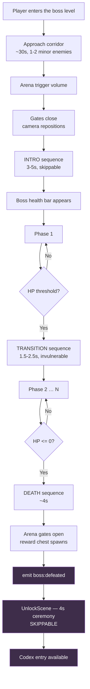
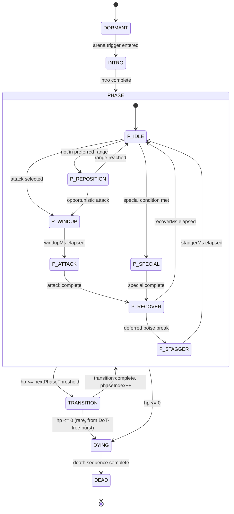
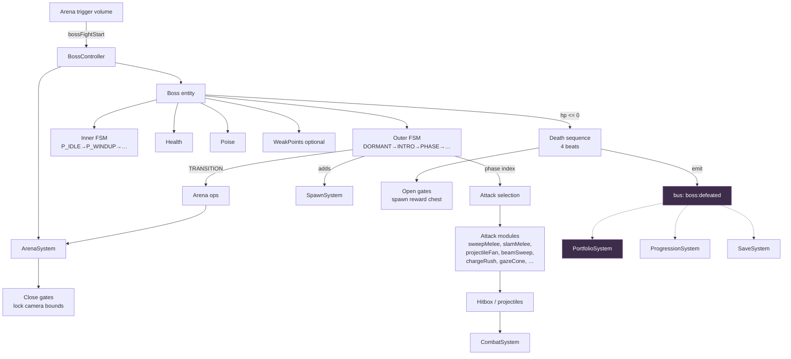

# 09 — Boss System

**Project:** DevQuest (Working Title)
**Document Owner:** Lead Designer
**Status:** ✅ Stable
**Version:** 1.0.0
**Last Updated:** 2026-08-07

---

## 1. Purpose

This document specifies the boss framework and the five boss encounters. A boss in DevQuest is not a large enemy — it is an **authored event** with an introduction, a purpose-built arena, multiple mechanically distinct phases, a death sequence, and a portfolio unlock.

The framework extends the enemy system rather than replacing it. A `Boss` uses the same `Health`, `Poise`, `Hitbox`, and `Hurtbox` components and the same combat resolution path. What it adds is a **nested state machine** — phases on the outside, attack patterns on the inside — and an arena lifecycle that the level system does not otherwise need.

Bosses are also where the portfolio layer attaches. This document specifies that attachment point precisely, because it is the place the Deletion Test (`01-Vision.md` §4.4) is most likely to fail. The rule is stated up front: **the boss encounter is designed first and completely; the unlock is appended to its death sequence and shapes nothing about the fight.**

---

## 2. Goals

| # | Goal | Success Signal |
|---|------|----------------|
| G1 | One `Boss` class serving all five encounters | Zero boss subclasses |
| G2 | Phases and attacks fully data-driven | A new phase is a JSON block, not a code change |
| G3 | Every boss teaches its own pattern without text | A playtester can describe the boss's tells after two attempts |
| G4 | Bosses feel like events, not enemies with more HP | Intro, arena, phase transitions, and death are all authored |
| G5 | Every boss beatable by every hero | Verified per hero at every Assist level |
| G6 | The portfolio unlock is fully detachable | Deleting the unlock hook leaves the fight intact |
| G7 | Boss fights hold 60 fps with full VFX | Measured per boss on minimum hardware |

---

## 3. Design Principles

### P1 — A Boss Is a Conversation
Attack, response, punish, repeat. Every boss attack has a correct answer, and the fight is the player learning the vocabulary. A boss with an attack that has no answer is broken, not hard.

### P2 — Phases Change the Question, Not the Volume
Phase 2 is not phase 1 with more damage. It introduces a new attack, removes a safe zone, or changes the arena. If a phase transition only alters numbers, it is not a phase — it is a difficulty curve, and it should be deleted.

### P3 — The Arena Is Part of the Boss
Every boss arena is designed with the boss. Platform placement, hazards, and boundaries are attack-answer infrastructure. A boss dropped into a generic room is half a boss.

### P4 — Telegraph Longer Than a Normal Enemy
Boss attacks hit harder, so they telegraph longer. Minimum 400 ms for any boss attack; 800 ms+ for anything that can kill a full-health Ninja.

### P5 — Never Stagger-Lock a Boss
Breaking a boss's poise during its attack defers the stagger until the attack completes (`07-Combat.md` §8.4). A boss the player can lock out of its own patterns is not a fight.

### P6 — Death Is a Sequence, Not an Event
The boss does not blink out. There is an authored death: stagger, collapse, a held beat, explosion, then the reward. This is the emotional payoff for a five-minute fight and it is worth the two seconds.

### P7 — The Portfolio Unlock Is Appended, Never Integrated
The unlock fires from `boss:defeated`. Nothing in the fight references it.

---

## 4. Overview

### 4.1 The Five Bosses

| # | Boss | World | Phases | HP | Target Fight Length | Portfolio Unlock |
|---|---|---|---|---|---|---|
| 1 | **Skeleton Warlord** | Verdant Ascent | 2 | 420 | 90–150 s | **About Me** |
| 2 | **Alpha Werewolf** | Autumn Reach | 3 | 560 | 120–180 s | **Projects** |
| 3 | **Oni Lord** | Hollow Barrow | 3 | 680 | 150–210 s | **Experience** |
| 4 | **Golem Sovereign** | Crystal Deep | 3 | 900 | 180–240 s | **Skills** |
| 5 | **Gorgon** | Gorgon's Spire | 4 | 1100 | 210–300 s | **Contact** |

**Target fight length** is measured for a competent player using the Samurai at default Assist settings. The range accounts for execution quality; a first-time player will exceed the upper bound, which is expected and accounted for by the boss-skip valve (§11.3).

### 4.2 The Boss Encounter Lifecycle



**Everything in purple is the portfolio layer.** Delete those three nodes and the flow still terminates correctly at "arena gates open, reward chest spawns." That is the Deletion Test satisfied structurally.

### 4.3 What Makes a Boss Different From an Elite Enemy

| Property | Elite Enemy | Boss |
|---|---|---|
| HP | 70–340 | 420–1100 |
| Phases | 1 | 2–4 |
| Arena | Wherever the designer placed it | Purpose-built, gated |
| Intro | None | Authored, 3–5 s |
| Health bar | None | Named, segmented by phase |
| Death | Explosion, pool return | Authored 4 s sequence |
| Culling | Yes | **Never** |
| Off-screen attacks | N/A | Permitted (tail sweeps, projectiles) |
| Camera | Standard follow | Custom bounds, occasional forced framing |
| Stagger | Standard | Deferred until the attack completes |
| Checkpoint | Standard | A dedicated checkpoint immediately before the arena |

---

## 5. Technical Design — The Framework

### 5.1 The Nested State Machine

A boss runs **two** state machines. The outer one owns phases; the inner one owns the current phase's attack pattern.



```ts
// src/entities/boss/BossPhaseMachine.ts
// NORMATIVE

export type BossOuterState = 'DORMANT' | 'INTRO' | 'PHASE' | 'TRANSITION' | 'DYING' | 'DEAD';
export type BossInnerState =
  | 'P_IDLE' | 'P_REPOSITION' | 'P_WINDUP' | 'P_ATTACK'
  | 'P_RECOVER' | 'P_STAGGER' | 'P_SPECIAL';

export class BossPhaseMachine {
  private outer: StateMachine<Boss, BossOuterState>;
  private inner: StateMachine<Boss, BossInnerState>;
  private phaseIndex = 0;

  get phase(): BossPhase { return this.def.phases[this.phaseIndex]!; }

  update(ctx: StateContext): void {
    this.outer.update(ctx);
    // The inner machine runs ONLY while the outer machine is in PHASE.
    if (this.outer.id === 'PHASE') this.inner.update(ctx);
  }

  advancePhase(ctx: StateContext): void {
    this.phaseIndex++;
    this.inner.force('P_IDLE', ctx);
    this.bus.emit('boss:phaseChanged', {
      bossId: this.def.id, from: this.phaseIndex - 1, to: this.phaseIndex,
    });
  }
}
```

**Why nested rather than one flat machine:** a flat machine would need `P1_WINDUP`, `P2_WINDUP`, `P3_WINDUP` as separate states, and every transition would need to know the phase. Nesting means the attack loop is written once and the phase supplies the attack list. Adding a fourth phase to a boss adds zero states.

### 5.2 Attack Selection

Each phase declares a weighted attack pool. Selection happens on entering `P_IDLE`.

```ts
selectAttack(ctx: BossContext): BossAttack | null {
  const dist = Math.abs(ctx.player.x - this.x);
  const now = ctx.time;

  const eligible = this.phase.attacks.filter(a =>
    dist >= a.minRange &&
    dist <= a.maxRange &&
    now >= (this.cooldowns[a.id] ?? 0) &&
    (a.requiresGrounded ? this.onGround : true) &&
    a.id !== this.lastAttackId          // never repeat back to back
  );

  if (eligible.length === 0) return null;   // → P_REPOSITION

  const total = eligible.reduce((s, a) => s + a.weight, 0);
  let roll = ctx.rng.float() * total;
  for (const a of eligible) {
    roll -= a.weight;
    if (roll <= 0) return a;
  }
  return eligible.at(-1)!;
}
```

**The `lastAttackId` exclusion is essential.** Without it, weighted random selection produces runs of the same attack, which feels either unfair (three heavy slams in a row) or boring (three light pokes). Forbidding immediate repeats costs nothing and removes the worst outcomes of randomness.

**Randomness is bounded, not eliminated.** Cooldowns, ranges, and windups are fixed; only the choice among currently-valid attacks is random. A player can always predict *which set* of attacks is possible, which is what P1 requires.

### 5.3 Phase Transitions

| Property | Specification |
|---|---|
| Trigger | `hp <= phase.nextThreshold` (an absolute HP value, not a percentage) |
| Timing | Checked in `P_RECOVER` only — **never mid-attack** |
| Invulnerability | Full, for the entire transition |
| Duration | 1500–2500 ms per boss |
| Camera | 0.60 trauma at the start, then a 400 ms ease to a framing shot |
| Hit stop | 200 ms on the triggering hit |
| Player state | Free to move. **Input is never taken away** |
| Arena change | Optional — the phase may spawn platforms, activate hazards, or open sections |
| Health bar | The crossed phase divider flashes and the segment empties |

**Checking the threshold only in `P_RECOVER`** means a boss never transitions out of an attack the player is dodging. This prevents the confusing case where a boss becomes invulnerable mid-swing and the swing still connects.

**The player keeps control during transitions.** Locking the player in place for two seconds while a boss roars is the single most common way to make a transition feel like a punishment rather than a payoff. The player can move, jump, dash, and heal — they simply cannot damage the boss.

### 5.4 The Death Sequence

Four beats, ~4 seconds total. Every boss uses this structure with per-boss art.

| Beat | Duration | Content |
|---|---|---|
| **1 — The Break** | 600 ms | Hit stop 400 ms. Boss enters `death_stagger`. Time scale drops to 0.35 for 400 ms, then eases back over 200 ms. Camera trauma 0.60 |
| **2 — The Collapse** | 1400 ms | `death_collapse` animation. 6 small explosions on the body at 200 ms intervals. Camera slow-pushes 8 px toward the boss |
| **3 — The Beat** | 500 ms | **Silence and stillness.** No VFX, no shake, boss on its final frame. This beat is what makes the death land |
| **4 — The Burst** | 1500 ms | `explosion_large`. Full-screen white flash at 40% alpha over 200 ms. 40 coins scatter. Camera trauma 0.45. Gates open. Reward chest rises from the floor |

**Beat 3 is the one people cut and should not.** A 500 ms hold on stillness before the final explosion converts a busy VFX sequence into a moment. It costs nothing and it is the difference between "the boss died" and "I killed the boss."

At the end of beat 4, `boss:defeated` is emitted. Everything after that is the portfolio layer.

### 5.5 The Arena

Each boss arena is a distinct Tiled level (`w{N}-4.tmj`) with a mandatory structure:

```
┌─────────────────────────────────────────────────────────────┐
│  APPROACH CORRIDOR (~600px)                                  │
│  · Checkpoint at the entrance                                │
│  · 1–2 minor enemies (difficulty weight ≤ 4 total)           │
│  · A visual build-up: banners, damage, warning props         │
├─────────────────────────────────────────────────────────────┤
│  ARENA TRIGGER (a 32px-wide volume)                          │
│  · Fires bossFightStart                                      │
│  · Gates close behind (a solid tile layer becomes active)    │
├─────────────────────────────────────────────────────────────┤
│  ARENA (480–800px wide, 180–280px tall)                      │
│  · Flat central ground                                       │
│  · 2–4 platforms at heights the boss's attacks account for   │
│  · No pits (except Gorgon's Spire, deliberately)             │
│  · Camera bounds locked to the arena                         │
│  · Per-phase spawn markers for hazards/adds                  │
├─────────────────────────────────────────────────────────────┤
│  EXIT (opens on boss death)                                  │
│  · Reward chest spawn marker                                 │
│  · A checkpoint immediately past the exit                    │
└─────────────────────────────────────────────────────────────┘
```

**Arena constraints:**

| Rule | Reason |
|---|---|
| No instant-death pits (Gorgon excepted) | Dying to geometry in a boss fight is unsatisfying |
| Arena width ≥ 480 px (1.5 screens) | Room to retreat and reset |
| At least one platform reachable by the Knight's 29.4 px jump | Vertical options for every hero, per `06-Characters.md` P3 |
| The boss must be visible from anywhere in the arena | No off-screen ambushes |
| Camera bounds locked | The player always sees the whole fight space |

---

## 6. Shared Boss Rules

### 6.1 Poise and Stagger

| Rule | Specification |
|---|---|
| Poise pool | 150–260 by boss |
| Regen delay | 3000 ms |
| Break during `P_WINDUP` / `P_ATTACK` | Stagger is **deferred** — flagged, then applied on entering `P_RECOVER` |
| Break during `P_IDLE` / `P_REPOSITION` / `P_RECOVER` | Immediate full stagger |
| Stagger duration | 500–900 ms |
| Damage during stagger | Normal — no bonus multiplier, but a guaranteed uninterrupted window |
| Visual | The poise-break particle ring (12 white) + the boss health bar flashes white |

**Deferred stagger is P5 in code.** The flag lives on the boss, not in the FSM:

```ts
// In Poise damage handling for a boss:
const broke = this.poise.damage(res.poiseDamage);
if (!broke) return;
if (this.inner.id === 'P_WINDUP' || this.inner.id === 'P_ATTACK') {
  this.staggerPending = true;                 // deferred
} else {
  this.inner.force('P_STAGGER', ctx);         // immediate
}

// In P_RECOVER.enter():
if (owner.staggerPending) { owner.staggerPending = false; return 'P_STAGGER'; }
```

### 6.2 Unblockable Attacks

Every boss has at least one unblockable attack per phase. Rationale: without them, the Knight's guard trivialises boss fights, and the Knight is the beginner hero — the one most likely to hold guard indefinitely.

| Marker | Specification |
|---|---|
| Data | `"unblockable": true` on the attack |
| Visual | An S0 (`#c42b3a`) full-sprite flash on windup frame 2, held for 100 ms |
| Additional | A 1 px S0 outline on the boss for the whole windup |
| Against Guard | Full damage, guard is broken, 500 ms `GUARD_BREAK` |
| Against Wizard Barrier | Full damage, barrier is destroyed |
| Against dash i-frames | **Avoidable.** I-frames still work |

**Unblockable means "you must move," not "you must lose HP."** Every unblockable attack is dodgeable by every hero.

### 6.3 Contact Damage

| Boss | Contact Damage | Notes |
|---|---|---|
| Skeleton Warlord | 12 | |
| Alpha Werewolf | 16 | |
| Oni Lord | 16 | |
| Golem Sovereign | 20 | |
| Gorgon | 18 | Snake body only; the head is safe to stand near |

Contact damage has a 900 ms per-victim cooldown so brushing past a boss does not chain-damage.

### 6.4 Boss Health Bar

| Element | Specification |
|---|---|
| Position | Top of screen, `y = 4`, 200 px wide, 12 px tall, centred |
| Frame | 1 px N0 outline, N1 fill |
| Fill | S0 red, drains right to left |
| Phase dividers | 1 px N7 vertical marks at each threshold |
| Recent damage | A W4 orange "chip" bar that drains to the true value over 400 ms |
| Name plate | `devquest-8px`, N7, centred above the bar |
| Appears | On intro complete, fading in over 400 ms |
| Disappears | On death beat 4, fading out over 600 ms |

**The chip bar is the highest-value detail in the whole HUD.** It makes a big hit visibly *big* — a 78-damage Samurai combo produces a visible orange chunk that then drains. Without it, a boss with 900 HP feels like nothing is happening.

### 6.5 Adds (Summoned Enemies)

Three bosses summon. Shared rules:

| Rule | Specification |
|---|---|
| Maximum alive | 4 (never more, regardless of phase) |
| Tier | Always `basic`, never veteran or elite |
| On boss death | All adds die immediately with the standard death sequence |
| Drops | Adds drop coins at 40% of normal (they are pressure, not economy) |
| Culling | Never, inside the arena |
| Pool | Pre-allocated at arena load, sized to `maxAlive` |

### 6.6 Difficulty Scaling

Bosses respect Assist Options exactly like normal combat (`13-UI-UX.md` §11) — damage taken is scaled, nothing else changes. **Boss HP, attack patterns, telegraph durations, and phase thresholds are never modified by Assist.** The fight stays the same fight; the player just survives more of it.

---

## 7. The Five Bosses

---

## 7.1 SKELETON WARLORD — World 1

> *The first boss. It teaches what a boss is.*

**Asset:** CraftPix Skeleton pack, elite-scaled with a custom crown/cape accessory (§`05-Asset-Pipeline.md` §9.4)
**Arena:** `w1-4` — a ruined stone courtyard, 560 × 200 px, three platforms
**Unlocks:** **About Me**

### 7.1.1 Design Intent

The Skeleton Warlord's job is to teach the *grammar* of boss fights: watch the tell, dodge, punish the recovery, repeat. It is deliberately the least mechanically complex boss in the game. Everything it does, the player has already seen a Skeleton do — just bigger, slower, and with a phase change.

**Design question:** *Have you learned to read a telegraph?*

### 7.1.2 Stats

| Property | Value |
|---|---|
| HP | 420 |
| Phase 2 threshold | 210 HP (50%) |
| Poise | 150 |
| Stagger | 700 ms |
| Armour | 0.10 |
| Knockback resist | 0.80 |
| Contact damage | 12 |
| Sprite | 52 × 36 px |

### 7.1.3 Phase 1 — "The Warlord" (420 → 210 HP)

| Attack | Windup | Active | Recover | Damage | Range | Weight | Unblockable |
|---|---|---|---|---|---|---|---|
| **Great Cleave** | 700 ms | 200 ms | 800 ms | 26 | 44 px, forward | 40 | No |
| **Ground Thrust** | 500 ms | 150 ms | 600 ms | 20 | 56 px, low — **jumpable** | 30 | No |
| **Overhead Crush** | 900 ms | 250 ms | 1000 ms | 38 | 38 px, +14 vertical | 20 | **Yes** |
| **Bone Volley** | 600 ms | — | 700 ms | 14 ×3 | 3 projectiles, 200 px, spread 20° | 10 | No |

**Movement:** walks at 44 px/s toward the player. Never runs. Never jumps.

**The teaching structure:** Great Cleave is dodged by backing away. Ground Thrust is dodged by jumping. Overhead Crush is dodged by moving sideways (and cannot be guarded). Bone Volley is dodged by moving or destroyed by attacking the projectiles. Four attacks, four different answers, each clearly telegraphed.

### 7.1.4 Transition (2000 ms)

The Warlord slams its sword into the ground. Four `skeleton_basic` adds rise from the floor at fixed marker positions. The arena's three platforms gain a green-flame brazier at each end (decorative, no gameplay effect — pure escalation signalling).

### 7.1.5 Phase 2 — "The Risen Host" (210 → 0 HP)

| Attack | Windup | Active | Recover | Damage | Range | Weight | Unblockable |
|---|---|---|---|---|---|---|---|
| **Great Cleave** | 600 ms | 200 ms | 700 ms | 30 | 44 px | 30 | No |
| **Ground Thrust** | 450 ms | 150 ms | 550 ms | 24 | 56 px | 25 | No |
| **Overhead Crush** | 800 ms | 250 ms | 900 ms | 42 | 38 px, +14 | 20 | **Yes** |
| **Bone Volley** | 500 ms | — | 600 ms | 16 ×5 | 5 projectiles, 30° spread | 15 | No |
| **Summon** | 900 ms | — | 900 ms | — | — | 10 | No |

**Changes from phase 1:**
- Adds are present (max 4 alive, re-summoned when fewer than 2 remain).
- All windups shortened by ~12%.
- Bone Volley fires 5 projectiles instead of 3.
- Movement speed 44 → 52 px/s.

**P2 compliance check:** the phase introduces *adds* — a genuinely new problem (crowd management while dodging boss attacks), not just larger numbers. The shortened windups are secondary.

### 7.1.6 Counterplay by Hero

| Hero | Approach |
|---|---|
| **Knight** | Guard the Cleave and Thrust, move for the Crush. The most forgiving matchup — this is the beginner boss for the beginner hero |
| **Samurai** | Charged Iai through the Bone Volley (i-frames), full combo in every 800 ms recovery |
| **Ninja** | Dash through everything. Phase 2 adds are the real threat at 70 HP |
| **Wizard** | Out-range entirely in phase 1. Nova is the answer to phase 2 adds |

---

## 7.2 ALPHA WEREWOLF — World 2

> *Speed. The fight is about not being where it is going.*

**Asset:** CraftPix Werewolf pack, elite-scaled with a scarred/white-fur recolour
**Arena:** `w2-4` — a windswept clifftop, 640 × 220 px, two high platforms, **an active wind zone**
**Unlocks:** **Projects**

### 7.2.1 Design Intent

World 2 teaches wind and trajectory. The Alpha Werewolf is that lesson under pressure: an aggressive, fast boss in an arena where your jumps do not go where you expect. It is the first boss that punishes standing still.

**Design question:** *Can you keep moving under pressure while the arena fights you?*

### 7.2.2 Stats

| Property | Value |
|---|---|
| HP | 560 |
| Phase 2 threshold | 373 HP (67%) |
| Phase 3 threshold | 168 HP (30%) |
| Poise | 170 |
| Stagger | 600 ms |
| Armour | 0.10 |
| Knockback resist | 0.70 |
| Contact damage | 16 |
| Sprite | 56 × 52 px |

### 7.2.3 The Arena Wind

The arena has a wind zone covering the full play space, alternating direction every 4000 ms with a 600 ms slack period between reversals.

| Property | Value |
|---|---|
| Force | 120 px/s² |
| Period | 4000 ms per direction |
| Slack | 600 ms of zero force at each reversal |
| Telegraph | Foreground leaf particles change direction 500 ms before the force does |
| Affects boss | **No.** The Alpha is grounded and heavy |

**The wind not affecting the boss is deliberate asymmetry.** It is the arena's contribution to the fight, and making it symmetric would neutralise it. The 500 ms particle telegraph means the player is never surprised — they are just constantly compensating.

### 7.2.4 Phase 1 — "The Hunt" (560 → 373 HP)

| Attack | Windup | Active | Recover | Damage | Range | Weight | Unblockable |
|---|---|---|---|---|---|---|---|
| **Claw Combo** | 400 ms | 300 ms (3 hits) | 600 ms | 16 ×3 | 30 px | 35 | No |
| **Pounce** | 500 ms | 600 ms travel | 800 ms | 26 | up to 180 px | 30 | No |
| **Howl** | 800 ms | 400 ms | 700 ms | 0 | Arena-wide | 15 | No |
| **Rake** | 450 ms | 200 ms | 500 ms | 22 | 40 px, low | 20 | **Yes** |

**Howl** deals no damage. It applies a 3000 ms 15% speed boost to the Alpha and spawns two `werewolf_basic` adds. It is the "get in and interrupt this" attack — breaking the Alpha's poise during the 800 ms howl windup cancels it entirely, which is the fight's first real skill expression.

### 7.2.5 Phase 2 — "The Frenzy" (373 → 168 HP)

Transition (1800 ms): the Alpha leaps to a high platform and howls. The wind period drops from 4000 ms to 2800 ms.

| Attack | Windup | Active | Recover | Damage | Range | Weight | Unblockable |
|---|---|---|---|---|---|---|---|
| **Claw Combo** | 350 ms | 300 ms | 500 ms | 18 ×3 | 30 px | 30 | No |
| **Pounce** | 400 ms | 600 ms | 700 ms | 28 | 180 px | 25 | No |
| **Wall Pounce** | 550 ms | 900 ms | 900 ms | 32 | Ricochets off two walls | 20 | **Yes** |
| **Rake** | 400 ms | 200 ms | 450 ms | 24 | 40 px | 15 | **Yes** |
| **Howl** | 700 ms | 400 ms | 600 ms | 0 | Arena-wide | 10 | No |

**Wall Pounce** is the new mechanic: the Alpha leaps at a wall, bounces off it toward the player's position at the time of the bounce, then bounces once more. Three trajectories to read, telegraphed by a distinct crouch-and-turn-toward-wall pose.

### 7.2.6 Phase 3 — "Cornered" (168 → 0 HP)

Transition (2200 ms): the Alpha's fur turns white, it drops to all fours permanently, and the arena's two platforms **crumble away** — removing the player's high ground.

| Attack | Windup | Active | Recover | Damage | Range | Weight | Unblockable |
|---|---|---|---|---|---|---|---|
| **Frenzy Rush** | 500 ms | up to 1400 ms | 1100 ms | 30 | Full arena, wall-to-wall | 40 | **Yes** |
| **Claw Combo** | 300 ms | 300 ms | 450 ms | 20 ×3 | 30 px | 30 | No |
| **Pounce** | 350 ms | 600 ms | 600 ms | 30 | 180 px | 30 | No |

**Frenzy Rush** is the phase's identity: an unstoppable wall-to-wall charge at 260 px/s. It is jumpable (the Alpha stays low) and it slams into the far wall for a **1100 ms stun** — the largest damage window in the fight.

**P2 compliance:** phase 2 adds a new attack type (ricochet trajectory reading). Phase 3 removes the arena's platforms and adds a full-arena attack. Both change the question, not the volume.

### 7.2.7 Counterplay by Hero

| Hero | Approach |
|---|---|
| **Knight** | Hardest matchup. 78 px/s cannot outrun a Pounce. Must guard the Claw Combo and parry-punish. Frenzy Rush must be jumped |
| **Samurai** | Iai through the Pounce. The 1100 ms Frenzy Rush stun fits a full combo plus two extra hits |
| **Ninja** | Best matchup. Dash i-frames trivialise Frenzy Rush; double jump beats the wind |
| **Wizard** | Barrier the Claw Combo; Nova the adds. Phase 3 is dangerous — 65 HP versus a 30-damage rush |

---

## 7.3 ONI LORD — World 3

> *You cannot fight what you cannot see.*

**Asset:** CraftPix Yokai pack, boss-scaled with a horned mask and oversized kanabō
**Arena:** `w3-4` — a sunken shrine, 600 × 240 px, four braziers, ambient darkness
**Unlocks:** **Experience**

### 7.3.1 Design Intent

World 3's mechanic is light and darkness. The Oni Lord makes that a fight: the arena is dark, the boss can extinguish the braziers, and it teleports. The player must manage information, not just position.

**Design question:** *Can you fight with incomplete information?*

### 7.3.2 Stats

| Property | Value |
|---|---|
| HP | 680 |
| Phase 2 threshold | 476 HP (70%) |
| Phase 3 threshold | 204 HP (30%) |
| Poise | 190 |
| Stagger | 650 ms |
| Armour | 0.15 |
| Knockback resist | 0.85 |
| Contact damage | 16 |
| Sprite | 58 × 42 px |

### 7.3.3 The Brazier Mechanic

Four braziers, one at each arena corner region. Each lit brazier contributes a 140 px radius of light.

| State | Effect |
|---|---|
| All 4 lit | Arena fully visible. Ambient tint 0.10 |
| 3 lit | One corner dark. Ambient 0.18 |
| 2 lit | Half the arena dark. Ambient 0.26 |
| 1 lit | Only a pool of light remains. Ambient 0.34 |
| 0 lit | **Only the player's own 64 px lantern radius.** Ambient 0.45 |

**Relighting:** the player relights a brazier by attacking it. It takes one hit and 400 ms.

**Extinguishing:** the Oni Lord's `Douse` attack extinguishes the nearest lit brazier.

**The boss is always visible.** Even at 0 braziers, the Oni Lord's sprite is rendered with a self-illuminating M-ramp glow at 60% alpha. **What darkness hides is its adds and its projectiles, never the boss itself.** This is `ADR-018` constraint (b) applied at boss scale — an invisible boss would be unfair, an invisible *threat pattern* is a challenge.

### 7.3.4 Phase 1 — "The Shrine Keeper" (680 → 476 HP)

| Attack | Windup | Active | Recover | Damage | Range | Weight | Unblockable |
|---|---|---|---|---|---|---|---|
| **Kanabō Swing** | 600 ms | 250 ms | 750 ms | 28 | 48 px | 35 | No |
| **Spirit Volley** | 500 ms | — | 600 ms | 16 ×4 | Homing, 220 px, slow (140 px/s) | 25 | No |
| **Blink Strike** | 350 ms (post-blink) | 150 ms | 650 ms | 24 | 30 px | 25 | No |
| **Douse** | 800 ms | — | 900 ms | 0 | Nearest lit brazier | 15 | No |

**Spirit Volley projectiles home weakly** — 40°/s turn rate. They are dodgeable by moving perpendicular and are destructible (8 HP each). At 140 px/s they are slow enough to outrun, which is the correct answer when the arena is dark.

### 7.3.5 Phase 2 — "The Veil" (476 → 204 HP)

Transition (2000 ms): the Oni Lord extinguishes **two** braziers at once and splits into three shadow copies for the phase.

| Attack | Windup | Active | Recover | Damage | Range | Weight | Unblockable |
|---|---|---|---|---|---|---|---|
| **Kanabō Swing** | 500 ms | 250 ms | 650 ms | 32 | 48 px | 30 | No |
| **Triple Blink Strike** | 300 ms | 150 ms ×3 | 700 ms | 26 each | 30 px | 25 | No |
| **Spirit Volley** | 450 ms | — | 550 ms | 18 ×6 | Homing | 20 | No |
| **Shadow Slam** | 900 ms | 300 ms | 1000 ms | 40 | 80 px radius | 15 | **Yes** |
| **Douse** | 700 ms | — | 800 ms | 0 | Nearest lit | 10 | No |

**The Shadow Copies:** two illusory duplicates mirror the Oni Lord's movement but deal no damage and take no damage (hits pass through with a `blocked` grey number). The real one is identifiable by its **eye glow** — the copies' eyes are dark. In a dark arena this is a genuine perception challenge, and it is fair because the tell is always present and always visible.

### 7.3.6 Phase 3 — "Total Dark" (204 → 0 HP)

Transition (2400 ms): all four braziers extinguish and **cannot be relit**. The player has only their 64 px lantern radius.

| Attack | Windup | Active | Recover | Damage | Range | Weight | Unblockable |
|---|---|---|---|---|---|---|---|
| **Kanabō Swing** | 450 ms | 250 ms | 600 ms | 36 | 48 px | 35 | No |
| **Blink Barrage** | 400 ms | 150 ms ×5 | 900 ms | 22 each | 30 px | 30 | No |
| **Shadow Slam** | 800 ms | 300 ms | 900 ms | 44 | 96 px radius | 20 | **Yes** |
| **Spirit Storm** | 1000 ms | 2000 ms | 1200 ms | 14/hit | 12 projectiles over 2 s, arena-wide | 15 | No |

**The compensating mercy:** in phase 3 the Oni Lord's self-illumination rises to 100% alpha and it leaves a 900 ms M-ramp light trail behind every blink. The arena is dark but the boss is a beacon. The fight becomes about tracking one bright thing in the black, which is dramatic rather than frustrating.

### 7.3.7 Counterplay by Hero

| Hero | Approach |
|---|---|
| **Knight** | Guard is excellent against Blink Strikes. Must move for Shadow Slam. High HP survives phase 3 mistakes |
| **Samurai** | Hit-3's 180° arc is the answer to Triple Blink Strike |
| **Ninja** | Fastest brazier maintenance in phases 1–2. Very fragile in phase 3 |
| **Wizard** | Nova clears Spirit Volleys. Barrier is the phase-3 survival tool |

---

## 7.4 GOLEM SOVEREIGN — World 4

> *An immovable object. Find the seam.*

**Asset:** CraftPix Golem pack, boss-scaled with embedded crystal cores
**Arena:** `w4-4` — a crystal cavern, 720 × 260 px, low-gravity zones, breakable crystal pillars
**Unlocks:** **Skills**

### 7.4.1 Design Intent

World 4 teaches spatial reasoning: light beams, low gravity, solving rooms. The Golem Sovereign is a puzzle boss. It has **crystal cores** that must be broken in sequence, and its body is armoured until they are. It is the only boss in the game with a hard requirement beyond "reduce HP."

**Design question:** *Can you solve the boss instead of out-fighting it?*

### 7.4.2 Stats

| Property | Value |
|---|---|
| HP | 900 |
| Phase 2 threshold | 600 HP (67%) |
| Phase 3 threshold | 270 HP (30%) |
| Poise | 260 (highest) |
| Stagger | 900 ms (longest) |
| Armour | 0.40 **while cores are intact**, 0.10 when exposed |
| Knockback resist | 0.95 |
| Contact damage | 20 |
| Sprite | 80 × 68 px (largest) |

### 7.4.3 The Core Mechanic

Three crystal cores are embedded in the Sovereign: **left shoulder, chest, right shoulder.**

| Property | Value |
|---|---|
| Core HP | 60 each |
| Core hurtbox | 14 × 14 px, positioned on the sprite, moves with the animation |
| While all 3 intact | Body armour 0.40. Body hits deal 60% damage |
| Per core broken | Body armour −0.10 |
| All 3 broken | Body armour 0.10, and the Sovereign enters a **7000 ms `EXPOSED` state** with no attacks and full vulnerability |
| Core regeneration | 12000 ms after all three break — they reform and the cycle repeats |
| Core visibility | Emissive S4 cyan, pulsing. Always visible even in the cavern's 0.40 ambient |

**Reaching the cores:** the shoulder cores are at 52 px height — above a standing player's melee range. They require a jump attack, a Ninja rising kick, a Wizard bolt, or the arena's low-gravity zones. The chest core is reachable normally.

**This is the puzzle.** A player who only attacks the body will take roughly 2.4× longer and will likely lose. A player who reads the emissive cores solves it in three focused bursts.

### 7.4.4 Phase 1 — "The Sovereign Wakes" (900 → 600 HP)

| Attack | Windup | Active | Recover | Damage | Range | Weight | Unblockable |
|---|---|---|---|---|---|---|---|
| **Fist Smash** | 900 ms | 250 ms | 1000 ms | 34 | 48 px | 35 | No |
| **Ground Slam** | 1100 ms | 350 ms | 1200 ms | 34 / 20 wave | 56 px + shockwaves 200 px each way | 30 | No |
| **Boulder Throw** | 900 ms | — | 900 ms | 30 | 260 px arc | 20 | No |
| **Crystal Burst** | 800 ms | 400 ms | 900 ms | 26 | 6 shards radially, 180 px | 15 | **Yes** |

**Movement:** 30 px/s. The slowest boss in the game. Positioning is never the Sovereign's threat; area denial is.

### 7.4.5 Phase 2 — "Resonance" (600 → 270 HP)

Transition (2500 ms): the Sovereign slams both fists. **Four crystal pillars erupt from the floor** at fixed positions, and **two low-gravity fields** (0.45× gravity) activate over the arena's mid-height.

| Attack | Windup | Active | Recover | Damage | Range | Weight | Unblockable |
|---|---|---|---|---|---|---|---|
| **Fist Smash** | 800 ms | 250 ms | 900 ms | 38 | 48 px | 30 | No |
| **Ground Slam** | 1000 ms | 350 ms | 1100 ms | 38 / 22 | Shockwaves 240 px | 25 | No |
| **Resonance Beam** | 1200 ms | 1000 ms | 1300 ms | 8 per 100 ms | A sweeping S4 beam, 90° arc over 1 s | 20 | **Yes** |
| **Pillar Collapse** | 900 ms | 600 ms | 800 ms | 32 | Drops all standing pillars | 15 | **Yes** |
| **Crystal Burst** | 700 ms | 400 ms | 800 ms | 28 | 8 shards | 10 | **Yes** |

**The pillars are dual-purpose:** they block the Resonance Beam (line-of-sight cover) and they are destroyed by Pillar Collapse. Managing pillar cover is the phase's texture — the player wants pillars for cover, the Sovereign destroys them, and they regrow every 8000 ms.

**The low-gravity fields** let the player reach the shoulder cores easily, which is the phase's gift in exchange for its added threat.

### 7.4.6 Phase 3 — "Overload" (270 → 0 HP)

Transition (2500 ms): all three cores shatter permanently and the Sovereign's body cracks with S4 light. Armour drops to 0.05 for the rest of the fight. The low-gravity fields expand to cover the whole arena.

| Attack | Windup | Active | Recover | Damage | Range | Weight | Unblockable |
|---|---|---|---|---|---|---|---|
| **Overload Slam** | 900 ms | 400 ms | 1000 ms | 44 / 26 | Shockwaves both ways, full arena | 35 | **Yes** |
| **Resonance Sweep** | 1000 ms | 1400 ms | 1200 ms | 8/100 ms | Two beams, opposite directions | 30 | **Yes** |
| **Fist Smash** | 700 ms | 250 ms | 800 ms | 42 | 48 px | 20 | No |
| **Crystal Nova** | 1200 ms | 500 ms | 1100 ms | 34 | 16 shards, full radial, 220 px | 15 | **Yes** |

**Phase 3 has no safe ground.** Every attack is unblockable or arena-covering. The answer is the low gravity — the player is expected to spend most of phase 3 airborne, which is the synthesis of everything World 4 taught.

### 7.4.7 Counterplay by Hero

| Hero | Approach |
|---|---|
| **Knight** | Guard is nearly useless (most attacks unblockable). 140 HP is the compensation. Must learn the core positions |
| **Samurai** | Charged Iai reaches shoulder cores from below with i-frames. Strongest core-breaker |
| **Ninja** | Rising kick + air attack chains on the shoulder cores. Fastest core clears |
| **Wizard** | Bolts hit cores from safety. Slowest but safest. The intended "if you are struggling" hero for this fight |

---

## 7.5 GORGON — World 5 (Final Boss)

> *Everything you have learned, at once.*

**Asset:** CraftPix Gorgon pack, boss-scaled, with a phase-2 recolour variant (`05-Asset-Pipeline.md` §6.2)
**Arena:** `w5-4` — the Spire's summit, 800 × 280 px, storm sky, collapsing floor sections, **two pits**
**Unlocks:** **Contact** (and triggers the ending)

### 7.5.1 Design Intent

The final boss is a synthesis exam. It uses a version of every earlier mechanic: adds (Warlord), a rush (Alpha), teleport-adjacent movement (Oni), area denial (Sovereign), plus its own petrify gaze and the arena's timed gates.

It is also the only arena with pits, deliberately breaking the §5.5 rule. By World 5 the player has completed 19 levels of platforming; the final fight is allowed to demand it.

**Design question:** *Can you do all of it at once?*

### 7.5.2 Stats

| Property | Value |
|---|---|
| HP | 1100 |
| Phase 2 threshold | 825 HP (75%) |
| Phase 3 threshold | 495 HP (45%) |
| Phase 4 threshold | 165 HP (15%) |
| Poise | 220 |
| Stagger | 700 ms |
| Armour | 0.20 |
| Knockback resist | 0.90 |
| Contact damage | 18 (body only; the head region is safe) |
| Sprite | 64 × 56 px |

### 7.5.3 The Petrify Gaze

The Gorgon's signature, escalating across phases.

| Property | Phase 1 | Phase 2 | Phase 3 | Phase 4 |
|---|---|---|---|---|
| Cone angle | 70° | 90° | 110° | 140° |
| Cone range | 140 px | 170 px | 200 px | 240 px |
| Charge | 1400 ms | 1200 ms | 1000 ms | 900 ms |
| Active | 900 ms | 1100 ms | 1300 ms | 1500 ms |
| Slow factor | 0.40× | 0.35× | 0.30× | 0.25× |
| Cooldown | 9000 ms | 8000 ms | 7000 ms | 6000 ms |

**Rules (as in `08-Enemy-System.md` §6.7.4):** petrify is not damage, is not blocked by guard, and is **not avoided by dash i-frames**. The answer is always position — get behind the Gorgon or outside the cone. The cone is drawn on the ground in S3 gold for the full charge duration.

**Petrify + the arena's pits is the fight's cruellest and best interaction.** Being slowed to 0.25× near a pit edge in phase 4 is genuinely dangerous, and it is entirely avoidable by watching the cone.

### 7.5.4 Phase 1 — "The Serpent" (1100 → 825 HP)

| Attack | Windup | Active | Recover | Damage | Range | Weight | Unblockable |
|---|---|---|---|---|---|---|---|
| **Tail Sweep** | 550 ms | 250 ms | 650 ms | 28 | 60 px, 180° both sides | 30 | No |
| **Venom Spit** | 500 ms | — | 550 ms | 22 | 3 arcing shots, 240 px, leaves 2 s pools | 25 | No |
| **Lunge Bite** | 600 ms | 300 ms | 800 ms | 34 | 90 px forward dart | 25 | **Yes** |
| **Petrify Gaze** | 1400 ms | 900 ms | 1000 ms | 0 | 70° cone, 140 px | 20 | No |

**Venom pools** deal 8 damage per 500 ms while stood in and persist 2000 ms. They are the fight's persistent area denial and they interact with petrify — slowed movement makes pools much harder to leave.

### 7.5.5 Phase 2 — "The Coil" (825 → 495 HP)

Transition (2200 ms): the Gorgon's scales shift to the phase-2 recolour. **Four floor sections begin a timed collapse cycle** — each drops for 3000 ms then regenerates, on a staggered schedule, telegraphed by 800 ms of cracking.

| Attack | Windup | Active | Recover | Damage | Range | Weight | Unblockable |
|---|---|---|---|---|---|---|---|
| **Tail Sweep** | 500 ms | 250 ms | 600 ms | 30 | 60 px | 25 | No |
| **Venom Spray** | 600 ms | 500 ms | 700 ms | 24 | 6 shots in a fan, pools | 20 | No |
| **Lunge Bite** | 550 ms | 300 ms | 750 ms | 36 | 90 px | 20 | **Yes** |
| **Petrify Gaze** | 1200 ms | 1100 ms | 900 ms | 0 | 90° cone, 170 px | 20 | No |
| **Serpent Coil** | 900 ms | 1200 ms | 1000 ms | 32 | Spins, 70 px radius, moves 120 px | 15 | **Yes** |

### 7.5.6 Phase 3 — "The Brood" (495 → 165 HP)

Transition (2400 ms): the Gorgon calls. **Two `gorgon_basic` adds** enter from the arena sides (max 2 alive, re-summoned every 12000 ms).

| Attack | Windup | Active | Recover | Damage | Range | Weight | Unblockable |
|---|---|---|---|---|---|---|---|
| **Tail Sweep** | 450 ms | 250 ms | 550 ms | 32 | 60 px | 25 | No |
| **Venom Storm** | 800 ms | 1600 ms | 900 ms | 26 | 10 shots over 1.6 s, arena-wide arcs | 20 | No |
| **Lunge Bite** | 500 ms | 300 ms | 700 ms | 38 | 90 px | 20 | **Yes** |
| **Petrify Gaze** | 1000 ms | 1300 ms | 800 ms | 0 | 110° cone, 200 px | 20 | No |
| **Serpent Coil** | 800 ms | 1200 ms | 900 ms | 34 | 70 px radius | 15 | **Yes** |

### 7.5.7 Phase 4 — "Medusa" (165 → 0 HP)

Transition (2500 ms): the Gorgon rises to full height, the storm intensifies, and **the arena's floor collapse cycle accelerates to 2000 ms**. All adds die.

| Attack | Windup | Active | Recover | Damage | Range | Weight | Unblockable |
|---|---|---|---|---|---|---|---|
| **Petrify Gaze** | 900 ms | 1500 ms | 700 ms | 0 | 140° cone, 240 px | 30 | No |
| **Lunge Bite** | 450 ms | 300 ms | 650 ms | 44 | 90 px | 25 | **Yes** |
| **Serpent Coil** | 700 ms | 1400 ms | 800 ms | 40 | 80 px radius, 180 px travel | 25 | **Yes** |
| **Venom Storm** | 700 ms | 1800 ms | 800 ms | 30 | 14 shots | 20 | No |

**Phase 4's petrify weight is the highest of any attack in the game (30).** The final phase is fundamentally about the gaze: it is nearly constant, it covers most of the arena, and being caught in it near a collapsing floor section is lethal. The fight ends as a positioning test, which is the correct final exam for a platformer.

### 7.5.8 Counterplay by Hero

| Hero | Approach |
|---|---|
| **Knight** | Guard handles Tail Sweep and Venom. Petrify + 78 px/s is brutal — must pre-position |
| **Samurai** | Iai's i-frames beat Lunge Bite and Serpent Coil. Petrify still lands (not damage) |
| **Ninja** | Best mobility for the collapsing floors. 70 HP versus 44-damage Lunge is two mistakes from death |
| **Wizard** | Out-ranges the gaze cone entirely at 240+ px. Slowest kill, safest fight |

---

## 8. Data Structures

```ts
// src/data/schemas/boss.schema.ts
// NORMATIVE

export interface BossAttack {
  readonly id: string;
  readonly displayName: string;
  readonly windupMs: number;          // >= 400 for any boss attack
  readonly activeMs: number;
  readonly recoverMs: number;
  readonly damage: number;
  readonly hitKind: HitKind;
  readonly unblockable: boolean;
  readonly minRange: number;
  readonly maxRange: number;
  readonly cooldownMs: number;
  readonly weight: number;
  readonly requiresGrounded: boolean;
  /** The attack module that drives it. Data selects behaviour, as with enemies. */
  readonly moduleId: BossAttackModuleId;
  readonly moduleConfig: Readonly<Record<string, unknown>>;
  readonly telegraph: {
    readonly animKey: string;
    readonly flashOnFrame: number;
    readonly audioId: string | null;
    readonly groundIndicator: GroundIndicatorSpec | null;   // cones, radii, beam paths
  };
}

export interface BossPhase {
  readonly index: number;
  readonly displayName: string;
  /** Absolute HP at which the NEXT phase begins. null for the final phase. */
  readonly nextThreshold: number | null;
  readonly attacks: readonly BossAttack[];
  readonly moveSpeed: number;
  readonly armour: number;
  readonly contactDamage: number;
  readonly transition: {
    readonly durationMs: number;
    readonly animKey: string;
    readonly cameraTrauma: number;
    /** Arena mutations applied on entering this phase. */
    readonly arenaOps: readonly ArenaOp[];
  } | null;                            // null for phase 1 (no transition into it)
  readonly adds: {
    readonly defId: EnemyDefId;
    readonly maxAlive: number;
    readonly initialCount: number;
    readonly resummonWhenBelow: number;
    readonly resummonCooldownMs: number;
  } | null;
}

export type ArenaOp =
  | { kind: 'spawnPlatforms'; markerGroup: string }
  | { kind: 'destroyPlatforms'; markerGroup: string }
  | { kind: 'enableHazard'; hazardId: string }
  | { kind: 'setMechanicParam'; mechanicId: MechanicId; key: string; value: number }
  | { kind: 'extinguishBraziers'; count: number }
  | { kind: 'lockBraziers' }
  | { kind: 'setCollapseCycleMs'; value: number };

export interface BossDefinition {
  readonly id: BossDefId;
  readonly displayName: string;
  readonly worldId: WorldId;
  readonly atlas: string;
  readonly animPrefix: string;

  readonly stats: {
    readonly maxHp: number;
    readonly poise: number;
    readonly poiseRegenDelayMs: number;
    readonly staggerMs: number;
    readonly knockbackResist: number;
  };
  readonly body: { readonly width: number; readonly height: number; readonly offsetX: number; readonly offsetY: number };

  readonly intro: {
    readonly durationMs: number;
    readonly animKey: string;
    readonly cameraPath: readonly CameraKeyframe[];
    readonly skippable: true;          // always true — never a false value
  };

  readonly phases: readonly BossPhase[];

  readonly death: {
    readonly breakMs: number;          // 600
    readonly collapseMs: number;       // 1400
    readonly beatMs: number;           // 500  ← the stillness
    readonly burstMs: number;          // 1500
    readonly coinDrop: number;
  };

  /** Optional sub-targets (Golem Sovereign's cores). */
  readonly weakPoints?: readonly {
    readonly id: string;
    readonly hp: number;
    readonly hurtbox: { readonly w: number; readonly h: number; readonly ox: number; readonly oy: number };
    readonly armourReductionOnBreak: number;
    readonly regenDelayMs: number;
    readonly allBrokenEffect: { readonly exposedMs: number };
  }[];

  /**
   * PORTFOLIO LAYER — the ONLY portfolio reference in the boss system.
   * Deleting this field and its one consumer removes the portfolio
   * entirely without touching the fight. See 01-Vision §4.4.
   */
  readonly unlocksSection: PortfolioSectionId;

  readonly animations: Readonly<Record<string, AnimSpec>>;
}
```

### 8.1 Example — Skeleton Warlord JSON (abridged)

```json
{
  "$schema": "../../../schemas/boss.schema.json",
  "id": "skeleton_warlord",
  "displayName": "Skeleton Warlord",
  "worldId": "w1",
  "atlas": "enemies-w1",
  "animPrefix": "warlord",

  "stats": { "maxHp": 420, "poise": 150, "poiseRegenDelayMs": 3000, "staggerMs": 700, "knockbackResist": 0.80 },
  "body": { "width": 30, "height": 48, "offsetX": 11, "offsetY": 4 },

  "intro": {
    "durationMs": 3800,
    "animKey": "intro_rise",
    "cameraPath": [
      { "atMs": 0,    "x": 380, "y": 120, "zoom": 1.0, "easing": "Sine.easeInOut" },
      { "atMs": 1600, "x": 420, "y": 100, "zoom": 1.0, "easing": "Sine.easeInOut" },
      { "atMs": 3400, "x": 300, "y": 110, "zoom": 1.0, "easing": "Quad.easeOut" }
    ],
    "skippable": true
  },

  "phases": [
    {
      "index": 0,
      "displayName": "The Warlord",
      "nextThreshold": 210,
      "moveSpeed": 44,
      "armour": 0.10,
      "contactDamage": 12,
      "transition": null,
      "adds": null,
      "attacks": [
        {
          "id": "great_cleave", "displayName": "Great Cleave",
          "windupMs": 700, "activeMs": 200, "recoverMs": 800,
          "damage": 26, "hitKind": "heavy", "unblockable": false,
          "minRange": 0, "maxRange": 52, "cooldownMs": 2400, "weight": 40,
          "requiresGrounded": true,
          "moduleId": "sweepMelee",
          "moduleConfig": { "hitbox": { "w": 44, "h": 34, "ox": 26, "oy": 0 }, "arcDegrees": 0 },
          "telegraph": { "animKey": "windup_cleave", "flashOnFrame": -1, "audioId": "warlord_cleave", "groundIndicator": null }
        },
        {
          "id": "overhead_crush", "displayName": "Overhead Crush",
          "windupMs": 900, "activeMs": 250, "recoverMs": 1000,
          "damage": 38, "hitKind": "heavy", "unblockable": true,
          "minRange": 0, "maxRange": 44, "cooldownMs": 5000, "weight": 20,
          "requiresGrounded": true,
          "moduleId": "slamMelee",
          "moduleConfig": { "hitbox": { "w": 38, "h": 48, "ox": 22, "oy": -14 }, "trauma": 0.35 },
          "telegraph": { "animKey": "windup_crush", "flashOnFrame": 2, "audioId": "warlord_crush",
                         "groundIndicator": { "kind": "rect", "w": 38, "h": 8, "colour": "S0", "alpha": 0.35 } }
        }
      ]
    },
    {
      "index": 1,
      "displayName": "The Risen Host",
      "nextThreshold": null,
      "moveSpeed": 52,
      "armour": 0.10,
      "contactDamage": 12,
      "transition": {
        "durationMs": 2000,
        "animKey": "transition_summon",
        "cameraTrauma": 0.60,
        "arenaOps": [{ "kind": "enableHazard", "hazardId": "w1_braziers" }]
      },
      "adds": {
        "defId": "skeleton_basic", "maxAlive": 4, "initialCount": 4,
        "resummonWhenBelow": 2, "resummonCooldownMs": 8000
      },
      "attacks": [ /* … */ ]
    }
  ],

  "death": { "breakMs": 600, "collapseMs": 1400, "beatMs": 500, "burstMs": 1500, "coinDrop": 120 },

  "unlocksSection": "about",

  "animations": { /* … */ }
}
```

---

## 9. Architecture



**The dotted lines are the entire portfolio coupling.** `PortfolioSystem` subscribes to `boss:defeated`, reads `def.unlocksSection`, and does its thing. The boss does not know it exists.

### 9.1 Attack Modules

Like enemy behaviours, boss attacks are data-selected modules. Twelve modules cover all five bosses.

| Module | Used By | Purpose |
|---|---|---|
| `sweepMelee` | All | A standard arcing hitbox |
| `slamMelee` | Warlord, Sovereign, Oni | Downward slam with optional shockwave |
| `thrustMelee` | Warlord, Gorgon | A long low forward hitbox |
| `projectileFan` | Warlord, Gorgon, Oni | N projectiles in a spread |
| `projectileHoming` | Oni | Weakly homing projectiles |
| `projectileArc` | Sovereign, Gorgon | Ballistic arcs with optional ground pools |
| `chargeRush` | Alpha | Straight-line rush with wall stun |
| `ricochetLeap` | Alpha | Multi-bounce leap |
| `beamSweep` | Sovereign | A rotating damage beam |
| `radialBurst` | Sovereign, Gorgon | Radial shard spray |
| `gazeCone` | Gorgon | The petrify cone |
| `blinkStrike` | Oni | Teleport then strike |

Adding a boss attack that no module expresses means writing a thirteenth module (~120 lines), never a boss subclass.

---

## 10. Implementation Notes

### 10.1 The Intro Sequence

```ts
// Intro is a camera path + an animation. The player is NOT frozen.
enterIntro(ctx: BossContext): void {
  this.bus.emit('boss:introStarted', { bossId: this.def.id });
  this.sprite.play(`${this.def.animPrefix}_${this.def.intro.animKey}`);
  this.cameraPath.run(this.def.intro.cameraPath);
  this.hurtbox.enabled = false;                    // cannot be hit during intro
  this.skipHintTimer = ctx.time + 800;             // "Press any key to skip" after 800ms
}
```

**The player can move during the intro.** They cannot damage the boss, and the boss cannot damage them, but taking control away for four seconds at the start of every retry is the fastest way to make a boss hated. Combined with skippability, a player on their eighth attempt loses zero time to the intro.

**Skip behaviour:** any input skips. Skipping jumps straight to phase 1 with the camera snapping to the fight framing. The health bar fades in over 200 ms instead of 400 ms.

**After the first defeat**, the intro auto-skips by default (a setting the player can re-enable).

### 10.2 Ground Indicators

Every attack with an area component draws a ground indicator during its windup. This is the primary readability tool for boss fights.

| Kind | Rendering |
|---|---|
| `rect` | A filled rectangle on the ground plane, S0 at 35% alpha, with a 1 px brighter border |
| `circle` | A filled circle, same treatment |
| `cone` | A wedge from the boss's origin, S3 at 30% for petrify, S0 for damage |
| `line` | A 4 px band along a beam or charge path |
| `pathPreview` | A dotted arc showing a leap or projectile trajectory |

Indicators **fill from 0% to 100% opacity over the windup duration**, which doubles as a timing cue. At 90% opacity the attack is imminent. This is more readable than a flat indicator and requires no additional art.

Indicators are drawn at `Depth.TILEMAP_FRONT - 1` so they appear on the ground but beneath entities.

### 10.3 Boss Performance

Boss fights are the game's peak load: a large animated sprite, up to 4 adds, up to 16 projectiles, ground indicators, heavy VFX, and no culling.

| Measure | Approach |
|---|---|
| No culling in the arena | Accepted cost; arenas cap total entities at 24 |
| Projectile pool | Pre-allocated at arena load, sized to the phase maximum ×1.5 |
| Ground indicators | Drawn to a single `Graphics` object, cleared and redrawn per frame. One draw call |
| Adds | Pre-allocated pool sized to `maxAlive` across all phases |
| Boss atlas | Boss frames are in the world's `enemies-wN` atlas, already resident |
| Death sequence | The 6 collapse explosions come from the VFX pool; no allocation |
| Arena tilemap | Static layer, cached |

**Measured target:** ≤ 14 ms per frame at the Gorgon phase-4 peak on minimum hardware. Verified per boss in CI (`15-Performance.md` §9).

### 10.4 Checkpoint and Retry

| Property | Specification |
|---|---|
| Checkpoint position | Immediately before the approach corridor |
| On death | Respawn at the checkpoint with full HP and full resource |
| Approach corridor enemies | Respawn |
| Retry time | ≤ 12 s from death to being back in the arena (with auto-skipped intro) |
| Boss HP on retry | Full reset |
| Death count | Tracked per boss; drives the skip valve (§11.3) |

**The 12-second retry target is a design constraint, not an aspiration.** A boss you can retry quickly is a boss you will keep fighting. `flashCut` transitions (`03-Technical-Architecture.md` §7.5) exist for exactly this.

### 10.5 Common Boss Bugs

| Bug | Symptom | Fix |
|---|---|---|
| Phase transition mid-attack | Attack connects while the boss is invulnerable | Check thresholds only in `P_RECOVER` |
| Stagger-lock | Boss never acts | Defer stagger during windup/attack (§6.1) |
| Same attack repeating | Feels random and unfair | Exclude `lastAttackId` from selection |
| Adds persist after death | Fight continues after the boss dies | Kill adds on `DYING` entry |
| Intro not skippable | Retries feel punishing | `skippable: true` always; auto-skip after first clear |
| Player frozen during intro/transition | Feels like a punishment | Never remove control |
| Health bar not showing chip damage | Big hits feel small | Implement the 400 ms chip drain |
| Ground indicator drawn above entities | Boss hidden behind its own telegraph | Depth `TILEMAP_FRONT - 1` |
| Boss culled off-screen | Boss vanishes | Bosses are never culled |
| Weak point hurtbox not following animation | Cores unhittable at some frames | Update weak-point positions in `postPhysics` from the current frame's pivot data |
| Death sequence skippable | Ruins the payoff | Death is **not** skippable; intro is |

---

## 11. Balance and Accessibility

### 11.1 Difficulty Verification

Every boss is verified against a matrix before its milestone closes:

| Axis | Values |
|---|---|
| Hero | Knight, Samurai, Ninja, Wizard |
| Assist | Off, Damage −50%, Damage −75%, Invulnerable |
| Charms | None, 3 defensive, 3 offensive |

**Requirement:** every (hero × Assist-off × no-charms) cell must be completable by a competent player. Every (hero × any-Assist) cell must be completable by a novice.

Results are recorded in `docs/audits/boss-matrix-<milestone>.md`.

### 11.2 Target Attempt Counts

| Boss | Novice (Assist off) | Competent | Expert |
|---|---|---|---|
| Skeleton Warlord | 2–4 | 1–2 | 1 |
| Alpha Werewolf | 4–7 | 2–3 | 1 |
| Oni Lord | 5–9 | 3–4 | 1–2 |
| Golem Sovereign | 6–10 | 3–5 | 2 |
| Gorgon | 8–15 | 5–8 | 2–3 |

If measured attempt counts exceed the novice upper bound in playtesting, the fix priority is: (1) lengthen telegraphs, (2) lengthen recovery windows, (3) reduce damage, (4) reduce HP. **HP reduction is last** because it shortens the fight without making it more readable.

### 11.3 The Boss Skip Valve

From `01-Vision.md` §6.1 — the primary audience must reach the portfolio content.

| Trigger | 3 deaths on the same boss |
|---|---|
| Presentation | A non-judgemental pause-menu entry appears: **"Skip this fight"** |
| Effect | The boss dies immediately via the standard death sequence. The unlock fires normally |
| Save marker | `skippedBosses: BossDefId[]` — used only to show a small "skipped" marker in the Codex, never to withhold content |
| Reversibility | The boss can be re-fought from world select at any time; clearing it removes the marker |
| Wording | Never says "too hard," never says "easy mode." It says "Skip this fight." |

**This is the single most important accessibility feature in the game** and it is non-negotiable. A recruiter who cannot beat the Alpha Werewolf must still be able to read the Projects section.

### 11.4 Assist Interaction Summary

| Assist Option | Effect on Bosses |
|---|---|
| Damage taken −25/50/75% | Applied. The only stat Assist changes |
| Invulnerability | Applied. The fight becomes a target-practice exercise but still requires killing the boss |
| Extended windows | The Knight's parry window widens; boss telegraphs are **unchanged** |
| Slow motion (0.75×) | Global time scale. Applies to the boss and the player equally |
| Skip fight | §11.3 |

**Boss telegraph durations are never extended by Assist.** Extending them would desynchronise the animation from the hitbox and require re-authoring every boss animation. Slow motion achieves the same outcome correctly.

---

## 12. Acceptance Criteria

- [ ] Exactly one `Boss` class exists; no boss subclasses.
- [ ] All five `BossDefinition` JSONs exist and validate against the schema.
- [ ] All 12 attack modules are implemented and registered.
- [ ] The nested phase/attack FSM implements every state in §5.1.
- [ ] Phase thresholds are checked only in `P_RECOVER`.
- [ ] Stagger is deferred during `P_WINDUP` and `P_ATTACK` (test: break poise mid-windup, assert the attack completes).
- [ ] Attack selection never repeats the previous attack.
- [ ] Every boss attack has `windupMs >= 400`; every attack over 30 damage has `windupMs >= 800`.
- [ ] Every phase has at least one unblockable attack, flagged and S0-flashed.
- [ ] Every area attack has a ground indicator that fills over the windup.
- [ ] All five intros are skippable and auto-skip after first clear.
- [ ] The player retains full movement control during intros and transitions.
- [ ] The death sequence implements all four beats including the 500 ms stillness.
- [ ] Adds die when the boss dies.
- [ ] Bosses are never culled.
- [ ] The boss health bar shows chip damage draining over 400 ms.
- [ ] Retry time from death to arena re-entry measured ≤ 12 s.
- [ ] The 3-death skip valve exists, is non-judgemental, and fires the unlock normally.
- [ ] The difficulty matrix (§11.1) is filled for all five bosses.
- [ ] Frame time at the Gorgon phase-4 peak measured ≤ 14 ms on minimum hardware.
- [ ] `unlocksSection` is the only portfolio reference in the boss system; deleting it plus `PortfolioSystem`'s listener leaves the fights intact (verified by the Deletion Test, `01-Vision.md` §10.3).

---

## 13. Examples

### 13.1 A Full Encounter Trace — Skeleton Warlord

A competent Samurai player, second attempt.

```
t=0:00   Player crosses the arena trigger volume in 1-4.
         ArenaSystem: gates close (tile layer activated), camera bounds lock.
         BossController: Boss.outer DORMANT -> INTRO.
t=0:00   Intro sequence, 3800 ms. Camera path runs. Hurtbox DISABLED.
         Player is free to move the entire time.
t=0:00.8 "Press any key to skip" fades in.
t=0:03.8 Intro completes. Health bar fades in over 400 ms.
         outer INTRO -> PHASE (index 0). inner -> P_IDLE.

t=0:04.2 P_IDLE. selectAttack():
           dist = 140px. Eligible: bone_volley (0-220), great_cleave excluded
           (maxRange 52). Weighted pick -> bone_volley.
         inner P_IDLE -> P_WINDUP. windupMs 600.
t=0:04.8 P_WINDUP -> P_ATTACK. Three bone projectiles, 20 deg spread.
         Player dashes under them.
t=0:04.8 P_ATTACK -> P_RECOVER (700 ms).
         Player closes to 40px and lands combo hits 1+2.
           22 dmg each, armour 0.10 -> 20 each. Boss 420 -> 380.
           poiseDamage 22+22 = 44 vs poise 150. NOT broken -> flinch only.
t=0:05.5 P_RECOVER -> P_IDLE.

t=0:05.6 selectAttack(): dist 40px. Eligible: great_cleave, ground_thrust,
         overhead_crush. lastAttackId = bone_volley, so no exclusion.
         Weighted -> overhead_crush (weight 20 of 90).
         P_WINDUP, 900 ms. UNBLOCKABLE:
           - S0 red flash on windup frame 2, held 100 ms
           - Ground indicator: 38x8 rect, S0 at 35%, filling to 100% over 900 ms
t=0:06.5 P_ATTACK. 38 damage in a 38px box.
         Player has stepped sideways. Whiff.
         P_ATTACK -> P_RECOVER (1000 ms).  <- the largest window in phase 1
t=0:06.7 Full Samurai combo (880 ms) fits.
           Hits 1+2: 20 each. Hit 3 (spinning finisher): 34 * 0.90 = 31.
           Boss 380 -> 309.
           poiseDamage 22+22+34 = 78. Cumulative 44+78 = 122 vs 150. Still intact.
t=0:07.5 P_RECOVER -> P_IDLE.

... six more exchanges, boss reaches 214 HP ...

t=1:52   Combo hit 3 lands during P_RECOVER.
         poise breaks (cumulative 156 > 150).
         inner is P_RECOVER, NOT P_WINDUP/P_ATTACK -> IMMEDIATE stagger.
           P_RECOVER -> P_STAGGER, 700 ms.
           poise_break particle ring (12 white). Health bar flashes white.
         Boss 214 -> 209. Free window.
t=1:52.7 Player lands 4 more hits during the stagger. Boss 209 -> 128.
         Wait: threshold is 210. It was crossed at 209.

t=1:52   Threshold check runs on entering P_RECOVER. hp 209 <= 210.
         outer PHASE -> TRANSITION.
         Hit stop 200 ms on the triggering hit. Camera trauma 0.60.
         2000 ms transition, boss INVULNERABLE, player fully mobile.
         arenaOps: enableHazard w1_braziers (decorative escalation).
         adds: 4 x skeleton_basic rise at fixed markers.
t=1:54   outer TRANSITION -> PHASE (index 1). Health bar divider flashes.

... phase 2: shorter windups, 5-projectile volleys, add management ...

t=3:18   Final hit. hp 0. outer PHASE -> DYING.
         Beat 1 (600 ms): hit stop 400 ms, timeScale 0.35, trauma 0.60.
         Beat 2 (1400 ms): death_collapse, 6 explosions at 200 ms intervals,
                            camera pushes 8px in.
         Beat 3 (500 ms):  SILENCE. No VFX, no shake. Final frame held.
         Beat 4 (1500 ms): explosion_large, 40% white flash, 120 coins scatter,
                            gates open, reward chest rises.
t=3:22   emit boss:defeated { bossId: 'skeleton_warlord', timeMs: 198400 }
         --- everything past this point is the portfolio layer ---
         PortfolioSystem: 'about' not unlocked -> unlock, save, launch ceremony.
```

**Note the two moments that make the fight work:** the 1000 ms overhead-crush
recovery at t=0:06.5, which is the fight teaching "bait the big one," and beat 3
of the death sequence, which is 500 ms of nothing and is the reason the kill lands.

### 13.2 Adding a Boss Phase — Zero Code

Adding a fourth phase to the Alpha Werewolf:

```json
{
  "index": 3,
  "displayName": "Last Breath",
  "nextThreshold": null,
  "moveSpeed": 130,
  "armour": 0.05,
  "contactDamage": 20,
  "transition": {
    "durationMs": 2000,
    "animKey": "transition_final",
    "cameraTrauma": 0.60,
    "arenaOps": [
      { "kind": "setMechanicParam", "mechanicId": "windZone", "key": "oscillateMs", "value": 1400 }
    ]
  },
  "adds": null,
  "attacks": [
    { "id": "frenzy_rush", "windupMs": 400, "activeMs": 1400, "recoverMs": 900,
      "damage": 34, "unblockable": true, "weight": 50, "moduleId": "chargeRush",
      "moduleConfig": { "speed": 300, "wallStunMs": 900 },
      "telegraph": { "animKey": "windup_rush", "flashOnFrame": 1, "audioId": null,
                     "groundIndicator": { "kind": "line", "length": 640, "colour": "S0", "alpha": 0.35 } } }
  ]
}
```

Change the phase-3 entry's `nextThreshold` from `null` to `56`, append this
block, and the fight has four phases. **No TypeScript changes.** The health bar
draws three dividers instead of two automatically, because it derives divider
count from `phases.length - 1`.

### 13.3 Diagnosing "This Boss Feels Unfair"

**Report:** "The Oni Lord's phase 2 shadow copies are impossible."

Diagnosis in order:

| # | Check | Finding |
|---|---|---|
| 1 | Is the tell present? | Yes — the real boss has glowing eyes; copies have dark eyes |
| 2 | Is the tell *visible* at the current ambient? | **No.** At ambient 0.35 with two braziers doused, the eye glow reads at only ~15% contrast against the mask |
| 3 | Is it a telegraph-duration problem? | No — the tell is persistent, not timed |
| 4 | Is it a damage problem? | No — copies deal no damage |

**Fix: the tell, not the fight.** Raise the real boss's eye-glow emissive from
40% to 85% alpha and add a 1 px M5 rim to the eyes specifically. The copies
stay identical. The perception challenge remains; the perception *possibility*
is restored.

**What was not done:** reduce the copy count, shorten phase 2, or lower boss
damage. All three would have made the fight easier without making it fair,
which is the distinction `ADR-018` exists to protect.

---

## 14. Future Expansion

| Item | Trigger | Effort |
|---|---|---|
| **Boss Rush mode** | Post-launch | New scene + a sequence definition. Zero framework change |
| **Boss time trials** | Post-launch | A timer + leaderboard-free local bests. ~2 days |
| **A fifth phase for the Gorgon** | Post-launch difficulty mode | One JSON block |
| **Optional superboss** | Post-launch | ~3 weeks incl. art. Framework supports it fully |
| **Boss health-bar segment count** | If a boss gets >4 phases | Currently hardcoded to draw N−1 dividers; already general |
| **Two-boss encounters** | Post-launch | Would need arbitration for the shared health bar and hit stop. ~1 week |
| **Boss attack telemetry** | Dev tooling | Which attack kills players most. High tuning value, ~2 days |
| **Nightmare boss variants** | Post-launch | Tier multipliers applied to `BossDefinition`, as with enemies |

---

## 15. Out of Scope

| Excluded | Reason |
|---|---|
| **Boss subclasses** | G1. Same reasoning as the enemy system |
| **Quick-time events** | Contradicts Pillar 1 — QTEs are input the player did not choose |
| **Unavoidable damage** | Every attack is dodgeable by every hero |
| **Instant-kill boss attacks** | No attack exceeds 50 damage. The Ninja at 70 HP always survives one mistake |
| **Boss escape / flee phases** | Chasing a fleeing boss is filler |
| **Multi-arena bosses** | One arena per boss. Transitions change the arena; they do not move it |
| **Boss dialogue** | No dialogue system |
| **Bosses that require a specific hero** | `06-Characters.md` P3 |
| **RNG-based boss difficulty** | Attack *selection* is weighted-random; nothing else is |
| **Enrage timers** | A boss that kills you for being slow punishes cautious play, which is the primary audience's play |
| **Boss healing** | Nothing undoes player progress in a fight |
| **Cutscene-only phases** | Every second of a boss fight is playable |

---

## 16. Cross References

| Topic | Document |
|-------|----------|
| Hit stop, trauma, and feedback constants | `00-README.md` §5.4 |
| The Deletion Test that §7 P7 protects | `01-Vision.md` §4.4, §10.3 |
| Cut lines — which bosses are droppable | `01-Vision.md` §7.4 |
| Pillar 5 synthesis in World 5 | `02-Game-Pillars.md` §5.5.3 |
| Nested state machines and the shared `StateMachine` | `03-Technical-Architecture.md` §5.3, §10.4 |
| Boss sprite scales | `04-Art-Direction.md` §5.2 |
| Ground-indicator colours (S0, S3) | `04-Art-Direction.md` §6.2 |
| Boss health-bar asset (custom, §9.5) | `05-Asset-Pipeline.md` §9.5 |
| Gorgon phase-2 recolour work | `05-Asset-Pipeline.md` §6.2 |
| Per-hero abilities used in counterplay | `06-Characters.md` §7 |
| Deferred stagger and the poise model | `07-Combat.md` §8.4 |
| Unblockable-attack handling vs. Guard and Barrier | `07-Combat.md` §7.1 |
| The enemy framework bosses extend | `08-Enemy-System.md` §5 |
| Petrify gaze as an enemy-level mechanic | `08-Enemy-System.md` §6.7.4 |
| Arena levels (`wN-4.tmj`) and approach corridors | `10-Level-Design.md` §10 |
| Reward chests and boss coin drops | `11-Progression.md` §5 |
| The unlock ceremony that follows `boss:defeated` | `12-Portfolio-System.md` §7 |
| Boss health bar, skip valve, and Assist Options | `13-UI-UX.md` §9, §11 |
| Boss animation frame requirements | `14-Animation-Standards.md` §9 |
| Boss-fight performance verification | `15-Performance.md` §9 |
| When each boss is built | `17-Roadmap.md` §5 |
