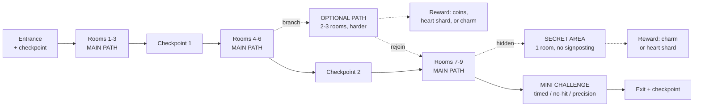
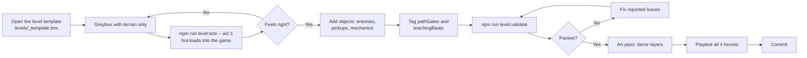
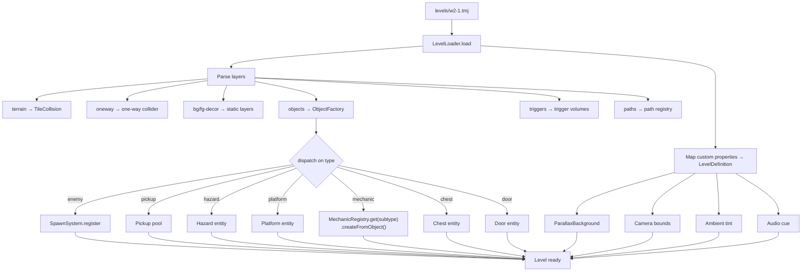

# 10 — Level Design

**Project:** DevQuest (Working Title)
**Document Owner:** Level Designer
**Status:** ✅ Stable
**Version:** 1.0.0
**Last Updated:** 2026-08-07

---

## 1. Purpose

This document specifies how DevQuest's levels are designed, authored, loaded, and validated. It covers the metric vocabulary (how wide is a jumpable gap), the structural template every level follows, the Tiled authoring conventions, the runtime level pipeline, the five world mechanic sets, and a beat-by-beat specification of all twenty levels.

Levels are where every other system becomes a game. A perfect movement controller and a satisfying combat system produce nothing without spaces designed around them. This document is the bridge.

The core commitment is stated up front: **every level is handcrafted, and every metric in it derives from a measured player capability.** There is no procedural generation, and there are no gaps whose width was chosen by eye.

---

## 2. Goals

| #   | Goal                                                        | Success Signal                                                               |
| --- | ----------------------------------------------------------- | ---------------------------------------------------------------------------- |
| G1  | Define a metric vocabulary derived from player physics      | Every gap width and ledge height in the game is one of ~12 documented values |
| G2  | Define the mandatory structural template                    | Every level has a main path, optional path, secret, checkpoint, and reward   |
| G3  | Define Tiled conventions completely                         | A designer can author a level without asking a question                      |
| G4  | Guarantee all four heroes can complete every level          | `check-hero-parity.ts` passes for all 20 levels                              |
| G5  | Specify the five world mechanic sets and their introduction | Pillar 5's five-beat protocol is verifiable per world                        |
| G6  | Specify all 20 levels beat by beat                          | A designer can build any level from this document                            |
| G7  | Make level loading data-driven and extensible               | Adding an object type is a registry entry                                    |

---

## 3. Design Principles

### P1 — Geometry Teaches

No tutorial text exists. Every mechanic is taught by a room shaped so that understanding is the only way through, and misunderstanding is cheap.

### P2 — Every Metric Is Derived

A gap is 40 px wide because the Knight's run-jump covers 41 px, not because 40 looked right. Every dimension in a level traces to §5.

### P3 — Failure Is Cheap, Then Expensive

A new mechanic's first appearance costs nothing to fail. Its second costs a few seconds. Only its third costs a life. This is Pillar 5's five-beat protocol.

### P4 — The Main Path Is the Easiest Path

Optional content is harder. A player who takes the obvious route always succeeds; a player who explores is rewarded for skill. Never hide the main path.

### P5 — Read Left to Right, Reward Up and Down

Forward progress is horizontal. Secrets and optional rewards are vertical — above the path or below it. This makes exploration legible without a map.

### P6 — Every Room Has One Idea

A room combines at most two mechanics. Three is noise at 320×180.

### P7 — Respect the 148 px Viewport

The camera shows 320 × 148 px of world (`04-Art-Direction.md` §9.3). Every challenge must be readable inside that window, and nothing important may sit outside it.

---

## 4. Overview

### 4.1 Structure

| Unit      | Count                  | Duration  | Notes                                   |
| --------- | ---------------------- | --------- | --------------------------------------- |
| **World** | 5                      | 25–40 min | One tileset, one mechanic set, one boss |
| **Level** | 4 per world (20 total) | 2–5 min   | 3 stages + 1 boss arena                 |
| **Room**  | 6–12 per level         | 10–30 s   | A screen or two with one idea           |
| **Beat**  | 1–4 per room           | 3–10 s    | A single challenge                      |

### 4.2 The World Table

| #   | World              | Tileset                       | Backdrop           | Ambient          | Primary Mechanic      | Supporting                     | Boss             |
| --- | ------------------ | ----------------------------- | ------------------ | ---------------- | --------------------- | ------------------------------ | ---------------- |
| 1   | **Verdant Ascent** | Green Zone                    | Nature             | `#8bb4d4` @ 0.10 | Moving platforms      | One-way platforms, bounce caps | Skeleton Warlord |
| 2   | **Autumn Reach**   | Autumn Forest                 | Fairy Tale         | `#d4813f` @ 0.18 | Wind zones            | Crumbling branches, updrafts   | Alpha Werewolf   |
| 3   | **Hollow Barrow**  | Forbidden Graveyard           | Fairy Tale (night) | `#1d2f4a` @ 0.35 | Light & darkness      | Soul-braziers, fog banks       | Oni Lord         |
| 4   | **Crystal Deep**   | Crystal Cave                  | Custom gradient    | `#0f1a2b` @ 0.40 | Refracted light beams | Low-gravity fields, conveyors  | Golem Sovereign  |
| 5   | **Gorgon's Spire** | Castle _(pending, `05` §9.1)_ | Fairy Tale (storm) | `#3a1d4d` @ 0.28 | Timed gate sequences  | Wall turrets, petrify zones    | Gorgon           |

### 4.3 The Level Template

Every non-boss level contains, without exception:



| Element            | Requirement                                                                          |
| ------------------ | ------------------------------------------------------------------------------------ |
| **Main path**      | Always completable by every hero at Assist-off. Never requires a secret              |
| **Optional path**  | 2–3 rooms, visibly branching, harder than the main path. Rejoins the main path       |
| **Secret area**    | 1 room, no signposting beyond a subtle visual tell. Contains the level's best reward |
| **Collectibles**   | 40–80 coins on the main path, 30–60 more on optional/secret                          |
| **Mini challenge** | One per level. A timed run, a no-hit gauntlet, or a precision sequence               |
| **Checkpoints**    | 3 per level (entrance, ~40%, ~70%) plus the exit                                     |
| **Reward**         | Every optional path and every secret pays out. Nothing is a dead end                 |

Boss levels (`wN-4`) use the arena template in `09-Boss-System.md` §5.5 instead.

---

## 5. Technical Design — The Metric Vocabulary

**This is the most-referenced section in the document.** Every dimension in every level comes from here.

### 5.1 Derived Player Capabilities

All values in pixels, at `TILE_SIZE = 16`. "Worst case" is the weakest hero on that axis (`06-Characters.md` §5.2).

| Capability                        | Knight | Samurai | Ninja | Wizard | **Worst Case** |
| --------------------------------- | ------ | ------- | ----- | ------ | -------------- |
| Standing jump height              | 29.4   | 32.0    | 28.1  | 29.9   | **28.1**       |
| Standing jump distance            | 27.6   | 32.4    | 36.2  | 29.5   | **27.6**       |
| Run-jump distance                 | 41.3   | 50.4    | 60.7  | 45.1   | **41.3**       |
| Dash distance                     | 29.4   | 39.0    | 52.7  | 36.0   | **29.4**       |
| Run-jump + air dash               | 70.7   | 89.4    | 113.4 | 81.1   | **70.7**       |
| Total vertical (with double jump) | 29.4   | 32.0    | 52.1  | 29.9   | **29.4**       |
| Wall-jump chain height (2 jumps)  | 52.8   | 56.8    | 50.0  | 53.6   | **50.0**       |

### 5.2 The Gap Vocabulary

**Main-path gaps must not exceed the worst case minus a 4 px safety margin.**

| Name        | Width | Tiles | Requires        | Main Path?                                           |
| ----------- | ----- | ----- | --------------- | ---------------------------------------------------- |
| `STEP`      | 16    | 1     | Walk            | ✅                                                   |
| `HOP`       | 24    | 1.5   | Standing jump   | ✅                                                   |
| `GAP_S`     | 32    | 2     | Standing jump   | ✅                                                   |
| `GAP_M`     | 40    | 2.5   | Run-jump        | ✅ (Knight: 41.3, margin 1.3 — **tightest allowed**) |
| `GAP_L`     | 56    | 3.5   | Run-jump + dash | ⚠️ Optional only                                     |
| `GAP_XL`    | 64    | 4     | Run-jump + dash | ⚠️ Optional only (Knight 70.7, margin 6.7)           |
| `GAP_NINJA` | 96+   | 6+    | Ninja chain     | ❌ Secret only, requires `altFor`                    |

**`GAP_M` at 40 px is the workhorse.** It is the widest gap every hero clears with a plain run-jump, and it is the standard main-path gap. Anything wider goes on an optional path.

**Rule:** every `GAP_L` or `GAP_XL` on a _required_ path is a bug. `check-hero-parity.ts` fails the build.

### 5.3 The Height Vocabulary

| Name          | Height | Tiles | Requires                                            | Main Path?                        |
| ------------- | ------ | ----- | --------------------------------------------------- | --------------------------------- |
| `LEDGE_S`     | 16     | 1     | Walk-up / jump                                      | ✅                                |
| `LEDGE_M`     | 24     | 1.5   | Jump                                                | ✅                                |
| `LEDGE_L`     | 26     | 1.6   | Jump (Ninja 28.1, margin 2.1 — **tallest allowed**) | ✅                                |
| `LEDGE_XL`    | 40     | 2.5   | Two-stage (platform + jump) or wall-jump            | ⚠️ Optional                       |
| `SHAFT`       | 48     | 3     | Wall-jump chain                                     | ⚠️ Optional (introduced W2)       |
| `LEDGE_NINJA` | 56+    | 3.5+  | Double jump                                         | ❌ Secret only, requires `altFor` |

### 5.4 Ceiling and Corridor Clearances

| Name           | Value           | Reason                                                         |
| -------------- | --------------- | -------------------------------------------------------------- |
| `CEIL_MIN`     | 32 px (2 tiles) | The player body is 28 px. 32 allows walking with 4 px headroom |
| `CEIL_JUMP`    | 64 px (4 tiles) | Enough for a full jump without head-bonking                    |
| `CEIL_COMBAT`  | 80 px (5 tiles) | Enough to jump-attack and dodge                                |
| `CORRIDOR_MIN` | 32 px tall      | Same as `CEIL_MIN`                                             |
| `CRAWL`        | 20 px           | Crouch-only passage. The player is 17 px crouched              |
| `ARENA_MIN`    | 320 × 96 px     | Any room containing 2+ enemies                                 |

**Every combat encounter needs `CEIL_COMBAT` (80 px).** A fight in a 32 px corridor removes jumping, which removes half the player's toolkit. Corridor fights exist deliberately in a few places (the Orc in 4-2) and are marked as such.

### 5.5 Hazard Metrics

| Hazard      | Dimensions            | Damage     | Notes                                              |
| ----------- | --------------------- | ---------- | -------------------------------------------------- |
| Spike patch | 16 px wide, 8 px tall | 20         | Hitbox is 12 × 6 (inset 2 px, `07-Combat.md` §5.2) |
| Pit         | ≥ 48 px deep          | Respawn    | Never instant-death on a main path in W1–W2        |
| Crusher     | 32 × 32               | Respawn    | W5 only                                            |
| Venom pool  | 32 × 8                | 8 / 500 ms | Boss arenas only                                   |

**Pit rule by world:**

| World | Main-path pits                                            | Optional-path pits |
| ----- | --------------------------------------------------------- | ------------------ |
| 1     | None until room 5 of 1-1; then soft-landing ledges        | Yes                |
| 2     | Yes                                                       | Yes                |
| 3     | Yes, but **never outside the lantern radius** (`ADR-018`) | Yes                |
| 4     | Yes                                                       | Yes                |
| 5     | Yes, frequently                                           | Yes                |

### 5.6 Pacing Metrics

| Metric                                            | Target                   |
| ------------------------------------------------- | ------------------------ |
| Distance between checkpoints                      | 400–900 px               |
| Distance between combat encounters                | ≥ 240 px                 |
| Distance between platforming challenges           | ≥ 96 px                  |
| Room length                                       | 320–640 px (1–2 screens) |
| Level length                                      | 2400–5200 px             |
| Time between "moments" (challenge, fight, reward) | ≤ 12 s                   |
| Continuous corridor with nothing in it            | ≤ 160 px                 |

**The 12-second rule** is the pacing backbone. A player should never go longer than twelve seconds without something happening. Empty traversal is the most common level-design failure and it is measurable — `check-pacing.ts` walks the main path and flags gaps.

---

## 6. Teaching — The Five-Beat Protocol

From `02-Game-Pillars.md` §5.5.4. Every new mechanic follows all five beats, and beats 1–4 appear in the world's first level.

| Beat | Name         | Requirements                                                                                                              |
| ---- | ------------ | ------------------------------------------------------------------------------------------------------------------------- |
| 1    | **SAFE**     | Mechanic alone. No hazards, no enemies. Failure costs nothing — the player lands somewhere safe and can retry immediately |
| 2    | **GATED**    | The mechanic blocks progress. It must be used. Still no hazard                                                            |
| 3    | **HAZARD**   | Mechanic + a pit or spikes. Failure costs a respawn                                                                       |
| 4    | **COMBINED** | Mechanic + an enemy, or + one previously learned mechanic                                                                 |
| 5    | **MASTERY**  | An optional challenge requiring skilled use. Rewards a collectible                                                        |

**Verification:** each level's Tiled data tags rooms with `teachingBeat: 1..5` and `mechanicId`. `check-teaching.ts` asserts every world's mechanic set has all five beats present, in order, with beats 1–4 in level 1.

### 6.1 The Safe-Failure Requirement

Beat 1 requires that failure is _free_. Concretely:

- A missed jump lands on a ledge 16 px below, from which the player walks back up a `LEDGE_S`.
- No enemy is within 240 px.
- No hazard is within the failure landing zone.
- The retry loop is under 4 seconds.

This is the single most important rule for the primary audience. A non-gamer who dies while learning a mechanic learns "this game punishes me," not the mechanic.

---

## 7. World Mechanic Sets

### 7.1 World 1 — Moving Platforms

**Primary: Moving Platforms.** Supporting: one-way platforms, bounce caps.

| Object           | Parameters                                                                                                 | Behaviour                                                                   |
| ---------------- | ---------------------------------------------------------------------------------------------------------- | --------------------------------------------------------------------------- |
| `movingPlatform` | `path` (polyline), `speed` (20–60 px/s), `pauseAtEndsMs`, `loopMode` (`pingpong`/`cycle`), `carriesPlayer` | Moves along an authored polyline. The player inherits its velocity          |
| `oneWayPlatform` | none                                                                                                       | Solid from above, passable from below. Drop through with `down + jump`      |
| `bounceCap`      | `bounceVelocity` (−300 to −420 px/s)                                                                       | A mushroom cap. Launches on contact from above. Overrides the player's `vy` |

**Player velocity inheritance** is the subtle correctness requirement. When the player jumps off a moving platform, they must carry the platform's horizontal velocity, or the platform "steals" their jump. Implementation:

```ts
// In PlayerController, after physics:
if (this.standingOn?.isMovingPlatform) {
  this.platformVelocity.copy(this.standingOn.body.velocity);
} else if (this.wasOnMovingPlatform && !this.grounded) {
  // Carry inherited velocity for one frame on takeoff, then decay it
  this.body.velocity.x += this.platformVelocity.x;
  this.platformVelocity.set(0, 0);
}
```

**Speed bounds:** platforms move at 20–60 px/s. Faster than 60 makes landing unreadable at 320×180; slower than 20 is waiting, not timing.

### 7.2 World 2 — Wind Zones

**Primary: Wind Zones.** Supporting: crumbling branches, updrafts. **Wall-slide is introduced here** as a universal ability (`06-Characters.md` §5.6).

| Object            | Parameters                                                                                  | Behaviour                                                             |
| ----------------- | ------------------------------------------------------------------------------------------- | --------------------------------------------------------------------- |
| `windZone`        | `force` (80–200 px/s²), `direction` (−1/+1), `oscillateMs` (0 = constant), `affectsEnemies` | Applies constant horizontal acceleration to bodies inside             |
| `updraft`         | `force` (−200 to −340 px/s²), `width`, `height`                                             | Vertical lift. Counteracts and can exceed gravity                     |
| `crumblingBranch` | `delayMs` (400 default), `respawnMs` (3000)                                                 | Solid until stood on. Shakes for `delayMs`, then falls, then respawns |

**Wind telegraph:** foreground leaf particles always show the current wind direction, and change direction 500 ms **before** the force does on oscillating zones. Wind you cannot see is wind you cannot plan around.

**Force bounds:** 200 px/s² is roughly 22% of gravity and shifts a full jump arc by ~14 px. This is the maximum that remains compensable; beyond it the player loses meaningful control.

**Crumbling branch timing:** 400 ms is exactly long enough for the player to land, register the shake, and jump away. It is derived from the jump-buffer window (120 ms) plus reaction time (~250 ms) plus margin.

### 7.3 World 3 — Light and Darkness

**Primary: Lantern Light.** Supporting: soul-braziers, fog banks.

| Object             | Parameters                                                      | Behaviour                                                              |
| ------------------ | --------------------------------------------------------------- | ---------------------------------------------------------------------- |
| _(player lantern)_ | radius 64 px, always on                                         | A soft radial light centred on the player                              |
| `soulBrazier`      | `radius` (100–160 px), `startLit` (bool), `relightCost` (1 hit) | A static light source. Extinguished ones are relit by attacking        |
| `fogBank`          | `density` (0.3–0.7), `width`, `height`                          | Reduces visibility inside. Enemy telegraphs remain visible (`ADR-018`) |
| `darkZone`         | `ambientOverride` (0.35–0.60)                                   | Raises the ambient tint locally                                        |

**Implementation:** darkness is a full-screen `MULTIPLY` quad (the ambient tint, `04-Art-Direction.md` §6.3) with light sources punched through it via an additive light-mask render texture.

```ts
// src/systems/mechanics/LanternMechanic.ts
// A single RenderTexture holds all light. One extra draw call.
this.lightMask.clear();
this.lightMask.fill(0x000000, 1); // fully dark
this.lightMask.erase(this.radialGradient, playerX, playerY); // punch the player's lantern
for (const b of this.litBraziers)
  this.lightMask.erase(this.radialGradient, b.x, b.y, b.radius / 64);
// Then draw lightMask over the scene with MULTIPLY at the zone's ambient alpha.
```

**The two inviolable constraints** (`ADR-018`):

1. **No instant-death hazard outside the lantern radius on a main path.** A pit the player cannot see is not a challenge.
2. **Every enemy attack windup is self-illuminated** regardless of ambient darkness.

### 7.4 World 4 — Light Beams

**Primary: Refracted Light Beams.** Supporting: low-gravity fields, conveyors.

| Object            | Parameters                                                                  | Behaviour                                           |
| ----------------- | --------------------------------------------------------------------------- | --------------------------------------------------- |
| `beamEmitter`     | `direction`, `colour` (S4), `active`                                        | Emits a continuous beam                             |
| `beamMirror`      | `rotations` (array of angles), `startIndex`, `rotateOn` (`attack`/`switch`) | Reflects a beam. The player rotates it by attacking |
| `beamReceiver`    | `targetId`, `requiresColour`                                                | Opens a gate when a beam hits it                    |
| `lowGravityField` | `gravityScale` (0.35–0.55), `width`, `height`                               | Reduces gravity inside. Affects the player only     |
| `conveyor`        | `speed` (±40–90 px/s)                                                       | Adds horizontal velocity to grounded bodies         |

**Beam routing** is the world's puzzle mechanic. A beam travels in a straight line until it hits a mirror (reflects), a receiver (activates), or solid terrain (stops). Beams are computed by raycast each frame, capped at 8 bounces.

```ts
// Beams are recomputed only when a mirror rotates or an emitter toggles —
// not every frame. Typical cost: 0 ms per frame, ~0.1 ms on a mirror rotation.
```

**Low gravity bounds:** 0.35× produces a 80 px jump for the Knight (vs 29.4 normal) and a 2.9× longer airtime. This is the mechanic that lets the player reach the Golem Sovereign's shoulder cores, and it is the world's answer to its own vertical challenges.

**Conveyor speed cap:** ±90 px/s. At the Knight's 78 px/s run speed, a −90 px/s conveyor means the Knight cannot make forward progress against it — deliberately, in two places, forcing a dash. Never on a required path without a dash-refresh point.

### 7.5 World 5 — Timed Gate Sequences

**Primary: Timed Gates.** Supporting: wall turrets, petrify zones. **World 5 is also the synthesis world** — it re-uses all prior mechanics, always in combination, never alone (`02-Game-Pillars.md` §5.5.3).

| Object          | Parameters                                                                     | Behaviour                                        |
| --------------- | ------------------------------------------------------------------------------ | ------------------------------------------------ |
| `timedGate`     | `groupId`, `openMs`, `closedMs`, `phaseOffsetMs`                               | Opens and closes on a shared clock               |
| `pressurePlate` | `targetGroupId`, `holdMs`, `resetMs`                                           | Starts a gate group's timer                      |
| `wallTurret`    | `fireIntervalMs` (1200–2400), `projectileId`, `direction`, `telegraphMs` (500) | Fires along a fixed line                         |
| `petrifyZone`   | `slowFactor` (0.45), `pulseMs` (2000 on / 2000 off)                            | A pulsing statue's gaze. Slows the player inside |
| `crusher`       | `cycleMs`, `phaseOffsetMs`, `travelPx`                                         | Instant respawn on contact                       |

**Gate group clocks are shared and globally synchronised** from level start, so a sequence of four gates with offsets 0/1500/3000/4500 forms a readable wave the player runs through. The clock does not reset on player death — it resets on checkpoint reload, so a retry is identical to the first attempt.

**Turret telegraph:** 500 ms of a charging glow before firing, plus a 1 px S0 line showing the fire path. Never a surprise.

---

## 8. Tiled Authoring Conventions

### 8.1 Map Settings

| Setting                | Value                                   |
| ---------------------- | --------------------------------------- |
| Orientation            | Orthogonal                              |
| Tile layer format      | CSV                                     |
| Tile render order      | Right Down                              |
| Tile size              | 16 × 16                                 |
| Map size               | Variable width, height a multiple of 16 |
| Output format          | JSON (`.tmj`)                           |
| Tileset margin/spacing | 0 / 0 (both in Tiled and in the loader) |
| Infinite               | **No** — fixed-size maps only           |

### 8.2 Required Layers, in Order

| #   | Layer         | Type   | Purpose                                                      |
| --- | ------------- | ------ | ------------------------------------------------------------ |
| 1   | `bg-decor`    | Tile   | Decorative tiles behind entities. No collision               |
| 2   | `terrain`     | Tile   | **Collision layer.** Tiles with `collides: true`             |
| 3   | `oneway`      | Tile   | One-way platforms                                            |
| 4   | `fg-decor`    | Tile   | Tiles rendered in front of entities                          |
| 5   | `objects`     | Object | Enemies, pickups, hazards, platforms, mechanics              |
| 6   | `triggers`    | Object | Checkpoints, camera zones, teaching markers, arena triggers  |
| 7   | `paths`       | Object | Polylines for moving platforms and patrol routes             |
| 8   | `annotations` | Object | Designer notes. **Stripped at build.** Not loaded at runtime |

**Layer names are exact and case-sensitive.** `LevelLoader` throws at load if a required layer is missing, with the level id and the missing name.

### 8.3 Tileset Custom Properties (per tile)

| Property    | Type   | Default   | Meaning                                   |
| ----------- | ------ | --------- | ----------------------------------------- |
| `collides`  | bool   | `false`   | Solid                                     |
| `slope`     | string | `"none"`  | `none` / `left` / `right` (45° only)      |
| `oneWay`    | bool   | `false`   | Solid from above only                     |
| `hazard`    | string | `""`      | `spike` / `lava` — applies contact damage |
| `material`  | string | `"stone"` | Drives landing dust and footstep audio    |
| `breakable` | bool   | `false`   | Destroyed by a player attack              |

### 8.4 Object Custom Properties

Every object in `objects` requires a `type` and a `defId` (where applicable).

| `type`     | Required Properties                            | Optional                          |
| ---------- | ---------------------------------------------- | --------------------------------- |
| `enemy`    | `defId` (EnemyDefId)                           | `patrolPathId`, `facing`, `elite` |
| `pickup`   | `kind` (`coin`/`heartShard`/`charm`), `amount` | `charmId`, `secretId`             |
| `hazard`   | `kind` (`spike`/`crusher`)                     | `cycleMs`, `phaseOffsetMs`        |
| `platform` | `kind` (`moving`/`bounce`/`crumbling`)         | `pathId`, `speed`, `delayMs`      |
| `mechanic` | `subtype` (see §7)                             | per-mechanic parameters           |
| `chest`    | `contents` (`coins`/`charm`/`shard`), `amount` | `charmId`                         |
| `door`     | `targetLevelId`, `targetSpawnId`               | `requiresBossDefeat`              |
| `spawn`    | `spawnId`                                      | `facing`                          |

| `triggers` `type` | Required                                | Optional          |
| ----------------- | --------------------------------------- | ----------------- |
| `checkpoint`      | `checkpointId`                          | `order`           |
| `cameraZone`      | `boundsMode` (`lock`/`extend`),         | `zoom`, `offsetY` |
| `arenaTrigger`    | `bossDefId`, `gateGroupId`              | —                 |
| `teachingBeat`    | `mechanicId`, `beat` (1–5)              | —                 |
| `pathGate`        | `pathKind` (`main`/`optional`/`secret`) | `altFor`          |
| `killZone`        | —                                       | —                 |

### 8.5 The Path-Gate Convention

This is how `check-hero-parity.ts` knows which geometry is required.

Every region of a level is tagged by a `pathGate` trigger:

| `pathKind` | Meaning                        | Metric Constraint                                                       |
| ---------- | ------------------------------ | ----------------------------------------------------------------------- |
| `main`     | Required to finish the level   | Gaps ≤ 40 px, ledges ≤ 26 px                                            |
| `optional` | A visible branch with a reward | Gaps ≤ 64 px, ledges ≤ 48 px                                            |
| `secret`   | Hidden, best rewards           | No constraint, but **must** have `altFor` if it exceeds optional limits |

`altFor` names a `secretId` and declares that an alternative route to the same reward exists for heroes who cannot make the primary route. The checker verifies the alternative exists and is within optional limits.

### 8.6 The Designer Workflow



`npm run level:test -- <levelId>` boots the game directly into that level with the debug overlay on and all four heroes hot-swappable via `F1`–`F4`. This is the single highest-value tool for the level designer and is built in M4.

### 8.7 Validation

`npm run level:validate` runs six checks:

| Check                    | Fails If                                                                           |
| ------------------------ | ---------------------------------------------------------------------------------- |
| `check-layers`           | A required layer is missing or misnamed                                            |
| `check-hero-parity`      | A main-path gap/ledge exceeds the worst-case metric                                |
| `check-teaching`         | A world's mechanic lacks any of the five beats, or beats are out of order          |
| `check-pacing`           | An empty stretch exceeds 160 px, or checkpoints exceed 900 px apart                |
| `check-encounter-budget` | Encounter weight exceeds the level's budget by >15% (`08-Enemy-System.md` §8.2)    |
| `check-template`         | A level lacks a main path, optional path, secret, mini challenge, or 3 checkpoints |

---

## 9. Architecture — The Runtime Level Pipeline



### 9.1 The Object Factory

```ts
// src/level/ObjectFactory.ts
// The loader knows NOTHING about specific types. Dispatch is a registry lookup.

type ObjectBuilder = (obj: TiledObject, ctx: LevelContext) => void;

const BUILDERS = new Map<string, ObjectBuilder>();

export function registerObjectType(type: string, builder: ObjectBuilder): void {
  if (BUILDERS.has(type)) throw new Error(`Object type already registered: ${type}`);
  BUILDERS.set(type, builder);
}

export function buildObject(obj: TiledObject, ctx: LevelContext): void {
  const builder = BUILDERS.get(obj.type);
  if (!builder) throw new Error(`Unknown object type "${obj.type}" at (${obj.x}, ${obj.y})`);
  builder(obj, ctx);
}
```

Adding a new object type is one `registerObjectType` call. `LevelLoader` never changes.

### 9.2 Tile Collision

Phaser's Arcade tilemap collision is used directly, with two customisations:

```ts
// src/level/TileCollision.ts
layer.setCollisionByProperty({ collides: true });

// One-way platforms: collide from above only.
onewayLayer.forEachTile(t => {
  if (t.index !== -1) t.setCollision(false, false, true, false);
});

// Slopes: Arcade has no native slope support. 45° slopes are approximated
// with a per-frame position correction on the player only.
// ponytail: 45° only. Arbitrary slopes would need a different physics engine.
```

**Slopes are 45° only.** Arcade Physics is AABB and has no slope support; a 45° slope is handled by a small correction pass that snaps the player's `y` to the slope surface when overlapping a slope tile. Arbitrary angles would require Matter.js, which was rejected (`ADR-005`). Two of five worlds use no slopes at all.

### 9.3 Camera Zones

```ts
export interface CameraZone {
  readonly bounds: Phaser.Geom.Rectangle;
  readonly mode: 'lock' | 'extend';
  readonly offsetY: number;
}
```

| Mode     | Behaviour                                                                                       |
| -------- | ----------------------------------------------------------------------------------------------- |
| `lock`   | Camera bounds are clamped to the zone. Used for arenas and single-screen puzzle rooms           |
| `extend` | Camera bounds are the union of the level bounds and the zone. Used to reveal a vertical section |

Transitions between zones ease over 400 ms with `Sine.easeInOut`. Instant camera jumps are jarring at this resolution and are never used except on level entry.

---

## 10. The Twenty Levels

Notation: `[GAP_M]` etc. reference §5. `→` denotes room transition. Encounter names reference `08-Enemy-System.md` §8.1.

---

### WORLD 1 — VERDANT ASCENT

_Green Zone tileset · Nature backgrounds · ambient `#8bb4d4` @ 0.10 · Skeletons_

---

#### 1-1 — "First Steps" · 2400 px · target 3:00

**Purpose:** teach movement, jumping, and the first fight. This is the most important level in the game — it is what the primary audience sees first.

| Room | Beat           | Content                                                                                                                    |
| ---- | -------------- | -------------------------------------------------------------------------------------------------------------------------- |
| 1    | —              | 160 px flat corridor. Nothing but ground. The player experiments with movement                                             |
| 2    | Jump: SAFE     | Three `[HOP]` (24 px) gaps in a row. Failure lands on a ledge 16 px below with a `[LEDGE_S]` walk-back. Zero penalty       |
| 3    | Jump: GATED    | A `[LEDGE_M]` (24 px) step up. Cannot proceed without jumping                                                              |
| 4    | Jump: HAZARD   | First `[GAP_M]` (40 px) over a pit. **Checkpoint 1 immediately before it**                                                 |
| 5    | MP: SAFE       | First moving platform. Horizontal, 30 px/s, over solid ground — falling costs nothing                                      |
| 6    | MP: GATED      | A moving platform over a `[GAP_L]` that cannot be jumped. Must ride it                                                     |
| 7    | —              | **Enemy demonstration.** A Skeleton patrols on a ledge _below_ the player's path, visible for 4 s. Cannot reach the player |
| 8    | Combat         | **Solo** (weight 1). One `skeleton_basic` on flat ground, 96 px of open space, `CEIL_COMBAT` clearance                     |
| 9    | MP: HAZARD     | Moving platform over a pit. **Checkpoint 2**                                                                               |
| 10   | MP: COMBINED   | Moving platform + a Skeleton on the far ledge                                                                              |
| 11   | Mini challenge | A 3-platform timing sequence for 12 coins. Failure = fall to the main path below, no death                                 |
| 12   | —              | Exit door. **Checkpoint 3**                                                                                                |

**Optional path** (branch from room 6, upward `[LEDGE_XL]` two-stage): 2 rooms of one-way-platform practice → 24 coins + 1 heart shard.
**Secret** (room 9, a suspicious 32 px alcove behind a fg-decor waterfall): 1 charm — **Whetstone** (+15% damage).
**Coins:** 52 main / 24 optional / 20 secret.
**Encounter budget:** 8. Used: Solo (1) + Solo (1) + Pair (2) + Screen (3) = 7.

**The teaching timeline** matches `02-Game-Pillars.md` §5.4.3 exactly: move at 0–10 s, jump at 10–25 s, precision at 25–40 s, consequence at 40–55 s, observe enemy at 55–75 s, first combat at 75–95 s.

---

#### 1-2 — "The Old Road" · 3200 px · target 3:30

**Purpose:** introduce one-way platforms and ranged enemies. Increase combat density.

| Room | Beat           | Content                                                                                              |
| ---- | -------------- | ---------------------------------------------------------------------------------------------------- |
| 1    | OW: SAFE       | Three stacked one-way platforms over solid ground. The player discovers pass-through-from-below      |
| 2    | OW: GATED      | A vertical shaft requiring upward one-way traversal                                                  |
| 3    | Combat         | **Pair** (2). Two `skeleton_basic`, 80 px apart                                                      |
| 4    | OW: HAZARD     | One-way platforms over a pit, with a 40 px drop-through hazard                                       |
| 5    | —              | **Checkpoint 1.** Skeleton Archer introduction: one archer on a ledge, no melee support, 140 px away |
| 6    | Combat         | **Screen** (3). One `skeleton_basic` front, one `skeleton_archer` on a ledge behind                  |
| 7    | MP + OW        | Moving platform passing through a one-way platform layer                                             |
| 8    | —              | **Checkpoint 2**                                                                                     |
| 9    | Combat         | **Elevated** (4). Archer above on a `[LEDGE_XL]`, Skeleton at ground level                           |
| 10   | Mini challenge | No-hit gauntlet: 3 Skeletons in sequence. Reward: 30 coins + a chest                                 |
| 11   | —              | Exit. **Checkpoint 3**                                                                               |

**Optional path** (room 4, downward): a lower route through a flooded section → 30 coins.
**Secret** (room 7, ride the moving platform past its apparent end): 1 heart shard.
**Coins:** 58 / 30 / 18. **Budget:** 12. Used: 2+3+4+3 = 12.

---

#### 1-3 — "Bounce" · 3600 px · target 4:00

**Purpose:** introduce bounce caps. Combine all three World 1 mechanics. Set up the boss.

| Room | Beat           | Content                                                                             |
| ---- | -------------- | ----------------------------------------------------------------------------------- |
| 1    | BC: SAFE       | One bounce cap over flat ground. Bounce height 320 px/s → ~57 px                    |
| 2    | BC: GATED      | A `[LEDGE_XL]` (40 px) reachable only via bounce cap                                |
| 3    | BC: HAZARD     | Bounce cap over a pit; must chain to a platform                                     |
| 4    | Combat         | **Gauntlet** (3). Three Skeletons sequentially in a 400 px corridor                 |
| 5    | —              | **Checkpoint 1**                                                                    |
| 6    | BC: COMBINED   | Bounce caps + moving platforms. A 4-beat vertical sequence                          |
| 7    | Combat         | **Pincer** (4). Skeleton from ahead, Skeleton Archer from behind                    |
| 8    | BC + OW        | Bounce through one-way platforms up a 96 px shaft                                   |
| 9    | —              | **Checkpoint 2**                                                                    |
| 10   | Combat         | **Mixed** (5). Skeleton, Skeleton Archer, Skeleton Brute (elite reskin)             |
| 11   | Mini challenge | BC: MASTERY. A bounce-chain across 5 caps without touching ground. 40 coins         |
| 12   | —              | Exit toward the boss. **Checkpoint 3.** Visual build-up: broken banners, bone piles |

**Optional path** (room 6, high branch): 3 rooms of bounce precision → 1 charm — **Featherfall** (−20% fall speed).
**Secret** (room 8, a breakable tile at the shaft's top): 1 heart shard.
**Coins:** 64 / 36 / 20. **Budget:** 16. Used: 3+4+5+3 = 15.

---

#### 1-4 — "The Warlord's Court" · Boss Arena

Approach corridor 600 px with 2 Skeletons (weight 2). Arena 560 × 200, three platforms at 26/40/26 px heights, no pits.
**Boss:** Skeleton Warlord (`09-Boss-System.md` §7.1). **Unlocks: About Me.**

---

### WORLD 2 — AUTUMN REACH

_Autumn Forest tileset · Fairy Tale backgrounds · ambient `#d4813f` @ 0.18 · Werewolves_

---

#### 2-1 — "Windfall" · 3400 px · target 3:30

**Purpose:** introduce wind zones and the Werewolf. Introduce wall-slide.

| Room | Beat           | Content                                                                                                                 |
| ---- | -------------- | ----------------------------------------------------------------------------------------------------------------------- |
| 1    | Wind: SAFE     | A wide flat platform inside a constant rightward 120 px/s² wind. Nothing to fall off. The player feels the push         |
| 2    | Wind: GATED    | A `[GAP_L]` (56 px) that is unjumpable against the wind and trivial with it. Teaches wind as a resource                 |
| 3    | Wind: HAZARD   | The same gap over a pit, with the wind oscillating every 2000 ms                                                        |
| 4    | —              | **Werewolf introduction.** One `werewolf_basic` in a 320 px open room. **Solo** (1). No wind here — one thing at a time |
| 5    | —              | **Checkpoint 1**                                                                                                        |
| 6    | WS: SAFE       | Wall-slide introduction. A 48 px `[SHAFT]` with soft ground below. The player discovers slide + wall-jump               |
| 7    | WS: GATED      | A 64 px shaft requiring a two-jump wall chain                                                                           |
| 8    | Wind: COMBINED | Wind gap + a `skeleton_archer` on the far ledge                                                                         |
| 9    | —              | **Checkpoint 2**                                                                                                        |
| 10   | Combat         | **Pair** (2). Two Werewolves in a 480 px space. Teaches the bait-leap-punish pattern under pressure                     |
| 11   | Mini challenge | A wind-assisted long jump chain across 4 platforms. 32 coins                                                            |
| 12   | —              | Exit. **Checkpoint 3**                                                                                                  |

**Optional path** (room 7, top of the shaft): 2 rooms of wall-jump precision → 34 coins + a chest.
**Secret** (room 3, ride the leftward oscillation into a hidden alcove): 1 charm — **Windrider** (wind force −40% on the player).
**Coins:** 60 / 34 / 22. **Budget:** 11. Used: 1+2+3+4 = 10.

---

#### 2-2 — "Falling Leaves" · 3800 px · target 4:00

**Purpose:** introduce crumbling branches and updrafts. Increase Werewolf pressure.

| Room | Beat           | Content                                                                                              |
| ---- | -------------- | ---------------------------------------------------------------------------------------------------- |
| 1    | CB: SAFE       | Three crumbling branches over solid ground. 400 ms delay each                                        |
| 2    | CB: GATED      | A crumbling-branch bridge across a `[GAP_XL]`                                                        |
| 3    | CB: HAZARD     | Crumbling branches over a pit, spaced at `[GAP_M]`                                                   |
| 4    | UD: SAFE       | An updraft column over flat ground. The player floats                                                |
| 5    | UD: GATED      | An updraft to reach a `[LEDGE_XL]`                                                                   |
| 6    | —              | **Checkpoint 1**                                                                                     |
| 7    | Combat         | **Elevated** (4). Werewolf below, Skeleton Archer above                                              |
| 8    | CB + Wind      | Crumbling branches inside an oscillating wind zone                                                   |
| 9    | —              | **Checkpoint 2**                                                                                     |
| 10   | Combat         | **Hazard fight** (5). Two Werewolves on a crumbling-branch platform over a pit                       |
| 11   | Mini challenge | **Wind: MASTERY.** Ride an updraft into a leftward wind at apex to reach a high ledge. 1 heart shard |
| 12   | —              | Exit. **Checkpoint 3**                                                                               |

**Optional path** (room 5, ride the updraft higher): 3 rooms in the canopy → 40 coins + a chest.
**Secret** (room 8, a branch that does not crumble): 1 heart shard.
**Coins:** 66 / 40 / 20. **Budget:** 16. Used: 4+5+3+4 = 16.

---

#### 2-3 — "The High Boughs" · 4200 px · target 4:30

**Purpose:** full World 2 synthesis. Highest platforming density so far.

| Room | Beat           | Content                                                                   |
| ---- | -------------- | ------------------------------------------------------------------------- |
| 1    | —              | Wind + crumbling branches + moving platforms (W1 callback)                |
| 2    | Combat         | **Gauntlet** (3). Three Werewolves sequentially                           |
| 3    | —              | Updraft + wall-slide combination: a 120 px vertical climb                 |
| 4    | —              | **Checkpoint 1**                                                          |
| 5    | Combat         | **Pincer** (4). Werewolf ahead, Werewolf behind, on a narrow branch       |
| 6    | —              | Wind reversal timing: a 5-platform crossing where wind flips mid-traverse |
| 7    | —              | **Checkpoint 2**                                                          |
| 8    | Combat         | **Mixed** (5). Werewolf, Skeleton Archer, Werewolf Scout (veteran)        |
| 9    | —              | **CB: MASTERY.** A 7-branch crumbling chain with no safe ground           |
| 10   | Mini challenge | Timed run: reach the exit in 45 s. 50 coins                               |
| 11   | —              | Exit toward the boss. **Checkpoint 3**                                    |

**Optional path** (room 6, low branch under the wind): 2 rooms → 1 charm — **Ironhide** (−15% damage taken).
**Secret** (room 9, drop off the final branch deliberately): 1 heart shard.
**Coins:** 70 / 38 / 24. **Budget:** 20. Used: 3+4+5+5 = 17.

---

#### 2-4 — "The Clifftop" · Boss Arena

Approach 640 px with 1 Werewolf + 1 Archer (weight 3). Arena 640 × 220, two high platforms (destroyed in phase 3), arena-wide oscillating wind.
**Boss:** Alpha Werewolf (`09-Boss-System.md` §7.2). **Unlocks: Projects.**

---

### WORLD 3 — HOLLOW BARROW

_Forbidden Graveyard tileset · Fairy Tale night · ambient `#1d2f4a` @ 0.35 · Yokai, Witches_

---

#### 3-1 — "First Dark" · 3600 px · target 4:00

**Purpose:** introduce darkness gently. Introduce the Yokai.

| Room | Beat            | Content                                                                                    |
| ---- | --------------- | ------------------------------------------------------------------------------------------ |
| 1    | —               | Dusk, not dark. Ambient 0.20. The player sees the light radius forming                     |
| 2    | Light: SAFE     | A dark room with a lit brazier. Everything visible. No hazards                             |
| 3    | Light: GATED    | A dark corridor. An extinguished brazier blocks the way — attack to relight                |
| 4    | Light: HAZARD   | A pit **inside** the lantern radius. Dark beyond, but nothing lethal out there (`ADR-018`) |
| 5    | —               | **Yokai introduction.** One `yokai_basic` in a fully lit room. **Solo** (1)                |
| 6    | —               | **Checkpoint 1**                                                                           |
| 7    | Light: COMBINED | Two braziers to relight while a Yokai harasses                                             |
| 8    | —               | Fog bank introduction: a low-density (0.3) fog corridor. Enemy telegraphs still visible    |
| 9    | —               | **Checkpoint 2**                                                                           |
| 10   | Combat          | **Screen** (3). Yokai front, Witch behind (Witch introduction)                             |
| 11   | Mini challenge  | Relight 4 braziers in 30 s. 36 coins                                                       |
| 12   | —               | Exit. **Checkpoint 3**                                                                     |

**Optional path** (room 4, a dark side passage — requires committing to the unknown): 2 rooms → 32 coins + a chest.
**Secret** (room 8, inside the fog, off-path): 1 charm — **Lantern** (+40% light radius).
**Coins:** 62 / 32 / 22. **Budget:** 14. Used: 1+3+4+3 = 11.

---

#### 3-2 — "The Barrow Mouth" · 4000 px · target 4:30

**Purpose:** deepen darkness. Witch summons. Prioritisation under low information.

| Room | Beat           | Content                                                                               |
| ---- | -------------- | ------------------------------------------------------------------------------------- |
| 1    | —              | Ambient 0.40. Only the player's lantern and two distant braziers                      |
| 2    | Combat         | **Pair** (2). Two Yokai in a half-lit room                                            |
| 3    | —              | Brazier chain: relight 3 in sequence to open a soul-gate                              |
| 4    | —              | **Checkpoint 1**                                                                      |
| 5    | Combat         | **Screen** (3). Witch at the back with 2 summoned Skeletons. Teaches "kill the Witch" |
| 6    | —              | Dense fog (0.6) + a platforming sequence with `[GAP_M]` gaps                          |
| 7    | —              | **Checkpoint 2**                                                                      |
| 8    | Combat         | **Elevated** (4). Witch on a high ledge, Yokai at ground level                        |
| 9    | —              | A dark shaft climb using wall-slide (W2 callback), lit only by falling embers         |
| 10   | Mini challenge | No-hit through a fog corridor with 3 Yokai. 1 heart shard                             |
| 11   | —              | Exit. **Checkpoint 3**                                                                |

**Optional path** (room 6, into the deepest fog): 3 rooms → 44 coins.
**Secret** (room 9, a false wall at mid-shaft): 1 heart shard.
**Coins:** 68 / 44 / 18. **Budget:** 20. Used: 2+3+4+5 = 14.

---

#### 3-3 — "Total Eclipse" · 4400 px · target 5:00

**Purpose:** maximum darkness. Full World 3 synthesis.

| Room | Beat           | Content                                                                                     |
| ---- | -------------- | ------------------------------------------------------------------------------------------- |
| 1    | —              | Ambient 0.50. Lantern only                                                                  |
| 2    | —              | **Light: MASTERY.** Navigate a spike field using only brazier light, relighting as you go   |
| 3    | Combat         | **Gauntlet** (3). Three Yokai in the dark                                                   |
| 4    | —              | **Checkpoint 1**                                                                            |
| 5    | —              | Fog + wind (W2 callback) + darkness. Three mechanics — the only room in the game with three |
| 6    | Combat         | **Pincer** (4). Yokai teleporting from both sides                                           |
| 7    | —              | **Checkpoint 2**                                                                            |
| 8    | Combat         | **Mixed** (5). Yokai Elite, Witch, 2 summoned Skeletons                                     |
| 9    | —              | A moving-platform crossing in total darkness, lit by 4 timed braziers                       |
| 10   | Mini challenge | Timed: reach the exit in 60 s with all braziers lit. 60 coins                               |
| 11   | —              | Exit toward the boss. **Checkpoint 3**                                                      |

**Optional path** (room 5, follow the wind rather than fighting it): 2 rooms → 1 charm — **Soulbind** (kills restore 4 HP).
**Secret** (room 9, a brazier that opens a floor panel): 1 heart shard.
**Coins:** 72 / 40 / 26. **Budget:** 26. Used: 3+4+5+5 = 17.

**Note on room 5:** this is the deliberate, documented exception to P6 (one idea per room). It appears once, in the third level of the third world, as an escalation moment. It is 320 px long and has a checkpoint 160 px before it.

---

#### 3-4 — "The Sunken Shrine" · Boss Arena

Approach 600 px with 1 Yokai + 1 Witch (weight 4). Arena 600 × 240, four braziers, ambient 0.35 rising to 0.45 by phase 3.
**Boss:** Oni Lord (`09-Boss-System.md` §7.3). **Unlocks: Experience.**

---

### WORLD 4 — CRYSTAL DEEP

_Crystal Cave tileset · custom gradient backdrop · ambient `#0f1a2b` @ 0.40 · Orcs, Golems_

---

#### 4-1 — "The Descent" · 3800 px · target 4:00

**Purpose:** introduce light beams and low gravity. Introduce the Orc.

| Room | Beat           | Content                                                                                                                      |
| ---- | -------------- | ---------------------------------------------------------------------------------------------------------------------------- |
| 1    | Beam: SAFE     | An emitter, a receiver, and one mirror already correctly aligned. The player sees the beam open a gate                       |
| 2    | Beam: GATED    | One mirror to rotate (attack it) to route a beam to a receiver                                                               |
| 3    | Beam: HAZARD   | Two mirrors, and the route crosses a spike pit                                                                               |
| 4    | LG: SAFE       | A low-gravity field (0.45×) over solid ground. The player floats and lands safely                                            |
| 5    | —              | **Checkpoint 1**                                                                                                             |
| 6    | LG: GATED      | A `[LEDGE_XL]` reachable only inside low gravity                                                                             |
| 7    | —              | **Orc introduction.** One `orc_basic` in a 400 px room with `CEIL_COMBAT` clearance. **Solo** (1). Teaches the shield puzzle |
| 8    | Beam + LG      | Rotate a mirror while floating                                                                                               |
| 9    | —              | **Checkpoint 2**                                                                                                             |
| 10   | Combat         | **Wall** (4). One Orc in a 200 px corridor with a back wall (charge-bait setup)                                              |
| 11   | Mini challenge | Beam puzzle: 4 mirrors, 3 receivers, 60 s. 40 coins                                                                          |
| 12   | —              | Exit. **Checkpoint 3**                                                                                                       |

**Optional path** (room 6, float up a side shaft): 2 rooms → 36 coins + a chest.
**Secret** (room 3, redirect the beam to an unmarked receiver): 1 charm — **Prism** (Wizard bolts pierce +1; other heroes: +8% damage).
**Coins:** 64 / 36 / 24. **Budget:** 17. Used: 1+4+4+5 = 14.

---

#### 4-2 — "Conveyor Halls" · 4200 px · target 4:30

**Purpose:** introduce conveyors. Introduce the Golem. Escalate the beam puzzles.

| Room | Beat           | Content                                                                                                    |
| ---- | -------------- | ---------------------------------------------------------------------------------------------------------- |
| 1    | Conv: SAFE     | A short conveyor over flat ground                                                                          |
| 2    | Conv: GATED    | A conveyor moving against the player's direction at −90 px/s. **Requires a dash**                          |
| 3    | Conv: HAZARD   | Conveyors feeding into a spike pit; must dash across                                                       |
| 4    | —              | **Golem introduction.** One `golem_basic` in a 480 px room. **Solo** (1). Teaches shockwave jumping        |
| 5    | —              | **Checkpoint 1**                                                                                           |
| 6    | Beam           | 3-mirror puzzle with a moving platform carrying one mirror                                                 |
| 7    | Combat         | **Wall** (4). The Orc corridor tuned per `08-Enemy-System.md` §11.3 — **200 px wide, with a raised ledge** |
| 8    | Conv + LG      | Conveyors inside a low-gravity field — the player drifts                                                   |
| 9    | —              | **Checkpoint 2**                                                                                           |
| 10   | Combat         | **Mixed** (5). Orc, Golem, 2 crystal-skeleton reskins                                                      |
| 11   | Mini challenge | No-hit past a Golem using only shockwave jumps. 1 heart shard                                              |
| 12   | —              | Exit. **Checkpoint 3**                                                                                     |

**Optional path** (room 8, ride a conveyor into a side vent): 3 rooms → 46 coins.
**Secret** (room 6, ride the mirror platform past its stop): 1 heart shard.
**Coins:** 70 / 46 / 20. **Budget:** 22. Used: 1+4+4+5+4 = 18.

---

#### 4-3 — "The Resonant Vault" · 4600 px · target 5:00

**Purpose:** full World 4 synthesis. The game's hardest puzzle content.

| Room | Beat           | Content                                                                      |
| ---- | -------------- | ---------------------------------------------------------------------------- |
| 1    | —              | A 5-mirror beam puzzle spanning two screens vertically                       |
| 2    | Combat         | **Gauntlet** (3). Three Orcs sequentially                                    |
| 3    | —              | **LG: MASTERY.** A low-gravity precision sequence across 6 small platforms   |
| 4    | —              | **Checkpoint 1**                                                             |
| 5    | —              | Beam + conveyor + low gravity: route a beam while the floor moves            |
| 6    | Combat         | **Pincer** (4). Orc ahead, Golem behind, in a 400 px space                   |
| 7    | —              | **Checkpoint 2**                                                             |
| 8    | —              | **Beam: MASTERY.** A 7-mirror puzzle with two beam colours and two receivers |
| 9    | Combat         | **Mixed** (5). Golem Veteran, Orc, Witch                                     |
| 10   | Mini challenge | Timed: 70 s through the vault. 60 coins                                      |
| 11   | —              | Exit toward the boss. **Checkpoint 3**                                       |

**Optional path** (room 5, a lower conveyor route): 2 rooms → 1 charm — **Resonance** (dash cooldown −25%).
**Secret** (room 8, the second beam colour opens a hidden vault): 1 heart shard + 40 coins.
**Coins:** 74 / 42 / 68. **Budget:** 27. Used: 3+4+5 = 12 (puzzle-heavy level, deliberately light on combat).

---

#### 4-4 — "The Sovereign's Seat" · Boss Arena

Approach 700 px with 1 Orc + 1 Golem (weight 4). Arena 720 × 260, four crystal pillars (phase 2), two low-gravity fields (phase 2, expanding phase 3).
**Boss:** Golem Sovereign (`09-Boss-System.md` §7.4). **Unlocks: Skills.**

---

### WORLD 5 — GORGON'S SPIRE

_Castle tileset (pending) · Fairy Tale storm · ambient `#3a1d4d` @ 0.28 · everything_

---

#### 5-1 — "The Gate Sequence" · 4000 px · target 4:30

**Purpose:** introduce timed gates and turrets. Begin the synthesis.

| Room | Beat           | Content                                                                                                  |
| ---- | -------------- | -------------------------------------------------------------------------------------------------------- |
| 1    | Gate: SAFE     | One gate opening and closing on a 2000/2000 ms cycle over flat ground. Being caught closed costs nothing |
| 2    | Gate: GATED    | Two gates in sequence, offset 1500 ms. Must run the wave                                                 |
| 3    | Gate: HAZARD   | Three gates over a pit                                                                                   |
| 4    | Turret: SAFE   | One wall turret firing across a flat corridor. 500 ms telegraph, easily walked past                      |
| 5    | —              | **Checkpoint 1**                                                                                         |
| 6    | Gate + Turret  | Gates timed against turret fire intervals                                                                |
| 7    | Combat         | **Screen** (3). Gorgon (elite enemy) front, Skeleton Archer back                                         |
| 8    | Gate + MP (W1) | Timed gates with moving platforms — first synthesis                                                      |
| 9    | —              | **Checkpoint 2**                                                                                         |
| 10   | Combat         | **Pincer** (4). Two Gorgons                                                                              |
| 11   | Mini challenge | Run a 4-gate sequence without stopping. 44 coins                                                         |
| 12   | —              | Exit. **Checkpoint 3**                                                                                   |

**Optional path** (room 6, a turret-lined high walkway): 2 rooms → 40 coins + a chest.
**Secret** (room 8, ride a platform through a gate that appears permanently closed): 1 charm — **Clockwork** (gate cycles +25% open time).
**Coins:** 66 / 40 / 26. **Budget:** 20. Used: 3+4+4 = 11.

---

#### 5-2 — "The Petrified Gallery" · 4400 px · target 5:00

**Purpose:** introduce petrify zones. Synthesis with Worlds 2 and 3.

| Room | Beat            | Content                                                                           |
| ---- | --------------- | --------------------------------------------------------------------------------- |
| 1    | Pet: SAFE       | One petrify zone pulsing 2000/2000 ms over flat ground. The player feels the slow |
| 2    | Pet: GATED      | A gap crossable only during the zone's off-pulse                                  |
| 3    | Pet: HAZARD     | Petrify zone adjacent to a pit                                                    |
| 4    | Pet + Wind (W2) | Petrify slow inside a wind zone — the wind wins while slowed                      |
| 5    | —               | **Checkpoint 1**                                                                  |
| 6    | Pet + Dark (W3) | Petrify zones in a dark gallery, lit only by their own gaze glow                  |
| 7    | Combat          | **Elevated** (4). Gorgon above, Golem below                                       |
| 8    | Pet + Gate      | Petrify slow against a gate timing window — the game's tightest execution         |
| 9    | —               | **Checkpoint 2**                                                                  |
| 10   | Combat          | **Mixed** (5). Gorgon, Orc, Witch                                                 |
| 11   | Mini challenge  | Cross the gallery without being petrified once. 1 heart shard                     |
| 12   | —               | Exit. **Checkpoint 3**                                                            |

**Optional path** (room 6, into the dark): 3 rooms → 48 coins.
**Secret** (room 8, a statue that can be destroyed): 1 heart shard.
**Coins:** 70 / 48 / 20. **Budget:** 24. Used: 4+5+4 = 13.

---

#### 5-3 — "The Long Climb" · 5200 px · target 5:30

**Purpose:** the game's final gauntlet. Every mechanic, in combination, ascending.

| Room | Beat           | Content                                                                |
| ---- | -------------- | ---------------------------------------------------------------------- |
| 1    | —              | Gates + crumbling floors (W2) ascending a 200 px shaft                 |
| 2    | Combat         | **Gauntlet** (3). Werewolf, Yokai, Orc in sequence — a roster callback |
| 3    | —              | Beams (W4) + gates: route a beam through a closing gate                |
| 4    | —              | **Checkpoint 1**                                                       |
| 5    | —              | Low gravity (W4) + wind (W2) + turrets. Ascending                      |
| 6    | Combat         | **Swarm** (4). Six `skeleton_basic` in an open hall                    |
| 7    | —              | **Checkpoint 2**                                                       |
| 8    | —              | **Gate: MASTERY.** A 6-gate wave with crushers, over a pit             |
| 9    | Combat         | **Mixed** (5). Gorgon Elite, Golem Veteran, Witch Elite                |
| 10   | —              | Darkness (W3) + petrify + moving platforms (W1). The final traversal   |
| 11   | Mini challenge | Timed: 90 s to the summit. 80 coins + 1 heart shard                    |
| 12   | —              | Exit to the summit. **Checkpoint 3**                                   |

**Optional path** (room 5, ride the wind higher): 3 rooms → 1 charm — **Ascendant** (+1 air jump for all heroes; Ninja gets +2).
**Secret** (room 10, step off the last platform into the dark): 40 coins + 1 heart shard.
**Coins:** 84 / 52 / 40. **Budget:** 28. Used: 3+4+5 = 12 (traversal-heavy, deliberately).

---

#### 5-4 — "The Summit" · Boss Arena

Approach 800 px with 1 Gorgon Veteran + 2 Skeletons (weight 5). Arena 800 × 280, four collapsing floor sections, **two pits** (the documented exception to `09-Boss-System.md` §5.5).
**Boss:** Gorgon (`09-Boss-System.md` §7.5). **Unlocks: Contact.** Triggers the ending.

---

### 10.1 Level Content Totals

| World     | Levels | Length       | Coins    | Heart Shards | Charms | Secrets |
| --------- | ------ | ------------ | -------- | ------------ | ------ | ------- |
| 1         | 4      | 9200 px      | 322      | 3            | 2      | 3       |
| 2         | 4      | 11400 px     | 358      | 4            | 2      | 3       |
| 3         | 4      | 12000 px     | 384      | 3            | 2      | 3       |
| 4         | 4      | 12600 px     | 444      | 3            | 2      | 3       |
| 5         | 4      | 13600 px     | 446      | 4            | 2      | 3       |
| **Total** | **20** | **58800 px** | **1954** | **17**       | **10** | **15**  |

**17 heart shards** at 4 per container = **4 extra health containers** with 1 shard spare. See `11-Progression.md` §5.

---

## 11. Data Structures

```ts
// src/level/LevelDefinition.ts
// NORMATIVE

export interface LevelDefinition {
  readonly id: LevelId;
  readonly worldId: WorldId;
  readonly index: 1 | 2 | 3 | 4;
  readonly displayName: string;
  readonly isBossLevel: boolean;

  readonly tmjPath: string;
  readonly widthPx: number;
  readonly heightPx: number;

  readonly visuals: WorldVisuals; // 04-Art-Direction §12
  readonly mechanics: readonly MechanicId[]; // which plugins to instantiate

  readonly checkpoints: readonly CheckpointDefinition[];
  readonly targetTimeMs: number; // for the mini-challenge timer
  readonly encounterBudget: number;

  readonly collectibles: {
    readonly coinsMain: number;
    readonly coinsOptional: number;
    readonly coinsSecret: number;
    readonly heartShards: readonly SecretId[];
    readonly charms: readonly CharmId[];
    readonly secrets: readonly SecretId[];
  };

  readonly nextLevelId: LevelId | null;
  readonly bossDefId: BossDefId | null;
  readonly audioTrackId: string | null;
}

export interface CheckpointDefinition {
  readonly id: CheckpointId;
  readonly x: number;
  readonly y: number;
  readonly order: number;
  readonly isEntrance: boolean;
  readonly isExit: boolean;
}

export interface TiledObject {
  readonly id: number;
  readonly name: string;
  readonly type: string;
  readonly x: number;
  readonly y: number;
  readonly width: number;
  readonly height: number;
  readonly rotation: number;
  readonly visible: boolean;
  readonly polyline?: readonly { readonly x: number; readonly y: number }[];
  readonly properties?: readonly {
    readonly name: string;
    readonly type: string;
    readonly value: unknown;
  }[];
}
```

```ts
// The metric constants, so level tooling and validation share one source.
// src/config/LevelMetrics.ts — NORMATIVE, mirrors §5.

export const GAP = {
  STEP: 16,
  HOP: 24,
  GAP_S: 32,
  GAP_M: 40,
  GAP_L: 56,
  GAP_XL: 64,
  GAP_NINJA: 96,
} as const;

export const HEIGHT = {
  LEDGE_S: 16,
  LEDGE_M: 24,
  LEDGE_L: 26,
  LEDGE_XL: 40,
  SHAFT: 48,
  LEDGE_NINJA: 56,
} as const;

export const CLEARANCE = {
  CEIL_MIN: 32,
  CEIL_JUMP: 64,
  CEIL_COMBAT: 80,
  CORRIDOR_MIN: 32,
  CRAWL: 20,
} as const;

/** Worst-case hero capability. Main-path geometry must respect these. */
export const WORST_CASE = {
  jumpHeight: 28.1, // Ninja
  runJumpDistance: 41.3, // Knight
  runJumpDash: 70.7, // Knight
  wallJumpChain: 50.0, // Ninja
  SAFETY_MARGIN_H: 4,
  SAFETY_MARGIN_V: 2,
} as const;

export const PACING = {
  CHECKPOINT_MIN_PX: 400,
  CHECKPOINT_MAX_PX: 900,
  ENCOUNTER_MIN_SPACING_PX: 240,
  MAX_EMPTY_CORRIDOR_PX: 160,
  MAX_MOMENT_GAP_MS: 12_000,
} as const;
```

---

## 12. Implementation Notes

### 12.1 Level Loading Performance

| Step                | Budget      | Approach                                                          |
| ------------------- | ----------- | ----------------------------------------------------------------- |
| Parse `.tmj`        | 8 ms        | Already JSON; `resolveJsonModule` + Vite import                   |
| Build tile layers   | 12 ms       | Phaser `createLayer`, static                                      |
| Build collision     | 4 ms        | `setCollisionByProperty`                                          |
| Instantiate objects | 15 ms       | Pooled; objects register, they do not all spawn                   |
| Parallax setup      | 3 ms        | 3–5 `TileSprite`s                                                 |
| **Total**           | **≤ 45 ms** | Under three frames. Hidden behind the 400 ms iris-wipe transition |

**Enemies are registered, not spawned.** `SpawnSystem` holds spawn points and activates enemies as the camera approaches (`08-Enemy-System.md` §10.4). A level with 40 enemy markers instantiates zero enemies at load.

### 12.2 The Checkpoint System

```ts
// src/systems/CheckpointSystem.ts
export interface CheckpointState {
  readonly checkpointId: CheckpointId;
  readonly levelId: LevelId;
  readonly playerHp: number;
  readonly playerResource: number;
  readonly coinsAtCheckpoint: number;
  /** Spawn points already cleared. Killed enemies stay dead until a checkpoint reload. */
  readonly killedSpawnPoints: readonly string[];
  readonly collectedPickups: readonly string[];
  readonly mechanicState: Readonly<Record<string, unknown>>; // mirror rotations, brazier lit-state
}
```

| Rule               | Specification                                                                                          |
| ------------------ | ------------------------------------------------------------------------------------------------------ |
| Activation         | Walking into the volume. Instant, no input needed                                                      |
| Feedback           | Lantern bloom + 8 rising sparks + a 1.2 s HUD toast                                                    |
| Re-activation      | Passing an already-active checkpoint does nothing (no re-save spam)                                    |
| On death           | Restore HP, resource, position, and `mechanicState`. Coins collected since the checkpoint are **kept** |
| Autosave           | Yes, on activation                                                                                     |
| Respawn transition | `flashCut` (120 ms). Deliberately the fastest transition in the game                                   |

**Coins are kept on death.** Losing currency on death is a punishment that discourages exploration, and exploration is what the optional paths exist for.

**`mechanicState` restoration** matters: dying after solving a 5-mirror beam puzzle must not reset the puzzle. This is the single most important checkpoint detail in World 4.

### 12.3 Camera Behaviour

```ts
this.cameras.main.startFollow(player, true, 0.12, 0.12);
this.cameras.main.setDeadzone(48, 32);
this.cameras.main.setFollowOffset(0, -12);
```

| Setting         | Value                                             | Reason                                                                                         |
| --------------- | ------------------------------------------------- | ---------------------------------------------------------------------------------------------- |
| Lerp            | 0.12 both axes                                    | Smooth without feeling laggy. 0.20+ is jittery; 0.06 feels like the camera is chasing          |
| Deadzone        | 48 × 32 px                                        | The player can move within this box without the camera moving. Prevents micro-jitter           |
| Follow offset Y | −12 px                                            | Biases the view upward. Players jump more than they fall, and need to see where they are going |
| Look-ahead      | +24 px in the facing direction, eased over 400 ms | Applied when running at >70% max speed                                                         |
| Round pixels    | `true`                                            | Mandatory                                                                                      |

**Vertical camera snapping:** when the player becomes grounded after falling more than 48 px, the camera's vertical target snaps to the new ground level over 300 ms rather than following the fall continuously. Without this, a long fall makes the camera lag badly and then whip.

### 12.4 Common Level-Design Mistakes

| Mistake                                        | Symptom                               | Fix                                                                                      |
| ---------------------------------------------- | ------------------------------------- | ---------------------------------------------------------------------------------------- |
| A `GAP_L` on the main path                     | Knight cannot proceed                 | `check-hero-parity`                                                                      |
| Combat in a 32 px corridor                     | The player cannot jump                | `CEIL_COMBAT` (80 px) for all fights                                                     |
| A hazard at a beat-1 introduction              | Players learn "this game punishes me" | Beat 1 must be free to fail                                                              |
| Checkpoint after a hard challenge              | Repeating the easy part               | Checkpoint **before** the challenge                                                      |
| Secret with no visual tell                     | Nobody finds it                       | Every secret has a subtle cue (a wall texture break, a stray coin, an out-of-place prop) |
| Enemy placed at a level entrance               | Ambush on load                        | 128 px minimum from an entrance                                                          |
| An empty 400 px corridor                       | Boredom                               | `check-pacing`, 160 px maximum                                                           |
| Three mechanics in one room                    | Unreadable                            | P6, one documented exception (3-3 room 5)                                                |
| Vertical challenge outside the 148 px viewport | The player cannot see the target      | P7                                                                                       |
| A pit outside the lantern radius (W3)          | Unfair death                          | `ADR-018`, checked by `check-dark-hazards.ts`                                            |

---

## 13. Examples

### 13.1 A Room Specified Completely

**2-1, Room 2 — "Wind: GATED"**

```
Dimensions: 320 × 96 px (1 screen wide, 6 tiles tall)
Camera: extend mode
Ambient: #d4813f @ 0.18

Terrain:
  Left platform:  x=0   → x=112,  y=64  (7 tiles wide, top at y=64)
  Right platform: x=168 → x=320,  y=64  (9.5 tiles wide)
  Gap: 56 px  [GAP_L]
  Below: solid ground at y=96 (a soft landing — NOT a pit; this is beat 2)

Mechanic:
  windZone: x=0, y=0, w=320, h=96
    force: 140 px/s²
    direction: +1 (rightward)
    oscillateMs: 0 (constant)
    affectsEnemies: false

Objects:
  coin ×6 arced over the gap at y=40..48 (rewards the wind-assisted jump)

Triggers:
  teachingBeat: mechanicId="windZone", beat=2
  pathGate: pathKind="main"

Analysis:
  Knight run-jump = 41.3 px. Gap = 56 px. WITHOUT wind: impossible.
  Wind adds 140 px/s² over ~0.53 s of airtime
    → Δv = 74 px/s, Δx ≈ ½ × 140 × 0.53² ≈ 19.7 px
  Knight run-jump + wind = 41.3 + 19.7 = 61 px > 56 px ✅ (margin 5 px)

  Against the wind (if the player somehow approaches from the right):
    41.3 − 19.7 = 21.6 px < 56 px ✗ — correctly impossible.

  Failure: fall 32 px to solid ground at y=96, walk left, climb a
  [LEDGE_M] back to the left platform. ~4 s retry. Zero penalty.
```

**This is the level of specification every room gets in the design document before it is built.** The arithmetic proving the gap is crossable is not optional — it is what makes P2 real.

### 13.2 Walking `check-hero-parity`

```ts
// tools/ci/check-hero-parity.ts (core logic)

for (const level of ALL_LEVELS) {
  const mainRegions = level.pathGates.filter(g => g.pathKind === 'main');

  for (const region of mainRegions) {
    for (const gap of detectGaps(level.terrain, region.bounds)) {
      const limit = WORST_CASE.runJumpDistance - WORST_CASE.SAFETY_MARGIN_H; // 37.3
      const assisted = gap.windForce ? limit + windBoost(gap.windForce, 0.53) : limit;

      if (gap.width > assisted) {
        fail(
          `${level.id}: main-path gap ${gap.width}px at (${gap.x},${gap.y}) ` +
            `exceeds worst-case ${assisted.toFixed(1)}px`,
        );
      }
    }

    for (const ledge of detectLedges(level.terrain, region.bounds)) {
      const limit = WORST_CASE.jumpHeight - WORST_CASE.SAFETY_MARGIN_V; // 26.1
      if (ledge.height > limit && !ledge.hasAssist) {
        fail(`${level.id}: main-path ledge ${ledge.height}px exceeds ${limit}px`);
      }
    }
  }

  // Secret regions may exceed limits ONLY with a declared alternative.
  for (const region of level.pathGates.filter(g => g.pathKind === 'secret')) {
    if (exceedsOptionalLimits(region) && !region.altFor) {
      fail(`${level.id}: secret region exceeds optional limits with no altFor route`);
    }
    if (region.altFor && !level.secrets.some(s => s.id === region.altFor)) {
      fail(`${level.id}: altFor references unknown secret "${region.altFor}"`);
    }
  }
}
```

### 13.3 Adding a New Object Type

**Goal:** add a `zipline` for a future world.

```ts
// src/level/objects/Zipline.ts
registerObjectType('zipline', (obj, ctx) => {
  const path = ctx.paths.get(strProp(obj, 'pathId'));
  if (!path) throw new Error(`zipline at (${obj.x},${obj.y}) references unknown path`);
  ctx.entities.add(
    new Zipline(ctx.scene, path, {
      speed: numProp(obj, 'speed', 140),
      detachOnJump: boolProp(obj, 'detachOnJump', true),
    }),
  );
});
```

Then in Tiled, place an object with `type: "zipline"`, `pathId: "zip-1"`. **`LevelLoader` is unchanged.** One file, one registration.

---

## 14. Acceptance Criteria

- [ ] All 20 `.tmj` files exist with the eight required layers, correctly named.
- [ ] `src/config/LevelMetrics.ts` matches §5 exactly; CI verifies parity.
- [ ] `npm run level:validate` passes all six checks on all 20 levels.
- [ ] `check-hero-parity.ts` passes for all 20 levels with all four heroes.
- [ ] Every world's mechanic set has all five teaching beats, with beats 1–4 in level 1.
- [ ] Every non-boss level has a main path, an optional path, a secret, a mini challenge, and 3 checkpoints.
- [ ] Every optional path and secret pays out a documented reward.
- [ ] No main-path gap exceeds 40 px (or the wind-assisted equivalent, with the arithmetic recorded).
- [ ] No main-path ledge exceeds 26 px.
- [ ] Every combat encounter has 80 px ceiling clearance, except the two documented corridor fights.
- [ ] No World 3 main-path pit lies outside the lantern radius (`check-dark-hazards.ts`).
- [ ] Every level loads in under 45 ms.
- [ ] `mechanicState` is restored on checkpoint reload (test: solve a mirror puzzle, die, verify it stays solved).
- [ ] Coins are retained on death.
- [ ] Checkpoint respawn uses `flashCut` and is under 1 s end to end.
- [ ] Total collectibles match §10.1: 1954 coins, 17 heart shards, 10 charms, 15 secrets.
- [ ] `npm run level:test -- <levelId>` boots directly into any level with hero hot-swap.
- [ ] Adding an object type requires only a `registerObjectType` call.

---

## 15. Future Expansion

| Item                                               | Trigger                               | Effort                                                                            |
| -------------------------------------------------- | ------------------------------------- | --------------------------------------------------------------------------------- |
| **World 6**                                        | Post-launch                           | ~6 weeks. Needs one new mechanic set + a tileset                                  |
| **New object type**                                | Any new mechanic                      | One file + one registration                                                       |
| **Time Trial routing**                             | Post-launch                           | Existing levels; add a timer and per-level best times. ~1 week                    |
| **Level select within a world**                    | If players ask for replay granularity | The world map already tracks per-level completion. ~2 days                        |
| **In-game level editor**                           | Post-launch, portfolio value          | Large. Needs `.tmj` serialisation and an edit mode. ~6 weeks                      |
| **Arbitrary slopes**                               | Would need Matter.js                  | Rejected (`ADR-005`)                                                              |
| **Vertical-scrolling levels**                      | Post-launch                           | The camera already supports it; needs a level-design vocabulary for vertical gaps |
| **Auto-generated level maps for the pause screen** | Post-launch                           | Render the terrain layer to a minimap texture at load. ~3 days                    |
| **Ghost replays**                                  | Post-launch                           | Feasible — fixed-step physics + seeded RNG (`03-Technical-Architecture.md` §16)   |

---

## 16. Out of Scope

| Excluded                                          | Reason                                        |
| ------------------------------------------------- | --------------------------------------------- |
| **Procedural generation**                         | `01-Vision.md` §14. Permanent                 |
| **Randomised enemy placement**                    | Encounters are hand-tuned                     |
| **Backtracking / metroidvania structure**         | `01-Vision.md` §4.2                           |
| **Branching level order within a world**          | Levels are linear 1→2→3→boss                  |
| **Arbitrary-angle slopes**                        | Arcade Physics limitation. 45° only           |
| **Destructible terrain beyond `breakable` tiles** | Would need dynamic collision rebuilds         |
| **Water / swimming physics**                      | A new movement mode; out of scope             |
| **Vehicles or mounts**                            | Same                                          |
| **Multi-layer parallax gameplay**                 | Foreground and background are decorative only |
| **Levels requiring a specific hero**              | `06-Characters.md` P3                         |
| **More than 3 mechanics in a room**               | P6; one documented exception                  |
| **User-created levels**                           | `01-Vision.md` §14                            |

---

## 17. Cross References

| Topic                                                        | Document                                        |
| ------------------------------------------------------------ | ----------------------------------------------- |
| Tile size, resolution, and the 148 px viewport               | `00-README.md` §5.1, `04-Art-Direction.md` §9.3 |
| The world/unlock map                                         | `00-README.md` §6                               |
| Cut lines — which worlds are droppable                       | `01-Vision.md` §7.4                             |
| Pillar 4's teaching-through-geometry principle               | `02-Game-Pillars.md` §5.4.3                     |
| Pillar 5's five-beat protocol and mechanic ladder            | `02-Game-Pillars.md` §5.5                       |
| `MechanicPlugin` interface and `ObjectFactory`               | `03-Technical-Architecture.md` §10.3, §12.2     |
| Per-world tilesets, backdrops, and ambient tints             | `04-Art-Direction.md` §6.3                      |
| Tileset authoring constraints (0 margin, stable IDs)         | `05-Asset-Pipeline.md` §8.4                     |
| Castle tileset status (pending)                              | `05-Asset-Pipeline.md` §9.1                     |
| Per-hero jump and dash values feeding §5.1                   | `06-Characters.md` §5.2                         |
| Hazard hitbox inset                                          | `07-Combat.md` §5.2                             |
| Encounter patterns and difficulty budget                     | `08-Enemy-System.md` §8                         |
| Enemy spawn margins and culling                              | `08-Enemy-System.md` §10.4                      |
| Boss arena template                                          | `09-Boss-System.md` §5.5                        |
| Collectible totals feeding the economy                       | `11-Progression.md` §5                          |
| Charm rewards placed in secrets                              | `11-Progression.md` §7                          |
| Level-load performance budget                                | `15-Performance.md` §8                          |
| ADR-018 (darkness constraints), ADR-005 (Arcade over Matter) | `19-Decisions.md`                               |
