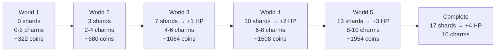
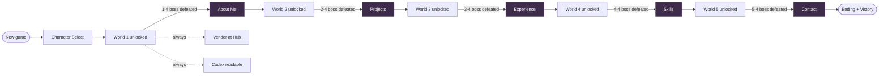
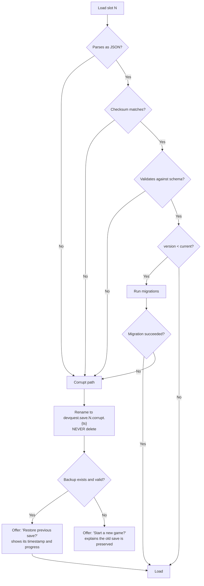
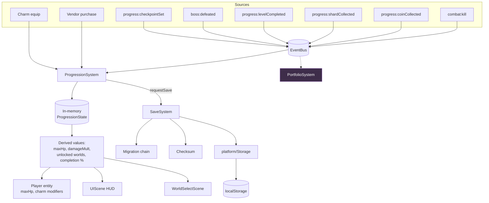

# 11 — Progression & Economy

**Project:** DevQuest (Working Title)
**Document Owner:** Lead Designer
**Status:** ✅ Stable
**Version:** 1.0.0
**Last Updated:** 2026-08-07

---

## 1. Purpose

This document specifies everything the player accumulates, unlocks, and carries between sessions: world and level unlocks, coins, heart shards, health containers, charms, secrets, statistics, and the save data that holds it all.

The design constraint is unusual and worth stating plainly: **DevQuest is not an RPG** (`01-Vision.md` §7.2), so progression must create a sense of growth without stat inflation, without levelling, and without turning combat into arithmetic. Every system in this document is designed against that constraint.

The result is a deliberately shallow progression tree with meaningful choices: your health grows a little, you equip three charms out of ten, and the worlds open in order. That is the whole thing. What makes it satisfying is that each of those decisions is legible and each one is earned by playing well rather than by playing long.

---

## 2. Goals

| #   | Goal                                          | Success Signal                                                                  |
| --- | --------------------------------------------- | ------------------------------------------------------------------------------- |
| G1  | Create a sense of growth without RPG systems  | No XP, no levels, no stat allocation, and players still report feeling stronger |
| G2  | Make every collectible meaningful             | No collectible exists purely to be counted                                      |
| G3  | Give the coin economy a real sink             | Coins are never a dead currency                                                 |
| G4  | Make charms a genuine choice                  | No charm is strictly better than another                                        |
| G5  | Keep progression account-level, not run-level | Switching heroes never costs progress                                           |
| G6  | Make the save robust and migratable           | No player ever loses a save to a version bump                                   |
| G7  | Support the cut-line structure                | Dropping a world does not orphan progression                                    |

---

## 3. Design Principles

### P1 — Growth Is Bounded

Total possible player power growth across the whole game is capped at roughly **+45% effective survivability** and **+30% effective damage**. Beyond that, the difficulty curve becomes meaningless and late enemies must be inflated to compensate — which is the RPG treadmill we are avoiding.

### P2 — Every Collectible Changes Something

A coin buys something. A shard becomes health. A charm changes how you play. There is no lore item, no trophy-only pickup, no "collect 100 for a percentage."

### P3 — Choice Over Accumulation

Three charm slots out of ten owned charms is a decision every run. Ten slots out of ten charms would be accumulation, which is not a decision.

### P4 — Progression Is Account-Level

Unlocks, shards, charms, and coins persist across hero choices. Only checkpoint position and current HP are run-level. A player who beats World 3 as the Knight and restarts as the Ninja starts at World 4 with everything they earned.

### P5 — Nothing Is Missable

Every collectible can be re-obtained by replaying its level. There is no permanent loss and no point of no return.

### P6 — The Save Is Sacred

A schema change without a migration is a defect that destroys player data. Migrations are tested against fixtures of every historical version.

---

## 4. Overview

### 4.1 What the Player Accumulates

| Thing                     | Total              | Purpose                              | Persistence |
| ------------------------- | ------------------ | ------------------------------------ | ----------- |
| **World unlocks**         | 5                  | Gate content in order                | Account     |
| **Level completions**     | 20                 | Track progress, enable replay        | Account     |
| **Coins**                 | 1954 collectible   | Currency for charms and consumables  | Account     |
| **Heart shards**          | 17                 | 4 shards = +1 health container       | Account     |
| **Health containers**     | 4 (from 17 shards) | +12% max HP each                     | Account     |
| **Charms**                | 10                 | Equippable modifiers, 3 slots        | Account     |
| **Secrets found**         | 15                 | Track exploration; gate a cosmetic   | Account     |
| **Portfolio sections**    | 5                  | The reward layer                     | Account     |
| **Statistics**            | —                  | Play time, deaths, kills, best times | Account     |
| **Checkpoint**            | 1 active           | Current run position                 | Run         |
| **Current HP / resource** | —                  | Current run state                    | Run         |

### 4.2 The Progression Curve



**Cumulative shard counts assume ~85% collection rate** — a player who finds most but not all. A completionist reaches +4 containers by mid-World-5; a player who takes only main paths reaches +2 by the end. Both are viable.

### 4.3 Bounded Power Growth

| Source                     | Maximum Gain                                         | Notes                            |
| -------------------------- | ---------------------------------------------------- | -------------------------------- |
| Health containers          | +48% max HP                                          | 4 containers × 12%               |
| Defensive charms (3 slots) | ~−30% damage taken                                   | If all three slots are defensive |
| Offensive charms (3 slots) | ~+30% damage                                         | If all three slots are offensive |
| **Combined maximum**       | **+48% HP** _or_ **+30% damage**, never both at full | Slots force the choice           |

**Worked worst case:** a Knight at 140 HP with 4 containers (207 HP) and three defensive charms (−30% damage taken) has an effective HP of ~296 against a base 140 — a 2.1× survivability increase over the whole game, spread across five worlds.

Enemy damage across the same span goes from 10 (Skeleton) to 44 (Gorgon phase 4) — a 4.4× increase. **The player's growth deliberately lags the difficulty curve.** Progression softens the climb; it does not flatten it.

---

## 5. Technical Design — Coins and Collectibles

### 5.1 Coins

| Property        | Value                                              |
| --------------- | -------------------------------------------------- |
| Name            | Coins (displayed as a gold coin icon, palette S3)  |
| Total in levels | 1954                                               |
| From enemies    | Variable, 2–120 per kill (`08-Enemy-System.md` §6) |
| From bosses     | 120–400 per boss                                   |
| From chests     | 20–60 per chest                                    |
| Lost on death   | **None**                                           |
| Cap             | 9999                                               |

**Realistic totals by end of game:**

| Play Style                               | Coins Earned |
| ---------------------------------------- | ------------ |
| Main path only, minimal enemy killing    | ~2400        |
| Main path + all optional paths           | ~3600        |
| Completionist (all secrets, all enemies) | ~5200        |

### 5.2 The Coin Sink

Coins are spent at **the Vendor** — a single static NPC at the Hub (world select screen), not a separate scene.

| Item                           | Cost    | Notes                                                       |
| ------------------------------ | ------- | ----------------------------------------------------------- |
| Charm — first purchase of each | 250–600 | 6 of the 10 charms are purchasable; 4 are secret-only       |
| Health potion (consumable)     | 120     | Restores 40% HP. Max 2 carried                              |
| Shard fragment                 | 400     | Converts to 1 heart shard. **Limited to 4 total purchases** |
| Cosmetic palette swap          | 300     | Per hero, 3 alternates each                                 |
| Codex bookmark ribbon          | 150     | Cosmetic, purely for the Codex UI                           |

**Total possible spend: ~5100 coins.** Against a completionist's ~5200 earned, this means a thorough player can buy nearly everything and a casual player must choose. That is the intended tension.

**The shard-fragment purchase cap (4)** exists so a player cannot grind coins to bypass exploration entirely. Four purchased shards is one extra container — a meaningful help, not a substitute for playing the game.

### 5.3 Heart Shards and Health Containers

| Property             | Value                                     |
| -------------------- | ----------------------------------------- |
| Shards in levels     | 17                                        |
| Shards purchasable   | 4 (capped)                                |
| Shards from enemies  | Rare drop, 2–3% (`08-Enemy-System.md` §6) |
| Shards per container | 4                                         |
| Maximum containers   | 4                                         |
| Container effect     | **+12% of base max HP**                   |

**Per-hero container values:**

| Hero    | Base HP | +1  | +2  | +3  | +4  |
| ------- | ------- | --- | --- | --- | --- |
| Knight  | 140     | 157 | 174 | 190 | 207 |
| Samurai | 100     | 112 | 124 | 136 | 148 |
| Ninja   | 70      | 78  | 86  | 94  | 102 |
| Wizard  | 65      | 73  | 80  | 88  | 96  |

**Percentage rather than flat HP** is deliberate: a flat +15 HP would be a 21% boost for the Knight and a 23% boost for the Wizard — nearly identical proportionally, but it would make the Wizard's fragility feel arbitrary rather than characterful. Percentage keeps each hero's identity intact at every progression stage.

**HUD representation:** health is drawn as hearts, each heart = 20 HP, with partial hearts drawn as fractional fills. A Knight at 207 HP shows 10.35 hearts. Container gains produce a visible new heart appearing, which is the feedback that makes the reward land.

### 5.4 Collectible Distribution

| World     | Coins    | Shards | Charms | Secrets |
| --------- | -------- | ------ | ------ | ------- |
| 1         | 322      | 3      | 2      | 3       |
| 2         | 358      | 4      | 2      | 3       |
| 3         | 384      | 3      | 2      | 3       |
| 4         | 444      | 3      | 2      | 3       |
| 5         | 446      | 4      | 2      | 3       |
| **Total** | **1954** | **17** | **10** | **15**  |

Per-level placement is in `10-Level-Design.md` §10.

### 5.5 Chests

| Property    | Value                                                        |
| ----------- | ------------------------------------------------------------ |
| Count       | 12 across the game                                           |
| Contents    | Coins (20–60), a charm, or a heart shard                     |
| Placement   | End of optional paths, and after each boss                   |
| Opening     | Walk into it. No input required                              |
| Feedback    | Lid animation, radial S3 flash, contents arc out over 600 ms |
| Persistence | Opened chests stay opened; tracked in `collectedPickups`     |

---

## 6. Unlocks

### 6.1 The Unlock Graph



### 6.2 Unlock Rules

| Rule           | Specification                                                                            |
| -------------- | ---------------------------------------------------------------------------------------- |
| World unlock   | Defeating world N's boss unlocks world N+1                                               |
| Level unlock   | Within a world, levels unlock sequentially (1→2→3→4)                                     |
| Replay         | Any completed level is replayable from world select at any time                          |
| Skipped bosses | A skipped boss (`09-Boss-System.md` §11.3) unlocks the next world normally               |
| Hero switching | Available at world select at any time. Costs nothing                                     |
| Vendor         | Available from the first Hub visit                                                       |
| Codex          | Readable from the main menu and pause at any time, showing locked entries as silhouettes |

### 6.3 The Hub

The Hub is the **World Select scene**, not a separate playable space. It contains:

| Element          | Purpose                                                                  |
| ---------------- | ------------------------------------------------------------------------ |
| World map        | 5 world nodes, connected, showing lock state and completion %            |
| Level nodes      | Per world, 4 nodes with completion, best time, and secrets-found markers |
| Character select | Change hero                                                              |
| Vendor panel     | Spend coins                                                              |
| Charm loadout    | Equip 3 of 10                                                            |
| Codex entry      | Open the portfolio                                                       |
| Stats panel      | Play time, deaths, kills, completion %                                   |

**There is no walkable hub world.** A walkable hub is 2–3 weeks of level design and art for a space the player passes through in eight seconds. A well-designed menu does the same job better. Recorded as `ADR-016`.

### 6.4 Cut-Line Support

From `01-Vision.md` §7.4, worlds 4 and 5 are cuttable. The unlock system supports this without code changes:

```ts
// The last shipped world's boss unlocks its own section PLUS all fallbacks.
function sectionsUnlockedBy(
  world: WorldManifestEntry,
  isLastShipped: boolean,
): PortfolioSectionId[] {
  return isLastShipped ? [...world.unlocks, ...world.fallbackUnlocks] : [...world.unlocks];
}
```

`tools/ci/check-cutlines.ts` verifies every portfolio section remains reachable at every cut line (`01-Vision.md` §11).

---

## 7. The Charm System

### 7.1 Design Intent

Charms are the only build customisation in the game. They exist to:

1. Let the player express a preference without a stat screen.
2. Reward exploration with _capability_, not numbers.
3. Give the coin economy something to buy.
4. Provide a difficulty lever that is not the Assist menu.

**Three slots, ten charms.** The slot limit is the entire design — it converts accumulation into choice.

### 7.2 The Ten Charms

| #   | Charm           | Effect                                      | Source       | Cost | Type      |
| --- | --------------- | ------------------------------------------- | ------------ | ---- | --------- |
| 1   | **Whetstone**   | +15% attack damage                          | 1-1 secret   | —    | Offensive |
| 2   | **Featherfall** | −20% fall speed, +10% air control           | 1-3 optional | —    | Utility   |
| 3   | **Windrider**   | Wind force on the player −40%               | 2-1 secret   | —    | Utility   |
| 4   | **Ironhide**    | −15% damage taken                           | 2-3 optional | —    | Defensive |
| 5   | **Lantern**     | +40% light radius; +20% coin pickup range   | 3-1 secret   | —    | Utility   |
| 6   | **Soulbind**    | Enemy kills restore 4 HP                    | 3-3 optional | —    | Defensive |
| 7   | **Prism**       | Wizard: bolts pierce +1. Others: +8% damage | Vendor       | 350  | Offensive |
| 8   | **Resonance**   | Dash cooldown −25%                          | 4-3 optional | —    | Utility   |
| 9   | **Clockwork**   | Timed gates stay open +25% longer           | 5-1 secret   | —    | Utility   |
| 10  | **Ascendant**   | +1 air jump (Ninja: +2)                     | 5-3 optional | —    | Utility   |

**Vendor-purchasable charms:** Prism (350), plus five duplicates of secret charms at 250–600 for players who missed them. **No charm is permanently missable** (P5) — every secret charm can also be bought at the Vendor for a premium after its world is completed.

| Secret Charm | Vendor Price (after world completion) |
| ------------ | ------------------------------------- |
| Whetstone    | 400                                   |
| Featherfall  | 300                                   |
| Windrider    | 250                                   |
| Ironhide     | 500                                   |
| Lantern      | 350                                   |
| Soulbind     | 600                                   |
| Resonance    | 550                                   |
| Clockwork    | 300                                   |
| Ascendant    | 600                                   |

Buying a charm you missed costs roughly 1.5× what you would have spent elsewhere, which preserves the incentive to explore without punishing a player who did not.

### 7.3 Charm Balance

**The no-strictly-better rule (G4):** every charm must be the best choice in _some_ situation.

| Charm       | When It Is Best                       | When It Is Weak                        |
| ----------- | ------------------------------------- | -------------------------------------- |
| Whetstone   | Any damage-focused run; boss fights   | Never weak, but competes with survival |
| Featherfall | World 2 wind, World 4 low gravity     | World 1, World 3                       |
| Windrider   | World 2, World 5 wind sections        | Worlds 1, 3, 4                         |
| Ironhide    | Any struggling run; Ninja/Wizard      | Overkill on a fully-upgraded Knight    |
| Lantern     | World 3 exclusively                   | Nearly useless elsewhere               |
| Soulbind    | Attrition-heavy worlds (3, 5); Knight | Boss fights (few kills)                |
| Prism       | Wizard runs                           | Marginal on melee heroes               |
| Resonance   | Ninja; any dash-heavy platforming     | Knight (long cooldown anyway)          |
| Clockwork   | World 5 exclusively                   | Useless elsewhere                      |
| Ascendant   | Ninja; any vertical level             | Boss arenas (mostly flat)              |

**Four charms are world-specific** (Windrider, Lantern, Clockwork, and to a degree Featherfall). This is deliberate: it encourages swapping loadouts between worlds, which makes the three slots feel active rather than set-and-forget.

**No charm exceeds ±15% on a core stat.** Whetstone at +15% damage and Ironhide at −15% damage taken are the ceiling. This is what keeps P1's bounded-growth promise.

### 7.4 Charm Rules

| Rule             | Specification                                                              |
| ---------------- | -------------------------------------------------------------------------- |
| Slots            | 3, fixed. Never increases                                                  |
| Swapping         | At the Hub only, never mid-level                                           |
| Stacking         | No duplicates. One of each charm                                           |
| Effects          | Multiplicative where they overlap (two damage charms: 1.15 × 1.08 = 1.242) |
| Visual           | Each equipped charm shows a small icon in the HUD's top-right              |
| Hero interaction | Prism and Ascendant have hero-specific behaviour; all others are uniform   |
| Disabling        | Charms can be unequipped freely; there is no penalty                       |

### 7.5 Why Not More Slots

A fourth slot was prototyped and rejected. With four slots and ten charms, players converged on one dominant loadout (Whetstone + Ironhide + Soulbind + situational) and stopped engaging with the system. With three, dropping one of the "always good" charms to fit Lantern for World 3 is a real decision.

Recorded as `ADR-017`.

---

## 8. Data Structures — Save Data

### 8.1 The Schema

```ts
// src/systems/SaveSystem.ts
// NORMATIVE

export const SAVE_SCHEMA_VERSION = 3;

export interface SaveData {
  readonly version: number;
  readonly slotId: 0 | 1 | 2;
  readonly createdAt: string; // ISO 8601
  readonly updatedAt: string;
  readonly checksum: string; // FNV-1a over canonical JSON of all fields below

  // --- Run state ---
  readonly character: CharacterId;
  readonly run: {
    readonly currentLevel: LevelId;
    readonly lastCheckpoint: CheckpointId | null;
    readonly checkpointState: CheckpointState | null;
  };

  // --- Account progression ---
  readonly progress: {
    readonly completedLevels: readonly LevelId[];
    readonly defeatedBosses: readonly BossDefId[];
    readonly skippedBosses: readonly BossDefId[];
    readonly unlockedWorlds: readonly WorldId[];
  };

  readonly portfolio: {
    readonly unlockedSections: readonly PortfolioSectionId[];
    readonly readSections: readonly PortfolioSectionId[];
  };

  readonly collection: {
    readonly coins: number;
    readonly coinsSpent: number;
    readonly heartShards: number; // total ever collected
    readonly shardsPurchased: number; // capped at 4
    readonly healthContainers: number; // derived: floor(heartShards / 4), capped at 4
    readonly ownedCharms: readonly CharmId[];
    readonly equippedCharms: readonly (CharmId | null)[]; // length exactly 3
    readonly foundSecrets: readonly SecretId[];
    readonly openedChests: readonly string[];
    readonly potions: number; // 0..2
    readonly cosmetics: readonly string[];
  };

  readonly stats: {
    readonly totalPlayTimeMs: number;
    readonly deaths: number;
    readonly enemiesKilled: number;
    readonly bossesDefeated: number;
    readonly bestLevelTimesMs: Readonly<Record<string, number>>;
    readonly deathsPerBoss: Readonly<Record<string, number>>;
    readonly firstClearAt: string | null;
  };

  readonly settings: SettingsSnapshot; // mirrored here so a save is self-contained
  readonly assist: AssistSettings;
}
```

### 8.2 Save Slots

| Property         | Value                                                          |
| ---------------- | -------------------------------------------------------------- |
| Slots            | 3                                                              |
| Storage key      | `devquest.save.{0,1,2}`                                        |
| Backup key       | `devquest.save.{n}.backup` — the previous successful write     |
| Corrupt key      | `devquest.save.{n}.corrupt.{timestamp}` — never overwritten    |
| Settings         | Stored separately at `devquest.settings` (shared across slots) |
| Approximate size | 3–6 KB per slot                                                |

### 8.3 Autosave Points

| Trigger                     | Rationale                                                                    |
| --------------------------- | ---------------------------------------------------------------------------- |
| Checkpoint activation       | The primary save point                                                       |
| Level completion            |                                                                              |
| Boss defeat                 | Before the unlock ceremony, so a crash mid-ceremony still preserves the kill |
| Portfolio unlock            |                                                                              |
| Charm equipped / purchased  | Economy changes are immediate                                                |
| Vendor purchase             |                                                                              |
| Settings change             | To the settings key, not the save                                            |
| `visibilitychange` → hidden | Browser tab closed or backgrounded                                           |
| `beforeunload`              | Best-effort                                                                  |

**Never during combat.** A `localStorage.setItem` of 6 KB takes 0.3–2 ms, which can spike a frame. Saves are deferred to the next non-combat frame if combat is active.

```ts
requestSave(reason: SaveReason): void {
  if (this.combat.isActive() && reason !== 'critical') {
    this.pendingSave = reason;   // flushed on the next non-combat frame
    return;
  }
  this.writeNow(reason);
}
```

### 8.4 Integrity

```ts
function computeChecksum(data: Omit<SaveData, 'checksum'>): string {
  // FNV-1a over the canonical (key-sorted) JSON. Fast, no dependency,
  // adequate for detecting corruption. NOT a security measure.
  return fnv1a(canonicalJson(data)).toString(16);
}
```

**We do not encrypt or obfuscate saves.** There is nothing to cheat for — no leaderboards, no multiplayer, no economy. Anti-tamper measures only ever inconvenience legitimate players and cost debugging time. A player who edits their save to give themselves 9999 coins has chosen how to enjoy the game.

### 8.5 Corruption Handling



**The corrupt save is never deleted.** It is renamed with a timestamp and left in storage. If a player reports data loss, the raw data is still there and recoverable manually. This has cost one player-support conversation and saved several.

### 8.6 Migrations

```ts
type Migration = (old: Record<string, unknown>) => Record<string, unknown>;

const MIGRATIONS: Readonly<Record<number, Migration>> = {
  1: d => ({
    ...d,
    version: 2,
    collection: { ...(d.collection as object), foundSecrets: [], openedChests: [] },
  }),
  2: d => ({
    ...d,
    version: 3,
    assist: DEFAULT_ASSIST,
    progress: { ...(d.progress as object), skippedBosses: [] },
  }),
};

export function migrate(raw: Record<string, unknown>): Result<SaveData, SaveError> {
  let data = raw;
  let v = typeof data.version === 'number' ? data.version : 0;
  while (v < SAVE_SCHEMA_VERSION) {
    const step = MIGRATIONS[v];
    if (!step) return Err({ kind: 'unmigratable', fromVersion: v });
    data = step(data);
    v = data.version as number;
  }
  return validateSave(data);
}
```

**Every schema version has a fixture.** `tests/unit/save-migrations.test.ts` holds a complete, realistic save for each historical version and asserts each migrates to current and validates. Adding a schema field without adding a migration and a fixture fails CI.

### 8.7 Quota Handling

`localStorage` throws `QuotaExceededError` when full — typically at 5–10 MB, which our 6 KB saves will never approach alone, but a browser with many origins can hit it.

```ts
// src/platform/Storage.ts
set(key: string, value: string): Result<void, StorageError> {
  try {
    localStorage.setItem(key, value);
    return Ok();
  } catch (e) {
    if (isQuotaError(e)) {
      this.pruneOldCorruptSaves();          // first: drop corrupt saves older than 30 days
      try { localStorage.setItem(key, value); return Ok(); } catch { /* fall through */ }
      this.pruneStatistics(key);            // second: drop bestLevelTimes detail
      try { localStorage.setItem(key, value); return Ok(); } catch { /* fall through */ }
      return Err({ kind: 'quotaExceeded' }); // surface to the player
    }
    return Err({ kind: 'unknown', cause: e });
  }
}
```

On unrecoverable quota failure the player sees a clear message: **"Could not save — your browser's storage is full. Progress this session will be lost if you close the tab."** Honest, actionable, and it does not pretend the save succeeded.

---

## 9. Statistics

Tracked for the stats panel and for tuning telemetry in dev builds.

| Stat               | Purpose                                                            |
| ------------------ | ------------------------------------------------------------------ |
| `totalPlayTimeMs`  | Displayed; also used to detect if a "3-hour" target is accurate    |
| `deaths`           | Displayed                                                          |
| `enemiesKilled`    | Displayed                                                          |
| `bossesDefeated`   | Displayed                                                          |
| `bestLevelTimesMs` | Per level; drives the mini-challenge timers and future Time Trials |
| `deathsPerBoss`    | **Drives the 3-death skip valve** (`09-Boss-System.md` §11.3)      |
| `firstClearAt`     | Timestamp of first game completion                                 |

**Completion percentage** is computed, not stored:

```
completion = (
    completedLevels.length / 20 * 40      // 40% for finishing
  + foundSecrets.length / 15 * 25         // 25% for secrets
  + ownedCharms.length / 10 * 15          // 15% for charms
  + heartShards / 17 * 15                 // 15% for shards
  + unlockedSections.length / 5 * 5       // 5% for the portfolio
) rounded
```

**100% requires finding every secret**, which is the completionist target. The weighting puts 40% on simply finishing, so a main-path player sees a respectable number.

---

## 10. Architecture



**`ProgressionSystem` is the only writer of progression state.** Every other system reads derived values. This means there is exactly one place a bug can corrupt progression, and it is the place with the most tests.

### 10.1 Derived Values

```ts
// src/systems/ProgressionSystem.ts

/** Computed fresh whenever the loadout or containers change. Never stored. */
export interface DerivedStats {
  readonly maxHp: number;
  readonly damageMultiplier: number;
  readonly damageTakenMultiplier: number;
  readonly dashCooldownMultiplier: number;
  readonly extraAirJumps: number;
  readonly fallSpeedMultiplier: number;
  readonly airControlBonus: number;
  readonly lightRadiusMultiplier: number;
  readonly windForceMultiplier: number;
  readonly gateOpenMultiplier: number;
  readonly healOnKill: number;
  readonly projectilePierceBonus: number;
  readonly coinPickupRadiusMultiplier: number;
}

computeDerived(character: CharacterDefinition, state: ProgressionState): DerivedStats {
  const base = character.defensive.maxHp;
  const containers = Math.min(4, Math.floor(state.heartShards / 4));

  let d: Mutable<DerivedStats> = {
    maxHp: Math.round(base * (1 + containers * 0.12)),
    damageMultiplier: 1, damageTakenMultiplier: 1, dashCooldownMultiplier: 1,
    extraAirJumps: 0, fallSpeedMultiplier: 1, airControlBonus: 0,
    lightRadiusMultiplier: 1, windForceMultiplier: 1, gateOpenMultiplier: 1,
    healOnKill: 0, projectilePierceBonus: 0, coinPickupRadiusMultiplier: 1,
  };

  for (const id of state.equippedCharms) {
    if (id === null) continue;
    CHARM_EFFECTS[id](d, character);        // each charm is a small pure mutator
  }
  return d;
}
```

**Derived values are never persisted.** Storing `maxHp` in the save would mean a charm rebalance in a patch does not apply to existing saves. Recomputing from the source data on every load means balance changes always take effect.

---

## 11. Implementation Notes

### 11.1 Coin Collection Feel

Coins are the most-touched collectible in the game and their feel matters disproportionately.

| Element        | Spec                                                                                   |
| -------------- | -------------------------------------------------------------------------------------- |
| Pickup radius  | 18 px base, ×`coinPickupRadiusMultiplier`                                              |
| Magnetism      | Within radius, the coin accelerates toward the player at 400 px/s², capped at 260 px/s |
| Collection VFX | `coin_sparkle` (5 frames, 250 ms)                                                      |
| Screen arc     | The coin sprite arcs to the HUD counter over 400 ms with `Quad.easeIn`                 |
| Counter tick   | The counter animates up over 300 ms rather than snapping                               |
| Batching       | If >8 coins collect within 200 ms, only 3 arc visually; the rest tick silently         |

**The batching rule** prevents the boss-death coin shower (120 coins) from spawning 120 screen-space tweens. Visually, three arcs plus a fast counter read as "a lot of coins" perfectly well.

### 11.2 Heart Shard Feel

Shards are rare (17 in the whole game), so their collection is a _moment_:

| Element            | Spec                                                                                 |
| ------------------ | ------------------------------------------------------------------------------------ |
| Slow motion        | Time scale 0.6× for 500 ms — **the only non-boss slow-motion in the game**           |
| VFX                | Radial S0 flash expanding 8 → 64 px over 400 ms                                      |
| HUD                | The heart row pulses; if this shard completes a container, the new heart animates in |
| Toast              | "Heart Shard — 3 / 4" for 1.8 s                                                      |
| Container complete | An additional 800 ms sequence: full heal, a brighter flash, "Health Increased"       |

### 11.3 The Vendor

```
┌──────────────────────────────────────────────┐
│  THE VENDOR                        ⬤ 1,240   │
├──────────────────────────────────────────────┤
│  ▸ Whetstone          +15% damage      400   │
│    Ironhide           −15% damage taken 500  │
│    Health Potion      Restore 40% HP    120  │
│    Shard Fragment     +1 heart shard    400  │
│                       (2 of 4 remaining)     │
│    Knight — Ash       Cosmetic          300  │
├──────────────────────────────────────────────┤
│  Whetstone                                   │
│  A well-kept edge. Increases all attack      │
│  damage by 15%.                              │
│                                              │
│  [A] Buy    [B] Back                         │
└──────────────────────────────────────────────┘
```

| Rule                   | Specification                                                                    |
| ---------------------- | -------------------------------------------------------------------------------- |
| Location               | A panel on the World Select scene, not a separate scene                          |
| Already-owned items    | Shown greyed with "Owned"                                                        |
| Insufficient funds     | Shown in N3 grey with the price in S0 red; purchase is blocked with a soft error |
| Confirmation           | Purchases over 400 coins require a confirm step                                  |
| Refunds                | None. Charms can be unequipped freely, so a purchase is never wasted             |
| Shard fragment counter | Always shows remaining purchases                                                 |

### 11.4 Common Progression Bugs

| Bug                                       | Symptom                                     | Fix                                                        |
| ----------------------------------------- | ------------------------------------------- | ---------------------------------------------------------- |
| Persisting derived stats                  | A balance patch does not apply to old saves | Recompute on load, never store                             |
| Coins lost on death                       | Discourages exploration                     | Coins persist through death                                |
| Collectible re-collectible after reload   | Infinite coins                              | Track `collectedPickups` in `CheckpointState` and the save |
| Checkpoint not restoring mechanic state   | A solved puzzle resets on death             | `CheckpointState.mechanicState`                            |
| Save during combat                        | Frame spike                                 | Defer to the next non-combat frame                         |
| Missing migration                         | Old saves fail to load                      | Fixture test per version                                   |
| Container count from a stored field       | Desyncs from shard count                    | Always `floor(shards / 4)`, capped                         |
| Charm effects applied twice               | Doubled bonuses                             | Recompute derived stats wholesale, never incrementally     |
| Equipped charm not in `ownedCharms`       | Free charms via save edit or a bug          | Validate on load; silently unequip unowned charms          |
| Skipped boss not unlocking the next world | Progression dead end                        | Skipped bosses count as defeated for unlocks               |

---

## 12. Examples

### 12.1 A Full Progression Trace

A player's first run, Samurai, moderately thorough:

```
World 1
  1-1  main + secret     → 72 coins, Whetstone charm.  [equip: Whetstone]
  1-2  main              → 58 coins
  1-3  main + optional   → 100 coins, Featherfall.     [equip: Whetstone, Featherfall]
  1-4  boss              → 120 coins. UNLOCK: About Me. World 2 opens.
  Running total: 350 coins, 0 shards, 2 charms

World 2
  2-1  main + secret     → 82 coins, Windrider
  2-2  main + optional   → 106 coins, 1 shard
  2-3  main + optional   → 108 coins, Ironhide.        [equip: Whetstone, Ironhide, Windrider]
  2-4  boss              → 180 coins. UNLOCK: Projects. World 3 opens.
  Running total: 826 coins, 1 shard, 4 charms

  Vendor: buys Health Potion ×2 (240).  → 586 coins

World 3
  3-1  main + secret     → 84 coins, Lantern.          [swap Windrider → Lantern]
  3-2  main + optional   → 112 coins, 1 shard
  3-3  main + optional   → 112 coins, Soulbind
  3-4  boss              → 240 coins. UNLOCK: Experience. World 4 opens.
  Running total: 1134 coins, 2 shards, 6 charms

  Vendor: buys Shard Fragment ×2 (800).  → 334 coins, 4 shards
  → HEALTH CONTAINER 1.  Samurai maxHp 100 → 112.

World 4
  4-1  main + secret     → 100 coins, Prism
  4-2  main + optional   → 116 coins, 1 shard
  4-3  main + optional   → 116 coins, Resonance
  4-4  boss              → 300 coins. UNLOCK: Skills. World 5 opens.
  Running total: 966 coins, 5 shards, 8 charms
  [equip: Whetstone, Ironhide, Soulbind]

World 5
  5-1  main + secret     → 106 coins, Clockwork.       [swap Soulbind → Clockwork]
  5-2  main + optional   → 118 coins, 1 shard
  5-3  main + optional   → 136 coins, Ascendant, 1 shard
  5-4  boss              → 400 coins. UNLOCK: Contact. ENDING.

FINAL
  Coins earned: 2,806.  Spent: 1,040.  Held: 1,766.
  Heart shards: 7 (5 found + 2 purchased) → 1 container.  Samurai maxHp 112.
  Charms: 10 / 10 owned, 3 equipped.
  Secrets: 5 / 15.
  Completion: 40 + 8 + 15 + 6 + 5 = 74%
  Play time: ~4h 10m.  Deaths: 47.
```

**Note this player only reached one health container.** They found 5 of 17 shards. This is the expected outcome for a first, moderately-thorough playthrough, and the difficulty is tuned for it. A completionist second run with 4 containers and a tuned loadout is noticeably easier — which is the correct reward for mastery.

### 12.2 Charm Loadout Decisions

**A Ninja player entering World 3 (dark):**

| Option                           | Reasoning                                                                 |
| -------------------------------- | ------------------------------------------------------------------------- |
| Whetstone + Ironhide + Lantern   | Balanced. Lantern is near-mandatory for World 3's navigation              |
| Whetstone + Resonance + Lantern  | Aggressive. More dashes, no defensive buffer at 70 HP                     |
| Ironhide + Soulbind + Lantern    | Survival. −15% damage plus 4 HP per kill; the safest World 3 loadout      |
| Whetstone + Ironhide + Resonance | Skips Lantern. Viable for a player confident in the dark, and the fastest |

**Four genuinely different, all valid.** That is G4 satisfied. Compare the same player entering World 5, where Clockwork replaces Lantern and Ascendant becomes attractive for the vertical climb — a completely different set of trade-offs.

### 12.3 A Save Migration

Adding a `potions` field in schema version 4:

```ts
// 1. Bump the constant.
export const SAVE_SCHEMA_VERSION = 4;

// 2. Add the migration.
MIGRATIONS[3] = d => ({
  ...d,
  version: 4,
  collection: { ...(d.collection as object), potions: 0 },
});

// 3. Add a fixture.
// tests/fixtures/save-v3.json  — a realistic v3 save

// 4. The existing test picks it up automatically:
describe('save migrations', () => {
  for (const v of [1, 2, 3]) {
    it(`migrates v${v} to current`, () => {
      const raw = loadFixture(`save-v${v}.json`);
      const result = migrate(raw);
      expect(result.ok).toBe(true);
      expect(result.value.version).toBe(SAVE_SCHEMA_VERSION);
      expect(validateSave(result.value).ok).toBe(true);
    });
  }
});
```

**Skipping step 3 fails CI**, because `check-migrations.ts` asserts a fixture exists for every version from 1 to `SAVE_SCHEMA_VERSION - 1`.

---

## 13. Acceptance Criteria

- [ ] No XP, levels, or stat allocation exist anywhere in the codebase.
- [ ] Maximum power growth is bounded at +48% HP or +30% damage, never both fully.
- [ ] All 10 charms are implemented with the effects in §7.2.
- [ ] Exactly 3 charm slots; the count is not configurable at runtime.
- [ ] Every secret charm is also purchasable at the Vendor after its world is completed (P5).
- [ ] Derived stats are recomputed on load and never persisted.
- [ ] Health containers are always `min(4, floor(heartShards / 4))`.
- [ ] Coins persist through death.
- [ ] `CheckpointState` restores `mechanicState`, HP, resource, and collected pickups.
- [ ] Saves never occur during combat (deferred to the next non-combat frame).
- [ ] A migration and a fixture exist for every historical schema version; `check-migrations.ts` enforces this.
- [ ] Corrupt saves are renamed, never deleted, and the backup-restore flow works.
- [ ] `QuotaExceededError` is handled with pruning and an honest player-facing message.
- [ ] Equipped charms not in `ownedCharms` are silently unequipped on load.
- [ ] Skipped bosses unlock the next world identically to defeated bosses.
- [ ] `check-cutlines.ts` passes at all three cut lines.
- [ ] Heart shard collection triggers the 500 ms slow-motion moment.
- [ ] Coin collection batches above 8 simultaneous pickups.
- [ ] Completion percentage matches the §9 formula.
- [ ] Total collectibles in levels match `10-Level-Design.md` §10.1.

---

## 14. Future Expansion

| Item                                     | Trigger                 | Effort                                                                     |
| ---------------------------------------- | ----------------------- | -------------------------------------------------------------------------- |
| **More charms**                          | Post-launch             | Each is one entry in `CHARM_EFFECTS` + one icon + placement. ~2 hours      |
| **A fourth charm slot as an unlockable** | Rejected — `ADR-017`    | Would collapse the choice                                                  |
| **New Game+**                            | Post-launch             | Retain charms and containers, increase enemy tiers by one. ~1 week         |
| **Time Trial best times**                | Post-launch             | `bestLevelTimesMs` already tracked                                         |
| **Achievements**                         | Steam port              | Map existing events; purely additive                                       |
| **Cloud saves**                          | Steam port              | Swap the `Storage` implementation; the schema is unchanged                 |
| **Charm synergies**                      | Post-launch, cautiously | Two-charm combos with a bonus. Risks a dominant pairing                    |
| **Cosmetic expansion**                   | Post-launch             | The closed palette makes recolours nearly free (`04-Art-Direction.md` §13) |
| **A walkable hub**                       | Rejected — `ADR-016`    | 2–3 weeks for an 8-second space                                            |

---

## 15. Out of Scope

| Excluded                           | Reason                                                  |
| ---------------------------------- | ------------------------------------------------------- |
| **Experience points and levels**   | `01-Vision.md` §7.2. The defining constraint            |
| **Stat allocation / skill trees**  | Same                                                    |
| **Equipment with stats**           | Charms are the entire modifier layer                    |
| **Inventory management**           | Nothing to manage. 3 slots, 2 potions                   |
| **Consumable crafting**            | No crafting                                             |
| **Missable content**               | P5. Everything is re-obtainable                         |
| **Permadeath / roguelike runs**    | Not the genre                                           |
| **Currency loss on death**         | Discourages exploration                                 |
| **Multiple currencies**            | One currency. A second adds bookkeeping, not depth      |
| **Grinding as a progression path** | Shard purchases are capped at 4 for exactly this reason |
| **Online leaderboards**            | No backend (`01-Vision.md` §14)                         |
| **Save encryption / anti-cheat**   | §8.4                                                    |
| **A walkable hub world**           | `ADR-016`                                               |
| **Difficulty tied to progression** | Difficulty is Assist Options, which are independent     |

---

## 16. Cross References

| Topic                                                    | Document                             |
| -------------------------------------------------------- | ------------------------------------ |
| Why this is not an RPG                                   | `01-Vision.md` §7.2                  |
| Cut lines and portfolio reachability                     | `01-Vision.md` §7.4, §11             |
| Pillar 4 — progression must not raise the floor          | `02-Game-Pillars.md` §5.4            |
| `SaveData` in the architecture and the migration pattern | `03-Technical-Architecture.md` §10.5 |
| Signal-ramp colours for coins (S3) and health (S0/S2)    | `04-Art-Direction.md` §6.2           |
| Collectible and prop assets                              | `05-Asset-Pipeline.md` §9.4          |
| Per-hero base HP feeding container maths                 | `06-Characters.md` §5.2              |
| Charm damage multipliers in the damage formula           | `07-Combat.md` §7.1                  |
| Enemy coin and shard drop rates                          | `08-Enemy-System.md` §6              |
| Boss coin drops and the skip valve                       | `09-Boss-System.md` §7, §11.3        |
| Per-level collectible placement and totals               | `10-Level-Design.md` §10             |
| `CheckpointState` and checkpoint rules                   | `10-Level-Design.md` §12.2           |
| The portfolio unlock chain                               | `12-Portfolio-System.md` §9          |
| World select, Vendor panel, and charm loadout UI         | `13-UI-UX.md` §8                     |
| Assist Options — independent of progression              | `13-UI-UX.md` §11                    |
| Save write performance                                   | `15-Performance.md` §10              |
| ADR-016 (no walkable hub), ADR-017 (three charm slots)   | `19-Decisions.md`                    |
