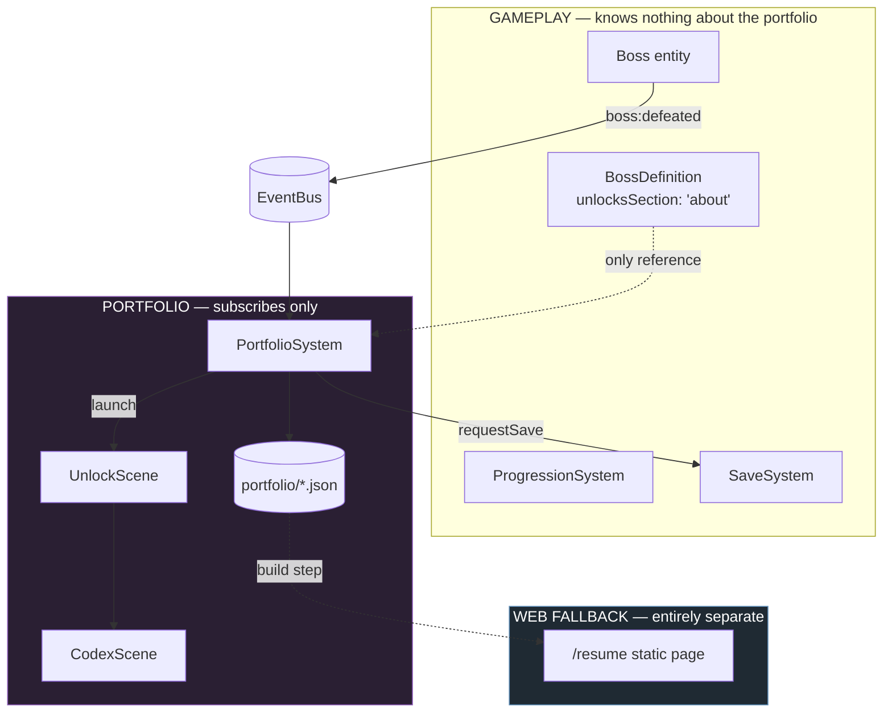
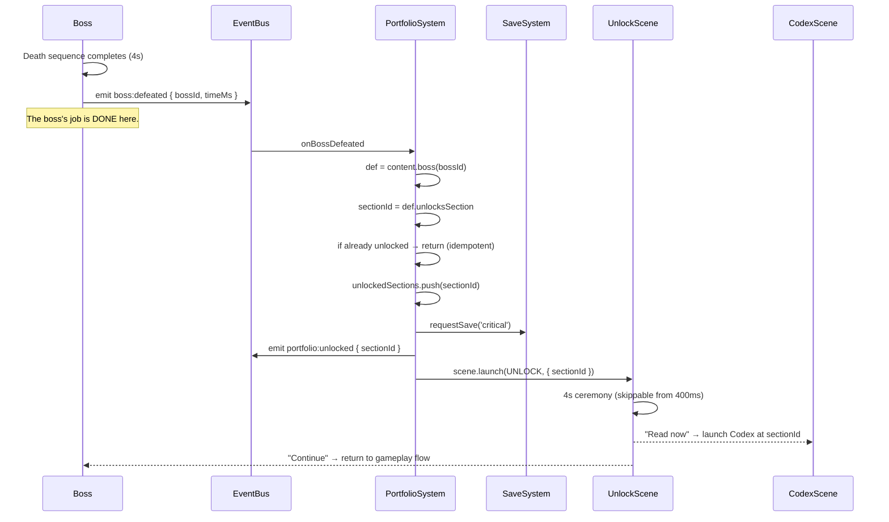

# 12 — Portfolio System (The Codex)

**Project:** DevQuest (Working Title)
**Document Owner:** Game Director
**Status:** ✅ Stable
**Version:** 1.0.0
**Last Updated:** 2026-08-07

---

## 1. Purpose

This document specifies the Codex — the in-game system that presents the developer's portfolio as a reward for defeating bosses.

It is the shortest-leverage, highest-risk document in the set. Shortest-leverage because the system is genuinely small: five JSON files, one scene, one 4-second ceremony, one event listener. Highest-risk because this is the system most likely to grow until it eats the game, and the one most likely to compromise the architecture through well-intentioned coupling.

The governing constraint is the **Deletion Test** (`01-Vision.md` §4.4), restated here as an engineering requirement:

> Deleting `src/portfolio/`, `src/scenes/CodexScene.ts`, `src/scenes/UnlockScene.ts`, and `public/assets/data/portfolio/` must leave a game that builds, runs, and can be completed.

Every decision in this document is subordinate to that requirement. Where a nicer-feeling design would require coupling, the coupling loses.

---

## 2. Goals

| #   | Goal                                                   | Success Signal                                              |
| --- | ------------------------------------------------------ | ----------------------------------------------------------- |
| G1  | Present portfolio content as an earned reward          | Players report wanting to read it, not skipping it          |
| G2  | Maintain zero gameplay coupling                        | The Deletion Test passes at every milestone                 |
| G3  | Make content authorable without engineering            | The developer edits JSON and Markdown, never TypeScript     |
| G4  | Make the Codex readable at 320×180                     | A 400-word section is comfortably readable, not squinted at |
| G5  | Guarantee reachability regardless of skill             | Every section reachable by a player who cannot beat a boss  |
| G6  | Provide a non-game path to the same information        | `/resume` exists, is fast, accessible, and linked           |
| G7  | Keep the unlock ceremony under 4 seconds and skippable | No player is ever trapped in a celebration                  |

---

## 3. Design Principles

### P1 — The Portfolio Is a Trophy Shelf, Not a Room You Walk Through

It is reached from a menu, read at leisure, and closed. It never blocks, never interrupts beyond the 4-second ceremony, and never gates gameplay.

### P2 — Zero Gameplay Coupling

The portfolio system **subscribes** to gameplay events. Gameplay does not know it exists. There is exactly one field anywhere in gameplay data that references the portfolio: `BossDefinition.unlocksSection`.

### P3 — Earned, Then Always Available

Once unlocked, a section is permanently readable from the main menu, the pause menu, and world select. Re-reading is one button press away.

### P4 — Legible Before Earned

Locked sections appear as silhouettes with their title visible. The player always knows what they are working toward. A mystery box is not motivating; a visible locked door is.

### P5 — Content Is Data

Section text lives in JSON with a constrained rich-text format. Changing a job title is a content edit, not a deploy-blocking code change.

### P6 — The Web Fallback Is Not Optional

A plain, fast, accessible HTML résumé at `/resume` ships alongside the game and is linked from the title screen. Someone who does not want to play a game must still be able to read the CV in eight seconds. This is in scope and is a shipping requirement (`01-Vision.md` §7.3).

---

## 4. Overview

### 4.1 The Five Sections

| Section        | Unlocked By                | Content Shape                                            | Target Length |
| -------------- | -------------------------- | -------------------------------------------------------- | ------------- |
| **About Me**   | Skeleton Warlord (World 1) | Prose bio + a short "how I work" list                    | 250–350 words |
| **Projects**   | Alpha Werewolf (World 2)   | 4–6 project cards: title, role, stack, outcome, link     | 400–600 words |
| **Experience** | Oni Lord (World 3)         | Timeline of roles: company, title, dates, 3 bullets each | 400–600 words |
| **Skills**     | Golem Sovereign (World 4)  | Grouped skill lists with proficiency indicators          | 200–300 words |
| **Contact**    | Gorgon (World 5)           | Email, GitHub, LinkedIn, site, plus a closing note       | 100–150 words |

**Total portfolio content: roughly 1,400–2,000 words.** That is a deliberate ceiling. A recruiter reads a résumé in 90 seconds; presenting 5,000 words in a pixel-art Codex would be worse than a PDF.

### 4.2 System Boundary



**The entire coupling surface:**

1. `BossDefinition.unlocksSection: PortfolioSectionId` — one string field in gameplay data.
2. `PortfolioSystem` subscribes to `boss:defeated`.
3. `SaveData.portfolio` — two arrays in the save schema.
4. Three menu entries pointing at `CodexScene`.

That is it. Four touch points, all removable in under an hour.

### 4.3 The Unlock Flow



**`PortfolioSystem.onBossDefeated` is idempotent.** Re-fighting a boss re-emits `boss:defeated`, and the system returns early rather than re-running the ceremony. A player replaying World 1 for coins does not sit through the About Me unlock again.

---

## 5. Technical Design — The Deletion Test

### 5.1 The Procedure

Run at milestones M3, M6, M9, and M11:

```bash
git checkout -b deletion-test-$(date +%Y%m%d)

rm -rf src/portfolio/
rm src/scenes/CodexScene.ts
rm src/scenes/UnlockScene.ts
rm -rf public/assets/data/portfolio/

# Remove the four touch points:
#  1. PortfolioSystem from SYSTEM_ORDER and SystemFactory
#  2. 'portfolio' from the Services interface and BootScene registration
#  3. Codex entries from TitleScene, PauseScene, WorldSelectScene menus
#  4. SaveData.portfolio field + its migration no-op

npm run typecheck && npm run build && npm run test:e2e:full-clear
```

**Pass condition:** the build succeeds, and the E2E test that completes all five worlds passes.

**`unlocksSection` is deliberately left in the boss JSON.** It is an unused string field, which is harmless. Removing it would require touching five content files and the schema, and the point of the test is to prove the _code_ is decoupled.

### 5.2 What Would Fail the Test

Recorded as an anti-pattern register, because these are the specific temptations:

| Anti-Pattern                                  | Why It Is Tempting                  | Why It Fails                                       |
| --------------------------------------------- | ----------------------------------- | -------------------------------------------------- |
| A door that opens only after reading About Me | "Ties the portfolio into the world" | Gameplay now depends on the portfolio. Fatal       |
| A charm awarded for reading all five sections | "Rewards engagement"                | `ProgressionSystem` would import `PortfolioSystem` |
| HUD element showing portfolio progress        | "Reminds the player"                | UI coupling, and it violates P1                    |
| A boss whose attacks reference a project      | "Thematic"                          | Boss design now depends on portfolio content       |
| Portfolio content shown on loading screens    | "Uses dead time"                    | `PreloadScene` would import portfolio data         |
| An enemy named after a former employer        | "Fun"                               | Enemy content depends on portfolio content         |
| Codex reading required to unlock a hero       | "Motivation"                        | Hard gate. Catastrophic                            |

**The permitted version of "rewards engagement":** the Codex tracks `readSections` in the save and shows a completion marker _inside the Codex_. Nothing outside the Codex knows or cares.

### 5.3 The One Allowed Reference

```ts
// src/data/schemas/boss.schema.ts
export interface BossDefinition {
  // … 40 lines of fight specification …

  /**
   * PORTFOLIO LAYER — the only portfolio reference in gameplay data.
   * Read exclusively by PortfolioSystem via the boss:defeated listener.
   * No gameplay code reads this field.
   */
  readonly unlocksSection: PortfolioSectionId;
}
```

An ESLint rule enforces this:

```js
// Only PortfolioSystem may read `unlocksSection`.
'no-restricted-syntax': ['error', {
  selector: "MemberExpression[property.name='unlocksSection']",
  message: 'unlocksSection may only be read in src/portfolio/PortfolioSystem.ts',
}],
// …with an override in eslint.config.js scoping src/portfolio/** out of this rule.
```

---

## 6. Data Structures — The Content Model

### 6.1 The Section Schema

```ts
// src/data/schemas/portfolio.schema.ts
// NORMATIVE

export type PortfolioSectionId = 'about' | 'projects' | 'experience' | 'skills' | 'contact';

export type PortfolioBlock =
  | { readonly kind: 'heading'; readonly text: string; readonly level: 1 | 2 }
  | { readonly kind: 'paragraph'; readonly text: RichText }
  | { readonly kind: 'list'; readonly items: readonly RichText[]; readonly ordered: boolean }
  | { readonly kind: 'divider' }
  | { readonly kind: 'spacer'; readonly height: 4 | 8 | 12 }
  | {
      readonly kind: 'card';
      readonly title: string;
      readonly subtitle?: string;
      readonly meta?: string; // "2024 · TypeScript, Phaser"
      readonly body: RichText;
      readonly tags?: readonly string[];
      readonly link?: PortfolioLink;
      readonly iconFrame?: string;
    }
  | {
      readonly kind: 'timelineEntry';
      readonly title: string; // job title
      readonly org: string;
      readonly period: string; // "Mar 2023 — Present"
      readonly bullets: readonly RichText[];
      readonly iconFrame?: string;
    }
  | {
      readonly kind: 'skillGroup';
      readonly label: string;
      readonly skills: readonly {
        readonly name: string;
        readonly level: 1 | 2 | 3 | 4 | 5;
        readonly note?: string;
      }[];
    }
  | {
      readonly kind: 'contactRow';
      readonly label: string;
      readonly value: string;
      readonly link?: PortfolioLink;
      readonly iconFrame: string;
    };

export interface PortfolioLink {
  readonly url: string;
  readonly label: string;
  /** External links open in a new tab with rel="noopener noreferrer". */
  readonly external: true;
}

/**
 * A constrained rich-text string. Supported inline markers only:
 *   *emphasis*        → S4 accent colour
 *   **strong**        → N7 bright
 *   `code`            → N5 with an N1 background chip
 *   [label](url)      → S4 with an underline; opens externally
 * Everything else is literal. No HTML, no arbitrary markdown.
 */
export type RichText = string;

export interface PortfolioSection {
  readonly id: PortfolioSectionId;
  readonly title: string;
  readonly subtitle: string;
  readonly iconFrame: string; // 16×16 icon in the core atlas
  readonly unlockedBy: BossDefId;
  readonly order: 1 | 2 | 3 | 4 | 5;
  readonly lockedTeaser: string; // shown on the locked silhouette
  readonly blocks: readonly PortfolioBlock[];
  /** Estimated read time in seconds, computed at build from word count. */
  readonly readTimeSec: number;
}
```

### 6.2 Why a Constrained Format Rather Than Markdown

Full Markdown would need a parser, a renderer for every element type, and a plan for what happens when someone writes a table or an image. At 320×180 with a bitmap font, most Markdown elements have no sensible rendering.

The block model has **nine block types**, each with a hand-designed pixel-perfect layout. The inline rich-text format has **four markers**. That is enough to express a professional portfolio and small enough to render correctly every time.

The parser is ~60 lines:

```ts
// src/portfolio/RichTextParser.ts
const INLINE = /(\*\*[^*]+\*\*|\*[^*]+\*|`[^`]+`|\[[^\]]+\]\([^)]+\))/g;

export function parseRichText(src: string): readonly RichSpan[] {
  const spans: RichSpan[] = [];
  let last = 0;
  for (const m of src.matchAll(INLINE)) {
    if (m.index! > last) spans.push({ kind: 'text', text: src.slice(last, m.index) });
    spans.push(classify(m[0]!));
    last = m.index! + m[0]!.length;
  }
  if (last < src.length) spans.push({ kind: 'text', text: src.slice(last) });
  return spans;
}
```

### 6.3 Example Content — About Me

```json
{
  "$schema": "../../../schemas/portfolio.schema.json",
  "id": "about",
  "title": "About Me",
  "subtitle": "Who you would be hiring",
  "iconFrame": "icon_codex_about",
  "unlockedBy": "skeleton_warlord",
  "order": 1,
  "lockedTeaser": "Defeat the Skeleton Warlord to learn who built this.",
  "blocks": [
    {
      "kind": "paragraph",
      "text": "I build things that have to work — **web applications**, **tools**, and occasionally a game engine when the problem calls for one."
    },
    { "kind": "spacer", "height": 8 },
    {
      "kind": "paragraph",
      "text": "This game is here because a résumé tells you what I have done, and a working 60fps action platformer running in your browser tells you what I can do. Everything you have played so far — the movement, the combat feel, the enemy framework, the level pipeline — is documented, tested, and open source."
    },
    { "kind": "spacer", "height": 8 },
    { "kind": "heading", "text": "How I work", "level": 2 },
    {
      "kind": "list",
      "ordered": false,
      "items": [
        "**Ship the smallest thing that works**, then improve what the data says needs improving.",
        "*Documentation is part of the deliverable.* If it is not written down, it does not exist.",
        "I would rather delete code than add it. The best abstraction is often the one you did not write.",
        "Performance is a feature. So is accessibility."
      ]
    },
    { "kind": "spacer", "height": 8 },
    {
      "kind": "paragraph",
      "text": "The source for this game is at [github.com/…](https://github.com/…), including the 21-document design spec it was built from."
    }
  ]
}
```

**Authoring is a JSON edit.** The developer changes their bio without touching TypeScript, without a rebuild of anything except the content bundle, and without risk of breaking the game.

---

## 7. The Unlock Ceremony

### 7.1 The Four-Second Sequence

Fires from `PortfolioSystem` as an overlay scene after the boss death sequence completes.

| Beat               | Time           | Content                                                                                                              |
| ------------------ | -------------- | -------------------------------------------------------------------------------------------------------------------- |
| **1 — Arrival**    | 0 → 600 ms     | The screen dims to 60% (an S5-tinted vignette, not black). A single 96 px `unlock_burst` VFX plays at centre         |
| **2 — The Seal**   | 600 → 1400 ms  | The section's 16 px icon scales from 0 to 4× at centre with a `Back.easeOut` overshoot. An S5 ring expands behind it |
| **3 — The Name**   | 1400 → 2400 ms | The section title types in beneath the icon at 24 chars/s in `devquest-12px`. The subtitle fades in below at 2000 ms |
| **4 — The Choice** | 2400 → 4000 ms | Two options fade in: **`[A] Read now`** and **`[B] Continue`**. A soft S5 pulse loops on the icon                    |

After 4000 ms with no input, the scene holds indefinitely on beat 4 — it never auto-dismisses, because a player who walked away should not miss it.

### 7.2 Skipping

| Property       | Value                                                                               |
| -------------- | ----------------------------------------------------------------------------------- |
| Skippable from | 400 ms (after beat 1 begins)                                                        |
| Skip input     | Any input                                                                           |
| Skip result    | Jumps directly to beat 4. Does **not** dismiss the scene                            |
| Rationale      | The player should always land on the choice. Skipping should accelerate, not cancel |
| Hint           | "Press any key to skip" appears at 800 ms in N5, 6 px font, bottom-centre           |

**Skipping never loses the unlock.** The unlock is committed to the save _before_ the scene launches (§4.3), so even a crash during the ceremony preserves it.

### 7.3 What the Ceremony Deliberately Does Not Do

| Not Done                              | Reason                                                                                           |
| ------------------------------------- | ------------------------------------------------------------------------------------------------ |
| Play a fanfare longer than 4 s        | P1 and G7                                                                                        |
| Show the section content inline       | That is the Codex's job. Two things doing one job is one too many                                |
| Force a read before continuing        | Hard gate. Violates the Deletion Test's spirit                                                   |
| Block on a network request            | No network anywhere in the game                                                                  |
| Show a "3 of 5 unlocked" progress bar | Portfolio progress in the gameplay flow drifts toward P1 violation. The count lives in the Codex |

---

## 8. The Codex Scene

### 8.1 Layout at 320×180

```
┌──────────────────────────────────────────────────────────────┐ y=0
│  ⬤ About  ⬤ Projects  ◐ Experience  ○ Skills  ○ Contact      │ tab bar, 16px
├──────────────────────────────────────────────────────────────┤ y=16
│  PROJECTS                                        ~2 min read │ header, 14px
│  Things I have built and shipped                             │
├──────────────────────────────────────────────────────────────┤ y=34
│                                                            ▲ │
│  ┌────────────────────────────────────────────────────────┐  │
│  │ ▪ DevQuest                                             │  │
│  │   Solo · 2026 · TypeScript, Phaser 3, Vite             │  │
│  │   A 60fps browser action platformer with a data-       │  │ content
│  │   driven enemy framework and a 21-document spec.       │  │ viewport
│  │   [github.com/…]                                       │  │ 320×132
│  └────────────────────────────────────────────────────────┘  │
│                                                              │
│  ┌────────────────────────────────────────────────────────┐  │
│  │ ▪ Project Two                                          │  │
│  │   …                                                    │  │
│                                                            ▼ │
├──────────────────────────────────────────────────────────────┤ y=166
│  ◄ ► Section    ▲▼ Scroll    [A] Open link    [B] Back       │ hints, 14px
└──────────────────────────────────────────────────────────────┘ y=180
```

| Zone             | Height | Contents                            |
| ---------------- | ------ | ----------------------------------- |
| Tab bar          | 16 px  | Five section tabs with lock state   |
| Header           | 18 px  | Title, subtitle, read-time estimate |
| Content viewport | 132 px | Scrolling block content             |
| Hint bar         | 14 px  | Context-sensitive controls          |

### 8.2 Tab States

| State             | Icon                    | Label Colour | Behaviour                           |
| ----------------- | ----------------------- | ------------ | ----------------------------------- |
| Unlocked, unread  | ⬤ filled S5             | N7           | Selectable                          |
| Unlocked, read    | ⬤ filled N5             | N6           | Selectable                          |
| Unlocked, current | ⬤ filled S5 + underline | N7           | Current                             |
| Locked            | ○ hollow N3             | N3           | Selectable — shows the locked panel |

**Locked tabs are selectable.** Selecting one shows a panel with the section's silhouette icon, its title, and its `lockedTeaser` ("Defeat the Skeleton Warlord to learn who built this"). This is P4 — the player sees exactly what is behind the door.

### 8.3 Typography and Readability

This is the only screen in the game with sustained prose, so it gets rules the rest of the UI does not need.

| Property            | Value                 | Rationale                                                   |
| ------------------- | --------------------- | ----------------------------------------------------------- |
| Body font           | `devquest-6px`        | 6 px cap height                                             |
| Line height         | 10 px                 | Cap height + 4 px. Tighter is unreadable at this size       |
| Characters per line | 52 max                | At ~5.5 px average glyph width in a 296 px content width    |
| Paragraph spacing   | 8 px                  |                                                             |
| Heading font        | `devquest-8px`        |                                                             |
| Body colour         | `#f2f0f5` (N7)        | Maximum contrast on the N1 panel                            |
| Secondary colour    | `#9a97a6` (N5)        | Meta lines, dates                                           |
| Accent              | `#3fc4ff` (S4)        | Links, emphasis                                             |
| Codex accent        | `#ff8fd4` (S5)        | Section icons, active tab                                   |
| Panel fill          | `#1c1a2a` (N1) at 96% | Higher opacity than gameplay UI — this is a reading surface |

**52 characters per line** is below the 45–75 typographic ideal's midpoint, which is correct for a small screen: shorter lines are easier to track when the text is physically small.

**Line wrapping is computed, not authored.** `RichTextParser` produces spans; a layout pass measures glyph advances from the bitmap font's XML and breaks on word boundaries. Authors never insert manual line breaks.

### 8.4 Scrolling

| Property        | Value                                                                      |
| --------------- | -------------------------------------------------------------------------- |
| Method          | Content container `y` offset, clipped by a scissor rectangle               |
| Input           | `↑`/`↓`, left stick, or mouse wheel                                        |
| Speed           | 60 px/s held; 24 px per discrete press/notch                               |
| Easing          | `Sine.easeOut` over 120 ms per discrete step                               |
| Indicator       | A 2 px scrollbar on the right, appears while scrolling, fades after 800 ms |
| Overscroll      | Clamped hard. No rubber-banding at this resolution                         |
| Position memory | Per section, retained for the session; reset on scene close                |

### 8.5 Links

| Property     | Value                                                                                    |
| ------------ | ---------------------------------------------------------------------------------------- |
| Rendering    | S4 with a 1 px underline                                                                 |
| Focus        | `←`/`→` cycles links within the current viewport; the focused link gets an S3 focus ring |
| Activation   | `[A]` / `Enter` / click                                                                  |
| Behaviour    | `window.open(url, '_blank', 'noopener,noreferrer')` via `platform/Browser.ts`            |
| Confirmation | **A confirmation panel appears first:** "Open <domain> in a new tab? [A] Yes [B] No"     |
| Steam build  | Uses the platform's shell-open; the same confirmation applies                            |

**The confirmation panel is not paranoia — it is correctness.** A player mid-game who accidentally opens a browser tab loses their place. One button press of friction eliminates the accident, and the domain shown tells them exactly where they are going.

### 8.6 Entry Points

| From                         | Behaviour                                                          |
| ---------------------------- | ------------------------------------------------------------------ |
| Title screen → "Codex"       | Opens at the first unlocked section, or at the locked view if none |
| Pause menu → "Codex"         | Opens; game stays paused underneath                                |
| World select → Codex panel   | Opens                                                              |
| Unlock ceremony → "Read now" | Opens directly at the newly unlocked section                       |
| Victory screen → "Codex"     | Opens at Contact                                                   |

**Closing always returns to the caller.** `CodexScene` receives a `returnTo: SceneKey` in its init data and never assumes.

### 8.7 Reading Progress

Tracked purely for the Codex's own display:

| Rule        | Specification                                                      |
| ----------- | ------------------------------------------------------------------ |
| Marked read | The player scrolls to within 24 px of the section's bottom         |
| Storage     | `SaveData.portfolio.readSections`                                  |
| Display     | The tab icon dims from S5 to N5; a small "✓" appears in the header |
| Reward      | **None.** No gameplay effect. P1 and the Deletion Test             |
| Reset       | Never                                                              |

---

## 9. Architecture — The Unlock Mapping

### 9.1 Data-Driven Mapping

```ts
// src/portfolio/PortfolioSystem.ts

private onBossDefeated(p: GameEventMap['boss:defeated']): void {
  const boss = this.content.boss(p.bossId);
  const sectionId = boss.unlocksSection;

  // Idempotent — replaying a boss does not re-run the ceremony.
  if (this.state.unlockedSections.includes(sectionId)) return;

  const toUnlock: PortfolioSectionId[] = [sectionId];

  // Cut-line support: if this is the last shipped world, also unlock
  // any sections that would otherwise be orphaned. 01-Vision §7.4.
  const world = WORLD_MANIFEST.find(w => w.id === boss.worldId)!;
  if (isLastShippedWorld(world)) toUnlock.push(...world.fallbackUnlocks);

  for (const id of toUnlock) {
    if (!this.state.unlockedSections.includes(id)) this.state.unlockedSections.push(id);
  }

  this.save.requestSave('critical');
  for (const id of toUnlock) this.bus.emit('portfolio:unlocked', { sectionId: id });
  this.scene.launch(SceneKeys.UNLOCK, { sectionIds: toUnlock });
}
```

### 9.2 Cut-Line Behaviour

| Shipped Worlds   | Final Boss      | Sections It Unlocks               |
| ---------------- | --------------- | --------------------------------- |
| 1–5 (full)       | Gorgon          | Contact                           |
| 1–4 (Cut Line B) | Golem Sovereign | Skills **+ Contact**              |
| 1–3 (Cut Line A) | Oni Lord        | Experience **+ Skills + Contact** |

When multiple sections unlock at once, the ceremony plays **once** with a combined presentation: three icons arranged horizontally in beat 2, and "3 Sections Unlocked" as the beat-3 title. The read-now option opens at the first of them.

`tools/ci/check-cutlines.ts` verifies every section is reachable at every cut line (`01-Vision.md` §11).

### 9.3 The Skip Valve Interaction

From `09-Boss-System.md` §11.3 — after three deaths a player may skip a boss.

| Rule                               | Specification                                              |
| ---------------------------------- | ---------------------------------------------------------- |
| Skipped boss emits `boss:defeated` | **Yes**, identically                                       |
| Unlock fires                       | **Yes**, identically                                       |
| Ceremony plays                     | **Yes**, identically                                       |
| Codex marker                       | A small "skipped" indicator on the section's header, in N5 |
| Content withheld                   | **Never.** Not one word                                    |

**The skip marker is informational, not judgemental.** It reads "Unlocked via skip" in grey 6 px text, and it disappears if the player later beats the boss. G5 is non-negotiable: a recruiter who cannot beat the Alpha Werewolf still reads Projects.

---

## 10. The Web Fallback — `/resume`

### 10.1 Requirement

From `01-Vision.md` §7.3 and P6: a static HTML résumé ships at the same origin, is linked from the title screen, and requires no game interaction.

| Property       | Requirement                                                                          |
| -------------- | ------------------------------------------------------------------------------------ |
| URL            | `/resume`                                                                            |
| Size           | ≤ 40 KB total including inline CSS                                                   |
| Load time      | ≤ 400 ms on a 25 Mbit connection                                                     |
| JavaScript     | **None.** Zero scripts                                                               |
| Fonts          | System font stack. No web fonts                                                      |
| Accessibility  | WCAG 2.2 AA: semantic HTML, 4.5:1 contrast, keyboard navigable, screen-reader tested |
| Print          | A print stylesheet producing a clean single-page PDF via browser print               |
| Responsive     | Single column, `max-width: 40rem`, works from 320 px up                              |
| Theme          | Respects `prefers-color-scheme`                                                      |
| Link from game | Title screen, bottom-right, "View plain résumé" in N5                                |
| Link to game   | Top of the résumé, "Or play the game version"                                        |

### 10.2 Generated From the Same Source

```
public/assets/data/portfolio/*.json
              │
              ├──► ContentDatabase ──► CodexScene       (the game)
              │
              └──► tools/resume/build-resume.ts ──► dist/resume/index.html
```

**One source of truth.** Editing `experience.json` updates both the Codex and the résumé. There is no second copy to drift.

```ts
// tools/resume/build-resume.ts (shape)
const BLOCK_RENDERERS: Record<PortfolioBlock['kind'], (b: never) => string> = {
  heading: b => `<h${b.level + 1}>${esc(b.text)}</h${b.level + 1}>`,
  paragraph: b => `<p>${renderRich(b.text)}</p>`,
  list: b => `<ul>${b.items.map(i => `<li>${renderRich(i)}</li>`).join('')}</ul>`,
  card: b => `<article class="card"><h3>${esc(b.title)}</h3>…</article>`,
  timelineEntry: b =>
    `<article class="role"><h3>${esc(b.title)}</h3><p class="org">…</p>…</article>`,
  skillGroup: b => `<section class="skills"><h3>${esc(b.label)}</h3>…</section>`,
  contactRow: b => `<dt>${esc(b.label)}</dt><dd>…</dd>`,
  divider: () => '<hr>',
  spacer: () => '',
};
```

**The résumé shows all five sections regardless of game progress.** It is the unconditional path (G6). There is no "unlock" concept on the web page — that would be absurd.

### 10.3 Why This Matters More Than It Looks

The single largest risk to the whole project's premise is a recruiter who does not want to play a game. `/resume` eliminates that risk for the cost of one build script and one afternoon.

It also means the game can be as demanding as it wants to be, because the accessible path always exists. The Assist Options and the boss-skip valve make the _game_ reachable; `/resume` makes the _information_ reachable to someone who never launches it.

---

## 11. Implementation Notes

### 11.1 Content Loading

| Property        | Value                                                                                        |
| --------------- | -------------------------------------------------------------------------------------------- |
| When            | Phase 1 (core), with the rest of the content JSON                                            |
| Size            | ~24 KB for all five sections                                                                 |
| Validation      | Against `portfolio.schema.json` at boot, with `ContentDatabase.validateAll()`                |
| Failure         | Loud. A malformed portfolio JSON fails the boot with a JSON-pointer path                     |
| Locked sections | **Loaded but not rendered.** Hiding data from a client that already downloaded it is theatre |

Loading all five at boot costs 24 KB and removes an entire class of "content not ready" bugs. The alternative — lazy-loading a section on unlock — saves nothing meaningful and adds an async path to a scene transition.

### 11.2 Layout Computation

Block layout is computed once per section on first display and cached:

```ts
// src/portfolio/CodexLayout.ts
export interface LaidOutBlock {
  readonly block: PortfolioBlock;
  readonly y: number;
  readonly height: number;
  readonly lines: readonly LaidOutLine[]; // pre-wrapped
  readonly links: readonly { readonly bounds: Rect; readonly link: PortfolioLink }[];
}

export function layoutSection(section: PortfolioSection, width: number): LaidOutSection {
  // Measures glyph advances from the bitmap font XML.
  // Word-wraps at `width`. Returns absolute y positions.
  // Cached per (sectionId, width). Width never changes at runtime, so
  // this runs exactly five times per session, worst case.
}
```

Measured cost: **1.8 ms** for the longest section (Projects). Run once, cached, and hidden behind the scene transition.

### 11.3 Rendering

| Element         | Implementation                                                           |
| --------------- | ------------------------------------------------------------------------ |
| Text            | `Phaser.GameObjects.BitmapText`, one per line (not per span)             |
| Inline styling  | Separate `BitmapText` objects per span, positioned by cumulative advance |
| Panels / cards  | `NineSlice` from the UI atlas                                            |
| Icons           | `Image` from the core atlas                                              |
| Scroll clipping | A `Graphics` scissor mask on the content container                       |
| Depth           | `Depth.MENU` (1100)                                                      |

**Draw-call estimate:** ~14 for a full Codex page (1 for all bitmap text sharing the font page, ~6 for nine-slices, ~4 for icons, ~3 for panels). Comfortably inside the 40-call budget, and the Codex is not running alongside gameplay.

### 11.4 Gamepad and Keyboard Parity

`13-UI-UX.md` §6 governs focus navigation. Codex-specific bindings:

| Action                  | Keyboard            | Gamepad               |
| ----------------------- | ------------------- | --------------------- |
| Previous / next section | `←` `→` or `Q` `E`  | `LB` `RB` or D-pad ←→ |
| Scroll                  | `↑` `↓` or wheel    | Left stick / D-pad ↑↓ |
| Cycle links             | `Tab` / `Shift+Tab` | `RT` / `LT`           |
| Activate link           | `Enter`             | `A`                   |
| Back                    | `Esc` / `Backspace` | `B`                   |
| Jump to top / bottom    | `Home` / `End`      | `L3` / `R3`           |

### 11.5 Common Portfolio-System Bugs

| Bug                                 | Symptom                                   | Fix                                                         |
| ----------------------------------- | ----------------------------------------- | ----------------------------------------------------------- |
| Non-idempotent unlock               | Ceremony replays on boss re-fight         | Early return if already unlocked                            |
| Save after the ceremony             | A crash mid-ceremony loses the unlock     | Save **before** launching the scene                         |
| Unskippable first 400 ms feels long | Players mash and nothing happens          | The skip hint appears at 800 ms; skipping works from 400 ms |
| Skip dismisses the scene            | The player never sees the read-now option | Skip jumps to beat 4, never dismisses                       |
| Locked sections not loaded          | Locked panel shows nothing                | Load all five; gate rendering, not loading                  |
| Layout recomputed every frame       | Frame spike in the Codex                  | Cache per section                                           |
| Link opens without confirmation     | Player loses their place                  | Confirmation panel                                          |
| `returnTo` assumed                  | Codex returns to the wrong scene          | Always pass `returnTo`                                      |
| Cut-line orphaning                  | Contact unreachable at Cut Line A         | `fallbackUnlocks` + `check-cutlines.ts`                     |
| Read tracking gating something      | Deletion Test failure                     | Read tracking affects only the Codex's own display          |

---

## 12. Examples

### 12.1 The Full Player Experience, First Unlock

```
t=0:00   Player defeats the Skeleton Warlord.
t=0:00   Boss death sequence begins (4 beats, 4.0s).
t=4:00   bus.emit('boss:defeated', { bossId: 'skeleton_warlord', timeMs: 118400 })
t=4:00   PortfolioSystem: 'about' not yet unlocked → proceed.
         unlockedSections = ['about']
         SaveSystem.requestSave('critical')  ← committed BEFORE the ceremony
         bus.emit('portfolio:unlocked', { sectionId: 'about' })
         scene.launch(UNLOCK, { sectionIds: ['about'] })

t=4:00   Beat 1 — screen dims to 60% with an S5 vignette, unlock_burst plays.
t=4:04   Skip becomes available.
t=4:06   Beat 2 — the About icon scales 0 → 4× with overshoot, S5 ring expands.
t=4:08   "Press any key to skip" fades in, bottom-centre.
t=4:14   Beat 3 — "ABOUT ME" types in at 24 chars/s (8 chars = 333ms).
t=4:20   "Who you would be hiring" fades in.
t=4:24   Beat 4 — [A] Read now   [B] Continue.
t=∞      Holds. No auto-dismiss.

         Player presses [A].
         → CodexScene launched with { sectionId: 'about', returnTo: 'WORLD_SELECT' }
         Layout computed (1.2ms), cached.
         Player reads for ~70s, scrolls to the bottom.
         → readSections = ['about'], tab icon dims S5 → N5.
         Player presses [B].
         → Returns to WORLD_SELECT. World 2 node animates unlocked.
```

### 12.2 Cut Line A — Three Worlds Shipped

```
Shipped: w1, w2, w3.  SHIPPED_CUT_LINES = ['core'].

Player defeats the Oni Lord (world 3, the last shipped world).

PortfolioSystem.onBossDefeated:
  boss.unlocksSection = 'experience'
  world = { id: 'w3', unlocks: ['experience'], fallbackUnlocks: ['skills', 'contact'] }
  isLastShippedWorld(w3) → true
  toUnlock = ['experience', 'skills', 'contact']

Ceremony beat 2: three icons arranged horizontally at centre.
Ceremony beat 3: "3 SECTIONS UNLOCKED"
Ceremony beat 4: [A] Read now (opens at Experience)   [B] Continue

Codex now shows all five tabs unlocked.
```

**No code changed to support this.** It is the `fallbackUnlocks` data plus one `isLastShippedWorld` check, both written before the cut was ever considered. That is what designing for a cut line means in practice.

### 12.3 Deletion Test Output

```bash
$ git checkout -b deletion-test-20261115
$ rm -rf src/portfolio/ src/scenes/CodexScene.ts src/scenes/UnlockScene.ts
$ rm -rf public/assets/data/portfolio/
$ # remove 4 touch points (18 lines total across 5 files)

$ npm run typecheck
✔ No TypeScript errors.

$ npm run build
✔ Built in 4.2s.  Bundle: 1.06 MB gzipped (was 1.09 MB).
✔ Blocking payload: 5.38 MB (was 5.40 MB).

$ npm run test:e2e:full-clear
✔ Boot → Title → Character Select → World 1
✔ World 1 cleared, boss defeated, World 2 unlocked
✔ World 2 cleared … World 5 cleared
✔ Gorgon defeated → Victory screen reached
✔ 5 worlds, 20 levels, 5 bosses.  Duration: 6m 42s (automated).

DELETION TEST: PASS
Coupling removed: 18 lines across 5 files.
Time to remove: 22 minutes.
```

**"22 minutes" is the number that matters.** If it ever exceeds two hours, the portfolio has grown roots and the next milestone's first task is pruning them.

---

## 13. Acceptance Criteria

- [ ] All five section JSONs exist and validate against `portfolio.schema.json`.
- [ ] The Deletion Test passes at M3, M6, M9, and M11, with results archived in `docs/audits/`.
- [ ] `unlocksSection` is read only in `src/portfolio/PortfolioSystem.ts` (ESLint-enforced).
- [ ] `PortfolioSystem` subscribes to `boss:defeated`; no gameplay code imports from `src/portfolio/`.
- [ ] The unlock is saved **before** the ceremony scene launches.
- [ ] The unlock handler is idempotent (test: emit `boss:defeated` twice, assert one ceremony).
- [ ] The ceremony is ≤ 4 s, skippable from 400 ms, and never auto-dismisses.
- [ ] Skipping jumps to beat 4 rather than dismissing.
- [ ] Locked sections render as silhouettes with their title and `lockedTeaser` visible.
- [ ] All five sections load at boot; rendering is gated, loading is not.
- [ ] Section layout is computed once and cached; measured under 2 ms.
- [ ] Text wraps at ≤ 52 characters per line with a 10 px line height.
- [ ] The rich-text parser handles all four inline markers and treats everything else literally.
- [ ] External links show a confirmation panel naming the domain before opening.
- [ ] Full keyboard and gamepad parity for every Codex action.
- [ ] `readSections` affects only the Codex's own display — nothing else reads it.
- [ ] Skipped bosses unlock their section identically, with an informational marker only.
- [ ] `check-cutlines.ts` passes at all three cut lines.
- [ ] `/resume` is generated from the same JSON, is ≤ 40 KB, has zero JavaScript, and passes an automated WCAG 2.2 AA check.
- [ ] `/resume` is linked from the title screen and links back to the game.
- [ ] Codex draw calls measured ≤ 20.

---

## 14. Future Expansion

| Item                                            | Trigger                           | Notes                                                                                                               |
| ----------------------------------------------- | --------------------------------- | ------------------------------------------------------------------------------------------------------------------- |
| **A sixth section**                             | New content need                  | One JSON + one boss's `unlocksSection`. Would need a sixth world or a section unlocked by 100% completion           |
| **Embedded project screenshots**                | Post-launch                       | A new `image` block type. Costs atlas space; needs a pixel-art or heavily-downscaled treatment to fit the style     |
| **In-Codex search**                             | If content grows past ~3000 words | Not needed at current scope                                                                                         |
| **Localised portfolio**                         | If the audience broadens          | The block model is translation-friendly; the bitmap font would need extended glyphs                                 |
| **A "print this section" export**               | Post-launch                       | `/resume` already covers it                                                                                         |
| **Codex reading achievements**                  | Steam port only                   | Steam achievements are external, so this does not violate the Deletion Test — the listener lives in the Steam layer |
| **Animated section icons**                      | Polish                            | Cheap; 4-frame loops in the core atlas                                                                              |
| **A visitor-facing "share your progress" card** | Rejected                          | Needs a backend and adds privacy surface                                                                            |

---

## 15. Out of Scope

| Excluded                                   | Reason                                                                                  |
| ------------------------------------------ | --------------------------------------------------------------------------------------- |
| **Any gameplay effect from reading**       | The Deletion Test. Non-negotiable                                                       |
| **Gating gameplay on portfolio content**   | Same                                                                                    |
| **Portfolio content in the HUD**           | P1                                                                                      |
| **Portfolio content on loading screens**   | Would couple `PreloadScene` to portfolio data                                           |
| **A contact form**                         | Needs a backend; no backend exists (`01-Vision.md` §14). Contact shows an email address |
| **Analytics on which sections are read**   | No backend, no telemetry                                                                |
| **A CMS or admin UI**                      | The developer edits JSON                                                                |
| **Full Markdown support**                  | §6.2                                                                                    |
| **Video or audio in the Codex**            | Asset budget, and it does not suit the medium                                           |
| **Social sharing**                         | Backend and privacy surface                                                             |
| **Comments or feedback**                   | Same                                                                                    |
| **A separate portfolio build of the game** | One build, one codebase                                                                 |
| **Requiring the game to read the résumé**  | P6 — `/resume` is unconditional                                                         |

---

## 16. Cross References

| Topic                                                            | Document                                |
| ---------------------------------------------------------------- | --------------------------------------- |
| The Deletion Test and its rationale                              | `01-Vision.md` §4.4, §10.3              |
| Why the game is not a portfolio website, and the `/resume` hedge | `01-Vision.md` §7.3                     |
| Cut lines and the `fallbackUnlocks` mechanism                    | `01-Vision.md` §7.4, §11                |
| The primary audience this system serves                          | `01-Vision.md` §6.1                     |
| Pillar 4 — reachability for non-gamers                           | `02-Game-Pillars.md` §5.4               |
| Module boundaries and the event bus                              | `03-Technical-Architecture.md` §5.4, §6 |
| Scene graph placement of Codex and Unlock scenes                 | `03-Technical-Architecture.md` §7.1     |
| S5 accent colour and Codex visual treatment                      | `04-Art-Direction.md` §6.2, §9.1        |
| Bitmap fonts and typography rules                                | `04-Art-Direction.md` §9.2              |
| Portfolio-section icons (custom assets)                          | `05-Asset-Pipeline.md` §9.3             |
| `BossDefinition.unlocksSection` in the boss schema               | `09-Boss-System.md` §8                  |
| The boss skip valve that guarantees reachability                 | `09-Boss-System.md` §11.3               |
| `SaveData.portfolio` and save rules                              | `11-Progression.md` §8                  |
| The unlock chain and world progression                           | `11-Progression.md` §6                  |
| Focus navigation, menus, and accessibility                       | `13-UI-UX.md` §6, §11                   |
| Codex rendering performance                                      | `15-Performance.md` §11                 |
| When the Codex is built                                          | `17-Roadmap.md` §5                      |
