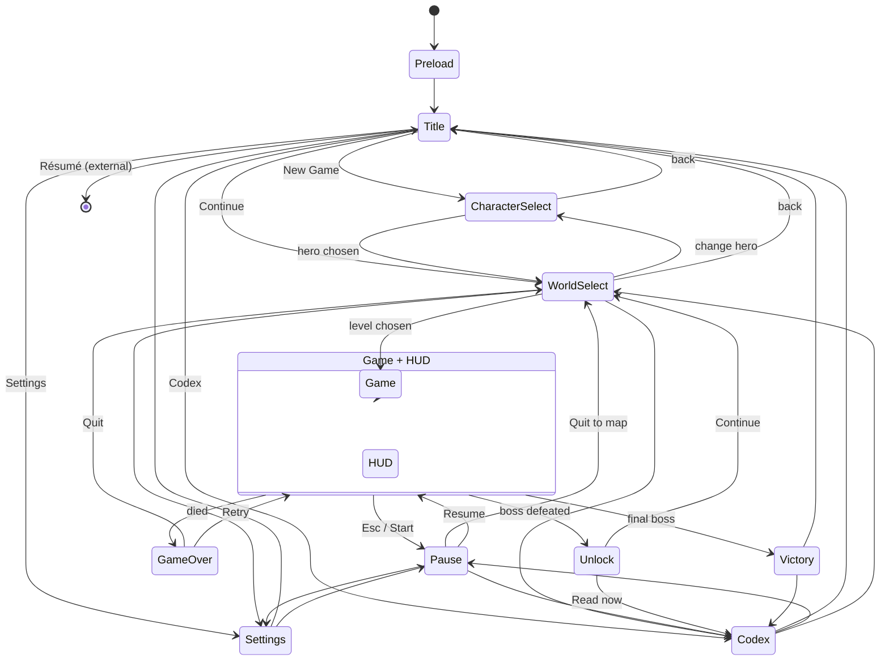

# 13 — UI & UX

**Project:** DevQuest (Working Title)
**Document Owner:** UX Designer
**Status:** ✅ Stable
**Version:** 1.0.0
**Last Updated:** 2026-08-07

---

## 1. Purpose

This document specifies every screen, every widget, every input binding, and every accessibility feature in DevQuest.

Two constraints shape all of it. The first is **320 × 180 pixels** — there is no room for anything that is not doing work. The second is **the primary audience may not play games** (`01-Vision.md` §6.1), which means the UI cannot rely on genre conventions the player has not learned.

The document also owns Assist Options, which are the mechanism by which Pillar 4 is kept honest, and the input system, which is where Pillar 1 begins.

---

## 2. Goals

| #   | Goal                                             | Success Signal                                                            |
| --- | ------------------------------------------------ | ------------------------------------------------------------------------- |
| G1  | Full keyboard and gamepad parity                 | Every action in every screen is reachable by both, with no mouse required |
| G2  | Readable UI at 320×180                           | No text smaller than 6 px cap height; nothing requires squinting at 1×    |
| G3  | Complete input remapping                         | Every binding is changeable; conflicts are detected and resolved          |
| G4  | Accessibility that lets anyone finish            | A non-gamer reaches the credits                                           |
| G5  | Data-driven UI construction                      | A menu is a JSON file plus a handler map                                  |
| G6  | Deterministic focus navigation                   | Focus never gets lost, never wraps unpredictably                          |
| G7  | Never take control from the player unnecessarily | Menus open instantly; nothing blocks for more than 400 ms                 |

---

## 3. Design Principles

### P1 — Every Pixel Earns Its Place

At 320×180, a 4 px margin is 2.2% of screen width. Decoration is a luxury the resolution does not afford. Every element is either information or affordance.

### P2 — Show the Control, Not the Concept

"[A] Jump" beats "Press the jump button." The glyph shown always matches the device currently in use, and switches instantly when the player changes device.

### P3 — Focus Is Always Visible

There is never a moment when the player cannot tell what is selected. The focus ring is animated so it is impossible to miss.

### P4 — Accessibility Is Not a Mode

Assist Options are in the standard pause menu, not behind a "casual mode" wall. They carry no shame framing, no warnings, and no achievement penalties.

### P5 — Instant, Always

Menus open in ≤ 100 ms. Pause is instantaneous. No screen has a loading state except the initial preloader.

### P6 — The Game Is Behind the Menu

Pause dims the game to 55% rather than replacing it. The player never loses their sense of place.

---

## 4. Overview

### 4.1 The Screen Inventory

| Screen             | Scene                  | Type         | Purpose                                          |
| ------------------ | ---------------------- | ------------ | ------------------------------------------------ |
| Boot / Preloader   | `PreloadScene`         | Full         | Loading bar, first-run detection                 |
| Title              | `TitleScene`           | Full         | New game, continue, codex, settings, résumé link |
| Character Select   | `CharacterSelectScene` | Full         | Choose one of four heroes                        |
| World Select (Hub) | `WorldSelectScene`     | Full         | World map, levels, vendor, charms, stats, codex  |
| HUD                | `UIScene`              | Overlay      | Health, resource, ability, coins, shards, charms |
| Pause              | `PauseScene`           | Overlay      | Resume, assist, settings, codex, quit            |
| Settings           | `SettingsScene`        | Full/overlay | Audio, video, controls, accessibility            |
| Codex              | `CodexScene`           | Full         | The portfolio (`12-Portfolio-System.md`)         |
| Unlock             | `UnlockScene`          | Overlay      | The 4 s ceremony                                 |
| Game Over          | `GameOverScene`        | Overlay      | Retry, quit                                      |
| Victory            | `VictoryScene`         | Full         | Ending, stats, codex, credits                    |

### 4.2 The Screen Graph



**Every screen knows where it came from.** Scene init data always carries `returnTo: SceneKey`. No screen assumes its caller.

---

## 5. Technical Design — Input

### 5.1 The Five Inputs

The whole game is playable with five actions plus pause (`02-Game-Pillars.md` §5.4.2).

| Action      | Keyboard (default)   | Gamepad                     | Mouse        |
| ----------- | -------------------- | --------------------------- | ------------ |
| **Move**    | `A`/`D` or `←`/`→`   | Left stick, D-pad           | —            |
| **Jump**    | `Space`, `W`, or `↑` | `A` / Cross                 | —            |
| **Attack**  | `J`                  | `X` / Square                | Left button  |
| **Dash**    | `K` or `Shift`       | `B` / Circle, or `RT`       | Right button |
| **Special** | `L` or `E`           | `Y` / Triangle              | —            |
| **Crouch**  | `S` or `↓`           | Left stick down, D-pad down | —            |
| **Pause**   | `Esc`                | `Start`                     | —            |

**There is no interact key.** Doors, chests, checkpoints, and NPCs all activate on contact or on jump. This is deliberate (`02-Game-Pillars.md` §5.4.2): the most common non-gamer failure is not knowing which key opens a thing.

**Three default bindings for jump** because players disagree strongly about `Space` vs `W` vs `↑`, and having all three costs nothing.

### 5.2 The Input Frame

```ts
// src/systems/InputSystem.ts
// NORMATIVE — rebuilt every frame, immutable, the single source of input truth.

export interface InputFrame {
  readonly moveX: -1 | 0 | 1;
  readonly moveY: -1 | 0 | 1; // for menus and crouch

  readonly jumpPressed: boolean; // edge
  readonly jumpHeld: boolean; // level
  readonly jumpReleased: boolean; // edge

  readonly attackPressed: boolean;
  readonly attackHeld: boolean;

  readonly dashPressed: boolean;

  readonly specialPressed: boolean;
  readonly specialHeld: boolean;
  readonly specialReleased: boolean;

  readonly pausePressed: boolean;

  /** Absolute timestamp of the most recent jump press, for buffering. */
  readonly jumpPressedAt: number;

  /** Which device produced input most recently. Drives glyph display. */
  readonly device: 'keyboard' | 'gamepad';
  readonly gamepadKind: 'xbox' | 'playstation' | 'generic' | null;
}
```

### 5.3 Sampling Rules

| Rule                     | Specification                                                                 |
| ------------------------ | ----------------------------------------------------------------------------- |
| Sample point             | First system in `SYSTEM_ORDER_GAMEPLAY` (`03-Technical-Architecture.md` §8.3) |
| Edge detection           | Compared against the previous frame's raw state, computed once                |
| Analog deadzone          | 0.30 radial on the left stick                                                 |
| Analog-to-digital        | `moveX =                                                                      | x   | > 0.30 ? sign(x) : 0`. **No analog movement speed** — this is a pixel-art platformer with one run speed |
| Simultaneous devices     | Both are always polled. Either can act. `device` reflects the most recent     |
| Device switch threshold  | Any button press, or stick displacement > 0.5                                 |
| Buffered during hit stop | Yes (`07-Combat.md` §6.2)                                                     |
| Buffered during pause    | No — cleared on unpause to avoid a queued attack firing on resume             |

**Why no analog movement speed:** at 320×180 with a 16 px tile grid, the difference between 60% and 70% stick deflection is sub-pixel. Supporting it would add a control dimension the level design cannot use and would make keyboard and gamepad genuinely unequal. `moveX` is `-1 | 0 | 1` for both devices.

### 5.4 Remapping

| Property            | Specification                                                  |
| ------------------- | -------------------------------------------------------------- |
| Scope               | All seven actions, keyboard and gamepad independently          |
| Bindings per action | Up to 3 per device                                             |
| Conflict detection  | Live. Assigning a bound key shows "Currently: Dash — replace?" |
| Reserved keys       | `Esc` (pause) and `F1`–`F12` cannot be rebound                 |
| Reset               | Per-action and global "Restore Defaults"                       |
| Storage             | `devquest.settings`, shared across save slots                  |
| Rebinding UI        | Press-to-bind with a 5 s timeout and an explicit cancel        |

```ts
export interface InputBindings {
  readonly keyboard: Readonly<Record<GameAction, readonly string[]>>; // KeyboardEvent.code
  readonly gamepad: Readonly<Record<GameAction, readonly number[]>>; // button indices
  readonly gamepadAxes: {
    readonly moveX: { readonly axis: number; readonly deadzone: number };
    readonly moveY: { readonly axis: number; readonly deadzone: number };
  };
}
```

### 5.5 Glyph Display

Every control hint shows the glyph for the **currently active device**, switching instantly.

| Device      | Jump    | Attack | Dash | Special | Confirm | Back  |
| ----------- | ------- | ------ | ---- | ------- | ------- | ----- |
| Keyboard    | `SPACE` | `J`    | `K`  | `L`     | `ENTER` | `ESC` |
| Xbox        | Ⓐ       | Ⓧ      | Ⓑ    | Ⓨ       | Ⓐ       | Ⓑ     |
| PlayStation | ✕       | ▢      | ○    | △       | ✕       | ○     |
| Generic     | `1`     | `3`    | `2`  | `4`     | `1`     | `2`   |

Glyphs are 12 × 12 px sprites in the `core` atlas. Keyboard glyphs render as a key-cap nine-slice with the bound key's label inside, so a remapped key shows its actual label.

**Detection:** `navigator.getGamepads()[i].id` is matched against known vendor strings. Unrecognised pads fall back to `generic` with numbered buttons — honest rather than wrong.

---

## 6. Focus Navigation

### 6.1 The Model

Every interactive screen is a **focus graph**: a set of focusable widgets with explicit neighbours.

```ts
// src/ui/FocusManager.ts
// NORMATIVE

export interface Focusable {
  readonly id: string;
  readonly bounds: Phaser.Geom.Rectangle;
  readonly enabled: boolean;
  readonly group: string; // for group-level navigation (tabs)
  /** Explicit neighbours. null = auto-resolve by geometry. */
  readonly neighbours: {
    readonly up: string | null;
    readonly down: string | null;
    readonly left: string | null;
    readonly right: string | null;
  };
  onFocus(): void;
  onBlur(): void;
  onActivate(): void;
  onAdjust?(delta: -1 | 1): void; // sliders, steppers
}

export class FocusManager {
  private current: string | null = null;

  move(dir: 'up' | 'down' | 'left' | 'right'): void {
    const explicit = this.get(this.current!)?.neighbours[dir];
    const next = explicit ?? this.resolveByGeometry(dir);
    if (next) this.focus(next);
    // If nothing resolves, focus does NOT move and does NOT wrap. G6.
  }
}
```

### 6.2 Navigation Rules

| Rule               | Specification                                                                                |
| ------------------ | -------------------------------------------------------------------------------------------- |
| Explicit first     | If a neighbour is declared, it wins                                                          |
| Geometric fallback | Nearest enabled widget whose centre lies in the direction cone (±45°), by Euclidean distance |
| No wrapping        | Pressing `↓` at the bottom does nothing. Wrapping causes disorientation                      |
| Disabled widgets   | Skipped entirely, never focused                                                              |
| Group navigation   | `LB`/`RB` and `Q`/`E` move between groups (tabs) regardless of position                      |
| Initial focus      | Declared per screen. Never "the first widget in creation order"                              |
| Restoration        | Returning to a screen restores the previously focused widget                                 |
| Mouse              | Hovering focuses. Clicking focuses and activates                                             |

### 6.3 The Focus Ring

| Property            | Value                                                              |
| ------------------- | ------------------------------------------------------------------ |
| Style               | A 1 px dashed rectangle inset 1 px inside the widget bounds        |
| Colour              | `#ffd23f` (S3)                                                     |
| Animation           | Dash offset advances 2 px every 120 ms — a slow crawl              |
| Additional          | The focused widget's label brightens N6 → N7                       |
| On selection change | The ring tweens to the new bounds over 80 ms with `Quad.easeOut`   |
| Reduced Motion      | The crawl stops; the ring becomes solid. The tween becomes instant |

**The tweening ring is the single most valuable UI polish detail.** An 80 ms slide between options makes navigation feel physical and makes the direction of movement unmistakable.

### 6.4 Standard Actions

| Action           | Keyboard            | Gamepad            | Effect           |
| ---------------- | ------------------- | ------------------ | ---------------- |
| Navigate         | Arrows / WASD       | D-pad / left stick | Move focus       |
| Confirm          | `Enter` / `Space`   | `A`                | Activate         |
| Back             | `Esc` / `Backspace` | `B`                | Return to caller |
| Adjust           | `←`/`→`             | D-pad ←→           | Slider / stepper |
| Group prev/next  | `Q` / `E`           | `LB` / `RB`        | Tab switch       |
| Reset to default | `R`                 | `Y`                | Where applicable |

**Analog stick navigation** uses a repeat pattern: initial press → 400 ms delay → repeat every 130 ms. Without the delay, a held stick blasts through a menu.

---

## 7. Architecture — The Widget Library

### 7.1 Widgets

| Widget       | Size          | Use                                              |
| ------------ | ------------- | ------------------------------------------------ |
| `Button`     | 80 × 14 min   | Menu actions                                     |
| `Toggle`     | 80 × 14       | On/off settings                                  |
| `Slider`     | 100 × 14      | Volume, 0–100 in steps of 5                      |
| `Stepper`    | 100 × 14      | Discrete options (resolution, difficulty preset) |
| `Panel`      | any           | Nine-slice container                             |
| `Tab`        | 48 × 14       | Section switching                                |
| `HealthBar`  | variable      | Player and boss health                           |
| `Toast`      | 140 × 20      | Transient notification                           |
| `KeyGlyph`   | 12 × 12       | Control hint                                     |
| `FocusRing`  | tracks target | Focus indicator                                  |
| `ScrollView` | any           | Codex, settings, credits                         |
| `ListItem`   | 140 × 12      | Vendor, charms                                   |
| `Card`       | 140 × 40      | Character select, world nodes                    |

### 7.2 Widget States

| State               | Panel Fill     | Label          | Border             |
| ------------------- | -------------- | -------------- | ------------------ |
| Default             | `#1c1a2a` (N1) | `#c8c6d0` (N6) | `#0d0b14` (N0)     |
| Focused             | `#2e2b40` (N2) | `#f2f0f5` (N7) | N0 + S3 focus ring |
| Pressed             | `#474459` (N3) | N7             | N0                 |
| Disabled            | N1 at 60%      | `#474459` (N3) | N0 at 60%          |
| Destructive focused | N2             | N7             | N0 + S0 focus ring |

### 7.3 Data-Driven Construction

```json
// public/assets/data/ui/pause-menu.json
{
  "id": "pauseMenu",
  "initialFocus": "resume",
  "layout": { "kind": "vertical", "x": 110, "y": 48, "spacing": 4, "align": "center" },
  "widgets": [
    { "id": "resume", "kind": "button", "label": "Resume", "action": "resume" },
    { "id": "assist", "kind": "button", "label": "Assist Options", "action": "openAssist" },
    { "id": "settings", "kind": "button", "label": "Settings", "action": "openSettings" },
    {
      "id": "codex",
      "kind": "button",
      "label": "Codex",
      "action": "openCodex",
      "badge": { "kind": "count", "source": "portfolio.unlockedCount" }
    },
    {
      "id": "restart",
      "kind": "button",
      "label": "Restart Level",
      "action": "restartLevel",
      "confirm": "Restart from the last checkpoint?"
    },
    {
      "id": "quit",
      "kind": "button",
      "label": "Quit to Map",
      "action": "quitToMap",
      "style": "destructive",
      "confirm": "Quit to the world map? Progress since your last checkpoint will be lost."
    }
  ]
}
```

```ts
// src/ui/UiBuilder.ts
const HANDLERS: Record<string, (ctx: UiContext) => void> = {
  resume: ctx => ctx.scene.scene.resume(SceneKeys.GAME),
  openAssist: ctx =>
    ctx.scene.scene.launch(SceneKeys.SETTINGS, { tab: 'assist', returnTo: SceneKeys.PAUSE }),
  openSettings: ctx => ctx.scene.scene.launch(SceneKeys.SETTINGS, { returnTo: SceneKeys.PAUSE }),
  openCodex: ctx => ctx.scene.scene.start(SceneKeys.CODEX, { returnTo: SceneKeys.PAUSE }),
  restartLevel: ctx => ctx.progression.restartFromCheckpoint(),
  quitToMap: ctx => ctx.scene.scene.start(SceneKeys.WORLD_SELECT),
};
```

**A new menu is a JSON file plus handler entries.** G5 satisfied. `UiBuilder` reads the JSON, instantiates widgets, wires the focus graph geometrically (or from explicit `neighbours`), and returns a `Menu` object.

**The `badge` binding** reads a dotted path from a whitelisted state map, so the Codex button can show "3/5" without the JSON knowing about `PortfolioSystem`.

---

## 8. Screen Specifications

---

### 8.1 Preloader

```
┌──────────────────────────────────────────────────────────────┐
│                                                              │
│                                                              │
│                       D E V Q U E S T                        │  y=76
│                                                              │
│              ▓▓▓▓▓▓▓▓▓▓▓▓▓▓░░░░░░░░░░░░░░░                   │  y=100, 160×6
│                        62%                                   │  y=110
│                                                              │
│                                                              │
│                                          v0.9.2 · resume →   │  y=170
└──────────────────────────────────────────────────────────────┘
```

| Property        | Spec                                                  |
| --------------- | ----------------------------------------------------- |
| Background      | `#0d0b14` (N0)                                        |
| Title           | `devquest-12px`, N7, letter-spaced 3 px               |
| Bar             | 160 × 6 px, N1 fill, S4 progress, 1 px N0 border      |
| Percentage      | `devquest-6px`, N5                                    |
| Résumé link     | Bottom-right, N5, clickable from the very first frame |
| No spinner      | A determinate bar only. Spinners hide progress        |
| Minimum display | 600 ms, so a cached load does not flash               |

**The résumé link is live during loading.** Someone who does not want to wait 8 seconds for a game can leave for the CV immediately. This is P6 of `12-Portfolio-System.md` taken seriously.

### 8.2 Title

```
┌──────────────────────────────────────────────────────────────┐
│                                                              │
│                   D E V Q U E S T                            │  y=40
│                   ─────────────────                          │
│                    a portfolio, earned                       │  y=56
│                                                              │
│                     ▸ Continue                               │  y=84
│                       New Game                               │  y=98
│                       Codex          3/5                     │  y=112
│                       Settings                               │  y=126
│                                                              │
│  built by <name>                    View plain résumé →      │  y=170
└──────────────────────────────────────────────────────────────┘
```

| Property                       | Spec                                                                                                    |
| ------------------------------ | ------------------------------------------------------------------------------------------------------- |
| Background                     | The World 1 parallax at 40% alpha, slowly scrolling. Not a static image                                 |
| Initial focus                  | `Continue` if a save exists, else `New Game`                                                            |
| Continue                       | Hidden entirely if no save exists (not greyed — absent)                                                 |
| New Game with an existing save | Confirmation: "Start a new game? Your current run will be replaced. Unlocks and collectibles are kept." |
| Codex badge                    | Live unlock count                                                                                       |
| Byline                         | `devquest-6px`, N5, bottom-left                                                                         |
| Résumé link                    | Bottom-right, S4, opens externally with the standard confirmation                                       |

### 8.3 Character Select

```
┌──────────────────────────────────────────────────────────────┐
│  CHOOSE YOUR HERO                                            │  y=6
├──────────────────────────────────────────────────────────────┤
│   ┌──────┐   ┌──────┐   ┌──────┐   ┌──────┐                  │
│   │      │   │ ████ │   │      │   │      │                  │  y=24
│   │Knight│   │Samur.│   │ Ninja│   │Wizard│                  │  cards 60×56
│   │  ★☆☆ │   │  ★★☆ │   │  ★★★ │   │  ★★☆ │                  │
│   └──────┘   └──────┘   └──────┘   └──────┘                  │
├──────────────────────────────────────────────────────────────┤  y=84
│   SAMURAI                                                    │
│   "One cut. That is all it takes."                           │
│                                                              │
│   Health   ███░░                                             │
│   Speed    ███░░                                             │
│   Power    ████░                                             │
│   Range    ██░░░                                             │
│                                                              │
│   Balanced and aggressive. Three-hit combo and a chargeable  │
│   dash-cut that passes through enemies.                      │
├──────────────────────────────────────────────────────────────┤
│   ◄ ► Select     [A] Confirm     [B] Back                    │  y=166
└──────────────────────────────────────────────────────────────┘
```

| Property         | Spec                                                                                            |
| ---------------- | ----------------------------------------------------------------------------------------------- |
| Cards            | 60 × 56 px, showing the hero's idle animation live                                              |
| Focused card     | Scales to 1.1× (rounded to whole pixels), plays `run` instead of `idle`, gains an S3 focus ring |
| Stat bars        | 5 segments, filled from `selectScreen.statBars` in the character JSON                           |
| Difficulty stars | From `difficulty: 1                                                                             | 2   | 3`  |
| Description      | From `selectScreen.description`                                                                 |
| Recommendation   | On a first run, the Knight card carries a small "Recommended for your first run" tag in S2      |
| Initial focus    | Knight on a first run; the last-used hero otherwise                                             |

**Stat bars are derived from the JSON, never hardcoded.** A character rebalance updates the select screen automatically.

### 8.4 World Select (Hub)

```
┌──────────────────────────────────────────────────────────────┐
│  ⬤ 1,240   ♥ 7/17   ◈ 8/10          Samurai      74%         │  y=0, 12px
├──────────────────────────────────────────────────────────────┤
│                                                              │
│    ①━━━━━②━━━━━③━━━━━④╌╌╌╌╌⑤                                │  y=40
│  Verdant Autumn Hollow Crystal Gorgon's                      │
│  Ascent  Reach  Barrow  Deep    Spire                        │
│  ✔✔✔✔   ✔✔✔✔   ✔✔✔✔   ✔✔✔○    🔒                            │  y=58
│                                                              │
├──────────────────────────────────────────────────────────────┤  y=72
│  CRYSTAL DEEP — 4-4  The Sovereign's Seat                    │
│  Best: —        Secrets: 2/3        Boss: Golem Sovereign    │
├──────────────────────────────────────────────────────────────┤  y=96
│  [Vendor]  [Charms]  [Codex 4/5]  [Stats]  [Hero]  [Settings]│  y=104
├──────────────────────────────────────────────────────────────┤
│  ◄ ► World   ▲▼ Level   [A] Play   [B] Title                 │  y=166
└──────────────────────────────────────────────────────────────┘
```

| Element       | Spec                                                                   |
| ------------- | ---------------------------------------------------------------------- |
| Top bar       | Coins, shards, charms owned, current hero, completion %                |
| World nodes   | 5 nodes on a path. Locked worlds show a padlock and a dashed connector |
| Level markers | 4 per world: ✔ complete, ◐ in progress, ○ unplayed, 🔒 locked          |
| Detail panel  | The focused level's name, best time, secrets found, boss               |
| Action row    | Six panel buttons, each opening an overlay panel (not a scene)         |
| Navigation    | `←`/`→` between worlds; `↑`/`↓` between that world's levels            |
| Locked world  | Focusable, shows "Defeat the <boss> to unlock"                         |

**Vendor, Charms, Stats, and Hero are overlay panels on this scene**, not separate scenes. This keeps the Hub a single fast screen and matches `ADR-016` (no walkable hub).

### 8.5 HUD

```
┌──────────────────────────────────────────────────────────────┐
│ ♥♥♥♥♥♥♡    ▓▓▓▓▓▓░░░░  ◈◈◈          ⬤ 142      ♥ 3/4        │  y=0..20
├──────────────────────────────────────────────────────────────┤
│                                                              │
│                     GAMEPLAY 320×148                         │
│                                                              │
├──────────────────────────────────────────────────────────────┤
│  [J] Attack   [K] Dash   [L] Special            (fades 8s)   │  y=168..180
└──────────────────────────────────────────────────────────────┘
```

| Element           | Position     | Spec                                                                                                                 |
| ----------------- | ------------ | -------------------------------------------------------------------------------------------------------------------- |
| Health hearts     | `x=4, y=4`   | 1 heart = 20 HP. Partial hearts drawn as fractional fills. Max 11 hearts shown before switching to a numeric readout |
| Resource bar      | `x=4, y=13`  | Wizard only. 60 × 4 px, M4 fill                                                                                      |
| Ability readiness | `x=68, y=4`  | 3 pips or a radial fill, from `Ability.readiness()`                                                                  |
| Charm icons       | `x=92, y=4`  | Up to 3, 12 × 12 px                                                                                                  |
| Coin counter      | `x=236, y=4` | Icon + `devquest-8px`                                                                                                |
| Shard counter     | `x=286, y=4` | Icon + "3/4" progress to the next container                                                                          |
| Control hints     | `y=170`      | Fades out after 8 s of play; returns for 6 s when a new mechanic appears                                             |

| Behaviour          | Spec                                                                                                                                  |
| ------------------ | ------------------------------------------------------------------------------------------------------------------------------------- |
| Damage flash       | The heart row flashes S0 for 200 ms on damage                                                                                         |
| Heal               | The heart row pulses S2                                                                                                               |
| New container      | A new heart animates in over 800 ms with an S2 flash                                                                                  |
| Low health (< 25%) | The heart row pulses slowly (1.2 s period) at 85–100% alpha. **No audio alarm, no screen border** — those are stressful and unhelpful |
| Coin tick          | Animates up over 300 ms rather than snapping                                                                                          |
| Hidden during      | Boss intro, unlock ceremony, death sequence                                                                                           |

**The HUD occupies reserved bands, not overlay space** (`04-Art-Direction.md` §9.3). The camera viewport is 320 × 148 and every level is authored against that.

### 8.6 Pause

```
┌──────────────────────────────────────────────────────────────┐
│                                                              │
│         (gameplay, dimmed to 55%, frozen)                    │
│                                                              │
│              ┌──────────────────────────┐                    │
│              │        PAUSED            │                    │
│              ├──────────────────────────┤                    │
│              │  ▸ Resume                │                    │
│              │    Assist Options        │                    │
│              │    Settings              │                    │
│              │    Codex            3/5  │                    │
│              │    Restart Level         │                    │
│              │    Quit to Map           │                    │
│              └──────────────────────────┘                    │
│                                                              │
│   4-2 Conveyor Halls     02:41     Deaths: 3                 │  y=166
└──────────────────────────────────────────────────────────────┘
```

| Property     | Spec                                                                                                          |
| ------------ | ------------------------------------------------------------------------------------------------------------- |
| Open latency | ≤ 1 frame. `this.scene.pause(GAME)` then `launch(PAUSE)`                                                      |
| Dim          | A 55% N0 quad over the game, **not** a full blackout (P6)                                                     |
| Blur         | None. Blur at 320×180 is expensive and looks wrong                                                            |
| Input buffer | Cleared on unpause                                                                                            |
| HUD          | Stays visible above the dim                                                                                   |
| Footer       | Current level, elapsed time, deaths this session                                                              |
| Skip valve   | After 3 deaths on a boss, a "Skip this fight" entry appears above "Restart Level" (`09-Boss-System.md` §11.3) |

### 8.7 Settings

Four tabs: **Audio · Video · Controls · Accessibility**.

| Tab               | Settings                                                                                           |
| ----------------- | -------------------------------------------------------------------------------------------------- |
| **Audio**         | Master, Music, SFX, UI (0–100 in steps of 5). Mute on focus loss (toggle)                          |
| **Video**         | Fullscreen, Scale mode (Fit / Integer), Show FPS, Frame limiter (60/120/Uncapped)                  |
| **Controls**      | Per-action rebinding for keyboard and gamepad, deadzone slider, vibration toggle, Restore Defaults |
| **Accessibility** | §11                                                                                                |

| Property       | Spec                                                                       |
| -------------- | -------------------------------------------------------------------------- |
| Layout         | Tab bar at `y=0` (14 px), scrollable settings list below, hints at `y=166` |
| Apply          | Immediately on change. No "Apply" button                                   |
| Persist        | Written to `devquest.settings` on change (debounced 500 ms)                |
| Reset          | Per-tab "Restore Defaults" with confirmation                               |
| Reachable from | Title, Pause, World Select. Always returns to its caller                   |

### 8.8 Game Over

```
┌──────────────────────────────────────────────────────────────┐
│                                                              │
│         (final frame, desaturated, dimmed 70%)               │
│                                                              │
│                      Y O U   D I E D                         │  y=76
│                                                              │
│                      ▸ Retry                                 │  y=100
│                        Quit to Map                           │  y=112
│                                                              │
│   Checkpoint: 4-2 · Attempt 4                                │  y=166
└──────────────────────────────────────────────────────────────┘
```

| Property          | Spec                                                                                                                          |
| ----------------- | ----------------------------------------------------------------------------------------------------------------------------- |
| Appears           | 900 ms after the death animation ends                                                                                         |
| Retry latency     | `flashCut` transition, ≤ 1 s from press to playing                                                                            |
| Initial focus     | Always `Retry`                                                                                                                |
| Auto-retry option | An accessibility setting (§11) skips this screen entirely and respawns immediately                                            |
| Tone              | Neutral. No taunting, no death counter shaming                                                                                |
| Assist prompt     | After 5 deaths at the same checkpoint, a third option appears: "Assist Options" — offered once per checkpoint, never repeated |

**The assist prompt is offered, never imposed.** It appears as a normal menu item, described plainly, with no framing about difficulty.

### 8.9 Victory

Shown after the Gorgon. Four beats:

| Beat | Duration | Content                                                 |
| ---- | -------- | ------------------------------------------------------- |
| 1    | 3 s      | The summit at dawn, the storm clearing. No UI           |
| 2    | 4 s      | Final stats: time, deaths, kills, secrets, completion % |
| 3    | —        | "All five sections unlocked." Codex button, focused     |
| 4    | —        | Credits (scrollable), Title, and the résumé link        |

Completion under 100% shows what remains ("5 secrets undiscovered") with a "Return to Map" option — because the game continues after the credits.

---

## 9. The Boss Health Bar

Specified in `09-Boss-System.md` §6.4; the UI implementation:

| Element        | Spec                                                                              |
| -------------- | --------------------------------------------------------------------------------- |
| Position       | Centred, `y=4`, 200 × 12 px                                                       |
| Frame          | 1 px N0 outline, N1 fill                                                          |
| Fill           | S0, drains right to left                                                          |
| Chip bar       | W4 orange, drains to the true value over 400 ms after each hit                    |
| Phase dividers | 1 px N7 verticals at each threshold                                               |
| Name           | `devquest-8px`, N7, centred above                                                 |
| Phase name     | `devquest-6px`, N5, centred below, updates on transition                          |
| Appear         | Fades in over 400 ms on intro complete                                            |
| Disappear      | Fades out over 600 ms at death beat 4                                             |
| On transition  | The crossed divider flashes N7 for 300 ms; the whole bar flashes on a poise break |

**The chip bar is the highest-value detail in the HUD.** Without it, a 78-damage combo against a 900 HP boss produces an imperceptible change. With it, the player sees a visible orange chunk appear and drain.

---

## 10. Toasts and Notifications

| Property  | Spec                                                      |
| --------- | --------------------------------------------------------- |
| Position  | Bottom-centre, `y=146`, above the hint bar                |
| Size      | 140 × 20 px nine-slice                                    |
| Duration  | 1.2 s (short) / 1.8 s (standard) / 2.4 s (important)      |
| Animation | Slide up 8 px + fade in over 200 ms; fade out over 300 ms |
| Stacking  | Maximum 2 visible; a third replaces the oldest            |
| Blocking  | Never. Toasts do not take focus or pause anything         |
| Pooled    | Yes, 4 instances                                          |

| Event            | Text                   | Duration |
| ---------------- | ---------------------- | -------- |
| Checkpoint       | "Checkpoint"           | 1.2 s    |
| Heart shard      | "Heart Shard — 3 / 4"  | 1.8 s    |
| Container gained | "Health Increased"     | 2.4 s    |
| Charm found      | "<Charm> acquired"     | 1.8 s    |
| Secret found     | "Secret found — 2 / 3" | 1.8 s    |
| Level record     | "New best time — 2:41" | 2.4 s    |
| Chest opened     | "+40 coins"            | 1.2 s    |

---

## 11. Accessibility

**This section is a shipping requirement, not a stretch goal.** `01-Vision.md` §7.5 lists Assist Options as a P0 feature and defines "done" as a non-gamer reaching the credits.

### 11.1 Assist Options

Located in Settings → Accessibility **and** as a top-level Pause entry. Framing is neutral throughout.

| Option               | Values                      | Default | Effect                                                                                   |
| -------------------- | --------------------------- | ------- | ---------------------------------------------------------------------------------------- |
| **Damage taken**     | 100% / 75% / 50% / 25% / 0% | 100%    | Multiplies incoming player damage only                                                   |
| **Extended windows** | Off / On                    | Off     | Coyote 100→150 ms, jump buffer 120→180 ms, Knight parry 200→333 ms, combo windows +50%   |
| **Slow motion**      | Off / 90% / 75% / 60%       | Off     | Global time scale. Affects everything equally                                            |
| **Infinite dash**    | Off / On                    | Off     | Removes the dash cooldown                                                                |
| **Auto-retry**       | Off / On                    | Off     | Skips the Game Over screen; respawns immediately                                         |
| **Skip boss fight**  | (contextual)                | —       | Appears after 3 deaths on a boss                                                         |
| **Enemy damage**     | 100% / 75% / 50%            | 100%    | Multiplies player _outgoing_ damage — labelled "Combat speed" to avoid implying weakness |

**What Assist never changes:** boss patterns, telegraph durations, level geometry, gap widths, or portfolio content. The game stays the game; the player's margin for error grows.

**No penalties.** No achievement locks, no "assisted" watermark on the save, no Codex restrictions. The single marker anywhere is the skipped-boss indicator in the Codex (`12-Portfolio-System.md` §9.3), which is informational and disappears if the boss is later beaten.

### 11.2 Visual Accessibility

| Option                | Values   | Default | Effect                                                                                                                                                           |
| --------------------- | -------- | ------- | ---------------------------------------------------------------------------------------------------------------------------------------------------------------- |
| **Reduced motion**    | Off / On | Off     | Disables camera shake, screen flashes, the damage vignette, and the focus-ring crawl. **Keeps** hit stop, hit flash, and world-space VFX — those are information |
| **Screen shake**      | 0–100%   | 100%    | Independent from Reduced Motion, for players who want some                                                                                                       |
| **Flash intensity**   | 0–100%   | 100%    | Scales the alpha of all full-screen flashes                                                                                                                      |
| **High-contrast HUD** | Off / On | Off     | HUD panels go to 100% opacity; text to pure N7 on pure N0                                                                                                        |
| **Enemy outline**     | Off / On | Off     | Adds a 1 px S0 outline to all hostile entities. A significant help in Worlds 3–5                                                                                 |
| **Hazard outline**    | Off / On | Off     | Adds a 1 px S0 outline to spikes, pits, and crushers                                                                                                             |
| **Larger text**       | Off / On | Off     | Uses `devquest-8px` for all body text. Reduces content per screen; the Codex scrolls more                                                                        |
| **Damage numbers**    | Off / On | On      | The only disableable feedback layer                                                                                                                              |

**Colourblind support is structural, not a mode.** The Style Bible's value-first principle (`04-Art-Direction.md` §P3) means every UI state is distinguishable in greyscale. There is no "colourblind mode" because there is nothing that relies on hue alone. This is verified by the automated greyscale contrast check (`04-Art-Direction.md` §11.3).

### 11.3 Input Accessibility

| Option                     | Values               | Default | Effect                          |
| -------------------------- | -------------------- | ------- | ------------------------------- |
| **Hold vs toggle: Guard**  | Hold / Toggle        | Hold    | Knight's guard                  |
| **Hold vs toggle: Charge** | Hold / Toggle        | Hold    | Samurai's Iai, Wizard's Barrier |
| **Hold vs toggle: Run**    | —                    | —       | N/A — there is no run button    |
| **Repeat rate**            | Slow / Normal / Fast | Normal  | Menu navigation repeat          |
| **Stick deadzone**         | 0.10–0.50            | 0.30    |                                 |
| **Vibration**              | Off / Low / Full     | Full    |                                 |
| **Full remapping**         | —                    | —       | §5.4                            |

**No timed input sequences exist anywhere in the game** — no QTEs, no double-tap requirements, no simultaneous-button combos. Every action is a single button press. This eliminates the largest category of motor-accessibility barriers by design rather than by option.

### 11.4 Cognitive Accessibility

| Feature                     | Spec                                                        |
| --------------------------- | ----------------------------------------------------------- |
| No time pressure by default | Mini challenges are optional; no level has a required timer |
| No hidden required content  | Every main path is signposted (`10-Level-Design.md` P4)     |
| Consistent controls         | Five inputs, never changing (`02-Game-Pillars.md` §5.4.4)   |
| Restatable hints            | Control hints return whenever a new mechanic appears        |
| Pause anywhere              | Except during the boss death sequence (2 s)                 |
| No punishment for pausing   | The game is fully frozen                                    |
| Readable text               | 6 px minimum, ≤ 52 chars/line, high contrast                |
| Clear confirmations         | Every destructive action confirms, naming the consequence   |

### 11.5 What Is Not Supported, and Why

Honesty about limits is part of accessibility:

| Not Supported                  | Reason                                                                                                                                                                        |
| ------------------------------ | ----------------------------------------------------------------------------------------------------------------------------------------------------------------------------- |
| Screen reader for the game     | A canvas-rendered pixel game cannot be meaningfully narrated. **`/resume` is fully screen-reader accessible** and carries the same information (`12-Portfolio-System.md` §10) |
| Full one-handed play           | Movement plus five actions cannot map to one hand comfortably. Remapping allows a best-effort layout                                                                          |
| Text scaling beyond 8 px       | The internal resolution is 320×180. Larger text would leave no room for content                                                                                               |
| Subtitles                      | No spoken dialogue exists                                                                                                                                                     |
| Colourblind simulation preview | Not needed — nothing relies on hue                                                                                                                                            |

**The `/resume` fallback is what makes the honesty acceptable.** A blind visitor cannot play the game, and no amount of engineering changes that. They can read the complete portfolio in a fully accessible page in under a second, which is the outcome that actually matters.

---

## 12. Implementation Notes

### 12.1 UIScene Parallelism

`UIScene` runs in parallel with `GameScene` via `scene.launch()` (`03-Technical-Architecture.md` §7.3):

```ts
// GameScene.create()
this.scene.launch(SceneKeys.UI, { characterId: this.characterId });
this.scene.bringToTop(SceneKeys.UI);

// UIScene.create() — communicates ONLY through the bus
const bus = Registry.get('bus');
bus.on('combat:playerDamaged', p => this.health.setValue(p.remainingHp), this);
bus.on('progress:coinCollected', p => this.coins.tickTo(p.total), this);
bus.on('progress:shardCollected', p => this.onShard(p), this);
bus.on('boss:introStarted', p => this.bossBar.show(p.bossId), this);

// UIScene.shutdown()
bus.offAllFor(this);
```

`UIScene` never holds a reference to `Player`, `Boss`, or any entity. This is what allows the HUD to survive `GameScene` restarts on checkpoint reload.

### 12.2 Rendering Cost

| Screen       | Draw Calls | Notes                                                        |
| ------------ | ---------- | ------------------------------------------------------------ |
| HUD          | 6          | All UI in the `core` atlas; bitmap text shares one font page |
| Pause        | +4         | Dim quad, panel nine-slice, 6 buttons (batched), focus ring  |
| World Select | 12         | World nodes, connectors, panels                              |
| Codex        | ~14        | `12-Portfolio-System.md` §11.3                               |
| Settings     | 10         |                                                              |

All comfortably inside the 40-call budget (`00-README.md` §5.5).

### 12.3 No `add.text`

Enforced by ESLint (`04-Art-Direction.md` §9.2). All text is `BitmapText`. TTF rendering at 320×180 produces anti-aliased, non-grid-aligned glyphs that break the art style instantly.

```js
'no-restricted-properties': ['error', {
  object: 'this.add', property: 'text',
  message: 'Use BitmapText. TTF text breaks pixel alignment. See 04-Art-Direction §9.2.',
}],
```

### 12.4 Audio Hook Points (Deferred)

No audio assets exist (`05-Asset-Pipeline.md` §9.6). `AudioSystem` ships fully implemented with a `NullAudioBackend`, and every hook point is wired now so that adding audio later requires zero gameplay changes.

```ts
// src/systems/AudioSystem.ts
export interface AudioBackend {
  playSfx(id: SfxId, opts?: { volume?: number; rate?: number; pan?: number }): void;
  playMusic(id: MusicId, opts?: { fadeMs?: number; loop?: boolean }): void;
  stopMusic(fadeMs?: number): void;
  setChannelVolume(ch: AudioChannel, v: number): void;
}

/** Ships today. Records calls in dev builds so the audio designer can see what fires. */
export class NullAudioBackend implements AudioBackend {
  playSfx(id: SfxId): void {
    if (import.meta.env.DEV) AudioLog.record(id);
  }
  /* … */
}
```

**Wired hook points:** every UI action (move, confirm, back, error), every player action (jump, land, dash, attack ×3, hurt, death), every combat event (hit by material, block, parry, crit, kill), every enemy telegraph (`08-Enemy-System.md` §7.4), every boss beat, every pickup, every mechanic (wind, gate, beam, brazier), and per-world music with boss-fight transitions.

The dev-build `AudioLog` produces a frequency-ranked list of every cue that fired during a playthrough — which is exactly the brief an audio designer needs.

### 12.5 Common UI Bugs

| Bug                                    | Symptom                             | Fix                                                     |
| -------------------------------------- | ----------------------------------- | ------------------------------------------------------- |
| Focus lost after a widget disables     | Nothing is selected                 | On disable, move focus to the nearest enabled neighbour |
| Focus wraps unexpectedly               | Disorientation                      | No wrapping (§6.2)                                      |
| Input buffered through pause           | An attack fires on resume           | Clear the buffer on unpause                             |
| Held stick blasts through a menu       | Overshooting                        | 400 ms initial delay, 130 ms repeat                     |
| Glyphs do not match the device         | Confusion                           | Switch on any input from the other device               |
| `UIScene` holding an entity reference  | Crash on scene restart              | Bus-only communication                                  |
| Listeners leaked across scene restarts | Duplicate handlers, doubled effects | `bus.offAllFor(this)` in every `shutdown`               |
| Toast blocking input                   | Player stuck                        | Toasts never take focus                                 |
| Settings not applied until close       | Confusing                           | Apply immediately                                       |
| `returnTo` assumed                     | Wrong back destination              | Always pass and use `returnTo`                          |
| Boss bar without a chip bar            | Big hits feel small                 | §9                                                      |
| Assist framed as "easy mode"           | Players avoid a feature they need   | P4 — neutral language everywhere                        |

---

## 13. Examples

### 13.1 A Complete Interaction — Rebinding Jump

```
Settings → Controls tab, focus on "Jump: SPACE, W, ↑"

[A] pressed
  → Row expands to show three binding slots + "Add binding"
  → Focus moves to slot 1 ("SPACE")

[A] pressed on slot 1
  → Slot enters listening state: "Press a key…  (4)" with a countdown
  → All other input is suspended
  → Esc cancels; 5 s timeout cancels

Player presses "K"
  → Conflict detected: K is bound to Dash
  → Panel: "K is currently Dash. Replace?  [A] Yes  [B] No"

[A] pressed
  → Dash loses K (retains Shift)
  → Jump slot 1 becomes K
  → Settings written (debounced 500 ms)
  → ALL glyphs across the game update immediately —
    the pause hint bar, the HUD hint bar, every tutorial-free control hint

  → Focus returns to the Jump row
```

**"All glyphs update immediately"** is why glyphs are rendered from the live binding map rather than baked into strings. A `KeyGlyph` widget subscribes to `system:settingChanged` and re-renders.

### 13.2 A Naive Player's First 90 Seconds

```
0:00  Page loads. Preloader at 0%.
0:02  Preloader at 45%. The résumé link is already clickable.
0:06  Load complete. Title screen. "New Game" focused (no save).
0:08  Player presses Enter.
0:08  Character Select. Knight focused, "Recommended for your first run" tag visible.
0:12  Player reads the Knight description, presses Enter.
0:13  irisWipe → World 1, level 1-1.
0:13  HUD visible. Hint bar: "[A][D] Move   [SPACE] Jump"
0:15  Player presses D. Character runs. Dust puffs.
0:18  Player reaches the first gap. Presses Space. Jumps it.  ← G4 target: ≤10s
0:25  Second and third gaps. Both cleared.
0:40  First pit. Player falls once, respawns instantly at the checkpoint 20 px back.
0:44  Player clears the pit.
0:55  A Skeleton is visible below, patrolling, unreachable.
1:05  Hint bar updates: "[J] Attack" (a new mechanic appeared).
1:15  First combat. One Skeleton, open ground.
1:20  Player attacks. Hit stop, flash, knockback, damage number, sparks.
1:28  Skeleton dies. Explosion, coins scatter.  ← G4 target: ≤90s
1:30  Player collects coins. Counter ticks.
```

**Zero words of tutorial text.** Two hint-bar lines, both showing device-appropriate glyphs, both appearing exactly when the mechanic becomes relevant.

### 13.3 Adding a Screen

**Goal:** a Boss Rush select screen.

| Step | Work                                                                                           |
| ---- | ---------------------------------------------------------------------------------------------- |
| 1    | `public/assets/data/ui/boss-rush.json` — layout and widgets                                    |
| 2    | Add handler entries to `HANDLERS` in `UiBuilder.ts`                                            |
| 3    | `src/scenes/BossRushScene.ts` — `init`/`create`/`update`/`shutdown`, delegating to `UiBuilder` |
| 4    | Add `BOSS_RUSH` to `SceneKeys` and register in `main.ts`                                       |
| 5    | Add an entry to the World Select action row                                                    |

**~80 lines of TypeScript, one JSON file.** Focus navigation, glyph display, back handling, and accessibility all come free from the widget library.

---

## 14. Data Structures

```ts
// src/ui/types.ts

export type WidgetKind =
  | 'button'
  | 'toggle'
  | 'slider'
  | 'stepper'
  | 'panel'
  | 'tab'
  | 'healthBar'
  | 'toast'
  | 'keyGlyph'
  | 'scrollView'
  | 'listItem'
  | 'card';

export interface WidgetSpec {
  readonly id: string;
  readonly kind: WidgetKind;
  readonly label?: string;
  readonly action?: string; // key into HANDLERS
  readonly style?: 'default' | 'destructive' | 'subtle';
  readonly confirm?: string; // confirmation prompt text
  readonly enabledWhen?: string; // whitelisted state path
  readonly badge?: { readonly kind: 'count' | 'dot'; readonly source: string };
  readonly neighbours?: Partial<Record<'up' | 'down' | 'left' | 'right', string>>;
  readonly bind?: string; // settings key for toggles/sliders
  readonly range?: { readonly min: number; readonly max: number; readonly step: number };
  readonly options?: readonly { readonly value: string; readonly label: string }[];
}

export interface MenuSpec {
  readonly id: string;
  readonly initialFocus: string;
  readonly layout:
    | {
        readonly kind: 'vertical';
        readonly x: number;
        readonly y: number;
        readonly spacing: number;
        readonly align: 'left' | 'center';
      }
    | {
        readonly kind: 'horizontal';
        readonly x: number;
        readonly y: number;
        readonly spacing: number;
      }
    | {
        readonly kind: 'grid';
        readonly x: number;
        readonly y: number;
        readonly cols: number;
        readonly cellW: number;
        readonly cellH: number;
      }
    | { readonly kind: 'absolute' };
  readonly widgets: readonly WidgetSpec[];
}
```

```ts
// src/config/AssistSettings.ts
// NORMATIVE

export interface AssistSettings {
  readonly damageTakenScale: 1.0 | 0.75 | 0.5 | 0.25 | 0.0;
  readonly damageDealtScale: 1.0 | 0.75 | 0.5; // labelled "Combat speed"
  readonly extendedWindows: boolean;
  readonly timeScale: 1.0 | 0.9 | 0.75 | 0.6;
  readonly infiniteDash: boolean;
  readonly autoRetry: boolean;
}

export const DEFAULT_ASSIST: AssistSettings = {
  damageTakenScale: 1.0,
  damageDealtScale: 1.0,
  extendedWindows: false,
  timeScale: 1.0,
  infiniteDash: false,
  autoRetry: false,
} as const;

export interface AccessibilitySettings {
  readonly reducedMotion: boolean;
  readonly screenShakeScale: number; // 0.0 – 1.0
  readonly flashIntensity: number; // 0.0 – 1.0
  readonly highContrastHud: boolean;
  readonly enemyOutline: boolean;
  readonly hazardOutline: boolean;
  readonly largerText: boolean;
  readonly damageNumbers: boolean;
  readonly guardMode: 'hold' | 'toggle';
  readonly chargeMode: 'hold' | 'toggle';
  readonly menuRepeatRate: 'slow' | 'normal' | 'fast';
}
```

---

## 15. Acceptance Criteria

- [ ] Every action on every screen is reachable by keyboard and by gamepad, with no mouse required.
- [ ] Every menu is built from a JSON `MenuSpec`; no menu is hand-laid in TypeScript.
- [ ] Focus is always visible; the focus ring tweens over 80 ms between widgets.
- [ ] Focus never wraps and never lands on a disabled widget.
- [ ] Every screen carries and honours `returnTo`.
- [ ] Control glyphs match the active device and switch within one frame of a device change.
- [ ] Remapped keys update every glyph in the game immediately.
- [ ] All seven actions are rebindable, with live conflict detection and resolution.
- [ ] `this.add.text` appears nowhere in `src/` (ESLint-enforced).
- [ ] No text is below 6 px cap height; no line exceeds 52 characters.
- [ ] Pause opens within one frame; the game dims to 55% rather than blacking out.
- [ ] The input buffer is cleared on unpause.
- [ ] The HUD occupies only the reserved 20 px top and 12 px bottom bands.
- [ ] The boss health bar shows chip damage draining over 400 ms.
- [ ] All Assist Options in §11.1 are implemented and reachable from Pause in one press.
- [ ] Assist Options use neutral language; no "easy mode" framing anywhere.
- [ ] Assist carries no penalty of any kind.
- [ ] Reduced Motion disables shake, flashes, and the vignette while preserving hit stop, hit flash, and world-space VFX.
- [ ] Every UI state is distinguishable in greyscale (automated check).
- [ ] No timed input sequences, QTEs, double-taps, or button combos exist.
- [ ] Every destructive action confirms, naming the consequence.
- [ ] `UIScene` holds no entity references and communicates only via the bus.
- [ ] Every scene calls `bus.offAllFor(this)` in `shutdown`.
- [ ] `AudioSystem` ships with every hook point wired to `NullAudioBackend`.
- [ ] A naive playtester reaches their first jump in ≤ 10 s and their first kill in ≤ 90 s.
- [ ] A naive playtester reaches the credits with Assist enabled.

---

## 16. Future Expansion

| Item                        | Trigger                     | Effort                                                                 |
| --------------------------- | --------------------------- | ---------------------------------------------------------------------- |
| **Audio**                   | Assets procured (`ADR-020`) | Swap `NullAudioBackend` for a real one. Zero gameplay changes          |
| **Boss Rush screen**        | Post-launch                 | §13.3 — ~80 lines                                                      |
| **Time Trial UI**           | Post-launch                 | Timer widget + a results screen. ~1 week                               |
| **Minimap in pause**        | Post-launch                 | Render the terrain layer to a texture at load. ~3 days                 |
| **Steam Input**             | Steam port                  | Replaces `GamepadAdapter` behind the same interface                    |
| **Localisation**            | Post-launch                 | All strings are already in JSON; the bitmap font needs extended glyphs |
| **Touch controls**          | Investigation only          | `01-Vision.md` §6.4                                                    |
| **Ultrawide letterbox art** | Steam port                  | Currently letterboxed with a flat N0 fill                              |
| **Photo mode**              | Post-launch, low value      | —                                                                      |

---

## 17. Out of Scope

| Excluded                              | Reason                                                                                          |
| ------------------------------------- | ----------------------------------------------------------------------------------------------- |
| **Mouse-only play**                   | Precision platforming needs a keyboard or pad. Mouse supplements, never replaces                |
| **Touch controls**                    | `01-Vision.md` §6.4                                                                             |
| **A React/Vue UI layer**              | `03-Technical-Architecture.md` §18 — two renderers over one canvas                              |
| **TTF or web fonts**                  | `04-Art-Direction.md` §9.2                                                                      |
| **Rounded corners**                   | 4 px per corner at 320×180 for no benefit                                                       |
| **Blur effects**                      | Expensive and wrong at this resolution                                                          |
| **A walkable hub**                    | `ADR-016`                                                                                       |
| **Dialogue or conversation UI**       | No dialogue system                                                                              |
| **An inventory screen**               | 3 charm slots and 2 potions need no screen                                                      |
| **Tutorial popups**                   | Pillar 4 — geometry teaches                                                                     |
| **Difficulty presets**                | Assist Options are granular by design; presets would recreate the "easy mode" framing P4 avoids |
| **Screen reader for the game canvas** | §11.5 — `/resume` is the accessible path                                                        |
| **In-game achievement UI**            | Steam-only concern                                                                              |

---

## 18. Cross References

| Topic                                                  | Document                            |
| ------------------------------------------------------ | ----------------------------------- |
| Resolution and the 320×180 constraint                  | `00-README.md` §5.1                 |
| Feel constants that Extended Windows modifies          | `00-README.md` §5.3                 |
| The primary audience these options serve               | `01-Vision.md` §6.1                 |
| Assist Options as a P0 shipping feature                | `01-Vision.md` §7.1, §7.5           |
| Pillar 1 — input latency requirements                  | `02-Game-Pillars.md` §5.1           |
| Pillar 4 — five inputs, no tutorial text               | `02-Game-Pillars.md` §5.4           |
| `InputFrame` in the system order                       | `03-Technical-Architecture.md` §8.3 |
| `UIScene` parallelism and bus-only communication       | `03-Technical-Architecture.md` §7.3 |
| UI palette, typography, and HUD bands                  | `04-Art-Direction.md` §9            |
| Value-first design giving colourblind support for free | `04-Art-Direction.md` §P3, §11.3    |
| GUI kit and icon assets (largely custom)               | `05-Asset-Pipeline.md` §9.2, §9.3   |
| Audio assets pending                                   | `05-Asset-Pipeline.md` §9.6         |
| Per-hero stat bars on Character Select                 | `06-Characters.md` §9               |
| Guard/charge hold-vs-toggle abilities                  | `06-Characters.md` §7               |
| Damage numbers and the feedback layers                 | `07-Combat.md` §6.8                 |
| Enemy and hazard outline accessibility options         | `08-Enemy-System.md` §7             |
| Boss health bar and the skip valve                     | `09-Boss-System.md` §6.4, §11.3     |
| Control hints returning on new mechanics               | `10-Level-Design.md` §6             |
| Vendor and charm loadout panels                        | `11-Progression.md` §11.3           |
| Codex UI and reading experience                        | `12-Portfolio-System.md` §8         |
| The `/resume` accessible fallback                      | `12-Portfolio-System.md` §10        |
| UI rendering budget                                    | `15-Performance.md` §11             |
| ADR-016 (no walkable hub), ADR-020 (audio vendor)      | `19-Decisions.md`                   |
