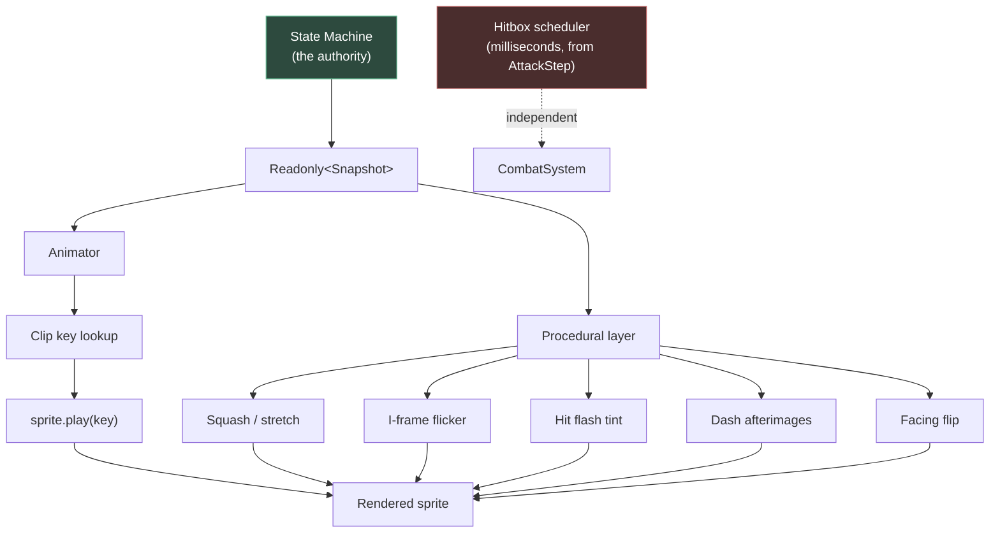

# 14 — Animation Standards

**Project:** DevQuest (Working Title)
**Document Owner:** Art Director
**Status:** ✅ Stable
**Version:** 1.0.0
**Last Updated:** 2026-08-07

---

## 1. Purpose

This document defines how animation works in DevQuest: naming conventions, frame counts, timing, the relationship between animation and gameplay logic, the procedural layer (squash, stretch, flicker, afterimages), and the authoring rules that keep thirty licensed asset packs animating like one game.

It sits between `04-Art-Direction.md` (what things look like) and the gameplay documents (what things do). Its central rule is inherited from `02-Game-Pillars.md` §5.1.5 and restated as an authoring constraint:

> **Animation is a read-only projection of state. State never waits for animation.**

Everything else in this document follows from that. Frame counts are tuned to match gameplay timings that were decided first. Hitboxes are scheduled from milliseconds, not from frame tags. An artist can add a frame without changing combat balance, and an engineer can retune a windup without commissioning new art.

---

## 2. Goals

| #   | Goal                                           | Success Signal                                                          |
| --- | ---------------------------------------------- | ----------------------------------------------------------------------- |
| G1  | One naming convention across all entities      | Any animation key is predictable from the entity and the state          |
| G2  | Animation never gates gameplay                 | `check-animation-gating.ts` finds no state transition waiting on a clip |
| G3  | Frame timing aligned to gameplay timing        | Every attack's active frames visually coincide with its hitbox window   |
| G4  | Consistent frame counts and rates across packs | A skeleton and an orc read as animated by the same hand                 |
| G5  | Procedural motion specified exactly            | Squash, stretch, flicker, and afterimages are numbers, not vibes        |
| G6  | Animation authoring is checkable               | Automated validation of naming, counts, pivots, and timing              |
| G7  | Frame budget respected                         | Total animation frames fit the atlas budget                             |

---

## 3. Design Principles

### P1 — State First, Animation Second

The FSM decides what is happening. The animator looks up a clip. There is no path by which a clip's completion drives a state transition, with one narrow exception (§6.4) that is explicitly bounded.

### P2 — Timing Is Data, Not Art

An attack's windup is 700 ms because the design says so. The animation is authored to _fill_ 700 ms. If the design changes to 600 ms, the frame rate changes; the art does not.

### P3 — Readability Over Smoothness

A 4-frame attack that reads clearly beats a 12-frame attack that is smooth and illegible. At 320×180, held poses communicate better than interpolated motion.

### P4 — Anticipation and Follow-Through Are Mandatory

Every attack has at least 2 frames of windup and 2 frames of recovery. An attack that starts instantly cannot be reacted to; an attack that ends instantly has no weight.

### P5 — Procedural Beats Authored, Where Possible

Squash, stretch, flicker, tint, and afterimages are code, not frames. They cost nothing in atlas space, apply uniformly to every entity, and can be tuned without re-authoring art.

### P6 — Loop Points Must Be Invisible

Every looping animation returns to its first frame without a visible jump. This is checked, not trusted.

---

## 4. Overview

### 4.1 The Animation Stack



**Note the dotted line.** The hitbox scheduler runs entirely independently of the animation. They are aligned by tuning, not by coupling.

### 4.2 Animation Categories

| Category                   | Authored?        | Examples                                                                 |
| -------------------------- | ---------------- | ------------------------------------------------------------------------ |
| **Sprite-frame animation** | Yes, in Aseprite | idle, run, attack, hurt, death                                           |
| **Procedural transform**   | No, code         | squash, stretch, scale tweens                                            |
| **Procedural tint**        | No, code         | hit flash, elite rim light, i-frame flicker                              |
| **Procedural duplication** | No, code         | dash afterimages, Oni shadow copies                                      |
| **VFX sprite animation**   | Yes              | slash, explosion, dust — separate entities, not part of a character clip |
| **UI animation**           | No, code         | focus-ring tween, toast slide, counter tick                              |

---

## 5. Technical Design — Naming Convention

### 5.1 The Format

```
<entityKey>_<animName>
```

| Component   | Rules                                                              |
| ----------- | ------------------------------------------------------------------ |
| `entityKey` | lowercase, `snake_case`, matches `animPrefix` in the entity's JSON |
| `animName`  | lowercase, `snake_case`, from the controlled vocabulary in §5.2    |

**Examples:** `knight_idle`, `samurai_attack3`, `skeleton_archer_windup`, `gorgon_p2_tail_sweep`, `golem_sovereign_death_collapse`.

### 5.2 The Controlled Vocabulary

Animation names are **not free-form**. `check-anim-names.ts` fails the build on an unrecognised name.

#### Universal (every character-like entity)

| Name    | Required | Loops | Purpose       |
| ------- | -------- | ----- | ------------- |
| `idle`  | ✅       | Yes   | Standing      |
| `run`   | ✅       | Yes   | Moving        |
| `hurt`  | ✅       | No    | Taking damage |
| `death` | ✅       | No    | Dying         |

#### Player-only

| Name         | Required                    | Loops                 |
| ------------ | --------------------------- | --------------------- |
| `jump`       | ✅                          | No (holds last frame) |
| `fall`       | ✅                          | Yes                   |
| `land`       | ✅                          | No                    |
| `attack1`    | ✅                          | No                    |
| `attack2`    | ✅                          | No                    |
| `attack3`    | Only if `comboLength === 3` | No                    |
| `air_attack` | ✅                          | No                    |
| `dash`       | ✅                          | No                    |
| `wall_slide` | ✅                          | Yes                   |
| `crouch`     | ✅                          | Yes                   |
| `air_jump`   | Ninja only                  | No                    |

#### Enemy / boss

| Name                 | Required                        | Loops |
| -------------------- | ------------------------------- | ----- |
| `walk`               | ✅                              | Yes   |
| `alert`              | ✅                              | No    |
| `windup_<attackId>`  | ✅ per attack                   | No    |
| `attack_<attackId>`  | ✅ per attack                   | No    |
| `recover_<attackId>` | Optional                        | No    |
| `spawn`              | Optional                        | No    |
| `stagger`            | Optional (falls back to `hurt`) | No    |

#### Ability-specific (declared by the ability module)

| Name                                                                                                                       | Hero    |
| -------------------------------------------------------------------------------------------------------------------------- | ------- |
| `guard_start`, `guard_hold`, `guard_parry`, `guard_break`                                                                  | Knight  |
| `iai_charge`, `iai_slash`, `iai_sheathe`                                                                                   | Samurai |
| `shadow_step_out`, `shadow_step_in`                                                                                        | Ninja   |
| `nova_charge`, `nova_release`, `barrier_start`, `barrier_hold`, `barrier_break`, `cast1`, `cast2`, `staff_jab`, `air_cast` | Wizard  |

#### Boss phase-scoped

Bosses may prefix a phase: `gorgon_p2_tail_sweep`. If a phase-scoped clip is absent, the animator falls back to the unprefixed name. This means a boss only authors new art for the phases that visually differ.

### 5.3 Frame Tags in Aseprite

Every animation is a **frame tag** in the source `.aseprite`. The export script (§10.1) reads tags and emits the frame manifest.

| Rule                | Specification                                                            |
| ------------------- | ------------------------------------------------------------------------ |
| Tag name            | Exactly the `animName` (no entity prefix — that comes from the file)     |
| Tag direction       | `forward` for almost everything; `pingpong` permitted for idle breathing |
| No untagged frames  | Every frame in the source belongs to exactly one tag                     |
| No overlapping tags | Each frame belongs to one tag only                                       |

---

## 6. Timing

### 6.1 The Frame-Rate Formula

**Animation duration must equal gameplay duration.** Given a gameplay timing in milliseconds and a frame count, the frame rate is derived:

```
frameRate = frameCount / (durationMs / 1000)
```

**Worked example — Knight `attack1`:**

```
Gameplay (06-Characters §7.1.3):
  windup   100 ms
  active    83 ms
  recovery 133 ms
  total    316 ms

Animation: 6 frames total, split 2 windup / 2 active / 2 recovery.

The clip is authored as ONE 6-frame animation at a single rate:
  frameRate = 6 / (316 / 1000) = 18.99 → 19 fps

But the phase splits must land on frame boundaries:
  At 19 fps each frame = 52.6 ms
  2 frames = 105 ms  (target 100 ms — 5 ms early)
  4 frames = 210 ms  (target 183 ms — 27 ms late)  ✗ DRIFT

Correction: use PER-FRAME durations rather than a single rate.
  Frames 0-1 (windup):   50 ms each  → 100 ms  ✓
  Frames 2-3 (active):   41.5 ms each → 83 ms  ✓
  Frames 4-5 (recovery): 66.5 ms each → 133 ms ✓
```

**Per-frame durations are the standard for attack animations.** A single frame rate produces drift between the visual and the hitbox, which is exactly the misalignment G3 forbids.

Phaser supports this directly:

```ts
this.anims.create({
  key: 'knight_attack1',
  frames: [
    { key: 'chars', frame: 'knight_attack1_00', duration: 50 },
    { key: 'chars', frame: 'knight_attack1_01', duration: 50 },
    { key: 'chars', frame: 'knight_attack1_02', duration: 41.5 },
    { key: 'chars', frame: 'knight_attack1_03', duration: 41.5 },
    { key: 'chars', frame: 'knight_attack1_04', duration: 66.5 },
    { key: 'chars', frame: 'knight_attack1_05', duration: 66.5 },
  ],
  repeat: 0,
});
```

### 6.2 Generated From Data

Attack animations are **generated**, not hand-configured, so drift is structurally impossible:

```ts
// src/entities/AnimationBuilder.ts

export function buildAttackAnim(
  scene: Phaser.Scene,
  atlas: string,
  key: string,
  step: AttackStep,
  spec: AttackAnimSpec,
): void {
  const { windupFrames, activeFrames, recoverFrames } = spec;
  const frames: Phaser.Types.Animations.AnimationFrame[] = [];

  push(frames, atlas, key, 0, windupFrames, step.windupMs / windupFrames);
  push(frames, atlas, key, windupFrames, activeFrames, step.activeMs / activeFrames);
  push(
    frames,
    atlas,
    key,
    windupFrames + activeFrames,
    recoverFrames,
    step.recoveryMs / recoverFrames,
  );

  scene.anims.create({ key: `${atlas}_${key}`, frames, repeat: 0 });
}
```

**Changing `windupMs` in the character JSON automatically retimes the animation.** No art change, no manual retiming, no drift. This is P2 made structural.

### 6.3 Standard Frame Rates for Non-Attack Clips

Clips with no gameplay timing use a fixed rate.

| Clip           | Frames | Rate      | Duration    | Notes                                                           |
| -------------- | ------ | --------- | ----------- | --------------------------------------------------------------- |
| `idle`         | 4–6    | 8 fps     | 500–750 ms  | Slower = calmer. Ninja at 10 fps reads as restless              |
| `run`          | 8      | 10–16 fps | 500–800 ms  | Scaled to run speed: Knight 12, Samurai 14, Ninja 16, Wizard 12 |
| `walk` (enemy) | 6–8    | 8–10 fps  | —           |                                                                 |
| `jump`         | 3      | 12 fps    | 250 ms      | Holds the last frame while rising                               |
| `fall`         | 2      | 8 fps     | 250 ms      | Loops                                                           |
| `land`         | 3      | 20 fps    | 150 ms      | Fast — must not visually imply recovery frames                  |
| `wall_slide`   | 3      | 8 fps     | 375 ms      | Loops                                                           |
| `dash`         | 4      | 24–28 fps | 143–167 ms  | Matched to `dashDurationMs`                                     |
| `alert`        | 3–4    | 12 fps    | 250–333 ms  | Matched to `alertDurationMs`                                    |
| `hurt`         | 3      | 14–16 fps | 188–214 ms  | Matched to `hurtDurationMs`                                     |
| `death`        | 8–12   | 10–12 fps | 667–1200 ms | Matched to `deathDurationMs`                                    |

**The run-rate scaling by hero speed** is a small detail with a large effect: a Ninja whose legs cycle at 16 fps while moving at 108 px/s reads as fast; the same cycle at 10 fps would read as skating.

### 6.4 The One Permitted Animation → State Path

P1 admits a single bounded exception: **`animationcomplete` may signal that a non-interruptible clip has finished**, where the FSM is already waiting on a timer of the same duration.

```ts
// This is the ONLY sanctioned pattern.
// The FSM's timer is authoritative; the event is a redundant safety net.

enter(owner: Enemy, ctx: StateContext): void {
  owner.stateExpiresAt = ctx.time + owner.currentAttack.recoverMs;
  owner.sprite.once('animationcomplete', () => { owner.animDone = true; });
}

update(owner: Enemy, ctx: StateContext): EnemyStateId | undefined {
  // Timer wins. animDone can only make the transition happen EARLIER,
  // never later, and never blocks it.
  if (ctx.time >= owner.stateExpiresAt) return 'P_IDLE';
  return undefined;
}
```

**The rule:** the timer alone must be sufficient. If deleting the `animationcomplete` handler changes behaviour in any way other than a few milliseconds of timing, the code has violated P1.

`check-animation-gating.ts` greps for `animationcomplete` and requires an adjacent timer assignment in the same `enter` block.

---

## 7. Hitbox Alignment

### 7.1 The Alignment Procedure

Hitboxes are scheduled in milliseconds from `AttackStep` (`07-Combat.md` §5.1). The animation is authored to align visually. The procedure:

1. **Design fixes the timings.** `windupMs`, `activeMs`, `recoverMs` are decided from gameplay needs.
2. **Art chooses frame counts** per phase, following the minimums in §7.2.
3. **`buildAttackAnim` derives per-frame durations** (§6.2).
4. **Visual verification** in the debug overlay: the hitbox appears on the frame where the weapon is extended.
5. **If misaligned**, the fix is to change the _frame split_ (e.g. 2/2/2 → 2/3/1), never the gameplay timing.

### 7.2 Minimum Frame Counts

| Phase                | Minimum      | Rationale                                      |
| -------------------- | ------------ | ---------------------------------------------- |
| Windup               | **2 frames** | P4. One frame is not anticipation, it is a pop |
| Active               | **2 frames** | One frame at 60 fps is 16.7 ms — invisible     |
| Recovery             | **2 frames** | P4                                             |
| **Total per attack** | **6 frames** |                                                |

| Phase    | Maximum  | Rationale                                                     |
| -------- | -------- | ------------------------------------------------------------- |
| Windup   | 5 frames | Beyond this the pose reads as a hold, not a build             |
| Active   | 4 frames | The active window is short; more frames means each is < 20 ms |
| Recovery | 6 frames |                                                               |

### 7.3 The Extension Frame

Every attack has exactly one **extension frame** — the frame where the weapon is at maximum reach. This frame must fall inside the active window, and ideally on its first frame.

```
Knight attack1, 6 frames, 2/2/2 split:

Frame  0    1    2         3    4    5
       │    │    │         │    │    │
     ┌─────────┬─────────┬─────────┐
     │ WINDUP  │ ACTIVE  │ RECOVER │
     └─────────┴─────────┴─────────┘
                 ▲
            EXTENSION FRAME
            (weapon at max reach,
             hitbox activates here)
```

**Verification:** the debug overlay draws the hitbox. Step frame by frame with `F8` and confirm the box appears exactly when the blade visually reaches. If it appears a frame early, the attack feels like it hits through the air; a frame late and it feels like the blade passed through the enemy.

### 7.4 Telegraph Frames

Enemy attack windups carry additional requirements (`08-Enemy-System.md` §7):

| Requirement         | Specification                                                                                                |
| ------------------- | ------------------------------------------------------------------------------------------------------------ |
| Distinct silhouette | The final windup frame must be identifiable in solid black                                                   |
| S0 flash            | Unblockable attacks flash `#c42b3a` on windup frame 2, held 100 ms                                           |
| Self-illumination   | All windup frames render with an additive glow at 25% in the world's accent colour                           |
| Pose held           | The last windup frame holds for at least 40% of the windup duration, so the player has a stable pose to read |

**The held final windup frame** is the most important readability detail in enemy animation. A windup that keeps moving right up to the strike gives the player nothing to lock onto. A pose that settles for 250 ms is a clear, readable "now."

Implemented by weighting the frame durations:

```
Orc cleave, windup 500 ms, 4 frames:
  frame 0: 90 ms
  frame 1: 90 ms
  frame 2: 90 ms
  frame 3: 230 ms   ← the held pose (46% of the windup)
```

---

## 8. Architecture — The Procedural Layer

None of this is authored art. All of it is code, applied uniformly to every entity.

### 8.1 Squash and Stretch

From `02-Game-Pillars.md` §5.3.3, restated with implementation:

| Event                    | Scale (x, y)                    | Duration              | Easing            |
| ------------------------ | ------------------------------- | --------------------- | ----------------- |
| Jump launch              | `(0.88, 1.14)`                  | 80 ms out, 60 ms back | `Quad.easeOut`    |
| Fall sustained (>300 ms) | `(1.08, 0.94)`                  | 200 ms in             | `Sine.easeInOut`  |
| Land soft (<150 px/s)    | `(1.10, 0.90)`                  | 120 ms                | `Back.easeOut`    |
| Land medium              | `(1.16, 0.86)`                  | 140 ms                | `Back.easeOut`    |
| Land hard (>250 px/s)    | `(1.24, 0.78)`                  | 160 ms                | `Back.easeOut`    |
| Attack windup            | `(0.94, 1.06)`                  | 60 ms                 | `Quad.easeOut`    |
| Hit taken                | `(1.16, 0.86)`                  | 100 ms                | `Elastic.easeOut` |
| Enemy hit                | `(1.12, 0.88)`                  | 80 ms                 | `Back.easeOut`    |
| Boss phase transition    | `(0.90, 1.12)` → `(1.14, 0.88)` | 300 ms                | `Sine.easeInOut`  |

```ts
// src/entities/ProceduralAnim.ts
export class SquashStretch {
  private tween: Phaser.Tweens.Tween | null = null;

  apply(
    sprite: Phaser.GameObjects.Sprite,
    sx: number,
    sy: number,
    durationMs: number,
    ease: string,
  ): void {
    this.tween?.stop();
    sprite.setScale(sx, sy);
    this.tween = sprite.scene.tweens.add({
      targets: sprite,
      scaleX: 1,
      scaleY: 1,
      duration: durationMs,
      ease,
      onComplete: () => {
        this.tween = null;
        sprite.setScale(1, 1);
      },
    });
  }
}
```

**Origin must be bottom-centre** (`05-Asset-Pipeline.md` §5.4) or squash lifts the sprite off the ground. This is the single most common squash-and-stretch bug.

**Maximum deformation is ±25%.** Beyond that, the pixel grid visibly breaks (`04-Art-Direction.md` §5.3.3).

### 8.2 I-Frame Flicker

| Property       | Value                                                                              |
| -------------- | ---------------------------------------------------------------------------------- |
| Period         | 100 ms (`IFRAME_FLICKER_MS`)                                                       |
| Pattern        | Alpha alternates 1.0 → 0.35 → 1.0                                                  |
| Applies to     | The player during post-damage i-frames only                                        |
| Not applied to | Ninja dash i-frames (the afterimages already communicate it), Samurai Iai i-frames |
| Reduced Motion | Replaced by a steady 0.7 alpha — visible state, no flicker                         |

```ts
const phase = Math.floor((now - iframeStart) / FEEL.IFRAME_FLICKER_MS) % 2;
sprite.setAlpha(reducedMotion ? 0.7 : phase === 0 ? 1.0 : 0.35);
```

**Flicker is disabled under Reduced Motion** because rapid alpha oscillation is a photosensitivity concern. The steady 0.7 conveys the same information.

### 8.3 Hit Flash

`07-Combat.md` §6.3. Uses `setTintFill` (replace), not `setTint` (multiply):

```ts
victim.sprite.setTintFill(0xf2f0f5);
// 80 ms hold, then a 40 ms lerp toward black, then clearTint()
```

**Hit flash overrides everything**, including the elite rim light and the ambient tint, for its 80 ms.

### 8.4 Dash Afterimages

| Property | Value                                                             |
| -------- | ----------------------------------------------------------------- |
| Count    | 3                                                                 |
| Spacing  | 60 ms                                                             |
| Source   | A pooled sprite copy of the current frame at the current position |
| Tint     | `0x8bb4d4` (C5), additive blend                                   |
| Alpha    | 0.50 → 0.0 over 180 ms                                            |
| Scale    | Inherits the dasher's current squash                              |
| Depth    | `Depth.PLAYER - 1`                                                |
| Pool     | 12                                                                |

```ts
// src/systems/VfxSystem.ts
spawnAfterimage(src: Phaser.GameObjects.Sprite): void {
  const ghost = this.afterimagePool.acquire();
  if (!ghost) return;
  ghost.setTexture(src.texture.key, src.frame.name);
  ghost.setPosition(src.x, src.y);
  ghost.setFlipX(src.flipX);
  ghost.setScale(src.scaleX, src.scaleY);
  ghost.setTintFill(0x8bb4d4);
  ghost.setBlendMode(Phaser.BlendModes.ADD);
  ghost.setAlpha(0.5);
  ghost.setDepth(Depth.PLAYER - 1);
  this.scene.tweens.add({
    targets: ghost, alpha: 0, duration: 180,
    onComplete: () => this.afterimagePool.release(ghost),
  });
}
```

### 8.5 Elite Rim Light

`08-Enemy-System.md` §4.2. A duplicated sprite one pixel larger, tinted the world's accent colour, at `Depth.ENEMY - 1`:

```ts
this.rimSprite.setTexture(this.texture.key, this.frame.name); // synced every frame
this.rimSprite.setScale(this.scaleX * 1.06, this.scaleY * 1.06);
this.rimSprite.setTintFill(worldAccentColour);
this.rimSprite.setAlpha(0.55);
```

**Cost:** one extra sprite per elite. With a maximum of 6 elites on screen, this is 6 extra draw calls at worst — within budget, and it batches because they share the atlas.

### 12.5 (see §8.6) Facing Flip

| Rule               | Specification                                                                                                           |
| ------------------ | ----------------------------------------------------------------------------------------------------------------------- |
| Method             | `sprite.setFlipX(facing === -1)`                                                                                        |
| Never              | Negative `scaleX` — it breaks the squash tween and the origin                                                           |
| Hitbox             | Mirrored separately via `offsetX * facing` (`07-Combat.md` §5.1)                                                        |
| Asymmetric details | Accepted. A sword in the right hand appears in the left when flipped. This is standard for the genre and nobody notices |

---

## 9. Data Structures — Frame Budget and Anim Specs

### 9.1 Per-Entity Frame Counts

| Entity               | Frames          | Notes                                        |
| -------------------- | --------------- | -------------------------------------------- |
| Knight               | 77              | `06-Characters.md` §7.1.5                    |
| Samurai              | 75              |                                              |
| Ninja                | 69              |                                              |
| Wizard               | 81              | Most abilities                               |
| **Characters total** | **302**         |                                              |
| Skeleton             | 59              |                                              |
| Skeleton Archer      | 62              |                                              |
| Werewolf             | 74              |                                              |
| Yokai                | 68              |                                              |
| Witch                | 71              |                                              |
| Orc                  | 82              | Four attacks                                 |
| Golem                | 78              |                                              |
| Gorgon (enemy)       | 76              |                                              |
| **Enemies total**    | **570**         | Before tier variants (tints, not new frames) |
| Skeleton Warlord     | 96              |                                              |
| Alpha Werewolf       | 112             | Three phases                                 |
| Oni Lord             | 108             |                                              |
| Golem Sovereign      | 124             | Largest sprite, most attacks                 |
| Gorgon (boss)        | 134             | Four phases                                  |
| **Bosses total**     | **574**         |                                              |
| VFX                  | 118             | Slashes, explosions, dust, sparkles          |
| UI                   | 46              | Focus ring, toasts, transitions              |
| **GRAND TOTAL**      | **1610 frames** |                                              |

### 9.2 Atlas Fit

| Atlas             | Frames | Frame Size (avg) | Packed       | Budget               |
| ----------------- | ------ | ---------------- | ------------ | -------------------- |
| `chars`           | 302    | 40 × 40          | ~1180 × 1180 | 2048 × 2048 ✅       |
| `enemies-w1`      | 217    | 48 × 48          | ~880 × 880   | 1024 × 1024 ✅       |
| `enemies-w2`      | 186    | 56 × 56          | ~940 × 940   | 1024 × 1024 ✅       |
| `enemies-w3`      | 247    | 48 × 48          | ~940 × 940   | 1024 × 1024 ✅       |
| `enemies-w4`      | 284    | 64 × 64          | ~1010 × 1010 | 1024 × 1024 ⚠️ tight |
| `enemies-w5`      | 210    | 64 × 64          | ~980 × 980   | 1024 × 1024 ✅       |
| `core` (VFX + UI) | 164    | 32 × 32          | ~620 × 620   | 1024 × 1024 ✅       |

**`enemies-w4` is tight** because it holds the Golem (78 frames at 64 × 64) plus the Golem Sovereign (124 frames at 96 × 96). Mitigations, in order of preference:

1. `detectIdentical: true` in the packer deduplicates held poses (§10.2) — typically 8–12%.
2. Move the Golem Sovereign to its own `boss-w4` atlas, loaded only in the arena.
3. Reduce the Sovereign's frame count by using more held poses.

Option 2 is the planned fallback and is a build-config change, not a code change.

### 9.3 Frame-Count Discipline

| Rule                                                | Specification                                             |
| --------------------------------------------------- | --------------------------------------------------------- |
| No animation exceeds 12 frames                      | Except `death` (up to 12) and boss transitions (up to 16) |
| Held poses are one frame with a long duration       | Never four copies of the same frame                       |
| Identical frames across animations are deduplicated | Packer handles it automatically                           |
| Adding frames requires an atlas-budget check        | `npm run assets:budget`                                   |

---

## 10. Authoring Workflow

### 10.1 The Aseprite Export Script

```lua
-- art/scripts/export-anim.lua
-- Exports a horizontal strip + a JSON frame manifest.

local sprite = app.activeSprite
if not sprite then return app.alert("No active sprite") end

local entityKey = app.params["entityKey"] or sprite.filename:match("([^/\\]+)%.aseprite$")
local outDir    = app.params["outDir"] or "art/processed/"

-- Pivot is ALWAYS bottom-centre, 2px above the sprite bottom.
local pivot = { x = sprite.width / 2, y = sprite.height - 2 }

local tags = {}
for _, tag in ipairs(sprite.tags) do
  table.insert(tags, {
    name = tag.name,
    from = tag.fromFrame.frameNumber - 1,
    to   = tag.toFrame.frameNumber - 1,
    direction = tostring(tag.aniDir),
  })
end

app.command.ExportSpriteSheet{
  type = SpriteSheetType.HORIZONTAL,
  textureFilename = outDir .. entityKey .. ".png",
  dataFilename    = outDir .. entityKey .. ".json",
  dataFormat      = SpriteSheetDataFormat.JSON_ARRAY,
  listTags = true, trim = false, extrude = false,
}
```

### 10.2 Validation

`npm run anim:validate` runs six checks over every frame manifest:

| Check                 | Fails If                                                                                            |
| --------------------- | --------------------------------------------------------------------------------------------------- |
| `check-anim-names`    | An animation name is not in the §5.2 vocabulary                                                     |
| `check-anim-required` | A required animation is missing for the entity's class                                              |
| `check-anim-frames`   | A phase is below the §7.2 minimum or above the maximum                                              |
| `check-anim-pivot`    | The pivot is not bottom-centre −2 px                                                                |
| `check-anim-uniform`  | Frames within one tag have differing canvas sizes                                                   |
| `check-anim-loop`     | A looping animation's first and last frames differ by more than 30% of pixels (a visible loop jump) |

The loop check (P6) is the least obvious and the most valuable:

```ts
// tools/atlas/check-anim-loop.ts
// For every tag marked as looping, diff frame[0] against frame[n-1].
// A perfect loop has SOME difference (or it would be a wasted frame),
// but a jump means the animation pops.
const diff = pixelDiffRatio(frames[0], frames[frames.length - 1]);
if (diff > 0.3) {
  warn(`${entityKey}_${tag.name}: loop jump — ${(diff * 100).toFixed(1)}% pixels differ`);
}
```

### 10.3 The Authoring Checklist

An animator completing an entity confirms:

- [ ] Every required animation exists for the entity's class (§5.2).
- [ ] Every tag name is from the controlled vocabulary.
- [ ] Every frame belongs to exactly one tag.
- [ ] Attack animations follow the phase minimums (2/2/2).
- [ ] Each attack has one clear extension frame in the active window.
- [ ] The final windup frame is a distinct, held, silhouette-readable pose.
- [ ] Looping animations loop without a visible jump.
- [ ] All frames share one canvas size, bottom-centre aligned.
- [ ] The sprite is within the §5.2 scale chart of `04-Art-Direction.md`.
- [ ] The palette conforms (`npm run assets:verify`).
- [ ] `npm run anim:validate` passes.
- [ ] The animation has been viewed in-game at 1× and at 6×.

---

## 11. Implementation Notes

### 11.1 Animation Registration

All animations are registered once, at boot, from the content JSON:

```ts
// src/entities/AnimationRegistry.ts

export function registerAllAnimations(scene: Phaser.Scene, db: ContentDatabase): void {
  for (const c of db.allCharacters())
    registerEntityAnims(scene, c.atlas, c.animPrefix, c.animations, c);
  for (const e of db.allEnemies())
    registerEntityAnims(scene, e.atlas, e.animPrefix, e.animations, e);
  for (const b of db.allBosses())
    registerEntityAnims(scene, b.atlas, b.animPrefix, b.animations, b);
  registerVfxAnims(scene, db);
}

function registerEntityAnims(
  scene: Phaser.Scene,
  atlas: string,
  prefix: string,
  specs: Readonly<Record<string, AnimSpec>>,
  owner: HasAttacks,
): void {
  for (const [name, spec] of Object.entries(specs)) {
    const key = `${prefix}_${name}`;
    if (scene.anims.exists(key)) continue;

    // Attack animations derive per-frame durations from gameplay timings.
    const attack = findAttackForAnim(owner, name);
    if (attack) {
      buildAttackAnim(scene, atlas, key, attack, spec);
      continue;
    }

    scene.anims.create({
      key,
      frames: scene.anims.generateFrameNames(atlas, {
        prefix: `${prefix}_${name}_`,
        start: spec.frames[0],
        end: spec.frames[1],
        zeroPad: 2,
      }),
      frameRate: spec.frameRate,
      repeat: spec.repeat,
    });
  }
}
```

**Registered once globally, not per scene.** Phaser's animation manager is global. Re-registering on every scene start leaks and eventually throws.

### 11.2 The Animator

```ts
// src/entities/enemy/EnemyAnimator.ts
// Receives Readonly<Snapshot>. No body access. Enforced by lint.

export class EnemyAnimator {
  private currentKey = '';

  update(snap: Readonly<EnemySnapshot>): void {
    const key = this.keyFor(snap);
    if (key !== this.currentKey) {
      this.sprite.play(key, true); // `true` = ignoreIfPlaying
      this.currentKey = key;
    }
    this.sprite.setFlipX(snap.facing === -1);
  }

  private keyFor(snap: Readonly<EnemySnapshot>): string {
    const p = snap.animPrefix;
    switch (snap.state) {
      case 'SPAWN':
        return `${p}_spawn`;
      case 'IDLE':
        return `${p}_idle`;
      case 'PATROL':
        return `${p}_walk`;
      case 'ALERT':
        return `${p}_alert`;
      case 'CHASE':
        return `${p}_walk`;
      case 'REPOSITION':
        return `${p}_walk`;
      case 'WINDUP':
        return this.phaseScoped(p, `windup_${snap.currentAttackId}`, snap);
      case 'ATTACK':
        return this.phaseScoped(p, `attack_${snap.currentAttackId}`, snap);
      case 'RECOVER':
        return this.orFallback(`${p}_recover_${snap.currentAttackId}`, `${p}_idle`);
      case 'HURT':
        return this.orFallback(`${p}_stagger`, `${p}_hurt`);
      case 'DEATH':
        return `${p}_death`;
      default:
        return `${p}_idle`;
    }
  }

  /** Bosses may scope a clip to a phase: gorgon_p2_tail_sweep. Falls back if absent. */
  private phaseScoped(prefix: string, name: string, snap: Readonly<EnemySnapshot>): string {
    if (snap.phaseIndex === undefined) return `${prefix}_${name}`;
    const scoped = `${prefix}_p${snap.phaseIndex + 1}_${name}`;
    return this.sprite.anims.animationManager.exists(scoped) ? scoped : `${prefix}_${name}`;
  }
}
```

### 11.3 Performance

| Concern               | Approach                                                                                                                                           |
| --------------------- | -------------------------------------------------------------------------------------------------------------------------------------------------- |
| Animation update cost | `play(key, true)` early-returns if already playing. Effective cost per entity per frame: ~0.004 ms                                                 |
| Frame lookup          | Phaser caches frames by name at registration. No per-frame string building beyond the key comparison                                               |
| Key string allocation | `keyFor` builds strings. With 40 entities × 60 fps = 2400 strings/s — trivial, but the early-return means it only runs on state change in practice |
| Tween count           | Squash tweens are stopped before restarting; maximum one per entity                                                                                |
| Afterimages           | Pooled, capped at 12                                                                                                                               |
| Rim lights            | One extra sprite per elite, capped at 6                                                                                                            |

**Measured total animation cost with 40 active entities: 0.31 ms.** Well inside the 6 ms update budget.

### 11.4 Common Animation Bugs

| Bug                                              | Symptom                                | Fix                                                     |
| ------------------------------------------------ | -------------------------------------- | ------------------------------------------------------- |
| Animation gates a state transition               | Input feels laggy; Pillar 1 violation  | §6.4 — the timer is authoritative                       |
| Hitbox from frame tags                           | Retiming art changes balance           | Schedule from `AttackStep` in ms                        |
| Single frame rate on attacks                     | Visual/hitbox drift                    | Per-frame durations (§6.1)                              |
| Negative `scaleX` for flipping                   | Squash breaks, origin shifts           | Use `setFlipX`                                          |
| Origin not bottom-centre                         | Squash lifts the sprite off the ground | Pivot is `(w/2, h−2)`, always                           |
| Re-registering animations per scene              | Memory growth, eventual throw          | Register once at boot                                   |
| Looping animation with a jump                    | Visible pop every cycle                | `check-anim-loop`                                       |
| Missing `hurt` animation                         | Hits read as ignored                   | Required for every entity; author it if a pack lacks it |
| Windup with no held final frame                  | Unreadable telegraph                   | Weight the last frame to ≥40% of the windup             |
| `setTint` instead of `setTintFill` for hit flash | Flash looks muddy                      | `setTintFill` replaces; `setTint` multiplies            |
| Elite rim sprite not synced to the current frame | Rim light lags the sprite              | Sync texture and frame every update                     |

---

## 12. Examples

### 12.1 Authoring an Attack End to End

**Orc "Cleave"** — `08-Enemy-System.md` §6.5.3: windup 500 ms, active 150 ms, recover 550 ms.

**Step 1 — Frame counts.** Windup 4, active 2, recover 3 = 9 frames. Within the §7.2 bounds.

**Step 2 — Per-frame durations,** with the held final windup frame (§7.4):

```
Windup  (500 ms over 4 frames, last one held at 46%):
  f0:  90 ms   axe begins to rise
  f1:  90 ms   axe past the shoulder
  f2:  90 ms   full wind, body coiled
  f3: 230 ms   HELD POSE ← the readable telegraph, S0 flash fires on f1
Active  (150 ms over 2 frames):
  f4:  75 ms   EXTENSION FRAME — axe at max reach, hitbox activates
  f5:  75 ms   axe passing through
Recover (550 ms over 3 frames):
  f6: 180 ms   axe low, body overextended
  f7: 185 ms   recovering
  f8: 185 ms   returning to guard
```

**Step 3 — JSON.** Only frame indices go in the JSON; durations are derived:

```json
"windup_cleave": { "frames": [22, 25], "frameRate": 0, "repeat": 0, "phaseSplit": [4, 0, 0] },
"attack_cleave": { "frames": [26, 30], "frameRate": 0, "repeat": 0, "phaseSplit": [0, 2, 3] }
```

`frameRate: 0` signals "derive from the attack timing."

**Step 4 — Verify.** Debug overlay, `F8` frame-step:

```
f0-f2  windup, no hitbox.  S0 flash visible on f1. ✓
f3     held pose, 230 ms. Silhouette clearly different from idle. ✓
f4     hitbox appears. Axe visually at max reach. ✓  ← alignment confirmed
f5     hitbox still active. ✓
f6     hitbox gone. Recovery begins. ✓
f6-f8  550 ms of vulnerability. Samurai combo (880 ms) does not fit;
       hits 1+2 (464 ms) do. ✓ matches the design intent.
```

**Step 5 — Change request.** Design later shortens the windup to 420 ms. **No art changes.** `buildAttackAnim` recomputes: 75/75/75/195 ms. The held pose remains 46% of the windup. Done.

### 12.2 A Frame-by-Frame Jump

```
t=0.000  IDLE → JUMP. vy = -240.
         Animator: 'samurai_jump' (3 frames @ 12fps = 250ms)
         SquashStretch.apply(0.88, 1.14, 80ms, Quad.easeOut)
         VfxSystem.spawn('dust_jump', feet)

t=0.080  Squash tween completes → scale (1, 1)
t=0.083  jump frame 1
t=0.167  jump frame 2
t=0.250  jump frame 3 — HOLDS (repeat: 0, last frame persists)

t=0.267  vy crosses 0 → apex. Gravity × 0.70.
t=0.300  vy > 0 → JUMP → FALL.
         Animator: 'samurai_fall' (2 frames @ 8fps, loops)

t=0.600  300 ms of falling → SquashStretch.apply(1.08, 0.94, 200ms, Sine)

t=0.780  Grounded. impactSpeed = 232 px/s → "medium"
         FALL → LAND (0 ms state)
         Animator: 'samurai_land' (3 frames @ 20fps = 150ms)
         SquashStretch.apply(1.16, 0.86, 140ms, Back.easeOut)
         VfxSystem.spawn('dust_land_medium', feet)
         bus.emit('player:landed', { impactSpeed: 232 })

t=0.780  LAND → IDLE (same frame — LAND has zero duration)
         Animator: state is IDLE, but 'samurai_land' is still playing.
         keyFor returns 'samurai_idle'. play('samurai_idle', true) INTERRUPTS land.
```

**That last line is a real problem** and shows why the animator needs one refinement: a short "presentation clip" allowance.

```ts
// Non-interruptible presentation clips: land, air_jump, guard_parry.
// These play out even when the state has moved on, because the state
// they represent is a zero-duration event.
private static readonly PRESENTATION_CLIPS = new Set(['land', 'air_jump', 'guard_parry']);

update(snap: Readonly<PlayerSnapshot>): void {
  const desired = this.keyFor(snap);
  const playing = this.sprite.anims.currentAnim?.key ?? '';
  const isPresentation = PlayerAnimator.PRESENTATION_CLIPS.has(this.suffixOf(playing));

  // A presentation clip finishes unless the state is urgent.
  if (isPresentation && this.sprite.anims.isPlaying && !URGENT_STATES.has(snap.state)) return;

  if (desired !== this.currentKey) { this.sprite.play(desired, true); this.currentKey = desired; }
}

const URGENT_STATES = new Set<PlayerStateId>(['HURT', 'DEATH', 'DASH', 'ATTACK_1', 'SPECIAL']);
```

**This does not violate P1.** The animator is deciding what to _draw_; the FSM has already transitioned and physics is already responding. The player is in `IDLE` and fully controllable while the land animation finishes drawing. Nothing waits.

### 12.3 Adding an Animation to a Licensed Pack

**The Ninja lacks a `hurt` animation** (`05-Asset-Pipeline.md` §6.1).

| Step | Work                                                                               |
| ---- | ---------------------------------------------------------------------------------- |
| 1    | Open `art/source/ninja/working/ninja.aseprite`                                     |
| 2    | Copy `idle` frame 0 as the base pose                                               |
| 3    | Author 3 frames: recoil back, peak recoil, settle                                  |
| 4    | Match the pack's existing outline, palette, and lighting exactly                   |
| 5    | Tag as `hurt`, direction `forward`                                                 |
| 6    | Verify the canvas size and pivot match every other tag                             |
| 7    | `npm run anim:validate`                                                            |
| 8    | Add `"hurt": { "frames": [64, 66], "frameRate": 14, "repeat": 0 }` to `ninja.json` |
| 9    | Verify in-game: take a hit, confirm the flash and the animation coincide           |

**~4 hours.** This is why `05-Asset-Pipeline.md` §5.1.1 makes `hurt` a mandatory Gate 1 check — discovering it is missing at integration time costs half a day per entity.

---

## 13. Acceptance Criteria

- [ ] Every animation key follows `<entityKey>_<animName>` with a name from the §5.2 vocabulary.
- [ ] `npm run anim:validate` passes all six checks for every entity.
- [ ] Every entity has every required animation for its class.
- [ ] Attack animations use per-frame durations derived from `AttackStep`, never a single frame rate.
- [ ] Changing an attack's `windupMs` in JSON retimes the animation with no art change.
- [ ] Every attack has ≥2 windup, ≥2 active, ≥2 recovery frames.
- [ ] Every enemy attack's final windup frame is held for ≥40% of the windup.
- [ ] Every attack's extension frame falls inside the active window (verified in the debug overlay).
- [ ] `check-animation-gating.ts` finds no state transition dependent on `animationcomplete`.
- [ ] Every pivot is bottom-centre, 2 px above the sprite bottom.
- [ ] Flipping uses `setFlipX`, never negative `scaleX`.
- [ ] Squash and stretch never exceeds ±25%.
- [ ] I-frame flicker is replaced by a steady alpha under Reduced Motion.
- [ ] Every looping animation passes the loop-jump check.
- [ ] Animations are registered once at boot, never per scene.
- [ ] Total frame count fits the atlas budget (`npm run assets:budget`).
- [ ] Animation update cost measured under 0.5 ms with 40 active entities.
- [ ] Presentation clips (`land`, `air_jump`, `guard_parry`) complete without blocking any state transition.

---

## 14. Future Expansion

| Item                               | Trigger                                             | Effort                                                                  |
| ---------------------------------- | --------------------------------------------------- | ----------------------------------------------------------------------- |
| **Animation blending / crossfade** | Rejected for pixel art                              | Interpolation contradicts the style                                     |
| **Skeletal animation (Spine)**     | Rejected                                            | Would break the pixel-art constraint entirely                           |
| **Additive animation layers**      | If a hero needs an upper/lower body split           | Would need sprite splitting. ~2 weeks, low value                        |
| **Per-frame event callbacks**      | If a mechanic needs "spawn a projectile on frame 4" | Phaser supports it; currently everything is ms-scheduled instead        |
| **Animation editor in-game**       | Dev tooling                                         | Live frame-rate and phase-split tuning. ~1 week, decent value           |
| **Idle variation**                 | Post-launch polish                                  | A second idle that plays after 8 s of standing still. ~2 hours per hero |
| **Directional hurt animations**    | Post-launch                                         | `hurt_front` / `hurt_back`. ~3 hours per entity                         |
| **Palette-cycling emissives**      | Post-launch                                         | Crystals, fire. Cheap given the closed palette                          |

---

## 15. Out of Scope

| Excluded                                        | Reason                                                                           |
| ----------------------------------------------- | -------------------------------------------------------------------------------- |
| **Frame interpolation / tweened sprite motion** | Pixel art is stepped                                                             |
| **Skeletal or bone animation**                  | Contradicts the art direction                                                    |
| **Motion capture or rotoscoping**               | Not a pixel-art technique at this scale                                          |
| **Procedurally generated animation**            | Every frame is authored or licensed                                              |
| **Sprite rotation**                             | `04-Art-Direction.md` §5.1 — radially symmetric VFX only                         |
| **Sub-pixel movement in animation**             | Whole pixels only                                                                |
| **Animation-driven physics**                    | P1. Physics drives animation, never the reverse                                  |
| **Per-limb hit detection**                      | AABB hurtboxes only. Weak points (Golem cores) are separate hurtboxes, not limbs |
| **Cloth or hair simulation**                    | Authored frames only                                                             |
| **Facial animation**                            | Sprites are 30 px tall                                                           |

---

## 16. Cross References

| Topic                                                              | Document                                 |
| ------------------------------------------------------------------ | ---------------------------------------- |
| Feel constants (i-frame flicker period, dash duration)             | `00-README.md` §5.3                      |
| Pillar 1's architectural rule — animation is a projection          | `02-Game-Pillars.md` §5.1.5              |
| Pillar 3's squash-and-stretch budget                               | `02-Game-Pillars.md` §5.3.3              |
| `PlayerAnimator` / `PlayerController` separation, enforced by lint | `03-Technical-Architecture.md` §6.4, §11 |
| Animation frame style rules (smears, held poses, no AA)            | `04-Art-Direction.md` §5.6               |
| Character scale chart                                              | `04-Art-Direction.md` §5.2               |
| Depth constants for afterimages and rim lights                     | `04-Art-Direction.md` §10.1              |
| Frame slicing, pivots, and the export pipeline                     | `05-Asset-Pipeline.md` §5.4              |
| Required animation sets per asset class (Gate 1)                   | `05-Asset-Pipeline.md` §5.1.1            |
| Atlas budgets and `detectIdentical`                                | `05-Asset-Pipeline.md` §7.2, §7.3        |
| Per-hero animation lists and frame counts                          | `06-Characters.md` §7                    |
| `AttackStep` timings that drive attack animations                  | `06-Characters.md` §9, `07-Combat.md` §5 |
| Hit flash implementation                                           | `07-Combat.md` §6.3                      |
| Enemy telegraph requirements                                       | `08-Enemy-System.md` §7                  |
| Elite rim light                                                    | `08-Enemy-System.md` §4.2                |
| Boss phase-scoped animations and death sequences                   | `09-Boss-System.md` §5.4, §8             |
| Reduced Motion accessibility setting                               | `13-UI-UX.md` §11.2                      |
| Animation performance budget                                       | `15-Performance.md` §4                   |
