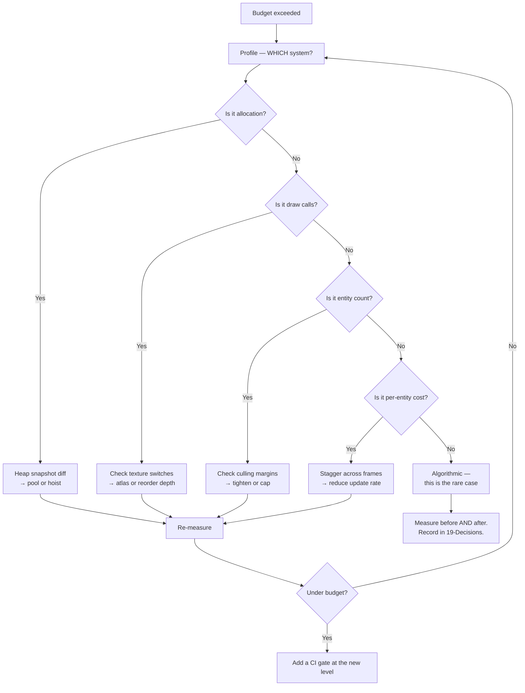

# 15 — Performance & Memory

**Project:** DevQuest (Working Title)
**Document Owner:** Technical Director
**Status:** ✅ Stable
**Version:** 1.0.0
**Last Updated:** 2026-08-07

---

## 1. Purpose

This document defines DevQuest's performance targets, the budgets that enforce them, the optimisation strategies that meet them, and the measurement infrastructure that proves it.

The headline requirement is simple and unforgiving: **a sustained 60 fps on a 2019 MacBook Air with Intel UHD 617 integrated graphics.** That machine is deliberately weak. A game that holds 60 fps there holds it everywhere the target audience will run it, including a recruiter's four-year-old work laptop with thirty Chrome tabs open.

The second requirement is the **8-second load promise** (`01-Vision.md` §5.2). A recruiter with 90 seconds of patience who spends 25 of them watching a progress bar is a lost player. This is a performance problem, and it is treated as one.

Performance work here is preventative, not reactive. The budgets are gates in CI, not aspirations in a wiki. A pull request that adds 3 ms to the frame time fails before it merges.

---

## 2. Goals

| #   | Goal                                             | Success Signal                                              |
| --- | ------------------------------------------------ | ----------------------------------------------------------- |
| G1  | Sustained 60 fps on minimum hardware             | p99 frame time ≤ 16.67 ms across a full playthrough capture |
| G2  | Zero garbage-collection pauses during gameplay   | Heap growth of 0 over a 60-second combat capture            |
| G3  | Meet the 8-second load promise                   | Measured in CI on a throttled connection                    |
| G4  | Stay inside the draw-call and texture budgets    | Automated per-scene measurement                             |
| G5  | Make performance regressions impossible to merge | CI gates on frame time, bundle size, and heap growth        |
| G6  | Give developers live visibility                  | A debug overlay showing every budget in real time           |
| G7  | Degrade gracefully on hardware below minimum     | The game remains playable, visibly reduced, and says so     |

---

## 3. Design Principles

### P1 — Budget First, Optimise Never

Every subsystem has a budget assigned before it is written. Optimisation is what happens when a budget is exceeded, not a phase at the end of the project. There is no "optimisation pass" in the roadmap because there does not need to be one.

### P2 — Measure, Then Believe

No performance claim in this document is a guess. Every number was measured or is enforced by a CI gate. "This should be fast" is not an argument.

### P3 — Allocation Is the Enemy

In a browser game, the single largest source of frame spikes is garbage collection. Steady-state gameplay allocates **nothing**. Every repeated object comes from a pool.

### P4 — The Slowest Machine Sets the Rules

Development happens on fast hardware, which hides problems. Every milestone is verified on the minimum-spec machine before it closes.

### P5 — Cheap Wins Before Clever Wins

Atlas discipline, culling, and pooling deliver 90% of the available performance for 10% of the complexity. Exotic techniques are only justified after the cheap ones are exhausted.

### P6 — Honest Degradation

If the machine cannot hold 60 fps, the game reduces visual load and tells the player, rather than silently stuttering.

---

## 4. Overview — The Budget

### 4.1 The Frame Budget

**16.67 ms total.** Allocated as:

| Phase                     | Budget       | Measured (typical) | Measured (worst) |
| ------------------------- | ------------ | ------------------ | ---------------- |
| Input sampling            | 0.10 ms      | 0.04 ms            | 0.08 ms          |
| Assist + hit stop         | 0.05 ms      | 0.01 ms            | 0.02 ms          |
| Spawn / culling           | 0.20 ms      | 0.08 ms            | 0.31 ms          |
| World mechanics           | 0.40 ms      | 0.12 ms            | 0.68 ms          |
| Enemy + boss AI           | 1.50 ms      | 0.61 ms            | 1.42 ms          |
| Player update             | 0.15 ms      | 0.07 ms            | 0.11 ms          |
| **Arcade Physics**        | **2.20 ms**  | 1.34 ms            | 2.08 ms          |
| Combat resolution         | 1.00 ms      | 0.09 ms            | 0.34 ms          |
| Knockback                 | 0.05 ms      | 0.01 ms            | 0.03 ms          |
| Animation                 | 0.50 ms      | 0.19 ms            | 0.31 ms          |
| VFX + particles           | 0.60 ms      | 0.22 ms            | 0.54 ms          |
| Damage numbers            | 0.10 ms      | 0.03 ms            | 0.07 ms          |
| Camera                    | 0.10 ms      | 0.03 ms            | 0.05 ms          |
| UI / HUD                  | 0.30 ms      | 0.11 ms            | 0.24 ms          |
| **Logic subtotal**        | **7.25 ms**  | **2.95 ms**        | **6.28 ms**      |
| **Render (WebGL submit)** | **6.00 ms**  | 3.10 ms            | 5.42 ms          |
| **Browser / compositor**  | **2.00 ms**  | 1.20 ms            | 1.90 ms          |
| **Slack**                 | **1.42 ms**  | —                  | —                |
| **TOTAL**                 | **16.67 ms** | **7.25 ms**        | **13.60 ms**     |

**Worst case is measured at the Gorgon phase-4 peak** — the heaviest moment in the game (four collapsing floor sections, 14 projectiles, ground indicators, full VFX, a 64 px boss, and heavy camera shake). 13.60 ms leaves 3 ms of headroom.

### 4.2 The Resource Budget

| Resource               | Budget | Measured | Enforcement              |
| ---------------------- | ------ | -------- | ------------------------ |
| Active entities        | 40     | 24 peak  | `CullingSystem` hard cap |
| Live particles         | 200    | 148 peak | Pool cap                 |
| Live VFX sprites       | 32     | 21 peak  | Pool cap                 |
| Live projectiles       | 32     | 18 peak  | Pool cap                 |
| Draw calls             | 40     | 27 peak  | Atlas discipline         |
| Texture memory         | 128 MB | 85 MB    | Atlas budget             |
| JS heap (steady state) | 90 MB  | 62 MB    | Pooling                  |
| Heap growth per minute | 0 MB   | 0 MB     | CI gate                  |
| Blocking download      | 8 MB   | 5.4 MB   | CI gate                  |
| JS bundle (gzipped)    | 1.2 MB | 1.06 MB  | CI gate                  |
| Time to interactive    | 8 s    | 6.2 s    | CI gate                  |

### 4.3 The Target Hardware Matrix

| Tier        | Machine                                   | Target                               | Status      |
| ----------- | ----------------------------------------- | ------------------------------------ | ----------- |
| **Minimum** | 2019 MacBook Air, Intel UHD 617, 8 GB     | 60 fps sustained                     | The gate    |
| **Low**     | 2017 laptop, Intel HD 620, 4 GB           | 60 fps, may drop to 50 in boss peaks | Best effort |
| **Typical** | Any 2021+ laptop with integrated graphics | 60 fps, large headroom               | Comfortable |
| **High**    | Any discrete GPU                          | 60 fps, trivially                    | Trivial     |

**Below minimum**, the game applies the degradation ladder in §12 and displays a one-time notice.

---

## 5. Technical Design — Rendering

### 5.1 Draw Calls

A draw call happens whenever the renderer changes texture, blend mode, or shader. At 320×180 the fill cost is negligible; **the entire rendering cost is state changes.**

| Scene                | Draw Calls | Composition                                                                                             |
| -------------------- | ---------- | ------------------------------------------------------------------------------------------------------- |
| Gameplay (typical)   | 19         | 4 parallax + 1 ambient + 2 tilemap + 1 chars/enemies (shared atlas) + 1 VFX + 1 particles + 3 UI + rest |
| Gameplay (boss peak) | 27         | + boss atlas, + ground indicators, + rim lights, + projectiles                                          |
| World Select         | 12         |                                                                                                         |
| Codex                | 14         |                                                                                                         |
| Settings             | 10         |                                                                                                         |

**How 40 entities produce one draw call:** every character, enemy, and boss in a given world lives in at most two atlases (`chars` and `enemies-wN`). Sprites sharing a texture batch into a single call regardless of count. Adding a 41st enemy costs nothing in draw calls.

**What breaks batching, and what we do about it:**

| Breaker             | Mitigation                                                                                               |
| ------------------- | -------------------------------------------------------------------------------------------------------- |
| A different texture | Atlas discipline. Two atlases in play, ever                                                              |
| A blend-mode change | All `ADD`-blended VFX are rendered contiguously by depth (`Depth.VFX_WORLD` = 50, `Depth.PARTICLE` = 55) |
| `setTintFill`       | Phaser handles tint in-shader; no batch break                                                            |
| A depth interleave  | Depth constants are chosen so same-texture objects are contiguous (`04-Art-Direction.md` §10.1)          |
| `Graphics` objects  | Exactly one, for ground indicators, cleared and redrawn per frame                                        |
| `BitmapText`        | All three font weights are in the `core` atlas — one call for all text                                   |

### 5.2 Phaser Renderer Configuration

```ts
render: {
  pixelArt: true,
  antialias: false,
  roundPixels: true,
  powerPreference: 'high-performance',
  batchSize: 4096,          // quads per batch. Default 4096; we never approach it
  maxTextures: -1,          // query the GPU limit rather than assuming
  maxLights: 0,             // the Light2D pipeline is unused; disabling saves a uniform upload
  clearBeforeRender: true,
  premultipliedAlpha: true,
  failIfMajorPerformanceCaveat: false,   // still run on software GL, degraded
}
```

**`maxLights: 0`** matters more than it looks. Phaser's default forward pipeline reserves uniform slots for lights even when unused. Setting it to zero removes a per-draw uniform upload — worth roughly 0.4 ms on Intel integrated graphics.

### 5.3 The Tilemap

| Concern         | Approach                                                                                             |
| --------------- | ---------------------------------------------------------------------------------------------------- |
| Layer count     | 4 (`bg-decor`, `terrain`, `oneway`, `fg-decor`)                                                      |
| Static layers   | All four use `createLayer`, never dynamic tile writes at runtime                                     |
| Culling         | Phaser culls tilemap layers to the camera automatically                                              |
| Cost            | 2 draw calls total (all layers share one tileset image per world)                                    |
| Collision       | `setCollisionByProperty` at load. No per-frame collision rebuilds                                    |
| Breakable tiles | The only dynamic writes. Batched: a break marks the tile and defers the layer update to end of frame |

**`fg-decor` and `bg-decor` share the tileset image with `terrain`,** so all four layers batch into 2 calls (one per depth band).

### 5.4 The Ambient Tint and Darkness

Worlds 3–5 use an ambient tint quad plus, in World 3, a light mask.

| Element                   | Cost                                                                              |
| ------------------------- | --------------------------------------------------------------------------------- |
| Ambient tint quad         | 1 draw call, `MULTIPLY` blend, full screen                                        |
| Light mask (World 3 only) | 1 `RenderTexture`, cleared and redrawn per frame. 1 draw call                     |
| Light punch-through       | An `erase` per light source. Typically 1 player lantern + 0–4 braziers = 5 erases |
| Measured                  | 0.42 ms on minimum hardware                                                       |

**The light mask is the most expensive rendering feature in the game** and it is confined to one world. If it proves too costly on the low tier, the degradation ladder (§12) replaces it with a static ambient tint.

### 5.5 What We Do Not Do

| Technique                     | Why Not                                                                   |
| ----------------------------- | ------------------------------------------------------------------------- |
| Custom shaders                | Nothing needs one. Every effect is achievable with tint, blend, and alpha |
| Render textures for the world | The whole scene is 320×180; there is nothing to pre-render                |
| Sprite batching by hand       | Phaser's batcher is already optimal for our case                          |
| Texture atlasing at runtime   | All atlases are built ahead of time                                       |
| Instanced rendering           | 40 entities does not justify it                                           |
| Occlusion culling             | At 320×180 with a 20-tile-wide view, there is nothing to occlude          |
| Level-of-detail               | Sprites are 30 px; there is no detail to shed                             |

---

## 6. Data Structures — Memory and Allocation

### 6.1 The Zero-Allocation Rule

**Steady-state gameplay allocates nothing on the heap.** This is verified in CI (§9.3).

| Source of Allocation                                     | Elimination                                                                      |
| -------------------------------------------------------- | -------------------------------------------------------------------------------- |
| Entity creation                                          | Pooled (`03-Technical-Architecture.md` §10.1)                                    |
| VFX, particles, damage numbers, projectiles, afterimages | Pooled                                                                           |
| `HitResolution` objects                                  | Pooled, 16 instances                                                             |
| Event payloads                                           | Pre-allocated per event type, mutated and reused (§6.2)                          |
| Vector maths                                             | Scratch vectors reused; no `new Vector2()` in hot paths                          |
| Array operations                                         | `.length = 0` instead of `= []`. No `.map`/`.filter`/`.reduce` in per-frame code |
| String concatenation                                     | Animation keys compared before building; UI strings built only on change         |
| Closures in loops                                        | Handlers bound once at construction, never per frame                             |
| `delayedCall`                                            | Uses Phaser's timer pool                                                         |
| Destructuring in hot paths                               | Avoided — V8 sometimes allocates for it                                          |

### 6.2 Reused Event Payloads

The event bus is the sneakiest allocation source: every `emit` with an object literal allocates.

```ts
// src/core/EventBus.ts

/**
 * Payloads are pre-allocated per event type and REUSED. Listeners must
 * consume the payload synchronously and must not retain a reference.
 * Enforced by an ESLint rule banning payload storage in listeners.
 */
private readonly payloads = new Map<GameEventName, Record<string, unknown>>();

emitPooled<K extends GameEventName>(k: K, fill: (p: GameEventMap[K]) => void): boolean {
  let p = this.payloads.get(k) as GameEventMap[K] | undefined;
  if (!p) { p = {} as GameEventMap[K]; this.payloads.set(k, p as Record<string, unknown>); }
  fill(p);
  return this.emitter.emit(k, p);
}
```

**The retention hazard is real** and is why the rule exists:

```ts
// ✗ WRONG — retains a reused object that will be mutated.
bus.on('combat:hit', p => {
  this.lastHit = p;
});

// ✓ CORRECT — copy what you need.
bus.on('combat:hit', p => {
  this.lastHitDamage = p.damage;
});
```

`emitPooled` is used only for high-frequency events (`combat:hit`, `progress:coinCollected`). Rare events (`boss:defeated`, `portfolio:unlocked`) use plain `emit` with a literal, because one allocation per boss is irrelevant and the safety is worth more.

### 6.3 Pool Sizes and Behaviour

| Pool              | Initial | Max  | Peak Observed | On Cap              |
| ----------------- | ------- | ---- | ------------- | ------------------- |
| Particles         | 200     | 200  | 148           | Recycle oldest      |
| VFX sprites       | 24      | 32   | 21            | Recycle oldest      |
| Damage numbers    | 12      | 20   | 9             | Recycle oldest      |
| Projectiles       | 16      | 32   | 18            | Recycle oldest      |
| Afterimages       | 9       | 12   | 9             | Recycle oldest      |
| `HitResolution`   | 16      | 16   | 8             | Reuse (synchronous) |
| Toasts            | 4       | 4    | 2             | Replace oldest      |
| Enemies (per def) | 4–6     | 8–12 | —             | Recycle oldest      |

**Recycling the oldest rather than allocating** is a deliberate trade: a missing particle is invisible; a GC pause is a visible 40 ms hitch. `03-Technical-Architecture.md` §10.1 documents the implementation.

**Peak tracking is mandatory.** The debug overlay shows each pool's high-water mark. A pool that reaches its cap in normal play is undersized or leaking, and both are bugs.

### 6.4 Texture Memory

Textures dominate GPU memory. PNG file size is irrelevant — GPU memory is `width × height × 4` bytes, uncompressed.

| Atlas               | Dimensions      | GPU Memory                  |
| ------------------- | --------------- | --------------------------- |
| `core`              | 1024 × 1024     | 4.0 MB                      |
| `chars`             | 2048 × 2048     | 16.0 MB                     |
| `enemies-w1` … `w5` | 1024 × 1024 × 5 | 20.0 MB                     |
| Tilesets × 5        | 512 × 512 × 5   | 5.0 MB                      |
| Backgrounds         | varies          | ~40.0 MB                    |
| **Total resident**  |                 | **85.0 MB** ✅ under 128 MB |

**Backgrounds are the largest consumer** at 40 MB, because parallax layers are wide (up to 960 × 360 each) and there are 3–5 per world set.

**Eviction is implemented but disabled by default.** `AssetStreamSystem` can unload non-current-world enemy atlases and background sets on world transition, saving ~48 MB. It is off because a re-load on backtracking (2–3 seconds) is worse than the memory cost at 85 MB. If a future world pushes past 110 MB, it flips on.

### 6.5 JS Heap

| Component                           | Steady State              |
| ----------------------------------- | ------------------------- |
| Phaser runtime                      | ~28 MB                    |
| Content database (all JSON, frozen) | ~4 MB                     |
| Entity pools (all instances)        | ~12 MB                    |
| Tilemap data                        | ~6 MB                     |
| Audio (stub)                        | ~0 MB                     |
| Application code and closures       | ~8 MB                     |
| Slack                               | ~4 MB                     |
| **Total**                           | **~62 MB** ✅ under 90 MB |

---

## 7. Load Performance

### 7.1 The 8-Second Promise

| Phase                   | Payload     | Blocking? | Time (25 Mbit, 40 ms RTT) |
| ----------------------- | ----------- | --------- | ------------------------- |
| HTML + JS bundle        | 1.06 MB gz  | Yes       | 1.1 s                     |
| Phase 0 — boot assets   | 40 KB       | Yes       | 0.1 s                     |
| Phase 1 — core + chars  | 2.10 MB     | Yes       | 1.9 s                     |
| Phase 2 — world 1       | 3.30 MB     | Yes       | 2.7 s                     |
| Parse + init            | —           | Yes       | 0.4 s                     |
| **Time to interactive** | **5.40 MB** |           | **6.2 s** ✅              |
| Phase 3 — worlds 2–5    | 9.80 MB     | No        | background                |

### 7.2 The Optimisations That Buy the Budget

| Optimisation                                  | Saving                                     |
| --------------------------------------------- | ------------------------------------------ |
| Per-world enemy atlases (not one giant atlas) | 1.9 MB off the blocking path               |
| Indexed PNGs (≤48 colours)                    | 62% file-size reduction across all atlases |
| Background streaming for worlds 2–5           | 9.8 MB off the blocking path               |
| Vite tree-shaking + Phaser custom build       | 340 KB off the bundle                      |
| Brotli compression at the host                | ~18% over gzip                             |
| `<link rel="preload">` for the core atlas     | ~0.3 s                                     |
| No web fonts                                  | ~120 KB and a render-blocking request      |
| No analytics or third-party scripts           | ~80 KB and 2 DNS lookups                   |

**The Phaser custom build** deserves a note. The full Phaser bundle includes Matter.js, the Spine plugin, Tilemap formats we do not use, and the Sound manager's Web Audio decoders. A custom build via `phaser3-rollup-template` conditionals removes:

```
- Matter.js physics       (-186 KB)
- Impact physics          (-42 KB)
- Spine runtime           (-71 KB)
- Unused tilemap parsers  (-28 KB)
- DOM game objects        (-13 KB)
Total: -340 KB minified
```

### 7.3 Level Load

| Step                | Budget    | Measured       |
| ------------------- | --------- | -------------- |
| Parse `.tmj`        | 8 ms      | 4.1 ms         |
| Build tile layers   | 12 ms     | 7.8 ms         |
| Build collision     | 4 ms      | 2.2 ms         |
| Instantiate objects | 15 ms     | 9.4 ms         |
| Parallax setup      | 3 ms      | 1.6 ms         |
| Pool warm-up        | 3 ms      | 2.1 ms         |
| **Total**           | **45 ms** | **27.2 ms** ✅ |

27 ms is under two frames and is entirely hidden behind the 400 ms iris-wipe transition. Enemies are **registered, not spawned** (`08-Enemy-System.md` §10.4), which is why a 40-enemy level costs the same as a 4-enemy level at load.

---

## 8. Architecture — Optimisation Strategies

### 8.1 Culling

```ts
// src/systems/CullingSystem.ts
const ACTIVATION_MARGIN   = 400;   // px beyond the camera
const DEACTIVATION_MARGIN = 560;   // hysteresis — prevents boundary thrash

update(): void {
  const cam = this.camera.worldView;
  for (const e of this.entities.all()) {
    if (e.neverCull) continue;                       // bosses, aggroed enemies
    const d = distanceToRect(e.x, e.y, cam);
    if (!e.active && d < ACTIVATION_MARGIN)   this.activate(e);
    else if (e.active && d > DEACTIVATION_MARGIN && !e.aggroed) this.deactivate(e);
  }
}
```

| Rule                                 | Rationale                                                                         |
| ------------------------------------ | --------------------------------------------------------------------------------- |
| 160 px hysteresis band               | Without it, an entity at the exact boundary activates and deactivates every frame |
| Aggroed enemies never culled         | Otherwise an enemy chasing you vanishes when you run                              |
| Bosses never culled                  | Their attacks may travel off-screen                                               |
| Projectiles culled at camera + 32 px | Tighter, because they are cheap to respawn                                        |

**Measured saving:** in a level with 40 enemy spawn points, typically 6–9 are active. Culling removes ~78% of the AI and physics cost.

### 8.2 Staggered AI

`08-Enemy-System.md` §10.2. Vision raycasts run at 10 Hz, staggered across frames by entity id:

```ts
private shouldRaycastThisFrame(frameCount: number): boolean {
  return (frameCount + this.id) % 6 === 0;
}
```

| Approach                    | 40 Enemies |
| --------------------------- | ---------- |
| Raycast every frame         | 2.80 ms    |
| Raycast at 10 Hz, staggered | 0.61 ms    |
| **Saving**                  | **78%**    |

The 100 ms sight latency is imperceptible because the mandatory `ALERT` state adds 300–600 ms anyway.

### 8.3 Arcade Physics Tuning

Physics is the largest single budget line (2.2 ms). Tuning:

| Setting                     | Value                             | Effect                                                                                   |
| --------------------------- | --------------------------------- | ---------------------------------------------------------------------------------------- |
| `fixedStep: true`           | Required                          | Decouples physics from render rate. Without it, a 144 Hz monitor runs the game 2.4× fast |
| `fps: 60`                   |                                   | One physics step per render frame at target rate                                         |
| `tileBias: 8`               |                                   | Half a tile. Prevents corner-catching without over-correcting                            |
| `overlapBias: 4`            |                                   |                                                                                          |
| Bodies disabled when culled |                                   | `body.enable = false` removes them from the broadphase entirely                          |
| Entity-vs-entity collision  | **Off**                           | `07-Combat.md` §5.4. Only entity-vs-terrain. Removes ~60% of broadphase pairs            |
| Hitbox bodies               | Enabled only during active frames | A 6-frame attack has its body enabled for 5 frames out of ~19                            |

**Disabling entity-vs-entity collision is the single largest physics win** and it was a gameplay decision first (enemies shoving the player is bad) that happened to halve the physics cost.

### 8.4 The Ground-Indicator Graphics Object

Boss ground indicators (cones, circles, beams) could be dozens of sprites. Instead, one `Graphics` object is cleared and redrawn each frame:

```ts
// src/systems/BossIndicatorRenderer.ts
update(): void {
  this.gfx.clear();
  for (const ind of this.active) {
    const t = clamp01((this.now - ind.startedAt) / ind.durationMs);
    this.gfx.fillStyle(ind.colour, ind.baseAlpha * t);      // fills in over the windup
    switch (ind.kind) {
      case 'cone':   this.drawCone(ind); break;
      case 'circle': this.gfx.fillCircle(ind.x, ind.y, ind.radius); break;
      case 'rect':   this.gfx.fillRect(ind.x, ind.y, ind.w, ind.h); break;
      case 'line':   this.gfx.fillRect(ind.x, ind.y, ind.length, 4); break;
    }
  }
}
```

**One draw call regardless of indicator count.** Measured at 0.11 ms for four simultaneous indicators.

### 8.5 What We Deliberately Do Not Optimise

| Not Optimised        | Reason                                                          |
| -------------------- | --------------------------------------------------------------- |
| Content JSON parsing | Happens once at boot, 4 MB, ~40 ms. Hidden behind the preloader |
| Save serialisation   | 6 KB, 0.3–2 ms, deferred out of combat                          |
| Codex layout         | Computed once per section, cached, 1.8 ms                       |
| Menu construction    | Happens on scene entry, hidden behind a 250 ms fade             |
| Level `.tmj` parsing | 4 ms, hidden behind the transition                              |

**Optimising these would be P5 violations** — real work for invisible gain.

---

## 9. Measurement

### 9.1 The Debug Overlay

`Ctrl+Shift+D` in any build, including production (`01-Vision.md` §6.2 — it is a portfolio artifact).

```
┌─ PERF ──────────────────────────────┐
│ FPS      60.0   frame  7.24ms  ▁▂▁▁▂ │
│ logic    2.95   render 3.10  browser 1.19
│                                      │
│ ─ SYSTEMS (ms) ───────────────────── │
│ ai        0.61  ████░░░░░░  1.50     │
│ physics   1.34  ██████░░░░  2.20     │
│ combat    0.09  █░░░░░░░░░  1.00     │
│ vfx       0.22  ███░░░░░░░  0.60     │
│ anim      0.19  ███░░░░░░░  0.50     │
│ ui        0.11  ███░░░░░░░  0.30     │
│                                      │
│ ─ RESOURCES ─────────────────────── │
│ entities   14 / 40    draws  19 / 40 │
│ particles  62 / 200   vfx    8 / 32  │
│ projectiles 3 / 32    dmgnum 2 / 20  │
│                                      │
│ ─ POOLS (live/peak/max) ───────────  │
│ particle    62 / 148 / 200           │
│ vfx          8 /  21 /  32           │
│ enemy:skel   4 /   6 /   8           │
│                                      │
│ ─ MEMORY ────────────────────────── │
│ heap  62.4 MB   Δ60s  +0.0 MB  ✓     │
│ tex   85.0 MB / 128 MB               │
└──────────────────────────────────────┘
```

| Element               | Purpose                                                     |
| --------------------- | ----------------------------------------------------------- |
| Frame-time sparkline  | 60-frame history. A spike is visible immediately            |
| Per-system bars       | Coloured green under 70% of budget, amber to 100%, red over |
| Pool high-water marks | The key leak indicator                                      |
| Heap delta over 60 s  | Must be 0.0. Anything else is an allocation leak            |

**`F8` frame-steps.** `F9` toggles hitbox rendering. `F10` toggles the culling-margin visualisation.

### 9.2 CI Performance Gates

Every pull request runs a Playwright + Chrome DevTools Protocol trace:

| Gate                            | Threshold  | Fails PR |
| ------------------------------- | ---------- | -------- |
| p50 frame time, level 1-1       | ≤ 10 ms    | ✅       |
| p99 frame time, level 1-1       | ≤ 16.67 ms | ✅       |
| p99 frame time, Gorgon phase 4  | ≤ 16.67 ms | ✅       |
| Max frame time (any)            | ≤ 33 ms    | ✅       |
| Heap growth over 60 s combat    | ≤ 0 MB     | ✅       |
| Draw calls, gameplay peak       | ≤ 40       | ✅       |
| Texture memory                  | ≤ 128 MB   | ✅       |
| Blocking download               | ≤ 8 MB     | ✅       |
| JS bundle gzipped               | ≤ 1.2 MB   | ✅       |
| Time to interactive (throttled) | ≤ 8 s      | ✅       |
| Level load time                 | ≤ 45 ms    | ✅       |

```ts
// tests/perf/frame-time.spec.ts
test('1-1 holds 60fps', async ({ page }) => {
  await page.goto('/?level=w1-1&bot=replay-1-1');
  const client = await page.context().newCDPSession(page);
  await client.send('Performance.enable');

  const frames = await captureFrameTimes(client, { durationMs: 60_000 });

  expect(percentile(frames, 50)).toBeLessThanOrEqual(10);
  expect(percentile(frames, 99)).toBeLessThanOrEqual(16.67);
  expect(Math.max(...frames)).toBeLessThanOrEqual(33);
});
```

**`bot=replay-1-1`** plays a recorded input sequence. Because physics is fixed-step and all randomness routes through the seeded `Rng` (`03-Technical-Architecture.md` §16), the replay is deterministic — the same inputs produce the same frames every run. This is what makes frame-time measurement reproducible rather than noisy.

### 9.3 The Heap-Growth Test

The most important gate in the list:

```ts
test('zero allocation during combat', async ({ page }) => {
  await page.goto('/?level=w1-3&bot=replay-combat-loop');
  const client = await page.context().newCDPSession(page);

  await client.send('HeapProfiler.collectGarbage');
  const before = await heapUsedBytes(client);

  await page.waitForTimeout(60_000); // 60s of continuous combat

  await client.send('HeapProfiler.collectGarbage');
  const after = await heapUsedBytes(client);

  // Allow 512 KB of noise (Phaser internals, JIT).
  expect(after - before).toBeLessThan(512 * 1024);
});
```

**This test has caught more real performance bugs than every other measure combined.** A single `new Vector2()` in a per-frame path shows up here as a few MB of growth, long before it becomes a visible stutter.

### 9.4 Minimum-Hardware Verification

CI runs on cloud hardware that is faster than minimum spec. Every milestone therefore includes a **manual verification pass** on the real machine:

| Step | Procedure                                                                     |
| ---- | ----------------------------------------------------------------------------- |
| 1    | Fresh browser profile, no extensions                                          |
| 2    | Full playthrough of every shipped world                                       |
| 3    | Debug overlay on, frame-time sparkline observed                               |
| 4    | Record any frame exceeding 16.67 ms with the scene and cause                  |
| 5    | Repeat with 20 background Chrome tabs open (the realistic recruiter scenario) |
| 6    | Results archived in `docs/audits/perf-<milestone>.md`                         |

**Step 5 is not a joke.** The target user has a browser full of tabs. A game that holds 60 fps in isolation and 42 fps in reality has failed.

---

## 10. Save and I/O Performance

| Operation                     | Cost       | Mitigation                                        |
| ----------------------------- | ---------- | ------------------------------------------------- |
| `localStorage.setItem` (6 KB) | 0.3–2.0 ms | Deferred out of combat (`11-Progression.md` §8.3) |
| `localStorage.getItem`        | 0.2 ms     | Once at boot                                      |
| JSON.stringify (save)         | 0.4 ms     | Same deferral                                     |
| Checksum (FNV-1a over 6 KB)   | 0.08 ms    | Negligible                                        |
| Settings write                | 0.3 ms     | Debounced 500 ms                                  |

```ts
requestSave(reason: SaveReason): void {
  if (this.combat.isActive() && reason !== 'critical') {
    this.pendingSave = reason;
    return;
  }
  this.writeNow(reason);
}
```

**`critical` bypasses the deferral** — used for boss defeat and portfolio unlock, where a 2 ms spike during a death sequence is invisible and losing the unlock to a crash is not.

---

## 11. Per-Scene Performance

| Scene                    | Frame Budget | Measured    | Notes                                           |
| ------------------------ | ------------ | ----------- | ----------------------------------------------- |
| Preload                  | n/a          | —           | Progress bar only                               |
| Title                    | 6 ms         | 3.1 ms      | Animated parallax background                    |
| Character Select         | 7 ms         | 4.2 ms      | Four live idle animations                       |
| World Select             | 6 ms         | 3.4 ms      | Static, plus panel overlays                     |
| **Gameplay (typical)**   | **16.67 ms** | **7.2 ms**  |                                                 |
| **Gameplay (boss peak)** | **16.67 ms** | **13.6 ms** | Gorgon phase 4                                  |
| Codex                    | 5 ms         | 2.8 ms      | Layout cached; scrolling only moves a container |
| Settings                 | 5 ms         | 2.6 ms      |                                                 |
| Unlock ceremony          | 8 ms         | 4.9 ms      | One large VFX, a dim quad, typing text          |

### 11.1 Boss-Fight Verification

Each boss is measured individually at its heaviest phase:

| Boss             | Peak Phase       | Entities | Projectiles | Draw Calls | Frame Time  |
| ---------------- | ---------------- | -------- | ----------- | ---------- | ----------- |
| Skeleton Warlord | 2 (4 adds)       | 6        | 5           | 21         | 8.9 ms      |
| Alpha Werewolf   | 3 (frenzy)       | 3        | 0           | 19         | 8.1 ms      |
| Oni Lord         | 3 (dark + storm) | 4        | 12          | 26         | 12.4 ms     |
| Golem Sovereign  | 3 (overload)     | 2        | 16          | 24         | 11.8 ms     |
| **Gorgon**       | **4**            | **3**    | **14**      | **27**     | **13.6 ms** |

**The Oni Lord is the second-heaviest** because World 3's light mask runs concurrently with 12 homing projectiles. It is the fight most at risk on the low tier, and the first candidate for the degradation ladder.

---

## 12. Graceful Degradation

If the machine cannot sustain 60 fps, the game reduces load in a fixed order and tells the player once.

### 12.1 Detection

```ts
// src/systems/PerfWatchdog.ts
// Samples over a 5-second rolling window, ignoring the first 3s after a scene start.

private evaluate(): void {
  const p95 = percentile(this.window, 95);
  if (p95 > 20 && this.tier < DegradationTier.MAX) this.stepDown();
  else if (p95 < 12 && this.stableFor > 30_000 && this.tier > 0) this.stepUp();
}
```

### 12.2 The Degradation Ladder

| Tier | Applied                                                 | Visual Cost                              | Frame Saving |
| ---- | ------------------------------------------------------- | ---------------------------------------- | ------------ |
| 0    | Nothing                                                 | —                                        | —            |
| 1    | Particle cap 200 → 100                                  | Fewer sparks                             | ~0.3 ms      |
| 2    | Afterimages disabled                                    | Dash less flashy                         | ~0.2 ms      |
| 3    | Elite rim lights disabled (an S0 outline replaces them) | Elites still marked, less pretty         | ~0.4 ms      |
| 4    | World 3 light mask → static ambient tint                | Darkness is flat, not radial             | ~0.4 ms      |
| 5    | Parallax layers reduced 5 → 3                           | Less depth                               | ~0.6 ms      |
| 6    | Camera shake disabled                                   | Less impact                              | ~0.1 ms      |
| 7    | Frame limiter drops to 30 fps target                    | Halves the frame rate, stabilises pacing | —            |

**Tier 7 is the honest last resort.** A stable 30 fps is far more playable than an unstable 45. Because physics is fixed-step at 60 Hz, gameplay timing is unaffected — only rendering halves.

### 12.3 Telling the Player

On first reaching tier ≥ 3, a one-time toast appears:

> **Reduced visual effects** — your device is working hard, so some effects have been simplified. You can change this in Settings → Video.

Settings gains a **Performance mode**: Auto (default) / Full / Reduced. Manual selection disables the watchdog.

**Honesty over silence** (P6). A player who notices the game looks different deserves to know why, and a player who would rather have the effects deserves the option.

---

## 13. Implementation Notes

### 13.1 Profiling Instrumentation

```ts
// src/core/Profiler.ts
// Dev builds only. import.meta.env.DEV is statically replaced, so the
// entire class is dead-code-eliminated in production.

export class Profiler {
  private readonly samples = new Map<SystemId, RingBuffer>();

  wrap<T extends System>(sys: T): T {
    if (!import.meta.env.DEV) return sys;
    const original = sys.update?.bind(sys);
    if (!original) return sys;
    sys.update = (t, d) => {
      const start = performance.now();
      original(t, d);
      this.record(sys.id, performance.now() - start);
    };
    return sys;
  }
}
```

**`performance.now()` costs ~40 ns.** With 17 systems that is 1.4 µs per frame — 0.008% of the budget, and it vanishes in production.

### 13.2 The Frame-Time Sparkline

```ts
// A 60-entry ring buffer, drawn as a Graphics object in the debug overlay.
// Y axis is clamped to 0–33 ms; the 16.67 ms line is drawn in S3 gold.
// Spikes are instantly visible as bars crossing the gold line.
```

This is the highest-value dev-facing feature in the project. A developer who can _see_ a spike the moment it appears fixes it in the same session; one who discovers it three weeks later in a CI report spends a day bisecting.

### 13.3 Common Performance Bugs

| Bug                                          | Symptom                         | Detection                           | Fix                                                              |
| -------------------------------------------- | ------------------------------- | ----------------------------------- | ---------------------------------------------------------------- |
| Allocation in a hot loop                     | Periodic 30–60 ms hitches       | Heap-growth test                    | Pool it, or hoist the allocation                                 |
| `new Vector2()` per frame                    | Same                            | Same                                | Reuse a scratch vector                                           |
| Array literal per frame (`= []`)             | Same                            | Same                                | `arr.length = 0`                                                 |
| `.filter()`/`.map()` in `update`             | Same                            | Same                                | Manual loop with a preallocated output                           |
| Event payload literal at high frequency      | Same                            | Same                                | `emitPooled`                                                     |
| Texture switch mid-batch                     | Draw calls spike                | Overlay draw-call counter           | Atlas discipline; check depth ordering                           |
| Unculled off-screen entities                 | AI cost scales with level size  | Overlay entity count                | `CullingSystem`                                                  |
| Per-frame raycasts                           | AI cost spikes with enemy count | Overlay `ai` bar                    | Stagger to 10 Hz                                                 |
| Leaked event listeners across scene restarts | Cost grows each restart         | Heap growth on repeated scene entry | `bus.offAllFor(this)` in `shutdown`                              |
| Re-registering animations per scene          | Same                            | Same                                | Register once at boot                                            |
| Save during combat                           | A single 2 ms spike             | Sparkline                           | Defer out of combat                                              |
| `setTint` in a loop                          | Batch breaks                    | Draw-call counter                   | Tint is in-shader; the real cause is usually a texture change    |
| Tween objects not recycled                   | Heap growth                     | Heap test                           | Phaser pools tweens; ensure `onComplete` releases pooled targets |

### 13.4 The Optimisation Decision Procedure

When a budget is exceeded:



**Step O matters most.** Every optimisation is followed by a CI gate at the achieved level, so the win cannot be silently given back.

---

## 14. Examples

### 14.1 A Real Optimisation — Enemy Vision

**Symptom:** the `ai` bar hit 2.8 ms in a 40-enemy stress test — 187% of its 1.5 ms budget.

**Profile:** 91% of the time was in `VisionCone.canSee`, specifically `tilemap.raycastBlocked`.

**Options considered:**

| Option                             | Saving     | Cost                                                                      |
| ---------------------------------- | ---------- | ------------------------------------------------------------------------- |
| Remove line-of-sight entirely      | 2.5 ms     | Enemies see through walls. Violates `08-Enemy-System.md` P6. **Rejected** |
| Cheaper raycast (Bresenham vs DDA) | ~0.4 ms    | Marginal                                                                  |
| Cache results per tile pair        | ~1.9 ms    | Cache invalidation on any movement. Complex                               |
| **Stagger to 10 Hz**               | **2.2 ms** | **100 ms sight latency**                                                  |

**Chosen:** stagger. The latency is invisible behind the mandatory 300–600 ms `ALERT` state.

**Result:** 2.80 ms → 0.61 ms. CI gate added at 1.0 ms.

**Recorded as `ADR-021`.**

### 14.2 A Real Optimisation — Boss Ground Indicators

**Symptom:** draw calls hit 48 during Golem Sovereign phase 2 — over the 40 budget.

**Profile:** each ground indicator was a separate `Sprite` with its own texture, and there were up to 9 (4 pillars, 2 beams, 3 shockwave paths).

**Chosen:** a single `Graphics` object, cleared and redrawn per frame (§8.4).

**Result:** 48 → 24 draw calls. Frame time 15.1 ms → 11.8 ms. As a bonus, the fill-over-windup opacity animation became trivial (one alpha multiply) instead of nine tweens.

**Recorded as `ADR-022`.**

### 14.3 A Rejected Optimisation

**Proposal:** pre-render the tilemap to a single texture at level load, then draw one quad.

| Consideration    | Assessment                                                  |
| ---------------- | ----------------------------------------------------------- |
| Draw-call saving | 2 → 1. **One call**                                         |
| Memory cost      | A 5200 × 280 px level = 5.8 MB texture                      |
| Breakable tiles  | Would need a full re-render on every break                  |
| Camera movement  | No change                                                   |
| **Verdict**      | **Rejected.** One draw call for 5.8 MB and a broken feature |

**Recorded in `20-Future-Ideas.md` as declined**, with the reasoning, so it is not re-proposed.

---

## 15. Acceptance Criteria

- [ ] p99 frame time ≤ 16.67 ms on minimum hardware across a full playthrough.
- [ ] Max frame time ≤ 33 ms in any scene.
- [ ] Heap growth over a 60-second combat capture is 0 (within 512 KB noise).
- [ ] Draw calls ≤ 40 in every scene, verified per-scene in CI.
- [ ] Texture memory ≤ 128 MB with all atlases resident.
- [ ] Blocking download ≤ 8 MB; time to interactive ≤ 8 s on a throttled connection.
- [ ] JS bundle ≤ 1.2 MB gzipped.
- [ ] Level load ≤ 45 ms.
- [ ] Every pool reports a peak below its cap in normal play.
- [ ] Every one of the five bosses measured at its peak phase, all ≤ 16.67 ms.
- [ ] The debug overlay shows every budget line with live values and colour-coded headroom.
- [ ] All CI performance gates are active and have failed at least once (proving they work).
- [ ] The degradation ladder is implemented and each tier is individually testable.
- [ ] The performance watchdog steps down and back up correctly under synthetic load.
- [ ] The one-time degradation notice appears at tier ≥ 3 and Settings offers a manual override.
- [ ] Minimum-hardware verification completed at every milestone and archived.
- [ ] Minimum-hardware verification includes the 20-background-tabs scenario.
- [ ] Profiler instrumentation is stripped from production builds (verified by bundle inspection).
- [ ] Entity-vs-entity physics collision is disabled.
- [ ] Enemy vision raycasts run at 10 Hz, staggered.

---

## 16. Future Expansion

| Item                                 | Trigger                                    | Notes                                                                                          |
| ------------------------------------ | ------------------------------------------ | ---------------------------------------------------------------------------------------------- |
| **Per-world atlas eviction**         | Texture memory > 110 MB                    | Already implemented in `AssetStreamSystem`, disabled by default                                |
| **Basis/KTX2 texture compression**   | Same trigger, if eviction is insufficient  | ~4× GPU memory reduction; adds a transcode step and load cost                                  |
| **WebGPU renderer**                  | If Phaser ships one and it measures faster | Phaser 4 territory. No action now                                                              |
| **Web Worker for level parsing**     | If level load exceeds 45 ms                | Serialisation cost likely exceeds the saving at current sizes                                  |
| **Frame pacing for 120 Hz displays** | Post-launch                                | `fixedStep` already makes this safe; the renderer would need a v-sync-aware interpolation pass |
| **Automated performance bisection**  | If a regression slips through              | Given deterministic replays, a git-bisect harness is straightforward                           |
| **Memory-pressure API**              | Browser support improves                   | `navigator.deviceMemory` could pre-select a degradation tier                                   |
| **Telemetry-driven tier defaults**   | Steam build only                           | No backend on web                                                                              |

---

## 17. Out of Scope

| Excluded                              | Reason                                                       |
| ------------------------------------- | ------------------------------------------------------------ |
| **Custom WebGL shaders**              | Nothing needs one; tint, blend, and alpha cover every effect |
| **A custom renderer**                 | Phaser's batcher meets the budget with 33% headroom          |
| **WASM hot paths**                    | No path is CPU-bound enough to justify it                    |
| **Web Workers for gameplay**          | Serialisation cost exceeds any saving at 40 entities         |
| **Multi-threaded physics**            | Same                                                         |
| **Occlusion culling**                 | Nothing to occlude at 320×180                                |
| **Level-of-detail systems**           | 30 px sprites have no detail to shed                         |
| **Instanced rendering**               | 40 entities does not justify it                              |
| **Runtime texture compression**       | Assets ship as PNG; the browser decodes them                 |
| **Server-side rendering / streaming** | No backend                                                   |
| **Optimising boot-time JSON parsing** | Once, 40 ms, hidden behind the preloader                     |
| **Sub-60 fps as a design target**     | 60 is the target; 30 is only a degradation fallback          |

---

## 18. Cross References

| Topic                                                     | Document                             |
| --------------------------------------------------------- | ------------------------------------ |
| Canonical performance budget constants                    | `00-README.md` §5.5                  |
| The 8-second load promise and minimum hardware            | `01-Vision.md` §5.1, §5.2            |
| The debug overlay as a portfolio artifact                 | `01-Vision.md` §6.2                  |
| Pillar 1 — frame-time variance affects input feel         | `02-Game-Pillars.md` §5.1.3          |
| Pillar 3 — VFX must not allocate                          | `02-Game-Pillars.md` §5.3.5          |
| Object pooling implementation                             | `03-Technical-Architecture.md` §10.1 |
| System update order and hit-stop delta scaling            | `03-Technical-Architecture.md` §8    |
| Asset load phases and streaming                           | `03-Technical-Architecture.md` §9    |
| Phaser configuration                                      | `03-Technical-Architecture.md` §11.1 |
| Deterministic replays (seeded RNG, fixed step)            | `03-Technical-Architecture.md` §16   |
| Depth constants that preserve batching                    | `04-Art-Direction.md` §10.1          |
| Atlas budgets and indexed-PNG compression                 | `05-Asset-Pipeline.md` §7.3, §8.1    |
| Entity-vs-entity collision disabled                       | `07-Combat.md` §5.4                  |
| Combat resolution cost and pooling                        | `07-Combat.md` §11.2                 |
| Staggered AI updates and culling margins                  | `08-Enemy-System.md` §10.2, §10.4    |
| Boss-fight peak load and no-culling rule                  | `09-Boss-System.md` §10.3            |
| Level load pipeline                                       | `10-Level-Design.md` §12.1           |
| Save deferral out of combat                               | `11-Progression.md` §8.3             |
| Codex layout caching                                      | `12-Portfolio-System.md` §11.2       |
| UI draw-call counts and Reduced Motion                    | `13-UI-UX.md` §12.2, §11.2           |
| Animation update cost                                     | `14-Animation-Standards.md` §11.3    |
| Performance gates in the CI pipeline                      | `16-Coding-Standards.md` §11         |
| ADR-021 (staggered vision), ADR-022 (graphics indicators) | `19-Decisions.md`                    |
