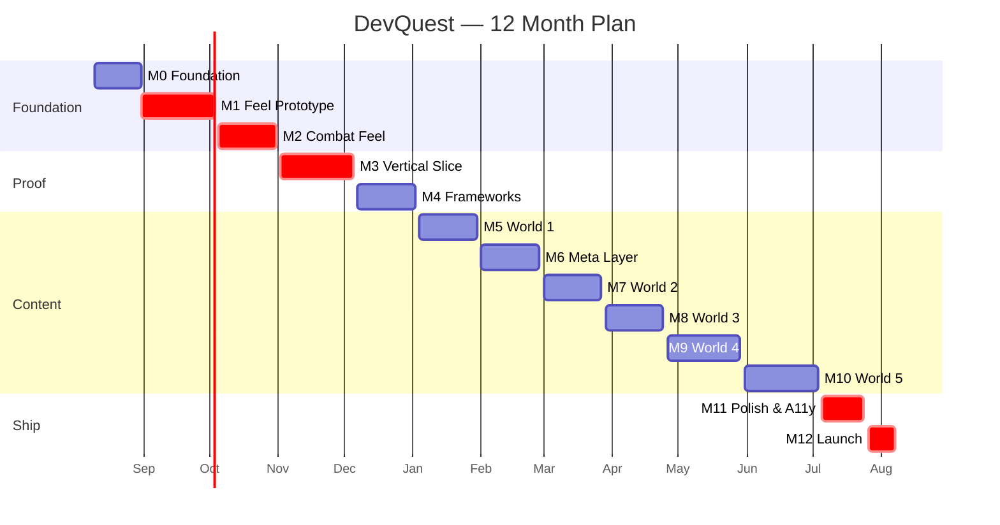
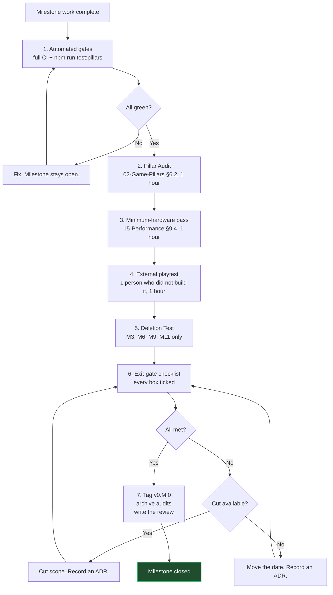

# 17 — Roadmap

**Project:** DevQuest (Working Title)
**Document Owner:** Producer
**Status:** 🔄 Living — reviewed monthly
**Version:** 1.0.0
**Last Updated:** 2026-08-07
**Planning Horizon:** 2026-08-10 → 2027-08-06 (52 weeks)

---

## 1. Purpose

This document is the twelve-month plan: what gets built, in what order, by when, and what has to be true for each milestone to close.

It is a **living document** — the only one in the set that is expected to change every month. What does not change is its structure: twelve milestones, each with a hard exit gate, each with an explicit cut decision available if the gate is at risk.

The plan is built around one uncomfortable truth from `01-Vision.md` §8.3: the most likely cause of failure is not a technical problem, it is scope absorption and tuning paralysis. Every mechanism in this document — the fixed M1 end date, the cut lines, the 20% polish reserve, the monthly review — exists to counter one of those two failure modes.

---

## 2. Goals

| #   | Goal                                            | Success Signal                                                      |
| --- | ----------------------------------------------- | ------------------------------------------------------------------- |
| G1  | Sequence work so risk is retired early          | The riskiest unknowns are resolved by month 4                       |
| G2  | Give every milestone a hard, testable exit gate | A milestone either closes or it does not; there is no "mostly done" |
| G3  | Make scope cuts a planned decision, not a panic | Cut lines have dates and owners                                     |
| G4  | Reserve time for polish, structurally           | 20% of every milestone, protected                                   |
| G5  | Make progress visible                           | Anyone can tell where the project is in 30 seconds                  |
| G6  | Plan for a solo/small-team sustainable pace     | No milestone assumes crunch                                         |

---

## 3. Design Principles

### P1 — Retire Risk Early

The build order (`01-Vision.md` §8.1) front-loads the things most likely to be wrong: movement feel, combat feel, and the art-harmonisation cost. If any of those is worse than expected, we want to know in month 3, not month 9.

### P2 — Vertical Slice Before Framework

Ship one complete level with one enemy and one boss before writing the enemy framework or the boss framework. Building a generic system before you have a working concrete case generalises the wrong things (`19-Decisions.md` ADR-004).

### P3 — Every Milestone Ships Something Playable

No milestone produces only code. Every one ends with a build a person can play, and it is played by someone who did not build it.

### P4 — The Gate Is the Plan

A milestone's exit gate is a list of falsifiable conditions. If they are not met, the milestone does not close — the scope is cut or the date moves, and the choice is recorded.

### P5 — Protect the Polish Reserve

20% of each milestone is reserved for polish on what already exists. It is the first thing pressure tries to eat, and it is the last thing to be given up.

### P6 — Sustainable Pace

The plan assumes roughly 30 productive hours a week. It does not assume evenings and weekends, and a plan that requires them is a plan that has already failed.

---

## 4. Overview

### 4.1 The Twelve Milestones

| #       | Milestone              | Weeks | Dates           | Theme                                               |
| ------- | ---------------------- | ----- | --------------- | --------------------------------------------------- |
| **M0**  | Foundation             | 3     | Aug 10 – Aug 28 | Repo, pipeline, tooling                             |
| **M1**  | Feel Prototype         | 5     | Aug 31 – Oct 2  | Movement. Grey boxes. **Constants lock**            |
| **M2**  | Combat Feel            | 4     | Oct 5 – Oct 30  | Hit stop, one enemy, one attack                     |
| **M3**  | Vertical Slice         | 5     | Nov 2 – Dec 4   | 1-1 complete and beautiful. Art harmonisation       |
| **M4**  | Frameworks             | 4     | Dec 7 – Jan 1   | Enemy, boss, level, data. Tooling                   |
| **M5**  | World 1                | 4     | Jan 4 – Jan 29  | 4 levels + Skeleton Warlord                         |
| **M6**  | Meta Layer             | 4     | Feb 1 – Feb 26  | UI, save, progression, Codex, `/resume`             |
| **M7**  | World 2                | 4     | Mar 1 – Mar 26  | 4 levels + Alpha Werewolf. **Cut Line A decision**  |
| **M8**  | World 3                | 4     | Mar 29 – Apr 23 | 4 levels + Oni Lord. Darkness                       |
| **M9**  | World 4                | 5     | Apr 26 – May 28 | 4 levels + Golem Sovereign. **Cut Line B decision** |
| **M10** | World 5                | 5     | May 31 – Jul 2  | 4 levels + Gorgon. Castle assets                    |
| **M11** | Polish & Accessibility | 3     | Jul 5 – Jul 23  | Assist, a11y, perf, bugs                            |
| **M12** | Launch                 | 2     | Jul 26 – Aug 6  | Final QA, deploy, launch                            |

**Total: 52 weeks.**

### 4.2 The Timeline



### 4.3 Effort Distribution

| Category                             | Weeks | Share |
| ------------------------------------ | ----- | ----- |
| Engineering — systems and frameworks | 16    | 31%   |
| Content — levels, enemies, bosses    | 18    | 35%   |
| Art — integration and harmonisation  | 6     | 12%   |
| UI, meta, and portfolio              | 5     | 10%   |
| Polish, accessibility, and QA        | 5     | 10%   |
| Tooling and pipeline                 | 2     | 4%    |

**Content is the largest single category**, which is correct for a game whose frameworks are deliberately small.

### 4.4 Cumulative Playable State

```mermaid
flowchart LR
    M1["M1<br/>A grey box<br/>that feels great"] --> M2["M2<br/>+ one enemy<br/>that feels great to hit"]
    M2 --> M3["M3<br/>+ one beautiful<br/>complete level"]
    M3 --> M4["M4<br/>+ tools to make<br/>more of it"]
    M4 --> M5["M5<br/>+ a whole world<br/>and a boss"]
    M5 --> M6["M6<br/>+ menus, saves,<br/>and the Codex"]
    M6 --> M7["M7<br/>+ world 2"]
    M7 --> M8["M8<br/>+ world 3<br/>SHIPPABLE PRODUCT"]
    M8 --> M9["M9<br/>+ world 4"]
    M9 --> M10["M10<br/>+ world 5<br/>content complete"]
    M10 --> M11["M11<br/>+ polish<br/>and accessibility"]
    M11 --> M12["M12<br/>SHIPPED"]

    style M8 fill:#1f4d2e,stroke:#2fbf6b,color:#fff
    style M12 fill:#1f4d2e,stroke:#2fbf6b,color:#fff
```



**M8 is the first genuinely shippable state.** Three worlds, all five portfolio sections reachable via Cut Line A fallbacks, full meta layer. Everything after M8 is making the product better rather than making it exist. This is deliberate — it means the last four months are optional in a way the first eight are not.

---

## 5. Technical Design — The Milestones

---

### M0 — Foundation · 3 weeks · Aug 10 – Aug 28

**Theme:** everything needed to start building, and nothing else.

| Week | Work                                                                                                                                                                   |
| ---- | ---------------------------------------------------------------------------------------------------------------------------------------------------------------------- |
| 1    | Repo, Vite + TypeScript + Phaser, `tsconfig`, ESLint flat config with all §7 rules, Prettier, Husky, `commitlint`                                                      |
| 2    | CI pipeline (lint, typecheck, boundaries, unit, build, size). Vitest and Playwright harnesses. Deploy pipeline to staging                                              |
| 3    | `GameConstants.ts`, `Depth.ts`, `Palette.ts`, `EventBus`, `StateMachine`, `ObjectPool`, `Registry`, `Result`, `Rng`, `Assert`. Boot/Preload scenes. Atlas build script |

**Deliverable:** a black screen with a loading bar that reaches 100% and prints "ready" — built by CI, deployed to staging, with every lint rule live.

**Exit gate:** _(closed 2026-08-07 — `docs/audits/milestone-M0.md`)_

- [x] `npm run dev` starts in under 2 s
- [x] CI green end to end in under 5 minutes
- [x] Every non-negotiable lint rule (§16 §4.2) fires when deliberately violated
- [x] `check-constants.ts` passes
- [x] `madge --circular` reports zero
- [x] A commit to `main` auto-deploys to staging (GitHub Pages workflow on `main`)
- [x] `ObjectPool` and `StateMachine` have unit tests at 100% coverage

**Risk:** low. This is known work.

---

### M1 — Feel Prototype · 5 weeks · Aug 31 – Oct 2 · **CRITICAL**

**Theme:** movement. No art. Grey rectangles. The most important milestone in the project.

**Work queue:** 23 sessions (`M1-S01`…`M1-S23`) in `plans/M01-feel-prototype/plan.md` — one session per sitting; stop at ▶ checkpoints.

| Week | Work                                                                             |
| ---- | -------------------------------------------------------------------------------- |
| 1    | `PlayerController`: run, accel/decel, gravity, jump. `InputSystem` with keyboard |
| 2    | Coyote time, jump buffer, variable jump height, asymmetric gravity, apex hang    |
| 3    | Dash, wall slide, wall jump. Gamepad. The player FSM in full                     |
| 4    | The four character configurations (values only, one grey box each). Tuning       |
| 5    | **Tuning only.** Playtests. Latency measurement. Constants lock                  |

**Deliverable:** a grey rectangle in a grey test level, playable with keyboard and gamepad, that feels as good as Celeste to move.

**Exit gate:**

- [ ] Input-to-velocity ≤ 1 frame, measured
- [ ] Input-to-visible ≤ 50 ms at p99, measured with a 240 fps capture
- [ ] Ledge-jump success ≥ 98% over 1,000 automated attempts
- [ ] Zero dropped inputs over 10,000 fuzzed inputs
- [ ] Zero landing recovery frames
- [ ] All four character movement configs implemented and distinguishable
- [ ] `PlayerController.ts` contains zero `characterId` branches
- [ ] **Three external playtesters report the movement "feels good" unprompted**
- [ ] **Constants in `00-README.md` §5.3 are LOCKED.** Changes require an ADR from here on
- [ ] Pillar 1 audit: all falsification tests pass

**Risk: HIGH.** This is where tuning paralysis lives. **Mitigation: the end date is fixed.** If week 5 arrives and the feel is 90% right, the constants lock at 90% and the remaining 10% becomes a backlog item with an ADR. Shipping a good-enough feel beats an indefinite search for a perfect one.

---

### M2 — Combat Feel · 4 weeks · Oct 5 – Oct 30 · **CRITICAL**

**Theme:** one enemy, one attack, nine layers of feedback.

| Week | Work                                                                                                                     |
| ---- | ------------------------------------------------------------------------------------------------------------------------ |
| 1    | `Hitbox`, `Hurtbox`, `Health`, `Poise`, `IFrames`. Hit queue and post-physics resolution                                 |
| 2    | The nine-layer stack: hit stop, flash, knockback, VFX, shake, stagger, damage numbers, particles, death                  |
| 3    | One concrete Skeleton (hardcoded, not data-driven — P2). One player combo. `VfxSystem`, `ParticleSystem`, `CameraSystem` |
| 4    | **Tuning only.** Playtests. Hit-feel iteration                                                                           |

**Deliverable:** a grey rectangle hitting a grey rectangle, and it feels like Dead Cells.

**Exit gate:**

- [ ] All nine layers fire on every connected hit, verified by an integration test
- [ ] `HitResolution` has zero optional fields
- [ ] Hit stop freezes participants only; particles and camera continue (tested)
- [ ] Hit stop is longest-wins, never additive (tested)
- [ ] Input is buffered through hit stop and applied on the first unfrozen frame
- [ ] A single attack cannot hit the same victim twice (tested over 5 frames)
- [ ] Camera trauma is quadratic, clamped, and pixel-rounded
- [ ] Poise break produces a visibly distinct result from a flinch
- [ ] **Three playtesters, audio muted, can always tell whether a hit connected**
- [ ] No playtester describes hit stop as a stutter or a frame drop
- [ ] Combat resolution measured under 1 ms with 8 simultaneous hits
- [ ] Pillar 2 audit: all falsification tests pass

**Risk: HIGH.** Second only to M1. Same mitigation: fixed end date.

---

### M3 — Vertical Slice · 5 weeks · Nov 2 – Dec 4 · **CRITICAL**

**Theme:** one complete, beautiful level. This is where art enters and where the art-cost assumption is tested.

| Week | Work                                                                                                                                       |
| ---- | ------------------------------------------------------------------------------------------------------------------------------------------ |
| 1    | **Art harmonisation begins.** Palette remap pipeline, de-AA, outline scripts. Knight + Skeleton + Green Zone tileset through all six gates |
| 2    | Harmonisation continues: Nature backgrounds, VFX packs (including the slash de-cartooning). Atlas build                                    |
| 3    | Tiled workflow, `LevelLoader`, `ObjectFactory`, `TileCollision`, `ParallaxBackground`. Level 1-1 greyboxed                                 |
| 4    | 1-1 art pass, moving platforms, checkpoints, camera zones. HUD v1                                                                          |
| 5    | **Polish reserve.** Squash/stretch, dust, landing feedback, all of the §5.3.2 feedback contract                                            |

**Deliverable:** level 1-1, playable start to finish, fully art-passed, with the complete feedback contract.

**Exit gate:**

- [ ] 1-1 is completable by all four heroes
- [ ] Every row of the Pillar 3 feedback contract (`02-Game-Pillars.md` §5.3.2) is implemented
- [ ] All integrated assets pass `assets:verify` (density, palette, animations, AA, uniformity)
- [ ] Every integrated pack has an archived licence record
- [ ] The greyscale contrast check passes on a 1-1 screenshot
- [ ] Level loads in under 45 ms
- [ ] Sustained 60 fps on minimum hardware
- [ ] **The Deletion Test passes** (trivially — no portfolio code yet, but the harness is built)
- [ ] Pillar 3 audit: all falsification tests pass
- [ ] **Art harmonisation cost measured against the 79-hour estimate.** Variance recorded

**Risk: MEDIUM-HIGH.** The unknown is art harmonisation. `04-Art-Direction.md` §8.3 estimates 79 hours across all packs; M3 harmonises roughly a quarter of them. **If the measured cost exceeds the estimate by more than 40%, that is a scope-cut trigger** and is escalated at the M3 review.

---

### M4 — Frameworks · 4 weeks · Dec 7 – Jan 1

**Theme:** generalise what M2 and M3 proved. Build the tools that make M5–M10 fast.

| Week | Work                                                                                                                    |
| ---- | ----------------------------------------------------------------------------------------------------------------------- |
| 1    | `ContentDatabase`, JSON schemas, validation. Refactor the hardcoded Skeleton into `EnemyDefinition` + behaviours        |
| 2    | Behaviour registry: `patrol`, `chase`, `melee`, `ranged`, `leap`. `SpawnSystem`, `CullingSystem`. Tier generation       |
| 3    | `Boss` class, `BossPhaseMachine`, the first four attack modules. Arena lifecycle                                        |
| 4    | **Tooling week.** `level:test` hot-load, debug overlay, `level:validate`, `check-hero-parity`, encounter-budget checker |

**Deliverable:** a Skeleton defined entirely in JSON, three variants generated, and a level designer who can iterate without an engineer.

**Exit gate:**

- [ ] Zero enemy subclasses; `grep "extends Enemy"` returns nothing
- [ ] Adding an enemy variant requires zero `.ts` changes (demonstrated in a PR)
- [ ] All five M4 behaviours implemented with unit tests, no Phaser scene required
- [ ] Behaviour state is per-instance (tested with two enemies)
- [ ] `ContentDatabase.validateAll()` runs at boot and reports JSON-pointer paths
- [ ] `npm run level:test -- w1-1` boots directly into the level with hero hot-swap
- [ ] The debug overlay shows every §15 budget line live
- [ ] `check-hero-parity.ts` runs and passes on 1-1
- [ ] Zero heap growth over a 60-second combat capture

**Risk: MEDIUM.** The risk is over-generalisation. **Mitigation:** the two-implementations rule (`16-Coding-Standards.md` §9.4) applies strictly; no abstraction ships without two concrete users.

---

### M5 — World 1 · 4 weeks · Jan 4 – Jan 29

**Theme:** the first full world. Establishes the content-production rate that the rest of the plan depends on.

| Week | Work                                                                                                   |
| ---- | ------------------------------------------------------------------------------------------------------ |
| 1    | Levels 1-2 and 1-3 greyboxed. Skeleton Archer and Skeleton Brute variants. Collectible and prop assets |
| 2    | 1-2 and 1-3 art-passed. One-way platforms and bounce caps                                              |
| 3    | Skeleton Warlord: two phases, arena 1-4, intro and death sequences, boss health bar                    |
| 4    | **Polish reserve.** Encounter tuning, secret placement, pacing                                         |

**Deliverable:** World 1 complete — four levels, one boss, playable end to end.

**Exit gate:**

- [ ] All four W1 levels pass `level:validate` (all six checks)
- [ ] All four levels completable by all four heroes
- [ ] Every level has a main path, optional path, secret, mini challenge, and 3 checkpoints
- [ ] The five-beat teaching protocol is verifiable for moving platforms
- [ ] Skeleton Warlord: 2 phases, skippable intro, 4-beat death, unblockable per phase
- [ ] Boss retry from death to arena under 12 s
- [ ] W1 novice completion rate ≥ 90% in playtest (5 subjects)
- [ ] Naive playtester: first jump ≤ 10 s, first kill ≤ 90 s
- [ ] 60 fps sustained through the boss fight on minimum hardware
- [ ] **Content-production rate measured.** Weeks per world recorded and the plan re-forecast

**Risk: MEDIUM.** M5's real output is the _measurement_. If a world takes 6 weeks rather than 4, worlds 2–5 need 24 weeks rather than 16, and the plan is 8 weeks over — which is exactly what Cut Line A exists for. This is the earliest reliable signal.

---

### M6 — Meta Layer · 4 weeks · Feb 1 – Feb 26

**Theme:** everything around the game. Menus, saves, progression, and the Codex.

| Week | Work                                                                                               |
| ---- | -------------------------------------------------------------------------------------------------- |
| 1    | **GUI kit and icon authoring** (`05-Asset-Pipeline.md` §9.2, §9.3 — ~34 hours). Bitmap fonts       |
| 2    | `UiBuilder`, `FocusManager`, the widget library. Title, Character Select, Settings                 |
| 3    | `SaveSystem` with migrations, `ProgressionSystem`, charms, World Select with the Vendor panel      |
| 4    | `PortfolioSystem`, `CodexScene`, `UnlockScene`, `/resume` build script. Portfolio content authored |

**Deliverable:** a complete game shell. Start, choose a hero, play World 1, earn About Me, read it, quit, resume.

**Exit gate:**

- [ ] Every screen in `13-UI-UX.md` §4.1 exists and is fully navigable by keyboard and gamepad
- [ ] Every menu is built from a JSON `MenuSpec`
- [ ] Full input remapping with conflict detection
- [ ] `this.add.text` appears nowhere in `src/`
- [ ] Save round-trips through a browser restart
- [ ] A corrupt-save injection test produces the recovery dialog, never data loss
- [ ] A migration fixture exists for every schema version
- [ ] All 10 charms implemented; exactly 3 slots
- [ ] **The Deletion Test passes with real portfolio code**, in under 2 hours
- [ ] `/resume` deployed, ≤ 40 KB, zero JS, passes automated WCAG 2.2 AA
- [ ] `/resume` linked from the title screen and the preloader
- [ ] `check-cutlines.ts` passes at all three cut lines
- [ ] Time to interactive ≤ 8 s on a throttled connection

**Risk: MEDIUM.** The GUI kit is the unknown — `05-Asset-Pipeline.md` §9.2 flags that licensed GUI packs are unlikely to match the modern-pixel direction and budgets 20 hours of custom work. If that estimate is wrong, week 1 overruns and weeks 2–4 compress.

---

### M7 — World 2 · 4 weeks · Mar 1 – Mar 26 · **CUT LINE A DECISION**

**Theme:** wind, the Werewolf, and the first scope checkpoint.

| Week | Work                                                                                                      |
| ---- | --------------------------------------------------------------------------------------------------------- |
| 1    | Autumn Forest + Fairy Tale harmonisation. Werewolf pack. `WindZoneMechanic`, crumbling branches, updrafts |
| 2    | Levels 2-1 and 2-2. Wall-slide introduction                                                               |
| 3    | Level 2-3. Alpha Werewolf: three phases, wall-pounce, arena wind                                          |
| 4    | **Polish reserve.** Tuning, secrets, the Projects unlock                                                  |

**Deliverable:** World 2 complete. Two worlds, two bosses, two portfolio sections.

**Exit gate:**

- [ ] All four W2 levels pass `level:validate`
- [ ] Wind zones implement all five teaching beats
- [ ] Wall-slide available to all four heroes at differing speeds
- [ ] Alpha Werewolf: 3 phases, each changing the question not the volume
- [ ] Frenzy Rush wall-slam produces the 1100 ms punish window
- [ ] Projects unlocks and is readable
- [ ] 60 fps through the boss fight

**🔴 CUT LINE A DECISION — Mar 26**

Assessed at the M7 review:

| Signal                                 | Threshold           | Action if Breached          |
| -------------------------------------- | ------------------- | --------------------------- |
| Weeks per world (measured over M5, M7) | > 5                 | Invoke Cut Line A           |
| Art harmonisation variance             | > +40% vs. estimate | Invoke Cut Line A           |
| Open P1 bugs                           | > 8                 | Invoke Cut Line A           |
| Castle tileset still unresolved        | Yes at Mar 26       | Escalate; likely Cut Line B |

**Cut Line A:** drop Worlds 4 and 5. The Oni Lord (M8) becomes the final boss and unlocks Experience, Skills, and Contact together. The product is 12 levels, three worlds, ~3 hours, and it is complete. The freed 10 weeks go to polish, accessibility, and a Time Trial mode.

**The decision is recorded as an ADR either way** — including a decision _not_ to cut, with the reasoning.

---

### M8 — World 3 · 4 weeks · Mar 29 – Apr 23

**Theme:** darkness, information management, and the first shippable product.

| Week | Work                                                                                                  |
| ---- | ----------------------------------------------------------------------------------------------------- |
| 1    | Graveyard harmonisation. Yokai + Witch packs. `LanternMechanic`, light mask, fog banks, soul-braziers |
| 2    | Levels 3-1 and 3-2. `teleport`, `summon`, `flee`, `hover` behaviours                                  |
| 3    | Level 3-3. Oni Lord: three phases, shadow copies, brazier extinguishing                               |
| 4    | **Polish reserve.** The Experience unlock. Cut Line A verification if invoked                         |

**Deliverable:** World 3 complete. **If Cut Line A was invoked, this is the shipping product.**

**Exit gate:**

- [ ] All four W3 levels pass `level:validate`
- [ ] `check-dark-hazards.ts` passes — no main-path pit outside the lantern radius
- [ ] Every enemy attack windup is self-illuminated regardless of ambient darkness
- [ ] The Oni Lord's real self is always distinguishable from its shadow copies
- [ ] The light mask costs ≤ 0.5 ms on minimum hardware
- [ ] Room 3-3-5 (the documented three-mechanic exception) has a checkpoint 160 px before it
- [ ] Experience unlocks and is readable
- [ ] **If Cut Line A: all five portfolio sections reachable, `check-cutlines.ts` green, full a11y pass**

**Risk: MEDIUM.** The light mask is the only novel rendering feature in the project and the most likely performance surprise. **Mitigation:** the degradation ladder (`15-Performance.md` §12) already includes replacing it with a static tint at tier 4.

---

### M9 — World 4 · 5 weeks · Apr 26 – May 28 · **CUT LINE B DECISION**

**Theme:** puzzles, the heaviest content in the game. Five weeks, not four, because beam puzzles are slow to author.

| Week | Work                                                                                            |
| ---- | ----------------------------------------------------------------------------------------------- |
| 1    | Crystal Cave harmonisation (incl. authoring emissive crystal frames). Orc + Golem packs         |
| 2    | `LightBeamMechanic`, low-gravity fields, conveyors. `charge`, `shield`, `groundSlam` behaviours |
| 3    | Levels 4-1 and 4-2                                                                              |
| 4    | Level 4-3 (the beam-puzzle-heavy level). Golem Sovereign: three phases, the core mechanic       |
| 5    | **Polish reserve.** Puzzle solvability testing, the Skills unlock                               |

**Deliverable:** World 4 complete.

**Exit gate:**

- [ ] All four W4 levels pass `level:validate`
- [ ] Every beam puzzle is solvable by all four heroes (verified individually)
- [ ] `mechanicState` restores on checkpoint reload — a solved puzzle stays solved after death
- [ ] Golem Sovereign's three cores are reachable by all four heroes
- [ ] The Sovereign is defeatable without breaking cores (slower), and ~2.4× faster with them
- [ ] The Orc corridor in 4-2 is widened to 200 px with a raised ledge (`08-Enemy-System.md` §11.3)
- [ ] Skills unlocks and is readable
- [ ] `enemies-w4` atlas fits, or the Sovereign is split to `boss-w4`

**🔴 CUT LINE B DECISION — May 28**

| Signal                             | Threshold                 | Action            |
| ---------------------------------- | ------------------------- | ----------------- |
| Castle tileset resolved            | No                        | Invoke Cut Line B |
| Weeks remaining vs. work remaining | < 8 weeks for M10+M11+M12 | Invoke Cut Line B |
| Open P1 bugs                       | > 6                       | Invoke Cut Line B |
| Cut Line A already invoked         | —                         | N/A               |

**Cut Line B:** drop World 5. The Golem Sovereign becomes the final boss and unlocks Skills and Contact together. The product is 16 levels, four worlds, ~3.5 hours. The freed 5 weeks go to polish.

---

### M10 — World 5 · 5 weeks · May 31 – Jul 2

**Theme:** synthesis and the final boss. Five weeks because World 5 reuses every mechanic and the Gorgon has four phases.

| Week | Work                                                                                                                                     |
| ---- | ---------------------------------------------------------------------------------------------------------------------------------------- |
| 1    | **Castle tileset resolution** (licensed or the graveyard-recolour fallback, `05-Asset-Pipeline.md` §9.1). Gorgon pack + phase-2 recolour |
| 2    | `TimedGateMechanic`, wall turrets, petrify zones, crushers. Level 5-1                                                                    |
| 3    | Levels 5-2 and 5-3 (the synthesis gauntlets)                                                                                             |
| 4    | Gorgon: four phases, escalating gaze, collapsing arena                                                                                   |
| 5    | **Polish reserve.** The Contact unlock, the ending, the Victory scene, credits                                                           |

**Deliverable:** content complete. 20 levels, 5 bosses, 5 portfolio sections, an ending.

**Exit gate:**

- [ ] All four W5 levels pass `level:validate`
- [ ] Every World 5 room combines at least two mechanics; none uses a prior mechanic alone
- [ ] The Gorgon's four phases each change the question
- [ ] The petrify cone is drawn on the ground for its full charge duration
- [ ] The two arena pits (the documented §5.5 exception) are recorded as deliberate
- [ ] Contact unlocks; the ending plays; the Victory scene shows accurate stats
- [ ] **Full playthrough completable by all four heroes at Assist-off**
- [ ] Gorgon phase 4 measured ≤ 16.67 ms on minimum hardware
- [ ] Pillar 5 audit: mechanic sets disjoint across worlds 1–4, synthesis verified in 5

**Risk: MEDIUM-HIGH.** The castle tileset is the single largest unresolved asset dependency and has been flagged since M0. **Mitigation:** the graveyard-recolour fallback is costed at 16 hours and can be executed in week 1 without further evaluation.

---

### M11 — Polish & Accessibility · 3 weeks · Jul 5 – Jul 23 · **CRITICAL**

**Theme:** make it finishable by anyone, and make it fast everywhere.

| Week | Work                                                                                       |
| ---- | ------------------------------------------------------------------------------------------ |
| 1    | Assist Options in full. The boss skip valve. Auto-retry. Accessibility settings            |
| 2    | Performance: minimum-hardware verification per world, the degradation ladder, the watchdog |
| 3    | Bug burn-down. P0/P1 to zero. Final playtests                                              |

**Deliverable:** a game a non-gamer can finish.

**Exit gate:**

- [ ] Every Assist Option in `13-UI-UX.md` §11.1 implemented and reachable from Pause in one press
- [ ] Assist uses neutral language everywhere; no "easy mode" framing
- [ ] Assist carries no penalty of any kind
- [ ] The 3-death boss skip valve works and fires the unlock normally
- [ ] Reduced Motion disables shake, flashes, and vignette while preserving hit stop and hit flash
- [ ] Enemy and hazard outline options work
- [ ] **A non-gamer playtester reaches the credits with Assist enabled**
- [ ] p99 frame time ≤ 16.67 ms on minimum hardware, every world
- [ ] Minimum-hardware verification including the 20-background-tabs scenario
- [ ] The degradation ladder implemented; each tier individually testable
- [ ] **Zero open P0 and P1 bugs**
- [ ] All five Pillar audits pass
- [ ] The Deletion Test passes in under 2 hours

**Risk: MEDIUM.** Three weeks for polish is tight. **Mitigation:** the 20% reserve in every prior milestone means polish has been happening continuously; M11 is the final pass, not the only one.

---

### M12 — Launch · 2 weeks · Jul 26 – Aug 6

**Theme:** ship it.

| Week | Work                                                                                                                               |
| ---- | ---------------------------------------------------------------------------------------------------------------------------------- |
| 1    | Final QA: full playthrough × 4 heroes × 3 browsers. Save-migration verification. Licence audit. Legal review of the asset manifest |
| 2    | Production deploy, `/resume` deploy, launch, monitoring, hotfix readiness                                                          |

**Deliverable:** DevQuest, live.

**Exit gate — the Definition of Done from `01-Vision.md` §7.5:**

- [ ] Cold cache → first boss → About Me unlocked in under 12 minutes
- [ ] Sustained 60 fps on minimum hardware, no frame over 33 ms
- [ ] All four heroes complete all shipped worlds
- [ ] All five portfolio sections reachable and readable
- [ ] Save survives a browser restart, a version upgrade, and a corruption injection
- [ ] Full keyboard and gamepad parity everywhere including the Codex
- [ ] Assist Options allow a non-gamer to reach the credits
- [ ] Zero open P0 and P1 bugs
- [ ] Every asset in the build has a verified, archived licence
- [ ] `/resume` live and linked
- [ ] All 21 documents updated to match the shipped product
- [ ] `v1.0.0` tagged

---

## 6. Architecture — Milestone Gates

### 6.1 The Gate Procedure

Every milestone closes with the same four-hour procedure. It is not optional and it is not shortened under pressure.



### 6.2 The Milestone Review

Written at each close into `docs/audits/milestone-M<N>.md`:

```markdown
# M5 Review — World 1

**Closed:** 2027-01-29 (planned 2027-01-29) — on time
**Tag:** v0.5.0

## Exit gate

All 10 conditions met. Evidence: [links]

## Pillar audit

P1 ✅ P2 ✅ P3 ✅ P4 ✅ P5 ✅
Features serving no pillar: (none)
Features rejected by pillar citation: shop system, loot drops

## Measurements

- Weeks per world: 4.0 (planned 4.0)
- Art harmonisation: 22h actual vs 24h estimated (−8%)
- p99 frame time, min hardware: 14.2 ms
- Naive playtest: first jump 7s, first kill 71s, W1 completion 5/5

## Re-forecast

Worlds 2–5 at 4 weeks each → 16 weeks. Plan holds. No cut required.

## What went wrong

The Skeleton Warlord's phase-2 add spawning was re-implemented three
times before landing on the `resummonWhenBelow` model. Should have
prototyped on paper first. ~1.5 days lost.

## What went right

`level:test` hot-load saved an estimated 6 hours over the milestone.
Building tooling in M4 week 4 paid for itself in M5 week 1.

## Carried forward

- #218 Werewolf leap arc feels floaty at low gravity (P3)
- #224 Coin batching threshold may be too aggressive (P3)
```

**"What went wrong" is mandatory and is not a blame exercise.** A milestone review with an empty failure section is a review that was not written honestly.

### 6.3 The Monthly Re-Forecast

At each milestone close, the remaining plan is re-forecast from measured rates:

```
weeksRemaining     = sum(remaining milestone durations)
measuredWorldRate  = mean(weeks per world so far)
projectedWorldWork = worldsRemaining × measuredWorldRate
projectedTotal     = projectedWorldWork + nonWorldMilestonesRemaining
slack              = weeksToLaunchDate − projectedTotal
```

| Slack         | Action                                                    |
| ------------- | --------------------------------------------------------- |
| > 2 weeks     | Healthy. Continue                                         |
| 0 to 2 weeks  | Warning. Protect the polish reserve; add nothing          |
| −2 to 0 weeks | Cut a level from the next world, or drop an optional path |
| < −2 weeks    | Invoke the next available cut line                        |

---

## 7. Risk Register

Tracked continuously; reviewed at every milestone close.

| #   | Risk                                     | P       | Impact   | Owner    | Mitigation                                               | Trigger                             |
| --- | ---------------------------------------- | ------- | -------- | -------- | -------------------------------------------------------- | ----------------------------------- |
| R1  | **Tuning paralysis** in M1/M2            | High    | Fatal    | Director | Fixed end dates; constants lock at M1 exit               | Week 5 of M1 without a lock         |
| R2  | **Art harmonisation exceeds estimate**   | Med     | Severe   | Art Dir  | Measured at M3; cut line if > +40%                       | M3 review                           |
| R3  | **Content rate slower than 4 wks/world** | Med     | Severe   | Producer | Measured at M5; cut lines at M7/M9                       | M5 review                           |
| R4  | **Castle tileset never resolved**        | Med     | Moderate | Art Dir  | Graveyard-recolour fallback, 16 h, costed                | M9 review                           |
| R5  | **Framework over-engineering** in M4     | Med     | Severe   | Tech Dir | Two-implementations rule, enforced in review             | Any interface with one impl         |
| R6  | **Portfolio creep**                      | Med     | Severe   | Director | Deletion Test at M3, M6, M9, M11                         | Test exceeds 2 hours                |
| R7  | **Light mask too slow** (W3)             | Low-Med | Moderate | Tech Dir | Degradation ladder tier 4 already specified              | M8 perf pass                        |
| R8  | **GUI kit needs full custom authoring**  | Med     | Moderate | Art Dir  | 20 h budgeted in M6 week 1                               | M6 week 1 overrun                   |
| R9  | **Browser regression** breaks WebGL      | Low     | Moderate | Tech Dir | Cross-browser CI on every merge                          | CI failure                          |
| R10 | **Asset licence problem**                | Low     | Fatal    | Art Dir  | Licence text archived at download, not linked            | Legal review at M12                 |
| R11 | **Audio never procured**                 | Med     | Moderate | Producer | `NullAudioBackend` ships; game is complete without audio | M9                                  |
| R12 | **Solo-developer availability**          | Med     | Severe   | Producer | Sustainable pace assumption; cut lines absorb 10 weeks   | Any two-week gap                    |
| R13 | **Save-schema change destroys data**     | Low     | Fatal    | Tech Dir | Migration fixtures per version, CI-enforced              | Any schema change without a fixture |
| R14 | **`enemies-w4` atlas overflows**         | Med     | Minor    | Tech Dir | Split the Sovereign to `boss-w4` — a build-config change | M9                                  |

### 7.1 The Three Risks That Actually Matter

**R1, R3, and R6.** Everything else has a known, costed mitigation. These three are behavioural, and behavioural risks are the ones that kill projects.

| Risk                | The Behaviour                                              | The Structural Counter                                                                     |
| ------------------- | ---------------------------------------------------------- | ------------------------------------------------------------------------------------------ |
| R1 Tuning paralysis | "Just one more tuning pass"                                | The M1 end date is a date, not a condition. Constants lock and further changes need an ADR |
| R3 Content rate     | "World 3 will be faster now that we know what we're doing" | Measured rate, not hoped rate, drives the forecast                                         |
| R6 Portfolio creep  | "It would be so cool if the Codex also…"                   | The Deletion Test is timed. Over 2 hours means roots have grown                            |

---

## 8. Examples — Cut Decisions

### 8.1 The Cut Ladder

Cuts are made in this order. Each is cheaper than the one below it.

| #   | Cut                                    | Saves         | Cost                                       |
| --- | -------------------------------------- | ------------- | ------------------------------------------ |
| 1   | Optional paths in the remaining worlds | ~0.5 wk/world | Less exploration content                   |
| 2   | Secrets in the remaining worlds        | ~0.3 wk/world | Less completionist depth                   |
| 3   | One level from a world (3 stages → 2)  | ~1 wk/world   | Shorter worlds                             |
| 4   | Enemy elite tiers                      | ~0.5 wk total | Less variety                               |
| 5   | **Cut Line B** — drop World 5          | 5 wks         | One world, one boss                        |
| 6   | **Cut Line A** — drop Worlds 4 and 5   | 10 wks        | Two worlds, two bosses                     |
| 7   | Drop a playable hero                   | ~1 wk         | Significant identity loss. **Last resort** |

**Never cut:** portfolio reachability, Assist Options, accessibility, the `/resume` page, hit feel, or the M1/M2 constants. These are the product.

### 8.2 What Cut Lines Do Not Change

| Preserved                             | Mechanism                               |
| ------------------------------------- | --------------------------------------- |
| All five portfolio sections reachable | `fallbackUnlocks` + `check-cutlines.ts` |
| All four heroes                       | Cuts remove worlds, never heroes        |
| The full meta layer                   | M6 is before both cut lines             |
| Accessibility                         | M11 is after both                       |
| Feel quality                          | M1/M2 are before everything             |

**This is why the cut lines are placed where they are.** Everything that defines the product's quality ships before the first cut decision.

---

## 9. Implementation Notes — Cadence

| Ritual              | When            | Duration | Output                                          |
| ------------------- | --------------- | -------- | ----------------------------------------------- |
| Daily check-in      | Each morning    | 5 min    | Today's one priority, written down              |
| Weekly review       | Friday          | 30 min   | Progress vs. milestone plan; slack recalculated |
| Milestone gate      | Milestone end   | 4 h      | §6.1                                            |
| Milestone review    | Same day        | 1 h      | `docs/audits/milestone-M<N>.md`                 |
| Monthly re-forecast | Milestone close | 30 min   | §6.3                                            |
| Risk review         | Milestone close | 30 min   | §7 updated                                      |
| Playtest            | Every milestone | 1 h      | Fresh eyes, always                              |
| Doc sync            | Every milestone | 1 h      | Docs match reality                              |

**The daily one-priority note is the highest-value ritual for a solo developer.** Writing down the single most important thing before opening the editor prevents the most common solo failure: three weeks of interesting work on something that did not matter.

---

## 10. Data Structures — Progress Tracking

### 10.1 The Status Line

Maintained at the top of this document, updated at every milestone close:

```
━━━━━━━━━━━━━━━━━━━━━━━━━━━━━━━━━━━━━━━━━━━━━━━━━━━━━━━━━━━━
 CURRENT: M1 Feel Prototype · in progress · next M1-S03 / M1-T3 · S01–S02 done
 SHIPPED: Spike 00 · M0 Foundation (2026-08-07) · tag v0.0.1
 NEXT GATE: M1 · 2026-10-02
 SLACK: +0 weeks (baseline)
 CUT LINES: A pending (Mar 26) · B pending (May 28)
 OPEN P0/P1: 0
━━━━━━━━━━━━━━━━━━━━━━━━━━━━━━━━━━━━━━━━━━━━━━━━━━━━━━━━━━━━
```

### 10.2 Issue Labels

| Label                 | Meaning                                   |
| --------------------- | ----------------------------------------- |
| `milestone:M5`        | Scheduled milestone                       |
| `pillar:1`–`pillar:5` | Which pillar it serves or threatens       |
| `p0`–`p4`             | Severity (`16-Coding-Standards.md` §11.7) |
| `cut-candidate`       | Droppable under pressure                  |
| `blocked`             | With a named blocker                      |
| `polish`              | Counts against the 20% reserve            |
| `docs-drift`          | A doc no longer matches the code          |

**Pillar labels enable burn-down per pillar**, which reveals which pillar is under-invested. A project with 40 open `pillar:2` issues and 2 open `pillar:4` issues is telling you something.

---

## 11. Future Expansion — Post-Launch

Not part of the twelve months. Recorded so it is not planned for prematurely.

| Phase               | When                | Content                                         |
| ------------------- | ------------------- | ----------------------------------------------- |
| **Hotfix window**   | Launch + 2 weeks    | P0/P1 only. No features                         |
| **Feedback pass**   | Launch + 1 month    | Tuning from real player behaviour               |
| **Boss Rush**       | Launch + 2 months   | Reuses all existing content. ~2 weeks           |
| **Time Trial**      | Launch + 3 months   | ~1 month                                        |
| **Steam port**      | Launch + 3–6 months | ~4 weeks (`03-Technical-Architecture.md` §14.3) |
| **Everything else** | —                   | `20-Future-Ideas.md`                            |

**Nothing from this table enters the twelve-month plan under any circumstance.** A post-launch feature pulled forward is a cut line invoked in disguise.

---

## 12. Acceptance Criteria

- [ ] Every milestone has a date, a duration, a deliverable, and an exit gate.
- [ ] Every exit-gate condition is falsifiable — a person can determine pass or fail without judgement.
- [ ] Every milestone reserves 20% for polish, and it is visible in the week breakdown.
- [ ] Cut Line A and Cut Line B have dates, named signals, and thresholds.
- [ ] Every risk in §7 has an owner, a mitigation, and a trigger condition.
- [ ] The milestone gate procedure (§6.1) is executed at every close, without shortening.
- [ ] A milestone review is written and archived at every close, including "what went wrong."
- [ ] The re-forecast is run at every close using measured rates.
- [ ] The status line (§10.1) is current.
- [ ] No post-launch item (§11) has entered the twelve-month plan.
- [ ] The Deletion Test is scheduled at M3, M6, M9, and M11.
- [ ] Pillar audits are scheduled at every milestone.

---

## 13. Out of Scope

| Excluded                      | Reason                                                           |
| ----------------------------- | ---------------------------------------------------------------- |
| **Detailed task breakdowns**  | Live in the issue tracker. This document plans at the week level |
| **Individual assignment**     | Team-size dependent                                              |
| **Budget and cost**           | Not a documentation concern                                      |
| **Marketing timeline**        | Producer-owned outside `docs/`                                   |
| **Post-launch content plans** | §11 and `20-Future-Ideas.md`                                     |
| **The Steam port schedule**   | Post-launch                                                      |
| **Audio production schedule** | Blocked on `ADR-020` (vendor selection)                          |
| **Localisation**              | Post-launch                                                      |
| **Crunch as a contingency**   | P6. Cut lines exist so crunch does not have to                   |

---

## 14. Cross References

| Topic                                                  | Document                                       |
| ------------------------------------------------------ | ---------------------------------------------- |
| Content scope this plan delivers                       | `00-README.md` §5.6                            |
| The build order that determines milestone sequence     | `01-Vision.md` §8.1                            |
| Cut-line structure and portfolio reachability          | `01-Vision.md` §7.4, §11                       |
| The risk register this section expands                 | `01-Vision.md` §8.3                            |
| Definition of Done (the M12 gate)                      | `01-Vision.md` §7.5                            |
| The Pillar Audit run at every gate                     | `02-Game-Pillars.md` §6.2                      |
| Feel constants locked at M1                            | `00-README.md` §5.3, `02-Game-Pillars.md` §5.1 |
| Nine-layer combat stack delivered in M2                | `02-Game-Pillars.md` §5.2, `07-Combat.md` §6   |
| Feedback contract delivered in M3                      | `02-Game-Pillars.md` §5.3.2                    |
| Frameworks built in M4                                 | `03-Technical-Architecture.md` §10             |
| Art harmonisation estimates measured in M3             | `04-Art-Direction.md` §8.3                     |
| Missing asset categories and their blocking milestones | `05-Asset-Pipeline.md` §9.7                    |
| Castle tileset fallback plan (M10)                     | `05-Asset-Pipeline.md` §9.1                    |
| GUI kit authoring (M6)                                 | `05-Asset-Pipeline.md` §9.2                    |
| Per-world level specifications                         | `10-Level-Design.md` §10                       |
| Per-boss specifications                                | `09-Boss-System.md` §7                         |
| Save migrations verified at M6 and M12                 | `11-Progression.md` §8.6                       |
| The Deletion Test procedure                            | `12-Portfolio-System.md` §5.1                  |
| Assist Options delivered in M11                        | `13-UI-UX.md` §11                              |
| Minimum-hardware verification procedure                | `15-Performance.md` §9.4                       |
| Bug severity definitions                               | `16-Coding-Standards.md` §11.7                 |
| Cut decisions recorded as ADRs                         | `19-Decisions.md`                              |
| Post-launch backlog                                    | `20-Future-Ideas.md`                           |
