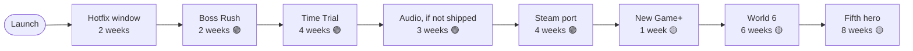

# 20 — Future Ideas / Icebox

**Project:** DevQuest (Working Title)
**Document Owner:** Game Director
**Status:** 🔄 Living — append freely
**Version:** 1.0.0
**Last Updated:** 2026-08-07

---

## 1. Purpose

This document is the **only legal destination for a new idea during the twelve-month plan.**

Its purpose is not to plan post-launch work. Its purpose is to be a place ideas can go that is not the roadmap. `01-Vision.md` §8.3 names scope absorption as one of the two most likely causes of project failure; this document is the structural counter to it. An idea written down and parked is an idea that has stopped competing for this month's time.

It serves three groups:

1. **The developer mid-milestone**, who has a good idea at the wrong moment and needs to put it somewhere that is not the current sprint.
2. **The developer post-launch**, who needs a ranked backlog rather than a blank page.
3. **Anyone re-proposing a rejected idea**, who deserves the reasoning rather than a shrug.

Section §8 — Declined — is the most valuable part of the document, because it is the part that saves the most time.

---

## 2. Goals

| #   | Goal                                                  | Success Signal                                 |
| --- | ----------------------------------------------------- | ---------------------------------------------- |
| G1  | Give every mid-milestone idea a home outside the plan | No idea enters a milestone after it starts     |
| G2  | Rank post-launch work by value, not by enthusiasm     | The first post-launch month is obvious         |
| G3  | Record declined ideas with reasoning                  | A rejected idea is closed by citation          |
| G4  | Estimate honestly                                     | Nothing here says "quick win" without a number |
| G5  | Keep the roadmap clean                                | `17-Roadmap.md` contains no speculative work   |

---

## 3. Design Principles

### P1 — Parking Is Not Rejection

An idea here is neither approved nor refused. It is _later_. Most good ideas arrive at the wrong time, and the wrong time is not a judgement on the idea.

### P2 — Estimate Before Ranking

An unestimated idea cannot be compared to another. Every entry carries a rough effort figure, and "rough" means a range, not a guess dressed as precision.

### P3 — Score Against the Pillars

An idea that serves no pillar (`02-Game-Pillars.md`) is unlikely to be built regardless of how appealing it is. Pillar service is recorded on every entry.

### P4 — Declined Is a Permanent Record

An idea that is genuinely wrong for the project gets a Declined entry with reasoning. It is not deleted, because deleting it means someone proposes it again in month nine.

### P5 — No Entry Is a Commitment

Nothing here is scheduled. The moment something is scheduled it moves to `17-Roadmap.md` and leaves this document.

---

## 4. Overview

### 4.1 Status Legend

| Status             | Meaning                                                 |
| ------------------ | ------------------------------------------------------- |
| 🟢 **Likely**      | Strong value, low risk. Probable first post-launch work |
| 🟡 **Possible**    | Real value, real cost. Needs a decision                 |
| 🔵 **Investigate** | Value unclear. Needs a spike before it can be estimated |
| ⚪ **Parked**      | Interesting, no current case                            |
| 🔴 **Declined**    | Wrong for this project. Reasoning recorded              |

### 4.2 The Post-Launch Ranking

If nothing changes, this is the order:



**Rationale for the order:** Boss Rush and Time Trial reuse existing content entirely and deliver the most replay value per week. Audio, if ADR-020 is declined or procurement slips, is the largest single quality gap. The Steam port validates the "real game" claim. Only then does new content make sense.

### 4.3 Summary Table

| #                                         | Idea                         | Status | Effort    | Pillars |
| ----------------------------------------- | ---------------------------- | ------ | --------- | ------- |
| [F01](#f01--boss-rush-mode)               | Boss Rush mode               | 🟢     | 2 wk      | 2       |
| [F02](#f02--time-trial-mode)              | Time Trial mode              | 🟢     | 4 wk      | 1, 2    |
| [F03](#f03--audio-if-not-shipped)         | Audio (if not shipped)       | 🟢     | 3 wk      | 2, 3, 4 |
| [F04](#f04--steam-port)                   | Steam port                   | 🟢     | 4 wk      | —       |
| [F05](#f05--new-game-plus)                | New Game+                    | 🟡     | 1 wk      | 5       |
| [F06](#f06--world-6)                      | World 6                      | 🟡     | 6 wk      | 5       |
| [F07](#f07--a-fifth-hero)                 | A fifth hero                 | 🟡     | 8 wk      | 1, 5    |
| [F08](#f08--ghost-replays)                | Ghost replays                | 🟡     | 3 wk      | 1       |
| [F09](#f09--cosmetic-palette-swaps)       | Cosmetic palette swaps       | 🟢     | 1 wk      | —       |
| [F10](#f10--alternate-abilities-per-hero) | Alternate abilities per hero | 🟡     | 4 wk      | 1, 5    |
| [F11](#f11--in-game-level-editor)         | In-game level editor         | 🔵     | 6+ wk     | —       |
| [F12](#f12--dynamic-2d-lighting)          | Dynamic 2D lighting          | 🔵     | 2 wk      | 3       |
| [F13](#f13--weather-systems)              | Weather systems              | ⚪     | 1 wk/type | 3       |
| [F14](#f14--localisation)                 | Localisation                 | 🔵     | 4 wk      | 4       |
| [F15](#f15--touch--mobile)                | Touch / mobile               | 🔵     | 6+ wk     | —       |
| [F16](#f16--idle-variation-animations)    | Idle variation animations    | ⚪     | 1 wk      | 3       |
| [F17](#f17--minimap-in-pause)             | Minimap in pause             | ⚪     | 3 d       | 4       |
| [F18](#f18--charm-synergies)              | Charm synergies              | ⚪     | 1 wk      | —       |
| [F19](#f19--nightmare-difficulty-tier)    | Nightmare difficulty tier    | ⚪     | 1 wk      | —       |
| [F20](#f20--live-tuning-dashboard)        | Live tuning dashboard        | ⚪     | 1 wk      | 1, 2    |
| [F21](#f21--enemy-telemetry-tooling)      | Enemy telemetry tooling      | ⚪     | 2 d       | —       |
| [F22](#f22--environmental-kills)          | Environmental kills          | ⚪     | 1 wk      | 2       |
| [F23](#f23--a-walkable-hub-as-polish)     | A walkable hub, as polish    | ⚪     | 3 wk      | 3       |
| [F24](#f24--mod-support)                  | Mod support                  | ⚪     | 4 wk      | —       |
| [D01–D14](#8-declined)                    | _Declined ideas_             | 🔴     | —         | —       |

---

## 5. Technical Design — Likely (🟢)

---

### F01 — Boss Rush mode

**Effort:** 2 weeks · **Pillars:** 2 · **Framework cost:** zero

Fight all five bosses back to back with a shared health pool and one healing opportunity between each. Choose any unlocked hero. Track a best time.

**Why it ranks first:** it reuses 100% of existing content. The boss framework already supports sequencing — a `BossRushScene` plus a level-sequence definition is nearly all of it. Two weeks, most of which is UI and results screens.

**Design notes:**

- Shared health pool across all five, restoring 40% between fights.
- No checkpoints. A loss restarts the run.
- Assist Options fully available; a completion flag records whether they were used, for the player's own information only.
- Unlocks after the main game is completed once.

**Open question:** should the skip valve exist in Boss Rush? Probably not — the mode is opt-in and post-completion, so the accessibility argument that motivates the valve does not apply. Needs a decision.

---

### F02 — Time Trial mode

**Effort:** 4 weeks · **Pillars:** 1, 2 · **Framework cost:** low

Per-level timed runs with a visible timer, split markers at checkpoints, and locally-stored personal bests. Optional restrictions: no-damage, no-dash, single-hero.

**Why it ranks high:** it serves the tertiary audience (`01-Vision.md` §6.3) — action-platformer players who finished the game and want depth. It requires no new levels, no new art, and no new mechanics.

**What it needs:**

- A timer widget and split display (~3 days)
- Per-level PB storage — `bestLevelTimesMs` already exists in the save (~1 day)
- A results screen with split comparison (~4 days)
- A level-select UI for trial mode (~3 days)
- Route-viability review of all 20 levels for time-trial play (~1 week)
- Tuning and target-time authoring (~1 week)

**Dependency:** ideally after F08 (ghost replays), so a run can be raced against a previous best. But it stands alone.

**Note:** `01-Vision.md` §6.4 states speedrunning is not a primary design consideration and we will not break the game to prevent sequence-breaking. Time Trial does not change that — it adds a timer, not a route-integrity mandate.

---

### F03 — Audio (if not shipped)

**Effort:** 3 weeks · **Pillars:** 2, 3, 4 · **Blocked by:** ADR-020

If `ADR-020` is declined or audio procurement slips past M11, the game ships silent and this becomes the highest-value post-launch work.

**Scope:** ~66 SFX and ~14 music tracks (`05-Asset-Pipeline.md` §9.6).

**Why the effort is only 3 weeks:** every hook point is already wired to a `NullAudioBackend` (`13-UI-UX.md` §12.4). The work is procurement, an audio pipeline (format, loudness normalisation to −16 LUFS, loop verification, size budget), registration, and mixing. **Zero gameplay code changes.**

**Highest-priority subset**, if only a week is available:

1. Enemy attack telegraphs (~28 cues) — the strongest readability tool in the dark worlds
2. Player hit and hurt (~8 cues)
3. UI navigation (~6 cues)
4. Everything else

The dev-build `AudioLog` (`13-UI-UX.md` §12.4) produces a frequency-ranked list of every cue that fired during a playthrough — exactly the brief an audio designer needs.

---

### F04 — Steam port

**Effort:** 4 weeks · **Pillars:** — · **Design:** `03-Technical-Architecture.md` §14

Tauri v2 wrapper, Steamworks integration, achievements, Cloud saves, Steam Input, and native fullscreen.

**Why it ranks here:** it validates the "this is a real game, not a portfolio gimmick" claim more than any other single action, and it is cheap because the platform layer was designed for it.

**Breakdown** (`03-Technical-Architecture.md` §14.3):

| Task                                            | Days  |
| ----------------------------------------------- | ----- |
| Steamworks init/shutdown                        | 1     |
| Achievements (map existing `progress:*` events) | 3     |
| Cloud saves (swap the `Storage` impl)           | 2     |
| Rich Presence                                   | 1     |
| Steam Input                                     | 2     |
| Native fullscreen and display modes             | 2     |
| Build and upload pipeline                       | 3     |
| **Per-platform QA**                             | **5** |

Nearly half the cost is QA across Windows, macOS, and Linux webviews. Tauri uses the system webview, so engine variance is real — mitigated by the fact that CI already tests three browser engines.

**Prerequisite:** `check-portability.ts` must be passing continuously through the twelve months. Every hour spent keeping `window` out of `src/systems/` buys a day here.

---

### F09 — Cosmetic palette swaps

**Effort:** 1 week · **Pillars:** — · **Framework cost:** near zero

Three alternate colour schemes per hero, purchasable from the Vendor at 300 coins each.

**Why it is nearly free:** the closed 48-colour master palette (`04-Art-Direction.md` §6) means a variant is a palette mapping, not new art. A script takes a base sprite and a mapping and emits a variant; the atlas grows but the authoring cost is a few hours per scheme.

**Already scaffolded:** the Vendor has a cosmetics category and the save has a `cosmetics` array (`11-Progression.md` §8.1).

**Why it is worth doing:** it gives the coin economy another sink, and post-completion players have 1,500+ unspent coins.

---

## 6. Possible (🟡)

---

### F05 — New Game Plus

**Effort:** 1 week · **Pillars:** 5

Replay from World 1 retaining all charms, health containers, and coins, with every enemy promoted one tier (basic → veteran, veteran → elite) and boss HP increased 40%.

**Why it is cheap:** the tier system is already data-driven (`08-Enemy-System.md` §4.2). NG+ is a flag that shifts the tier lookup, plus a boss-HP multiplier, plus save-schema support.

**Design question:** should NG+ introduce anything new, or only escalate? Escalation alone risks a Pillar 5 violation — "the same worlds but harder" is exactly what Pillar 5 exists to prevent. One mitigation: NG+ swaps each world's enemy roster with a world from later in the game (World 1 gets Werewolves, World 2 gets Yokai), which changes the encounter design rather than only the numbers. That is closer to two weeks.

---

### F06 — World 6

**Effort:** 6 weeks · **Pillars:** 5

A sixth world with a new primary mechanic, four levels, and a boss.

**What it costs:**

| Item                                       | Weeks |
| ------------------------------------------ | ----- |
| Tileset acquisition and harmonisation      | 0.5   |
| Enemy family acquisition and harmonisation | 0.5   |
| New mechanic plugin                        | 1.0   |
| Four levels                                | 2.5   |
| Boss (three phases)                        | 1.0   |
| Polish                                     | 0.5   |

**Candidate mechanics** (must be genuinely new per Pillar 5):

| Mechanic              | Notes                                                                                                                     |
| --------------------- | ------------------------------------------------------------------------------------------------------------------------- |
| **Gravity flip**      | Strong. Reuses all movement verbs in a new frame of reference. Would need a camera rotation or a level-mirroring approach |
| **Time rewind zones** | Interesting but expensive — needs state recording for every entity in the zone                                            |
| **Grapple points**    | Would need a sixth input, violating ADR-013. Could bind to Special per-world, but that breaks hero identity               |
| **Mirror worlds**     | A second overlaid layer the player swaps between. Doubles level authoring per room                                        |

**Gravity flip is the strongest candidate.** It introduces no new input, reuses every existing verb, and poses a genuinely new question.

**Note:** the portfolio unlock chain is already complete at five worlds. World 6 would unlock nothing, or a bonus Codex section (a post-mortem, perhaps). This is fine — the game stands alone (`01-Vision.md` §4.4).

---

### F07 — A fifth hero

**Effort:** 8 weeks · **Pillars:** 1, 5 · **Framework cost:** zero

**Why the framework cost is zero:** `06-Characters.md` §11.3 walks through this. A new hero is one JSON file, one `Ability` module, a roster entry, and a parity check. No changes to `Player`, `PlayerController`, `PlayerStates`, or `PlayerAnimator`.

**Why it is still 8 weeks:** art. A hero needs ~75 animation frames across 16+ clips, all harmonised to the master palette, all silhouette-distinct from the existing four. That is 6 of the 8 weeks.

**Candidate: the Monk.** A chargeable counter-stance — hold Special to enter a stance that reflects the next incoming attack back at its source for 150% damage. Distinct from the Knight's parry (which is a tight window on a held guard) because the stance is a commitment with a long duration and a vulnerability window.

**Prerequisite:** a CraftPix monk or martial-artist pack must exist and pass Gate 1 (`05-Asset-Pipeline.md` §5.1). Without it, custom art pushes this past 12 weeks.

---

### F08 — Ghost replays

**Effort:** 3 weeks · **Pillars:** 1

Record a run as an `InputFrame[]`, replay it deterministically as a translucent ghost racing alongside the player.

**Why it is feasible:** the two prerequisites were built in from day one. Physics is fixed-step (`ADR-005`) and all randomness routes through a seeded PRNG (`ADR-019`). A recorded input sequence replays identically.

**What it needs:**

- Input recording and compact serialisation (~4 days)
- A ghost entity that consumes a recorded sequence instead of live input (~3 days)
- Storage — a compressed input log is a few KB per level (~2 days)
- Desync detection and honest failure (~3 days)
- Ghost rendering and UI (~3 days)

**The risk:** determinism is _believed_ rather than _proven_. A single non-deterministic path — a `Math.random` that slipped past lint, a floating-point difference across browsers, a timer that is not frame-locked — breaks it. The desync-detection work exists precisely to fail honestly rather than showing a ghost that drifts.

**Would validate the effort spent on ADR-019.**

---

### F10 — Alternate abilities per hero

**Effort:** 4 weeks · **Pillars:** 1, 5

A second `Ability` per hero, chosen at character select. Eight abilities across four heroes.

**Why the framework supports it:** `Ability` is an interface with four implementations. A fifth through eighth costs nothing structurally, and `CharacterDefinition.abilityId` is already a field rather than a hardcoded switch.

**Candidates:**

| Hero    | Alternate                                                                      | Contrast with the primary             |
| ------- | ------------------------------------------------------------------------------ | ------------------------------------- |
| Knight  | **Bulwark** — a deployable shield wall that blocks projectiles from both sides | Static area denial vs. reactive parry |
| Samurai | **Kiai** — a forward shockwave that staggers everything in a line              | Ranged pressure vs. gap-closing       |
| Ninja   | **Kunai Volley** — three tracking projectiles                                  | Ranged option vs. pure mobility       |
| Wizard  | **Chronos** — a field that slows enemies within it by 50%                      | Control vs. burst                     |

**Cost is mostly art:** each ability needs 8–14 new animation frames per hero.

**Design risk:** doubling the ability count doubles the balance surface. Four heroes × two abilities × five bosses is 40 matchups to verify rather than 20.

---

## 7. Architecture — Investigate (🔵) and Parked (⚪)

---

### F11 — In-game level editor

**Status:** 🔵 · **Effort:** 6+ weeks (needs a spike)

An in-game editor letting players build and share levels.

**Why it is interesting:** as a portfolio artifact it is arguably worth more than another world. "I built a level editor" is a strong signal.

**Why it is 🔵 rather than 🟡:** three unknowns need a spike before it can be estimated.

1. **Serialisation back to `.tmj`** — the loader is one-way today.
2. **In-game editing UI at 320×180** — the resolution that makes the game work makes an editor hard. It may need a separate, higher-resolution editor scene, which breaks the pixel-perfect pipeline.
3. **Sharing without a backend** (`ADR-009`) — levels would have to be exported as compressed strings the player copies and pastes. Workable but clumsy.

**Spike:** two days to prototype `.tmj` serialisation and assess the UI problem.

---

### F12 — Dynamic 2D lighting

**Status:** 🔵 · **Effort:** 2 weeks · **Pillars:** 3

A proper light-map render pass with coloured lights, soft shadows, and normal-mapped sprites.

**Why it is 🔵:** it would raise the visual ceiling substantially, and it risks the performance budget on minimum hardware. World 3's light mask already costs 0.42 ms with a single radial mask; a full lighting pass could be 3–4× that.

**Also:** `04-Art-Direction.md` §15 explicitly excludes normal-mapped sprites as a style choice. Dynamic lighting without normal maps is achievable but delivers less.

**Spike:** one day to prototype a light-map pass and measure it on minimum hardware.

---

### F13 — Weather systems

**Status:** ⚪ · **Effort:** 1 week per type · **Pillars:** 3

Rain, snow, and falling leaves as foreground parallax particle layers.

**Why it is parked rather than likely:** it is pure atmosphere. Each type is a particle emitter with a scroll factor and a palette-conformant sprite — genuinely a week. But it serves only Pillar 3 and only weakly, and every world already has a distinct ambient tint and foreground parallax doing similar work.

**Would be worth doing** if bundled with F06 (World 6), where a weather-affected world could make it mechanical rather than decorative.

---

### F14 — Localisation

**Status:** 🔵 · **Effort:** 4 weeks · **Pillars:** 4

**Why it is 🔵:** the value depends entirely on who plays the game, which we cannot measure (no telemetry, `ADR-009`).

**What it costs:**

- All strings are already in JSON, so extraction is nearly free.
- The bitmap fonts (`04-Art-Direction.md` §9.2) cover a 96-glyph Latin set only. Extending to full Latin-1 plus diacritics is ~1 week of font authoring per weight, ×3 weights.
- CJK is out of the question at a 6 px cap height.
- Portfolio content translation is a human cost, not an engineering one.

**Realistic scope:** French, German, Spanish, Portuguese — Latin-1 languages that fit the existing font approach.

---

### F15 — Touch / mobile

**Status:** 🔵 · **Effort:** 6+ weeks · **Explicitly anti-audience** (`01-Vision.md` §6.4)

**Why it is investigate rather than declined:** the _portfolio_ value of the game being playable on a phone is real — a recruiter on a train is a plausible scenario.

**Why it has not been declined outright:** a "cinematic mode" variant is conceivable — auto-run, tap to jump, tap-hold to attack, with levels re-tuned for reduced precision. That is a different game sharing an engine, and it is honest to call it that.

**Why it is not 🟡:** 320×180 precision platforming and a virtual d-pad are fundamentally incompatible. Every attempt to bolt touch onto a precision platformer has produced a worse version of both.

**Spike:** two days to prototype touch controls on 1-1 and playtest honestly. If a naive player cannot clear 1-1 on a phone, this becomes 🔴 Declined.

---

### F16 — Idle variation animations

**Status:** ⚪ · **Effort:** 1 week · **Pillars:** 3

A second idle animation per hero, playing after 8 seconds of standing still — the Samurai adjusts their grip, the Wizard's staff crystal flares, the Ninja checks a blade.

Pure charm. ~2 hours of animation per hero plus a timer in the animator. Genuinely delightful and genuinely optional.

---

### F17 — Minimap in pause

**Status:** ⚪ · **Effort:** 3 days · **Pillars:** 4

Render the terrain layer to a small texture at level load; show it in the pause menu with the player's position and discovered checkpoints.

**Why parked:** levels are linear-with-branches and 2–5 minutes long. A player is rarely lost. It would help most in World 4's puzzle levels, which is a narrow case.

**Cheap enough** that it would be worth doing alongside any other pause-menu work.

---

### F18 — Charm synergies

**Status:** ⚪ · **Effort:** 1 week

Specific charm pairs granting a bonus — Whetstone + Resonance giving dash-attack damage, for example.

**Why parked:** high risk of creating a dominant pairing, which would collapse the three-slot decision that `ADR-017` exists to protect. Would need substantial balance work to add depth rather than a correct answer.

---

### F19 — Nightmare difficulty tier

**Status:** ⚪ · **Effort:** 1 week

A fourth enemy tier (×3.5 HP, ×2.0 damage) and a matching game mode.

**Why parked:** one more entry in `TIER_MULTIPLIERS` (`08-Enemy-System.md` §9.2) plus balance work. Cheap. But it serves only the tertiary audience, and F05 (New Game+) covers similar ground with more novelty.

---

### F20 — Live tuning dashboard

**Status:** ⚪ · **Effort:** 1 week · **Pillars:** 1, 2 · **Dev tooling**

A dev-build overlay that reads and writes the `00-README.md` §5 constants live, with sliders, and emits a diff to paste back into the table.

**Why parked despite obvious value:** its highest value was during M1 and M2, and those milestones are governed by a hard constants lock. Building it post-lock is closing the barn door. It would become valuable again if a future project reuses the engine.

---

### F21 — Enemy telemetry tooling

**Status:** ⚪ · **Effort:** 2 days · **Dev tooling**

Local-only recording of which enemy and which attack killed the player, per level, aggregated across a playtest session.

**Why parked:** `08-Enemy-System.md` §11.3 shows exactly this data driving a real tuning decision. Two days of work for substantially better balance conversations.

**Why not higher:** it only helps if playtests are frequent enough to generate meaningful data, and with a solo developer the sample size is small.

---

### F22 — Environmental kills

**Status:** ⚪ · **Effort:** 1 week · **Pillars:** 2

Knocking an enemy into spikes or a pit kills it.

**Why it is nearly free:** the knockback system already produces the motion. What is missing is a hazard-damage path where the attacker is an enemy rather than the player, plus collision-group changes.

**Why parked:** it would make some encounters trivially solvable by positioning, which could undermine the encounter design in `08-Enemy-System.md` §8. Needs a design pass on which encounters it would break.

---

### F23 — A walkable hub, as polish

**Status:** ⚪ · **Effort:** 3 weeks · **Pillars:** 3 · **See `ADR-016`**

`ADR-016` declined a walkable hub for the twelve months because it costs two-thirds of a world's budget for a space crossed in eight seconds.

**Post-launch, that calculus changes.** With no content deadline, a hub becomes pure atmosphere with no opportunity cost. The vendor becomes a character. World Select remains reachable from within it, so the fast path is preserved.

**Explicitly conditional on:** World Select remaining available as a menu. A hub that _replaces_ the menu re-introduces the friction ADR-016 rejected.

---

### F24 — Mod support

**Status:** ⚪ · **Effort:** 4 weeks

Loading external enemy, level, and charm definitions from user-supplied files.

**Why it is closer than it looks:** all content is already JSON validated against schemas (`ADR-015`). Adding a loader for external files is small.

**Why it is parked:** the hard parts are sandboxing (a malicious definition could reference arbitrary asset paths), UI for enabling mods, and a sharing story with no backend (`ADR-009`). Also, the audience for modding a small portfolio platformer is likely to be very small.

---

## 8. Declined (🔴)

**The most useful section in this document.** Each entry closes a conversation.

---

### D01 — Make it an RPG

**Declined:** `ADR-001`. The metaphor exhausts in ten seconds, RPG systems demand content volume we cannot produce, and stat-driven combat removes Pillar 2 entirely.

### D02 — Multiplayer of any kind

**Declined:** netcode for a 60 fps action platformer is a year of work on its own, exceeding the entire project budget. Co-op would additionally require redesigning every encounter and every camera. There is no version of this that fits.

### D03 — Procedural level generation

**Declined:** `01-Vision.md` §14. Contradicts "handcrafted levels," and a generator good enough to match hand-authored quality is a bigger project than the game. Permanent.

### D04 — A shop with permanent stat upgrades

**Declined:** `01-Vision.md` §10.1. Fails the pillar test (serves none), fails the RPG test (permanent stat upgrades are exactly the arithmetic-combat drift `ADR-001` rejects), and costs roughly a world's worth of time. The charm system already gives coins a sink.

### D05 — Random loot drops with stat modifiers

**Declined:** `02-Game-Pillars.md` §8.2. Damages Pillar 2 (variable damage makes hit feel inconsistent), violates Pillar 4 (introduces inventory and stat literacy), and fails `ADR-001`.

### D06 — Cut or reduce hit stop

**Declined:** `ADR-014`. Hit stop reading as lag has exactly three causes, all implementation bugs. The pillar is not negotiable; the implementation gets fixed.

### D07 — Character-specific levels

**Declined:** violates `06-Characters.md` P3 (no hero gated out). Character select must be a genuine expression of preference, not a difficulty setting in disguise. Levels that require a specific hero would make three of four heroes feel like the wrong choice.

### D08 — Mid-level character switching

**Declined:** `06-Characters.md` §10.3. It would break every encounter's difficulty tuning, and — more importantly — if you can swap freely, no hero's weakness ever matters, which collapses the entire roster design.

### D09 — A fourth charm slot

**Declined:** `ADR-017`. Prototyped. With four slots players converged on one dominant loadout and stopped engaging with the system. Three slots is what makes it a decision.

### D10 — Directional dash (8-way)

**Declined:** `06-Characters.md` §14. Would trivialise the level-design vocabulary in `10-Level-Design.md` §5 and require re-tuning every gap and ledge in the game. Horizontal-only dash is what makes the gap metrics meaningful.

### D11 — Achievements in the web build

**Declined:** with no backend (`ADR-009`), achievements would be local-only and therefore meaningless — a list the player could edit. Steam achievements are in scope for F04, where the platform provides the value.

### D12 — Analytics / telemetry in the web build

**Declined:** `ADR-009` and `01-Vision.md` §14. Requires a backend, creates a privacy obligation for a stranger's website, and adds a third-party script to a page whose load budget is measured in kilobytes. Tuning rests on playtesting.

### D13 — Pre-rendering the tilemap to a single texture

**Declined:** `15-Performance.md` §14.3. Saves exactly one draw call, costs 5.8 MB of texture memory per level, and breaks the breakable-tile feature (each break would need a full re-render). A worked example of an optimisation that is not worth it.

### D14 — A custom game engine

**Declined:** `ADR-003`. Six-plus months before the first level. More impressive in principle, and it would not ship. Phaser 3 solves every problem we have.

---

## 9. Implementation Notes — Working Rules

### 9.1 Adding an Idea

Anyone, any time, no review:

```markdown
### FNN — Title

**Status:** 🔵 · **Effort:** ~N weeks · **Pillars:** which, if any

One paragraph on what it is.

**Why it might be worth doing:** …

**What it would cost:** …

**Open questions / risks:** …
```

Then add a row to §4.3. **That is the whole process.** Friction here means ideas get argued about in a milestone instead of parked.

### 9.2 Promoting an Idea

An idea leaves this document when it is scheduled:

1. Confirm the estimate — re-estimate rather than trusting a figure from months ago.
2. Confirm pillar service. An idea serving no pillar needs an explicit justification.
3. Write an ADR if the idea changes an architectural or design decision.
4. Add it to `17-Roadmap.md` with a milestone and an exit gate.
5. **Remove it from this document** and note the promotion in §4.3 with the milestone.

### 9.3 Declining an Idea

An idea moves to §8 when it is genuinely wrong for the project, not merely unscheduled.

**The distinction matters.** "Not now" is a Parked entry. "Not ever, and here is why" is Declined. Declining something that is merely inconvenient today forecloses it wrongly; parking something that is genuinely harmful means re-arguing it later.

A Declined entry must cite either an ADR, a pillar violation, or a concrete cost that exceeds any plausible benefit.

### 9.4 What Never Enters This Document

| Not Here                           | Where Instead       |
| ---------------------------------- | ------------------- |
| Bugs                               | Issue tracker       |
| Tasks within a planned milestone   | Issue tracker       |
| Documentation improvements         | Doc PRs directly    |
| Refactors with no behaviour change | Issue tracker       |
| Decisions already made             | `19-Decisions.md`   |
| Post-launch _scheduling_           | `17-Roadmap.md` §11 |

---

## 10. Examples

### 10.1 Parking an Idea Mid-Milestone

During M8, while implementing the Oni Lord's shadow copies:

> **Thought:** "The copies would be much more interesting if one of them could become real when you attack it — a 20% chance to swap places with the true boss."

**Correct handling:**

1. Do not build it. M8 has an exit gate and this is not in it.
2. Add it here as an entry: `F25 — Oni Lord shadow-swap`, 🔵, ~3 days, Pillar 2.
3. Note the risk: it introduces randomness into a boss's core mechanic, which sits uneasily with `07-Combat.md` P5 (deterministic combat).
4. Continue with M8.

**Total time cost: four minutes.** The idea is preserved, the milestone is protected, and the design tension is recorded for whoever evaluates it later.

### 10.2 Closing a Re-Proposal

> **Someone, in month nine:** "We should add a shop where you buy permanent upgrades — it would give coins more purpose."

**Response:** "D04. Declined — it fails the pillar test, fails ADR-001, and costs about a world's worth of time. Coins already have a sink in charms, shards, and cosmetics."

**One line, no debate, and the person gets the actual reasoning** rather than a vague "we decided not to." That is what §8 is for.

### 10.3 Promoting to the Roadmap

Post-launch, Boss Rush (F01) is scheduled:

1. **Re-estimate:** still 2 weeks. Confirmed against the current boss framework.
2. **Pillar check:** Pillar 2. Confirmed.
3. **ADR needed?** One question is open — should the skip valve exist in Boss Rush? Write `ADR-023 — No skip valve in Boss Rush`, reasoning that the accessibility argument motivating the valve does not apply to opt-in post-completion content.
4. **Add to `17-Roadmap.md`** as a post-launch milestone with an exit gate.
5. **Remove F01 from this document**, marking §4.3: _"F01 → promoted to Post-Launch M2, 2027-09."_

---

## 11. Data Structures — The Icebox Entry

Entries follow one shape so the summary table in §4.3 can be generated rather
than hand-maintained.

```ts
// tools/docs/icebox.ts — parses this document's entries for the summary table.

export type IceboxStatus = 'likely' | 'possible' | 'investigate' | 'parked' | 'declined';

export interface IceboxEntry {
  readonly id: string; // 'F01' | 'D04'
  readonly title: string;
  readonly status: IceboxStatus;
  /** Rough effort as a range in weeks. null for declined entries. */
  readonly effortWeeks: readonly [number, number] | null;
  /** Which pillars this serves. Empty is legal but is a signal. */
  readonly pillars: readonly (1 | 2 | 3 | 4 | 5)[];
  /** Frameworks or systems that already support it. Drives the estimate. */
  readonly existingSupport: readonly string[];
  /** For 'investigate': the spike that would resolve it, and its duration. */
  readonly spike: { readonly description: string; readonly days: number } | null;
  /** For 'declined': the ADR, pillar violation, or cost that disqualifies it. */
  readonly declinedBecause: string | null;
  /** Set on promotion; the entry is then removed from this document. */
  readonly promotedTo: { readonly milestone: string; readonly date: string } | null;
}
```

**Two invariants the parser checks:**

| Invariant                                               | Rationale                                                                             |
| ------------------------------------------------------- | ------------------------------------------------------------------------------------- |
| A `declined` entry must have `declinedBecause` non-null | §9.3 — declining without reasoning forecloses an idea wrongly                         |
| An `investigate` entry must have `spike` non-null       | §3 P2 — an unestimated idea cannot be ranked, and a spike is how it becomes estimable |

**Effort as a range, never a point.** `[2, 2]` says "two weeks, confident."
`[6, 12]` says "somewhere between a month and a quarter, and that uncertainty
is the real finding." A point estimate on an unbuilt feature is a guess wearing
a suit.

---

## 12. Future Expansion — This Document

| Item                              | Trigger                      | Notes                                                                                                                                   |
| --------------------------------- | ---------------------------- | --------------------------------------------------------------------------------------------------------------------------------------- |
| **Generated summary table**       | If entries exceed ~40        | Parse entries into `IceboxEntry[]` and emit §4.3. Removes hand-maintenance drift                                                        |
| **A second ranking axis**         | Post-launch                  | Currently ranked by value-per-week. A "portfolio signal" axis would rank F11 (level editor) far higher than its gameplay value suggests |
| **Promotion history**             | After the first promotions   | A short table of what was promoted, when, and whether the re-estimate matched. Calibrates future estimates                              |
| **Community suggestions section** | If the game gets an audience | Would need a triage rule so it does not become an unsorted wishlist                                                                     |
| **Declined-entry expiry review**  | Annually                     | Some declines are context-dependent (F15 touch, D02 multiplayer). A yearly re-read catches any whose context genuinely changed          |

**Deliberately not planned:** turning this document into a full issue tracker.
It is a parking lot with reasoning attached, and its value comes from being
cheap to add to (§9.1). The moment adding an entry requires a form, ideas stop
being parked and start being argued about mid-milestone — which is the exact
failure this document exists to prevent.

---

## 13. Acceptance Criteria

- [ ] Every idea has a status, an effort estimate, and a pillar assessment.
- [ ] Every Declined entry cites an ADR, a pillar violation, or a concrete disqualifying cost.
- [ ] No entry in this document appears in `17-Roadmap.md`.
- [ ] The post-launch ranking (§4.2) reflects the current status of every 🟢 entry.
- [ ] Adding an idea requires no review and takes under five minutes.
- [ ] Promoting an idea follows §9.2 in full, including removal from this document.
- [ ] At least one feature request has been closed by citing §8 (proving the section works).
- [ ] Every 🔵 entry names the spike that would resolve it, with a duration.
- [ ] No entry claims to be a "quick win" without a number.

---

## 14. Out of Scope

| Excluded                                            | Reason                                                                   |
| --------------------------------------------------- | ------------------------------------------------------------------------ |
| **Scheduling**                                      | Nothing here is scheduled. Scheduling means promotion to `17-Roadmap.md` |
| **Detailed design**                                 | An entry is a paragraph. Full design happens at promotion                |
| **Bugs and tasks**                                  | Issue tracker                                                            |
| **Decisions already made**                          | `19-Decisions.md`                                                        |
| **Marketing and business ideas**                    | Not a documentation concern                                              |
| **Ideas for other projects**                        | This document is DevQuest-specific                                       |
| **Ranking beyond the first four post-launch items** | Speculative beyond that horizon                                          |

---

## 15. Cross References

| Topic                                          | Document                           |
| ---------------------------------------------- | ---------------------------------- |
| Scope absorption as a named project risk       | `01-Vision.md` §8.3                |
| The anti-audience that F15 would serve         | `01-Vision.md` §6.4                |
| Post-launch items already listed in the vision | `01-Vision.md` §12                 |
| The pillars every entry is scored against      | `02-Game-Pillars.md`               |
| Applying pillars to feature requests           | `02-Game-Pillars.md` §8            |
| Determinism enabling F08                       | `03-Technical-Architecture.md` §16 |
| Steam port design informing F04                | `03-Technical-Architecture.md` §14 |
| Closed palette enabling F09                    | `04-Art-Direction.md` §13          |
| Audio scope for F03                            | `05-Asset-Pipeline.md` §9.6        |
| Adding a fifth hero (F07)                      | `06-Characters.md` §11.3           |
| Deterministic combat, relevant to F25          | `07-Combat.md` §3 P5               |
| Tier system enabling F05 and F19               | `08-Enemy-System.md` §4.2          |
| Boss framework enabling F01                    | `09-Boss-System.md` §5             |
| Level metrics that D10 would invalidate        | `10-Level-Design.md` §5            |
| Charm slots and `ADR-017`                      | `11-Progression.md` §7.5           |
| Audio hook points awaiting F03                 | `13-UI-UX.md` §12.4                |
| The rejected optimisation D13                  | `15-Performance.md` §14.3          |
| Post-launch phases                             | `17-Roadmap.md` §11                |
| Every ADR cited in §8                          | `19-Decisions.md`                  |
