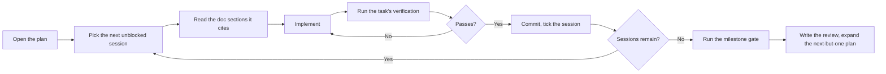
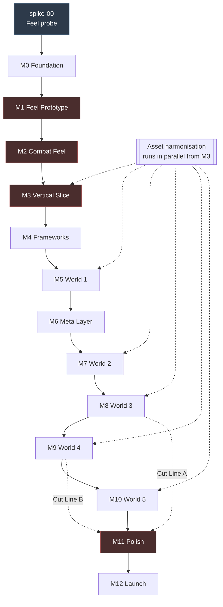

# Implementation Plans

One plan per milestone. Each plan turns a milestone from `docs/17-Roadmap.md` into
numbered, dependency-ordered tasks with files, estimates, and verification steps.

**The docs say _what_. These plans say _in what order, in which files, and how you
know it works_.**

Each milestone lives in its own folder: `plans/<id>/plan.md` (plus extras like results).

---

## The plans

| Plan                                                                 | Milestone           | Duration | Detail     | Status                                   |
| -------------------------------------------------------------------- | ------------------- | -------- | ---------- | ---------------------------------------- |
| [spike-00/plan.md](spike-00/plan.md)                                 | Feel probe (pre-M0) | 1 day    | 🔵 Full    | ✅ Done — [results](spike-00/results.md) |
| [M00-foundation/plan.md](M00-foundation/plan.md)                     | M0 Foundation       | 3 wk     | 🔵 Full    | ✅ Done — [audit](../docs/audits/milestone-M0.md) |
| [M01-feel-prototype/plan.md](M01-feel-prototype/plan.md)             | M1 Feel Prototype   | 5 wk     | 🔵 Full    | 🔄 In progress · next **M1-S11** (`M1-T11`) · S01–S10 done · Checkpoint B |
| [M02-combat-feel/plan.md](M02-combat-feel/plan.md)                   | M2 Combat Feel      | 4 wk     | 🔵 Full    | ⬜ Not started                           |
| [M03-vertical-slice/plan.md](M03-vertical-slice/plan.md)             | M3 Vertical Slice   | 5 wk     | 🔵 Full    | ⬜ Not started                           |
| [M04-frameworks/plan.md](M04-frameworks/plan.md)                     | M4 Frameworks       | 4 wk     | 🔵 Full    | ⬜ Not started                           |
| [M05-world-1/plan.md](M05-world-1/plan.md)                           | M5 World 1          | 4 wk     | 🟡 Medium  | ⬜ Not started                           |
| [M06-meta-layer/plan.md](M06-meta-layer/plan.md)                     | M6 Meta Layer       | 4 wk     | 🟡 Medium  | ⬜ Not started                           |
| [M07-world-2/plan.md](M07-world-2/plan.md)                           | M7 World 2          | 4 wk     | ⚪ Outline | ⬜ Not started                           |
| [M08-world-3/plan.md](M08-world-3/plan.md)                           | M8 World 3          | 4 wk     | ⚪ Outline | ⬜ Not started                           |
| [M09-world-4/plan.md](M09-world-4/plan.md)                           | M9 World 4          | 5 wk     | ⚪ Outline | ⬜ Not started                           |
| [M10-world-5/plan.md](M10-world-5/plan.md)                           | M10 World 5         | 5 wk     | ⚪ Outline | ⬜ Not started                           |
| [M11-polish-accessibility/plan.md](M11-polish-accessibility/plan.md) | M11 Polish & A11y   | 3 wk     | 🟡 Medium  | ⬜ Not started                           |
| [M12-launch/plan.md](M12-launch/plan.md)                             | M12 Launch          | 2 wk     | 🟡 Medium  | ⬜ Not started                           |

---

## Why the detail tapers

**Planning month ten in task-level detail today is waste.** By the time M9 arrives,
five milestones of measured reality will have changed the estimates, the content rate,
and possibly the scope (cut lines at M7 and M9 exist precisely because of this).

So:

| Detail         | Applies To                    | Contains                                                                             |
| -------------- | ----------------------------- | ------------------------------------------------------------------------------------ |
| 🔵 **Full**    | The next 2–3 milestones       | Numbered tasks, files to create, hour estimates, dependencies, per-task verification |
| 🟡 **Medium**  | Milestones with novel work    | Task groups, key files, day-level estimates, the hard parts called out               |
| ⚪ **Outline** | Repetitive content milestones | Structure, deliverables, known risks, and a pointer to the template plan             |

**Expansion rule:** at each milestone gate, expand the _next-but-one_ plan from its
current level to 🔵 Full. So closing M2 means expanding M4 to full detail.

The outline plans (M7–M10) are all the same shape — build a world — and
[M05-world-1/plan.md](M05-world-1/plan.md) is the template they expand from.

---

## How to work a plan

**Sessions beat milestones.** A full milestone plan (especially M1) is a queue, not a
single piece of work. Prefer one session per sitting. M1 defines `M1-S01`…`M1-S23` in
[M01-feel-prototype/plan.md](M01-feel-prototype/plan.md); stop at each ▶ checkpoint and play.

**Task IDs are stable.** `M2-T7` means milestone 2, task 7, forever. Commit messages
and issues reference them. Tasks are never renumbered; a cut task is struck through
and left in place.

**Estimates are hours of focused work**, not elapsed days. The roadmap assumes ~30
productive hours a week (`docs/17-Roadmap.md` §3 P6), so a 40-hour milestone is
roughly a week and a half.

---

## The milestone gate

Every plan ends with the same four-hour close procedure (`docs/17-Roadmap.md` §6.1):

1. **Automated** — full CI + `npm run test:pillars`
2. **Pillar Audit** — 1 h (`docs/02-Game-Pillars.md` §6.2)
3. **Minimum-hardware pass** — 1 h (`docs/15-Performance.md` §9.4)
4. **External playtest** — 1 h, someone who did not build it
5. **Deletion Test** — M3, M6, M9, M11 only (`docs/12-Portfolio-System.md` §5.1)
6. **Exit-gate checklist** — every box ticked, or a recorded cut/date change
7. **Tag, archive audits, write the review, expand the next-but-one plan**

**Status sync is one pass.** When closing a milestone or updating docs after ship,
also update that milestone’s `plan.md` (status, preconditions, exit gate, post-gate)
in the same change set. Agents: follow
[`.cursor/skills/milestone-doc-sync/SKILL.md`](../.cursor/skills/milestone-doc-sync/SKILL.md).

**A milestone does not close with a failing pillar or an unticked gate box.** The
options are: fix it, cut scope (record an ADR), or move the date (record an ADR).
Not "close it anyway."

---

## Dependency graph

Red = critical path with a hard end date. A slip here is absorbed by a cut line, never by extending the schedule.

---

## Parallel track: assets

Asset work does not fit the milestone sequence cleanly — it has long lead times and
blocks content milestones. It runs as a parallel track with its own checkpoints:

| When                 | Asset work                                                                        | Blocks                                        |
| -------------------- | --------------------------------------------------------------------------------- | --------------------------------------------- |
| **Now (spike week)** | Download and Gate-1 the four hero packs. Measure density, check for `hurt`        | Nothing yet, but findings change M3 estimates |
| **M2**               | Gate-1 the Skeleton pack                                                          | M2-T9                                         |
| **M3**               | Harmonise Knight, Skeleton, Green Zone, Nature bg, VFX (~25 h)                    | M3                                            |
| **M5**               | Collectibles and props (~10 h)                                                    | M5                                            |
| **M6**               | GUI kit + icons (~34 h) — **largest custom-art risk**                             | M6                                            |
| **M7**               | Autumn Forest, Werewolf, Fairy Tale bg (~15 h)                                    | M7                                            |
| **M8**               | Graveyard, Yokai, Witch (~17 h)                                                   | M8                                            |
| **M9**               | Crystal Cave, Orc, Golem (~15 h)                                                  | M9                                            |
| **M10**              | **Castle tileset — unresolved.** Licensed or graveyard-recolour fallback (8–16 h) | M10                                           |

Full estimates and the harmonisation procedure: `docs/04-Art-Direction.md` §8.3,
`docs/05-Asset-Pipeline.md` §9.7.

---

## Cut lines

Two pre-planned scope reductions with dates and trigger thresholds
(`docs/17-Roadmap.md` §8).

|                | Decided at           | Drops          | Saves | Product after               |
| -------------- | -------------------- | -------------- | ----- | --------------------------- |
| **Cut Line A** | M7 close, 2027-03-26 | Worlds 4 and 5 | 10 wk | 12 levels, 3 worlds, ~3 h   |
| **Cut Line B** | M9 close, 2027-05-28 | World 5        | 5 wk  | 16 levels, 4 worlds, ~3.5 h |

**Neither cut orphans a portfolio section.** The last shipped world's boss unlocks
its own section plus any fallbacks (`docs/01-Vision.md` §11). `check-cutlines.ts`
enforces this.

**A cut decision produces an ADR either way** — including the decision _not_ to cut.

---

## Progress

Tick these as milestones close. This is the fastest read of project state.

- [x] spike-00 — feel probe
- [x] M0 — Foundation · gate 2026-08-28
- [ ] M1 — Feel Prototype · gate 2026-10-02 · **constants lock**
- [ ] M2 — Combat Feel · gate 2026-10-30
- [ ] M3 — Vertical Slice · gate 2026-12-04 · **art cost measured**
- [ ] M4 — Frameworks · gate 2027-01-01
- [ ] M5 — World 1 · gate 2027-01-29 · **content rate measured**
- [ ] M6 — Meta Layer · gate 2027-02-26
- [ ] M7 — World 2 · gate 2027-03-26 · **Cut Line A decision**
- [ ] M8 — World 3 · gate 2027-04-23 · **first shippable product**
- [ ] M9 — World 4 · gate 2027-05-28 · **Cut Line B decision**
- [ ] M10 — World 5 · gate 2027-07-02 · **content complete**
- [ ] M11 — Polish & Accessibility · gate 2027-07-23
- [ ] M12 — Launch · 2027-08-06
